# 第02章：模型的创建与调用
讲师：尚硅谷-宋红康
官网：尚硅谷
本章对应的官网文档出处：
英文文档：https://docs.langchain.com/oss/python/langchain/models
中文文档：https://docs.langchain.org.cn/oss/python/langchain/models
## 1、模型调用的准备工作
### 1.1 一张老图看大模型的调用
在LangChain v0.3版本中，提到了Model I/O，包括输入提示(Format)、调用模型(Predict)、输出解析
(Parse)。分别对应着 Prompt Template ， Model 和 Output Parser 。
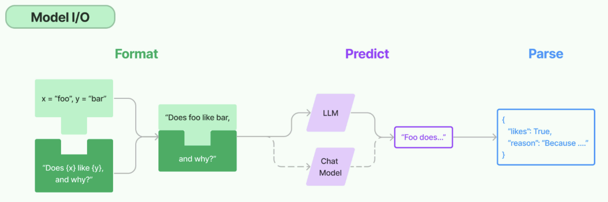

关于模型调用模块，如今对话模型已经是主要形式。从历史上解读：
在GPT-3时代，大模型以 补全模型 为主，只能以类似“成语接龙”的方式对文本进行补全，并且实际运行
效果也 非常不稳定 。此时LangChain借助一些高层封装的API，能够让模型完成对话、调用外部工具、
甚至是结构化输出等功能，为开发者提供了极大的便利。
伴随着GPT-3.5模型的发布， 对话模型 正式登上历史的舞台，并逐渐 成为主流 。而得益于对话模型更
强的指令跟随能力，很多GPT-3需要借助LangChain才能完成的工作，已经成为GPT-3.5原生自带的一些
功能。
所以，本章只提供了对话模型的创建，而没有了非对话模型。
### 1.2 模型初始化的分类方式
简单来说，就是用谁家的API以什么方式创建存放在哪个位置的大模型
**角度1：调用谁家的API**
使用模型提供商的库
使用LangChain统一方式（ 推荐 ）
**角度2：模型初始化时，几个重要参数(如BASE_URL、API-KEY)的书写位置的不同：**
使用配置文件（ 推荐 ）
硬编码：写在代码文件中

**角度3：调用的模型所在位置**
在线部署的大模型
本地部署的大模型
LangChain作为一个“工具”，不提供任何 LLMs，而是依赖于第三方集成各种大模型。这里就看大
模型到底部署在哪里。
### 1.3 线上大模型服务平台
有许多提供大模型API服务的平台，使用时只需要注册、充值并创建API-Key，之后即可使用API-Key与
URL来调用平台提供的相应的模型的服务。
| **平台** | **网址** | **备注** |
| --- | --- | --- |
| OpenRouter | https://openrouter.ai/ | 全球主流,含国外模型 |
| CloseAI | https://platform.closeai-asia.com/ | 亚洲最大,含国外模型 |
| 阿里云百炼 | https://bailian.console.aliyun.com/ | 企业端友好 |
| 硅基流动 | https://www.siliconflow.cn/ | 性价比高，适合个人 |
| 百度千帆 | https://console.bce.baidu.com/qianfan/overview | 主打百度生态 |
| 火山引擎 | https://console.volcengine.com/ark/ | 主打字节多模态生态 |

说明：每个平台配置时，都需要几个要素： 模型名 、 api-key 、 base-url 。
如果大家想使用国外的大模型，就选择前两个；如果只使用国内的大模型，可以选择后四个。
阿里云百炼：所有新用户可获得**超过5000万Tokens的免费额度**及4500张图片生成额度。适合toB
企业用户
硅基流动，号称9B 以下模型永久免费，**开源模型价格低**，适合个人学习。
此外，还有各个模型自己的厂商平台。比如deepseek、智谱等。
OpenRouter是一个第三方镜像站，专门转发大模型厂商的API服务。通过它我们可以间接调用几
乎所有大模型厂商的API服务。支持国内直连。
OpenRouter支持支付宝或微信充值，**最低限额$5，税费$0.8**，此外，如果调用的**模型禁止**在国内
使用，如ChatGPT，则无法通过OpenRouter直接调用（需要Magic），会提示**This** **model** **is** **not**
**available** **in** **your** **region**，根据个人情况，决定是否充值并调用OpenRouter API。
### 1.4 提前安装所有依赖
课程中会涉及到多个库的安装，这里一并声明在 requirements.txt 文件 中。
同时，LangChain的版本变化较快，不同版本之间可能存在兼容问题，为了避免因版本不一致导致的问
题，本课程会通过 requirements.txt 固定主要依赖版本 。
**用法：**将requirements.txt存放到项目所在的目录下，执行
~~~bash
1 (langchain1.2) PS D:\code\workspace_pycharm_llm\langchain1.2_tutorial>
2 pip install -r .\requirements.txt
~~~

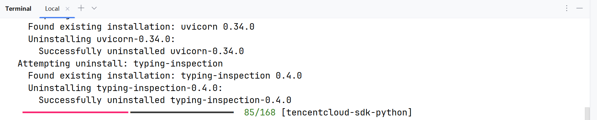

**说明：**课程中的部分章节会单独列出相关依赖，主要是为了帮助大家了解该章节涉及的核心库。 无需重
复安装 ，这些依赖已经统一包含在 requirements.txt 中。
## 2、模型初始化角度1：使用模型提供商库
在 LangChain 中初始化模型，主要可以通过直接**使用特定的Model** **Class**和**使用统一的**
**init_chat_model函数**这两种方式来实现。
这里先讲方式1，这种方式最直接。LangChain为一些大模型供应商提供了专门的Model类，导入对应的
具体类（如 ChatOpenAI、ChatAnthropic、ChatDeepSeek、ChatOllama、ChatHunyuan、
ChatTongyi、ChatZhipuAI）并进行实例化。
官网链接：https://reference.langchain.com/python/langchain-community/chat-models
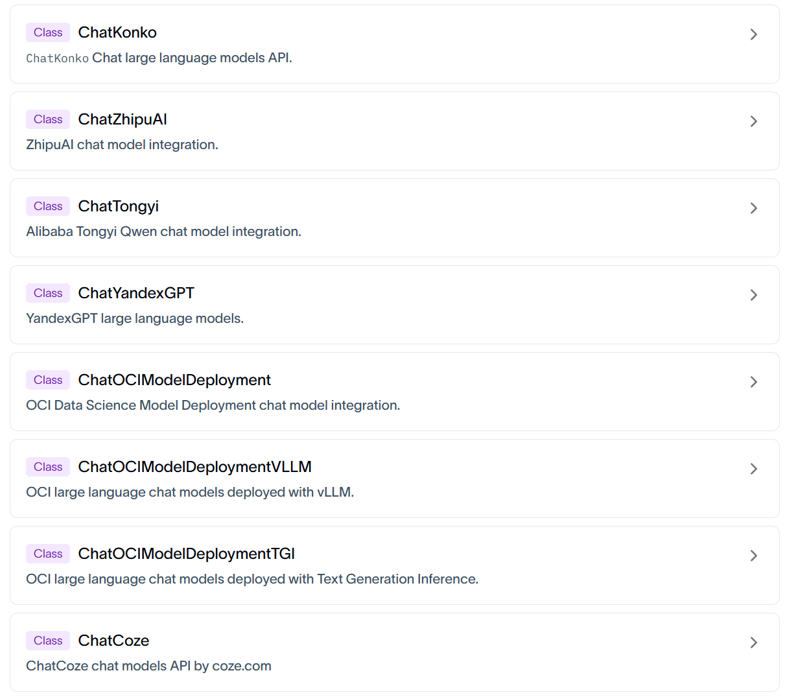

### 2.1 通过专用API调用
注意：使用不同的模型可能传入的参数名称不同，可以参考对应的源码。
#### 2.1.1 DeepSeek大模型
官网：https://www.deepseek.com/
**步骤1：安装必要的依赖(略)**
执行过前面的requirements.txt文件指令的情况下，这里就不需要安装了。
~~~bash
1 #切换python环境
2 conda activate langchain1.2
3
4 #安装ChatOpenAI依赖包
5 pip install langchain-openai
6
7 #安装ChatDeepSeek 依赖包
8 pip install langchain-deepseek
9
10 # 用于环境管理的包
11 pip install python-dotenv
~~~

**说明：**langchain-deepseek 是使用deepseek 大模型必要依赖。
**注意：** langchain-deepseek 依赖于 langchain-openai ，安装前者，pip会自动从pypi拉取元数据解析
依赖，后者也会被安装。所以我们把 langchain-openai 也放在此处。
**步骤2：配置.env文件（明确去deepseek官网获取key)**
在项目根目录下创建.env文件，在.env文件中写入以下内容：
~~~html
1 DEEPSEEK_API_KEY=<Your API Key>
2 DEEPSEEK_BASE_URL=https://api.deepseek.com
~~~

说明：将占位符替换为自己的API_KEY。
**步骤3：读取配置并初始化模型**
这里，我们用DeepSeek的模型进行测试，LangChain会从环境变量中读取DEEPSEEK_API_KEY。如下是
代码实现：
方式1：
~~~python
1 from langchain_deepseek import ChatDeepSeek
2 import os
3
4 from dotenv import load_dotenv
5
6 # 通过load_dotenv()将.env中的变量加载为环境变量
7 # override=True表示：无论你当前的操作系统、终端或者虚拟环境中是否已经存在同名的环境变量，
~~~

都会强行用 .env 文件里写的值去覆盖它
~~~python
8 load_dotenv(override=True)
9
10 # 从环境变量读取配置
11 DEEPSEEK_API_KEY = os.getenv("DEEPSEEK_API_KEY")
12 DEEPSEEK_BASE_URL = os.getenv("DEEPSEEK_BASE_URL")
~~~

~~~python
13
14 # 创建DeepSeek LLM
15 deepseek_llm = ChatDeepSeek(
16 api_key=DEEPSEEK_API_KEY,
17 api_base=DEEPSEEK_BASE_URL, # 注意：这里是api_base，不是base_url
18 model_name="deepseek-v4-flash",
19 )
20
21 print(deepseek_llm.invoke("请介绍一下你自己"))
~~~

基于模型集成手册和LangChain Reference的API参考页ChatDeepSeek可知相关的配置参数。
方式2：优化，依靠默认行为读取 .env 环境变量
~~~python
1 from langchain_deepseek import ChatDeepSeek
2
3 from dotenv import load_dotenv
4
5 # 从.env文件中加载环境变量
6 # override=True 确保.env文件优先
7 load_dotenv(override=True)
8
9 # 创建DeepSeek LLM
10 deepseek_llm = ChatDeepSeek(
11 model="deepseek-v4-flash",
12 )
13
14 print(deepseek_llm.invoke("请介绍一下你自己"))
~~~

调用ChatDeepSeek要求系统存在名为DEEPSEEK_API_KEY的环境变量。URL通过源码可以查看，
有默认值。如下：
~~~yaml
1 api_key: SecretStr | None = Field(
2 default_factory=secret_from_env("DEEPSEEK_API_KEY",
3 default=None),
4 )
5 """DeepSeek API key"""
6 api_base: str = Field(
7 default_factory=from_env("DEEPSEEK_API_BASE",
8 default=DEFAULT_API_BASE),
9 )
10 """DeepSeek API base URL"""
11
12 DEFAULT_API_BASE = "https://api.deepseek.com/v1"
~~~

方式3：硬编码方式（不推荐）

~~~python
1 from langchain_deepseek import ChatDeepSeek
2
3 # 创建DeepSeek LLM
4 deepseek_llm = ChatDeepSeek(
5 api_key="sk-2nkIWkv6M...U1Ra4P0NGa", # 明文暴露密钥
6 api_base="https://api.deepseek.com",
7 model="deepseek-v4-flash",
8 )
9
10 print(deepseek_llm.invoke("请介绍一下你自己"))
~~~

直接将 API Key 和模型参数写入代码，**仅适用于临时测试**，存在密钥泄露风险，在 生产环境不推荐 。
相比来讲，.env配置文件方式，生产环境推荐，配置文件可加入 .gitignore 避免泄露。
#### 2.1.2 智谱大模型
官网：https://www.bigmodel.cn/
**相关依赖：**
~~~bash
1 # 安装 Langchain 社区依赖包，包含ChatHunyuan、ChatTongyi、ChatZhipuAI
2 pip install langchain-community
3
4 # ChatZhipuAI / 智谱 AI 认证相关依赖
5 pip install pyjwt
~~~

**环境变量：**
在.env中补充
~~~html
1 ZHIPUAI_API_KEY=<Your API Key>
2 ZHIPUAI_BASE_URL=https://open.bigmodel.cn/api/paas/v4/
~~~

确保余额或免费额度大于零。
**举例：**
~~~python
1 from langchain_community.chat_models import ChatZhipuAI
2 from dotenv import load_dotenv
3
4 # override=True 确保.env文件优先
5 load_dotenv(override=True)
6
7 ZHIPUAI_API_KEY = os.getenv("ZHIPUAI_API_KEY")
8 ZHIPUAI_BASE_URL = os.getenv("ZHIPUAI_BASE_URL")
9
10 zhipu_llm = ChatZhipuAI(
11 model="glm-5.1",
12 api_base=ZHIPUAI_BASE_URL, #可选
13 api_key=ZHIPUAI_API_KEY #可选
14 )
15
16 print(zhipu_llm.invoke("请介绍一下你自己"))
~~~

#### 2.1.3 千问大模型
通过阿里云百炼平台调用，官网：https://bailian.console.aliyun.com/
**相关依赖：**
~~~bash
1 #切换python环境
2 conda activate langchain1.2
3
4 # ChatTongyi / 阿里通义千问依赖包
5 pip install dashscope
~~~

**环境变量：**
在.env中补充
~~~html
1 DASHSCOPE_API_KEY=<Your API Key>
~~~

**注意**：一般不要添加这样的环境变量
DASHSCOPE_BASE_URL=https://dashscope.aliyuncs.com/compatible-mode/v1
百炼平台提供了两种访问方式：专用SDK和OpenAI兼容接口，上述URL是为后者准备的，而ChatTongyi
底层是基于专用SDK实现的，如果指定了上述URL，则运行报错
~~~yaml
1 Traceback...
2 ConnectionError: ('Connection aborted.', ConnectionResetError(10054, '远
程主机强迫关闭了一个现有的连接。', None, 10054, None))
~~~

**举例：**
~~~python
1 import os
2 from langchain_community.chat_models import ChatTongyi
3
4 from dotenv import load_dotenv
5
6 # override=True 确保.env文件优先
7 load_dotenv(override=True)
8
9 DASHSCOPE_API_KEY = os.getenv("DASHSCOPE_API_KEY")
10
11 tongyi_llm = ChatTongyi(
12 api_key=DASHSCOPE_API_KEY,
13 model="qwen-plus",
14 )
15
16 print(tongyi_llm.invoke("请介绍一下你自己"))
~~~

### 2.2 兼容用法
一方面，LangChain没有为所有大模型厂商提供专用接口，见Langchain大模型集成列表。如果选用的
平台没有专用接口，可以通过兼容接口调用。
另一方面，专用接口的对接方式五花八门，如腾讯混元的ChatHunyuan需要单独的 APP_ID + SecretId
+ SecretKey ，配置繁琐，用户不友好。

**结论：大多数API平台都支持OpenAI** **API接口规范，所以基本都可以通过** **ChatOpenAI** **集成。**
举例1：
~~~python
1 from langchain_openai import ChatOpenAI
2
3 load_dotenv(override=True)
4
5 # 通过ChatOpenAI 连接deepseek模型
6 DEEPSEEK_API_KEY = os.getenv("DEEPSEEK_API_KEY")
7 DEEPSEEK_BASE_URL = os.getenv("DEEPSEEK_BASE_URL")
8
9 deepseek_llm2 = ChatOpenAI(
10 api_key=DEEPSEEK_API_KEY,
11 base_url=DEEPSEEK_BASE_URL,
12 model="deepseek-v4-flash",
13 )
14
15 response = deepseek_llm2.invoke("1 + 1 = ？")
16 print(response)
~~~

举例2：
~~~python
1 load_dotenv(override=True)
2
3
4 #通过ChatOpenAI 连接智谱AI模型
5 ZHIPUAI_API_KEY = os.getenv("ZHIPUAI_API_KEY")
6 ZHIPUAI_BASE_URL = os.getenv("ZHIPUAI_BASE_URL")
7
8 zhipu_llm2 = ChatOpenAI(
9 api_key=ZHIPUAI_API_KEY,
10 base_url=ZHIPUAI_BASE_URL,
11 model="glm-5.1",
12 )
13
14 #通过ChatOpenAI 连接通义千问模型
15 DASHSCOPE_API_KEY = os.getenv("DASHSCOPE_API_KEY")
16 DASHSCOPE_BASE_URL = os.getenv("DASHSCOPE_BASE_URL")
17
18 tongyi_llm2 = ChatOpenAI(
19 api_key=DASHSCOPE_API_KEY,
20 base_url=DASHSCOPE_BASE_URL,
21 model="qwen-plus",
22 )
~~~

### 2.3 中转平台
受政策影响，国内无法直接调用国外顶尖的闭源模型，某些复杂任务需要用这些模型实现，此时可以通
过中转平台**曲线救国**。

#### 2.3.1 OpenRouter
官网：https://openrouter.ai/
OpenRouter 是一个多模型 API 聚合平台，提供统一的 OpenAI 兼容接口，可以通过一个 API Key 调用
OpenAI、Claude、Gemini、DeepSeek、Qwen 等不同厂商的大模型。它适合用于模型对比、模型路
由、Agent 应用开发和课程实验。
是目前知名度最高的中转平台。但是使用的话，需要tizi（即魔法，大家都懂的）
**相关依赖：**
~~~bash
1 # OpenRouter 模型集成
2 pip install langchain-openrouter
~~~

**环境变量：**
~~~html
1 OPENROUTER_API_KEY=<YOUR_API_KEY>
2 OPENROUTER_API_BASE=https://openrouter.ai/api/v1
~~~

**举例：**
LangChain 当前版本为 OpenRouter 提供了专用集成： ChatOpenRouter 。
~~~python
1 from langchain_openrouter import ChatOpenRouter
2 from dotenv import load_dotenv
3 import os
4
5 load_dotenv(override=True)
6
7 OPENROUTER_API_KEY = os.getenv("OPENROUTER_API_KEY")
8 # OPENROUTER_API_BASE = os.getenv("OPENROUTER_API_BASE")
9
10 model = ChatOpenRouter(
11 model="deepseek/deepseek-v4-flash",
12 api_key=OPENROUTER_API_KEY,
13 # base_url=OPENROUTER_API_BASE,
14 )
15
16 print(model.invoke("一句话介绍下你自己"))
~~~

当然也可以使用ChatOpenAI的方式进行调用。如下：
~~~python
1 from dotenv import load_dotenv
2 from langchain_openai import ChatOpenAI
3 import os
4
5 load_dotenv(override=True)
6
7 OPENROUTER_API_KEY = os.getenv("OPENROUTER_API_KEY")
8 OPENROUTER_API_BASE = os.getenv("OPENROUTER_API_BASE")
9
10 model = ChatOpenAI(
11 model="deepseek/deepseek-v4-flash",
12 api_key=OPENROUTER_API_KEY,
13 base_url=OPENROUTER_API_BASE,
~~~

~~~python
14 )
15
16 print(model.invoke("一句话介绍下你自己"))
~~~

**补充说明：账户充值**

#### 2.3.2 CloseAI
官网：https://www.closeai-asia.com/
CloseAI 是一个面向国内用户的 AI API 中转平台，提供 OpenAI、Claude、Gemini 等模型接口的代理访
问能力。它适合用于解决国内网络访问、支付和接口统一管理等问题，常用于大模型应用开发、教学演
示和测试环境。
LangChain没有为CloseAI提供专用集成，可以通过ChatOpenAI兼容接口调用。
举例：
~~~python
1 from dotenv import load_dotenv
2 from langchain_openai import ChatOpenAI
3 import os
~~~

~~~python
4
5 load_dotenv(override=True)
6
7 CLOSEAI_API_KEY = os.getenv("CLOSEAI_API_KEY")
8 CLOSEAI_BASE_URL = os.getenv("CLOSEAI_BASE_URL")
9
10 model = ChatOpenAI(
11 # model="gpt-5-mini",
12 model="deepseek-v4-flash",
13 api_key=CLOSEAI_API_KEY,
14 base_url=CLOSEAI_BASE_URL,
15 )
16
17 print(model.invoke("欧盟都有哪些国家"))
~~~

## 3、模型初始化角度1：init_chat_model()
init_chat_model 是 LangChain 1.x 中推出的用于初始化聊天模型的**统一接口**。只要是LangChain支持
的模型都可以处理，它会根据模型名称自动选择对应的模型类初始化实例。
**基本语法：**
~~~python
1 from langchain.chat_models import init_chat_model
2
3 model = init_chat_model(
4 "provider:model_name", # 提供商:模型名称
5 api_key="your-api-key", # API 密钥（可选，可从环境变量读取）
6 temperature=0.7, # 温度参数（可选）
7 max_tokens=1000, # 最大 token 数（可选）
8 **kwargs # 其他模型特定参数
9 )
~~~

**问题：** **init_chat_model** **和直接使用** **ChatTongyi、ChatOpenAI、ChatDeepSeek有什么区别？**
**回答：** init_chat_model 是 LangChain 1.0 的统一接口，优势包括：
统一接口：无需记住每个提供商的不同初始化方式（以一致的方式初始化）
易于切换：简化了智能体系统中模型切换策略（只需修改模型字符串）
简洁明了：更简洁的语法，减少样板代码
自动适配：内部根据模型标识自动选择对应的驱动类(ChatOpenAI、ChatDeepSeek)
图示：
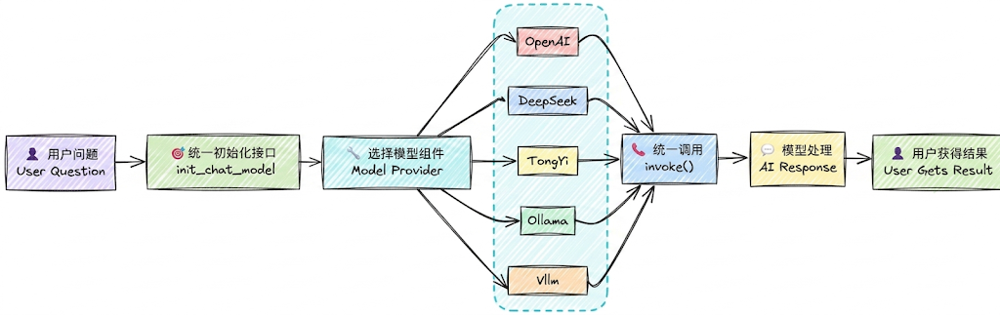

### 3.1 使用举例
举例1：调用DeepSeek官网的大模型
~~~python
1 import os
2 from langchain.chat_models import init_chat_model
3 from dotenv import load_dotenv
4
5 # 从.env文件中加载环境变量
6 load_dotenv(override=True)
7
~~~

8 # 从环境变量读取配置
~~~python
9 DEEPSEEK_API_KEY = os.getenv("DEEPSEEK_API_KEY")
10 DEEPSEEK_BASE_URL = os.getenv("DEEPSEEK_BASE_URL")
11
12
13 model = init_chat_model(model="deepseek:deepseek-v4-flash",
14 #model_provider="deepseek",
15 api_key=DEEPSEEK_API_KEY,
16 base_url=DEEPSEEK_BASE_URL)
17 # 向模型发送单条数据
18 response = model.invoke("你好，用一句话回答")
19 # 打印响应
20 print(response)
~~~

当我们传递的模型名称为 deepseek-v4-flash 时，init_chat_model会自动调用ChatDeepSeek初始化模
型实例，和直接通过ChatDeepSeek初始化的效果完全一致。
举例2：调用阿里百炼大模型
环境变量
~~~html
1 DASHSCOPE_BASE_URL=https://dashscope.aliyuncs.com/compatible-mode/v1
2 DASHSCOPE_API_KEY=<YOUR_API_KEY>
~~~

代码：
~~~python
1 from langchain.chat_models import init_chat_model
2 from dotenv import load_dotenv
3 import os
4
5 load_dotenv(override=True)
6
7 DASHSCOPE_API_KEY=os.getenv("DASHSCOPE_API_KEY")
8 DASHSCOPE_BASE_URL=os.getenv("DASHSCOPE_BASE_URL")
9
10 model = init_chat_model(model="qwen-plus",
11 model_provider="openai",
12 api_key=DASHSCOPE_API_KEY,
13 base_url=DASHSCOPE_BASE_URL)
14
15 print(model.invoke("你好，用一句话回答"))
~~~

举例3：调用CloseAI中转平台大模型
环境变量

~~~html
1 CLOSEAI_API_KEY=<YOUR_API_KEY>
2 CLOSEAI_BASE_URL=https://api.openai-proxy.org/v1
~~~

代码：
~~~python
1 from langchain.chat_models import init_chat_model
2 from dotenv import load_dotenv
3 import os
4
5 load_dotenv(override=True)
6
7 CLOSEAI_API_KEY=os.getenv("CLOSEAI_API_KEY")
8 CLOSEAI_BASE_URL=os.getenv("CLOSEAI_BASE_URL")
9
10 model = init_chat_model(model="deepseek-v4-flash",
11 model_provider="openai",
12 api_key=CLOSEAI_API_KEY,
13 base_url=CLOSEAI_BASE_URL)
14
15 print(model.invoke("你好，用一句话回答"))
~~~

**问题1：model_provider支持哪些provider？**
model_provider 表示模型的提供者，支持的providers有： anthropic , anthropic_bedrock,
azure_ai, azure_openai, bedrockbedrock_converse, cohere, deepseek , fireworks,
google_anthropic_vertex, google_genai, google_vertexaigrog, huggingface, ibm, mistralai, nvidia,
ollama , openai , openrouter , perplexity, together, upstage, xai。
如果 model_provider="openai" ，会自动加载 langchain-openai 的依赖包，底层调用的是
ChatOpenAI 类。
如果 model_provider="deepseek" ，会自动加载 langchain-deepseek 的依赖包，底层调用的
是 ChatDeepSeek 类。
像阿里的 dashscope 尚未被LangChain官方纳入模型的统一注册体系，暂时不知
道"dashscope"的提供者是谁。此时可以将model_provider设置为openai，底层将会用openai的
规范处理请求，这就要求我们调用的模型服务是OpenAI Compatible的。
**问题2：如果在model参数中没有指明模型提供者，必须在model_provider中指明？**
可以在model参数中通过前缀指定模型供应商，和模型名称之间用 冒号分割 ，等价于通过
model_provider参数指定供应商。如果两个位置都没有指明供应商，LangChain底层会按照内置规则自
动推断。
但是，并非所有的模型都支持自动推断，如model名称 qwen-plus 不支持自动推断，没有指明供应商会
报错。
### 3.2 小结：模型的创建

~~~python
1 DeepSeek官网的DeepSeek模型：可以调用ChatDeepSeek()、ChatOpenAI()、
init_chat_model()三种方式
2
3 阿里云百炼平台的DeepSeek模型：可以调用ChatTongyi()、ChatOpenAI()、init_chat_model()
~~~

三种方式
~~~python
4
5 OpenRouter平台的DeepSeek模型：可以调用ChatOpenRouter()、ChatOpenAI()、
init_chat_model()三种方式
6
7 CloseAPI平台的DeepSeek模型：可以调用ChatOpenAI()、init_chat_model() 两种方式
~~~

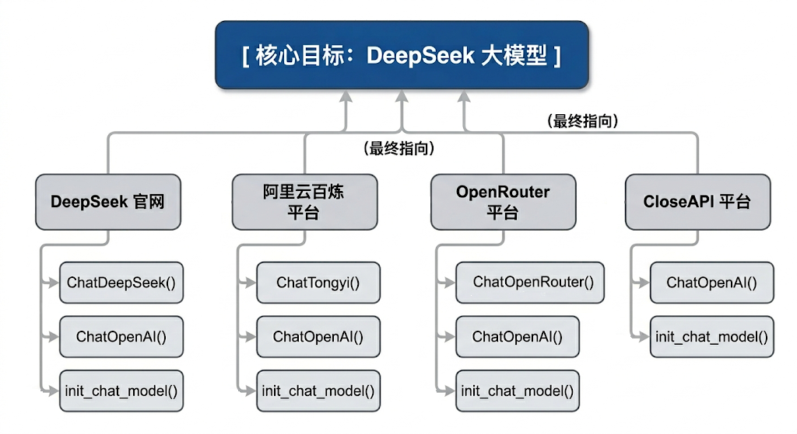

### 3.3 模型初始化参数(常用版)
在LangChain中，Model Class 和init_chat_model初始化模型共同的参数及解释。
API文档：https://docs.langchain.org.cn/oss/python/langchain/models#parameters

| **参数** | **类型** | **说明** | **默认值** |
| --- | --- | --- | --- |
| model | str | 使用的特定提供商的模型名称(必需)。 比如：openai:gpt-4o、groq:gemma2-9b-it | 无 |
| model_provider | str | 模型提供商名称 | 无 |
| api_key | str | API 密钥。如果不提供，会从环境变量中读取（如 DEEPSEEK_API_KEY ） | None |
| base_url | str | 大模型供应商API请求地址。 | None |
| temperature | float | 控制输出随机性，范围 0.0-2.0，温度越高输出越随 机。 - 0.0 ：最确定性，输出几乎不变 - 1.0 ：平衡创造性和一致性 - 2.0 ：最随机，最有创造性 | 0.7 |
| max_tokens | int | 限制模型输出的最大 token 数量 | None |
| timeout | float | 超时时间（秒），超时未响应，请求会被取消。 | None |
| max_retries | int | 请求失败（如网络问题、速率限制）时的最大重试次 数 | 6 |

说明：
**1、temperature** **参数根据使用场景选择：**
**0.0-0.3**：需要一致性、准确性的任务（数学计算、数据提取、分类、代码生成）
**0.5-0.7**：平衡创造性和一致性（聊天、问答）
**0.8-1.5**：创造性任务（写作、头脑风暴）
**1.5-2.0**：高度创造性（诗歌、故事创作）
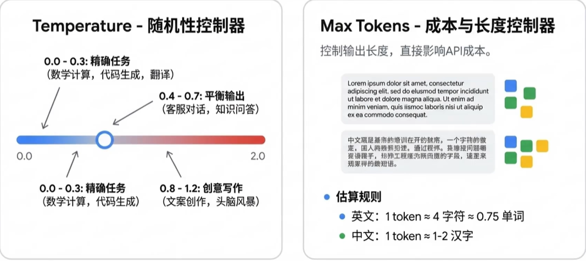

举例：
~~~python
1 from langchain.chat_models import init_chat_model
2 from dotenv import load_dotenv
3 import os
4 # 从.env文件中加载环境变量
5 load_dotenv(override=True)
6
~~~

~~~python
7 model = init_chat_model(
8 # model="gpt-5.4-mini",
9 model="deepseek-v3.2",
10 model_provider="openai",
11 temperature=0,
12 api_key=os.getenv("CLOSEAI_API_KEY"),
13 base_url=os.getenv("CLOSEAI_BASE_URL"),
14 )
15 # 向模型发送单条数据
16 for i in range(3):
17 response = model.invoke("帮我写一首描述春天的七言绝句诗")
18 # 打印响应
19 print(response.content)
~~~

|  | **《春晓》 东君巡野过青岑，一岭云霞一岭金。 最是多情溪畔柳，偷藏莺语送行人。 注：我的创作思路是通过“东君巡野”、“云霞鎏金”等意象展现春日山川的瑰丽，以拟人手法赋予 自然灵性。后两句聚焦溪柳藏莺的细节，以“偷”字点破春的俏皮，结句“送行人”将画面延伸至画 外，留有余韵。全诗色彩明丽，动静相生，试图在传统春景题材中注入轻盈的巧思。 《春晓》 东君巡野过青岑，一岭云霞一岭金。 最是多情溪畔柳，偷藏莺语送行人。 注：我的创作思路是通过“东君巡野”、“云霞鎏金”等意象展现春日山川的瑰丽，以拟人手法赋予 溪柳灵性，借“偷藏莺语”传递春日的生机与含蓄情韵。诗中“巡”、“藏”、“送”等动词的运用，使 静态春景流动起来，末句以行人视角收束，留有余味。 《七绝·春晓》 一夜东风万树花，清溪破冻响琵琶。 莺啼柳浪云烟湿，人在春山第几家。 注：诗中“东风”、“万树花”展现春的蓬勃，“清溪破冻”以动衬静，暗喻生机复苏。后两句以莺啼 柳浪、云烟湿翠勾勒朦胧春色，尾句以问作结，平添寻春之趣与悠然余韵，全篇动静相宜，远近交 叠，尽显春之生意。** |
| --- | --- |
|  |  |
| ，设 |  |

作为对比：
~~~python
1 from langchain.chat_models import init_chat_model
2 from dotenv import load_dotenv
3 import os
4 # 从.env文件中加载环境变量
5 load_dotenv(override=True)
6
7 model = init_chat_model(
8 # model="gpt-5.4-mini",
9 model="deepseek-v3.2",
10 model_provider="openai",
11 temperature=1.5,
12 api_key=os.getenv("CLOSEAI_API_KEY"),
13 base_url=os.getenv("CLOSEAI_BASE_URL"),
14 )
15 # 向模型发送单条数据
16 for i in range(3):
17 response = model.invoke("帮我写一首描述春天的七言绝句诗")
~~~

~~~python
18 # 打印响应
19 print(response.content)
~~~

|  | **《壬寅仲春即事》 东君醉酒泼彤云，一岭胭脂一岭曛。 怪道莺声啼不彻，枝头烧作石榴裙。 注：诗中“东君”代指春神，以其醉意泼洒彩霞为喻，形象展现春色之浓郁灵动。后两句通过莺啼 不绝与石榴裙的巧妙联想，以火焰比喻花海翻腾之势，全诗在传统春景描绘中融入奇幻色彩，浪漫 笔法间尽显春之热烈与生机盎然。 《春溪行》 东君遣暖润青苔，波光潋滟载云回。 莫道残寒犹料峭，一枝红蕊过溪来。 注：全诗以碧溪破冰、波光载云的视觉变化，展现初春的流动生机。后两句用“残寒料峭”与“红蕊 过溪”形成冷峻与热烈的鲜明对比，通过拟人化技法使春色具有冲破束缚的动势，暗合人生际遇中 希望常在的哲思。 《仲春野行》 东君遣煦渥郊乡，粉李绯桃竞试妆。 最赏青畴酥雨足，一犁烟水伴牛驮。 注：本诗以传统笔法勾勒春景，通过“东君遣煦”、“桃李试妆”展现春神的雍容与百花的娇媚。后 两句转写田园，以“酥雨”、“犁烟”意象突出春耕时节泥土的润泽与生机，牛驮微雨中缓行的画 面，传递出深邃而醇厚的自然生趣。** |
| --- | --- |
|  |  |
| 场景 |  |

~~~python
1 from langchain.chat_models import init_chat_model
2 from dotenv import load_dotenv
3 import os
4 # 从.env文件中加载环境变量
5 load_dotenv(override=True)
6
7 model = init_chat_model(
8 model="deepseek-v3.2",
9 model_provider="openai",
10 temperature=0,
11 api_key=os.getenv("CLOSEAI_API_KEY"),
12 base_url=os.getenv("CLOSEAI_BASE_URL"),
13 )
14 # 向模型发送单条数据
15 response = model.invoke("张三，男，30岁，拥有8年编程开发经验，目前在某互联网大厂担任技
~~~

术专家。帮我从上文中提取数据，返回JSON格式")
~~~python
16 print(response.content)
1 {
2 "name": "张三",
3 "gender": "男",
4 "age": 30,
5 "programming_experience_years": 8,
6 "current_position": "技术专家",
7 "current_company_type": "互联网大厂"
8 }
~~~

使用场景：创意文案与头脑风暴

~~~python
1 from langchain.chat_models import init_chat_model
2 from dotenv import load_dotenv
3 import os
4 # 从.env文件中加载环境变量
5 load_dotenv(override=True)
6
7 model = init_chat_model(
8 model="deepseek-v3.2",
9 model_provider="openai",
10 temperature=1.5,
11 api_key=os.getenv("CLOSEAI_API_KEY"),
12 base_url=os.getenv("CLOSEAI_BASE_URL"),
13 )
14 # 向模型发送单条数据
15 response = model.invoke("请为一款极致静音的机械键盘写3个充满诗意且极具张力的广告语。")
16 print(response.content)
1 1. **「指尖落下无声诗，每个字都沉入深海」**
~~~

2 *奔赴思绪的静谧领域，让敲击成为心流的涟漪*
~~~text
3
4 2. **「在银桦雪原上耕种文字，唯留耕者的呼吸」**
~~~

5 *以失声的机械之齿，驯服每一次破晓的灵感*
~~~text
6
~~~

7 3. **「当键盘学会芭蕾，世界只剩文案绽放的轻重音」**
8 *精密弹力悬浮于声学悬空层，触感在寂静中震耳欲聋*
~~~text
9
10 ---
11
~~~

12 注：广告语核心将“静音”属性诗化为**创作禅境、自然隐喻与艺术比拟**，通过矛盾张力（如
“失声的机械”“寂静中震耳欲聋”）强化产品颠覆性，适用于高端文创/科技消费场景。
**2、Token是什么？**
基本单位 : 大模型通过分词器（Tokenizer）将文本拆分后的最小语义单元是token（相当于自然语言中
的词或字）。不同的模型采用不同的 分词算法 （如BPE、WordPiece），因此同一段文本在不同模型中
的Token数量可能不同。
收费依据 ：大语言模型通常也是以token的数量作为其计量（或收费）的依据。
1个中文Token≈1-1.8个汉字，1个英文Token≈3-4个字符
Token与字符转化的可视化工具：
OpenAI提供：https://platform.openai.com/tokenizer
百度智能云提供：https://console.bce.baidu.com/support/#/tokenizer
举例：
~~~python
1 from langchain.chat_models import init_chat_model
2 from dotenv import load_dotenv
3 import os
4 # 从.env文件中加载环境变量
5 load_dotenv(override=True)
6
7 model = init_chat_model(
8 # model="gpt-5.4-nano",
9 model="gpt-5.4-mini",
10 # temperature=0.7,
~~~

~~~python
11 api_key=os.getenv("CLOSEAI_API_KEY"),
12 base_url=os.getenv("CLOSEAI_BASE_URL"),
13 max_tokens=15,
14 )
15 # 向模型发送单条数据
16 response = model.invoke("请用中文详细介绍什么是AI")
17 # 打印响应
18 print(response)
19
20 # print(response.content)
21 # print(response.response_metadata["finish_reason"])
1 content='当然可以。下面我用中文尽量系统、通' additional_kwargs={'refusal':
None} response_metadata={'token_usage': {'completion_tokens': 15,
'prompt_tokens': 14, 'total_tokens': 29, 'completion_tokens_details':
{'accepted_prediction_tokens': 0, 'audio_tokens': 0, 'reasoning_tokens':
0, 'rejected_prediction_tokens': 0}, 'prompt_tokens_details':
{'audio_tokens': 0, 'cached_tokens': 0}, 'latency_checkpoint':
{'engine_tbt_ms': 5, 'engine_ttft_ms': 29, 'engine_ttlt_ms': 109,
'pre_inference_ms': 83, 'service_tbt_ms': 4, 'service_ttft_ms': 279,
'service_ttlt_ms': 336, 'total_duration_ms': 261,
'user_visible_ttft_ms': 196}}, 'model_provider': 'openai', 'model_name':
'gpt-5.4-mini-2026-03-17', 'system_fingerprint': None, 'id': 'chatcmpl-
Dg3tYDOZ1xWSR3EaTX8jlM58yUSq2', 'service_tier': 'default',
'finish_reason': 'length', 'logprobs': None} id='lc_run--019e2fb9-11b0-
7901-9076-a45fc0b41125-0' tool_calls=[] invalid_tool_calls=[]
usage_metadata={'input_tokens': 14, 'output_tokens': 15, 'total_tokens':
29, 'input_token_details': {'audio': 0, 'cache_read': 0},
'output_token_details': {'audio': 0, 'reasoning': 0}}
~~~

## 4、模型初始化角度3：本地模型的部署与调用
### 4.1 Ollama的介绍
LangChain也支持使用 Ollama 、 vLLM 等框架启动的本地大模型。这里以Ollama为例进行演示。
Ollama是在Github上的一个开源项目，其项目定位是：**一个本地运行大模型的集成框架**，可以实现如
Qwen、Deepseek 等主流大模型的下载、启动和本地运行的自动化部署及推理流程。
Ollama官方地址：https://ollama.com
产品定位：

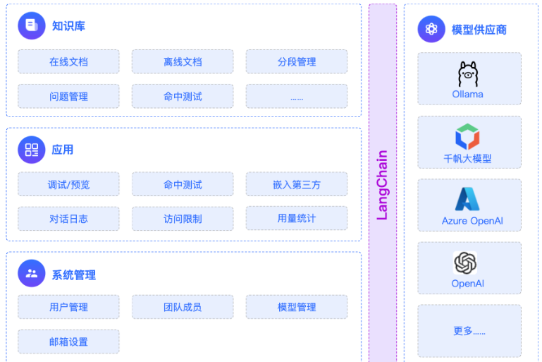

### 4.2 Ollama的下载-安装
Ollama项目支持跨平台部署，目前已兼容Mac、Linux和Windows操作系统。
无论使用哪个操作系统，Ollama项目的安装过程都设计得非常简单。
访问 https://ollama.com/download 下载对应系统的安装文件。
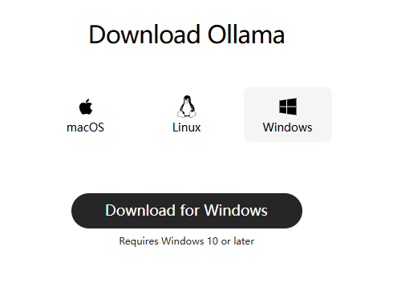

**Linux** **系统执行以下命令安装：**
~~~text
1 curl -fsSL https://ollama.com/install.sh | sh
~~~

这行命令的目的是从 https://ollama.com/ 网站读取 install.sh 脚本，并立即通过 sh 执行
该脚本，在安装过程中会包含以下几个主要的操作：

检查当前服务器的基础环境，如系统版本等；
下载Ollama的二进制文件；
配置系统服务，包括创建用户和用户组，添加Ollama的配置信息；
启动Ollama服务；
**Windows** **系统的安装过程如下**
手动创建ollama安装目录：首先在你想安装的路径下创建好一个新文件夹，并把ollama的安装包放在里
面。比如我的是：F:\common_tools\Ollama
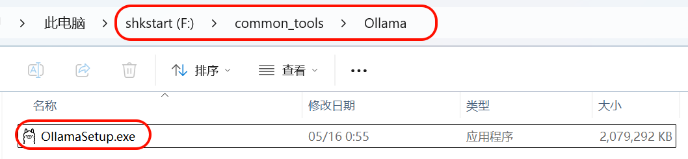

在文件路径上输入cmd 回车后会自动打开命令行窗口：
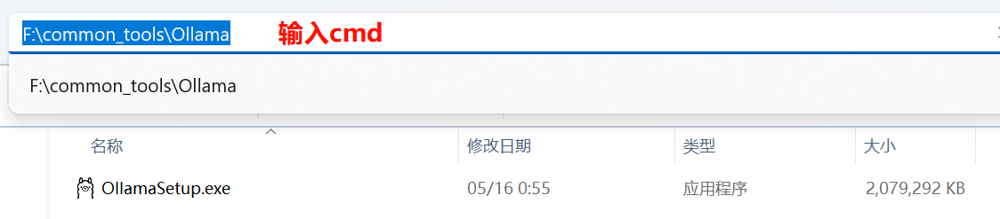

然后在cmd 窗口输入：
~~~text
1 OllamaSetup.exe /DIR=F:\common_tools\Ollama
~~~

语法：软件名称/DIR=这里放你上面创建好的Ollama指定目录
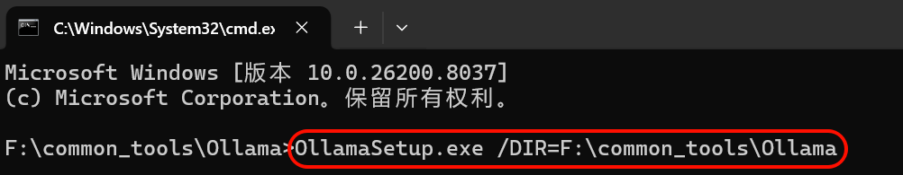

然后Ollama就会进入安装，点击install后，可以看到Ollama的安装路径就变成了我们指定的目录了。
### 4.3 模型的下载
**1、手动设置大模型存储目录：**
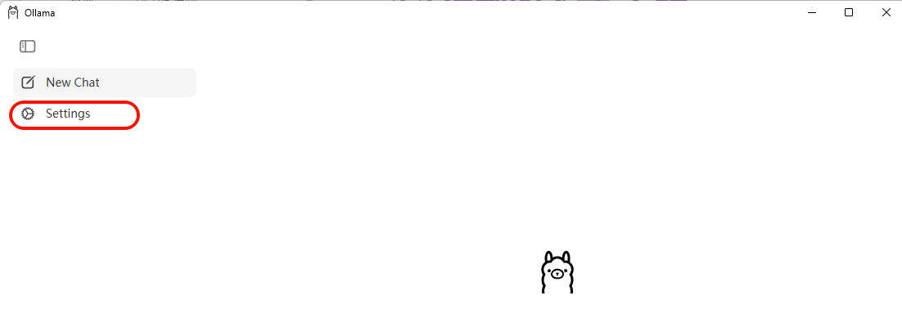

指明大模型要下载到的本地目录位置
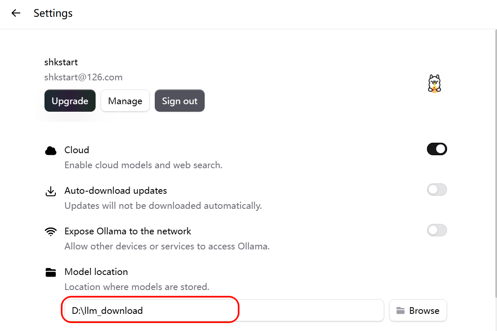

**2、模型的下载**
方式1：直接在图形化界面位置下载
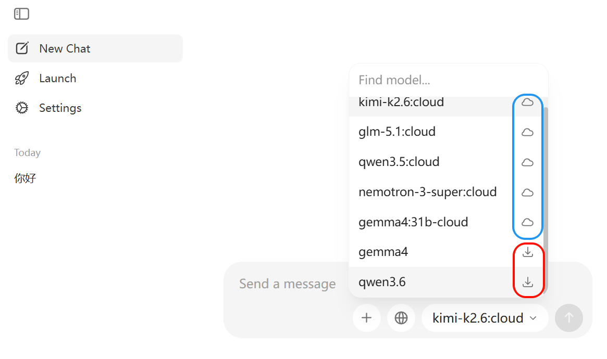

蓝色的使用在线模型，需要在Ollama平台付费使用。
方式2：访问 https://ollama.com/search 可以查看 Ollama 支持的模型。使用命令行可以下载并运行模
型，例如运行 deepseek-r1:1.5b 模型：
~~~text
1 ollama run deepseek-r1:1.5b
~~~

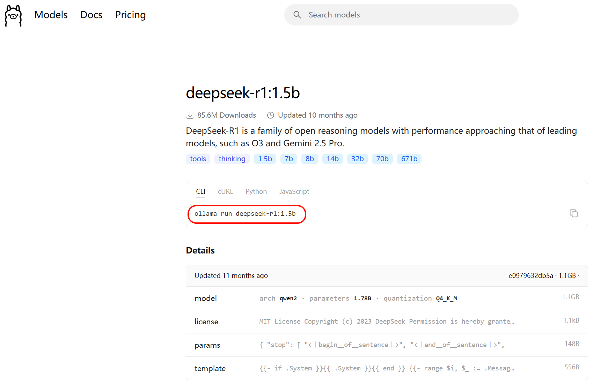

回到命令行，输入指令开始下载：
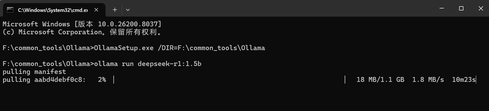

下载完即可进行交互：
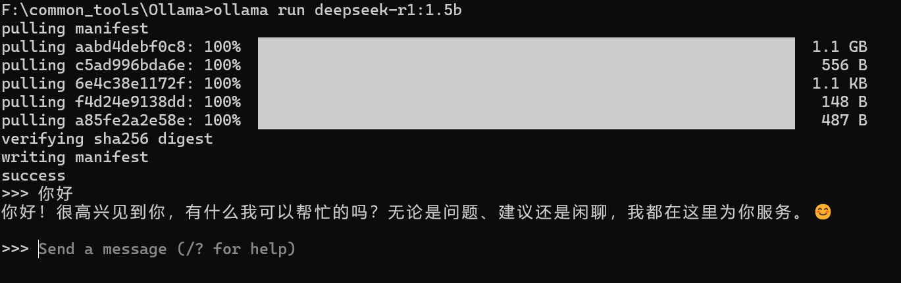

Ollama常用命令：

| **命令** | **一句话说明** |
| --- | --- |
| ollama pull llama3 | 下载指定模型（例：llama3）。 |
| ollama run llama3 | 启动并进入该模型交互对话。 |
| ollama list | 列出本机已下载的所有模型。 |
| ollama rm llama3 | 删除不再需要的模型以节省磁盘。 |
| ollama cp llama3 my-llama3 | 本地复制/重命名模型。 |
| ollama show llama3 | 查看模型详细信息（参数、大小等）。 |
| ollama create my-model -f Modelfile | 用自定义 Modelfile 构建新模型。 |
| ollama serve | 启动后台服务，供 API 调用。 |
| ollama ps | 查看当前正在运行的模型进程。 |
| ollama stop llama3 | 停止正在运行的模型。 |
| ollama --version | 查看安装的ollama版本 |

### 4.4 LangChain调用模型
LangChain整合Ollama调用本地大模型：
~~~bash
1 #pip install langchain-ollama
2 pip install -qU langchain-ollama
3
4 pip install -U ollama
~~~

方式1：
~~~python
1 from langchain_ollama import ChatOllama
2
3 ollama_llm = ChatOllama(
4 model="deepseek-r1:1.5b",
5 base_url="http://192.168.1.106:11434" #如果Ollama在本地默认端口运行，则可省
略，或使用http://localhost:11434
6 )
7 question = "你好，请你介绍一下你自己。"
8
9 result = ollama_llm.invoke(question)
10 print(result)
~~~

~~~text
1 content='您好！我是由中国的深度求索（DeepSeek）公司开发的智能助手DeepSeek-R1。有
关模型和产品的详细内容请参考官方文档。' additional_kwargs={} response_metadata=
{'model': 'deepseek-r1:1.5b', 'created_at': '2026-05-
17T13:42:49.4318473Z', 'done': True, 'done_reason': 'stop',
'total_duration': 485244400, 'load_duration': 55976000,
'prompt_eval_count': 9, 'prompt_eval_duration': 196625400, 'eval_count':
38, 'eval_duration': 208765000, 'logprobs': None, 'model_name':
'deepseek-r1:1.5b', 'model_provider': 'ollama'} id='lc_run--019e362c-
d771-7580-aa74-db1420cfce2b-0' tool_calls=[] invalid_tool_calls=[]
usage_metadata={'input_tokens': 9, 'output_tokens': 38, 'total_tokens':
47}
~~~

方式2：
~~~python
1 from langchain.chat_models import init_chat_model
2
3 ollama_llm = init_chat_model(
4 model="deepseek-r1:1.5b",
5 model_provider="ollama",
6 # base_url="http://192.168.1.106:11434",
7 )
8
9 question = "你好，请你介绍一下你自己。"
10
11 result = ollama_llm.invoke(question)
12 print(result)
1 content='您好！我是由中国的深度求索（DeepSeek）公司开发的智能助手DeepSeek-R1。我
擅长通过思考来帮您解答复杂的数学，代码和逻辑推理等理工类问题。' additional_kwargs=
{} response_metadata={'model': 'deepseek-r1:1.5b', 'created_at': '2026-
05-17T13:45:51.8148967Z', 'done': True, 'done_reason': 'stop',
'total_duration': 658034000, 'load_duration': 53012900,
'prompt_eval_count': 9, 'prompt_eval_duration': 236815100, 'eval_count':
47, 'eval_duration': 338788200, 'logprobs': None, 'model_name':
'deepseek-r1:1.5b', 'model_provider': 'ollama'} id='lc_run--019e362f-
9f34-7cc2-b34d-8fa380131978-0' tool_calls=[] invalid_tool_calls=[]
usage_metadata={'input_tokens': 9, 'output_tokens': 47, 'total_tokens':
56}
~~~

## 5、模型的调用
在 LangChain 中，模型调用（Invocation）是指通过特定方法触发大语言模型生成输出的过程。根据不
同的应用场景和需求，LangChain 提供了几种核心的调用方式，主要是 invoke() 、 stream() 和
batch() 方法，以及它们的异步版本 ainvoke() 、 astream() 和 abatch() ，下面将系统地介绍这些方
法。
invoke() ：阻塞式，**一次性返回完整结果**问答、批处理任务、无需实时反馈的场景。
ainvoke() ：非阻塞式，提高系统吞吐量高并发Web应用、IO密集型任务。
stream() ：流式输出，**实时返回每个token**聊天机器人、长文本生成、需要提升用户体验的交互
应用。
asteam() ：非阻塞式，提高系统吞吐量高并发Web应用、IO密集型任务。
batch() ：**批量处理多个输入**高并发场景，需要同时处理大量请求。
abatch() ：非阻塞式，提高系统吞吐量高并发Web应用、IO密集型任务。

### 5.1 invoke()
invoke() 是 LangChain 中**最核心的方法**，它的工作模式是阻塞式的，即程序会等待模型完全生成整个响
应后，再一次性将结果返回给用户。
#### 5.1.1 invoke()说明
简单来说， invoke 方法的作用就是：
1. **接收你的输入**（问题、指令、对话历史等）
2. **发送给** **LLM** **模型**（如 GPT-4、Llama、Claude 等）
3. **返回模型的响应**（文本回复 + 元数据信息）
基本语法：
~~~text
1 response = model.invoke(input, config=None)
~~~

参数详解：
| **参数** | **类型** | **说明** | **必 需** | **默认值** |
| --- | --- | --- | --- | --- |
| input | str \| list[dict] \| list[Message] 等 | 你要发送给模型的内容 | 必 需 | 无 |
| config | dict | 高级配置（回调函数、元数据、 标签等） | 可 选 | None |

#### 5.1.2 输入参数详解
invoke方法非常灵活，支持三种形式的输入： 文本输入 、 字典列表 、 消息对象列表 。
**1、文本输入(最简单)**
简单的一次性问答，直接传入一个问题或指令。
✅适用场景：快速测试，不需要保留对话历史的简单生成任务。
❌缺点：无法设置系统提示（system prompt），无法传递对话历史
~~~python
1 from langchain.chat_models import init_chat_model
2 from dotenv import load_dotenv
3 import os
4
5 # 从.env文件中加载环境变量
6 load_dotenv(override=True)
7
8 CLOSEAI_API_KEY = os.getenv("CLOSEAI_API_KEY")
9 CLOSEAI_BASE_URL = os.getenv("CLOSEAI_BASE_URL")
10
11 model = init_chat_model(
12 model="openai:gpt-5.4-mini",
13 api_key=CLOSEAI_API_KEY,
14 base_url=CLOSEAI_BASE_URL
15 )
16 # 向模型发送单条数据
~~~

~~~python
17 prompt = "翻译成英文：你好世界"
18 response = model.invoke(prompt)
19
20 # 打印响应
21 print(response)
~~~

在 invoke 中直接输入文本，即可自动转化为 user message 并进行对话。
**2、字典列表(推荐，最灵活)**
创建字典列表组成消息。一条消息通常包含 role（角色） 、 content（内容） 等信息。
✅适用场景：可以设置系统提示，表达多轮对话历史，JSON 兼容，易于序列化和网络传输，生产环境
推荐。
❌缺点：代码稍微多一点（但更清晰）
格式：
~~~text
1 messages = [
2 {"role": "system", "content": "系统提示"},
3 {"role": "user", "content": "用户消息"},
4 {"role": "assistant", "content": "AI回复"}, # 可选，用于对话历史
5 {"role": "user", "content": "继续提问"}
6 ]
~~~

角色说明：
| **角色** | **英文** | **作用** | **示例** |
| --- | --- | --- | --- |
| system | System | 设定 AI 的行为、角色、规则 | "你是一个专业的 Python 导 师" |
| user | Human/User | 用户的输入/问题 | "什么是装饰器？" |
| assistant | AI/Assistant | AI 的历史回复（用于对话上下 文） | "装饰器是一种设计模式..." |

"user"和 "human"有时可以互换，但遵循你选择的主要模型提供商（如OpenAI）的惯例使用
"user"是最稳妥的做法。
举例1：
~~~python
1 from langchain.chat_models import init_chat_model
2 from dotenv import load_dotenv
3 import os
4
5 # 从.env文件中加载环境变量
6 load_dotenv(override=True)
7
8 CLOSEAI_API_KEY = os.getenv("CLOSEAI_API_KEY")
9 CLOSEAI_BASE_URL = os.getenv("CLOSEAI_BASE_URL")
10
11 model = init_chat_model(
12 model="gpt-5.4-mini",
13 model_provider="openai",
14 api_key=CLOSEAI_API_KEY,
~~~

~~~text
15 base_url=CLOSEAI_BASE_URL
16 )
17
~~~

18 # 使用字典格式构建消息
~~~python
19 messages = [
20 {"role":"system","content":"你是一个专业的数学老师。"},
21 {"role":"user","content":"什么是斐波那契数列？"}
22 ]
23
24 response = model.invoke(messages)
25 # 打印响应
26 print(f"AI的回复：{response.content}")
~~~

举例2：多轮对话（带历史）
~~~python
1 from langchain.chat_models import init_chat_model
2 from dotenv import load_dotenv
3 import os
4
5 # 从.env文件中加载环境变量
6 load_dotenv(override=True)
7
8 CLOSEAI_API_KEY = os.getenv("CLOSEAI_API_KEY")
9 CLOSEAI_BASE_URL = os.getenv("CLOSEAI_BASE_URL")
10
11 model = init_chat_model(
12 model="gpt-5.4-mini",
13 model_provider="openai",
14 api_key=CLOSEAI_API_KEY,
15 base_url=CLOSEAI_BASE_URL
16 )
17
~~~

18 # 使用字典格式构建消息
~~~python
19 messages = [
20 {"role":"system","content":"你是一个专业的数学老师。"},
21 {"role":"user","content":"2 + 3 * 2 = ？"},
22 {"role":"assistant","content":"8"},
23 {"role":"user","content":"我刚才问了什么问题？"}
24 ]
25
26 response = model.invoke(messages)
27 # 打印响应
28 print(f"AI的回复：{response.content}")
1 AI的回复：你刚才问的是：**“2 + 3 * 2 = ？”**
~~~

举例3：如果不传递历史，AI 会"失忆"
~~~python
1 from langchain.chat_models import init_chat_model
2 from dotenv import load_dotenv
3 import os
4
5 # 从.env文件中加载环境变量
6 load_dotenv(override=True)
7
8 CLOSEAI_API_KEY = os.getenv("CLOSEAI_API_KEY")
~~~

~~~python
9 CLOSEAI_BASE_URL = os.getenv("CLOSEAI_BASE_URL")
10
11 model = init_chat_model(
12 model="openai:gpt-5.4-mini",
13 api_key=CLOSEAI_API_KEY,
14 base_url=CLOSEAI_BASE_URL
15 )
16
17 messages1 = [
18 {"role": "system", "content": "你是一个非常友好的AI助手"},
19 {"role": "user", "content": "你好，我叫小明"},
20 ]
21 # 第一次对话
22 response1 = model.invoke(messages1)
23 # 打印响应
24 print(f"AI的回复1：{response1.content}")
25
26 messages2 = [
27 {"role": "user", "content": "我叫什么名字？"}
28 ]
29 # 第二次对话
30 response2 = model.invoke(messages2)
31 # 打印响应
32 print(f"AI的回复2：{response2.content}")
33
~~~

1 AI的回复1：你好，小明！很高兴认识你 😊
2 我是你的AI助手，有什么我可以帮你的吗？
~~~text
3
~~~

4 AI的回复2：我不知道你的名字，除非你告诉我。
5 如果你愿意，可以直接告诉我，我之后就可以这样称呼你。
作为对比，传递记忆：
~~~python
1 conversation = [
2 {"role": "system", "content": "你是一个非常友好的AI助手"},
3 {"role": "user", "content": "你好，我叫小明"}
4 ]
5
6 # 第一次对话
7 response1 = model.invoke(conversation)
8 # 打印响应
9 print(f"AI的回复1：{response1.content}")
10
11
12 # 添加记忆
13 conversation.append({"role": "assistant", "content": response1.content})
14
15 conversation.append({"role": "user", "content": "我叫什么名字？"})
16
17 # 第二次对话
18 response2 = model.invoke(conversation)
19 print(f"AI的回复2：{response2.content}")
20
~~~

1 AI的回复1：你好，小明！很高兴认识你 😊
2 我是你的AI助手，有什么我可以帮你的吗？
~~~text
3
4 AI的回复2：你叫小明。
~~~

说明：关于消息列表的内容此处不必深究，Messages章节会系统介绍。
**3、消息对象列表**
使用内置的消息类（如 SystemMessage, HumanMessage, AIMessage），将消息对象列表输入模型。
✅适用场景：需要类型检查（针对大型项目）、IDE 自动补全的场景
❌缺点：代码较长、不如字典简洁、难以序列化（JSON）
消息类型对照：
| **消息类** | **对应字典格式** | **作用** |
| --- | --- | --- |
| SystemMessage | {"role": "system", ...} | 系统提示 |
| HumanMessage | {"role": "user", ...} | 用户输入 |
| AIMessage | {"role": "assistant", ...} | AI 回复 |

举例1：
~~~python
1 from langchain_core.messages import SystemMessage, AIMessage, HumanMessage
2 from langchain.chat_models import init_chat_model
3 from dotenv import load_dotenv
4 import os
5
6 # 从.env文件中加载环境变量
7 load_dotenv(override=True)
8
9 CLOSEAI_API_KEY = os.getenv("CLOSEAI_API_KEY")
10 CLOSEAI_BASE_URL = os.getenv("CLOSEAI_BASE_URL")
11
12 model = init_chat_model(
13 model="openai:gpt-5.4-mini",
14 api_key=CLOSEAI_API_KEY,
15 base_url=CLOSEAI_BASE_URL
16 )
17
~~~

18 # 使用消息对象格式构建消息
~~~python
19 messages = [
20 SystemMessage("你是一个专业的数学老师。"),
21 HumanMessage("2 + 3 * 2 = ？"),
22 AIMessage("8"),
23 HumanMessage("我刚才问什么问题了？")
24 ]
25
26 response = model.invoke(messages)
27 # 打印响应
28 print(f"AI的回复：{response.content}")
~~~

举例2：

~~~python
1 from langchain_core.messages import SystemMessage, HumanMessage, AIMessage
2
3 messages = [
4 SystemMessage(content="你是一个 Python 专家"),
5 HumanMessage(content="什么是生成器？"),
6 ]
7
8 response = model.invoke(messages)
9 # print(response)
10
11 # 继续对话
12 messages.append(AIMessage(content=response.content))
13 messages.append(HumanMessage(content="能给个例子吗？"))
14
15 response1 = model.invoke(messages)
16 print(response1)
~~~

#### 5.1.3 返回值详解
invoke 返回一个 AIMessage对象 ，源码如下：
~~~python
1 def invoke(
2 self,
3 input: LanguageModelInput,
4 config: RunnableConfig | None = None,
5 *,
6 stop: list[str] | None = None,
7 **kwargs: Any,
8 ) -> AIMessage:
~~~

举例：
~~~python
1 from langchain_core.messages import SystemMessage, AIMessage, HumanMessage
2 from langchain.chat_models import init_chat_model
3 from dotenv import load_dotenv
4 import os
5
6 # 从.env文件中加载环境变量
7 load_dotenv(override=True)
8
9 CLOSEAI_API_KEY = os.getenv("CLOSEAI_API_KEY")
10 CLOSEAI_BASE_URL = os.getenv("CLOSEAI_BASE_URL")
11
12 model = init_chat_model(
13 model="gpt-5.4-mini",
14 api_key=CLOSEAI_API_KEY,
15 base_url=CLOSEAI_BASE_URL
16 )
17
~~~

18 # 使用字典格式构建消息
~~~python
19 response = model.invoke([HumanMessage("2 + 3 * 2 = ？")])
20 # 打印响应
21 print(type(response))
22 # <class 'langchain_core.messages.ai.AIMessage'>
~~~

~~~python
1 from rich import print as rprint
2
3 rprint(response)
1 AIMessage(
2 content='2 + 3 * 2 = **8**',
3 additional_kwargs={'refusal': None},
4 response_metadata={
5 'token_usage': {
6 'completion_tokens': 15,
7 'prompt_tokens': 16,
8 'total_tokens': 31,
9 'completion_tokens_details': {
10 'accepted_prediction_tokens': 0,
11 'audio_tokens': 0,
12 'reasoning_tokens': 0,
13 'rejected_prediction_tokens': 0
14 },
15 'prompt_tokens_details': {'audio_tokens': 0, 'cached_tokens':
0},
16 'latency_checkpoint': {
17 'engine_tbt_ms': 4,
18 'engine_ttft_ms': 36,
19 'engine_ttlt_ms': 100,
20 'pre_inference_ms': 86,
21 'service_tbt_ms': 4,
22 'service_ttft_ms': 280,
23 'service_ttlt_ms': 338,
24 'total_duration_ms': 259,
25 'user_visible_ttft_ms': 194
26 }
27 },
28 'model_provider': 'openai',
29 'model_name': 'gpt-5.4-mini-2026-03-17',
30 'system_fingerprint': None,
31 'id': 'chatcmpl-DgWobsxhDOqzjqVFwbZYKRnovpEiV',
32 'service_tier': 'default',
33 'finish_reason': 'stop',
34 'logprobs': None
35 },
36 id='lc_run--019e3659-5ee2-7b62-bc8a-741e27374b43-0',
37 tool_calls=[],
38 invalid_tool_calls=[],
39 usage_metadata={
40 'input_tokens': 16,
41 'output_tokens': 15,
42 'total_tokens': 31,
43 'input_token_details': {'audio': 0, 'cache_read': 0},
44 'output_token_details': {'audio': 0, 'reasoning': 0}
45 }
46 )
~~~

AIMessage中包含丰富的信息，以上面案例的输出为例，整体说明如下：
~~~text
1 AIMessage(
2 # --- 核心内容 ---
~~~

~~~text
3 content='2 + 3 * 2 = **8**', # 模型生成的最终文本答案
4
5 additional_kwargs={
6 'refusal': None# 模型拒绝回答的情况（如触碰安全策略），None 表示正常回答
7 },
8
9 # --- 响应元数据（API 返回的详细原始数据） ---
10 response_metadata={
11 'token_usage': {
12 'completion_tokens': 15, # 生成回答消耗的 Token 数（输出）
13 'prompt_tokens': 16, # 用户输入消耗的 Token 数（输入）
14 'total_tokens': 31, # 本次交互总共消耗的 Token
15
16 'completion_tokens_details': {
17 'accepted_prediction_tokens': 0, # 预测性生成的 Token 数
18 'audio_tokens': 0, # 音频生成消耗（如有）
19 'reasoning_tokens': 0,# 推理模型（如 o1）思考过程消耗的 Token
20 'rejected_prediction_tokens': 0 # 被拒绝的预测 Token
21 },
22
23 'prompt_tokens_details': {
24 'audio_tokens': 0, # 输入中的音频 Token 数
25 'cached_tokens': 0 # 命中的缓存 Token 数（能省钱/提速）
26 },
27
28 # --- 延迟性能监控（单位：毫秒 ms） ---
29 'latency_checkpoint': {
30 'engine_tbt_ms': 4, # 引擎 Token 间平均间隔时间
31 'engine_ttft_ms': 36, # 引擎生成首个 Token 的时间
32 'engine_ttlt_ms': 100, # 引擎生成最后一个 Token 的时间
33 'pre_inference_ms': 86, # 推理前的预处理耗时(安全审核、Token 化等
预处理)
34 'service_tbt_ms': 4, # 服务端token与token之间生成的间隔时间，决定
~~~

了打字机效果是否丝滑。
~~~text
35 'service_ttft_ms': 280, # 服务端接收到请求到输出首字的总时间
36 'service_ttlt_ms': 338, # 服务端完成全部输出的总时间
37 'total_duration_ms': 259, # 本次请求在系统中记录的总持续时长
38 'user_visible_ttft_ms': 194 # 用户看到第一个字跳出来等待的时间
39 }
40 },
41 'model_provider': 'openai', # 模型供应商
42 'model_name': 'gpt-5.4-mini-2026-03-17', # 使用的具体模型版本
43 'system_fingerprint': None, # 系统指纹，用于追踪模型后端的配置变
~~~

更
~~~text
44 'id': 'chatcmpl-DgWobsxhDOqzjqVFwbZYKRnovpEiV', #API层面的响应 ID
45 'service_tier': 'default', # 服务层级（如按量付费或订阅）
46 'finish_reason': 'stop', # 停止原因：stop（自然结束）、length（长度受
~~~

限）
~~~text
47 'logprobs': None # 对数概率（通常用于分析词汇选择的可能性）
48 },
49
50 # --- LangChain 内部标识 ---
51 id='lc_run--019e3659-5ee2-7b62-bc8a-741e27374b43-0',
52 # LangChain 追踪此条运行的唯一 ID
53
54 # --- 工具调用信息 ---
55 tool_calls=[], # 正常触发的外部工具调用列表
56 invalid_tool_calls=[], # 触发失败或格式错误的工具调用
~~~

~~~text
57
58 # --- 统一消耗元数据（LangChain 标准化后的消耗格式） ---
59 usage_metadata={
60 'input_tokens': 16, # 输入 Token 数
61 'output_tokens': 15, # 输出 Token 数
62 'total_tokens': 31, # 总 Token 数
63 'input_token_details': {
64 'audio': 0,
65 'cache_read': 0 # 从缓存中读取的输入数量
66 },
67 'output_token_details': {
68 'audio': 0,
69 'reasoning': 0 # 包含在输出中的推理 Token
70 }
71 }
72 )
~~~

总结一下：
**1.** **核心内容与基本信息**
|  | **content** |
| --- | --- |
| i | d |
|  | additional_kwargs |

refusal : 如果模型拒绝回答（涉及敏感政策），此处会显示拒绝原因。
**2.** **消耗统计** **(Token** **Usage)**
这部分决定了你这一行输入操作花了多少钱：
prompt_tokens / input_tokens : 输入 Token 数。你发送给模型的问题长度。
completion_tokens / output_tokens : 输出 Token 数。模型回答生成的长度。
total_tokens : 总消耗。 两者之和。
reasoning_tokens : 推理 Token 数。 如果是 O1/O3 等推理模型，这里会显示它在“思考”时消耗
的 Token。
cached_tokens : 缓存命中的 Token 数。重复提问时，如果命中了模型商的缓存，这部分费用通
常更低。
**3.** **响应元数据** **(Response** **Metadata)**
这部分是 API 返回的原始详细信息：
model_name : 实际调用的模型具体版本（如 gpt-5.4-mini ）。
model_provider : 模型供应商（如 openai ）。
finish_reason : 生成停止的原因。
stop : 正常回答结束。
length : 达到最大 Token 限制被截断。
system_fingerprint : 系统指纹，用于追踪模型后端的配置变更。
**4.** **性能与延迟** **(Latency** **Checkpoint)**
这是针对 API 响应速度的深度拆解（单位通常为毫秒 **ms**）：
total_duration_ms : 总耗时。从请求发出到完全收到的总时间（259ms）。
user_visible_ttft_ms : 首字到达时间。用户看到第一个字跳出来等待的时间（194ms），这是体
感快慢的关键。
engine_ttft_ms : 引擎层面的首字到达时间（36ms）。

engine_ttlt_ms : 引擎生成最后一个字的时间（100ms）。
pre_inference_ms : 推理前处理耗时。包括安全审核、Token 化等预处理（86ms）。
service_tbt_ms : Time Between Tokens。字与字之间生成的间隔时间，决定了打字机效果是否
丝滑。
**5.** **工具调用信息**
tool_calls : 结构化工具调用列表。如果模型决定调用某个 Python 函数或搜索工具，参数会在这
里。
invalid_tool_calls : 格式错误的工具调用尝试。
举例：访问所有信息
~~~python
1 response = model.invoke("用一句话解释什么是 AI")
2
3 # 1. 获取回复内容
4 print("AI 回复:", response.content)
5
6 # 2. 获取响应元数据
7 metadata = response.response_metadata
8 print(f"使用的模型: {metadata['model_name']}")
9 print(f"结束原因: {metadata['finish_reason']}")
10 print(f"模型提供商：{metadata['model_provider']}\n")
11
12 # 3. 获取 Token 使用情况
13 usage = metadata.get('token_usage', {})
14 print(f"输入 tokens: {usage.get('prompt_tokens')}")
15 print(f"输出 tokens: {usage.get('completion_tokens')}")
16 print(f"总计 tokens: {usage.get('total_tokens')}")
17
18 # 4. 获取消息 ID
19 print(f"消息 ID: {response.id}")
~~~

1 AI 回复: AI（人工智能）就是让机器模拟人类的学习、推理、识别和决策能力。
~~~text
2 使用的模型: gpt-5.4-mini-2026-03-17
3 结束原因: stop
4 模型提供商：openai
5
6 输入 tokens: 13
7 输出 tokens: 28
8 总计 tokens: 41
9 消息 ID: lc_run--019e3665-8dfa-7c53-a9a5-4995348a0258-0
~~~

### 5.2 流式调用
**invoke** **和** **stream** **有什么区别？**
invoke() ：同步调用，在模型输出完成后**一次性获取响应**，对于输出文本很长的场景，用户体验
不好。
stream() ：流式调用，**实时返回响应片段**。调用后，返回一个 迭代器(iterator) ，可以通过循环
来实时处理每一个新生成的chunk内容块。
注意：流式输出依赖于模型供应商对于流式输出的支持。

举例：
~~~python
1 from langchain.chat_models import init_chat_model
2 from dotenv import load_dotenv
3 import os
4
5 # 从.env文件中加载环境变量
6 load_dotenv(override=True)
7
8 CLOSEAI_API_KEY = os.getenv("CLOSEAI_API_KEY")
9 CLOSEAI_BASE_URL = os.getenv("CLOSEAI_BASE_URL")
10
11 model = init_chat_model(
12 model="gpt-5.4-mini",
13 api_key=CLOSEAI_API_KEY,
14 base_url=CLOSEAI_BASE_URL
15 )
16
17 for chunk in model.stream("写一首七言律诗，总结大模型的发展"):
18 print(chunk.text, end="", flush=True) # 逐token输出
~~~

输出如下：
《大模型演进感赋》
混沌初开数据洪，算力为楫智为峰。
千层网络参差现，万亿参数次第通。
昔困逻辑循旧径，今驰想象破苍穹。
忽闻语料版权议，且看规制立新功。
注：本诗以七律形式凝练大模型发展历程。首联以“数据洪”“算力楫”喻示发展基础，颔联通过“千层
网络”“万亿参数”展现技术突破，颈联对比传统AI的局限与大模型的飞跃，尾联则指向当前版权争议
与未来规制建设，暗合技术与社会协同演进之理。
输出不再是整段返回，而是流式输出。
**stream()方式的优点：**
响应速度更快 — 用户不必等待完整输出
交互体验更流畅 — 尤其在长文本或复杂推理场景下
可实时展示模型思考过程
### 5.3 批量调用
batch() 方法允许你一次性 发送一组请求 （含多条独立请求），模型会在后台 并行处理 ，然后返回 所
有结果的列表 。
与逐个顺序调用（invoke）相比，能大幅 减少网络往返开销 和 等待时间 ，显著提升性能、降低成本。
**适用场景：**文档摘要、批量问答、数据预处理、多样本分类等。
#### 5.4.1 一次性接收所有响应
batch()特点是等待所有请求处理完毕，按原始输入顺序返回结果列表。
~~~python
1 from langchain.chat_models import init_chat_model
2 from dotenv import load_dotenv
3 import os
4
~~~

~~~python
5 # 从.env文件中加载环境变量
6 load_dotenv(override=True)
7
8 CLOSEAI_API_KEY = os.getenv("CLOSEAI_API_KEY")
9 CLOSEAI_BASE_URL = os.getenv("CLOSEAI_BASE_URL")
10
11 model = init_chat_model(
12 model="gpt-5.4-mini",
13 api_key=CLOSEAI_API_KEY,
14 base_url=CLOSEAI_BASE_URL
15 )
16
17 messages = [
18 "你好，你是谁？",
19 "2 + 3 * 5 = ?",
20 "中国首都在哪里？"
21 ]
22
23 responses = model.batch(messages)
24
25 for response in responses:
26 print(response)
~~~

输出如下：

~~~python
1 content='你好！我是 ChatGPT，一个由 OpenAI 训练的人工智能助手。 \n我可以帮你回答
~~~

问题、写作、翻译、总结、学习辅导、头脑风暴等。\n\n如果你愿意，也可以直接告诉我你现在想
~~~text
做什么，我来帮你。' additional_kwargs={'refusal': None} response_metadata=
{'token_usage': {'completion_tokens': 65, 'prompt_tokens': 10,
'total_tokens': 75, 'completion_tokens_details':
{'accepted_prediction_tokens': 0, 'audio_tokens': 0, 'reasoning_tokens':
0, 'rejected_prediction_tokens': 0}, 'prompt_tokens_details':
{'audio_tokens': 0, 'cached_tokens': 0}, 'latency_checkpoint':
{'engine_tbt_ms': 4, 'engine_ttft_ms': 41, 'engine_ttlt_ms': 303,
'pre_inference_ms': 100, 'service_tbt_ms': 4, 'service_ttft_ms': 210,
'service_ttlt_ms': 470, 'total_duration_ms': 382,
'user_visible_ttft_ms': 109}}, 'model_provider': 'openai', 'model_name':
'gpt-5.4-mini-2026-03-17', 'system_fingerprint': None, 'id': 'chatcmpl-
DgYAfQi7g8uUD1A5WE0575GpaPyW7', 'service_tier': 'default',
'finish_reason': 'stop', 'logprobs': None} id='lc_run--019e36a8-e912-
7ea0-ba20-5f7c5a8f48ab-0' tool_calls=[] invalid_tool_calls=[]
usage_metadata={'input_tokens': 10, 'output_tokens': 65, 'total_tokens':
75, 'input_token_details': {'audio': 0, 'cache_read': 0},
'output_token_details': {'audio': 0, 'reasoning': 0}}
2 content='2 + 3 * 5 = 17' additional_kwargs={'refusal': None}
response_metadata={'token_usage': {'completion_tokens': 14,
'prompt_tokens': 15, 'total_tokens': 29, 'completion_tokens_details':
{'accepted_prediction_tokens': 0, 'audio_tokens': 0, 'reasoning_tokens':
0, 'rejected_prediction_tokens': 0}, 'prompt_tokens_details':
{'audio_tokens': 0, 'cached_tokens': 0}, 'latency_checkpoint':
{'engine_tbt_ms': 6, 'engine_ttft_ms': 50, 'engine_ttlt_ms': 136,
'pre_inference_ms': 63, 'service_tbt_ms': 6, 'service_ttft_ms': 276,
'service_ttlt_ms': 357, 'total_duration_ms': 304,
'user_visible_ttft_ms': 214}}, 'model_provider': 'openai', 'model_name':
'gpt-5.4-mini-2026-03-17', 'system_fingerprint': None, 'id': 'chatcmpl-
DgYAgDYTix1VzH7afG3tT8Kq2jBzY', 'service_tier': 'default',
'finish_reason': 'stop', 'logprobs': None} id='lc_run--019e36a8-e913-
7a81-8900-5dd774f747d6-0' tool_calls=[] invalid_tool_calls=[]
usage_metadata={'input_tokens': 15, 'output_tokens': 14, 'total_tokens':
29, 'input_token_details': {'audio': 0, 'cache_read': 0},
'output_token_details': {'audio': 0, 'reasoning': 0}}
3 content='中国的首都是**北京**。' additional_kwargs={'refusal': None}
response_metadata={'token_usage': {'completion_tokens': 12,
'prompt_tokens': 11, 'total_tokens': 23, 'completion_tokens_details':
{'accepted_prediction_tokens': 0, 'audio_tokens': 0, 'reasoning_tokens':
0, 'rejected_prediction_tokens': 0}, 'prompt_tokens_details':
{'audio_tokens': 0, 'cached_tokens': 0}, 'latency_checkpoint':
{'engine_tbt_ms': 4, 'engine_ttft_ms': 32, 'engine_ttlt_ms': 81,
'pre_inference_ms': 113, 'service_tbt_ms': 4, 'service_ttft_ms': 234,
'service_ttlt_ms': 276, 'total_duration_ms': 166,
'user_visible_ttft_ms': 121}}, 'model_provider': 'openai', 'model_name':
'gpt-5.4-mini-2026-03-17', 'system_fingerprint': None, 'id': 'chatcmpl-
DgYAfeq1Z3fnSqiAM6YtatXt283t3', 'service_tier': 'default',
'finish_reason': 'stop', 'logprobs': None} id='lc_run--019e36a8-e914-
7430-ab51-c4903a89138d-0' tool_calls=[] invalid_tool_calls=[]
usage_metadata={'input_tokens': 11, 'output_tokens': 12, 'total_tokens':
23, 'input_token_details': {'audio': 0, 'cache_read': 0},
'output_token_details': {'audio': 0, 'reasoning': 0}}
~~~

#### 5.4.2 按完成顺序接收响应
当输入列表很大或单个模型调用耗时差异显著时， batch_as_completed() 允许应用在收到第一个结果
后立即返回响应，而不会等待批次内所有任务完成才响应。即batch_as_completed() 每个请求完成后立
即 yield 结果， 结果可能乱序 。
但是，每个返回的响应都被放在一个 元组 中，元组的第一个元素是原始输入的 index 索引，可根据索
引重新排序。
~~~python
1 from langchain.chat_models import init_chat_model
2 from dotenv import load_dotenv
3 import os
4
5 # 从.env文件中加载环境变量
6 load_dotenv(override=True)
7
8 CLOSEAI_API_KEY = os.getenv("CLOSEAI_API_KEY")
9 CLOSEAI_BASE_URL = os.getenv("CLOSEAI_BASE_URL")
10
11 model = init_chat_model(
12 model="gpt-5.4-mini",
13 api_key=CLOSEAI_API_KEY,
14 base_url=CLOSEAI_BASE_URL
15 )
16
17 messages = [
18 "你好，你是谁？",
19 "2 + 3 * 5 = ?",
20 "中国首都在哪里？"
21 ]
22
23 responses = model.batch_as_completed(messages)
24
25 for response in responses:
26 print(response)
~~~

输出如下：

~~~text
1 (2, AIMessage(content='中国的首都是**北京**。', additional_kwargs=
{'refusal': None}, response_metadata={'token_usage':
{'completion_tokens': 12, 'prompt_tokens': 11, 'total_tokens': 23,
'completion_tokens_details': {'accepted_prediction_tokens': 0,
'audio_tokens': 0, 'reasoning_tokens': 0, 'rejected_prediction_tokens':
0}, 'prompt_tokens_details': {'audio_tokens': 0, 'cached_tokens': 0},
'latency_checkpoint': {'engine_tbt_ms': 4, 'engine_ttft_ms': 33,
'engine_ttlt_ms': 83, 'pre_inference_ms': 49, 'service_tbt_ms': 4,
'service_ttft_ms': 153, 'service_ttlt_ms': 201, 'total_duration_ms':
156, 'user_visible_ttft_ms': 104}}, 'model_provider': 'openai',
'model_name': 'gpt-5.4-mini-2026-03-17', 'system_fingerprint': None,
'id': 'chatcmpl-DgYBUqBCme3XzWO7XqkO1MYb2Cnr8', 'service_tier':
'default', 'finish_reason': 'stop', 'logprobs': None}, id='lc_run-
-019e36a9-af4e-76f0-a82c-e7c4ff53dcec-0', tool_calls=[],
invalid_tool_calls=[], usage_metadata={'input_tokens': 11,
'output_tokens': 12, 'total_tokens': 23, 'input_token_details':
{'audio': 0, 'cache_read': 0}, 'output_token_details': {'audio': 0,
'reasoning': 0}}))
2 (0, AIMessage(content='你好！我是一个 AI 助手，可以帮你回答问题、写作、翻译、总
~~~

结、编程、头脑风暴等。\n\n如果你愿意，可以直接告诉我你想做什么。',
~~~text
additional_kwargs={'refusal': None}, response_metadata={'token_usage':
{'completion_tokens': 48, 'prompt_tokens': 10, 'total_tokens': 58,
'completion_tokens_details': {'accepted_prediction_tokens': 0,
'audio_tokens': 0, 'reasoning_tokens': 0, 'rejected_prediction_tokens':
0}, 'prompt_tokens_details': {'audio_tokens': 0, 'cached_tokens': 0},
'latency_checkpoint': {'engine_tbt_ms': 4, 'engine_ttft_ms': 41,
'engine_ttlt_ms': 230, 'pre_inference_ms': 58, 'service_tbt_ms': 4,
'service_ttft_ms': 155, 'service_ttlt_ms': 343, 'total_duration_ms':
292, 'user_visible_ttft_ms': 98}}, 'model_provider': 'openai',
'model_name': 'gpt-5.4-mini-2026-03-17', 'system_fingerprint': None,
'id': 'chatcmpl-DgYBUarWULgE5s3Jji6kxan1OnlWu', 'service_tier':
'default', 'finish_reason': 'stop', 'logprobs': None}, id='lc_run-
-019e36a9-af4c-79e0-885c-d39970d4bac4-0', tool_calls=[],
invalid_tool_calls=[], usage_metadata={'input_tokens': 10,
'output_tokens': 48, 'total_tokens': 58, 'input_token_details':
{'audio': 0, 'cache_read': 0}, 'output_token_details': {'audio': 0,
'reasoning': 0}}))
3 (1, AIMessage(content='2 + 3 * 5 = **17**', additional_kwargs=
{'refusal': None}, response_metadata={'token_usage':
{'completion_tokens': 15, 'prompt_tokens': 15, 'total_tokens': 30,
'completion_tokens_details': {'accepted_prediction_tokens': 0,
'audio_tokens': 0, 'reasoning_tokens': 0, 'rejected_prediction_tokens':
0}, 'prompt_tokens_details': {'audio_tokens': 0, 'cached_tokens': 0},
'latency_checkpoint': {'engine_tbt_ms': 4, 'engine_ttft_ms': 32,
'engine_ttlt_ms': 92, 'pre_inference_ms': 76, 'service_tbt_ms': 4,
'service_ttft_ms': 259, 'service_ttlt_ms': 315, 'total_duration_ms':
245, 'user_visible_ttft_ms': 182}}, 'model_provider': 'openai',
'model_name': 'gpt-5.4-mini-2026-03-17', 'system_fingerprint': None,
'id': 'chatcmpl-DgYBUqMC37Gxn4rlnliDQ2ORGNvKZ', 'service_tier':
'default', 'finish_reason': 'stop', 'logprobs': None}, id='lc_run-
-019e36a9-af4d-7380-add9-b3eee075881d-0', tool_calls=[],
invalid_tool_calls=[], usage_metadata={'input_tokens': 15,
'output_tokens': 15, 'total_tokens': 30, 'input_token_details':
{'audio': 0, 'cache_read': 0}, 'output_token_details': {'audio': 0,
'reasoning': 0}}))
~~~

#### 5.4.3 性能对比
使用batch()：
~~~text
1 # 准备多个输入
2 inputs = [
3 "翻译成英文：春天来了",
4 "翻译成英文：夏天很热",
5 "翻译成英文：秋天落叶",
~~~

6 "翻译成英文：冬天下雪"
~~~text
7 ]
8
~~~

9 # ✅ 批量调用（高效）
~~~python
10 import time
11
12 start = time.time()
13 responses = model.batch(inputs)
14 batch_time = time.time() - start
15
16 print("批量调用结果：")
17 for i, response in enumerate(responses):
18 print(f"{i+1}. {response.content}")
19 print(f"耗时: {batch_time:.2f}秒\n")
20
~~~

1 批量调用结果：
~~~text
2 1. “春天来了” in English is:
3
4 **Spring has arrived.**
5 2. “夏天很热” can be translated into English as:
6
7 **“Summer is very hot.”**
8 3. “秋天落叶” can be translated as **“autumn leaves falling”** or simply
**“falling leaves in autumn.”**
9 If you want a more natural title-like phrase, **“Falling Autumn Leaves”
** also works.
10 4. “冬天下雪” in English is:
11
12 **It snows in winter.**
13 耗时: 1.91秒
~~~

使用循环调用invoke():
1 # ❌ 循环调用（低效，仅用于对比）
~~~text
2 inputs = [
3 "翻译成英文：春天来了",
4 "翻译成英文：夏天很热",
5 "翻译成英文：秋天落叶",
~~~

6 "翻译成英文：冬天下雪"
~~~text
7 ]
8
9 start = time.time()
10 loop_responses = []
11 for inp in inputs:
12 response = model.invoke(inp)
13 loop_responses.append(response)
~~~

~~~python
14 loop_time = time.time() - start
15
16 for i, response in enumerate(responses):
17 print(f"{i+1}. {response.content}")
18
19 print(f"循环调用耗时: {loop_time:.2f}秒")
20
21 print(f"批量调用节省: {((loop_time - batch_time) / loop_time * 100):.1f}%")
1 1. “春天来了” in English is:
2
3 **Spring has arrived.**
4 2. “夏天很热” can be translated into English as:
5
6 **“Summer is very hot.”**
7 3. “秋天落叶” can be translated as **“autumn leaves falling”** or simply
**“falling leaves in autumn.”**
8 If you want a more natural title-like phrase, **“Falling Autumn Leaves”
** also works.
9 4. “冬天下雪” in English is:
10
11 **It snows in winter.**
12 循环调用耗时: 3.87秒
13 批量调用节省: 50.7%
~~~

### 5.4 异步调用
**复习：同步** **vs** **异步**
同步(sync) ：
概念：发起一个任务之后，需要 等待该任务完成后 ，才能继续执行后续任务。
表现：当前执行流 会被『阻塞』 。
异步(async) ：
概念：发起一个任务之后， 不必等该任务完成 ，就可以继续执行其他任务。
备注：虽然不必等待任务完成，但任务完成后，仍然可以通过特定方式获取结果。
表现：当前执行流 不会被『阻塞』 。
举例：

在LangChain框架中，异步方法（ainvoke、astream、abatch）与它们的同步版本（invoke、
stream、batch）相比，具备如下特点：
避免阻塞主线程 ：同步调用会阻塞程序执行，而异步方法让应用程序在等待API响应时保持响应
性。
优化资源利用 ：异步操作可以更高效地利用系统资源，减少空闲等待时间
举例1：ainvoke()
~~~python
1 """
2 @Author:shkstart
3 @Desc:
4 """
5 from langchain.chat_models import init_chat_model
6 from dotenv import load_dotenv
7 import os
8 import asyncio
9 import time
10
11
12 # 从.env文件中加载环境变量
13 load_dotenv(override=True)
14
15 CLOSEAI_API_KEY = os.getenv("CLOSEAI_API_KEY")
16 CLOSEAI_BASE_URL = os.getenv("CLOSEAI_BASE_URL")
17
18 model = init_chat_model(
19 model="openai:gpt-5.4-mini",
20 api_key=CLOSEAI_API_KEY,
21 base_url=CLOSEAI_BASE_URL
22 )
23
24 async def demo_async_invoke():
25 print("=== 演示：ainvoke 的异步（非阻塞）效果 ===")
26 start_time = time.perf_counter() # 记录开始时间
27
28 print("程序开始...")
29
30 # 1. 创建任务 (Task)
~~~

~~~python
31 print(">>> 发起异步模型调用 (ainvoke)...")
32 async_task = asyncio.create_task(model.ainvoke("用一句话解释人工智能。"))
33
34 # 2. 并行执行其他任务
35 print(">>> 模型请求已在后台发送，继续执行本地逻辑...")
36 for i in range(3):
37 await asyncio.sleep(1) # 使用异步等待，释放控制权
38 print(f">>> 正在执行第{i + 1}个任务... (已耗时 {time.perf_counter() -
start_time:.2f}s)")
39
40 # 3. 获取模型结果
41 print(">>> 本地任务完成，检查模型状态...")
42 response = await async_task
43
44 end_time = time.perf_counter()
45 print(f">>> 模型返回: {response.content}")
46 print(f"=== 总运行耗时: {end_time - start_time:.2f}s ===")
47
48
49 async def main():
50 """主函数"""
51 await demo_async_invoke()
52
53
54 if __name__ == "__main__":
55 asyncio.run(main())
56
1 === 演示：ainvoke 的异步（非阻塞）效果 ===
2 程序开始...
3 >>> 发起异步模型调用 (ainvoke)...
4 >>> 模型请求已在后台发送，继续执行本地逻辑...
5 >>> 正在执行第1个任务... (已耗时 1.00s)
6 >>> 正在执行第2个任务... (已耗时 2.02s)
7 >>> 正在执行第3个任务... (已耗时 3.02s)
8 >>> 本地任务完成，检查模型状态...
~~~

9 >>> 模型返回: 人工智能是让机器模拟人类的感知、学习、推理和决策能力的技术。
~~~text
10 === 总运行耗时: 3.02s ===
~~~

说明：在.py文件中执行，而非jupyter中执行。
举例2：astream()
~~~python
1 import asyncio
2 import os
3 from langchain.chat_models import init_chat_model
4 from dotenv import load_dotenv
5 import time
6
7 # 从.env文件中加载环境变量
8 load_dotenv(override=True)
9
10 CLOSEAI_API_KEY = os.getenv("CLOSEAI_API_KEY")
11 CLOSEAI_BASE_URL = os.getenv("CLOSEAI_BASE_URL")
12
13 model = init_chat_model(
14 model="openai:gpt-5.4-mini",
~~~

~~~python
15 api_key=CLOSEAI_API_KEY,
16 base_url=CLOSEAI_BASE_URL
17 )
18
19
20 async def demo_async_stream():
21 """演示异步调用的非阻塞特性"""
22 print("=== 演示：astream 的异步（非阻塞）效果 ===")
23 start_time = time.perf_counter() # 记录开始时间
24 print("程序开始...")
25
26 # 1. 发起异步流式请求
~~~

27 # 注意：此时请求已发出，返回的是一个异步生成器
~~~python
28 print(">>> 发起异步流式调用 (astream)...")
29 stream_resp = model.astream("请用一句话解释机器学习的基本概念。")
30
~~~

31 # 2. 在等待流式响应的同时，执行其他任务
~~~python
32 print(">>> 流式请求已发送，程序无需等待，继续执行其他异步任务...")
33 for i in range(3):
34 # 使用 asyncio.sleep 而非 time.sleep
35 # 这允许事件循环在等待时去处理上面的 stream_resp 网络 IO
36 await asyncio.sleep(1)
37 # print(f">>> 正在执行并发任务 {i + 1}... ")
38 print(f">>> 正在执行第{i + 1}个任务... (已耗时 {time.perf_counter() -
start_time:.2f}s)")
39
40 # 3. 现在开始处理流式结果
41 print(">>> 模拟任务已完成，开始读取缓冲区中的流式结果...")
42 end_time = time.perf_counter()
43 print(">>> 流式输出: ", end="", flush=True)
44 async for chunk in stream_resp:
45 # LangChain 的消息块通常通过 .content 获取内容
46 content = chunk.content if hasattr(chunk, 'content') else str(chunk)
47 print(content, end="", flush=True)
48
49 print("\n>>> 流式输出结束\n")
50 print(f"=== 总运行耗时: {end_time - start_time:.2f}s ===")
51
52
53 async def main():
54 """主函数"""
55 await demo_async_stream()
56
57
58 if __name__ == "__main__":
59 asyncio.run(main())
60
~~~

~~~text
1 === 演示：astream 的异步（非阻塞）效果 ===
2 程序开始...
3 >>> 发起异步流式调用 (astream)...
~~~

4 >>> 流式请求已发送，程序无需等待，继续执行其他异步任务...
~~~text
5 >>> 正在执行第1个任务... (已耗时 1.00s)
6 >>> 正在执行第2个任务... (已耗时 2.02s)
7 >>> 正在执行第3个任务... (已耗时 3.02s)
8 >>> 模拟任务已完成，开始读取缓冲区中的流式结果...
~~~

9 >>> 流式输出: 机器学习是一种让计算机通过数据自动学习规律，并据此对新数据进行预测或决
策的技术。
~~~text
10 >>> 流式输出结束
11
12 === 总运行耗时: 3.02s ===
~~~

举例3：abatch()
~~~python
1 """
2 @Author:shkstart
3 @Desc:
4 """
5 import asyncio
6 import os
7 from langchain.chat_models import init_chat_model
8 from dotenv import load_dotenv
9 import time
10
11 # 从.env文件中加载环境变量
12 load_dotenv(override=True)
13
14 CLOSEAI_API_KEY = os.getenv("CLOSEAI_API_KEY")
15 CLOSEAI_BASE_URL = os.getenv("CLOSEAI_BASE_URL")
16
17 model = init_chat_model(
18 model="openai:gpt-5.4-mini",
19 api_key=CLOSEAI_API_KEY,
20 base_url=CLOSEAI_BASE_URL
21 )
22
23
24 async def demo_async_batch():
25 """演示异步批量的非阻塞特性"""
26 print("=== 演示：abatch 的异步（非阻塞）效果 ===")
27 start_time = time.perf_counter() # 记录开始时间
28
29 print("程序开始...")
30
31 # 准备批量输入
32 questions = ["用一句话说明深度学习与传统机器学习的区别", "中国首都在哪里？"]
33
34 # 1. 发起异步批量请求
35 # 关键修改：使用 create_task 让协程立即在后台执行
36 print(">>> 发起异步批量调用 (abatch)...")
37 batch_task = asyncio.create_task(model.abatch(questions))
38
~~~

39 # 2. 在等待批量处理的同时，执行其他任务
~~~python
40 print(">>> 批量任务已在后台运行，主程序继续执行...")
41 for i in range(3):
~~~

~~~python
42 # 关键修改：使用 asyncio.sleep 允许后台任务获取 CPU 时间片进行网络请求
43 await asyncio.sleep(1)
44 print(f">>> 正在执行第{i + 1}个任务... (已耗时 {time.perf_counter() -
start_time:.2f}s)")
45
46 # 3. 等待批量处理结果
47 print(">>> 其他任务已完成，现在获取后台批量任务的结果...")
48 # 此时 batch_task 可能已经完成，或者我们在这里等待它完成
49 responses = await batch_task
50
51 end_time = time.perf_counter()
52
53 for response in responses:
54 content = response.content if hasattr(response, 'content') else
str(response)
55 print(f">>> 响应内容: {content}")
56
57 print(f"=== 总运行耗时: {end_time - start_time:.2f}s ===")
58
59
60 async def main():
61 """主函数"""
62 await demo_async_batch()
63
64
65 if __name__ == "__main__":
66 asyncio.run(main())
67
1 === 演示：abatch 的异步（非阻塞）效果 ===
2 程序开始...
3 >>> 发起异步批量调用 (abatch)...
4 >>> 批量任务已在后台运行，主程序继续执行...
5 >>> 正在执行第1个任务... (已耗时 1.01s)
6 >>> 正在执行第2个任务... (已耗时 2.02s)
7 >>> 正在执行第3个任务... (已耗时 3.03s)
8 >>> 其他任务已完成，现在获取后台批量任务的结果...
~~~

9 >>> 响应内容: 深度学习通过多层神经网络自动从大量数据中学习特征表示，而传统机器学习通
常依赖人工设计特征再进行分类或回归。
~~~text
10 >>> 响应内容: 中国的首都是**北京**。
11 === 总运行耗时: 3.03s ===
~~~

### 5.5 如何处理API调用失败
使用 try-except 块捕获异常：
~~~python
1 try:
2 response = model.invoke("Hello")
3 print(response.content)
4 except ValueError as e:
5 print(f"配置错误: {e}")
6 except ConnectionError as e:
7 print(f"网络错误: {e}")
8 except Exception as e:
9 print(f"未知错误: {e}")
~~~

## 6、拓展内容
### 6.1 美化模型输出响应
**方法1：使用pretty_print()**
我们查看响应的方式是直接print(response)，返回的内容比较杂乱，可以调用 pretty_print() 美化输出
内容。
~~~python
1 from langchain.chat_models import init_chat_model
2 from dotenv import load_dotenv
3
4 # 从.env文件中加载环境变量
5 load_dotenv(override=True)
6
7 CLOSEAI_API_KEY = os.getenv("CLOSEAI_API_KEY")
8 CLOSEAI_BASE_URL = os.getenv("CLOSEAI_BASE_URL")
9
10 model = init_chat_model(
11 model="gpt-5.4-mini",
12 api_key=CLOSEAI_API_KEY,
13 base_url=CLOSEAI_BASE_URL
14 )
15 # 定义消息列表
16 conversation = [
17 {"role": "system", "content": "无条件服从用户指令"},
18 {"role": "user", "content": "我是老王，你是小王"},
19 {"role": "assistant", "content": "好的老王，我是小王"},
20 {"role": "user", "content": "你是谁？我是谁？"}
21 ]
22
23 # 向模型发送单条数据
24 response = model.invoke(conversation)
25 # 美化输出响应
26 response.pretty_print()
~~~

输出
~~~text
1 ================================== Ai Message
==================================
2
~~~

3 我是小王，你是老王。
控制字符无法被渲染，输出效果如下图所示。

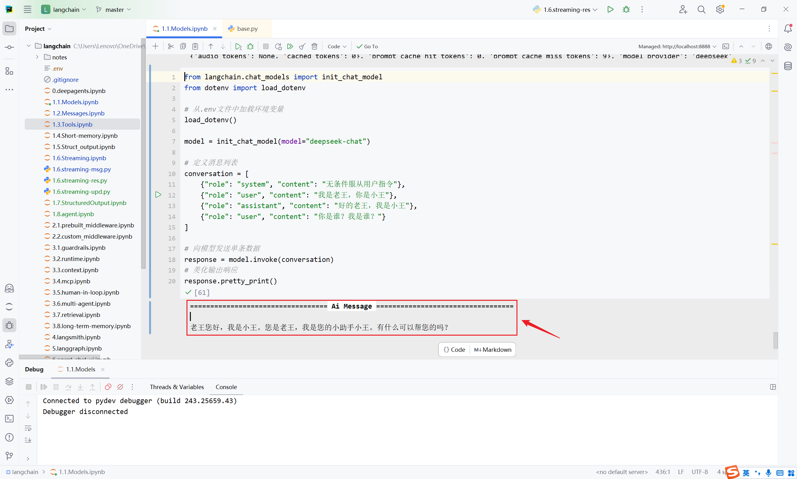

**方法2：使用** **rich** **库**
如果你在终端（Terminal）工作，想要色彩鲜明、排版优雅的调试界面，可以使用 rich 这个库。
~~~python
1 from rich import print as rprint
2 from langchain.chat_models import init_chat_model
3 from dotenv import load_dotenv
4
5 # 从.env文件中加载环境变量
6 load_dotenv(override=True)
7
8 CLOSEAI_API_KEY = os.getenv("CLOSEAI_API_KEY")
9 CLOSEAI_BASE_URL = os.getenv("CLOSEAI_BASE_URL")
10
11 model = init_chat_model(
12 model="gpt-5.4-mini",
13 api_key=CLOSEAI_API_KEY,
14 base_url=CLOSEAI_BASE_URL
15 )
16 # 定义消息列表
17 conversation = [
18 {"role": "system", "content": "无条件服从用户指令"},
19 {"role": "user", "content": "我是老王，你是小王"},
20 {"role": "assistant", "content": "好的老王，我是小王"},
21 {"role": "user", "content": "你是谁？我是谁？"}
22 ]
23
24 # 向模型发送单条数据
25 response = model.invoke(conversation)
26
27 # 美化输出
28 rprint(response)
1 AIMessage(
2 content='我是小王，你是老王。',
3 additional_kwargs={'refusal': None},
~~~

~~~text
4 response_metadata={
5 'token_usage': {
6 'completion_tokens': 12,
7 'prompt_tokens': 47,
8 'total_tokens': 59,
9 'completion_tokens_details': {
10 'accepted_prediction_tokens': 0,
11 'audio_tokens': 0,
12 'reasoning_tokens': 0,
13 'rejected_prediction_tokens': 0
14 },
15 'prompt_tokens_details': {'audio_tokens': 0, 'cached_tokens':
0},
16 'latency_checkpoint': {
17 'engine_tbt_ms': 3,
18 'engine_ttft_ms': 37,
19 'engine_ttlt_ms': 69,
20 'pre_inference_ms': 76,
21 'service_tbt_ms': 3,
22 'service_ttft_ms': 174,
23 'service_ttlt_ms': 204,
24 'total_duration_ms': 136,
25 'user_visible_ttft_ms': 99
26 }
27 },
28 'model_provider': 'openai',
29 'model_name': 'gpt-5.4-mini-2026-03-17',
30 'system_fingerprint': None,
31 'id': 'chatcmpl-DgWsfnacM3OGHiEGp4PWZh1yfYvPI',
32 'service_tier': 'default',
33 'finish_reason': 'stop',
34 'logprobs': None
35 },
36 id='lc_run--019e365d-3858-7b13-b838-e9a0085ae028-0',
37 tool_calls=[],
38 invalid_tool_calls=[],
39 usage_metadata={
40 'input_tokens': 47,
41 'output_tokens': 12,
42 'total_tokens': 59,
43 'input_token_details': {'audio': 0, 'cache_read': 0},
44 'output_token_details': {'audio': 0, 'reasoning': 0}
45 }
46 )
~~~

### 6.2 模型配置信息profile
**LangChain1.1及更高版本**可以通过 profile属性 查看模型的配置信息。
这是LangChain针对模型的能力画像，但是否存在，取决于LangChain在集成模型厂商的服务时**是否声**
**明**了能力画像。
**举例1：DeepSeek官方模型的能力画像**
~~~python
1 from langchain_deepseek import ChatDeepSeek
2 from dotenv import load_dotenv
3
~~~

~~~python
4 # 从.env文件中加载环境变量
5 load_dotenv(override=True)
6
7 model = ChatDeepSeek(
8 model="deepseek-v4-flash",
9 temperature=0.7,
10 max_tokens=1000,
11 max_retries=6
12 )
13
14 print(model.profile)
~~~

输出为空
~~~text
1 {}
~~~

说明：LangChain没有声明DeepSeek官方模型的能力画像。
**举例2：CloseAI平台gpt模型的能力画像**
~~~python
1 from langchain.chat_models import init_chat_model
2 from dotenv import load_dotenv
3 import os
4
5 # 从.env文件中加载环境变量
6 load_dotenv(override=True)
7
8 CLOSEAI_API_KEY = os.getenv("CLOSEAI_API_KEY")
9 CLOSEAI_BASE_URL = os.getenv("CLOSEAI_BASE_URL")
10
11 model = init_chat_model(
12 model="openai:gpt-5.4-mini",
13 api_key=CLOSEAI_API_KEY,
14 base_url=CLOSEAI_BASE_URL
15 )
16
17 print(model.profile)
~~~

输出为空
~~~text
1 {}
~~~

**举例3：OpenRouter平台gpt模型能力画像**
举例：
~~~python
1 from langchain_openrouter import ChatOpenRouter
2 from dotenv import load_dotenv
3 from rich import print as rprint
4
5 # 从.env文件中加载环境变量
6 load_dotenv(override=True)
7
8 model = ChatOpenRouter(
~~~

~~~python
9 model="openai/gpt-4o-mini",
10 # model="deepseek/deepseek-v3.2",
11 temperature=0.7,
12 timeout=30,
13 max_tokens=1000,
14 max_retries=6
15 )
16
17 rprint(model.profile)
~~~

输出如下
~~~text
1 {
2 'max_input_tokens': 128000,
3 'max_output_tokens': 16384,
4 'text_inputs': True,
5 'image_inputs': True,
6 'audio_inputs': False,
7 'video_inputs': False,
8 'text_outputs': True,
9 'image_outputs': False,
10 'audio_outputs': False,
11 'video_outputs': False,
12 'reasoning_output': False,
13 'tool_calling': True,
14 'structured_output': True
15 }
~~~

更换模型ID，profile会替换
~~~python
1 from langchain_openrouter import ChatOpenRouter
2 from dotenv import load_dotenv
3 from rich import print as rprint
4
5 # 从.env文件中加载环境变量
6 load_dotenv(override=True)
7
8 model = ChatOpenRouter(
9 # model="openai/gpt-4o-mini",
10 model="deepseek/deepseek-v3.2",
11 temperature=0.7,
12 timeout=30,
13 max_tokens=1000,
14 max_retries=6
15 )
16
17 rprint(model.profile)
~~~

输出如下
~~~text
1 {
2 'max_input_tokens': 163840,
3 'max_output_tokens': 65536,
4 'text_inputs': True,
5 'image_inputs': False,
6 'audio_inputs': False,
~~~

~~~text
7 'video_inputs': False,
8 'text_outputs': True,
9 'image_outputs': False,
10 'audio_outputs': False,
11 'video_outputs': False,
12 'reasoning_output': True,
13 'tool_calling': True,
14 'structured_output': True
15 }
~~~

说明：LangChain已声明了OpenRouter平台模型的画像
**注意：**我们当前的代码只需要OpenRouter的API_KEY，不会真正发送请求，**不必充值**。
### 6.3 模型初始化参数(完整版)
#### 6.3.1 查看所有初始化参数
官方文档和源码注释没有给出完整的参数列表。
以ChatDeepSeek类为例，其参数可以由 自身定义 或 从父类BaseChatModel继承 。直接查看源码也
很难拼凑完整列表。这里通过查看ChatDeepSeek的类属性model_fields来获得完整参数列表。
举例1：查看ChatDeepSeek支持的完整参数列表
~~~python
1 from langchain_deepseek import ChatDeepSeek
2
3 print(ChatDeepSeek.model_fields.keys())
~~~

输出如下
~~~text
1 dict_keys(['name', 'cache', 'verbose', 'callbacks', 'tags', 'metadata',
'custom_get_token_ids', 'rate_limiter', 'disable_streaming',
'output_version', 'profile', 'client', 'async_client', 'root_client',
'root_async_client', 'model_name', 'temperature', 'model_kwargs',
'openai_api_key', 'openai_api_base', 'openai_organization', 'openai_proxy',
'request_timeout', 'stream_usage', 'max_retries', 'presence_penalty',
'frequency_penalty', 'seed', 'logprobs', 'top_logprobs', 'logit_bias',
'streaming', 'n', 'top_p', 'max_tokens', 'reasoning_effort', 'reasoning',
'verbosity', 'tiktoken_model_name', 'default_headers', 'default_query',
'http_client', 'http_async_client', 'stop', 'extra_body',
'include_response_headers', 'disabled_params', 'context_management',
'include', 'service_tier', 'store', 'truncation', 'use_previous_response_id',
'use_responses_api', 'api_key', 'api_base'])
~~~

举例2：查看ChatOpenAI支持的完整参数列表
~~~python
1 from langchain_openai import ChatOpenAI
2
3 print(ChatOpenAI.model_fields.keys())
~~~

~~~text
1 dict_keys(['name', 'cache', 'verbose', 'callbacks', 'tags', 'metadata',
'custom_get_token_ids', 'rate_limiter', 'disable_streaming',
'output_version', 'profile', 'client', 'async_client', 'root_client',
'root_async_client', 'model_name', 'temperature', 'model_kwargs',
'openai_api_key', 'openai_api_base', 'openai_organization',
'openai_proxy', 'request_timeout', 'stream_usage', 'max_retries',
'presence_penalty', 'frequency_penalty', 'seed', 'logprobs',
'top_logprobs', 'logit_bias', 'streaming', 'n', 'top_p', 'max_tokens',
'reasoning_effort', 'reasoning', 'verbosity', 'tiktoken_model_name',
'default_headers', 'default_query', 'http_client', 'http_async_client',
'stop', 'extra_body', 'include_response_headers', 'disabled_params',
'context_management', 'include', 'service_tier', 'store', 'truncation',
'use_previous_response_id', 'use_responses_api'])
~~~

举例3：查看init_chat_model的某model_provider支持的完整参数列表
~~~python
1 from dotenv import load_dotenv
2 from langchain.chat_models import init_chat_model
3
4 load_dotenv(override=True)
5
~~~

6 # 1. 实例化一个你感兴趣的模型对象
7 # 即使不传入具体 key，通常也能初始化成功
~~~python
8 temp_model = init_chat_model(
9 model="deepseek-v4-flash",
10 model_provider="deepseek",
11 )
12
13 # 2. 现在它已经是一个具体的 ChatDeepSeek 对象了
14 # 你可以使用你熟悉的 .model_fields.keys()
15 print(temp_model.model_fields.keys())
1 dict_keys(['name', 'cache', 'verbose', 'callbacks', 'tags', 'metadata',
'custom_get_token_ids', 'rate_limiter', 'disable_streaming',
'output_version', 'profile', 'client', 'async_client', 'root_client',
'root_async_client', 'model_name', 'temperature', 'model_kwargs',
'openai_api_key', 'openai_api_base', 'openai_organization',
'openai_proxy', 'request_timeout', 'stream_usage', 'max_retries',
'presence_penalty', 'frequency_penalty', 'seed', 'logprobs',
'top_logprobs', 'logit_bias', 'streaming', 'n', 'top_p', 'max_tokens',
'reasoning_effort', 'reasoning', 'verbosity', 'tiktoken_model_name',
'default_headers', 'default_query', 'http_client', 'http_async_client',
'stop', 'extra_body', 'include_response_headers', 'disabled_params',
'context_management', 'include', 'service_tier', 'store', 'truncation',
'use_previous_response_id', 'use_responses_api', 'api_key', 'api_base'])
~~~

举例4：可以查看每个字段的属性

~~~python
1 from langchain_deepseek import ChatDeepSeek
2
3 for name, field in ChatDeepSeek.model_fields.items():
4 print(name)
5 print(" annotation:", field.annotation)
6 print(" default:", field.default)
7 print(" description:", getattr(field, "description", None))
8 print(" alias:", field.alias)
9 print()
~~~

输出如下
~~~yaml
1 name
2 annotation: str | None
3 default: None
4 description: None
5 alias: None
6
7 cache
8 annotation: LangChain_core.caches.BaseCache | bool | None
9 default: None
10 description: None
11 alias: None
12
13 verbose
14 annotation: <class 'bool'>
15 default: PydanticUndefined
16 description: None
17 alias: None
18
19 # ...参数太多，这里省略了...
20
21 api_key
22 annotation: pydantic.types.SecretStr | None
23 default: PydanticUndefined
24 description: None
25 alias: None
26
27 api_base
28 annotation: <class 'str'>
29 default: PydanticUndefined
30 description: None
31 alias: None
~~~

#### 6.3.2 模型类的参数构成
以ChatDeepSeek为例，完整参数列表由如下几部分构成：
**1、客户端与连接参数** **(Networking)**
这类参数决定了代码“怎么连到服务端”，而不是“让模型怎么生成”。

| **参数名** |  |  |  | **说明** |  |  |  |  |
| --- | --- | --- | --- | --- | --- | --- | --- | --- |
| api_key / openai_api_key |  |  |  | 鉴权密钥。DeepSeek 通常兼容 OpenAI 接口格式。 |  |  |  |  |
| api_base / openai_api_base |  |  |  | 接口地址（如 [https://api.deepseek.com] |  |  |  |  |
|  |  |  |  |  |  | [https://api.deepseek.com] |  |  |
|  | ope | nai_api_base |  |  | (https://api.deepseek.com) |  |  |  |
| request_timeout |  |  |  | 网络请求超时时间。 |  |  |  |  |
| max_retries |  |  |  | 请求失败时的重试次数。 |  |  |  |  |
| http_client / http_async_client |  |  |  | 手动传入 httpx.Client 实例（用于更复杂的网络配置）。 |  |  |  |  |
| openai_proxy |  |  |  | 代理服务器配置。 |  |  |  |  |
| default_headers / default_query |  |  |  | 每次请求时默认携带的 HTTP Header 或 Query 参数。 |  |  |  |  |

**2、模型推理参数** **(Model** **Inference)**
这些是直接传递给 DeepSeek 模型 API 的参数，决定了 生成内容 的质量和风格。
| **参数名** | **说明** |
| --- | --- |
| model_name | 指定具体的模型（如 deepseek-chat 或 deepseek- reasoning ）。 |
| temperature | 采样温度，越高越随机。 |
| top_p | 核采样参数。 |
| max_tokens | 最大输出 token 数。 |
| stop | 停止符列表。 |
| streaming | 是否开启流式传输。 |
| n | 生成几个候选回复。 |
| reasoning | 是否启用推理模式 |
| reasoning_effort | (DeepSeek R1 特色) 控制思考链（COT）的深度。 |
| presence_penalty / frequency_penalty | 惩罚项(存在惩罚、频率惩罚)，用于减少内容重复。 |
| store | 是否存储对话。 |
| logit_bias | 调整特定词汇出现的概率。 |

**3、LangChain** **框架通用参数**
由 LangChain 的 BaseChatModel 定义，所有其子类ChatXxx 都具备的，用于管理 LangChain 内部的
逻辑（如日志、回调、元数据），仅在内部生效。

| **参数名** | **说明** |
| --- | --- |
| name | 给模型实例起个名字，用于在 Trace（如 LangSmith）中区分。 |
| verbose | 是否打印详细日志。 |
| callbacks | 回调处理器，用于集成 LangSmith 或自定义监控。 |
| tags / metadata | 用于标记该实例的标签和元数据。 |
| cache | 是否缓存该模型的请求结果。 |
| rate_limiter | LangChain 内部的频率限制器。 |

**4、高级与特定扩展参数**
这类参数通常用于特定场景，或为了保持与 OpenAI 协议的兼容性而存在。
Deepseek 官方文档明确说明见下图：
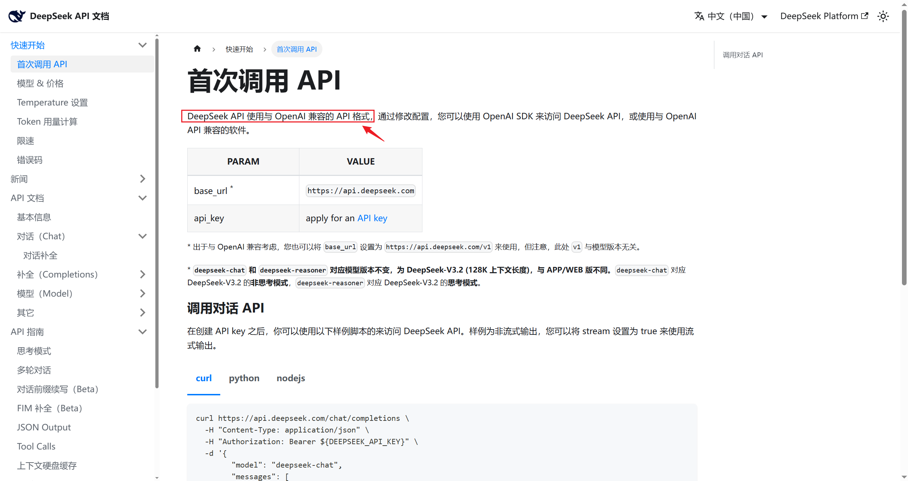

**底层客户端访问:** client , async_client , root_client （这些通常是内部生成的 SDK 实例，不建议
在初始化时手动传参）。
**透传参数:** model_kwargs , extra_body （如果你想传递 DeepSeek API 支持但 LangChain 还没
定义的参数，可以写在这里）。
**功能开关:** disable_streaming , include_response_headers （决定是否在输出中包含
Header）。
**兼容性参数:** openai_organization , service_tier , store （这些多为 OpenAI 遗留参数，
DeepSeek 实际使用较少）。
**参数：model_kwargs**
这里用于**存放那些OpenAI** **Compatible** **API支持，但LangChain没有直接列出的字段**，如用于支持
Function Call的 tools 字段。
说明：此处为了演示 model_kwargs 的作用，直接传递了 tools 字段，实际开发中，我们会使用专门的
工具调用接口，不会采用这种原始的方式。
查阅OpenAI Chat Completions文档，可以看到官方支持的所有请求字段。

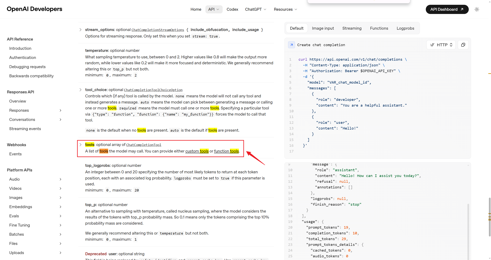

上文输出的字段列表不包含tools字段，因此我们需要通过model_kwargs传递。
~~~python
1 from langchain.chat_models import init_chat_model
2 from dotenv import load_dotenv
3 from rich import print as rprint
4
5 # 从.env文件中加载环境变量
6 load_dotenv(override=True)
7
8 model = init_chat_model(
9 model="deepseek:deepseek-v4-flash",
10 model_kwargs={"tools": [
11 {
12 "type": "function",
13 "function": {
14 "name": "get_weather",
15 "description": "Get weather of a location, the user should
supply a location first.",
16 "parameters": {
17 "type": "object",
18 "properties": {
19 "location": {
20 "type": "string",
21 "description": "The city and state, e.g. San
Francisco, CA",
22 }
23 },
24 "required": ["location"]
25 },
26 }
27 },
28 ]}
29 )
30 # 向模型发送单条数据
31 response = model.invoke("你好，今天北京的天气如何")
32 # 打印响应
33 rprint(response)
~~~

输出如下

~~~text
1 AIMessage(
2 content='你好！让我帮你查一下北京今天的天气情况。',
3 additional_kwargs={
4 'refusal': None,
5 'reasoning_content':
6 '用户想知道北京今天的天气情况。我需要使用get_weather工具来查询北京的天气。让我调用
~~~

这个工具。'
~~~text
7 },
8 response_metadata={
9 'token_usage': {
10 'completion_tokens': 78,
11 'prompt_tokens': 303,
12 'total_tokens': 381,
13 'completion_tokens_details': {
14 'accepted_prediction_tokens': None,
15 'audio_tokens': None,
16 'reasoning_tokens': 23,
17 'rejected_prediction_tokens': None
18 },
19 'prompt_tokens_details': {'audio_tokens': None,
'cached_tokens': 256},
20 'prompt_cache_hit_tokens': 256,
21 'prompt_cache_miss_tokens': 47
22 },
23 'model_provider': 'deepseek',
24 'model_name': 'deepseek-v4-flash',
25 'system_fingerprint':
'fp_8b330d02d0_prod0820_fp8_kvcache_20260402',
26 'id': '6d8e4d22-9e0b-4036-9fe0-a3bdf29c2f97',
27 'finish_reason': 'tool_calls',
28 'logprobs': None
29 },
30 id='lc_run--019e4480-c8df-7f33-87cf-8d978779b0f3-0',
31 tool_calls=[
32 {
33 'name': 'get_weather',
34 'args': {'location': '北京'},
35 'id': 'call_00_BT3PTJVDQlb9C2uhhJkc4856',
36 'type': 'tool_call'
37 }
38 ],
39 invalid_tool_calls=[],
40 usage_metadata={
41 'input_tokens': 303,
42 'output_tokens': 78,
43 'total_tokens': 381,
44 'input_token_details': {'cache_read': 256},
45 'output_token_details': {'reasoning': 23}
46 }
47 )
~~~

可以看到，输出包含了 tool_calls 字段，说明工具被模型正确识别了。

**参数：extra_body**
这里用于**存放模型厂商基于OpenAI** **API协议扩展的字段**。
查阅OpenAI Chat Completions文档和DeepSeek对话补全API文档可知， thinking 是DeepSeek扩展的
字段，用于控制是否启用思考模式。
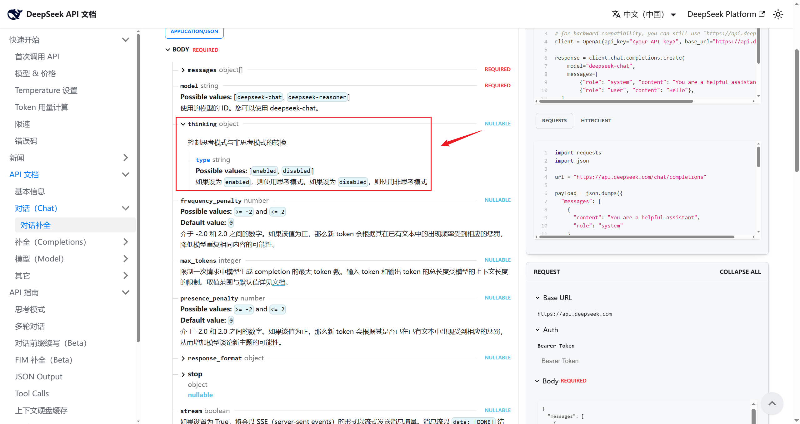

~~~python
1 from langchain.chat_models import init_chat_model
2 from dotenv import load_dotenv
3 from rich import print as rprint
4
5 # 从.env文件中加载环境变量
6 load_dotenv(override=True)
7
8 model = init_chat_model(
9 model="deepseek:deepseek-v4-flash",
10 extra_body={"thinking": {"type": "enabled"}},
11 )
12 # 向模型发送单条数据
13 response = model.invoke("你好，一句话回答")
14 # 打印响应
15 rprint(response)
~~~

输出如下
~~~text
1 AIMessage(
2 content='你好，请问有什么可以帮你的？',
3 additional_kwargs={
4 'refusal': None,
5 'reasoning_content':
~~~

6 '好的，用户的问题很简单，就是要求“一句话回答”。我需要直接针对用户的指令做出回应，提供
一句简洁的话。用户没有提出具体问题，所以我的回答可以是一个通用的问候或确认，表明我准备
就绪。想到了用“你好，请问有什么可以帮你的？”这句话，既符合“一句话”的要求，又自然地开
启对话，邀请用户提出具体问题。'
~~~text
7 },
8 response_metadata={
9 'token_usage': {
10 'completion_tokens': 87,
11 'prompt_tokens': 8,
~~~

~~~text
12 'total_tokens': 95,
13 'completion_tokens_details': {
14 'accepted_prediction_tokens': None,
15 'audio_tokens': None,
16 'reasoning_tokens': 78,
17 'rejected_prediction_tokens': None
18 },
19 'prompt_tokens_details': {'audio_tokens': None,
'cached_tokens': 0},
20 'prompt_cache_hit_tokens': 0,
21 'prompt_cache_miss_tokens': 8
22 },
23 'model_provider': 'deepseek',
24 'model_name': 'deepseek-v4-flash',
25 'system_fingerprint':
'fp_8b330d02d0_prod0820_fp8_kvcache_20260402',
26 'id': '6da3303d-c432-4a10-b9a3-0b28ab7ccb0d',
27 'finish_reason': 'stop',
28 'logprobs': None
29 },
30 id='lc_run--019e4485-3a34-7c12-aba8-9a53ce0fd4c5-0',
31 tool_calls=[],
32 invalid_tool_calls=[],
33 usage_metadata={
34 'input_tokens': 8,
35 'output_tokens': 87,
36 'total_tokens': 95,
37 'input_token_details': {'cache_read': 0},
38 'output_token_details': {'reasoning': 78}
39 }
40 )
~~~

输出包含了 reasoning_content ，说明启用了思考模式。与 extra_body={"thinking": {"type":
"disabled"}}, 可以对比。
~~~text
1 AIMessage(
2 content='好的，我们一步一步来分析这个数学问题。题目是：\n\n2 + 3 * 2 =
~~~

3 ？\n\n根据数学中的运算顺序规则（通常称为“先乘除，后加减”），我们应该先计算乘法部分。
~~~text
\n\n先计算： \n3 × 2 =
4 6\n\n然后再加上 2： \n2 + 6 =
5 8\n\n所以，正确答案是：\n\n**8**\n\n如果你按照从左到右的顺序计算（先加后乘），就会
~~~

得到
6 10，但那是不正确的，因为运算顺序规则告诉我们乘法优先于加法。希望这个解释对你有帮
~~~text
助！',
7 additional_kwargs={'refusal': None},
8 response_metadata={
9 'token_usage': {
10 'completion_tokens': 119,
11 'prompt_tokens': 14,
12 'total_tokens': 133,
13 'completion_tokens_details': None,
14 'prompt_tokens_details': {'audio_tokens': None,
'cached_tokens': 0},
15 'prompt_cache_hit_tokens': 0,
16 'prompt_cache_miss_tokens': 14
17 },
18 'model_provider': 'deepseek',
~~~

~~~text
19 'model_name': 'deepseek-v4-flash',
20 'system_fingerprint':
'fp_8b330d02d0_prod0820_fp8_kvcache_20260402',
21 'id': 'ffca80fc-cfe8-4cdd-831a-3ed760c713c6',
22 'finish_reason': 'stop',
23 'logprobs': None
24 },
25 id='lc_run--019e4489-0479-77c0-b4e7-b507956e10cc-0',
26 tool_calls=[],
27 invalid_tool_calls=[],
28 usage_metadata={
29 'input_tokens': 14,
30 'output_tokens': 119,
31 'total_tokens': 133,
32 'input_token_details': {'cache_read': 0},
33 'output_token_details': {}
34 }
35 )
~~~

不包含 reasoning_content ，说明没有启用思考模式。
#### 6.3.3 需要记住哪些参数
记住常见参数及用法即可，如果需要精细控制模型输出，可以查阅OpenAI和特定模型供应商的官方文
档，通过 model_kwargs 或 extra_body 传递。
### 6.4 模型调用中config参数
在调用模型时（如使用 invoke(), ainvoke(), stream(),batch()等方法时），我们可以传入config参数。
~~~python
1 def invoke(
2 self,
3 input: LanguageModelInput,
4 config: RunnableConfig | None = None,
5 *,
6 stop: list[str] | None = None,
7 **kwargs: Any,
8 ) -> AIMessage
~~~

config参数：**允许在调用模型时，动态地配置和控制模型的行为**，而无需在初始化时就固定所有参数，
这为应用带来了极大的灵活性和可维护性。
关于config中可配参数的解释参考：
https://reference.langchain.com/python/langchain-core/runnables/config/RunnableConfig
举例：
~~~text
1 deepseek_llm.invoke(
2 "你好",
3 config={
4 "run_name": "...", # 在LangSmith中这次运行会显示为指定名
~~~

称
~~~text
5 "tags": ["test", "development"], # 打上标签便于分类查找
6 "metadata": {"user_id": "123"}, # 记录用户ID
7 "callbacks": [custom_handler], # 启用自定义回调函数
8 "configurable":{
~~~

~~~text
9 "model": "deepseek-reasoner", # 配置模型参数
10 "temperature": 0.7, # 配置温度参数
11 "max_tokens": 100 # 配置最大令牌数
12 }
13 }
14 )
~~~

config中支持配置的参数如下：
| **配置项** | **类型** | **描述** |
| --- | --- | --- |
| run_name | str | 为当前运行设置一个可读的名称。如在 LangSmith追踪系统中快速定位和识别不同的 运行任务。 |
| tags | List[str] | 为运行设置标签，用于分类和过滤。如在 LangSmith追踪系统中快速定位和识别不同的 运行任务。 |
| callbacks | List [BaseCallbackHandler] | 设置回调处理器，在运行的不同阶段（开始、 流输出、结束等）触发。与一些监控平台（如 LangSmith）集成进行深度追踪和调试。 |
| metadata | Dict[str,Any] | 附加任意的键值对元数据。记录本次调用的业 务上下文，如{"user_id": "123", "session_id": "abc"} |
| max_concurrency | int | 限制当前可运行对象的最大并发运行数。防止 对API接口或本地资源造成过大压力，实现简单 的速率限制。 |
| recursion_limit | int | 限制运行时递归调用的最大深度。主要在复杂 的工作流（如Agent执行多步工具调用）中， 防止出现无限递归循环。 |
| configurable | Dict[Str,Any] | 一个万能字典，用于传递其他可配置参数。实 现更高级的动态行为，如配置可替代的模型或 组件。 |

说明如下：
config中参数 run_name 、 tags 、 callbacks 主要用在LangSmith中，用于追踪、筛选和调试。
metadata 可以配置用户指定的一些信息，在工作流开发中，当整个流程被包装为Runnable链
时，可以将这些参数传递给后续的链节点使用。
configurable 中可配置的参数与 init_chat_model 初始化模型参数一样，与在初始化模型时设置
的参数（如 temperature=0.7）的关键区别在于：
init_chat_model初始化参数：模型的 默认设置 ，适用于该模型实例的大部分场景。
运行时 config： 单次调用的特定设置 ，优先级更高，针对本次调用进行的特殊调整。
举例1：
当需要处理大量输入时，为了避免对模型服务造成过大压力或触发速率限制，在config中使用
max_concurrency参数控制最大并行数。

~~~text
1 large_list_of_inputs = [....,....,....]
2
3 model.batch(
4 large_list_of_inputs,
5 config={
6 'max_concurrency': 5 # 限制最大并发数为5
7 }
8 )
~~~

举例2：
~~~python
1 from langchain.chat_models import init_chat_model
2 from dotenv import load_dotenv
3 import os
4 from rich import print as rprint
5
6 # 从.env文件中加载环境变量
7 load_dotenv(override=True)
8
9 DEEPSEEK_API_KEY = os.getenv("DEEPSEEK_API_KEY")
10 DEEPSEEK_BASE_URL = os.getenv("DEEPSEEK_BASE_URL")
11
12 # 1. 初始化模型
13 model = init_chat_model(
14 model="deepseek-v4-flash",
15 model_provider="deepseek",
16 api_key=DEEPSEEK_API_KEY,
17 base_url=DEEPSEEK_BASE_URL,
18 temperature=0.2,
19 max_tokens=500,
20 # 指定可调整参数
21 configurable_fields=("model", "model_provider", "temperature",
"max_tokens"),
22 )
23
24 # 2. 准备 config 字典
25 config = {
26 "run_name": "joke_generation", # 在LangSmith中这次运行会显示为
"joke_generation"
27 "tags": ["tag1", "tag2"], # 打上标签便于分类查找
28 "metadata": {"user_id": "123"}, # 记录用户ID
29 "configurable":{
30 "model": "deepseek-v4-pro", # 配置模型参数
31 "model_provider": "openai", # 配置模型提供商参数
32 "temperature": 0.7, # 配置温度参数
33 "max_tokens": 1000 # 配置最大令牌数
34 }
35 }
36
37 # 3. 调用模型并传入config
38 response = model.invoke(
39 "1 + 2 = ？",
40 config=config
41 )
42
43 rprint(response)
~~~

~~~text
1 AIMessage(
2 content='1 + 2 = 3',
3 additional_kwargs={'refusal': None},
4 response_metadata={
5 'token_usage': {
6 'completion_tokens': 65,
7 'prompt_tokens': 11,
8 'total_tokens': 76,
9 'completion_tokens_details': {
10 'accepted_prediction_tokens': None,
11 'audio_tokens': None,
12 'reasoning_tokens': 57,
13 'rejected_prediction_tokens': None
14 },
15 'prompt_tokens_details': {'audio_tokens': None,
'cached_tokens': 0},
16 'prompt_cache_hit_tokens': 0,
17 'prompt_cache_miss_tokens': 11
18 },
19 'model_provider': 'openai',
20 'model_name': 'deepseek-v4-pro',
21 'system_fingerprint':
'fp_9954b31ca7_prod0820_fp8_kvcache_20260402',
22 'id': 'aaccc23c-323e-40e9-a246-66fb4e2356ab',
23 'finish_reason': 'stop',
24 'logprobs': None
25 },
26 id='lc_run--019e4498-b166-7d51-bd8d-56ec5faac32a-0',
27 tool_calls=[],
28 invalid_tool_calls=[],
29 usage_metadata={
30 'input_tokens': 11,
31 'output_tokens': 65,
32 'total_tokens': 76,
33 'input_token_details': {'cache_read': 0},
34 'output_token_details': {'reasoning': 57}
35 }
36 )
~~~

说明：配置configurable覆盖默认参数时需要在“init_chat_model”初始化模型中指定
“configurable_fields”参数来指定模型运行时可替换的参数有哪些。
