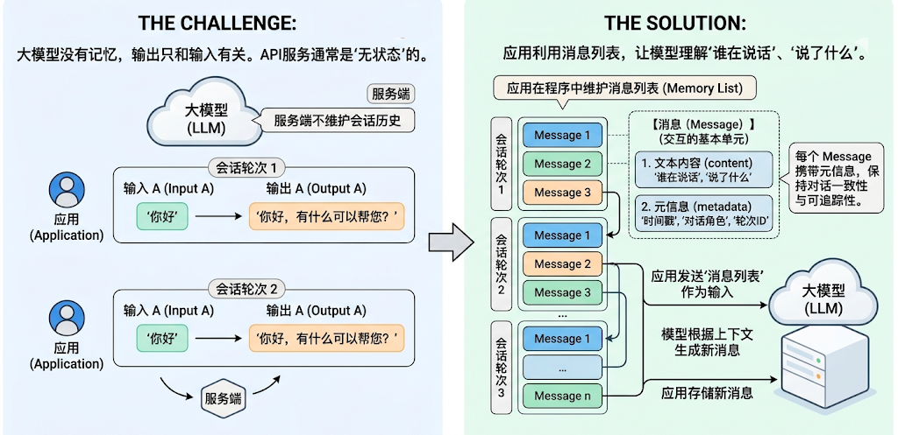
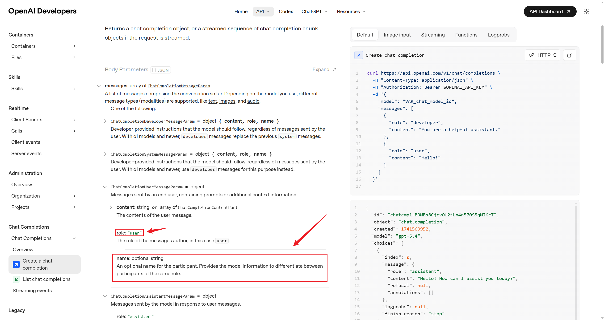
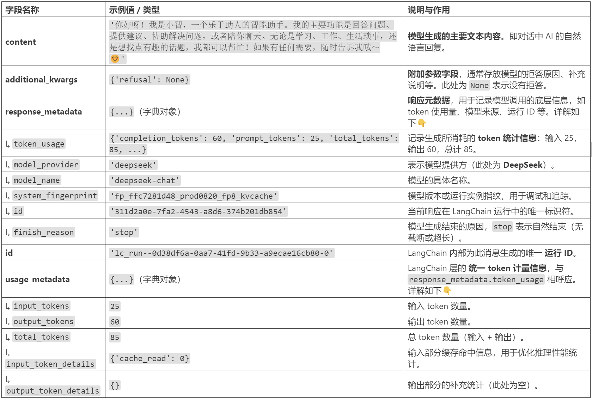
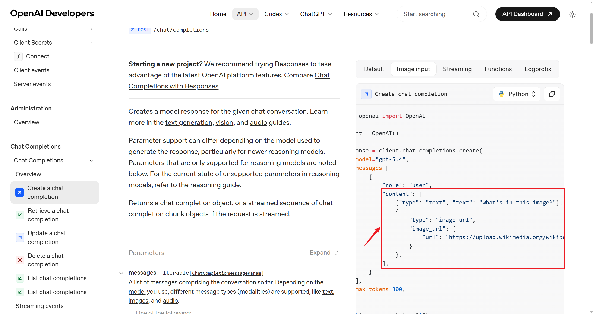
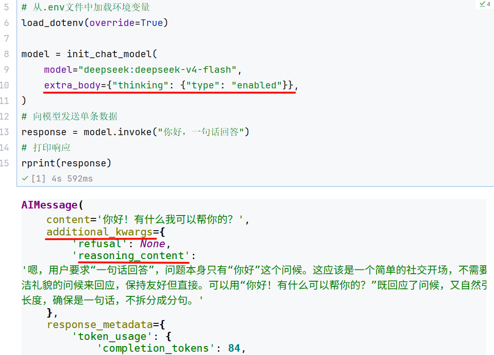

# 第04章：消息与提示词模板
讲师：尚硅谷-宋红康
官网：尚硅谷
## 1、认识消息
大模型没有记忆，它的输出只和输入模型的内容有关（上下文）。很多大模型API服务也没有在服务端维
护会话历史，是“ 无状态 ”的。因此，**如果应用需要“记住”对话历史，需要在程序中维护消息列表。**


**在** **LangChain** **中，Message（消息）是模型交互的最基本单元。**它既代表模型接收到的 输入
（Input） ，也代表模型生成的 输出（Output） 。
每一轮与大模型的对话，都由一条或多条 Message 构成。每个 Message 不仅包含 文字内容 ，还
携带描述上下文状态的 元信息（metadata） ，用于保持对话的一致性和可追踪性。比如，模型
在多轮交互中理解“谁在说话”、“说了什么”、“这条信息属于哪一轮对话”。
LangChain 在 1.0 中提供了**跨模型统一的** **Message** **标准**。无论你使用的是 OpenAI、Anthropic、
Gemini 还是本地模型，这一标准都能保持一致的行为。好处：
兼容性强 ：不同模型的消息格式自动对齐。
可扩展性高 ：方便添加多模态内容或自定义字段。
可追踪性好 ：为 LangSmith 等调试工具提供一致的上下文数据结构。
### 1.1 消息的内部结构
LangChain的消息（Message）对象包含三种字段
**Role**：消息所属的角色或类型，如 system 、 user 、 assistant 。
**Content**：消息内容
**Metadata**：（可选）元数据，存储额外信息。如：消息ID、响应时间、token消耗量、消息标签
等

### 1.2 消息的类型
LangChain定义了很多消息类型，通过 role 区分。常用的有四种。
**1、系统消息**
也称为系统提示词，用于在对话开始时为模型设定角色、行为准则和上下文背景。它像是给AI助手的一
份工作说明书，决定了其回答问题的风格、领域和专业范围。
~~~json
1 {"role": "system", "content": "你是个精通编程的软件架构师"}
~~~

**2、用户消息**
也称为用户提示词，在多轮对话中，它表示用户的一次输入。可以包含简单的文本问题，也可以是复杂
的多模态内容（如图片、音频、文档等）。
~~~json
1 {"role": "user", "content": "你好啊~"}
~~~

**3、助手(AI)消息**
代表模型的回复，包括生成的文本、工具调用、元数据等。
~~~json
1 {"role": "assistant", "content": "我也很高兴认识你"}
1 {
2 "role": "assistant",
3 "content": "",
4 "tool_calls": [{
5 "name": "get_weather",
6 "args": {"location": "北京"},
7 "id": "call_00_nUD2NC9QRN5Cg1GaoIkBJQ4s"
8 }]
9 }
~~~

**4、工具调用消息**
工具调用结果匹配的消息类型。将此消息返回给模型，让模型基于这个结果继续生成回复。在Tools一节
详细介绍。
~~~json
1 {"role": "tool", "content": "今天天气很好", "tool_call_id":
"call_00_nUD2NC9QRN5Cg1GaoIkBJQ4s"}
~~~

**问题：为什么使用不同的消息类型？**
明确角色 ：清晰区分系统提示、用户输入和 AI 回复
控制行为 ：通过 SystemMessage 精确控制 AI 的行为
对话历史 ：构建完整的多轮对话上下文
调试友好 ：更容易追踪和调试对话流程

### 1.3 消息格式
LangChain支持两种消息格式。
**格式1：JSON格式**
**1、系统消息**
~~~json
1 {"role": "system", "content": "你是个善解人意的助手"}
~~~

**2、用户消息**
~~~json
1 {"role": "user", "content": "你好啊~"}
~~~

**3、助手消息**
~~~json
1 {"role": "assistant", "content": "我也很高兴认识你"}
~~~

**4、工具调用消息**
~~~json
1 {"role": "tool", "content": "<工具输出>", "tool_call_id":
"call_00_nUD2NC9QRN5Cg1GaoIkBJQ4s"}
~~~

**格式2：对象格式**
**1、系统消息**
~~~text
1 SystemMessage(content="你是个善解人意的助手")
~~~

**2、用户消息**
~~~text
1 HumanMessage(content="你好啊~")
~~~

**3、助手消息**
~~~text
1 AIMessage("我也很高兴认识你")
~~~

**4、工具调用消息**
~~~text
1 ToolMessage(
2 content="<工具输出>",
3 tool_call_id="call_00_nUD2NC9QRN5Cg1GaoIkBJQ4s" # 一定要和AI消息中的调用ID匹
~~~

配
~~~text
4 )
~~~

举例：
~~~python
1 from langchain_core.messages import (
2 HumanMessage, # 用户消息
3 AIMessage, # AI 消息
4 SystemMessage, # 系统消息
5 ToolMessage # 工具返回消息
~~~

~~~text
6 )
7
8 # 消息列表示例
9 messages = [
10 SystemMessage(content="你是一个助手"),
11 HumanMessage(content="你好"),
12 AIMessage(content="你好！有什么可以帮你？"),
13 HumanMessage(content="天气怎么样？"),
14 AIMessage(content="让我查询一下..."),
15 ToolMessage(content="北京：晴天", tool_call_id="call_123"),
16 AIMessage(content="北京今天是晴天")
17 ]
~~~

小结：
|  |  |  | **字典格式** |  |  | **对象格式** | **用途** | **示例** |
| --- | --- | --- | --- | --- | --- | --- | --- | --- |
|  | System |  | {"role":<br>"system", ...} |  |  | SystemMessage(...) | 设定 AI 的行<br>为、角色、规<br>则 | "你是一个专业的<br>数学老师" |
|  | User |  | {"role":<br>"user", ...} |  |  | HumanMessage(...) | 用户输入 | "什么是微积分？" |
|  | Assistant |  | {"role": |  |  | AIMessage(...) | AI 的回复 | "微积分是研究变<br>化率的数学分<br>支..." |
|  |  |  |  | {"role": |  |  |  |  |
|  |  | ant | "assistant", |  |  |  |  |  |
|  |  |  |  | ...} |  |  |  |  |
|  |  |  |  |  |  |  |  |  |
|  | Tool |  | {"role": "tool",<br>...} |  |  | ToolMessage(...) | 工具执行的结<br>果 | "今天北京天气晴<br>朗，万里无云" |

|  |  | **{"role":** |  |  |  |
| --- | --- | --- | --- | --- | --- |
|  |  |  |  |  |  |
| m |  |  |  |  |  |
|  |  | "system", ...} |  |  |  |

|  |  | **{"role":** |  |  |
| --- | --- | --- | --- | --- |
|  |  |  |  |  |
|  |  | "user", ...} |  |  |

|  |  | **{"role": "tool",** |  |  |
| --- | --- | --- | --- | --- |
| Tool |  |  |  |  |
|  |  | ...} |  |  |

### 1.4 举 例
**举例1：JSON格式**
~~~python
1 from langchain.chat_models import init_chat_model
2 from dotenv import load_dotenv
3 import os
4
5 # 从.env文件中加载环境变量
6 load_dotenv(override=True)
7
8 CLOSEAI_API_KEY = os.getenv("CLOSEAI_API_KEY")
9 CLOSEAI_BASE_URL = os.getenv("CLOSEAI_BASE_URL")
10
11 model = init_chat_model(
12 model="gpt-5.4-mini",
13 model_provider="openai",
14 api_key=CLOSEAI_API_KEY,
15 base_url=CLOSEAI_BASE_URL
16 )
17
18 # 通过JSON初始化
19 messages = [
20 {"role": "system", "content": "你是一个善于给出通俗易懂解释的AI助手"},
21 {"role": "user", "content": "你好"},
~~~

~~~python
22 {"role": "assistant", "content": "你好！我能帮你什么？"},
23 {"role": "user", "content": "什么是机器学习"}
24 ]
25
26 response = model.invoke(messages)
27 print(response.content)
~~~

1 机器学习，简单说，就是**让计算机通过数据自己学规律**，而不是每一步都靠人手工写死规
则。
~~~text
2
3 ### 直观理解
~~~

4 比如你想让电脑识别“这是一张猫的图片”：
~~~text
5
~~~

6 - 传统方法：程序员手写很多规则，比如“有胡须、三角耳朵、眼睛大概率是猫”。
7 - 机器学习：给电脑很多猫和非猫的图片，让它自己从数据里总结出“猫长什么样”的规律。
~~~text
8
9 ### 核心特点
10 1. **数据驱动**：靠大量数据来学习。
11 2. **自动找规律**：模型自己从例子中总结模式。
12 3. **可以预测或判断**：学完以后，能对新数据做出预测。
13
14 ### 常见应用
15 - **垃圾邮件过滤**
16 - **人脸识别**
17 - **推荐系统**（比如短视频、商品推荐）
18 - **语音识别**
19 - **天气、销量预测**
20
21 ### 一个简单比喻
22 机器学习就像**学生做题**：
23 - 训练数据 = 练习题和答案
24 - 学习过程 = 学生总结解题方法
25 - 新数据 = 考试新题
26 - 目标 = 做对没见过的新题
27
28 ### 它不是“自动变聪明”
~~~

29 机器学习的效果依赖：
~~~text
30 - 数据质量
31 - 数据数量
32 - 模型设计
33 - 训练方法
34
~~~

35 如果数据有问题，学出来的结果也可能不准。
~~~text
36
~~~

37 如果你愿意，我还可以继续用**“最适合初学者的方式”**给你讲：
~~~text
38 1. 机器学习和人工智能的区别
~~~

39 2. 监督学习、无监督学习是什么
40 3. 一个具体例子带你看懂训练过程
**举例2：对象格式**
~~~python
1 from langchain_core.messages import SystemMessage,HumanMessage,AIMessage
2 from langchain.chat_models import init_chat_model
3 from dotenv import load_dotenv
4 import os
5
~~~

~~~python
6 # 从.env文件中加载环境变量
7 load_dotenv(override=True)
8
9 CLOSEAI_API_KEY = os.getenv("CLOSEAI_API_KEY")
10 CLOSEAI_BASE_URL = os.getenv("CLOSEAI_BASE_URL")
11
12 model = init_chat_model(
13 model="gpt-5.4-mini",
14 model_provider="openai",
15 api_key=CLOSEAI_API_KEY,
16 base_url=CLOSEAI_BASE_URL
17 )
18
19 # 通过JSON初始化
20 messages = [
21 SystemMessage("你是一个善于给出通俗易懂解释的AI助手"),
22 HumanMessage("你好"),
23 AIMessage("你好！我能帮你什么？"),
24 HumanMessage("什么是机器学习"),
25 ]
26
27 response = model.invoke(messages)
28 print(response.content)
~~~

1 机器学习，简单来说，就是**让计算机通过数据自己找规律、学会做判断**，而不是每一步都由
人手工写死规则。
~~~text
2
3 ### 直观理解
~~~

4 比如你想让电脑识别“垃圾邮件”：
5 - 传统方法：人来写规则，比如“标题里有免费、中奖、优惠，可能是垃圾邮件”
6 - 机器学习：给电脑很多“邮件 + 是否垃圾”的样本，让它自己总结出特征和判断方法
~~~text
7
8 ### 它的核心特点
9 1. **输入数据**
~~~

10 机器学习需要大量数据作为“教材”。
~~~text
11
12 2. **训练模型**
~~~

13 计算机会从数据中学习规律，得到一个“模型”。
~~~text
14
15 3. **做预测/决策**
~~~

16 学完后，模型可以对新数据做判断，比如：
17 - 这封邮件是不是垃圾邮件
18 - 这张图片里是什么物体
~~~text
19 - 明天的温度大概多少
20
21 ### 一个简单例子
~~~

22 如果你给机器看很多房子的资料：
~~~text
23 - 面积
24 - 地段
25 - 房龄
26 - 对应价格
27
~~~

28 它就可能学会：
~~~text
29 **面积更大、地段更好，价格通常更高**。
~~~

30 以后看到新房子，它就能估算价格。
~~~text
31
32 ### 常见应用
~~~

~~~text
33 - 人脸识别
34 - 语音助手
~~~

35 - 推荐系统（比如短视频、购物推荐）
~~~text
36 - 自动翻译
37 - 金融风控
38 - 医疗辅助诊断
39
40 ### 一句话总结
~~~

41 **机器学习就是让机器从数据中自动学习规律，并用这些规律去预测或决策。**
~~~text
42
~~~

43 如果你愿意，我还可以继续用**“小学生能懂的方式”**或者**“结合人工智能和深度学习的关系”
~~~text
**给你讲。
~~~

### 1.5 消息对象字段说明
此处仅说明**常用**字段，完整字段列表查阅**官方手册**或**阅读源码**。
#### 1.5.1 SystemMessage参数列表
content ：消息内容，字段名可以省略
~~~text
1 SystemMessage("你是个善解人意的助手")
~~~

相当于
~~~text
1 SystemMessage(content = "你是个善解人意的助手")
~~~

#### 1.5.2 HumanMessage参数列表
content ：消息内容，字段名可以省略
~~~text
1 HumanMessage("你好啊~")
~~~

相当于
~~~text
1 HumanMessage(content = "你好啊~")
~~~

metadata ：元数据字段，可以有很多，自定义
举例：带有元数据字段
~~~text
1 HumanMessage(
2 content="Hello!",
3 name="alice", # 可选，用户名
4 id="msg_123", # 可选，message的ID
5 )
~~~

name 和 id 都属于元数据字段，当消息类型相同，对消息进行区分。但不是所有模型都支持这一功
能，是否支持取决于模型供应商，需要查看官方手册。比如：
OpenAI的API手册告诉我们，HumanMessage支持 name 作为元数据字段，如下图所示。而
DeepSeek的API官方文档明确支持 name 作为元数据，但实测发现模型无法识别。



**举例：**
此处通过CloseAI平台调用 gpt-5.4-mini 展示 name 的作用。
~~~python
1 from langchain_core.messages import SystemMessage,HumanMessage,AIMessage
2 from langchain.chat_models import init_chat_model
3 from dotenv import load_dotenv
4 import os
5
6 # 从.env文件中加载环境变量
7 load_dotenv(override=True)
8
9 CLOSEAI_API_KEY = os.getenv("CLOSEAI_API_KEY")
10 CLOSEAI_BASE_URL = os.getenv("CLOSEAI_BASE_URL")
11
12 model = init_chat_model(
13 model="gpt-5.4-mini",
14 model_provider="openai",
15 api_key=CLOSEAI_API_KEY,
16 base_url=CLOSEAI_BASE_URL
17 )
18
19 messages = [
20 SystemMessage("你是一个信息抽取器。你会收到多条来自不同发言者的 user 消息。每条消息
~~~

可能带有 name 字段。你的任务是：严格根据每条消息的 name 提取发言者及其观点，并输出
~~~text
JSON。禁止使用“第一个人/第二个人”这种相对称呼。若某条消息没有 name，则输出 unknown。输出
格式：{\"speakers\":[{\"name\":\"...\",\"claim\":\"...\"}]}"),
21 HumanMessage(
22 content="我认为 1+1=2",
23 name="Bob"
24 ),
25 HumanMessage(
26 content="我认为 1+1>2",
27 name="Tom"
28 ),
29 HumanMessage(
30 content="请列出谁说了什么，不要判断对错。",
31 name="audience"
~~~

~~~python
32 )
33 ]
34
35 response = model.invoke(messages)
36 print(response.content)
37
~~~

{"speakers":[{"name":"Bob","claim":"我认为 1+1=2"},{"name":"Tom","claim":"我认为 1+1>2"},
{"name":"audience","claim":"请列出谁说了什么，不要判断对错。"}]}
说明：模型加载了 name传递 的信息，这在 多人对话场景 很有用。
拓展：使用ChatOpenRouter调用 没有将name正确传递 给模型服务。即：
~~~python
1 from langchain_openrouter import ChatOpenRouter
2 from dotenv import load_dotenv
3 import os
4
5 load_dotenv(override=True)
6
7 OPENROUTER_API_KEY = os.getenv("OPENROUTER_API_KEY")
8 OPENROUTER_API_BASE = os.getenv("OPENROUTER_API_BASE")
9
10 model = ChatOpenRouter(
11 # model="openai/gpt-5.4-mini",
12 model="openai/gpt-4o-mini",
13 api_key=OPENROUTER_API_KEY,
14 base_url=OPENROUTER_API_BASE,
15 )
16
17 messages = [
18 SystemMessage("你是一个信息抽取器。你会收到多条来自不同发言者的 user 消息。每条消息
~~~

可能带有 name 字段。你的任务是：严格根据每条消息的 name 提取发言者及其观点，并输出
~~~python
JSON。禁止使用“第一个人/第二个人”这种相对称呼。若某条消息没有 name，则输出 unknown。输出
格式：{\"speakers\":[{\"name\":\"...\",\"claim\":\"...\"}]}"),
19 HumanMessage(
20 content="我认为 1+1=2",
21 name="Bob"
22 ),
23 HumanMessage(
24 content="我认为 1+1>2",
25 name="Tom"
26 ),
27 HumanMessage(
28 content="请列出谁说了什么，不要判断对错。",
29 name="audience"
30 )
31 ]
32
33 response = model.invoke(messages)
34 print(response.content)
~~~

{"speakers":[{"name":"unknown","claim":"我认为 1+1=2"},{"name":"unknown","claim":"我认
为 1+1>2"}]}

#### 1.5.3 AIMessage参数列表
content ：模型输出的原始内容，字段名可以省略
~~~text
1 AIMessage("你好~")
~~~

相当于
~~~text
1 AIMessage(content="你好~")
~~~

response_metadata ：AIMessage特有属性，LLM的响应中附加元数据，根据不同模型会有不同，如
可能会包含本次token使用量等信息。
tool_calls ：AIMessage特有属性，表示工具调用信息。当LLM决定调用工具时，在AIMessage 中就会
包含这个属性，没有工具调用则为空。结构如下：
~~~text
1 tool_calls=[
2 {
3 'name': 'get_weather', // 应调用的工具名
4 'args': {'city': '杭州'}, // 调用工具的参数
5 'id': 'call_00_gIXYOD1Q1OkEXmdDBqXR1578', // 工具调用的唯一标识ID
6 'type': 'tool_call'
7 },
8 {'name': 'get_news',
9 'args': {},
10 'id': 'call_01_jD3phD5PEaIZf0mVLhKt0861',
11 'type': 'tool_call'
12 }
13 ]
~~~

tool_calls属性是一个ToolCall 列表，每个ToolCall 是一个字典，包含字段见上。
usage_metadata ：用量信息。
以上三个字段，在 《02-模型的创建与调用.md》中invoke()返回值说明 中讲过。
**举例：**
举例1：AIMessage给出最终答案
~~~text
1 AIMessage(content="北京今天晴天，温度 15°C")
~~~

举例2：AIMessage调用工具
~~~text
1 AIMessage(
2 content="",
3 tool_calls=[{
4 'name': 'get_weather',
5 'args': {'city': '北京'},
6 'id': 'call_xxx'
7 }]
8 )
~~~

举例3：更丰富的参数
|  |  |
| --- | --- |
|  |  |
|  |  |
|  |  |

~~~python
1 from langchain_core.messages import SystemMessage,HumanMessage
2 from langchain.chat_models import init_chat_model
3 from dotenv import load_dotenv
4 import os
5 from rich import print as rprint
6
7 # 从.env文件中加载环境变量
8 load_dotenv(override=True)
9
10 CLOSEAI_API_KEY = os.getenv("CLOSEAI_API_KEY")
11 CLOSEAI_BASE_URL = os.getenv("CLOSEAI_BASE_URL")
12
13 model = init_chat_model(
14 model="gpt-5.4-mini",
15 model_provider="openai",
16 api_key=CLOSEAI_API_KEY,
17 base_url=CLOSEAI_BASE_URL
18 )
19
20 messages = [
21 SystemMessage("你叫小智，是一名助人为乐的助手。"),
22 HumanMessage("你好，好久不见，请介绍下你自己。")
23 ]
24
25 response = model.invoke(messages)
26 rprint(response)
27
1 AIMessage(
2 content='你好，好久不见！我叫小智，是一名助人为乐的助手，很高兴再次见到你。\n\n我
~~~

可以帮你做很多事情，比如：\n- 回答问题、解释知识\n- 写作润色、改写内容\n- 翻译中英
文\n- 总结文章、提炼要点\n- 帮你头脑风暴、整理思路\n- 写代码、查错、解释技术概念
\n\n如果你愿意，也可以直接告诉我你现在想做什么，我马上帮你。',
~~~text
3 additional_kwargs={'refusal': None},
4 response_metadata={
5 'token_usage': {
6 'completion_tokens': 118,
7 'prompt_tokens': 34,
8 'total_tokens': 152,
9 'completion_tokens_details': {
10 'accepted_prediction_tokens': 0,
11 'audio_tokens': 0,
12 'reasoning_tokens': 0,
13 'rejected_prediction_tokens': 0
14 },
15 'prompt_tokens_details': {'audio_tokens': 0, 'cached_tokens':
0},
16 'latency_checkpoint': {
17 'engine_tbt_ms': 4,
18 'engine_ttft_ms': 37,
19 'engine_ttlt_ms': 541,
20 'pre_inference_ms': 91,
21 'service_tbt_ms': 4,
22 'service_ttft_ms': 219,
23 'service_ttlt_ms': 716,
24 'total_duration_ms': 631,
25 'user_visible_ttft_ms': 128
~~~

~~~python
26 }
27 },
28 'model_provider': 'openai',
29 'model_name': 'gpt-5.4-mini-2026-03-17',
30 'system_fingerprint': None,
31 'id': 'chatcmpl-DhsxIyex0PozhJgKM4jNBKQhfYhlb',
32 'service_tier': 'default',
33 'finish_reason': 'stop',
34 'logprobs': None
35 },
36 id='lc_run--019e49a0-928b-7712-8000-3c4ceba64cff-0',
37 tool_calls=[],
38 invalid_tool_calls=[],
39 usage_metadata={
40 'input_tokens': 34,
41 'output_tokens': 118,
42 'total_tokens': 152,
43 'input_token_details': {'audio': 0, 'cache_read': 0},
44 'output_token_details': {'audio': 0, 'reasoning': 0}
45 }
46 )
1 rprint(response.usage_metadata)
1 {
2 'input_tokens': 34,
3 'output_tokens': 118,
4 'total_tokens': 152,
5 'input_token_details': {'audio': 0, 'cache_read': 0},
6 'output_token_details': {'audio': 0, 'reasoning': 0}
7 }
~~~

返回的内容分析：


#### 1.5.4 ToolMessage参数列表(拓展)
content ：文件内容
name ：工具名称
tool_call_id ：工具调用唯一ID，ToolMessage必须紧邻匹配的AIMessage，和前者tool_calls中的id一
致。
~~~text
1 ToolMessage(
2 content="<工具输出>",
3 name="get_weather"
4 tool_call_id="call_00_nUD2NC9QRN5Cg1GaoIkBJQ4s" # 一定要和AI消息中的调用ID匹
~~~

配
~~~text
5 )
~~~

**举例1：工具调用（json格式）**
不必深究，学过 tools 章节，再来看这个示例就会很简单。
~~~python
1 from langchain.chat_models import init_chat_model
2 from dotenv import load_dotenv
3 import os
4
5 # 从.env文件中加载环境变量
6 load_dotenv(override=True)
7
8 CLOSEAI_API_KEY = os.getenv("CLOSEAI_API_KEY")
9 CLOSEAI_BASE_URL = os.getenv("CLOSEAI_BASE_URL")
10
11 model = init_chat_model(
12 model="gpt-5.4-mini",
13 model_provider="openai",
14 api_key=CLOSEAI_API_KEY,
15 base_url=CLOSEAI_BASE_URL
16 )
17
18 def get_weather(city: str) -> str:
19 return "不错哦~"
20
21 # 模拟模型绑定工具
22 model_with_tools = model.bind_tools([get_weather])
23
24 ai_message = {
25 "role": "assistant",
26 "content": "",
27 "tool_calls": [{
28 "name": "get_weather",
29 "args": {"location": "北京"},
30 "id": "call_00_nUD2NC9QRN5Cg1GaoIkBJQ4s"
31 }]
32 }
33
34 tool_message = {
35 "role": "tool",
36 "content": "今天北京天气晴朗，万里无云~",
~~~

~~~python
37 "tool_call_id": "call_00_nUD2NC9QRN5Cg1GaoIkBJQ4s"
38 }
39
40 messages = [
41 {"role": "user", "content": "北京天气如何"},
42 ai_message,
43 tool_message
44 ]
45
46 response = model.invoke(messages)
47
48 print(response)
~~~

输出如下：
~~~text
1 content='今天北京天气晴朗，万里无云。' additional_kwargs={'refusal': None}
response_metadata={'token_usage': {'completion_tokens': 15,
'prompt_tokens': 48, 'total_tokens': 63, 'completion_tokens_details':
{'accepted_prediction_tokens': 0, 'audio_tokens': 0, 'reasoning_tokens':
0, 'rejected_prediction_tokens': 0}, 'prompt_tokens_details':
{'audio_tokens': 0, 'cached_tokens': 0}, 'latency_checkpoint':
{'engine_tbt_ms': 3, 'engine_ttft_ms': 37, 'engine_ttlt_ms': 89,
'pre_inference_ms': 91, 'service_tbt_ms': 4, 'service_ttft_ms': 186,
'service_ttlt_ms': 236, 'total_duration_ms': 148,
'user_visible_ttft_ms': 96}}, 'model_provider': 'openai', 'model_name':
'gpt-5.4-mini-2026-03-17', 'system_fingerprint': None, 'id': 'chatcmpl-
DhtAv37DHwCsZUl27PZwoJty2Nh3s', 'service_tier': 'default',
'finish_reason': 'stop', 'logprobs': None} id='lc_run--019e49ad-778f-
71d3-b12e-36d1a3d5e0d6-0' tool_calls=[] invalid_tool_calls=[]
usage_metadata={'input_tokens': 48, 'output_tokens': 15, 'total_tokens':
63, 'input_token_details': {'audio': 0, 'cache_read': 0},
'output_token_details': {'audio': 0, 'reasoning': 0}}
~~~

**举例2：工具调用（对象格式）**
~~~python
1 from langchain_core.messages import AIMessage, ToolMessage,HumanMessage
2 from langchain.chat_models import init_chat_model
3 from dotenv import load_dotenv
4 import os
5
6 # 从.env文件中加载环境变量
7 load_dotenv(override=True)
8
9 CLOSEAI_API_KEY = os.getenv("CLOSEAI_API_KEY")
10 CLOSEAI_BASE_URL = os.getenv("CLOSEAI_BASE_URL")
11
12 model = init_chat_model(
13 model="gpt-5.4-mini",
14 model_provider="openai",
15 api_key=CLOSEAI_API_KEY,
16 base_url=CLOSEAI_BASE_URL
17 )
18
19 def get_weather(city: str) -> str:
20 return "不错哦~"
21
22 # 模拟模型绑定工具
~~~

~~~python
23 model_with_tools = model.bind_tools([get_weather])
24
25 # ai_message = {
26 # "role": "assistant",
27 # "content": "",
28 # "tool_calls": [{
29 # "name": "get_weather",
30 # "args": {"location": "北京"},
31 # "id": "call_00_nUD2NC9QRN5Cg1GaoIkBJQ4s"
32 # }]
33 # }
34 ai_message = AIMessage(
35 content = [],
36 tool_calls = [{
37 "name": "get_weather",
38 "args": {"location": "北京"},
39 "id": "call_00_nUD2NC9QRN5Cg1GaoIkBJQ4s"
40 }]
41 )
42
43
44 # tool_message = {
45 # "role": "tool",
46 # "content": "今天北京天气晴朗，万里无云~",
47 # "tool_call_id": "call_00_nUD2NC9QRN5Cg1GaoIkBJQ4s"
48 # }
49
50 tool_message = ToolMessage(
51 content = "今天北京天气晴朗，万里无云~",
52 tool_call_id = "call_00_nUD2NC9QRN5Cg1GaoIkBJQ4s"
53 )
54
55 messages = [
56 # {"role": "user", "content": "北京天气如何"},
57 HumanMessage(content="北京天气如何"),
58 ai_message,
59 tool_message
60 ]
61
62 # for message in messages:
63 # print(message)
64
65 response = model.invoke(messages)
66
67 print(response)
~~~

输出如下：

~~~text
1 content='今天北京天气晴朗，万里无云。' additional_kwargs={'refusal': None}
response_metadata={'token_usage': {'completion_tokens': 15,
'prompt_tokens': 48, 'total_tokens': 63, 'completion_tokens_details':
{'accepted_prediction_tokens': 0, 'audio_tokens': 0, 'reasoning_tokens':
0, 'rejected_prediction_tokens': 0}, 'prompt_tokens_details':
{'audio_tokens': 0, 'cached_tokens': 0}, 'latency_checkpoint':
{'engine_tbt_ms': 4, 'engine_ttft_ms': 38, 'engine_ttlt_ms': 92,
'pre_inference_ms': 90, 'service_tbt_ms': 4, 'service_ttft_ms': 188,
'service_ttlt_ms': 242, 'total_duration_ms': 157,
'user_visible_ttft_ms': 98}}, 'model_provider': 'openai', 'model_name':
'gpt-5.4-mini-2026-03-17', 'system_fingerprint': None, 'id': 'chatcmpl-
DhtEQalx1aPDajZGnY89e4ZV4RWnr', 'service_tier': 'default',
'finish_reason': 'stop', 'logprobs': None} id='lc_run--019e49b0-c891-
7eb1-a5f3-94b228a97366-0' tool_calls=[] invalid_tool_calls=[]
usage_metadata={'input_tokens': 48, 'output_tokens': 15, 'total_tokens':
63, 'input_token_details': {'audio': 0, 'cache_read': 0},
'output_token_details': {'audio': 0, 'reasoning': 0}}
~~~

### 1.6 实战
#### 1.6.1 对话历史管理
关键规则：每次调用必须传递完整的对话历史！
也就是说：
~~~text
1 第 1 轮：
2 [system, user] → AI回复 → 保存回复
3
4 第 2 轮：
5 [system, user, assistant, user] → AI回复 → 保存回复
6
7 第 3 轮：
8 [system, user, assistant, user, assistant, user] → AI回复
~~~

注意：每次对话都要在原有的消息列表中 添加新消息 ，不可重新创建新的列表。
错误举例1❌：
~~~text
1 # 第一次
2 response1 = model.invoke("我叫张三")
3
~~~

4 # 第二次（没传历史）
~~~text
5 response2 = model.invoke("我叫什么？") # AI 不记得！
~~~

错误举例2❌：
~~~text
1 conversation = [{"role": "user", "content": "问题1"}]
2 response1 = model.invoke(conversation)
3
4 conversation = [{"role": "user", "content": "问题2"}] # 重新创建！
5 response2 = model.invoke(conversation) # 丢失了历史
~~~

错误举例3❌：

~~~text
1 conversation = []
2 conversation.append({"role": "user", "content": "问题1"})
3 response1 = model.invoke(conversation)
4 # 忘记保存 response1.content！
5
6 conversation.append({"role": "user", "content": "问题2"})
7 response2 = model.invoke(conversation) # AI 不知道之前的回答
~~~

正确做法✅：
~~~text
1 conversation = []
2
3 # 第一次
4 conversation.append({"role": "user", "content": "我叫张三"})
5 response1 = model.invoke(conversation)
6
7 # 关键：保存 AI 回复
8 conversation.append({"role": "assistant", "content": response1.content})
9
~~~

10 # 第二次（传递完整历史）
~~~text
11 conversation.append({"role": "user", "content": "我叫什么？"})
12 response2 = model.invoke(conversation) # AI 记得！
~~~

#### 1.6.2 对话历史优化
问题：对话历史会越来越长，消耗大量 tokens 和成本。
解决方案：只保留最近 N 轮对话。具体的：
总是保留 system 消息（定义角色）
只保留最近 N 轮对话，丢弃更早的历史
举例：
定义保留最近对话轮数的函数：
~~~python
1 def keep_recent_messages(messages, max_pairs=3):
2 """
~~~

3 保留最近的 N 轮对话
~~~yaml
4
5 max_pairs: 保留的对话轮数（每轮 = user + assistant）
6 """
7 # 分离 system 和对话
8 system_msgs = [m for m in messages if m.get("role") == "system"]
9 conversation_msgs = [m for m in messages if m.get("role") != "system"]
10
11 # 只保留最近的
12 recent_msgs = conversation_msgs[-(max_pairs * 2):]
13
14 # 返回：system + 最近对话
15 return system_msgs + recent_msgs
~~~

测试：
~~~text
1 # 初始化
2 long_conversation = [
~~~

~~~python
3 {"role": "system", "content": "你是 Python 导师"}
4 ]
5
6 # 第 1 轮
7 long_conversation.append({"role": "user", "content": "什么是列表？用一句解释"})
8 r1 = model.invoke(long_conversation)
9 long_conversation.append({"role": "assistant", "content": r1.content})
10
11 # 第 2 轮
12 long_conversation.append({"role": "user", "content": "列表和元组有什么区别？用一
句解释"})
13 r2 = model.invoke(long_conversation)
14 long_conversation.append({"role": "assistant", "content": r2.content})
15
16 # 第 3 轮
17 long_conversation.append({"role": "user", "content": "什么是字典呢？用一句解
释"})
18 r3 = model.invoke(long_conversation)
19 long_conversation.append({"role": "assistant", "content": r3.content})
20
21 print(f"原始消息数: {len(long_conversation)}")
22
23 # 优化：只保留最近 2 轮
24 optimized = keep_recent_messages(long_conversation, max_pairs=2)
25
26 print(f"优化后消息数: {len(optimized)}")
27 print(f"保留的内容: system + 最近2轮对话")
28
29 # 添加新的用户问题
30 optimized.append({"role": "user", "content": "我第一个问题问的是什么？"})
31 # 使用优化后的历史
32 response = model.invoke(optimized)
33 print(f"\nAI 回复: {response.content}")
1 原始消息数: 7
2 优化后消息数: 5
3 保留的内容: system + 最近2轮对话
4
5 AI 回复: 你第一个问题问的是：**“列表和元组有什么区别？用一句解释”**
~~~

#### 1.6.3 多轮对话聊天机器人
基于模型初始化、流式响应以及消息列表的拼接来创建多轮聊天机器人。
~~~python
1 from langchain.chat_models import init_chat_model
2 import os
3 from dotenv import load_dotenv
4 load_dotenv(override=True)
5
6 # 1. 基础配置
7 MODEL_NAME = "gpt-5.4-mini"
8 MAX_PAIRS_HISTORY = 10
9 EXIT_WORD = "quit"
10
11 # 2. 初始化模型
~~~

~~~python
12 model = init_chat_model(
13 model=MODEL_NAME,
14 model_provider="openai",
15 api_key=os.getenv("CLOSEAI_API_KEY"),
16 base_url=os.getenv("CLOSEAI_BASE_URL")
17 )
18
19 # 3. 初始化消息列表
20 messages = [
21 {
22 "role":"system",
23 "content":"你是小谷姐姐，尚硅谷教育的数字员工，也是一名耐心、友好的智能助手。我
~~~

会用自然、清晰的方式回答用户问题。"
~~~python
24 }
25 ]
26
27 # 4. 启动提示
28 print(f"✨ 请输入问题，输入 {EXIT_WORD} 结束对话\n")
29
30 # 5. 多轮对话主循环
31 # 轮次记录
32 i = 1
33 while True:
34 print("\n", "=" * 10, f'-> 第 {i} 轮对话开始 <-', "=" * 10, "\n")
35 user_input = input("🙋 请输入：")
36
37 # 退出判断
38 if user_input.lower() == EXIT_WORD:
39 print("🌙 对话已结束，欢迎下次再来！")
40 break
41
42 # 追加用户消息
43 messages.append({"role":"user","content":user_input})
44
45 # 流式输出模型回复
46 print("🧚 小谷姐姐：", end="", flush=True)
47
48 reply_content = ""
49
50 # 优化历史记忆
51 memory_messages = keep_recent_messages(messages,max_pairs =
MAX_PAIRS_HISTORY)
~~~

52 # 控制发送给模型的消息长度
~~~python
53 for chunk in model.stream(memory_messages):
54 if chunk.content:
55 print(chunk.content, end="", flush=True)
56 reply_content += chunk.content
57
58 print("\n", "=" * 10, f'-> 第 {i} 轮对话结束 <-', "=" * 10, "\n")
59 i += 1
60
61 # 追加 AI 回复
62 messages.append({"role":"assistant","content":reply_content})
~~~

其中，keep_recent_messages()定义，见1.6.2小节。

### 1.7 拓展-消息属性：content、content_blocks
#### 1.7.1 content
消息的 content 可以理解为数据内容，它是弱类型的，支持字符串和列表（列表元素通常为字典）。
**举例1：存储字符串**
如果只是纯文本内容，直接传递字符串就好。
~~~python
1 from LangChain.messages import HumanMessage
2
3 msg1 = HumanMessage(content = "你好啊")
4 msg2 = HumanMessage("你好啊")
5
6 print(msg1)
7 print(msg2)
~~~

说明：当content内容只有字符串时，可以省略参数名称。
**举例2：存储字典列表**
如果需要发送的不只是文本，如多模态内容，则需要content的 字典列表 形式。
字典内容遵循模型供应商的API规范，以 openai: gpt-4.1 为例。
参考官方文档：https://developers.openai.com/api/reference/python/resources/chat/subresource
s/completions/methods/create


将下图置于代码所在的目录下（比如chapter04_message_prompt），命名为 image_test.png


测试代码如下
~~~python
1 import base64
2 from langchain.chat_models import init_chat_model
3 from langchain.messages import HumanMessage
4 from dotenv import load_dotenv
5 import os
6
7 load_dotenv(override=True)
8
9 model = init_chat_model(
10 model="gpt-5.4-mini",
11 model_provider="openai",
12 api_key=os.getenv("CLOSEAI_API_KEY"),
13 base_url=os.getenv("CLOSEAI_BASE_URL")
14 )
15
16 def encode_image(img_path, img_type='jpeg'):
17 """将一张本地图片转换成 Base64 编码的 Data URI 字符串,方便在文本中嵌入图片数据"""
18 with open(img_path, "rb") as img_file:
19 return f"data:image/{img_type};base64,
{base64.b64encode(img_file.read()).decode("utf-8")}"
20
21 # 图像路径
22 img_path = "image_test.png"
23
24 # 获取图像base64编码字符串
25 base64_image = encode_image(img_path)
26
27 response = model.invoke(
28 [
29 HumanMessage(
30 content=[
31 {'type': 'text', 'text': '这张图里有什么？'},
32 {
33 'type': 'image_url',
34 "image_url": base64_image,
35 }
36 ]
37 )
38 ]
39 )
40 print(response.content)
~~~

输出如下
|  | **图里是一瓶香水，放在浅米色/暖黄色背景上，整体风格很简洁高级。<br>这瓶香水是透明玻璃瓶身，金色瓶盖和装饰，瓶身里能看到淡金色液体。光线从侧面照过来，在桌<br>面上投下了长长的阴影，营造出一种温暖、柔和的氛围。** |  |
| --- | --- | --- |
| 1<br>2 |  | 图里是一瓶香水，放在浅米色/暖黄色背景上，整体风格很简洁高级。<br>这瓶香水是透明玻璃瓶身，金色瓶盖和装饰，瓶身里能看到淡金色液体。光线从侧面照过来，在桌<br>面上投下了长长的阴影，营造出一种温暖、柔和的氛围。 |
|  |  |  |
|  |  |  |

#### 1.7.2 content_blocks
在 LangChain 1.x 中， content_blocks 是消息对象（BaseMessage）的一项重大升级。它的核心目标
是提供一种**跨模型供应商、标准化的多模态数据结构**。

过去，处理图片、音频、甚至是模型生成的“思维链（Reasoning）”内容时，不同供应商（OpenAI,
Anthropic, Google 等）的 API 格式各异，导致开发者需要写大量的适配代码。 content_blocks 的出
现终结了这种混乱。
在 LangChain 1.2 版本中，消息对象的 content 属性依然存在（为了向前兼容），但新增了
content_blocks 属性，可以将 content 解析为标准、类型安全的表示。
**数据结构**：它是一个 list[TypedDict] 。
**统一格式**：每个 block 都有一个 type 字段，用于区分内容类型。
|  | **image** |
| --- | --- |
| reasoning |  |

支持的字段类型详见https://docs.langchain.com/oss/python/langchain/messages#openai
**①** **输入格式化**
对于复杂的对话（带图片或工具结果），建议使用 content_blocks 列表形式构建 HumanMessage
或 AIMessage 。
借助 content_blocks ，我们可以用一套标准代码，无缝地在不同厂商的模型之间切换。
**举例1：OpenAI模型**
~~~python
1 from langchain.messages import HumanMessage
2 import os
3 from dotenv import load_dotenv
4
5 load_dotenv(override=True)
6
7 model = init_chat_model(
8 model="gpt-5.4-mini",
9 model_provider="openai",
10 api_key=os.getenv("CLOSEAI_API_KEY"),
11 base_url=os.getenv("CLOSEAI_BASE_URL")
12 )
13
14 def encode_image(img_path):
15 """将一张本地图片转换成 Base64 编码的 Data URI 字符串,方便在文本中嵌入图片数据"""
16 with open(img_path, "rb") as img_file:
17 return base64.b64encode(img_file.read()).decode("utf-8")
18
19 # 图像路径
20 img_path = "image_test.png"
21
22 # 获取图像base64编码字符串
23 base64_image = encode_image(img_path)
24
25 response = model.invoke(
26 [
27 # 此种格式可用
28 # HumanMessage(
29 # content=[
30 # {'type': 'text', 'text': '这张图里有什么？'},
31 # {
32 # 'type': 'image_url',
33 # "image_url": base64_image,
34 # }
35 # ]
~~~

~~~python
36 # )
37 # 推荐的统一写法
38 HumanMessage(
39 content_blocks=[
40 {'type': 'text', 'text': '这张图里有什么？'},
41 {
42 'type': 'image',
43 'base64': base64_image,
44 'mime_type': 'image/png',
45 }
46 ]
47 )
48
49 ]
50 )
51 print(response.content)
~~~

输出
|  | **图里是一瓶香水。<br>它是透明玻璃瓶身、金色瓶盖和金色装饰，看起来很精致，放在暖色背景上，带有柔和的光影效<br>果。** |
| --- | --- |
| 1<br>2 |  |
|  |  |
|  |  |

**举例2：Anthropic模型**
~~~python
1 import base64
2 from langchain.messages import HumanMessage
3
4 from dotenv import load_dotenv
5 load_dotenv(override=True)
6
7 model = init_chat_model(
8 model="claude-haiku-4-5",
9 model_provider="openai",
10 api_key=os.getenv("CLOSEAI_API_KEY"),
11 base_url=os.getenv("CLOSEAI_BASE_URL")
12 )
13
14 def encode_image(img_path):
15 """将一张本地图片转换成 Base64 编码的 Data URI 字符串,方便在文本中嵌入图片数据"""
16 with open(img_path, "rb") as img_file:
17 return base64.b64encode(img_file.read()).decode("utf-8")
18
19 # 图像路径
20 img_path = "image_test.png"
21
22 # 获取图像base64编码字符串
23 base64_image = encode_image(img_path)
24
25 response = model.invoke(
26 [
27 # 推荐的统一写法
28 HumanMessage(
29 content_blocks=[
30 {'type': 'text', 'text': '这张图里有什么？'},
31 {
32 'type': 'image',
~~~

~~~python
33 'base64': base64_image,
34 'mime_type': 'image/png',
35 }
36 ]
37 )
38 ]
39 )
40 print(response.content)
~~~

输出
1 这张图里展示的是一瓶**化妆品或香水**，具体特征如下：
~~~text
2
~~~

3 - **瓶子设计**：透明或半透明的玻璃瓶，里面装有浅色液体（可能是粉色、米色或淡金色）
4 - **瓶盖**：金色或香槟色的金属盖子，设计精致优雅
~~~text
5 - **背景**：米色或米黄色的简洁背景
~~~

6 - **光影效果**：侧光照射，产生清晰的影子，凸显产品的质感和高级感
7 - **风格**：整体呈现出高端护肤品、粉底液、或香水的专业产品形象
~~~text
8
~~~

9 这类产品通常属于**化妆品或美妆护肤品类**，包装设计显得简约而奢华。
**②** **输出格式化**
content_blocks 还可用于输出格式化，以deepseek官网的 deepseek-v4-flash 为例，其输出包含思考
内容，后者位于 additional_kwargs 的 reasoning_content 字段下。比如：


不同的模型其输出格式可能不同，仅为提取思考内容，切换模型都可能需要更改代码，非常不方便。
content_blocks提供了 统一的输出格式 ，可以将不同格式的响应统一为标准格式。
**注意**：content_blocks是 懒加载 的，即调用时才会解析。
~~~python
1 from langchain.chat_models import init_chat_model
~~~

~~~python
2 from dotenv import load_dotenv
3 load_dotenv()
4
5 load_dotenv(override=True)
6
7 model = init_chat_model(
8 model="deepseek:deepseek-v4-flash",
9 extra_body={"thinking": {"type": "enabled"}},
10 )
11
12 response = model.invoke("你好，一句话回答")
13 print('=' * 20, '-> response <-', '=' * 20)
14 print(response)
15 print('=' * 20, '-> response.content <-', '=' * 20)
16 print(response.content)
17 print('=' * 20, '-> response.content_blocks <-', '=' * 20)
18 print(response.content_blocks)
~~~

输出
~~~text
1 ==================== -> response <- ====================
2 content='你好，请说出您的问题，我会用一句话回答。' additional_kwargs=
{'refusal': None, 'reasoning_content': '好的，用户说“一句话回答”，那说明他希望
~~~

我回答得简洁直接。没有具体问题，可能是测试或者玩笑。我需要确保回应既符合“一句话”的要
求，又有礼貌。可以用“你好”开头，确认收到指令，然后表明已经准备好回答任何问题。这样既简
~~~text
洁又完整。'} response_metadata={'token_usage': {'completion_tokens': 76,
'prompt_tokens': 8, 'total_tokens': 84, 'completion_tokens_details':
{'accepted_prediction_tokens': None, 'audio_tokens': None,
'reasoning_tokens': 63, 'rejected_prediction_tokens': None},
'prompt_tokens_details': {'audio_tokens': None, 'cached_tokens': 0},
'prompt_cache_hit_tokens': 0, 'prompt_cache_miss_tokens': 8},
'model_provider': 'deepseek', 'model_name': 'deepseek-v4-flash',
'system_fingerprint': 'fp_8b330d02d0_prod0820_fp8_kvcache_20260402',
'id': 'a678ed24-3aff-429f-b95d-6877eeb21efd', 'finish_reason': 'stop',
'logprobs': None} id='lc_run--019e4b28-6b9b-7f11-bfe6-84aca4ecc4dc-0'
tool_calls=[] invalid_tool_calls=[] usage_metadata={'input_tokens': 8,
'output_tokens': 76, 'total_tokens': 84, 'input_token_details':
{'cache_read': 0}, 'output_token_details': {'reasoning': 63}}
3 ==================== -> response.content <- ====================
~~~

4 你好，请说出您的问题，我会用一句话回答。
~~~text
5 ==================== -> response.content_blocks <- ====================
6 [{'type': 'reasoning', 'reasoning': '好的，用户说“一句话回答”，那说明他希望我回
~~~

答得简洁直接。没有具体问题，可能是测试或者玩笑。我需要确保回应既符合“一句话”的要求，又
有礼貌。可以用“你好”开头，确认收到指令，然后表明已经准备好回答任何问题。这样既简洁又完
~~~text
整。'}, {'type': 'text', 'text': '你好，请说出您的问题，我会用一句话回答。'}]
~~~

说明：优先检查 response.content_blocks 而不是 response.content ，特别是当你需要获取“思维
链”或者“引用（Citations）”信息时。
## 2、提示词模板(Prompt Templates)

### 2.1 为什么推荐提示词模板？
在 LangChain 开发中，构造提示词既可以直接使用 Python 字符串拼接（如 f-string、format() 或
+），也可以使用 LangChain 提供的 PromptTemplate 或 ChatPromptTemplate 。
**举例1：字符串拼接方式**
~~~text
1 # 字符串拼接
2 topic = "Python"
3 difficulty = "初学者"
4
~~~

5 # 难以维护，容易出错
~~~python
6 prompt_str = f"你是一个{difficulty}级别的编程导师。请用简单易懂的语言解释{topic}。"
7
8 response = model.invoke(prompt_str)
9 print(f"AI 回复：{response.content}...\n")
~~~

**优点**✅**：**
简单直接，上手快
适合临时 demo
无额外学习成本
**缺点**❌**：**
可读性差（变量多时混乱）
不易维护（修改容易出错）
无变量校验（容易漏/拼错）
难以支持复杂场景（多轮对话 / RAG / Few-shot）
**举例2：提示词模板**
~~~python
1 from langchain.prompts import PromptTemplate
2
3 topic = "Python"
4 difficulty = "初学者"
5
6 template = PromptTemplate.from_template(
7 "你是一个{difficulty}级别的编程导师。请用简单易懂的语言解释{topic}。"
8 )
9
10 # 使用模板生成提示词
11 prompt = template.format(difficulty=difficulty, topic=topic)
12
13 response = model.invoke(prompt)
14 print(f"AI 回复：{response.content}...\n")
~~~

~~~python
1 from langchain_core.prompts import ChatPromptTemplate
2
3 prompt_template = ChatPromptTemplate([
4 ("system", "你是一个AI开发工程师. 你的名字是 {name}."),
5 ("human", "{user_input}")
6 ])
7
8 #调用format()方法，返回字符串
9 prompt = prompt_template.invoke({"name":"小谷AI", "user_input":"你能帮我做什
么?"})
10 print(prompt)
11
~~~

**优点**✅**：**
结构清晰（变量占位）
易维护、可复用
自动变量校验（更安全）
支持复杂场景（对话 / RAG / Agent）
可与 LangChain 生态无缝集成
便于调试与日志追踪
**缺点**❌**：**
有一定学习成本
初期写法略复杂
对极简单场景略“重”
**开发建议：**
小项目 / 临时用 → 字符串拼接
正式开发 / AI应用 → 提示词模板（必选）
### 2.2 提示词机制演进
LangChain 1.0的架构变革中，核心的演进之一体现在 Prompt 机制上：**一个结构化的、富含元数据的消**
**息列表已经取代单一字符串，成为与模型交互的标准数据格式。**
**1、旧时代：LLM** **+** **PromptTemplate（输入与输出均为字符串）**
**①** **模型接口：**对应于 LangChain 中的LLM类，主要面向早期的 文本补全模型 。
**②** **工作方式：**模型接受一个 单一的字符串 作为输人，基于此预测并生成后续的文
本内容（文本补全）。
**③** **Prompt** **工具：**核心工具是 PromptTemplate 。它的职责是接收一组变量，并通过
模板渲染，最终输出一个完整的字符串。
~~~python
1 from langchain.prompts import PromptTemplate
2
3 prompt_template = PromptTemplate.from_template(
4 "请给我一个关于{topic}的{type}解释。"
5 )
6
~~~

7 #传入模板中的变量名
~~~python
8 prompt = prompt_template.format(type="详细", topic="量子力学")
9
10 print(prompt)
~~~

**④** **局限性：**当我们需要用这种方式模拟多轮聊天时，开发者必须在字符串中手动
拼接和伪造对话角色，例如：
~~~text
1 "Human：你好\nAI：你好！有什么我能帮忙的吗？\nHuman：..."
~~~

这种方式不仅导致Prompt 的结构混乱、难以维护，也极易让模型混淆对话的边界与上下文，影响生成
质量。
**2、新时代：ChatModel+ChatPromptTemplate（输入与输出均为消息列表）**
**①** **模型接口：**对应 LangChain 1.0 的主流接口 ChatModel。
**②** **工作方式：**现代聊天模型 API 已原生 支持角色概念 。它们不再接受单一字符串，
而是要求输入 一个结构化的消息列表 。为构建复杂、可靠的多轮对话智能体系统奠定了坚实的基础。
**③** **Prompt** **工具：** ChatPromptTemplate 因此成为LangChain 1.0 中最核心的 Prompt工具。它的职
责是接收变量，并输出一个 List「BaseMessage］（消息列表），该列表可直接传递给聊天模型。
**二者对比：**
| **特性** | **PromptTemplate** | **ChatPromptTemplate** |
| --- | --- | --- |
| 输出格式 | 纯文本字符串 | 消息列表 |
| 角色支持 | ❌ 无 | ✅ system/user/assistant |
| 对话历史 | ❌ 不支持 | ✅ 支持 |
| 适用场景 | 简单提示 | 聊天、对话、多轮交互 |

因此，用于生成消息列表的 ChatPromptTemplate，也自然取代了生成字符串的 PromptTemplate，成
为构建现代LangChain 应用的首选工具。
### 2.3 ChatPromptTemplate的使用
在LangChain 1.0中，ChatPromptTemplate 是用于生成消息列表的核心组件。
ChatPromptTemplate是创建 聊天消息列表 的提示模板。它比普通 PromptTemplate 更适合处理多角
色、多轮次的对话场景。支持 System / Human / AI 等不同角色的消息模板。
消息类型：
| **角色字符串** | **含义** | **用途** |
| --- | --- | --- |
| "system" | 系统消息 | 设定 AI 的行为、角色、规则 |
| "user" / "human" | 用户消息 | 用户的输入/问题 |
| "assistant" / "ai" | AI 消息 | AI 的回复（用于对话历史） |

#### 2.3.1 两种实例化方式
ChatPromptTemplate 可以通过 初始化方法 或 from_messages 方法来实例化提示词模板。实例化
时需要传入 messages参数 。常见类型是：tuple构成的列表，参数类型（role : str，content : str ）

**方式1(推荐)：调用from_messages()**
该方法允许传入一个由元组（Tuple）构成的列表，列表中的每一个元组都代表一条具有特定角色的消
息。
举例1：
~~~python
1 # 导入相关依赖
2 from langchain_core.prompts import ChatPromptTemplate
3
~~~

4 # 定义聊天提示词模版
~~~python
5 chat_template = ChatPromptTemplate.from_messages(
6 [
7 ("system", "你是一个有帮助的AI机器人，你的名字是{name}。"),
8 ("human", "你好，最近怎么样？"),
9 ("ai", "我很好，谢谢！"),
10 ("human", "{user_input}"),
11 ]
12 )
13
~~~

14 # 格式化聊天提示词模版中的变量
~~~text
15 prompt = chat_template.invoke({"name":"小明", "user_input":"你叫什么名字？"})
16
~~~

17 # 打印格式化后的聊天提示词模版内容
~~~python
18 print(prompt)
1 messages=[SystemMessage(content='你是一个有帮助的AI机器人，你的名字是小明。',
additional_kwargs={}, response_metadata={}), HumanMessage(content='你好，
最近怎么样？', additional_kwargs={}, response_metadata={}),
AIMessage(content='我很好，谢谢！', additional_kwargs={},
response_metadata={}, tool_calls=[], invalid_tool_calls=[]),
HumanMessage(content='你叫什么名字？', additional_kwargs={},
response_metadata={})]
~~~

**方式2：使用实例初始化方法**
举例：
~~~python
1 from langchain_core.prompts import ChatPromptTemplate
2
3 #参数类型这里使用的是tuple构成的list
4 prompt_template = ChatPromptTemplate([
5 # 字符串 role + 字符串 content
6 ("system", "你是一个AI开发工程师. 你的名字是 {name}."),
7 ("human", "你能开发哪些AI应用?"),
8 ("ai", "我能开发很多AI应用, 比如聊天机器人, 图像识别, 自然语言处理等."),
9 ("human", "{user_input}")
10 ])
11
12 #调用invoke()方法，返回ChatPromptValue
13 prompt = prompt_template.invoke({"name":"小谷AI", "user_input":"你能帮我做什
么?"})
14 print(prompt)
15
~~~

~~~text
1 messages=[SystemMessage(content='你是一个AI开发工程师. 你的名字是 小谷AI.',
additional_kwargs={}, response_metadata={}), HumanMessage(content='你能开
发哪些AI应用?', additional_kwargs={}, response_metadata={}),
AIMessage(content='我能开发很多AI应用, 比如聊天机器人, 图像识别, 自然语言处理
等.', additional_kwargs={}, response_metadata={}, tool_calls=[],
invalid_tool_calls=[]), HumanMessage(content='你能帮我做什么?',
additional_kwargs={}, response_metadata={})]
~~~

说明：from_messages()的底层，也是调用的类的 __init()__方法
#### 2.3.2 模板调用的3种方式
对比： invoke() 、 format() 、 format_messages()
**方式1：使用** **invoke()**
返回ChatPromptValue
~~~python
1 from langchain_core.prompts import ChatPromptTemplate
2
3 #参数类型这里使用的是tuple构成的list
4 prompt_template = ChatPromptTemplate([
5 # 字符串 role + 字符串 content
6 ("system", "你是一个AI开发工程师. 你的名字是 {name}."),
7 ("human", "你能开发哪些AI应用?"),
8 ("ai", "我能开发很多AI应用, 比如聊天机器人, 图像识别, 自然语言处理等."),
9 ("human", "{user_input}")
10 ])
11
12 prompt = prompt_template.invoke({"name":"小谷AI", "user_input":"你能帮我做什
么?"})
13 print(type(prompt))
14 print(prompt)
15 print(len(prompt.messages))
~~~

<class 'langchain_core.prompt_values.ChatPromptValue'>
messages=[SystemMessage(content='你是一个AI开发工程师. 你的名字是 小谷AI.',
additional_kwargs={}, response_metadata={}), HumanMessage(content='你能开发哪些AI应
用?', additional_kwargs={}, response_metadata={}), AIMessage(content='我能开发很多AI应用,
比如聊天机器人, 图像识别, 自然语言处理等.', additional_kwargs={}, response_metadata={}),
HumanMessage(content='你能帮我做什么?', additional_kwargs={}, response_metadata={})]
4
**方式2：使用format()**
返回字符串
~~~python
1 from langchain_core.prompts import ChatPromptTemplate
2
3 #参数类型这里使用的是tuple构成的list
4 prompt_template = ChatPromptTemplate([
5 # 字符串 role + 字符串 content
6 ("system", "你是一个AI开发工程师. 你的名字是 {name}."),
7 ("human", "你能开发哪些AI应用?"),
8 ("ai", "我能开发很多AI应用, 比如聊天机器人, 图像识别, 自然语言处理等."),
9 ("human", "{user_input}")
~~~

~~~python
10 ])
11
12 #方式1：调用format()方法，返回字符串
13 prompt = prompt_template.format(name="小谷AI", user_input="你能帮我做什么?")
14 print(type(prompt))
15 print(prompt)
1 <class 'str'>
2
3 System: 你是一个AI开发工程师. 你的名字是 小谷AI.
4 Human: 你能开发哪些AI应用?
5 AI: 我能开发很多AI应用, 比如聊天机器人, 图像识别, 自然语言处理等.
6 Human: 你能帮我做什么?
~~~

**方式3：使用format_messages()**
返回消息列表
~~~python
1 from langchain_core.prompts import ChatPromptTemplate
2
3 prompt_template = ChatPromptTemplate([
4 ("system", "你是一个AI开发工程师. 你的名字是 {name}."),
5 ("human", "你能开发哪些AI应用?"),
6 ("ai", "我能开发很多AI应用, 比如聊天机器人, 图像识别, 自然语言处理等."),
7 ("human", "{user_input}")
8 ])
9
10 #调用format_messages()方法，返回消息列表
11 prompt = prompt_template.format_messages(name="小谷AI", user_input="你能帮我做
什么?")
12 print(type(prompt))
13 print(prompt)
1 <class 'list'>
2 [SystemMessage(content='你是一个AI开发工程师. 你的名字是 小谷AI.',
additional_kwargs={}, response_metadata={}), HumanMessage(content='你能开
发哪些AI应用?', additional_kwargs={}, response_metadata={}),
AIMessage(content='我能开发很多AI应用, 比如聊天机器人, 图像识别, 自然语言处理
等.', additional_kwargs={}, response_metadata={}, tool_calls=[],
invalid_tool_calls=[]), HumanMessage(content='你能帮我做什么?',
additional_kwargs={}, response_metadata={})]
~~~

#### 2.3.3 结合LLM调用
举例：
~~~python
1 from dotenv import load_dotenv
2 from langchain_core.prompts import ChatPromptTemplate
3 import os
4 from langchain.chat_models import init_chat_model
5
6 ######1、提供大模型#########
7 load_dotenv(override=True)
8
9 CLOSEAI_API_KEY = os.getenv("CLOSEAI_API_KEY")
~~~

~~~python
10 CLOSEAI_BASE_URL = os.getenv("CLOSEAI_BASE_URL")
11
12 model = init_chat_model(
13 model="gpt-5.4-mini",
14 model_provider="openai",
15 api_key=CLOSEAI_API_KEY,
16 base_url=CLOSEAI_BASE_URL
17 )
18
19 ######2、提供提示词#########
20 chat_prompt = ChatPromptTemplate.from_messages([
21 ("system", "你是一个数学家，你可以计算任何算式"),
22 ("human", "{text}"),
23 ])
24
25
26 # 输入提示
27 prompt_value = chat_prompt.invoke({
28 "text":"我今年18岁，我的舅舅今年38岁，我的爷爷今年72岁，我和舅舅一共多少岁了？"
29 })
30
31
32 ######3、结合提示词，调用大模型#########
33 # 得到模型的输出
34 output = model.invoke(prompt_value)
35 # 打印输出内容
36 print(output.content)
1 你今年 18 岁，舅舅今年 38 岁。
~~~

2 一共是：
~~~text
3
4 18 + 38 = **56 岁**
5
6 所以，你和舅舅一共 **56 岁**。
~~~

#### 2.3.4 更丰富的初始化参数类型
前面讲了ChatPromptTemplate的两种创建方式。我们看到不管使用实例初始化方法，还是使用
from_messages()，参数类型都是 列表类型 。列表中的元素可以是多种类型，前面我们主要测试了元
组类型。
源码：
~~~python
1 def __init__(self,
2 messages: Sequence[BaseMessagePromptTemplate | BaseMessage |
BaseChatPromptTemplate | tuple[str | type, str | list[dict] | list[object]] |
str | dict[str, Any]],
3 *,
4 template_format: Literal["f-string", "mustache", "jinja2"] = "f-
string",
5 **kwargs: Any) -> None
~~~

源码：

~~~python
1 @classmethod def from_messages(cls,
2 messages: Sequence[BaseMessagePromptTemplate | BaseMessage
| BaseChatPromptTemplate | tuple[str | type, str | list[dict] | list[object]]
| str | dict[str, Any]],
3 template_format: Literal["f-string", "mustache", "jinja2"]
= "f-string")
4 -> ChatPromptTemplate
~~~

结论：参数是列表类型，列表的元素可以是字符串、字典、字符串构成的元组、消息类型、提示词模板
类型、消息提示词模板类型等
**类型1：str列表类型**
列表参数格式是str类型（不推荐），**因为默认角色都是human**
~~~python
1 #1.导入相关依赖
2 from langchain_core.prompts import ChatPromptTemplate
3
4 # 2.定义聊天提示词模版
5 chat_template = ChatPromptTemplate.from_messages(
6 [
7 "Hello, {name}!" # 等价于 ("human", "Hello, {name}!")
8 ]
9 )
10
11 # 3. 使用invoke执行
12 messages = chat_template.invoke({"name":"小谷AI"})
13
~~~

14 # 4.打印格式化后的聊天提示词模版内容
~~~python
15 print(messages)
1 messages=[HumanMessage(content='Hello, 小谷AI!', additional_kwargs={},
response_metadata={})]
~~~

**类型2：tuple列表类型**
列表参数格式是元组类型
~~~python
1 # 示例: 元组形式的消息
2 prompt = ChatPromptTemplate.from_messages([
3 ("system", "你的名字是{role}."),
4 ("human", "很高兴认识你"),
5 ])
6
7 print(prompt.invoke({"role":"小智"}))
1 messages=[SystemMessage(content='你的名字是小智.', additional_kwargs={},
response_metadata={}), HumanMessage(content='很高兴认识你',
additional_kwargs={}, response_metadata={})]
~~~

**类型3：dict列表类型**
列表参数格式是dict类型
~~~python
1 # 示例: 字典形式的消息
2 prompt = ChatPromptTemplate.from_messages([
3 {"role": "system", "content": "你的名字是{role}."},
4 {"role": "human", "content":"很高兴认识你"},
5 ])
6
7 print(prompt.invoke({"role":"小智"}))
1 messages=[SystemMessage(content='你的名字是小智.', additional_kwargs={},
response_metadata={}), HumanMessage(content='很高兴认识你',
additional_kwargs={}, response_metadata={})]
~~~

**类型4：Message列表类型**
~~~python
1 from langchain_core.messages import SystemMessage,HumanMessage
2
3 chat_prompt_template = ChatPromptTemplate.from_messages([
4 SystemMessage(content="我是一个贴心的智能助手"),
5 HumanMessage(content="我的问题是:人工智能英文怎么说？")
6
7 ])
8
9 messages = chat_prompt_template.invoke({})
10 print(messages)
11 print(type(messages))
~~~

messages=[SystemMessage(content='我是一个贴心的智能助手', additional_kwargs={},
response_metadata={}), HumanMessage(content='我的问题是:人工智能英文怎么说？',
additional_kwargs={}, response_metadata={})]
<class 'langchain_core.prompt_values.ChatPromptValue'>
注意：在XxxMessage中不能有占位符。即：
~~~python
1 from langchain_core.messages import SystemMessage,HumanMessage
2
3 chat_prompt_template = ChatPromptTemplate.from_messages([
4 SystemMessage(content="我是一个贴心的智能助手"),
5 HumanMessage(content="我的问题是:{word}英文怎么说？")
6
7 ])
8
9 messages = chat_prompt_template.invoke({"word":"人工智能"})
10 print(messages)
11 print(type(messages))
1 messages=[SystemMessage(content='我是一个贴心的智能助手', additional_kwargs=
{}, response_metadata={}), HumanMessage(content='我的问题是:{word}英文怎么
说？', additional_kwargs={}, response_metadata={})]
2 <class 'langchain_core.prompt_values.ChatPromptValue'>
~~~

**类型5：MessagePromptTemplate列表类型**
LangChain提供不同类型的MessagePromptTemplate。最常用的是
SystemMessagePromptTemplate 、 HumanMessagePromptTemplate 和
AIMessagePromptTemplate ，分别创建系统消息、人工消息和AI消息。
**基本概念：**
HumanMessagePromptTemplate，专用于生成 用户消息（HumanMessage） 的模板类
模板化 ：支持使用变量占位符，可以在运行时填充具体值
格式化 ：能够将模板与输入变量结合生成最终的聊天消息
输出类型 ：生成 HumanMessage 对象（ content + role="human" ）
设计目的 ：简化用户输入消息的模板化构造，避免重复定义角色
**SystemMessagePromptTemplate、AIMessagePromptTemplate**：类似于上面，不再赘述
举例1：
1 # 导入聊天消息类模板
~~~python
2 from langchain_core.prompts import ChatPromptTemplate,
HumanMessagePromptTemplate, SystemMessagePromptTemplate
3
4 # 创建消息模板
5 system_message_prompt = SystemMessagePromptTemplate.from_template("你是一个
{role}")
6
7 human_message_prompt = HumanMessagePromptTemplate.from_template("给我解释
{concept}，用浅显易懂的语言")
8
~~~

9 # 组合成聊天提示模板
~~~python
10 chat_prompt = ChatPromptTemplate.from_messages([
11 system_message_prompt,
12 human_message_prompt
13 ])
14
15 # 格式化提示
16 formatted_messages = chat_prompt.invoke({"role":"物理学家","concept":"相对
论"})
17 print(formatted_messages)
1 messages=[SystemMessage(content='你是一个物理学家', additional_kwargs={},
response_metadata={}), HumanMessage(content='给我解释相对论，用浅显易懂的语
言', additional_kwargs={}, response_metadata={})]
~~~

**类型6：BaseChatPromptTemplate列表类型**
使用 BaseChatPromptTemplate，可以理解为ChatPromptTemplate里嵌套了
ChatPromptTemplate。
举例1：带参数
~~~python
1 from langchain_core.prompts import ChatPromptTemplate
2
3 # 使用 BaseChatPromptTemplate（嵌套的 ChatPromptTemplate）
4 nested_prompt_template1 = ChatPromptTemplate.from_messages([
~~~

~~~python
5 ("system", "我是一个人工智能助手，我的名字叫{name}")
6 ])
7 nested_prompt_template2 = ChatPromptTemplate.from_messages([
8 ("human", "很高兴认识你,我的问题是{question}")
9 ])
10
11 prompt_template = ChatPromptTemplate.from_messages([
12 nested_prompt_template1,nested_prompt_template2
13 ])
14
15 prompt_template.invoke({"name":"小智","question":"你为什么这么帅？"})
1 ChatPromptValue(messages=[SystemMessage(content='我是一个人工智能助手，我的名
字叫小智', additional_kwargs={}, response_metadata={}),
HumanMessage(content='很高兴认识你,我的问题是你为什么这么帅？',
additional_kwargs={}, response_metadata={})])
~~~

举例2：不带参数
~~~python
1 from langchain_core.prompts import ChatPromptTemplate
2
3 # 使用 BaseChatPromptTemplate（嵌套的 ChatPromptTemplate）
4 nested_prompt_template1 = ChatPromptTemplate.from_messages([("system", "我是
一个人工智能助手")])
5 nested_prompt_template2 = ChatPromptTemplate.from_messages([("human", "很高兴
认识你")])
6
7 prompt_template = ChatPromptTemplate.from_messages([
8 nested_prompt_template1,nested_prompt_template2
9 ])
10
11 prompt_template.invoke({})
1 ChatPromptValue(messages=[SystemMessage(content='我是一个人工智能助手',
additional_kwargs={}, response_metadata={}), HumanMessage(content='很高兴
认识你', additional_kwargs={}, response_metadata={})])
~~~

举例3：综合使用
~~~python
1 from langchain_core.prompts import (
2 ChatPromptTemplate,
3 SystemMessagePromptTemplate,
4 HumanMessagePromptTemplate,
5 )
6 from langchain_core.messages import SystemMessage, HumanMessage
7
8 # 示例 1: 使用 BaseMessage（已实例化的消息）
9 system_msg = SystemMessage(content="你是一个AI工程师。")
10 human_msg = HumanMessage(content="你好！")
11
12 # 示例 2: 使用 BaseMessagePromptTemplate
13 system_prompt = SystemMessagePromptTemplate.from_template("你是一个{role}.")
14 human_prompt = HumanMessagePromptTemplate.from_template("{user_input}")
15
16 # 示例 3: 使用 BaseChatPromptTemplate（嵌套的 ChatPromptTemplate）
~~~

~~~python
17 nested_prompt = ChatPromptTemplate.from_messages([("system", "嵌套提示词")])
18
19 prompt = ChatPromptTemplate.from_messages([
20 system_msg, # MessageLike (BaseMessage)
21 human_msg, # MessageLike (BaseMessage)
22 system_prompt, # MessageLike (BaseMessagePromptTemplate)
23 human_prompt, # MessageLike (BaseMessagePromptTemplate)
24 nested_prompt, # MessageLike (BaseChatPromptTemplate)
25 ])
26
27 prompt.invoke({"role":"人工智能专家","user_input":"介绍一下大模型的应用场景"})
1 ChatPromptValue(messages=[SystemMessage(content='你是一个AI工程师。',
additional_kwargs={}, response_metadata={}), HumanMessage(content='你
好！', additional_kwargs={}, response_metadata={}),
SystemMessage(content='你是一个人工智能专家.', additional_kwargs={},
response_metadata={}), HumanMessage(content='介绍一下大模型的应用场景',
additional_kwargs={}, response_metadata={}), SystemMessage(content='嵌套
提示词', additional_kwargs={}, response_metadata={})])
~~~

### 2.4 高级特性
#### 2.4.1 部分变量预填充：partial()
预填充某些固定不变的变量，创建模板的变体。
**使用场景：**
某些变量在所有调用中都相同
需要为不同用户/场景创建定制模板
举例1：
~~~python
1 from langchain_core.prompts import ChatPromptTemplate
2
3 # 原始模板
4 template = ChatPromptTemplate.from_messages([
5 ("system", "你是{role}，目标用户是{audience}"),
6 ("user", "{task}")
7 ])
8
9 # 部分填充
10 customer_support_template = template.partial(
11 role="客服专员",
12 audience="普通用户"
13 )
14
15 # 现在只需要提供 task
16 messages = customer_support_template.invoke({"task":"解释退款政策"})
17 print(messages)
1 messages=[SystemMessage(content='你是客服专员，目标用户是普通用户',
additional_kwargs={}, response_metadata={}), HumanMessage(content='解释退
款政策', additional_kwargs={}, response_metadata={})]
~~~

举例2：
1 # 场景：为不同部门创建专用模板
~~~python
2 base_template = ChatPromptTemplate.from_messages([
3 ("system", "你是{department}的{role}"),
4 ("user", "{task}")
5 ])
6
7 # IT 部门
8 it_template = base_template.partial(
9 department="IT 部门",
10 role="技术支持"
11 )
12
13 # 销售部门
14 sales_template = base_template.partial(
15 department="销售部门",
16 role="销售顾问"
17 )
18
19 sales_template.invoke({"task":"为什么每年年底汽车会促销"})
1 ChatPromptValue(messages=[SystemMessage(content='你是销售部门的销售顾问',
additional_kwargs={}, response_metadata={}), HumanMessage(content='为什么
每年年底汽车会促销', additional_kwargs={}, response_metadata={})])
~~~

#### 2.4.2 消息占位符
当你不确定消息提示模板使用什么角色，或者希望在格式化过程中 插入消息列表 时，该怎么办？ 这就
需要使用消息占位符，负责在特定位置添加消息列表。
**使用场景：**多轮对话系统存储历史消息以及Agent的中间步骤处理此功能非常有用。
**方式1：JSON形式**
举例1：
~~~python
1 from langchain_core.prompts import ChatPromptTemplate
2
3 template = ChatPromptTemplate.from_messages(
4 [
5 ("system", "你是一个有用的AI助手"),
6 ("placeholder", "{conversation}"),
7 ]
8 )
9
10 prompt_value = template.invoke(
11 {
12 "conversation": [
13 ("human", "你好!"),
14 ("ai", "今天我能帮你做什么？"),
15 ("human", "你能给我做一个冰激凌吗？"),
16 ("ai", "抱歉，我没有这样的能力"),
17 ]
18 }
~~~

~~~python
19 )
20
21 print(prompt_value)
~~~

输出
~~~text
1 messages=[SystemMessage(content='你是一个有用的AI助手', additional_kwargs=
{}, response_metadata={}), HumanMessage(content='你好!',
additional_kwargs={}, response_metadata={}), AIMessage(content='今天我能帮
你做什么？', additional_kwargs={}, response_metadata={}, tool_calls=[],
invalid_tool_calls=[]), HumanMessage(content='你能给我做一个冰激凌吗？',
additional_kwargs={}, response_metadata={}), AIMessage(content='抱歉，我没
有这样的能力', additional_kwargs={}, response_metadata={}, tool_calls=[],
invalid_tool_calls=[])]
~~~

**方式2：MessagesPlaceholder实例**
举例1：
~~~python
1 from langchain_core.prompts import ChatPromptTemplate, MessagesPlaceholder
2 from langchain_core.messages import HumanMessage
3
4 prompt_template = ChatPromptTemplate.from_messages([
5 ("system", "You are a helpful assistant"),
6 MessagesPlaceholder("msgs")
7 ])
8 prompt_template.invoke({"msgs": [HumanMessage(content="hi!")]})
9
10 # prompt_template.format_messages(msgs=[HumanMessage(content="hi!")])
1 ChatPromptValue(messages=[SystemMessage(content='You are a helpful
assistant', additional_kwargs={}, response_metadata={}),
HumanMessage(content='hi!', additional_kwargs={}, response_metadata=
{})])
~~~

这将生成两条消息，第一条是系统消息，第二条是我们传入的 HumanMessage。 如果我们传入了 5 条
消息，那么总共会生成 6 条消息（系统消息加上传入的 5 条消息）。 这对于将一系列消息插入到特定位
置非常有用。
举例2：存储对话历史内容
~~~python
1 from langchain_core.prompts import ChatPromptTemplate, MessagesPlaceholder
2
3 prompt_template = ChatPromptTemplate.from_messages(
4 [
5 ("system", "你是一个非常友好的AI助手"),
6 MessagesPlaceholder(variable_name="history"),
7 ("human", "{question}")
8 ]
9 )
10
11 prompt_template.invoke(
12 {
13 "history": [
~~~

~~~python
14 ("human", "5 + 2 = ?"),
15 ("ai", "5 + 2 = 7")
16 ],
17 "question": "结果再乘以4呢？"
18 }
19 )
1 ChatPromptValue(messages=[SystemMessage(content='你是一个非常友好的AI助手',
additional_kwargs={}, response_metadata={}), HumanMessage(content='5 + 2
= ?', additional_kwargs={}, response_metadata={}), AIMessage(content='5
+ 2 = 7', additional_kwargs={}, response_metadata={}, tool_calls=[],
invalid_tool_calls=[]), HumanMessage(content='结果再乘以4呢？',
additional_kwargs={}, response_metadata={})])
~~~

#### 2.4.3 可复用模板库
在实际项目中，建议创建模板库。
举例1：
templates.py文件声明如下
~~~python
1 from langchain_core.prompts import ChatPromptTemplate
2
3 class PromptLibrary:
4 """可复用的提示词模板库"""
5
6 TRANSLATOR = ChatPromptTemplate.from_messages([
7 ("system", "你是专业翻译，精通{source_lang}和{target_lang}"),
8 ("user", "翻译以下文本：\n{text}")
9 ])
10
11 CODE_REVIEWER = ChatPromptTemplate.from_messages([
12 ("system", "你是{language}代码审查专家，重点关注{focus}"),
13 ("user", "审查代码：\n```{language}\n{code}\n```")
14 ])
15
16 SUMMARIZER = ChatPromptTemplate.from_messages([
17 ("system", "你是内容摘要专家"),
18 ("user", "将以下内容总结为{num}个要点：\n{content}")
19 ])
20
21 TUTOR = ChatPromptTemplate.from_messages([
22 ("system", "你是{subject}导师，学生水平：{level}"),
23 ("user", "{question}")
24 ])
~~~

其它文件中使用：

~~~python
1 from templates import PromptLibrary
2
3 messages = PromptLibrary.TRANSLATOR.format_messages(
4 source_lang="英语",
5 target_lang="中文",
6 text="Hello World"
7 )
~~~

举例2：
~~~python
1 # templates/
2 # ├── __init__.py
3 # ├── common.py # 通用模板
4 # ├── translation.py # 翻译相关
5 # └── coding.py # 编程相关
6
7 # common.py
8 from langchain_core.prompts import ChatPromptTemplate
9
10 FRIENDLY_ASSISTANT = ChatPromptTemplate.from_messages([
11 ("system", "你是一个友好的助手"),
12 ("user", "{input}")
13 ])
~~~

#### 2.4.4 模板组合
将多个模板片段组合成复杂的提示词。
**方法** **1：字符串组合**
1 # 定义可复用的部分
~~~python
2 role_part = "你是一个{domain}专家。"
3 style_part = "回答风格：{style}。"
4 constraint_part = "限制：{constraint}。"
5
6 # 组合
7 full_system = role_part + style_part + constraint_part
8
9 template = ChatPromptTemplate.from_messages([
10 ("system", full_system),
11 ("user", "{question}")
12 ])
~~~

**方法** **2：使用** **+** **运算符**

~~~python
1 template1 = ChatPromptTemplate.from_messages([
2 ("system", "你是助手")
3 ])
4
5 template2 = ChatPromptTemplate.from_messages([
6 ("user", "{input}")
7 ])
8
9 # 组合（LangChain 1.0 支持）
10 combined = template1 + template2
~~~
