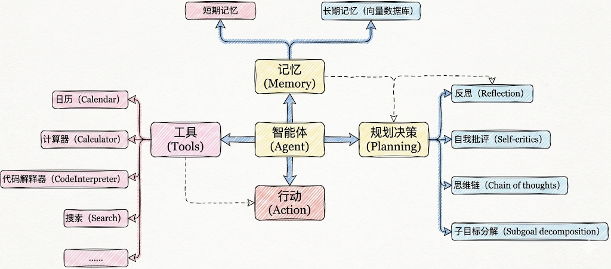
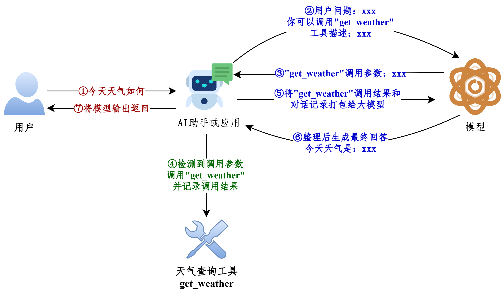
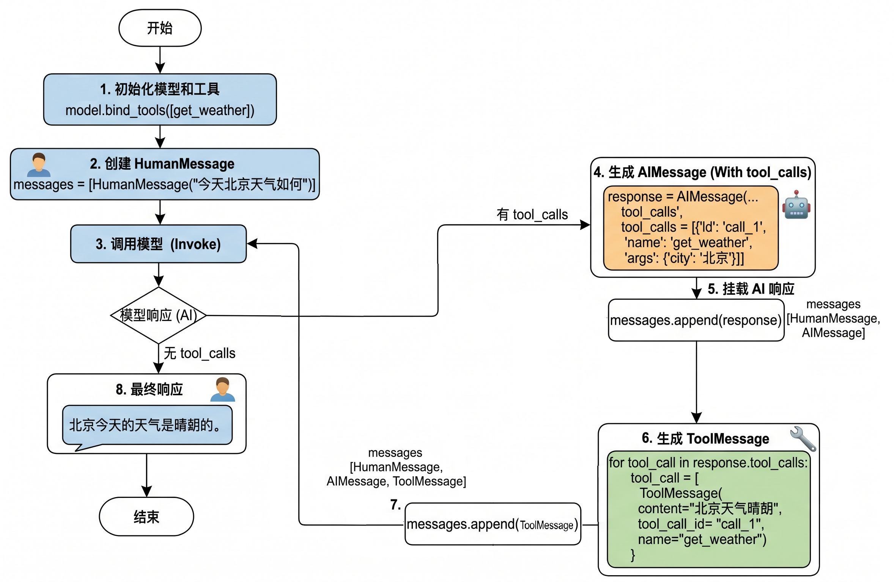
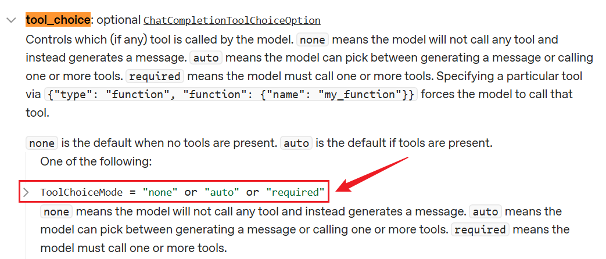
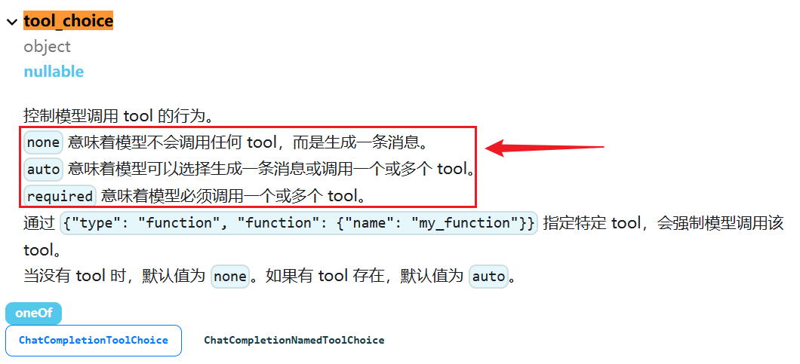

# 第05章：Tools
讲师：尚硅谷-宋红康
官网：尚硅谷
## 1、Tools概述
### 1.1 工具的重要性
要构建更强大的AI工程应用，只有生成文本这样的“ 纸上谈兵 ”能力自然是不够的。
工具是赋予大语言模型 与外部世界交互能力 的关键组件，从而能让智能体执行搜索、计算、数据库查
询、邮件发送或调用第三方API等，进而构建功能强大的AI应用。借助工具，大模型才能从“ 认识世界 ”
走向“ 改变世界 ”。
举例：

工具是构建智能体的核心要素之一！

### 1.2 工具调用的方式
在LangChain中，工具（Tools）实际上是指明确定义了输入和输出的 可调用函数 。因此， 工具调用
(Tool Calling) 也被称为 函数调用(Function Calling) 。
具体有两种调用方式：
**方式1：直接调用**
这种方式，适合测试时使用。
~~~python
1 from langchain_core.tools import tool
2
3 @tool
4 def get_weather(city: str) -> str:
5 """
~~~

6 获取指定城市的天气信息
~~~yaml
7
8 参数:
9 city: 城市名称，如"北京"、"上海"
10
11 返回:
~~~

12 天气信息字符串
~~~python
13 """
14 # 你的实现
15 return city + "晴天，温度 15°C"
1 # 使用 .invoke() 方法
2 result = get_weather.invoke({"city": "北京"})
3 print(result)
1 北京晴天，温度 15°C
~~~

**方式2：绑定到模型（主流）**
这种方式，让AI来调用，开发中使用。
~~~python
1 from langchain.chat_models import init_chat_model
2 from dotenv import load_dotenv
3 import os
4
5
6 # 从.env文件中加载环境变量
7 load_dotenv(override=True)
8
9 CLOSEAI_API_KEY = os.getenv("CLOSEAI_API_KEY")
10 CLOSEAI_BASE_URL = os.getenv("CLOSEAI_BASE_URL")
11
12 model = init_chat_model(
13 model="gpt-5.4-mini",
14 model_provider="openai",
15 api_key=CLOSEAI_API_KEY,
16 base_url=CLOSEAI_BASE_URL
17 )
18
~~~

~~~python
1 from langchain_core.tools import tool
2
3 # 定义工具
4 @tool
5 def get_weather(city: str) -> str:
6 """获取指定城市的天气"""
7 # 你的实现
8 return "晴天，温度 15°C"
9
10
11 # 绑定工具
12 model_with_tools = model.bind_tools([get_weather])
13
14 # AI 可以决定是否调用工具
15 response = model_with_tools.invoke("北京天气如何？")
16 # response = model_with_tools.invoke("2 + 3 = ？")
17
18 # 检查 AI 是否要调用工具
19 if response.tool_calls:
20 print("AI 想调用工具：", response.tool_calls)
21 else:
22 print("AI 直接回答：", response.content)
1 AI 想调用工具： [{'name': 'get_weather', 'args': {'city': '北京'}, 'id':
'call_fR3LE8Wjqh9lnDosQ61Y892E', 'type': 'tool_call'}]
~~~

### 1.3 工具调用的整体流程
大模型能根据对话上下文决定何时调用工具以及传递哪些参数。
经典流程如下：

我们现在编写的LangChain应用对应上图中的**AI助手或应用**。

### 1.4 从Message流转看工具的调用
前提：模型的初始化
~~~python
1 from langchain.chat_models import init_chat_model
2 from dotenv import load_dotenv
3 import os
4
5 # 从.env文件中加载环境变量
6 load_dotenv(override=True)
7
8 CLOSEAI_API_KEY = os.getenv("CLOSEAI_API_KEY")
9 CLOSEAI_BASE_URL = os.getenv("CLOSEAI_BASE_URL")
10
11 model = init_chat_model(
12 model="gpt-5.4-mini",
13 model_provider="openai",
14 api_key=CLOSEAI_API_KEY,
15 base_url=CLOSEAI_BASE_URL
16 )
~~~

参考1：不使用@tool修饰
~~~python
1 from langchain.messages import HumanMessage, ToolMessage
2
3
4 def get_weather(city: str):
5 """获取天气的工具"""
6 return f"{city}天气晴朗"
7
8
~~~

9 # 将模型和工具绑定
~~~text
10 model_with_tools = model.bind_tools([get_weather])
11
12 messages = [
13 HumanMessage("今天北京天气如何")
14 ]
15
~~~

16 # 模型生成调用工具请求
~~~text
17 response = model_with_tools.invoke(messages)
18
19 # 添加AIMessage
20 messages.append(response)
21
22 tool_calls = response.tool_calls
23
24 for tool_call in tool_calls:
25 if tool_call["name"] == "get_weather":
26 # 拼接出ToolMessage实例
27 tool_response = ToolMessage(
28 content=get_weather(**tool_call["args"]),
29 tool_call_id=tool_call["id"],
30 name=tool_call["name"]
31 )
32 messages.append(tool_response)
33
~~~

~~~python
34 print("=====================> messages <=====================")
35 for msg in messages:
36 msg.pretty_print()
37 print("=====================> messages <=====================")
38 final_response = model_with_tools.invoke(messages)
39 print(f"final_response: \n{final_response}")
~~~

参考2：使用@tool修饰
~~~python
1 from langchain.messages import HumanMessage, ToolMessage
2
3 @tool
4 def get_weather(city: str):
5 """获取天气的工具"""
6 return f"{city}天气晴朗~"
7
8
~~~

9 # 将模型和工具绑定
~~~text
10 model_with_tools = model.bind_tools([get_weather])
11
12 messages = [
13 HumanMessage("今天北京天气如何")
14 ]
15
~~~

16 # 模型生成调用工具请求
~~~python
17 response = model_with_tools.invoke(messages)
18
19 # 添加AIMessage
20 messages.append(response)
21
22 tool_calls = response.tool_calls
23
24 for tool_call in tool_calls:
25 if tool_call["name"] == "get_weather":
26 # 返回的是ToolMessage类型消息
27 tool_response = get_weather.invoke(tool_call)
28 print(type(tool_response))
29 messages.append(tool_response)
30
31 print("=====================> messages <=====================")
32 for msg in messages:
33 msg.pretty_print()
34 print("=====================> messages <=====================")
35 final_response = model_with_tools.invoke(messages)
36 print(f"final_response: \n{final_response}")
~~~

说明：被 @tool 修饰的函数可以调用 invoke 接收模型返回的入参信息执行函数，并返回
ToolMessage 实例，我们不再需要手动拼接 ToolMessage 。
~~~html
1 <class 'langchain_core.messages.tool.ToolMessage'>
2 =====================> messages <=====================
3 ================================ Human Message
=================================
4
~~~

5 今天北京天气如何

~~~text
6 ================================== Ai Message
==================================
7
~~~

8 好的，我来帮你查一下今天北京的天气情况。
~~~text
9 Tool Calls:
10 get_weather (call_00_f65kV4JKjBPK0HhURzO99449)
11 Call ID: call_00_f65kV4JKjBPK0HhURzO99449
12 Args:
13 city: 北京
14 ================================= Tool Message
=================================
15 Name: get_weather
16
17 北京天气晴朗~
18 =====================> messages <=====================
19 final_response:
20 content='今天北京天气**晴朗** ☀，是个好天气！如果你要出门的话，可以放心出行哦～'
additional_kwargs={'refusal': None} response_metadata={'token_usage':
{'completion_tokens': 24, 'prompt_tokens': 343, 'total_tokens': 367,
'completion_tokens_details': None, 'prompt_tokens_details':
{'audio_tokens': None, 'cached_tokens': 256},
'prompt_cache_hit_tokens': 256, 'prompt_cache_miss_tokens': 87},
'model_provider': 'deepseek', 'model_name': 'deepseek-v4-flash',
'system_fingerprint': 'fp_8b330d02d0_prod0820_fp8_kvcache_20260402',
'id': 'fabbebd6-498e-40f0-b1f6-e9fb43a36297', 'finish_reason': 'stop',
'logprobs': None} id='lc_run--019e5a90-f0ca-7d43-a4e5-3d34379e8208-0'
tool_calls=[] invalid_tool_calls=[] usage_metadata={'input_tokens':
343, 'output_tokens': 24, 'total_tokens': 367, 'input_token_details':
{'cache_read': 256}, 'output_token_details': {}}
~~~

对应图示（以参考1为例）：

**工具调用流程总结：**
所以如果真正要大模型根据工具调用结果进行回复，完整的调用流程包括如下四个步骤：

步骤1：模型绑定工具 ：通过model.bind_tools([...])绑定一个或者多个工具。
步骤2：模型生成工具调用请求 ：用户输入问题，调用模型（比如invoke()）。如果需要调用工具，模
型返回包含工具调用信息（如工具名称和参数）的AIMessage。
步骤3：开发者手动执行工具 ：用户从响应中提取工具调用信息并手动调用对应的工具（比如工
具.invoke()）。
步骤4：将工具执行结果ToolMessage传递给模型生成最终结果 ：将之前用户提问内容和手动执行工具
结果ToolMessage返回模型，模型最终生成回复。
特别注意：大模型调用工具是单次推理，直接响应，**需要开发者手动执行工具**并管理循环，适合简
单、确定的任务。
## 2、工具的定义方式1：不使用@tool
### 2.1 模型绑定工具并发送请求
~~~python
1 from langchain.chat_models import init_chat_model
2 from dotenv import load_dotenv
3 import os
4
5 # 从.env文件中加载环境变量
6 load_dotenv(override=True)
7
8 CLOSEAI_API_KEY = os.getenv("CLOSEAI_API_KEY")
9 CLOSEAI_BASE_URL = os.getenv("CLOSEAI_BASE_URL")
10
11 model = init_chat_model(
12 model="gpt-5.4-mini",
13 model_provider="openai",
14 api_key=CLOSEAI_API_KEY,
15 base_url=CLOSEAI_BASE_URL
16 )
1 from rich import print as rprint
2
3 # 定义工具
4 def get_weather(city: str):
5 return f"{city}天气晴朗"
6
~~~

7 # 将模型和工具绑定
~~~python
8 model_with_tools = model.bind_tools([get_weather])
9
10 response = model_with_tools.invoke(
11 "今天北京天气如何"
12 )
13
14 rprint(response)
15 # print(response.tool_calls)
~~~

输出如下
|  |  |
| --- | --- |
|  |  |
|  |  |

~~~text
1 AIMessage(
2 content='',
3 additional_kwargs={'refusal': None},
4 response_metadata={
5 'token_usage': {
6 'completion_tokens': 18,
7 'prompt_tokens': 121,
8 'total_tokens': 139,
9 'completion_tokens_details': {
10 'accepted_prediction_tokens': 0,
11 'audio_tokens': 0,
12 'reasoning_tokens': 0,
13 'rejected_prediction_tokens': 0
14 },
15 'prompt_tokens_details': {'audio_tokens': 0, 'cached_tokens':
0},
16 'latency_checkpoint': {
17 'engine_tbt_ms': 3,
18 'engine_ttft_ms': 41,
19 'engine_ttlt_ms': 100,
20 'pre_inference_ms': 99,
21 'service_tbt_ms': 3,
22 'service_ttft_ms': 207,
23 'service_ttlt_ms': 260,
24 'total_duration_ms': 168,
25 'user_visible_ttft_ms': 108
26 }
27 },
28 'model_provider': 'openai',
29 'model_name': 'gpt-5.4-mini-2026-03-17',
30 'system_fingerprint': None,
31 'id': 'chatcmpl-Dif1tWr37cPmJRNpJuCLJNU9Yrxlk',
32 'service_tier': 'default',
33 'finish_reason': 'tool_calls',
34 'logprobs': None
35 },
36 id='lc_run--019e54a4-6989-71b1-8c7e-6efcfa08d4bb-0',
37 tool_calls=[
38 {
39 'name': 'get_weather',
40 'args': {'city': '北京'},
41 'id': 'call_ECvZNV7RLTWpKQSjhvdGzKBd',
42 'type': 'tool_call'
43 }
44 ],
45 invalid_tool_calls=[],
46 usage_metadata={
47 'input_tokens': 121,
48 'output_tokens': 18,
49 'total_tokens': 139,
50 'input_token_details': {'audio': 0, 'cache_read': 0},
51 'output_token_details': {'audio': 0, 'reasoning': 0}
52 }
53 )
~~~

### 2.2 工具描述的各部分详解
#### 2.2.1 了解：convert_to_openai_tool
执行 model.bind_tools([get_weather]) ，底层最终会调用 convert_to_openai_tool 生成工具描述。所
以我们可以直接调用后者查看解析后的工具描述。
~~~python
1 from langchain_core.utils.function_calling import convert_to_openai_tool
2
3 from rich import print as rprint
4
5 def get_weather(city: str):
6 return f"{city}天气晴朗"
7
8 rprint(convert_to_openai_tool(get_weather))
~~~

输出如下
~~~text
1 {
2 'type': 'function',
3 'function': {
4 'name': 'get_weather',
5 'description': '',
6 'parameters': {
7 'properties': {
8 'city': {
9 'type': 'string'
10 }
11 },
12 'required': ['city'],
13 'type': 'object'
14 }
15 }
16 }
~~~

**结果字段说明：**
(1) type：定义当前数据节点必须是什么数据类型。常见类型有 string, number, integer, boolean,
object, array, null。object即是json对象。
(2) properties：用于定义JSON 对象（Object）中可以包含哪些属性（键），以及每个属性对应的
值类型和说明。
(3) required：当 type为 "object"时使用，是一个数组，列出了对象中必须存在的属性名。
**问题：为什么不使用@tool装饰器修饰的函数，也可以理解为工具呢？**
查看 convert_to_openai_tool 底层源码：
~~~text
1 elif isinstance(function, langchain_core.tools.base.BaseTool):
2 oai_function = cast("dict", _format_tool_to_openai_function(function))
3 elif callable(function):
4 oai_function = cast(
5 "dict", _convert_python_function_to_openai_function(function)
6 )
~~~

相当于加了@tool修饰的函数走上面的分支，没有加@tool修饰的函数走下面的分支，后者会基于函数定
义和docstring生成pydantic模式的描述，然后转换为规范的tool_schema。
#### 2.2.2 description说明
convert_to_openai_tool 会从 docstring(文档字符串) 加载工具的描述信息，上面的案例中，
docstring 为空，所以抽取的 description 为空。
docstring，文档字符串，使用三个双引号表示开始和结束。
~~~python
1 from langchain_core.utils.function_calling import convert_to_openai_tool
2 from rich import print as rprint
3
4 def get_weather(city: str):
5 """
~~~

6 天气查询工具
~~~python
7 """
8 return f"{city}天气晴朗"
9
10 rprint(convert_to_openai_tool(get_weather))
~~~

输出
~~~text
1 {
2 'type': 'function',
3 'function': {
4 'name': 'get_weather',
5 'description': '天气查询工具',
6 'parameters': {
7 'properties': {
8 'city': {
9 'type': 'string'
10 }
11 },
12 'required': ['city'],
13 'type': 'object'
14 }
15 }
16 }
~~~

#### 2.2.3 参数说明
convert_to_openai_tool 会从 docstring 加载参数说明，这里的 docstring 必须遵循 Google 风格 。
Google 风格 docstring 说明：https://google.github.io/styleguide/pyguide.html
Google 风格 docstring 示例：https://www.sphinx-doc.org/en/master/usage/extensions/exa
mple_google.html
Python docstring 通用约定：https://peps.python.org/pep-0257/
基础用法不必完整阅读规范，只需要按照下面的示例仿写即可。

~~~python
1 from langchain_core.utils.function_calling import convert_to_openai_tool
2 from rich import print as rprint
3
4 def get_weather(city: str):
5 """
~~~

6 天气查询工具
~~~python
7
8 Args:
9 city: 城市名称
10 """
11 return f"{city}天气晴朗"
12
13 rprint(convert_to_openai_tool(get_weather))
~~~

使用 Args: 、 Returns: 、 Raises: 等关键字，这种方式可读性强。Agent通过工具的这些注释来理解
工具的用途和调用时机，因此清晰、准确的文档字符串是工具能被正确调用的前提。
输出如下：
~~~text
1 {
2 'type': 'function',
3 'function': {
4 'name': 'get_weather',
5 'description': '天气查询工具',
6 'parameters': {
7 'properties': {
8 'city': {
9 'description': '城市名称',
10 'type': 'string'
11 }
12 },
13 'required': ['city'],
14 'type': 'object'
15 }
16 }
17 }
~~~

AI 依赖 docstring 来理解工具。
1 # ❌ 不好：太模糊
~~~python
2 @tool
3 def tool1(x: str) -> str:
4 """做一些事情"""
5 ...
~~~

1 # ✅ 好：清晰明确
~~~python
2 @tool
3 def search_products(query: str) -> str:
4 """
~~~

5 在产品数据库中搜索产品
~~~yaml
6
7 Args:
8 query: 搜索关键词，如"笔记本电脑"、"手机"
9
10 Returns:
11 产品列表的 JSON 字符串
12 """
13 ...
~~~

#### 2.2.4 参数类型说明
参数类型来源于函数的类型注解。
~~~python
1 from langchain_core.utils.function_calling import convert_to_openai_tool
2 from rich import print as rprint
3
4 def get_weather(city):
5 """
~~~

6 天气查询工具
~~~python
7 """
8 return f"{city}天气晴朗"
9
10 rprint(convert_to_openai_tool(get_weather))
~~~

输出如下
~~~text
1 {
2 'type': 'function',
3 'function': {
4 'name': 'get_weather',
5 'description': '天气查询工具',
6 'parameters': {
7 'properties': {
8 'city': {}
9 },
10 'required': ['city'],
11 'type': 'object'
12 }
13 }
14 }
~~~

删除了参数类型注解，则工具描述中不包含参数类型说明
**注意**：如果docstring中包含参数说明，则对应的参数必须有类型注解，否则报错

~~~python
1 from langchain_core.utils.function_calling import convert_to_openai_tool
2 from rich import print as rprint
3
4 def get_weather(city):
5 """
~~~

6 天气查询工具
~~~python
7
8 Args:
9 city: 城市名称
10 """
11 print("天气晴朗")
12
13 rprint(convert_to_openai_tool(get_weather))
~~~

报错如下：
~~~yaml
1 Traceback...
2 ValueError: Arg city in docstring not found in function signature.
~~~

#### 2.2.5 参数默认值说明
如果参数没有默认值，则会包含 在required对应的列表 中。
反之，则参数的描述信息会包含 default 字段，并且 不会出现在required列表 中。
~~~python
1 from langchain_core.utils.function_calling import convert_to_openai_tool
2 from rich import print as rprint
3
4 def get_weather(city: str="北京"):
5 """
~~~

6 天气查询工具
~~~python
7
8 Args:
9 city: 城市名称
10 """
11 return f"{city}天气晴朗"
12
13 rprint(convert_to_openai_tool(get_weather))
~~~

输出如下
~~~text
1 {
2 'type': 'function',
3 'function': {
4 'name': 'get_weather',
5 'description': '天气查询工具',
6 'parameters': {
7 'properties': {
8 'city': {
9 'default': '北京',
10 'description': '城市名称',
11 'type': 'string'
12 }
13 },
14 'type': 'object'
15 }
~~~

~~~text
16 }
17 }
~~~

目前只有一个参数，并且有默认值，所以required字段被移除了。
举例2：
~~~python
1 from langchain_core.utils.function_calling import convert_to_openai_tool
2 from rich import print as rprint
3
4 def get_weather(dt: str, city: str="北京"):
5 """
~~~

6 天气查询工具
~~~python
7
8 Args:
9 dt: 日期
10 city: 城市名称
11 """
12 return f"{city}天气晴朗"
13
14 rprint(convert_to_openai_tool(get_weather))
~~~

输出
~~~text
1 {
2 'type': 'function',
3 'function': {
4 'name': 'get_weather',
5 'description': '天气查询工具',
6 'parameters': {
7 'properties': {
8 'dt': {
9 'description': '日期',
10 'type': 'string'
11 },
12 'city': {
13 'default': '北京',
14 'description': '城市名称',
15 'type': 'string'
16 }
17 },
18 'required': [
19 'dt'
20 ],
21 'type': 'object'
22 }
23 }
24 }
~~~

## 3、工具的定义方式2：使用@tool装饰器(推荐)
使用 @tool 装饰器修饰，可以自动将普通 Python 函数转化为智能体可调用的工具。
此方式 最直接 ，代码量极少，非常适合快速验证想法或创建参数简单的工具。

### 3.1 自定义工具描述：description
**情况1：仅提供docstring信息**
在bind_tools()调用时，先将函数封装为 BaseTool 类型的对象，再传递给 convert_to_openai_tool 函
数，生成工具的描述。
~~~python
1 from langchain_core.utils.function_calling import convert_to_openai_tool
2 from langchain.tools import tool
3
4 @tool
5 def get_weather(city: str):
6 return f"{city}天气晴朗"
7
8 print(convert_to_openai_tool(get_weather))
~~~

@tool 会从 docstring 生成描述信息，同样要求遵循 Google docstring 规范 。如果没有 docstring
则报错，如下。
~~~yaml
1 Traceback...
2 ValueError: Function must have a docstring if description not provided.
~~~

补充 docstring
~~~python
1 from langchain_core.utils.function_calling import convert_to_openai_tool
2 from langchain.tools import tool
3
4 @tool
5 def get_weather(city: str):
6 """
~~~

7 天气查询工具
~~~python
8 """
9 return f"{city}天气晴朗"
10
11 print(convert_to_openai_tool(get_weather))
~~~

输出如下
~~~text
1 {
2 'type': 'function',
3 'function': {
4 'name': 'get_weather',
5 'description': '天气查询工具',
6 'parameters': {
7 'properties': {
8 'city': {
9 'type': 'string'
10 }
11 },
12 'required': [
13 'city'
14 ],
15 'type': 'object'
16 }
17 }
18 }
~~~

**情况2：添加工具描述：description**
@tool 的参数 description 可以更改工具描述，优先级高于 docstring 的函数说明
~~~python
1 from langchain_core.utils.function_calling import convert_to_openai_tool
2 from langchain.tools import tool
3 from rich import print as rprint
4
5 @tool(description="根据城市名称查询当日天气的工具")
6 def get_weather(city: str):
7 """
~~~

8 天气查询工具
~~~python
9 """
10 return f"{city}天气晴朗"
11
12 rprint(convert_to_openai_tool(get_weather))
~~~

输出
~~~text
1 {
2 'type': 'function',
3 'function': {
4 'name': 'get_weather',
5 'description': '根据城市名称查询当日天气的工具',
6 'parameters': {
7 'properties': {
8 'city': {
9 'type': 'string'
10 }
11 },
12 'required': [
13 'city'
14 ],
15 'type': 'object'
16 }
17 }
18 }
~~~

**情况3：解析docstring：parse_docstring**
|  | **@tool** |
| --- | --- |
| description |  |

~~~python
1 from langchain_core.utils.function_calling import convert_to_openai_tool
2 from rich import print as rprint
3
4 @tool
5 def get_weather(city: str, units: str = "celsius", include_forecast: bool =
False) -> str:
6 """
~~~

7 获取当日天气，可选择是否同时查询未来五日天气预报
~~~yaml
8
9 Args:
10 city: 城市
11 units: 气温单位，可选：celsius-摄氏度，fahrenheit-华氏度
~~~

~~~python
12 include_forecast: 是否包含未来五日的天气预报
13 """
14 temp = 22 if units == "celsius" else 72
15 result = f'{city}当天气温: {temp} {"摄氏度" if units == "celsius" else "华
氏度"}'
16 if include_forecast:
17 result += "\n未来五天都是晴天"
18 return result
19
20 rprint(convert_to_openai_tool(get_weather))
~~~

输出如下
~~~text
1 {
2 'type': 'function',
3 'function': {
4 'name': 'get_weather',
5 'description': '获取当日天气，可选择是否同时查询未来五日天气预报
\n\nArgs:\n city: 城市\n units: 气温单位，可选：celsius-摄氏度，
fahrenheit-华氏度\n include_forecast: 是否包含未来五日的天气预报',
6 'parameters': {
7 'properties': {
8 'city': {
9 'type': 'string'
10 },
11 'units': {
12 'default': 'celsius',
13 'type': 'string'
14 },
15 'include_forecast': {
16 'default': False,
17 'type': 'boolean'
18 }
19 },
20 'required': [
21 'city'
22 ],
23 'type': 'object'
24 }
25 }
26 }
~~~

通过将 parse_docstring 设置为True，docstring会被解析，填充到相应的字段描述中。
~~~python
1 from langchain_core.utils.function_calling import convert_to_openai_tool
2 from rich import print as rprint
3
4 @tool(parse_docstring=True)
5 def get_weather(city: str, units: str = "celsius", include_forecast: bool =
False) -> str:
6 """
~~~

7 获取当日天气，可选择是否同时查询未来五日天气预报
~~~yaml
8
9 Args:
10 city: 城市
11 units: 气温单位，可选：celsius-摄氏度，fahrenheit-华氏度
12 include_forecast: 是否包含未来五日的天气预报
~~~

~~~python
13 """
14 temp = 22 if units == "celsius" else 72
15 result = f'{city}当天气温: {temp} {"摄氏度" if units == "celsius" else "华
氏度"}'
16 if include_forecast:
17 result += "\n未来五天都是晴天"
18 return result
19
20 rprint(convert_to_openai_tool(get_weather))
~~~

输出
~~~text
1 {
2 'type': 'function',
3 'function': {
4 'name': 'get_weather',
5 'description': '获取当日天气，可选择是否同时查询未来五日天气预报',
6 'parameters': {
7 'properties': {
8 'city': {
9 'description': '城市',
10 'type': 'string'
11 },
12 'units': {
13 'default': 'celsius',
14 'description': '气温单位，可选：celsius-摄氏度，
fahrenheit-华氏度',
15 'type': 'string'
16 },
17 'include_forecast': {
18 'default': 'False',
19 'description': '是否包含未来五日的天气预报',
20 'type': 'boolean'
21 }
22 },
23 'required': [
24 'city'
25 ],
26 'type': 'object'
27 }
28 }
29 }
~~~

**要注意**：不使用 @tool 装饰器时，docstring不合法会被视为普通文本，作为 description ，但如果使
用了 @tool 时 docstring 不合法，将会抛出异常
~~~python
1 from langchain_core.utils.function_calling import convert_to_openai_tool
2
3 @tool(parse_docstring=True)
4 def get_weather(city: str, units: str = "celsius", include_forecast: bool =
False) -> str:
5 """
~~~

6 获取当日天气，可选择是否同时查询未来五日天气预报
~~~yaml
7 Args:
8 city: 城市
9 units: 气温单位，可选：celsius-摄氏度，fahrenheit-华氏度
10 include_forecast: 是否包含未来五日的天气预报
~~~

~~~text
11 """
12 temp = 22 if units == "celsius" else 72
13 result = f'{city}当天气温: {temp} {"摄氏度" if units == "celsius" else "华
氏度"}'
14 if include_forecast:
15 result += "\n未来五天都是晴天"
16 return result
17
18 convert_to_openai_tool(get_weather)
~~~

报错如下
~~~yaml
1 Traceback...
2 ValueError: Found invalid Google-Style docstring.
~~~

### 3.2 更改工具名称：name_or_callable
默认情况，使用函数名作为工具名称，但可以向@tool 传参 name_or_callable ，以更改工具名称。
~~~python
1 from langchain_core.utils.function_calling import convert_to_openai_tool
2 from langchain.tools import tool
3
4 @tool(name_or_callable="getWeather")
5 def get_weather(city: str):
6 """
~~~

7 天气查询工具
~~~python
8 """
9 return f"{city}天气晴朗"
10
11 print(convert_to_openai_tool(get_weather))
~~~

输出如下
~~~text
1 {
2 'type': 'function',
3 'function': {
4 'name': 'getWeather',
5 'description': '天气查询工具',
6 'parameters': {
7 'properties': {
8 'city': {
9 'type': 'string'
10 }
11 },
12 'required': [
13 'city'
14 ],
15 'type': 'object'
16 }
17 }
18 }
~~~

说明：@tool中参数name_or_callable名称可以省略

~~~python
1 from langchain_core.utils.function_calling import convert_to_openai_tool
2 from langchain.tools import tool
3
4 @tool("getWeather")
5 def get_weather(city: str):
6 """
~~~

7 天气查询工具
~~~python
8 """
9 print("天气晴朗")
10
11 print(convert_to_openai_tool(get_weather))
~~~

输出如下
~~~text
1 {
2 'type': 'function',
3 'function': {
4 'name': 'getWeather',
5 'description': '天气查询工具',
6 'parameters': {
7 'properties': {
8 'city': {
9 'type': 'string'
10 }
11 },
12 'required': [
13 'city'
14 ],
15 'type': 'object'
16 }
17 }
18 }
~~~

说明：不要使用config或runtime作为参数名，这些是LangChain内部保留的。
开发中，习惯使用函数名作为工具名称，不推荐自定义工具名称。
### 3.3 自定义args_schema
#### 3.3.1 方式1：使用Pydantic模型定义
当工具的参数变得复杂，需要 枚举值 、 范围限制 或 更复杂的业务逻辑验证 时，Pydantic 模型是理想
的选择，提供强大的类型检查和数据验证。
使用Pydantic 的主要优势在于能够**精确控制工具参数的格式和验证规则**，让大模型更准确地理解如何调
用工具。
**3.3.1.1** **pydantic类型的定义**
**①** **BaseModel基类**
通过继承核心基类 BaseModel 定义数据模型，从而声明字段结构、类型约束、默认值以0及校验规则。

~~~python
1 from pydantic import BaseModel
2
3 class WeatherInput(BaseModel):
4 city: str
5
6 print(WeatherInput(city="北京"))
~~~

输出如下
~~~text
1 city='北京'
~~~

注意：BaseModel子类初始化时，不接收位置参数，字段值必须以关键字参数的形式传入，否则
报错。
~~~python
1 from pydantic import BaseModel
2
3 class WeatherInput(BaseModel):
4 city: str
5
6 print(WeatherInput("北京"))
~~~

报错如下
~~~python
1 TypeError
2 ......
3 TypeError: BaseModel.__init__() takes 1 positional argument but 2 were
given
~~~

这是因为BaseModel的初始化函数签名如下
~~~python
1 def __init__(self, /, **data: Any) -> None:
~~~

由此可知，所有关键字参数都会被收集到字典 data 中，然后 data 会按照参数类型注解进行校验，失
败时抛出异常。
**②** **Field**
Field() ：用来“ 定制字段 ”的函数，可用于设置默认值、描述等。
举例1：设置默认值
~~~python
1 from pydantic import BaseModel, Field
2
3 class WeatherInput(BaseModel):
4 city: str = Field(
5 default= "北京"
6 )
7
8 print(WeatherInput())
~~~

输出
~~~text
1 city='北京'
~~~

举例2：设置参数的描述信息

每个字段的 description 参数至关重要，它直接影响大模型理解参数含义的能力。
~~~python
1 from pydantic import BaseModel, Field
2
3 class WeatherInput(BaseModel):
4 city: str = Field(
5 default= "北京",
6 description="城市"
7 )
8 include_forecast: bool = Field(
9 default=False,
10 description="是否包含未来五日天气预报"
11 )
12
13 print(WeatherInput())
~~~

输出
~~~text
1 city='北京' include_forecast=False
~~~

**③** **Literal**
可以使用 Literal类型限定参数为固定选项。
Literal ：表示字段不能是任意某种类型的值，而只能是几个固定字面量之一。
举例1：
~~~python
1 from pydantic import BaseModel
2 from typing import Literal
3
4 class WeatherInput(BaseModel):
5 city: str
6 unit: Literal["celsius", "fahrenheit"]
7
8 print("===============> 合法 <===============")
9 print(WeatherInput(city="北京", unit="celsius"))
10
11 print("===============> 非法 <===============")
12 try:
13 print(WeatherInput(city="北京", unit="kelvin"))
14 except Exception as e:
15 print("报错类型：", type(e).__name__)
16 print(e)
~~~

输出

~~~text
1 ===============> 合法 <===============
2 city='北京' unit='celsius'
3 ===============> 非法 <===============
4 报错类型： ValidationError
5 1 validation error for WeatherInput
6 unit
7 Input should be 'celsius' or 'fahrenheit' [type=literal_error,
input_value='kelvin', input_type=str]
8 For further information visit
https://errors.pydantic.dev/2.12/v/literal_error
~~~

举例2：
~~~python
1 from pydantic import BaseModel, Field
2
3 class WeatherInput(BaseModel):
4 city: str = Field(
5 default= "北京",
6 description="城市"
7 )
8 unit: Literal["celsius", "fahrenheit"] = Field(
9 default="celsius",
10 description="气温单位"
11 )
12 include_forecast: bool = Field(
13 default=False,
14 description="是否包含未来五日天气预报"
15 )
16
17 print(WeatherInput())
~~~

输出
~~~text
1 city='北京' unit='celsius' include_forecast=False
~~~

**3.3.1.2** **使用Pydantic定义args_schema**
通过 @tool(args_schema=PydanticModelCls) 将这个 Pydantic 模型与工具函数关联。
利用 Pydantic 的类型系统进行参数验证，当大模型需要调用工具前，Pydantic 会自动验证参数的类型
和有效性。
举例：
~~~python
1 from pydantic import BaseModel, Field
2 from langchain.tools import tool
3 from langchain_core.utils.function_calling import convert_to_openai_tool
4
5 class WeatherInput(BaseModel):
6 city: str = Field(
7 default= "北京",
8 description="城市"
9 )
10 unit: Literal["celsius", "fahrenheit"] = Field(
11 default="celsius",
12 description="气温单位"
13 )
~~~

~~~python
14 include_forecast: bool = Field(
15 default=False,
16 description="是否包含未来五日天气预报"
17 )
18
19 @tool(args_schema=WeatherInput)
20 def get_weather(city: str, unit: str = "celsius", include_forecast: bool =
False) -> str:
21 """获取当日天气，可选未来五日天气预报"""
22 temp = 22 if unit == "celsius" else 72
23 result = f'{city}当天气温: {temp} {"摄氏度" if unit == "celsius" else "华氏
度"}'
24 if include_forecast:
25 result += "\n未来五天都是晴天"
26 return result
27
28 convert_to_openai_tool(get_weather)
~~~

输出
~~~text
1 {
2 'type': 'function',
3 'function': {
4 'name': 'get_weather',
5 'description': '获取当日天气，可选未来五日天气预报',
6 'parameters': {
7 'properties': {
8 'city': {
9 'default': '北京',
10 'description': '城市',
11 'type': 'string'
12 },
13 'unit': {
14 'default': 'celsius',
15 'description': '气温单位',
16 'enum': [
17 'celsius',
18 'fahrenheit'
19 ],
20 'type': 'string'
21 },
22 'include_forecast': {
23 'default': False,
24 'description': '是否包含未来五日天气预报',
25 'type': 'boolean'
26 }
27 },
28 'type': 'object'
29 }
30 }
31 }
~~~

#### 3.3.2 方式2：使用Json Schema定义
在 LangChain 中，还可以直接使用 JSON Schema 字典 来定义工具的参数模式。这种方式提供了极大
的灵活性。
因为工具参数模式可以基于数据库配置或用户输入在 运行时动态生成 ，所以这种方式特别适合参数结
构需要动态生成的场景。
举例：
~~~json
1 {
2 "type": "function",
3 "function": {
4 "name": "get_weather",
5 "description": "获取当日天气，可选未来五日天气预报",
6 "parameters": {
7 "type": "object",
8 "properties": {
9 "location": {"type": "string"},
10 "units": {"type": "string"},
11 "include_forecast": {"type": "boolean"}
12 },
13 "required": ["location", "units", "include_forecast"]
14 },
15 }
16 }
~~~

应该传递给args_schema的只有 parameters 对应的JSON字符串，即
~~~json
1 {
2 "type": "object",
3 "properties": {
4 "location": {"type": "string"},
5 "units": {"type": "string"},
6 "include_forecast": {"type": "boolean"}
7 },
8 "required": ["location", "units", "include_forecast"]
9 }
~~~

举例：
通过 @tool(args_schema=json_schema_dict) 将一个符合 JSON Schema 标准的字典与工具函数关
联。
~~~python
1 from langchain.tools import tool
2 from langchain_core.utils.function_calling import convert_to_openai_tool
3
4 weather_schema = {
5 "type": "object",
6 "properties": {
7 "location": {"type": "string"},
8 "units": {"type": "string"},
9 "include_forecast": {"type": "boolean"}
10 },
11 "required": ["location", "units", "include_forecast"]
~~~

~~~python
12 }
13
14 @tool(args_schema=weather_schema)
15 def get_weather(city: str, unit: str = "celsius", include_forecast: bool =
False) -> str:
16 """获取当日天气，可选未来五日天气预报"""
17 temp = 22 if unit == "celsius" else 72
18 result = f'{city}当天气温: {temp} {"摄氏度" if unit == "celsius" else "华氏
度"}'
19 if include_forecast:
20 result += "\n未来五天都是晴天"
21 return result
22
23 print(convert_to_openai_tool(get_weather))
~~~

输出
~~~text
1 {
2 'type': 'function',
3 'function': {
4 'name': 'get_weather',
5 'description': '获取当日天气，可选未来五日天气预报',
6 'parameters': {
7 'type': 'object',
8 'properties': {
9 'location': {
10 'type': 'string'
11 },
12 'units': {
13 'type': 'string'
14 },
15 'include_forecast': {
16 'type': 'boolean'
17 }
18 },
19 'required': [
20 'location',
21 'units',
22 'include_forecast'
23 ]
24 }
25 }
26 }
~~~

## 4、工具的应用案例
### 4.1 案例1：使用args_schema
arg_schema给出明确的参数信息
模型初始化：
~~~python
1 from langchain.chat_models import init_chat_model
2 from dotenv import load_dotenv
3 import os
~~~

~~~python
4
5
6 # 从.env文件中加载环境变量
7 load_dotenv(override=True)
8
9 CLOSEAI_API_KEY = os.getenv("CLOSEAI_API_KEY")
10 CLOSEAI_BASE_URL = os.getenv("CLOSEAI_BASE_URL")
11
12 model = init_chat_model(
13 model="gpt-5.4-mini",
14 model_provider="openai",
15 api_key=CLOSEAI_API_KEY,
16 base_url=CLOSEAI_BASE_URL
17 )
~~~

工具的定义与模拟调用：
~~~python
1 from pydantic import BaseModel, Field
2
3 from langchain.tools import tool
4 from langchain.messages import HumanMessage
5 from langchain_core.utils.function_calling import convert_to_openai_tool
6
7 class WeatherSchema(BaseModel):
8 city: str = Field(default="北京", description="城市名称")
9 if_forecast: bool = Field(default=False, description="是否包含明日天气预
报")
10
11 @tool("get_weather_and_forecast", description="查询当日天气，可以包含明日天气预
报", args_schema=WeatherSchema)
12 def get_weather(city: str, if_forecast: bool):
13 res = f"{city} 今天天气不错"
14 if if_forecast:
15 res += "\n明天也不错"
16 return res
17
18 print(convert_to_openai_tool(get_weather))
19
20
21 model_with_tools = model.bind_tools([get_weather])
22
23 messages = [HumanMessage("今天杭州天气如何？明天呢？")]
24 response = model_with_tools.invoke(messages)
25 messages.append(response)
26 tool_calls = response.tool_calls
27
28 for tool_call in tool_calls:
29 if tool_call["name"] == "get_weather_and_forecast":
30 tool_msg = get_weather.invoke(tool_call)
31 messages.append(tool_msg)
32
33 final_response = model_with_tools.invoke(messages)
34 messages.append(final_response)
35 for msg in messages:
36 msg.pretty_print()
~~~

输出

~~~text
1 {'type': 'function', 'function': {'name': 'get_weather_and_forecast',
'description': '查询当日天气，可以包含明日天气预报', 'parameters':
{'properties': {'city': {'default': '北京', 'description': '城市名称',
'type': 'string'}, 'if_forecast': {'default': False, 'description': '是
否包含明日天气预报', 'type': 'boolean'}}, 'type': 'object'}}}
2 ================================ Human Message
=================================
3
~~~

4 今天杭州天气如何？,明天呢？
~~~yaml
5 ================================== Ai Message
==================================
6 Tool Calls:
7 get_weather_and_forecast (call_c82UrCpAdVAqiHfl4OkZocbg)
8 Call ID: call_c82UrCpAdVAqiHfl4OkZocbg
9 Args:
10 city: 杭州
11 if_forecast: True
12 ================================= Tool Message
=================================
13 Name: get_weather_and_forecast
14
~~~

15 杭州 今天天气不错
~~~text
16 明天也不错
17 ================================== Ai Message
==================================
18
~~~

19 杭州今天：天气不错。
20 杭州明天：也不错。
### 4.2 案例2：撰写docstring
可以在docstring中撰写参数的描述信息，此时参数默认值和类型都要通过函数签名传递。
模型初始化：
~~~python
1 from langchain.chat_models import init_chat_model
2 from dotenv import load_dotenv
3 import os
4
5
6 # 从.env文件中加载环境变量
7 load_dotenv(override=True)
8
9 CLOSEAI_API_KEY = os.getenv("CLOSEAI_API_KEY")
10 CLOSEAI_BASE_URL = os.getenv("CLOSEAI_BASE_URL")
11
12 model = init_chat_model(
13 model="gpt-5.4-mini",
14 model_provider="openai",
15 api_key=CLOSEAI_API_KEY,
16 base_url=CLOSEAI_BASE_URL
17 )
~~~

工具的定义与模拟调用：
~~~python
1 from langchain.tools import tool
~~~

~~~python
2 from langchain.messages import HumanMessage
3 from langchain_core.utils.function_calling import convert_to_openai_tool
4
5
6 @tool("get_weather_and_forecast", parse_docstring=True)
7 def get_weather(city: str="北京", if_forecast: bool=False):
8 """
~~~

9 查询当日天气，可以包含明日天气预报
~~~python
10
11 Args:
12 city: 城市名称
13 if_forecast: 是否包含明日天气预报
14 """
15 res = f"{city} 今天天气不错"
16 if if_forecast:
17 res += "\n明天要下雨"
18 return res
19
20 print(convert_to_openai_tool(get_weather))
21
22 model_with_tools = model.bind_tools([get_weather])
23
24 messages = [HumanMessage("今天杭州天气如何？明天呢？")]
25 response = model_with_tools.invoke(messages)
26 messages.append(response)
27 tool_calls = response.tool_calls
28
~~~

29 # 将工具调用的结果添加到消息列表中
~~~python
30 for tool_call in tool_calls:
31 if tool_call["name"] == "get_weather_and_forecast":
32 # 返回值tool_msg类型是ToolMessage
33 tool_msg = get_weather.invoke(tool_call)
34 messages.append(tool_msg)
35
36 final_response = model_with_tools.invoke(messages)
37
38 messages.append(final_response)
39
40 for msg in messages:
41 msg.pretty_print()
~~~

**注意**：要正确解析docstring，必须在@tool中将 **parse_docstring** 设置为 **True** 。
输出
~~~text
1 {'type': 'function', 'function': {'name': 'get_weather_and_forecast',
'description': '查询当日天气，可以包含明日天气预报', 'parameters':
{'properties': {'city': {'default': '北京', 'description': '城市名称',
'type': 'string'}, 'if_forecast': {'default': False, 'description': '是
否包含明日天气预报', 'type': 'boolean'}}, 'type': 'object'}}}
2 ================================ Human Message
=================================
3
~~~

4 今天杭州天气如何？明天呢？
~~~text
5 ================================== Ai Message
==================================
6 Tool Calls:
7 get_weather_and_forecast (call_y5vpFccj2DfWSAF6ng5dZOYH)
~~~

~~~yaml
8 Call ID: call_y5vpFccj2DfWSAF6ng5dZOYH
9 Args:
10 city: 杭州
11 if_forecast: True
12 ================================= Tool Message
=================================
13 Name: get_weather_and_forecast
14
~~~

15 杭州 今天天气不错
~~~text
16 明天要下雨
17 ================================== Ai Message
==================================
18
19 杭州今天“天气不错”，明天“要下雨”。
~~~

20 如果你愿意，我也可以帮你继续看一下适合出行/穿衣的建议。
### 4.3 案例3：多工具调用
大模型调用工具是单次推理，即每次运行调用一个工具，当调用多个工具时，需要用户自己管理多次调
用循环。
~~~python
1
2 from langchain_core.tools import tool
3 from langchain_core.messages import HumanMessage, AIMessage, ToolMessage
4
5 # 1.定义工具
~~~

6 # 定义股票查询工具
~~~python
7 @tool(parse_docstring=True)
8 def get_stock_price(company: str, timeframe: str = "today") -> str:
~~~

9 """获取指定公司的股票价格信息
~~~python
10
11 Args:
12 company: 公司名称（如：苹果公司, 微软公司, 谷歌公司）
13 timeframe: 时间范围（today-今日, week-本周, month-本月）
14 """
15 # 模拟股票数据
16 mock_data = {
17 "苹果公司": {"today": 185.20, "week": 183.50, "month": 180.75},
18 "微软公司": {"today": 415.86, "week": 412.30, "month": 405.42},
19 "谷歌公司": {"today": 15.42, "week": 15.20, "month": 14.85}
20 }
21
22 if company in mock_data:
23 price = mock_data[company].get(timeframe, "未知时间范围")
24 return f"{company} {timeframe}价格: {price}美元"
25 else:
26 return f"未找到股票代码 {company} 的数据"
27
28
29 # 定义新闻搜索工具
30 @tool(parse_docstring=True)
31 def search_news(company: str) -> str:
32 """搜索指定公司的财经新闻
33
34 Args:
35 company: 公司名称
36
~~~

~~~text
37 Returns:
~~~

38 公司的财经新闻，每个新闻占一行
~~~python
39 """
40 # 模拟新闻数据
41 mock_news = {
42 "苹果公司": [
43 "苹果发布新款iPhone，股价上涨3%",
44 "苹果与欧盟达成反垄断和解协议",
45 "苹果将在印度扩大生产规模"
46 ],
47 "微软公司": [
48 "微软Azure云业务季度增长超预期",
49 "微软完成对Nuance的收购",
50 "微软推出新一代AI助手Copilot"
51 ],
52 "谷歌公司": [
53 "谷歌发布新AI模型，性能提升20%",
54 "谷歌与OpenAI合作，开发新的AI助手",
55 "谷歌在欧洲展开AI研究项目"
56 ]
57 }
58
59 news_list = mock_news.get(company, [f"未找到{company}的相关新闻"])
60 return "\n".join(news_list)
61
62
63 # rprint(convert_to_openai_tool(search_news))
64
65 # 2.初始化模型并绑定工具
66 tools = [get_stock_price, search_news]
67 model_with_tools = model.bind_tools(tools)
68
69 message_list = []
70 human_message = HumanMessage(content="苹果公司今天的股价是多少？最近有什么新闻？")
71 # human_message = HumanMessage(content="比较一下微软和苹果的股价")
72 # human_message = HumanMessage(content="腾讯最近有什么重大新闻？")
73 # human_message = HumanMessage(content="海水为什么是咸的？")
74 message_list.append(human_message)
75
76 # 3.工具调用
77 while True:
78 response = model_with_tools.invoke(message_list)
79
80 message_list.append(response)
81
~~~

82 # 如果模型不需要调用工具，直接退出循环
~~~python
83 if not response.tool_calls:
84 print("没有工具调用，直接返回答案")
85 break
86
~~~

87 # 如果有调用工具，处理工具调用响应
88 # 4.开发者根据模型的响应，调用工具并获取结果
~~~python
89 for tool_call in response.tool_calls:
90 if tool_call["name"] == "get_stock_price":
91 stock_result = get_stock_price.invoke(tool_call)
92 print("stock_result", stock_result)
93 message_list.append(stock_result)
94 if tool_call["name"] == "search_news":
~~~

~~~python
95 news_result = search_news.invoke(tool_call)
96 print("news_result", news_result)
97 message_list.append(news_result)
98
99
100 # print("response", response)
101 # print(response.content)
102
103 for msg in message_list:
104 msg.pretty_print()
~~~

输出：
~~~text
1 stock_result content='苹果公司 today价格: 185.2美元'
name='get_stock_price' tool_call_id='call_cpGOhWce8rlIFSZ2G9w7ouON'
2 news_result content='苹果发布新款iPhone，股价上涨3%\n苹果与欧盟达成反垄断和解协
议\n苹果将在印度扩大生产规模' name='search_news'
tool_call_id='call_W9zjkAO8TNCmUbed2ld9tsxl'
~~~

3 没有工具调用，直接返回答案
~~~text
4 ================================ Human Message
=================================
5
~~~

6 苹果公司今天的股价是多少？最近有什么新闻？
~~~yaml
7 ================================== Ai Message
==================================
8 Tool Calls:
9 get_stock_price (call_cpGOhWce8rlIFSZ2G9w7ouON)
10 Call ID: call_cpGOhWce8rlIFSZ2G9w7ouON
11 Args:
12 company: 苹果公司
13 timeframe: today
14 search_news (call_W9zjkAO8TNCmUbed2ld9tsxl)
15 Call ID: call_W9zjkAO8TNCmUbed2ld9tsxl
16 Args:
17 company: 苹果公司
18 ================================= Tool Message
=================================
19 Name: get_stock_price
20
21 苹果公司 today价格: 185.2美元
22 ================================= Tool Message
=================================
23 Name: search_news
24
25 苹果发布新款iPhone，股价上涨3%
~~~

26 苹果与欧盟达成反垄断和解协议
27 苹果将在印度扩大生产规模
~~~text
28 ================================== Ai Message
==================================
29
30 苹果公司今天股价是 **185.2 美元**。
31
~~~

32 最近新闻包括：
~~~text
33 - 苹果发布了**新款 iPhone**，带动股价上涨约 **3%**
34 - 苹果与欧盟达成了**反垄断和解协议**
35 - 苹果计划在**印度扩大生产规模**
36
~~~

| **37 如果你愿意，我也可以帮你继续整理这些新闻对苹果股价的可能影响。** |  |
| --- | --- |
| 37 | 如果你愿意，我也可以帮你继续整理这些新闻对苹果股价的可能影响。 |
|  |  |
| 4 案 |  |

~~~python
1 from langchain.tools import tool
2 from langchain.messages import HumanMessage
3
4
5 @tool(parse_docstring=True)
6 def get_weather(city: str) -> str:
7 """
~~~

8 获取当日天气
~~~python
9
10 Args:
11 city: 城市名称
12 """
13 return f'{city}当天晴朗'
14
15 @tool(parse_docstring=True)
16 def get_news() -> str:
17 """
18 获取当日新闻
19 """
~~~

20 return "近期，受全球储蓄芯片短缺等多重因素影响，多地回收商称废旧手机回收市场迎来“火热
潮”，回收价格普遍上涨，旧手机成“香饽饽”。"
~~~python
21
22 model_with_tools = model.bind_tools([get_weather, get_news])
23
24 messages = [
25 HumanMessage("今天杭州天气如何？今天新闻是什么？别瞎编")
26 ]
27
28 response = model_with_tools.invoke(messages)
29 response.pretty_print()
~~~

输出
~~~text
1 ==================================•[1m Ai Message
•[0m==================================
2
~~~

3 我来帮您查询杭州的天气和今日新闻。
~~~yaml
4 Tool Calls:
5 get_weather (call_00_uspkbqR7N7wIewhr8hHZAXoM)
6 Call ID: call_00_uspkbqR7N7wIewhr8hHZAXoM
7 Args:
8 city: 杭州
9 get_news (call_01_ksyZoO2kXFBXXp1dH4dnxZAN)
10 Call ID: call_01_ksyZoO2kXFBXXp1dH4dnxZAN
11 Args:
~~~

此时可以遍历tool_calls列表，挨个调用工具。
~~~text
1
2 messages.append(response)
~~~

~~~python
3
4 for tool_call in response.tool_calls:
5 if tool_call["name"] == "get_weather":
6 tool_msg = get_weather.invoke(tool_call)
7 print(tool_msg)
8 messages.append(tool_msg)
9 elif tool_call["name"] == "get_news":
10 tool_msg = get_news.invoke(tool_call)
11 print(tool_msg)
12 messages.append(tool_msg)
13 else:
14 raise Exception("不存在的工具")
15
16 final_response = model.invoke(messages)
17 messages.append(final_response)
18
19 for msg in messages:
20 msg.pretty_print()
~~~

输出
~~~text
1 content='杭州当天晴朗' name='get_weather'
tool_call_id='call_00_PhpRzVvHYLkqOgQMj4keeAso'
~~~

2 content='近期，受全球储蓄芯片短缺等多重因素影响，多地回收商称废旧手机回收市场迎来“火
~~~text
热潮”，回收价格普遍上涨，旧手机成“香饽饽”。' name='get_news'
tool_call_id='call_01_ALWxzasKCDJzm7fgwiXVBorg'
3 ================================•[1m Human Message
•[0m=================================
4
~~~

5 今天杭州天气如何？今天新闻是什么？别瞎编
~~~text
6 ==================================•[1m Ai Message
•[0m==================================
7
~~~

8 我来帮您查询杭州的天气和今天的新闻。
~~~yaml
9 Tool Calls:
10 get_weather (call_00_PhpRzVvHYLkqOgQMj4keeAso)
11 Call ID: call_00_PhpRzVvHYLkqOgQMj4keeAso
12 Args:
13 city: 杭州
14 get_news (call_01_ALWxzasKCDJzm7fgwiXVBorg)
15 Call ID: call_01_ALWxzasKCDJzm7fgwiXVBorg
16 Args:
17 =================================•[1m Tool Message
•[0m=================================
18 Name: get_weather
19
20 杭州当天晴朗
21 =================================•[1m Tool Message
•[0m=================================
22 Name: get_news
23
~~~

24 近期，受全球储蓄芯片短缺等多重因素影响，多地回收商称废旧手机回收市场迎来“火热潮”，回
收价格普遍上涨，旧手机成“香饽饽”。
~~~text
25 ==================================•[1m Ai Message
•[0m==================================
26
~~~

27 根据查询结果：

~~~text
28
29 **杭州天气**：今天杭州天气晴朗。
30
~~~

31 **今日新闻**：近期，受全球芯片短缺等多重因素影响，多地回收商称废旧手机回收市场迎来“火
热潮”，回收价格普遍上涨，旧手机成“香饽饽”。
~~~text
32
~~~

33 以上信息基于实时查询，供您参考。
## 5、拓展：强制使用工具
### 5.1 tool_choice参数说明
bind_tools 可以传递参数 tool_choice ，用于控制是否强制使用工具。
该字段最终会作为 payload 的 tool_choice 字段传递给模型，OpenAI和Deepseek的官方API服务对于
tool_choice 的取值做了相同的规定。
OpenAI官方文档

Deepseek官方文档

none ：模型不会调用任何工具。
auto ： 默认值 ，模型可以自主决定不调用或调用任意数量的工具。
required ：模型必须调用工具，数量不限。

此外， tool_choice 还支持传递 any ，等价于 required 。
### 5.2 none值举例
模型初始化：
~~~python
1 from langchain.chat_models import init_chat_model
2 from dotenv import load_dotenv
3 import os
4
5 # 从.env文件中加载环境变量
6 load_dotenv(override=True)
7
8 CLOSEAI_API_KEY = os.getenv("CLOSEAI_API_KEY")
9 CLOSEAI_BASE_URL = os.getenv("CLOSEAI_BASE_URL")
10
11 model = init_chat_model(
12 model="gpt-5.4-mini",
13 model_provider="openai",
14 api_key=CLOSEAI_API_KEY,
15 base_url=CLOSEAI_BASE_URL
16 )
~~~

举例：
~~~python
1 from langchain.tools import tool
2 from langchain.messages import HumanMessage
3
4
5 @tool(parse_docstring=True)
6 def get_weather(city: str) -> str:
7 """
~~~

8 获取当日天气
~~~python
9
10 Args:
11 city: 城市名称
12 """
13 return f'{city}当天晴朗'
14
15 model_with_tools = model.bind_tools([get_weather], tool_choice="none")
16
17 messages = [
18 HumanMessage("今天北京天气如何？别瞎编")
19 ]
20
21 response = model_with_tools.invoke(messages)
22 response.pretty_print()
~~~

用户要求查询天气，并提供了天气查询工具，但模型不会调用。
输出

~~~text
1 ==================================•[1m Ai Message
•[0m==================================
2
~~~

3 我无法直接获取实时天气数据。
4 如果您需要查询今天北京的准确天气情况，建议您：
5 1. 打开手机天气应用（如苹果天气、墨迹天气等）。
6 2. 在搜索引擎（如百度、谷歌）搜索“北京天气”。
~~~text
7 3. 查看中国气象局官网（http://www.weather.com.cn）或权威天气平台。
8
~~~

9 这样可以确保您获得最准确的实时信息。
### 5.3 auto值举例
tool_choice 的默认值就是 auto 。
**举例1：需要调用工具的场景**
~~~python
1 from langchain.tools import tool
2 from langchain.messages import HumanMessage
3
4
5 @tool(parse_docstring=True)
6 def get_weather(city: str) -> str:
7 """
~~~

8 获取当日天气
~~~python
9
10 Args:
11 city: 城市名称
12 """
13 return f'{city}当天晴朗'
14
15 model_with_tools = model.bind_tools([get_weather], tool_choice="auto")
16
17 messages = [
18 HumanMessage("今天杭州天气如何？别瞎编")
19 ]
20
21 response = model_with_tools.invoke(messages)
22 response.pretty_print()
~~~

输出
~~~text
1 ==================================•[1m Ai Message
•[0m==================================
2
~~~

3 我来帮您查询杭州今天的天气情况。
~~~yaml
4 Tool Calls:
5 get_weather (call_00_yMeVRVUhjsGETejnWXdW4Hhp)
6 Call ID: call_00_yMeVRVUhjsGETejnWXdW4Hhp
7 Args:
8 city: 杭州
~~~

**举例2：不需要调用工具的场景**
~~~python
1 from langchain.tools import tool
2 from langchain.messages import HumanMessage
~~~

~~~python
3
4
5 @tool(parse_docstring=True)
6 def get_weather(city: str) -> str:
7 """
~~~

8 获取当日天气
~~~python
9
10 Args:
11 city: 城市名称
12 """
13 return f'{city}当天晴朗'
14
15 model_with_tools = model.bind_tools([get_weather], tool_choice="auto")
16
17 messages = [
18 HumanMessage("你好啊")
19 ]
20
21 response = model_with_tools.invoke(messages)
22 response.pretty_print()
~~~

输出
~~~text
1 ==================================•[1m Ai Message
•[0m==================================
2
~~~

3 你好！很高兴见到你！有什么我可以帮助你的吗？
### 5.4 required值举例
**举例1：需要调用工具的场景**
~~~python
1 from langchain.tools import tool
2 from langchain.messages import HumanMessage
3
4 @tool(parse_docstring=True)
5 def get_weather(city: str) -> str:
6 """
~~~

7 获取当日天气
~~~python
8
9 Args:
10 city: 城市名称
11 """
12 return f'{city}当天晴朗'
13
14 model_with_tools = model.bind_tools([get_weather], tool_choice="required")
15
16 messages = [
17 HumanMessage("今天杭州天气如何？别瞎编")
18 ]
19
20 response = model_with_tools.invoke(messages)
21 response.pretty_print()
~~~

输出

~~~yaml
1 ==================================•[1m Ai Message
•[0m==================================
2 Tool Calls:
3 get_weather (call_00_7JaeJXjd5Dc4GT9YIDV0ayJU)
4 Call ID: call_00_7JaeJXjd5Dc4GT9YIDV0ayJU
5 Args:
6 city: 杭州
~~~

**举例2：不需要调用工具的场景**
~~~python
1 from langchain.tools import tool
2 from langchain.messages import HumanMessage
3
4
5 @tool(parse_docstring=True)
6 def get_weather(city: str) -> str:
7 """
~~~

8 获取当日天气
~~~python
9
10 Args:
11 city: 城市名称
12 """
13 return f'{city}当天晴朗'
14
15 model_with_tools = model.bind_tools([get_weather], tool_choice="required")
16
17 messages = [
18 HumanMessage("你好啊")
19 ]
20
21 response = model_with_tools.invoke(messages)
22 response.pretty_print()
~~~

即便此时不需要，模型依然会调用工具
输出
~~~yaml
1 ==================================•[1m Ai Message
•[0m==================================
2 Tool Calls:
3 get_weather (call_00_4bLIBRda88ZcvFL70f7XOEmg)
4 Call ID: call_00_4bLIBRda88ZcvFL70f7XOEmg
5 Args:
6 city: 北京
~~~

此外， any 行为和 required 一致。举例：略
### 5.5 强制调用特定的工具
某些场景下我们希望调用特定的工具，仍然可以用 tool_choice 解决。
~~~python
1 from langchain.tools import tool
2 from langchain.messages import HumanMessage
3
~~~

~~~python
4
5 @tool(parse_docstring=True)
6 def get_weather1(city: str) -> str:
7 """
~~~

8 获取当日天气
~~~python
9
10 Args:
11 city: 城市名称
12 """
13 return f'{city}当天晴朗'
14
15 @tool(parse_docstring=True)
16 def get_weather2(city: str) -> str:
17 """
18 获取当日天气
19
20 Args:
21 city: 城市名称
22 """
23 return f'{city}当天晴朗'
24
25 model_with_tools = model.bind_tools([get_weather1, get_weather2],
tool_choice="get_weather2")
26
27 messages = [
28 HumanMessage("杭州今天天气如何？")
29 ]
30
31 response = model_with_tools.invoke(messages)
32 response.pretty_print()
~~~

输出
~~~yaml
1 ==================================•[1m Ai Message
•[0m==================================
2 Tool Calls:
3 get_weather2 (call_00_mO5sCOWWnE3bWfNXtNhOjPNq)
4 Call ID: call_00_mO5sCOWWnE3bWfNXtNhOjPNq
5 Args:
6 city: 杭州
~~~

反过来指定 get_weather1
~~~python
1 from langchain.tools import tool
2 from langchain.messages import HumanMessage
3
4
5 @tool(parse_docstring=True)
6 def get_weather1(city: str) -> str:
7 """
~~~

8 获取当日天气
~~~text
9
10 Args:
11 city: 城市名称
12 """
13 return f'{city}当天晴朗'
14
~~~

~~~python
15 @tool(parse_docstring=True)
16 def get_weather2(city: str) -> str:
17 """
18 获取当日天气
19
20 Args:
21 city: 城市名称
22 """
23 return f'{city}当天晴朗'
24
25 model_with_tools = model.bind_tools([get_weather1, get_weather2],
tool_choice="get_weather1")
26
27 messages = [
28 HumanMessage("杭州今天天气如何？")
29 ]
30
31 response = model_with_tools.invoke(messages)
32 response.pretty_print()
~~~

输出
~~~yaml
1 ==================================•[1m Ai Message
•[0m==================================
2 Tool Calls:
3 get_weather1 (call_00_NK8ukyIAIzFL9FK1G3W4sK0s)
4 Call ID: call_00_NK8ukyIAIzFL9FK1G3W4sK0s
5 Args:
6 city: 杭州
~~~

## 6、实践经验总结
**1.** **清晰的描述**
~~~python
1 # ✅ 好
2 @tool(parse_docstring=True)
3 def search_flights(origin: str, destination: str, date: str) -> str:
4 """
~~~

5 搜索航班信息
~~~yaml
6
7 Args:
8 origin: 出发城市，如"北京"
9 destination: 目的地城市，如"上海"
10 date: 出发日期，格式 YYYY-MM-DD
11
12 Returns:
13 可用航班的 JSON 列表
14 """
~~~

**2.** **功能单一**
1 # ❌ 不好：一个工具做太多事
~~~python
2 @tool
3 def do_everything(action: str, data: str) -> str:
~~~

~~~text
4 """做各种事情"""
5 if action == "weather": ...
6 elif action == "calculate": ...
7 elif action == "search": ...
8
~~~

9 # ✅ 好：每个工具做一件事
~~~python
10 @tool
11 def get_weather(city: str) -> str:
12 """获取天气"""
13 ...
14
15 @tool
16 def calculator(operation: str, a: float, b: float) -> str:
17 """计算"""
18 ...
~~~

**3.** **如何处理工具失败？**
三层防护：
第1层：工具内部处理
~~~python
1 @tool
2 def divide(a: float, b: float) -> str:
3 """
~~~

4 除法计算
~~~text
5
6 Args:
7 a: 被除数
8 b: 除数
9 """
10 try:
11 if b == 0:
12 return "错误：除数不能为零"
13 result = a / b
14 return f"{a} / {b} = {result}"
15 except Exception as e:
16 return f"计算错误：{e}"
~~~

第2层：Agent 级重试（使用 prompt）
~~~text
1 agent = create_agent(
2 model=model,
3 tools=[...],
4 prompt="如果工具失败，尝试使用其他方法解决问题。"
5 )
~~~

第3层：调用级重试
在大模型应用（如 LangChain）中，网络请求和外部工具调用是最容易掉链子的地方。 @retry 就像是
一个 容错保险 。

~~~python
1 from tenacity import retry, stop_after_attempt
2
~~~

3 # 1. 配置重试规则：如果失败，最多尝试 3 次（即第 1 次正常调用 + 2 次重试）
~~~python
4 @retry(stop=stop_after_attempt(3))
5 def call_agent(question):
6 # 2. 核心业务逻辑：调用 LangChain 的 Agent
7 return agent.invoke({"messages": [{"role": "user", "content":
question}]})
~~~

它的工作流程：
① 你调用 call_agent("你好") 。
② 程序进入函数，执行 agent.invoke(...) 。
③ 如果执行成功：正常返回结果， @retry 什么都不做。
④ 如果执行失败（报错）： @retry 会拦截这个错误，不让程序直接崩溃。它会默默地帮你再次触发
agent.invoke(...) 。
⑤ 如果连续 3 次都报错：它终于放弃了，把第 3 次的报错真正抛出来，程序此时才会报错中止。
**4.** **返回字符串**
1 # ✅ 好：返回字符串
~~~python
2 @tool
3 def get_user_info(user_id: str) -> str:
4 """获取用户信息"""
5 user = {"id": user_id, "name": "张三"}
6 return json.dumps(user, ensure_ascii=False) # 转成 JSON 字符串
7
8
~~~

9 # ❌ 不好：返回字典（某些情况可能有问题）
~~~python
10 @tool
11 def get_user_info(user_id: str) -> dict:
12 """获取用户信息"""
13 return {"id": user_id, "name": "张三"}
~~~

在编写传统的 Python 代码时，返回字典（ dict ）显然更方便后续代码处理。但在 LangChain 的工具
（Tools）生态中，**强烈建议工具返回字符串（str）**。因为：
1）大模型（LLM）的本质只吃“文本”
2）避免大模型“胡思乱想”（乱码与格式问题）
如果你返回一个包含中文的字典 {"name": "张三"} ，LangChain 在强制将其转换为字符串时，默认可
能会采用 Unicode 编码，变成 {"name": "\u5f20\u4e09"} 。
大模型虽然能理解 Unicode，但极易受到干扰。直接看到中文 张三 的大模型，和看到
|  |  | **\u5f20\u4e09** |
| --- | --- | --- |
|  |  | ensure_ascii=False) |

json.dumps()是 Python 标准库 json模块中的函数，用于将 Python 对象（如字典、列表）序列化
成一个 JSON 格式的字符串。
ensure_ascii=False : 这个参数默认值为 True，表示所有非 ASCII 字符（如中文）会被转换成
\uXXXX形式的转义序列。设置为 False后，中文、表情符号等字符就能在 JSON 字符串中正常显
示，而不是一堆乱码。

**5.** **选择同步** **vs** **异步**
同步工具 ：简单场景，CPU 密集型任务
异步工具 ：IO 密集型（API 调用、数据库、文件操作）
~~~python
1 # 同步
2 @tool
3 def sync_tool(x: str) -> str:
4 return process(x)
5
6 # 异步
7 @tool
8 async def async_tool(x: str) -> str:
9 return await async_process(x)
~~~
