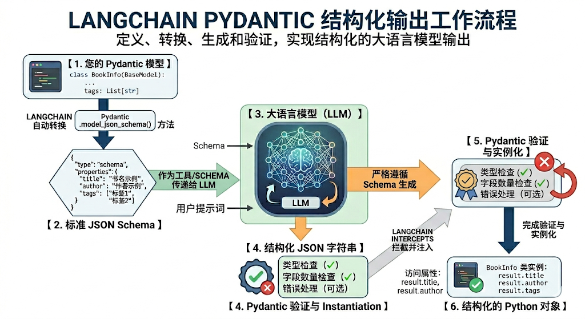
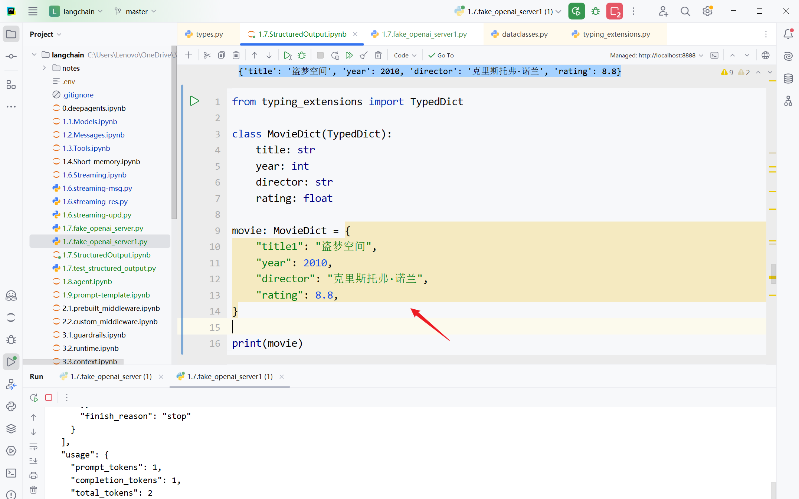

# 第06章：结构化输出(Structured Output)
讲师：尚硅谷-宋红康
官网：尚硅谷
## 1、结构化输出概述
### 1.1 什么是结构化输出
LangChain的结构化输出（Structured Output） 指的是：
要求模型最终返回一个符合预定义结构的数据对象，例如固定字段的JSON、Pydantic 模型、
TypedDict，而不再是无格式的自然语言文本。
它的核心目标是把“ 自然语言回答 ”变成“ 程序可以稳定消费的数据 ”。
例如，不是让模型输出：
盗梦空间在2010年上映，导演是克里斯托弗·诺兰，评分9.3。
而是让它输出成类似这样的结构：
~~~json
1 {
2 "title": "盗梦空间",
3 "year": 2010,
4 "director": "克里斯托弗·诺兰",
5 "rating": 9.3
6 }
~~~

这样做的价值主要有三点：
**更容易被代码处理**：下游系统可以直接读字段，而不是再从自然语言里做解析。
**结果更稳定**：减少“模型说法变了但意思差不多”导致的解析失败。
**更适合工程化**：适用于表单抽取、分类、路由、调用工具参数生成、工作流状态传递等场景。
### 1.2 传统方式 vs 结构化输出
**1、传统的几种方式（繁琐、不推荐）**
~~~python
1 # 1. 提示词要求JSON
2 prompt = "以JSON格式返回：{name, age, occupation}"
3 response = model.invoke(prompt)
1 # 2. 手动解析
2 import json
3 data = json.loads(response.content)
1 # 3. 手动验证类型
2 if not isinstance(data['age'], int):
3 raise ValueError("age must be int")
~~~

~~~text
1 # 4. 手动创建对象
2 person = Person(**data)
~~~

**2、结构化输出（简洁）**
~~~text
1 # 一步到位
2 structured_llm = model.with_structured_output(Person)
3 person = structured_llm.invoke("张三是一名 30 岁的软件工程师")
~~~

4 # ✅ 自动解析、验证、创建对象
**为什么第2种结构化输出机制这么受欢迎？**
在没有 Pydantic 等结构化方案之前，开发者需要写大量的 Prompt 苦口婆心地求大模型“请返回 JSON，
不要带任何解释”，然后自己写繁琐的 json.loads() 和 try...except 。
而有了 Pydantic 等结构化方案结合 .with_structured_output() 之后：
**Prompt** **变干净了：** 字段的 description 直接充当了 Prompt 的一部分。
**类型安全：** 编辑器能自动补全，代码运行前就能做类型检查。
**极其稳定：** 依托大模型厂商底层的 JSON 模式，输出错误率降到了极低。
### 1.3 结构化输出模式
目前LangChain 1.x 支持多种Schema与结构化输出方式：
**Pydantic**（字段校验、描述、嵌套结构，功能最丰富）
**TypedDict**（轻量类型约束）
**JSON** **Schema**（与前后端/跨语言接口最通用）
**dataclass**
模型对象可以调用 with_structured_output() 绑定**输出模式**（schema）。
只有 Pydantic 返回的是Schema类实例，其余三种方式返回的都是 字典 ；也只有 Pydantic 在类型不
匹配时会抛出异常。
**问题：现在所有模型都支持“本章要讲解的结构化输出方式”吗？**
大部分现代模型支持（通过函数调用）：
✅ OpenAI (gpt-4, gpt-3.5-turbo)
✅ Anthropic (claude-3)
✅ Groq (llama-3)
❌ 某些旧模型不支持
如果不支持，LangChain 会回退到提示词 + JSON 解析。
## 2、四种模式的使用
### 2.1 模式1：Pydantic
它通过在运行时强制执行类型提示，确保数据的正确性和一致性，是 生产场景首选 。

#### 2.1.1 基本使用
需要满足的几个要素：
所有结构化输出的数据模型都必须继承 BaseModel
使用 类型提示 。Pydantic 支持丰富的字段类型：str 、int、float、List[xxx]、Optional[xxx]等
使用 Field() 添加字段默认值和描述，帮助 LLM 理解字段含义
举例1：
1）大模型的初始化
~~~python
1 from langchain.chat_models import init_chat_model
2 from dotenv import load_dotenv
3 import os
4
5 # 从.env文件中加载环境变量
6 load_dotenv(override=True)
7
8 CLOSEAI_API_KEY = os.getenv("CLOSEAI_API_KEY")
9 CLOSEAI_BASE_URL = os.getenv("CLOSEAI_BASE_URL")
10
11 model = init_chat_model(
12 model="gpt-5.4-mini",
13 model_provider="openai",
14 api_key=CLOSEAI_API_KEY,
15 base_url=CLOSEAI_BASE_URL
16 )
~~~

2）定义 Pydantic 模型
使用清晰的字段描述；没有描述，LLM 可能格式错误
~~~python
1 from pydantic import BaseModel, Field
2
3 class Person(BaseModel):
4 """人物信息"""
5 name: str = Field(description="姓名")
6 age: int = Field(description="年龄")
7 occupation: str = Field(description="职业")
~~~

LangChain 会要求 LLM 的输出必须能填充这些字段。
3）使用 with_structured_output 即可引导模型进行结构化输出：

~~~python
1 # 创建结构化输出的 LLM
2 structured_llm = model.with_structured_output(Person)
3
4 # 调用
5 result = structured_llm.invoke("张三是一名 30 岁的软件工程师")
6
7 print(result)
8 print(type(result))
9
10 # result 是 Person 实例
11 print(result.name) # "张三"
12 print(result.age) # 30
13 print(result.occupation) # "软件工程师"
1 name='张三' age=30 occupation='软件工程师'
2 <class '__main__.Person'>
3 张三
4 30
~~~

5 软件工程师
说明：没有描述，LLM 可能格式错误。
举例2：
~~~python
1 from pydantic import BaseModel, Field, SecretStr
2
3 class MovieModel(BaseModel):
4 """
~~~

5 电影的详细信息
~~~python
6 """
7 title: str = Field(description="电影标题")
8 year: int = Field(description="电影上映年份")
9 director: str = Field(description="导演")
10 rating: float = Field(description="电影评分，满分十分")
11
12 model_with_structure = model.with_structured_output(MovieModel)
13 response = model_with_structure.invoke("给出盗梦空间的信息")
14 print(response)
15 print(type(response))
~~~

输出
~~~html
1 title='盗梦空间' year=2010 director='克里斯托弗·诺兰' rating=9.3
2
3 <class '__main__.MovieModel'>
~~~

举例3：
~~~python
1 from pydantic import BaseModel, Field
2 # 定义输出结构
3 class SentimentAnalysis(BaseModel):
4 """情感分析结果"""
5 sentiment: str = Field(description="情感倾向：positive/negative/neutral")
6 confidence: float = Field(description="置信度，0-1之间")
7 keywords: list[str] = Field(description="关键词列表")
~~~

~~~python
8
9
10 # ✅ v1.x：使用 with_structured_output
11 structured_model = model.with_structured_output(SentimentAnalysis)
12
13 # 调用
14 text = "这个课程内容很实用，学到了很多知识，强烈推荐！"
15 result = structured_model.invoke(
16 f"分析以下文本的情感：\n{text}"
17 )
18
19 print(f"类型: {type(result)}") # <class 'SentimentAnalysis'>
20 print(f"情感: {result.sentiment}")
21 print(f"置信度: {result.confidence}")
22 print(f"关键词: {result.keywords}")
1 类型: <class '__main__.SentimentAnalysis'>
2 情感: positive
3 置信度: 0.99
4 关键词: ['实用', '学到了很多知识', '强烈推荐']
~~~

#### 2.1.2 高级特性
使用CloseAI平台的gpt模型：
~~~python
1 from langchain.chat_models import init_chat_model
2 from dotenv import load_dotenv
3 import os
4
5 # 从.env文件中加载环境变量
6 load_dotenv(override=True)
7
8 CLOSEAI_API_KEY = os.getenv("CLOSEAI_API_KEY")
9 CLOSEAI_BASE_URL = os.getenv("CLOSEAI_BASE_URL")
10
11 model_with_closeai = init_chat_model(
12 model="gpt-5.4-mini",
13 model_provider="openai",
14 api_key=CLOSEAI_API_KEY,
15 base_url=CLOSEAI_BASE_URL
16 )
~~~

使用OpenRouter平台的gpt模型：
~~~python
1 from langchain_openrouter import ChatOpenRouter
2 from dotenv import load_dotenv
3 import os
4
5 load_dotenv(override=True)
6
7 OPENROUTER_API_KEY = os.getenv("OPENROUTER_API_KEY")
8 OPENROUTER_API_BASE = os.getenv("OPENROUTER_API_BASE")
9
10 model_with_openrouter = ChatOpenRouter(
~~~

~~~text
11 model="openai/gpt-5.4-mini",
12 api_key=OPENROUTER_API_KEY,
13 base_url=OPENROUTER_API_BASE,
14 )
~~~

**情况1：可选字段**
**问题：LLM** **未填充某些字段怎么办？**
使用 Optional 指定字段为可选的。
举例：
~~~python
1 from pydantic import BaseModel, Field
2 from typing import Optional
3
4 class Person(BaseModel):
5 """人物信息"""
6 name: str = Field(description="姓名")
7 age: int = Field(description="年龄")
8 occupation: str = Field(description="职业")
9
10 structured_llm = model_with_closeai.with_structured_output(Person)
11
12 structured_llm.invoke("张三是一名医生")
1 Person(name='张三', age=0, occupation='医生')
~~~

作为对比：
~~~python
1 from typing import Optional
2 from pydantic import BaseModel, Field
3
4 class Person(BaseModel):
5 """人物信息"""
6 name: str = Field(description="姓名")
7 age: Optional[int] = Field(description="年龄")
8 occupation: str = Field(description="职业")
9
10 structured_llm = model_with_closeai.with_structured_output(Person)
11
12 structured_llm.invoke("张三是一名医生")
1 Person(name='张三', age=None, occupation='医生')
~~~

**情况2：默认值**
LLM 未提供的信息会使用默认值。格式如下：
Field(default="默认值", description="描述")
注意：不同模型提供商对default字段的支持是不同的。
举例1：

使用CloseAI平台的gpt模型：
~~~python
1 from typing import Optional
2 from pydantic import BaseModel, Field
3
4 class Person(BaseModel):
5 """人物信息"""
6 name: str = Field(description="姓名")
7 age: int = Field(1,description="年龄")
8 occupation: str = Field(description="职业")
9
10 structured_llm = model_with_closeai.with_structured_output(Person)
11
12 structured_llm.invoke("张三是一名医生")
1 Person(name='张三', age=0, occupation='医生')
~~~

作为对比：
~~~python
1 from typing import Optional
2 from pydantic import BaseModel, Field
3
4 class Person(BaseModel):
5 """人物信息"""
6 name: str = Field(description="姓名")
7 age: int = Field(1,description="年龄")
8 occupation: str = Field(description="职业")
9
10 structured_llm = model_with_openrouter.with_structured_output(Person)
11
12 structured_llm.invoke("张三是一名医生")
1 Person(name='张三', age=1, occupation='医生')
~~~

举例2：
~~~python
1 class Config(BaseModel):
2 timeout: Optional[int] = Field(30,description="超时时间(单位秒)")
3 retry: bool = Field(False,description="是否支持重试")
4 max_attempts: int = Field(6,description="最大重试次数")
5
6 # 测试
7 structured_llm = model_with_closeai.with_structured_output(Config)
8 structured_llm.invoke("配置要求：支持重试,最多重试5次")
1 Config(timeout=None, retry=True, max_attempts=5)
~~~

作为对比：

~~~python
1 class Config(BaseModel):
2 timeout: Optional[int] = Field(30,description="超时时间(单位秒)")
3 retry: bool = Field(False,description="是否支持重试")
4 max_attempts: int = Field(6,description="最大重试次数")
5
6 # 测试
7 structured_llm = model_with_openrouter.with_structured_output(Config)
8 structured_llm.invoke("配置要求：支持重试,最多重试5次")
1 Config(timeout=None, retry=True, max_attempts=5)
~~~

举例3：
~~~python
1 from typing import Optional
2 from pydantic import BaseModel, Field
3
4 class Product(BaseModel):
5 """产品信息"""
6 name: str = Field(description="产品名称")
7 price: float = Field(description="价格")
8 description: Optional[str] = Field(description="产品描述")
9 stock: int = Field(default=100, description="库存")
10
11
12 # 测试
13 structured_llm = model_with_openrouter.with_structured_output(Product)
14 print("\n场景1：完整信息")
15 result1 = structured_llm.invoke("iPhone 15 售价 5999 元，最新款智能手机，库存 50
台")
16 print(result1)
17
18 print("\n场景2：缺少描述和库存")
19 result2 = structured_llm.invoke("MacBook Pro 售价 12999 元")
20 print(result2)
21
22
~~~

1 场景1：完整信息
~~~text
2 name='iPhone 15' price=5999.0 description='最新款智能手机' stock=50
3
~~~

4 场景2：缺少描述和库存
~~~text
5 name='MacBook Pro' price=12999.0 description=None stock=100
~~~

**情况3：枚举类型**
问题：如何限制字段的可选值？
回答：使用枚举。
举例1：

~~~python
1 from enum import Enum
2
3 class Priority(str, Enum):
4 LOW = "低"
5 MEDIUM = "中"
6 HIGH = "高"
7
8 class Task(BaseModel):
9 title: str
10 priority: Priority # 只能是 LOW/MEDIUM/HIGH
~~~

举例2：
~~~python
1 from enum import Enum
2
3 class Status(str, Enum):
4 ACTIVE = "激活"
5 INACTIVE = "未激活"
6
7 class User(BaseModel):
8 status: Status # 只能是 ACTIVE 或 INACTIVE
~~~

举例3：
~~~python
1 from enum import Enum
2 from typing import Optional
3 from pydantic import BaseModel, Field
4
5
~~~

6 # 定义你的优先级枚举类
~~~python
7 class Priority(str, Enum):
8 LOW = "低"
9 MEDIUM = "中"
10 HIGH = "高"
11
12 class CustomerInfo(BaseModel):
13 """客户信息"""
14 name: str = Field(description="客户姓名")
15 phone: str = Field(description="电话号码")
16 email: Optional[str] = Field(description="邮箱")
17 issue: str = Field(description="问题描述")
18 urgency: Priority = Field(description="紧急程度")
19
20
21 # 测试
22 structured_llm = model_with_openrouter.with_structured_output(CustomerInfo)
23
24 conversation = """
~~~

25 客服: 您好，请问有什么可以帮助您？
~~~text
26 客户: 我是王小明，电话 138-1234-5678，我的订单一直没发货，很着急！
~~~

27 客服: 好的，我帮您查一下
~~~python
28 """
29
30 result = structured_llm.invoke(f"从以下客服对话中提取客户信息：\n{conversation}")
31
32 print(result)
~~~

~~~python
33
34 print("\n提取结果：")
35 print(f" 客户: {result.name}")
36 print(f" 电话: {result.phone}")
37 print(f" 邮箱: {result.email or '未提供'}")
38 print(f" 问题: {result.issue}")
39 print(f" 紧急程度: {result.urgency.value}")
1 name='王小明' phone='138-1234-5678' email=None issue='订单一直没发货，很着急'
urgency=<Priority.HIGH: '高'>
2
~~~

3 提取结果：
~~~text
4 客户: 王小明
5 电话: 138-1234-5678
6 邮箱: 未提供
~~~

7 问题: 订单一直没发货，很着急
~~~text
8 紧急程度: 高
~~~

如果嫌单独定义一个 Enum 类太麻烦，也可以直接导入 typing 中的 Literal ，直接在字段里把允许
的值写死。
~~~python
1 from typing import Optional, Literal
2 from pydantic import BaseModel, Field
3
4
5 class CustomerInfo(BaseModel):
6 """客户信息"""
7 name: str = Field(description="客户姓名")
8 phone: str = Field(description="电话号码")
9 email: Optional[str] = Field("未提供", description="邮箱")
10 issue: str = Field(description="问题描述")
11 # 使用 Literal 直接限定字面量值
12 urgency: Literal["低","中","高"] = Field(description="紧急程度")
13
14
15 # 测试
16 structured_llm = model_with_openrouter.with_structured_output(CustomerInfo)
17
18 conversation = """
~~~

19 客服: 您好，请问有什么可以帮助您？
~~~text
20 客户: 我是王小明，电话 138-1234-5678，我的订单一直没发货，很着急！
~~~

21 客服: 好的，我帮您查一下
~~~python
22 """
23
24 result = structured_llm.invoke(f"从以下客服对话中提取客户信息：\n{conversation}")
25
26 print(result)
27
28 print("\n提取结果：")
29 print(f" 客户: {result.name}")
30 print(f" 电话: {result.phone}")
31 print(f" 邮箱: {result.email}")
32 print(f" 问题: {result.issue}")
33 print(f" 紧急程度: {result.urgency}")
~~~

~~~text
1 name='王小明' phone='138-1234-5678' email='未提供' issue='订单一直没发货，很着
急' urgency='高'
2
~~~

3 提取结果：
~~~text
4 客户: 王小明
5 电话: 138-1234-5678
6 邮箱: 未提供
~~~

7 问题: 订单一直没发货，很着急
~~~text
8 紧急程度: 高
~~~

应用场景：
自动填充 CRM 系统
工单自动分类
客服辅助
**情况4：列表提取**
举例1：
~~~python
1 from typing import List
2
3 class Person(BaseModel):
4 """人物信息"""
5 name: str
6 age: int
7
8 class PersonList(BaseModel):
9 """人物列表信息"""
10 people: List[Person] # 多个 Person 对象
11
12 structured_llm = model.with_structured_output(PersonList)
13 result = structured_llm.invoke("张三 30岁，李四 25岁")
14
15 print(result)
1 people=[Person(name='张三', age=30), Person(name='李四', age=25)]
~~~

举例2：产品评论分析
~~~python
1 class Review(BaseModel):
2 """产品评论"""
3 product: str
4 rating: int = Field(description="评分 1-5")
5 pros: List[str] = Field(description="优点列表")
6 cons: List[str] = Field(description="缺点列表")
7
8 structured_llm = model.with_structured_output(Review)
9
10 review = structured_llm.invoke("""
11 iPhone 17 很棒！摄像头强大，手感好。但是价格贵，没有充电器。4分。
12 """)
13
14 print(review)
~~~

~~~text
1 product='iPhone 17' rating=4 pros=['摄像头强大', '手感好'] cons=['价格贵',
'没有充电器']
~~~

应用场景：
批量处理用户评论
自动生成分析报告
发现产品改进点
举例3：文档信息提取
~~~python
1 class Invoice(BaseModel):
2 """发票信息"""
3 invoice_number: str = Field(description="发票号")
4 date: str = Field(description="日期")
5 total_amount: float = Field(description="总金额")
6 items: List[str] = Field(description="商品")
7
8 # 测试
9 structured_llm = model.with_structured_output(Invoice)
10
11 invoice_text = """
12 发票号: INV-2024-001
13 日期: 2024-01-15
14 总金额: 1299.00
15 商品: MacBook Pro, AppleCare+
16 """
17
18 invoice = structured_llm.invoke(f"提取发票信息：{invoice_text}")
19 print(invoice)
1 invoice_number='INV-2024-001' date='2024-01-15' total_amount=1299.0
items=['MacBook Pro', 'AppleCare+']
~~~

应用场景：
自动化财务处理
OCR 后结构化
数据录入
**情况5：嵌套结构**
举例1：
~~~python
1 from pydantic import BaseModel
2
3 class Address(BaseModel):
4 """地点描述"""
5 city: str
6 district: str
7
8 class Company(BaseModel):
9 """公司信息"""
10 name: str
11 address: Address # 嵌套模型
12
13 structured_llm = model.with_structured_output(Company)
~~~

~~~python
14 result = structured_llm.invoke("阿里巴巴在杭州滨江区")
15
16 print(result)
1 name='阿里巴巴' address=Address(city='杭州', district='滨江区')
~~~

举例2：
~~~python
1 from pydantic import BaseModel, Field
2 from typing import List
3
4 # 1. 定义嵌套的 Pydantic 模型
5 class Actor(BaseModel):
6 """演员信息"""
7 name: str = Field(description="演员姓名")
8 role: str = Field(description="饰演的角色")
9
10 class Movie(BaseModel):
11 """电影信息"""
12 title: str = Field(description="电影标题")
13 year: int = Field(description="上映年份")
14 director: str = Field(description="导演")
15 cast: List[Actor] = Field(description="演员列表") # 定义列表字段
16 rating: float = Field(description="评分")
17
18 # 2. 初始化模型并绑定输出结构
19 structured_model = model.with_structured_output(Movie)
20
21 # 3. 调用模型，直接获取 Movie 实例
22 response = structured_model.invoke("请介绍电影《盗梦空间》")
23
24 # 4. 访问嵌套数据
25 print(f"电影名: {response.title}")
26 print(f"上映年份: {response.year}")
27 print(f"导演: {response.director}")
28 print(f"演员列表: {response.cast}")
29 print(f"评分: {response.rating}")
~~~

以上代码输出结果如下：
1 电影名: 盗梦空间
~~~text
2 上映年份: 2010
3 导演: 克里斯托弗·诺兰
4 演员列表: [Actor(name='莱昂纳多·迪卡普里奥', role='柯布'), Actor(name='约瑟夫·
高登-莱维特', role='亚瑟'), Actor(name='艾伦·佩吉', role='阿里阿德涅'),
Actor(name='汤姆·哈迪', role='艾姆斯'), Actor(name='渡边谦', role='斋藤'),
Actor(name='玛丽昂·歌迪亚', role='梅尔')]
5 评分: 8.8
~~~

说明：LLM 能力有限，复杂嵌套结构可能会出错。所以建议：
嵌套层级 ≤ 3 层

~~~python
1 class Bad(BaseModel):
2 user: User
3 company: Company
4 address: Address
5 country: Country # 4 层嵌套，容易出错
~~~

使用清晰的 description
必要时拆分成多个调用
举例3：
~~~python
1 from pydantic import BaseModel
2 from typing import List
3
4 class Aspect(BaseModel):
5 """评论维度"""
6 name: str = Field(description="维度名称，如：质量、价格、服务")
7 score: int = Field(description="评分，1-5")
8 comment: str = Field(description="具体评价")
9
10 class ProductReview(BaseModel):
11 """产品评论分析"""
12 overall_sentiment: str = Field(description="整体情感：
positive/negative/neutral")
13 overall_score: int = Field(description="综合评分，1-5")
14 aspects: List[Aspect] = Field(description="各维度评价")
15 summary: str = Field(description="一句话总结")
16
17 # 创建结构化模型
18 structured_model = model.with_structured_output(ProductReview)
19 # 测试
20 review_text = """
~~~

21 这款笔记本电脑性能非常强大，运行大型软件毫无压力。
22 屏幕色彩鲜艳，看视频很舒服。
23 不过价格有点贵，而且风扇噪音较大。
24 客服态度很好，物流也快。
25 总体来说还是值得购买的。
~~~python
26 """
27
28 result = structured_model.invoke(
29 f"分析以下产品评论：\n{review_text}"
30 )
31
32 print(f"整体情感: {result.overall_sentiment}")
33 print(f"综合评分: {result.overall_score}/5")
34 print(f"\n各维度评价:")
35 for aspect in result.aspects:
36 print(f" - {aspect.name}: {aspect.score}/5 - {aspect.comment}")
37 print(f"\n总结: {result.summary}")
~~~

~~~text
1 整体情感: positive
2 综合评分: 4/5
3
4 各维度评价:
5 - 性能: 5/5 - 性能非常强大，运行大型软件毫无压力。
6 - 屏幕: 5/5 - 屏幕色彩鲜艳，看视频很舒服。
7 - 价格: 2/5 - 价格有点贵，性价比略受影响。
8 - 噪音: 2/5 - 风扇噪音较大，影响使用体验。
9 - 服务: 5/5 - 客服态度很好，物流也快。
10
~~~

11 总结: 整体表现优秀，性能和屏幕突出，服务也好，但价格偏高且风扇噪音较大。
**情况6：限制条件**
举例1：
~~~python
1 from pydantic import ValidationError
2
3
4 class User(BaseModel):
5 name: str = Field(min_length=2, max_length=20)
6 age: int = Field(ge=0, le=150)
7 email: str
8
9 print("\n有效数据:")
10 try:
11 user = User(name="张三", age=30, email="zhang@example.com")
12 print(f"[OK] {user.name}, {user.age}, {user.email}")
13 except ValidationError as e:
14 print(f"[FAIL] {e}")
15
16 print("\n无效数据（年龄超出范围）:")
17 try:
18 user = User(name="李四", age=200, email="li@example.com")
19 print(f"[OK] {user}")
20 except ValidationError as e:
21 print(f"[FAIL] 验证失败（符合预期）: {e.errors()[0]['msg']}")
22
1 有效数据:
2 [OK] 张三, 30, zhang@example.com
3
~~~

4 无效数据（年龄超出范围）:
~~~text
5 [FAIL] 验证失败（符合预期）: Input should be less than or equal to 150
~~~

举例2：
使用CloseAI平台模型

~~~python
1 class Product(BaseModel):
2 """产品信息（严格验证）"""
3 name: str = Field(description="产品名称（字符串类型）", min_length=2)
4 price: float = Field(description="价格，数字类型", gt=0)
5 stock: int = Field(description="库存，整数类型", ge=0)
6
7
8 # 测试
9 structured_llm = model_with_closeai.with_structured_output(Product)
10
11 # response = structured_llm.invoke("华为mate 80 promax 价格是7999，当前库存
100")
12 response = structured_llm.invoke("华为mate 80 promax 价格是-7999，当前库
存-100")
13 print(response)
1 name='华为mate 80 promax' price=7999.0 stock=100
~~~

使用OpenRouter平台模型
~~~python
1 class Product(BaseModel):
2 """产品信息（严格验证）"""
3 name: str = Field(description="产品名称（字符串类型）", min_length=2)
4 price: float = Field(description="价格，数字类型", gt=0)
5 stock: int = Field(description="库存，整数类型", ge=0)
6
7
8 # 测试
9 structured_llm = model_with_openrouter.with_structured_output(Product)
10
11 # response = structured_llm.invoke("华为mate 80 promax 价格是7999，当前库存
100")
12 response = structured_llm.invoke("华为mate 80 promax 价格是-7999，当前库
存-100")
13 print(response)
1 name='华为mate 80 promax' price=1.0 stock=0
~~~

#### 2.1.3 工作流程图解

**第1步：定义结构**
比如：
~~~python
1 from pydantic import BaseModel, Field
2
3 class BookInfo(BaseModel):
4 title: str = Field(description="书名")
5 author: str = Field(description="作者名字")
6 tags: list[str] = Field(description="书籍的标签或分类")
~~~

**第2步：协议转换**
LangChain 内部会调用 Pydantic 的底层方法（如 model_json_schema() ），将你写的 Python 代码**自**
**动转换成标准的** **JSON** **Schema**。
这个 JSON Schema 是一段严格的 JSON 文本，详细描述了有哪些字段、字段类型是什么（ string ,
array 等）以及字段的描述（ description ）。
**第3步：模型交互与强约束**
LangChain 会将这个 JSON Schema 包装进给大模型的 API 请求中。
现代方法（ .with_structured_output ）： 现代大模型（如 OpenAI、Anthropic、Gemini 等）普
遍支持“函数调用/工具调用（Function/Tool Calling）”或“JSON Mode”。LangChain 会把 JSON
Schema 作为 Tools 传入。
大模型侧的约束： 像 OpenAI 的 strict=True 参数，会启动模型的**语法采样约束（Grammar-**
**based** **sampling）**。大模型在解码生成 token 时，不是瞎猜，而是严格按照 JSON Schema 的语
法树进行选择，从而在**模型底层级**保证了输出格式绝不走样。
**第4步：自动解析与验证**
当大模型返回符合 JSON 规范的字符串后，LangChain 的 PydanticStructuredOutputParser （解析
器）会接管工作：
1. **解析（Parsing）：** 将字符串解析为 Python 字典。
2. **验证（Validation）：** 将字典喂给你的 Pydantic 模型。Pydantic 会自动检查数据类型是否正确。
如果模型漏掉了必填字段，或者类型错误，这里会直接抛出验证错误（或者触发 LangChain 的重
试机制）。

3. **返回（Return）：** 如果通过验证，你拿到的不再是冷冰冰的字符串，而是一个**直接可以点出属性**
**的** **Python** **Pydantic** **对象**（例如 result.title ）。
### 2.2 模式2：TypedDict
#### 2.2.1 什么是 TypedDict
TypedDict 是 Python 3.8+ 引入的一种类型提示工具，**即带有类型声明的字典结构**。适合需要快速定义
字典结构且无需 Pydantic 重量级功能的场景。
1、 普通 dict 没有类型信息：
~~~json
1 {
2 "title": "盗梦空间",
3 "year": 2010,
4 "director": "克里斯托弗·诺兰",
5 "rating": 9.3
6 }
~~~

2、 TypedDict 可以进一步说明：
这个字典应该有哪些字段
每个字段的类型是什么
TypedDict 主要是**类型声明**，不是运行时强校验器。
举例：
~~~python
1 from typing_extensions import TypedDict
2
3 class MovieDict(TypedDict):
4 title: str
5 year: int
6 director: str
7 rating: float
8
9 movie: MovieDict = {
10 "title1": "盗梦空间",
11 "year": 2010,
12 "director": "克里斯托弗·诺兰",
13 "rating": 8.8,
14 }
15
16 print(movie)
~~~

实例化字典时给出的字段名称和TypedDict不完全一致，此时IDE的静态类型检查会标记。

但不会导致运行时异常，输出如下所示
~~~text
1 {
2 'title1': '盗梦空间',
3 'year': 2010,
4 'director': '克里斯托弗·诺兰',
5 'rating': 8.8
6 }
~~~

#### 2.2.2 基本使用
**Annotated的使用**
Annotated 用来在“类型”之外，再附加一些额外信息，即**元数据**。类似于 Pydantic 的 Field 。
**基本形式：**
~~~text
1 Annotated[类型, 附加信息1, 附加信息2, ...]
~~~

**举例的前提：**
使用CloseAI平台的gpt模型：
~~~python
1 from langchain.chat_models import init_chat_model
2 from dotenv import load_dotenv
3 import os
4
5 # 从.env文件中加载环境变量
6 load_dotenv(override=True)
7
8 CLOSEAI_API_KEY = os.getenv("CLOSEAI_API_KEY")
9 CLOSEAI_BASE_URL = os.getenv("CLOSEAI_BASE_URL")
10
11 model_with_closeai = init_chat_model(
~~~

~~~text
12 model="gpt-5.4-mini",
13 model_provider="openai",
14 api_key=CLOSEAI_API_KEY,
15 base_url=CLOSEAI_BASE_URL
16 )
~~~

使用OpenRouter平台的gpt模型：
~~~python
1 from langchain_openrouter import ChatOpenRouter
2 from dotenv import load_dotenv
3 import os
4
5 load_dotenv(override=True)
6
7 OPENROUTER_API_KEY = os.getenv("OPENROUTER_API_KEY")
8 OPENROUTER_API_BASE = os.getenv("OPENROUTER_API_BASE")
9
10 model_with_openrouter = ChatOpenRouter(
11 model="openai/gpt-5.4-mini",
12 api_key=OPENROUTER_API_KEY,
13 base_url=OPENROUTER_API_BASE,
14 )
~~~

**举例1：返回简单结构**
~~~python
1 """
2 使用 TypedDict 模型定义结构化输出
3 """
4 from typing_extensions import TypedDict, Annotated
5
6
7 class MovieTypedDict(TypedDict):
8 """
~~~

9 电影的详细信息
~~~yaml
10 """
11 title: Annotated[str, "电影的正式名称，例如《盗梦空间》"]
12 year: Annotated[int, "电影的公映年份，使用四位数字表示"]
13 director: Annotated[str, "电影导演的全名"]
14 rating: Annotated[float, "电影在10分制下的评分，可包含一位小数"]
15
16 # 设置模型结构化输出
17 structured_llm = model_with_closeai.with_structured_output(MovieTypedDict)
18
~~~

19 # 调用模型并获取结构化输出
~~~python
20 response = structured_llm.invoke("给我介绍下电影《星际穿越》")
21
22 print(type(response))
23 print(response)
~~~

输出如下：
~~~html
1 <class 'dict'>
2 {'title': '星际穿越', 'year': 2014, 'director': '克里斯托弗·诺兰', 'rating':
8.6}
~~~

**举例2：返回嵌套结构**

~~~python
1 from typing import TypedDict, List, Annotated
2
3 # 使用TypedDict定义嵌套结构
4 class Actor(TypedDict):
5 """演员情况"""
6 name: Annotated[str, "演员姓名"]
7 role: Annotated[str, "饰演的角色"]
8
9 class Movie(TypedDict):
10 """电影情况"""
11 title: Annotated[str, "电影标题"]
12 year: Annotated[int, "上映年份"]
13 director: Annotated[str, "导演"]
14 cast: Annotated[List[Actor], "演员列表"] # 嵌套列表定义
15 rating: Annotated[float, "评分"]
16
17 # 设置模型结构化输出
18 structured_llm = model_with_closeai.with_structured_output(Movie)
19
~~~

20 # 调用模型并获取结构化输出
~~~python
21 resp = structured_llm.invoke("给我介绍下电影《盗梦空间》")
22
23 # 访问嵌套数据
24 print(f"电影名: {resp['title']}")
25 print(f"上映年份: {resp['year']}")
26 print(f"导演: {resp['director']}")
27 print(f"演员列表:{resp['cast']}")
28 print(f"评分: {resp['rating']}")
~~~

输出如下：
1 电影名: 盗梦空间
~~~text
2 上映年份: 2010
3 导演: 克里斯托弗·诺兰
4 演员列表:[{'name': '莱昂纳多·迪卡普里奥', 'role': '多姆·柯布'}, {'name': '约瑟
夫·高登-莱维特', 'role': '亚瑟'}, {'name': '艾伦·佩吉', 'role': '阿里阿德涅'},
{'name': '汤姆·哈迪', 'role': '伊姆斯'}, {'name': '渡边谦', 'role': '斋藤'}]
5 评分: 8.8
~~~

**举例3：...的使用**
说明：与模型提供商有关系
使用CloseAI平台gpt模型：
~~~python
1 from typing_extensions import TypedDict, Annotated
2
3 class MovieDict(TypedDict):
4 """
~~~

5 电影的详细信息
~~~yaml
6 """
7 title: Annotated[str, ..., "电影标题"]
8 year: Annotated[int, ..., "电影上映年份"]
9 director: Annotated[str, ..., "导演"]
10 rating: Annotated[float, ..., "电影评分，满分十分"]
11
12
~~~

~~~text
13 model_with_structure = model_with_closeai.with_structured_output(MovieDict)
14 response = model_with_structure.invoke("根据这段话抽取盗梦空间的信息，不包含的信息
~~~

可以留空：盗梦空间在2010年上映，导演是克里斯托弗·诺兰。")
~~~python
15 print(response)
16 print(type(response))
~~~

输出
~~~html
1 {'title': '盗梦空间', 'year': 2010, 'director': '克里斯托弗·诺兰'}
2 <class 'dict'>
~~~

使用OpenRouter平台gpt模型：
~~~python
1 from typing_extensions import TypedDict, Annotated
2
3 class MovieDict(TypedDict):
4 """
~~~

5 电影的详细信息
~~~yaml
6 """
7 title: Annotated[str, ..., "电影标题"]
8 year: Annotated[int, ..., "电影上映年份"]
9 director: Annotated[str, ..., "导演"]
10 rating: Annotated[float, ..., "电影评分，满分十分"]
11
12
13 model_with_structure =
model_with_openrouter.with_structured_output(MovieDict)
14 response = model_with_structure.invoke("根据这段话抽取盗梦空间的信息，不包含的信息
~~~

可以留空：盗梦空间在2010年上映，导演是克里斯托弗·诺兰。")
~~~python
15 print(response)
16 print(type(response))
~~~

输出
~~~html
1 {'title': '盗梦空间', 'year': 2010, 'director': '克里斯托弗·诺兰', 'rating':
0}
2 <class 'dict'>
~~~

说明：上述代码的 ... 是Python的字面量，等价于 Ellipsis ，可以理解为占位符。下游框架（如
LangChain）可以对 ... 作定制化处理，如LangChain中Annotated的 ... 表示当前字段是必须存在的，
不可省略，用来指示模型的输出。
再比如：
~~~python
1 from typing_extensions import TypedDict, Annotated
2
3
4 class MovieDict(TypedDict):
5 """
~~~

6 电影的详细信息
~~~yaml
7 """
8 title: Annotated[str, ..., "电影标题"]
9 year: Annotated[int, ..., "电影上映年份"]
10 director: Annotated[str, Ellipsis, "导演"]
11 rating: Annotated[float, "电影评分，满分十分"]
12
~~~

~~~text
13
14 model_with_structure = model.with_structured_output(MovieDict)
15 response = model_with_structure.invoke("根据这段话抽取盗梦空间的信息，不包含的信息
~~~

必须留空：盗梦空间上映于2010年，我们并不知道它的导演是谁。")
~~~python
16 print(response)
17 print(type(response))
~~~

输出
~~~html
1 {'title': '盗梦空间', 'year': 2010, 'director': ''}
2 <class 'dict'>
~~~

director 和 rating 的信息都是缺失的，但是前者被标记为**必填**，因此输出的字典包含该字段但是值为
空字符串，而 rating 字段被省略了。
### 2.3 模式3：JSON Schema
这种方式需要按照JSON Schema规范拼接JSON字符串，比较繁琐，并且缺少校验机制。不推荐。
**举例1：返回简单结构**
模型初始化：
~~~python
1 from langchain.chat_models import init_chat_model
2 from dotenv import load_dotenv
3 import os
4
5 # 从.env文件中加载环境变量
6 load_dotenv(override=True)
7
8 CLOSEAI_API_KEY = os.getenv("CLOSEAI_API_KEY")
9 CLOSEAI_BASE_URL = os.getenv("CLOSEAI_BASE_URL")
10
11 model = init_chat_model(
12 model="gpt-5.4-mini",
13 model_provider="openai",
14 api_key=CLOSEAI_API_KEY,
15 base_url=CLOSEAI_BASE_URL
16 )
1
2 json_schema = {
3 "title": "Movie",
4 "description": "A movie with details",
5 "type": "object",
6 "properties": {
7 "title": {
8 "type": "string",
9 "description": "The title of the movie"
10 },
11 "year": {
12 "type": "integer",
13 "description": "The year the movie was released"
14 },
15 "director": {
~~~

~~~python
16 "type": "string",
17 "description": "The director of the movie"
18 },
19 "rating": {
20 "type": "number",
21 "description": "The movie's rating out of 10"
22 }
23 },
24 "required": ["title", "year", "director", "rating"]
25 }
26
27 structured_model = model.with_structured_output(
28 json_schema,
29 method="json_schema"
30 )
31
32 response = structured_model.invoke("给出盗梦空间的信息")
33 print(response)
34 print(type(response))
~~~

输出如下：
~~~html
1 {'title': '盗梦空间', 'year': 2010, 'director': '克里斯托弗·诺兰', 'rating':
8.8}
2 <class 'dict'>
~~~

说明：
1、**method：**结构化输出的方式，但是否可用，依赖于模型供应商及Langchain适配器的具体实现。比
如，DeepSeek模型服务不支持json_shema模式。
**json_schema：**使用模型供应商提供的专用结构化输出功能。
2、以上代码中定义json_schema的时候指定的title、description、type、properties、required是遵循
JSON Schema 规范的标准关键字，是固定写法。几个关键字的解释如下：
title ：为整个 Schema 或特定属性提供一个人类可读的标题，不能是中文，用于提高可读性。
description ：提供更详细的文字描述，说明 Schema 或属性的用途等，和 title一样，旨在帮助理
解。
type ：定义当前数据节点必须是什么数据类型。常见类型有 string, number, integer, boolean,
object, array, null。object即是json对象。
properties ：用于定义JSON 对象（Object）中可以包含哪些属性（键），以及每个属性对应的值
类型和说明。
required ：当 type为 "object"时使用，是一个数组，列出了对象中必须存在的属性名。
**举例2：返回嵌套结构**
~~~text
1 """
2 使用 JSON Schema 定义嵌套结构
3 """
4 # 1. 定义嵌套的 JSON Schema
5 project_schema = {
6 "title": "MovieInfo",
7 "description": "包含电影标题、上映年份、导演、演员和评分的电影对象",
8 "type": "object",
9 "properties": {
10 "title": {"type": "string", "description": "电影标题"},
~~~

~~~python
11 "year": {"type": "integer", "description": "上映年份"},
12 "director": {"type": "string", "description": "导演"},
13 "cast": { # 定义嵌套数组
14 "type": "array",
15 "description": "演员列表",
16 "items": {
17 "type": "object",
18 "properties": {
19 "name": {"type": "string", "description": "演员姓名"},
20 "role": {"type": "string", "description": "演员角色"}
21 },
22 "required": ["name", "role"]
23 }
24 },
25 "rating": {"type": "number", "description": "评分（10分制）"}
26 },
27 "required": ["title", "year", "director", "cast", "rating"]
28 }
29
30 # 绑定 JSON Schema 到模型
31 structured_model = model.with_structured_output(project_schema)
32
33 # 调用模型
34 response = structured_model.invoke("生成一个关于《星际穿越》的电影信息，包含导演、演
员、评分")
35 print(response)
~~~

输出如下：
~~~text
1 {
2 'title': '星际穿越',
3 'year': 2014,
4 'director': '克里斯托弗·诺兰',
5 'rating': 8.6,
6 'cast': [{
7 'name': '马修·麦康纳',
8 'role': '库珀'
9 }, {
10 'name': '安妮·海瑟薇',
11 'role': '艾米莉亚·布兰德'
12 }, {
13 'name': '杰西卡·查斯坦',
14 'role': '墨菲·库珀（成年）'
15 }, {
16 'name': '迈克尔·凯恩',
17 'role': '布兰德教授'
18 }, {
19 'name': '马特·达蒙',
20 'role': '曼恩博士'
21 }, {
22 'name': '麦肯吉·弗依',
23 'role': '墨菲·库珀（10岁）'
24 }, {
25 'name': '蒂莫西·柴勒梅德',
26 'role': '汤姆·库珀（15岁）'
27 }, {
28 'name': '卡西·阿弗莱克',
~~~

~~~text
29 'role': '汤姆·库珀（成年）'
30 }]
31 }
~~~

### 2.4 模式4：@dataclass
@dataclass是 Python 标准库 dataclasses 提供的类装饰器，用于简化“以字段为核心”的数据类定义。
给类加上 @dataclass 后，Python 会根据字段声明自动生成常用方法，例如：
__init__
__repr__
__eq__
因此，从**对象行为**上看， @dataclass 创建的类，常常 近似于 手写这些方法的普通类。
~~~python
1 from dataclasses import dataclass
2
3 @dataclass
4 class Movie:
5 title: str
6 year: int
7 director: str
8 rating: float
~~~

这类写法的主要价值是：让“数据结构定义”更简洁、更清晰。
**注意：**
虽然 @dataclass 在行为上接近于手写 __init__ 、 __repr__ 、 __eq__ 的普通类，但二者**并不完全等**
**价**。 @dataclass 修饰后的类仍然是普通的python类，但它会被标准库标记为**数据类**，并携带
dataclass的字段元信息，手写 __init__ 等方法的普通类不能替代@dataclass修饰的类。
前者可以作为Langchain的Schema，而后者不行。
举例：
模型的初始化：
~~~python
1 from langchain.chat_models import init_chat_model
2 from dotenv import load_dotenv
3 import os
4
5 # 从.env文件中加载环境变量
6 load_dotenv(override=True)
7
8 CLOSEAI_API_KEY = os.getenv("CLOSEAI_API_KEY")
9 CLOSEAI_BASE_URL = os.getenv("CLOSEAI_BASE_URL")
10
11 model = init_chat_model(
12 model="gpt-5.4-mini",
13 model_provider="openai",
14 api_key=CLOSEAI_API_KEY,
15 base_url=CLOSEAI_BASE_URL
16 )
1 from dataclasses import dataclass
~~~

~~~python
2 from pydantic import Field
3
4 @dataclass
5 class Movie():
6 """
~~~

7 电影的详细信息
~~~python
8 """
9 title: str = Field(description="电影标题")
10 year: int = Field(description="电影上映年份")
11 director: str = Field(description="导演")
12 rating: float = Field(description="电影评分，满分十分")
13
14 structured_model = model.with_structured_output(Movie)
15
16 response = structured_model.invoke("给出盗梦空间的信息")
17 print(response)
18 print(type(response))
~~~

输出
~~~html
1 {'title': '盗梦空间', 'year': 2010, 'director': '克里斯托弗·诺兰', 'rating': 8.8}
2 <class 'dict'>
~~~

@dataclass作为schema，返回的是**未经校验的字典**。
## 3、关于类型校验
验证不同schema定义方式在数据格式不匹配时的处理方式。
### 3.1 fake server
我们构造一个虚拟的DeepSeek服务端，客户端接收到的响应是 人为构造 的，主要目的是为了观察不同
模式下LangChain会从响应中的哪些字段中抽取信息。
服务器端如下：
~~~python
1 import json
2 import time
3 from http.server import BaseHTTPRequestHandler, HTTPServer
4
5
6 class FakeDeepSeekHandler(BaseHTTPRequestHandler):
7 def do_POST(self):
8 content_length = int(self.headers.get("Content-Length", 0))
9 raw_body = self.rfile.read(content_length).decode("utf-8")
10
11 print("\n" + "=" * 100)
12
13 json_body = None
14 try:
15 json_body = json.loads(raw_body)
16 print("[JSON BODY]")
17 print(json.dumps(json_body, ensure_ascii=False, indent=2))
18 except Exception as e:
19 print("[JSON PARSE ERROR]")
~~~

~~~python
20 print(repr(e))
21
22 # 固定返回一个普通 JSON 字符串
23 response = {
24 "id": "chatcmpl-test",
25 "object": "chat.completion",
26 "created": int(time.time()),
27 "model": "any",
28 "choices": [
29 {
30 "index": 0,
31 "message": {
32 "role": "assistant",
33 "content": "",
34 "tool_calls": [
35 {
36 "id": "call_1",
37 "type": "function",
38 "function": {
39 "name": json_body["tools"][0]
["function"]["name"],
40 "arguments": json.dumps(
41 {'title1': '盗梦空间', 'year2': 2010,
'director': '克里斯托弗·诺兰',
42 'rating': 9.3},
43 ensure_ascii=False
44 )
45 }
46 }
47
48 ]
49 },
50 "finish_reason": "stop"
51 }
52 ],
53 "usage": {
54 "prompt_tokens": 1,
55 "completion_tokens": 1,
56 "total_tokens": 2
57 }
58 }
59
60 print("\n" + "=" * 100)
61 print("[RESPONSE]")
62 print(json.dumps(response, ensure_ascii=False, indent=2))
63
64 body = json.dumps(response, ensure_ascii=False).encode("utf-8")
65
66 self.send_response(200)
67 self.send_header("Content-Type", "application/json; charset=utf-8")
68 self.send_header("Content-Length", str(len(body)))
69 self.end_headers()
70 self.wfile.write(body)
71
72 def log_message(self, format, *args):
73 pass
74
75
~~~

~~~python
76 def main():
77 server = HTTPServer(("127.0.0.1", 8889), FakeDeepSeekHandler)
78 print("Fake DeepSeek server running at http://127.0.0.1:8889")
79 server.serve_forever()
80
81
82 if __name__ == "__main__":
83 main()
~~~

不必关注代码实现，只需要知道我们返回的核心内容是
~~~text
1 {
2 'title1': '盗梦空间',
3 'year2': 2010,
4 'director': '克里斯托弗·诺兰',
5 'rating': 9.3
6 }
~~~

LangChain客户端希望模型返回的是
~~~text
1 {
2 'title': 'xxx',
3 'year': xxxx,
4 'director': 'xxx',
5 'rating': xxx
6 }
~~~

这里的前两个字段不匹配。
启动服务端，然后执行四种定义方式的客户端代码
### 3.2 四种模式的校验
#### 3.2.1 Pydantic
~~~python
1 from pydantic import BaseModel, Field, SecretStr
2
3 from langchain_deepseek import ChatDeepSeek
4
5 model = ChatDeepSeek(
6 model="deepseek-v4-flash",
7 api_base="http://localhost:8889",
8 api_key=SecretStr("<KEY>")
9 )
10
11 class MovieModel(BaseModel):
12 """
~~~

13 电影的详细信息
~~~yaml
14 """
15 title: str = Field(description="电影标题")
16 year: int = Field(description="电影上映年份")
17 director: str = Field(description="导演")
18 rating: float = Field(description="电影评分，满分十分")
19
20
21 model_with_structure = model.with_structured_output(MovieModel)
~~~

~~~python
22 response = model_with_structure.invoke("给出盗梦空间的信息")
23 print(response)
24 print(type(response))
~~~

输出
~~~text
1 Traceback...
2 ValidationError: 2 validation errors for MovieModel
3 title
4 Field required [type=missing, input_value={'title1': '盗梦空间'...诺兰',
'rating': 9.3}, input_type=dict]
5 For further information visit https://errors.pydantic.dev/2.12/v/missing
6 year
7 Field required [type=missing, input_value={'title1': '盗梦空间'...诺兰',
'rating': 9.3}, input_type=dict]
8 For further information visit https://errors.pydantic.dev/2.12/v/missing
~~~

因为 title 和 year 字段不匹配抛出异常。
#### 3.2.2 TypedDict
~~~python
1 from typing_extensions import TypedDict, Annotated
2
3 from langchain_deepseek import ChatDeepSeek
4
5 model = ChatDeepSeek(
6 model="deepseek-v4-flash",
7 api_base="http://localhost:8889",
8 api_key=SecretStr("<KEY>")
9 )
10
11 class MovieDict(TypedDict):
12 """
~~~

13 电影的详细信息
~~~python
14 """
15 title: Annotated[str,"电影标题"]
16 year: Annotated[int,"电影上映年份"]
17 director: Annotated[str,"导演"]
18 rating: Annotated[float,"电影评分，满分十分"]
19
20
21 structured_model = model.with_structured_output(MovieDict)
22 response = structured_model.invoke("给出盗梦空间的信息")
23 print(response)
24 print(type(response))
~~~

输出
~~~html
1 {'title1': '盗梦空间', 'year2': 2010, 'director': '克里斯托弗·诺兰',
'rating': 9.3}
2 <class 'dict'>
~~~

按照字典形式输出，不报错。

#### 3.2.3 JSON schema
~~~python
1 from langchain_deepseek import ChatDeepSeek
2
3 model = ChatDeepSeek(
4 model="deepseek-v4-flash",
5 api_base="http://localhost:8889",
6 api_key=SecretStr("<KEY>")
7 )
8
9 json_schema = {
10 "title": "Movie",
11 "description": "A movie with details",
12 "type": "object",
13 "properties": {
14 "title": {
15 "type": "string",
16 "description": "The title of the movie"
17 },
18 "year": {
19 "type": "integer",
20 "description": "The year the movie was released"
21 },
22 "director": {
23 "type": "string",
24 "description": "The director of the movie"
25 },
26 "rating": {
27 "type": "number",
28 "description": "The movie's rating out of 10"
29 }
30 },
31 "required": ["title", "year", "director", "rating"]
32 }
33
34 structured_model = model.with_structured_output(
35 json_schema,
36 method="json_schema"
37 )
38
39 response = structured_model.invoke("给出盗梦空间的信息")
40 print(response)
41 print(type(response))
~~~

输出如下
~~~html
1 {'title1': '盗梦空间', 'year2': 2010, 'director': '克里斯托弗·诺兰',
'rating': 9.3}
2 <class 'dict'>
~~~

按照字典形式输出，不报错。

#### 3.3.4 @dataclass
~~~python
1 from dataclasses import dataclass
2
3 from langchain_deepseek import ChatDeepSeek
4
5 model = ChatDeepSeek(
6 model="deepseek-v4-flash",
7 api_base="http://localhost:8889",
8 api_key=SecretStr("<KEY>")
9 )
10
11 @dataclass
12 class Movie():
13 """
~~~

14 电影的详细信息
~~~python
15 """
16 title: str = Field(description="电影标题")
17 year: int = Field(description="电影上映年份")
18 director: str = Field(description="导演")
19 rating: float = Field(description="电影评分，满分十分")
20
21
22 structured_model = model.with_structured_output(Movie)
23
24 response = structured_model.invoke("给出盗梦空间的信息")
25 print(response)
26 print(type(response))
~~~

输出如下
~~~html
1 {'title1': '盗梦空间', 'year2': 2010, 'director': '克里斯托弗·诺兰',
'rating': 9.3}
2 <class 'dict'>
~~~

按照字典形式输出，不报错。
#### 3.2.5 小 结
用Pydantic定义schema，在接收到响应后会进行校验，字段不匹配则抛出异常，其余三种方式不校验。
## 4、获取结构化结果方式
以上定义输出结构的四种模式中，我们都是通过调用“with_structured_output”来获取结构化输出结
果，除了这种方式外，还可以通过使用输出解释器来获取结构化输出结果。下面介绍这两种获取结构化
结果的方式。

### 4.1 使用with_structured_output
这种方式是 最新 、 最简洁 的API，直接让模型“理解”你需要的数据结构，并返回解析好的对象。
此外，我们可以在with_structured_output方法中传入 include_raw=True 参数，表示返回解析前的 原
始AIMessage ，从而访问令牌用量等元数据。
举例：
~~~python
1 from langchain.chat_models import init_chat_model
2 from dotenv import load_dotenv
3 import os
4
5 # 从.env文件中加载环境变量
6 load_dotenv(override=True)
7
8 CLOSEAI_API_KEY = os.getenv("CLOSEAI_API_KEY")
9 CLOSEAI_BASE_URL = os.getenv("CLOSEAI_BASE_URL")
10
11 model = init_chat_model(
12 model="gpt-5.4-mini",
13 model_provider="openai",
14 api_key=CLOSEAI_API_KEY,
15 base_url=CLOSEAI_BASE_URL
16 )
1 from pydantic import BaseModel, Field
2 from rich import print as rprint
3
4 class Movie(BaseModel):
5 """电影信息"""
6 title: str = Field(description="电影标题")
7 year: int = Field(description="上映年份")
8 director: str = Field(description="导演")
9 rating: float = Field(description="评分（10分制）")
10
11 # 设置模型结构化输出
12 model_with_structure = model.with_structured_output(Movie,include_raw=True)
13
~~~

14 # 调用模型并获取结构化输出
~~~python
15 resp = model_with_structure.invoke("给我介绍下电影《星际穿越》")
16
17 print(type(resp))
18 rprint(resp)
~~~

以上代码运行结果如下：
~~~html
1 <class 'dict'>
2 {
3 'raw': AIMessage(content = '', additional_kwargs = {
4 'refusal': None
5 }, response_metadata = {
6 'token_usage': {
7 'completion_tokens': 93,
8 'prompt_tokens': 373,
9 'total_tokens': 466,
~~~

~~~text
10 'completion_tokens_details': None,
11 'prompt_tokens_details': {
12 'audio_tokens': None,
13 'cached_tokens': 320
14 },
15 'prompt_cache_hit_tokens': 320,
16 'prompt_cache_miss_tokens': 53
17 },
18 'model_provider': 'deepseek',
19 'model_name': 'deepseek-chat',
20 'system_fingerprint': 'fp_eaab8d114b_prod0820_fp8_kvcache',
21 'id': '679228cd-956f-49bf-85b5-38ec684baca3',
22 'finish_reason': 'tool_calls',
23 'logprobs': None
24 }, id = 'lc_run--019bbc7f-2c63-7611-a2e6-c413c2d11e52-0',
tool_calls = [{
25 'name': 'Movie',
26 'args': {
27 'title': '星际穿越',
28 'year': 2014,
29 'director': '克里斯托弗·诺兰',
30 'rating': 9.3
31 },
32 'id': 'call_00_WCnHeO1OYKS1gjuJfvmB1QHz',
33 'type': 'tool_call'
34 }], invalid_tool_calls = [], usage_metadata = {
35 'input_tokens': 373,
36 'output_tokens': 93,
37 'total_tokens': 466,
38 'input_token_details': {
39 'cache_read': 320
40 },
41 'output_token_details': {}
42 }),
43 'parsed': Movie(title = '星际穿越', year = 2014, director = '克里斯托
弗·诺兰', rating = 9.3),
44 'parsing_error': None
45 }
~~~

输出包含了完整的输出响应，包含三个字段
**raw：**返回的原始**AIMessage**。
**parsed：**解析后的输出
**parsing_error：**解析错误，当前用的是**Pydantic**，校验，格式不符合schema会导致报错。其它
三种方式不符合schema不会导致报错。
### 4.2 使用输出解析器(不推荐)
这种方法更传统，依赖于在提示词中明确指示模型输出特定格式的文本，然后使用解析器进行转换。
其流程是： 提示词指导 (引导生成指定类型） → 模型生成文本 → 解析器转换 。
举例：
~~~python
1
2 from langchain_core.output_parsers import JsonOutputParser
3 from langchain_core.prompts import ChatPromptTemplate
4 from pydantic import BaseModel, Field
~~~

~~~python
5 from langchain.chat_models import init_chat_model
6 from dotenv import load_dotenv
7 import os
8
9 # 1. 创建提示词模板
10 prompt_template = ChatPromptTemplate.from_messages([
11 ("system","回答用户问题,必须始终输出一个包含title(电影标题)和year(上映年份)的
JSON 对象"),
12 ("human","问题：{question}")
13 ])
14
15 # 2. 模型初始化
16 # 从.env文件中加载环境变量
17 load_dotenv(override=True)
18
19 model = init_chat_model(
20 model="gpt-5.4-mini",
21 model_provider="openai",
22 api_key=os.getenv("CLOSEAI_API_KEY"),
23 base_url=os.getenv("CLOSEAI_BASE_URL")
24 )
25
26 # 3. 定义结构
27 class Movie(BaseModel):
28 """电影信息"""
29 title: str = Field(description="电影标题")
30 year: int = Field(description="上映年份")
31
32 # 4. 创建输出解析器
33 parser = JsonOutputParser(pydantic_object=Movie)
34
35 # 5. 创建链
36 chain = prompt_template | model | parser
37
38 # 6. 调用（返回字典）
39 response = chain.invoke({"question": "介绍电影《盗梦空间》"})
40 #
41 # response =
parser.invoke(model.invoke(prompt_template.invoke({"question":"介绍电影《盗梦空
间》"})))
42
43
44 print(response)
1 {'title': '盗梦空间', 'year': 2010}
~~~
