# 第07章：智能体
讲师：尚硅谷-宋红康
官网：尚硅谷
## 1、理解Agents
通用人工智能（AGI）将是 AI的终极形态 ，几乎已成为业界共识。同样，构建智能体（Agent）则是AI
工程应用 当下的“终极形态” ，即Agent是大模型应用开发的核心。
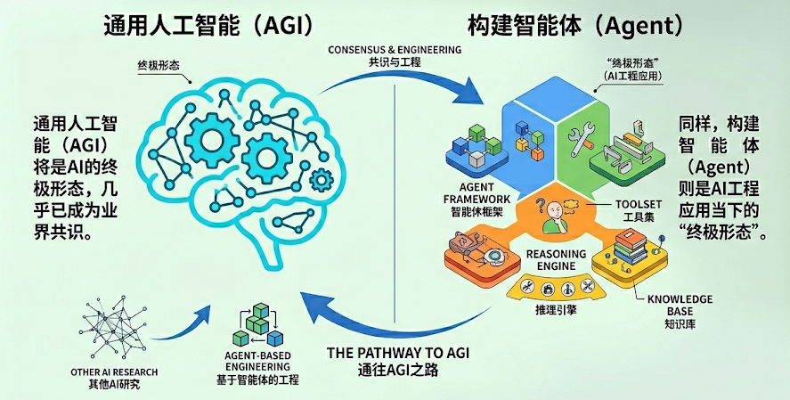

### 1.1 什么是Agent？
在大模型应用开发中，智能体通常指一种以 大语言模型为推理与决策核心 ，结合 记忆 、 工具调用 与
环境交互能力，能够进行 规划决策 并执行 复杂任务 以达成目标的软件系统。
**Agent的关键能力**
理解用户问题
如何 拆解任务
判断 是否需要工具
需要 调用哪些工具
如何利用好 工具结果 生成回答&推进任务
### 1.3 Agent的核心组件
前面讲过现在AI Agent的架构：

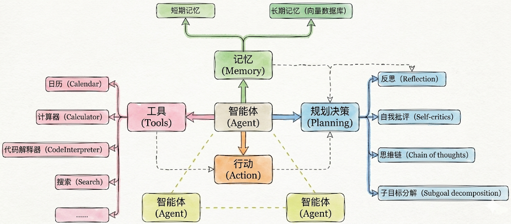

实际开发中几个要素并不需要同时出现，一句话总结
必须的：**行动**（Action）
几乎总是存在的：**工具**（Tool）
有条件存在的：**规划决策**（Planning）
最容易被省略的：**记忆**（Memory）
### 1.4 Agent创建与调用
#### 1.4.1 历史上的调用
在 LangChain 0.x 时代，框架内的 Agent 系统经历了“碎片化”阶段。当时的设计理念是 **“针对场景设计**
**特定** **Agent”**：
如果你要实现思维链推理（ReAct），就用 create_react_agent ；
如果需要结构化输出，就用 create_structured_chat_agent ；
要工具调用，则用 create_tool_calling_agent 。
举例：❌ v0.x 的复杂方式
~~~python
1 # 需要多个步骤
2 from langchain_openai import ChatOpenAI
3 from langchain.agents import AgentExecutor, create_react_agent
4 from langchain_core.prompts import PromptTemplate
5
6 # 1. 模型初始化
7 model = ChatOpenAI(model="gpt-4o-mini")
8
9 # 2. 创建提示词模板
10 prompt = PromptTemplate.from_template("""
11 You are a helpful assistant.
12
13 Tools: {tools}
14 Tool Names: {tool_names}
15
16 {agent_scratchpad}
17 """)
18
19 # 3. 创建 agent
20 agent = create_react_agent(
21 llm=model,
22 tools=tools,
~~~

~~~text
23 prompt=prompt
24 )
25
26 # 4. 创建 executor
27 executor = AgentExecutor(
28 agent=agent,
29 tools=tools,
30 verbose=True
31 )
32
33 # 5. 调用
34 result = executor.invoke({"input": "问题"})
35
~~~

这种方式灵活，但也带来了三个明显问题：
1. **心智负担高**——每种 Agent 都要单独记忆 API 与参数；
2. **可组合性差**——多个 Agent 之间无法统一调度；
3. **生态碎片化**——不同模块难以复用或协同演化。
#### 1.4.2 全新的调用
LangChain 在 1.0 版本后，团队做出了彻底重构：将所有 Agent 的创建方式**统一为一个入口：**
**create_agent()**。它取代了旧版本中的 create_react_agent 、 create_json_agent 、
create_tool_calling_agent 等多种分支函数，真正让开发者用一行代码即可创建任何类型的智能体。
同时在底层通过“中间件机制（Middleware）”和“标准模型接口（invoke / stream）”实现全局统一。这
让框架更轻、更稳，也更易于被集成到其他 Agent 平台中。
举例：✅ v1.x 的简洁方式：
~~~python
1 from langchain.chat_models import init_chat_model
2 from langchain.agents import create_agent
3
4 # 1. 初始化模型
5 model = init_chat_model("gpt-4o-mini", model_provider="openai")
6
7 # 2. 创建 agent（一步完成）
8 agent = create_agent(
9 model=model,
10 tools=[tool1, tool2],
11 system_prompt="Agent 的行为指令" # 可选
12 )
13
14 # 3. 调用
15 result = agent.invoke({
16 "messages": [{"role": "user", "content": "问题"}]
17 })
~~~

## 2、Agent的基本用法1：模型的传入方式
在 LangChain 1.2 中， create_agent 是构建智能体的核心方式，底层基于 LangGraph 实现。
**create_agent** **完整参数：**

~~~python
1 from langchain.agents import create_agent
2
3 agent = create_agent(
4 model: str | BaseChatModel, # 必需：聊天模型
5 tools: List[BaseTool], # 必需：工具列表
6 *,
7 system_prompt: str = "", # 系统提示词
8 middleware: Seguence[AgentMiddleware[StateT_co, ContextT]] = () # 中间件
9 interrupt_before: List[str] = None, # 在某些工具前暂停（人机协作）
10 interrupt_after: List[str] = None, # 在某些工具后暂停
11 debug: bool = False # 调试模式
12 name: str 丨 None = None, # 设置模型名称
13 )
~~~

Agent在创建时，涉及到 模型(Agent使用的模型) 、 可调用工具 、 系统提示词 等参数的设置。
更多参数参考：https://reference.langchain.com/python/langchain/agents/factory/create_agent
**Agent中模型的传入方式：**
本节我们只关注模型的传入。
模型是 Agent 的“大脑”，负责决策和推理。根据模型传入agent方式的不同，分为两种方式。
### 2.1 传入模型字符串
Agent根据传入的模型字符串，自主创建模型对象
~~~python
1 from langchain.agents import create_agent
2
3 from dotenv import load_dotenv
4
5 load_dotenv(override=True)
6
7 agent = create_agent("deepseek-v4-flash")
8 print(type(agent))
9
10 from IPython.display import Image, display
11 display(Image(agent.get_graph().draw_mermaid_png()))
~~~

输出
~~~html
1 <class 'langgraph.graph.state.CompiledStateGraph'>
~~~

由上可知，agent本质上是LangGraph的**CompiledStateGraph**实例，底层实现是一个图结构。
通过上述代码最后一行可以看到agent的图结构。
### 2.2 传入模型对象
~~~python
1 from langchain.chat_models import init_chat_model
2 from langchain.agents import create_agent
3 from langchain_deepseek import ChatDeepSeek
4 from dotenv import load_dotenv
5 import os
6 load_dotenv(override=True)
7
8 # 以ChatDeepSeek为例
9 # model = ChatDeepSeek(model="deepseek-v4-flash")
10
11 # 以init_chat_model为例
12 model = init_chat_model(
13 model="gpt-5.4-mini",
14 model_provider="openai",
15 api_key=os.getenv("CLOSEAI_API_KEY"),
16 base_url=os.getenv("CLOSEAI_BASE_URL")
17 )
18
19
20 agent = create_agent(model)
21
22 print(type(agent))
23
24 from IPython.display import Image, display
25 display(Image(agent.get_graph().draw_mermaid_png()))
~~~

输出同上
~~~html
1 <class 'langgraph.graph.state.CompiledStateGraph'>
~~~

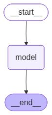

## 3、Agent的基本用法2：如何调用Agent
agent.invoke() 是Agent 最基本的同步调用方法，它会阻塞程序执行直到返回最终结果。具体的：
**输入：**传入的参数为字典类型，字典内通过 messages字段传递消息列表 。即：“ {"messages":
[{"role": "...", "content": "..."}]} ”
**输出：**通过invoke调用Agent，底层可能会经历多轮交互，返回的是完整的 消息列表 ，被封装在
字典中，是 messages字段的值 。
~~~text
1 response = agent.invoke({"messages": [...]})
2
3 # response 是字典类型
4 {
5 "messages": [
6 HumanMessage(...), # 用户问题
7 AIMessage(...), # AI 工具调用
8 ToolMessage(...), # 工具返回结果
9 AIMessage(...) # 最终回答 ← 通常取这个
10 ]
11 }
12
13 # 获取最终回答
14 final_answer = response['messages'][-1].content
~~~

举例1：
~~~python
1 from langchain.agents import create_agent
2 from langchain.chat_models import init_chat_model
3 from dotenv import load_dotenv
4 import os
5 load_dotenv(override=True)
6 from rich import print as rprint
7
8 # 以init_chat_model为例
9 model = init_chat_model(
10 model="gpt-5.4-mini",
~~~

~~~python
11 model_provider="openai",
12 api_key=os.getenv("CLOSEAI_API_KEY"),
13 base_url=os.getenv("CLOSEAI_BASE_URL")
14 )
15
16 agent = create_agent(model=model)
17
18 response = agent.invoke({"messages": ["你好"]}) # 默认是HumanMessage
19 print(type(response))
20 rprint(response)
~~~

输出如下
~~~text
1 {
2 'messages': [
3 HumanMessage(
4 content='你好',
5 additional_kwargs={},
6 response_metadata={},
7 id='93ffcb22-179a-4cab-81a7-a3bd3a1795d4'
8 ),
9 AIMessage(
10 content='你好！有什么我可以帮你的吗？',
11 additional_kwargs={'refusal': None},
12 response_metadata={
13 'token_usage': {
14 'completion_tokens': 13,
15 'prompt_tokens': 7,
16 'total_tokens': 20,
17 'completion_tokens_details': {
18 'accepted_prediction_tokens': 0,
19 'audio_tokens': 0,
20 'reasoning_tokens': 0,
21 'rejected_prediction_tokens': 0
22 },
23 'prompt_tokens_details': {'audio_tokens': 0,
'cached_tokens': 0},
24 'latency_checkpoint': {
25 'engine_tbt_ms': 3,
26 'engine_ttft_ms': 48,
27 'engine_ttlt_ms': 90,
28 'pre_inference_ms': 95,
29 'service_tbt_ms': 4,
30 'service_ttft_ms': 673,
31 'service_ttlt_ms': 712,
32 'total_duration_ms': 626,
33 'user_visible_ttft_ms': 578
34 }
35 },
36 'model_provider': 'openai',
37 'model_name': 'gpt-5.4-mini-2026-03-17',
38 'system_fingerprint': None,
39 'id': 'chatcmpl-DlUJdEGrlJtKPHQ9wgdp1KsrEjIDc',
40 'service_tier': 'default',
41 'finish_reason': 'stop',
42 'logprobs': None
43 },
~~~

~~~text
44 id='lc_run--019e7ccd-c08b-7f60-8b07-32324cccf2c2-0',
45 tool_calls=[],
46 invalid_tool_calls=[],
47 usage_metadata={
48 'input_tokens': 7,
49 'output_tokens': 13,
50 'total_tokens': 20,
51 'input_token_details': {'audio': 0, 'cache_read': 0},
52 'output_token_details': {'audio': 0, 'reasoning': 0}
53 }
54 )
55 ]
56 }
~~~

举例2：
invoke调用的核心就是输入一系列消息（messages），每条消息通常包含 role（如 "user", "assistant",
"system", "tool"）和 "content"。
我们也可以在message列表的开头加入"system"角色的消息来定义Agent的行为。
~~~python
1 from langchain.agents import create_agent
2 from langchain.chat_models import init_chat_model
3 from dotenv import load_dotenv
4 import os
5 load_dotenv(override=True)
6 from rich import print as rprint
7
8 # 以init_chat_model为例
9 model = init_chat_model(
10 model="gpt-5.4-mini",
11 model_provider="openai",
12 api_key=os.getenv("CLOSEAI_API_KEY"),
13 base_url=os.getenv("CLOSEAI_BASE_URL")
14 )
15
16 agent = create_agent(model)
17
18 resp = agent.invoke( {
19 "messages": [
20 {"role": "system", "content": "你是一个小学数学老师，耐心，幽默，讲解深入浅
出"},
21 {"role": "user", "content": "100加上50等于多少？"}
22 ]
23 })
24
25 rprint(resp)
1 {
2 'messages': [
3 SystemMessage(
4 content='你是一个小学数学老师，耐心，幽默，讲解深入浅出',
5 additional_kwargs={},
6 response_metadata={},
7 id='6e02c29f-0360-499a-9d31-f6fcf5921310'
8 ),
9 HumanMessage(
~~~

~~~text
10 content='100加上50等于多少？',
11 additional_kwargs={},
12 response_metadata={},
13 id='7a70d206-28d9-4081-9bb3-2f387aba2fd3'
14 ),
15 AIMessage(
16 content='100 加上 50 等于 **150**。 \n\n可以这样想： \n- 100 是
1 个百 \n- 再加 50，也就是 5 个十
17 \n- 合起来就是 **150**\n\n如果你愿意，我还可以教你怎么用“数数法”快速算这种题。',
18 additional_kwargs={'refusal': None},
19 response_metadata={
20 'token_usage': {
21 'completion_tokens': 71,
22 'prompt_tokens': 36,
23 'total_tokens': 107,
24 'completion_tokens_details': {
25 'accepted_prediction_tokens': 0,
26 'audio_tokens': 0,
27 'reasoning_tokens': 0,
28 'rejected_prediction_tokens': 0
29 },
30 'prompt_tokens_details': {'audio_tokens': 0,
'cached_tokens': 0},
31 'latency_checkpoint': {
32 'engine_tbt_ms': 6,
33 'engine_ttft_ms': 33,
34 'engine_ttlt_ms': 426,
35 'pre_inference_ms': 75,
36 'service_tbt_ms': 6,
37 'service_ttft_ms': 253,
38 'service_ttlt_ms': 638,
39 'total_duration_ms': 572,
40 'user_visible_ttft_ms': 178
41 }
42 },
43 'model_provider': 'openai',
44 'model_name': 'gpt-5.4-mini-2026-03-17',
45 'system_fingerprint': None,
46 'id': 'chatcmpl-DlUOHPXmUQEGFyu46rJf2kmbbjWrG',
47 'service_tier': 'default',
48 'finish_reason': 'stop',
49 'logprobs': None
50 },
51 id='lc_run--019e7cd2-260e-7ae0-a8c0-e247fbdf767e-0',
52 tool_calls=[],
53 invalid_tool_calls=[],
54 usage_metadata={
55 'input_tokens': 36,
56 'output_tokens': 71,
57 'total_tokens': 107,
58 'input_token_details': {'audio': 0, 'cache_read': 0},
59 'output_token_details': {'audio': 0, 'reasoning': 0}
60 }
61 )
62 ]
63 }
~~~

## 4、Agent的基本用法3：绑定工具
只有接入了一些工具，create_agent完成Agent创建才算完整。
Agent支持 静态 和 动态 绑定工具，后者需要用到**中间件**，后面会讲。在执行时：
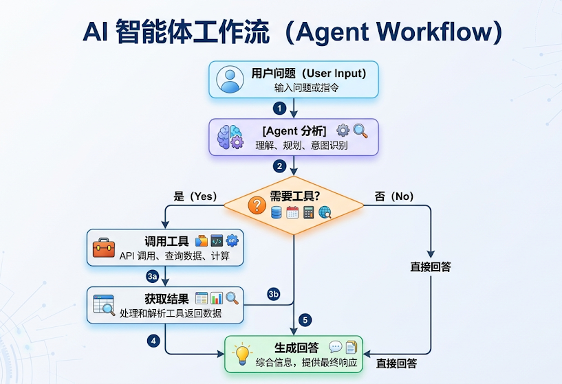

这里的工具可以是LangChain内置的，也可以是自定义的。LangChain生态中已经内置集成了非常多的
实用工具，开发者可以快速调用这些工具完成更加复杂工作流的开发。
LangChain内置工具列表：https://docs.langchain.com/oss/python/integrations/tools
其中典型的工具如下：

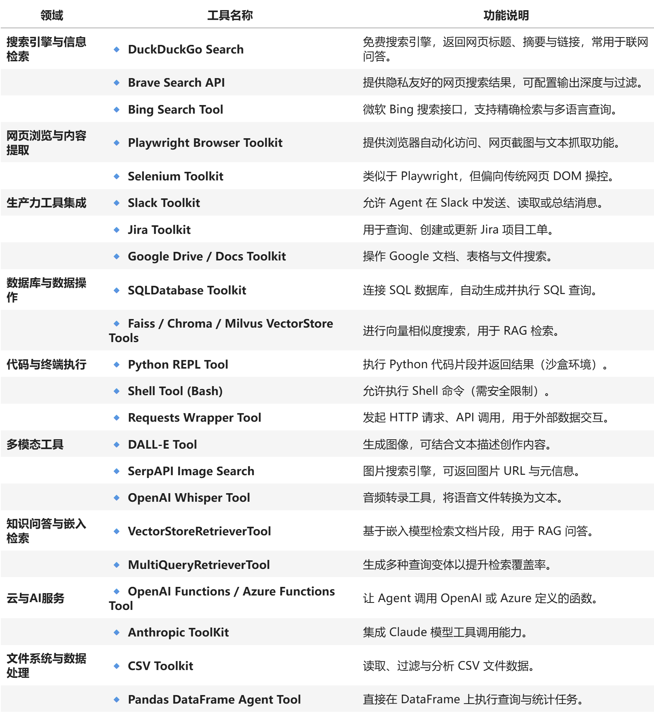

### 4.1 基本用法
Agents支持绑定一或多个工具。
**举例1：绑定一个工具**
调用查询天气工具进行天气查询
~~~python
1 from langchain.agents import create_agent
2 from langchain.tools import tool
3 from rich import print as rprint
4
5
6 @tool(parse_docstring=True)
7 def get_weather(city: str) -> str:
8 """
~~~

9 天气查询工具
~~~yaml
10
11 Args:
12 city: 城市名称
13 """
~~~

~~~text
14 return f"{city}的天气为晴朗，25°C。"
15
16
17 agent = create_agent(
18 model = model,
19 tools=[get_weather]
20 )
21
22 resp = agent.invoke( {
23 "messages": [
24 {"role": "system", "content": "你是一个天气查询助手，只回答天气相关的问题，
~~~

其他问题请直接回答：我不清楚这问题答案。"},
~~~python
25 {"role": "user", "content": "北京的天气怎么样？"}
26 # {"role": "user", "content": "100加上50等于多少？"}
27 ]
28 })
29
30 rprint(resp)
~~~

以上代码运行结果如下：
~~~text
1 {
2 'messages': [
3 SystemMessage(
4 content='你是一个天气查询助手，只回答天气相关的问题，其他问题请直接回
~~~

答：我不清楚这问题答案。',
~~~text
5 additional_kwargs={},
6 response_metadata={},
7 id='6f754fe0-7cd2-4e6b-a3a0-7592a71a7d20'
8 ),
9 HumanMessage(
10 content='北京的天气怎么样？',
11 additional_kwargs={},
12 response_metadata={},
13 id='ecf89457-2901-41d3-b960-ac8f7484d48e'
14 ),
15 AIMessage(
16 content='',
17 additional_kwargs={'refusal': None},
18 response_metadata={
19 'token_usage': {
20 'completion_tokens': 18,
21 'prompt_tokens': 162,
22 'total_tokens': 180,
23 'completion_tokens_details': {
24 'accepted_prediction_tokens': 0,
25 'audio_tokens': 0,
26 'reasoning_tokens': 0,
27 'rejected_prediction_tokens': 0
28 },
29 'prompt_tokens_details': {'audio_tokens': 0,
'cached_tokens': 0},
30 'latency_checkpoint': {
31 'engine_tbt_ms': 3,
32 'engine_ttft_ms': 48,
33 'engine_ttlt_ms': 110,
34 'pre_inference_ms': 102,
~~~

~~~text
35 'service_tbt_ms': 4,
36 'service_ttft_ms': 312,
37 'service_ttlt_ms': 368,
38 'total_duration_ms': 274,
39 'user_visible_ttft_ms': 210
40 }
41 },
42 'model_provider': 'openai',
43 'model_name': 'gpt-5.4-mini-2026-03-17',
44 'system_fingerprint': None,
45 'id': 'chatcmpl-DlavpIfl1rVj1nwpU8F39s8IAkexg',
46 'service_tier': 'default',
47 'finish_reason': 'tool_calls',
48 'logprobs': None
49 },
50 id='lc_run--019e7e51-d485-7331-aa8b-cf03d9e23d7f-0',
51 tool_calls=[
52 {
53 'name': 'get_weather',
54 'args': {'city': '北京'},
55 'id': 'call_4dp4PGy6Ghaj5m6WcNkrwKFe',
56 'type': 'tool_call'
57 }
58 ],
59 invalid_tool_calls=[],
60 usage_metadata={
61 'input_tokens': 162,
62 'output_tokens': 18,
63 'total_tokens': 180,
64 'input_token_details': {'audio': 0, 'cache_read': 0},
65 'output_token_details': {'audio': 0, 'reasoning': 0}
66 }
67 ),
68 ToolMessage(
69 content='北京的天气为晴朗，25°C。',
70 name='get_weather',
71 id='b5b82403-973c-463b-b9f2-2aa76e0bff77',
72 tool_call_id='call_4dp4PGy6Ghaj5m6WcNkrwKFe'
73 ),
74 AIMessage(
75 content='北京天气晴朗，25°C。',
76 additional_kwargs={'refusal': None},
77 response_metadata={
78 'token_usage': {
79 'completion_tokens': 12,
80 'prompt_tokens': 200,
81 'total_tokens': 212,
82 'completion_tokens_details': {
83 'accepted_prediction_tokens': 0,
84 'audio_tokens': 0,
85 'reasoning_tokens': 0,
86 'rejected_prediction_tokens': 0
87 },
88 'prompt_tokens_details': {'audio_tokens': 0,
'cached_tokens': 0},
89 'latency_checkpoint': {
90 'engine_tbt_ms': 3,
91 'engine_ttft_ms': 34,
~~~

~~~text
92 'engine_ttlt_ms': 71,
93 'pre_inference_ms': 94,
94 'service_tbt_ms': 3,
95 'service_ttft_ms': 272,
96 'service_ttlt_ms': 303,
97 'total_duration_ms': 219,
98 'user_visible_ttft_ms': 178
99 }
100 },
101 'model_provider': 'openai',
102 'model_name': 'gpt-5.4-mini-2026-03-17',
103 'system_fingerprint': None,
104 'id': 'chatcmpl-Dlavq02DEdjb4JOBx3MTblngJKbTQ',
105 'service_tier': 'default',
106 'finish_reason': 'stop',
107 'logprobs': None
108 },
109 id='lc_run--019e7e51-d9d7-7e81-bed0-cc990abfa293-0',
110 tool_calls=[],
111 invalid_tool_calls=[],
112 usage_metadata={
113 'input_tokens': 200,
114 'output_tokens': 12,
115 'total_tokens': 212,
116 'input_token_details': {'audio': 0, 'cache_read': 0},
117 'output_token_details': {'audio': 0, 'reasoning': 0}
118 }
119 )
120 ]
121 }
~~~

进一步：
~~~python
1 from IPython.display import Image, display
2
3 display(Image(agent.get_graph().draw_mermaid_png()))
~~~

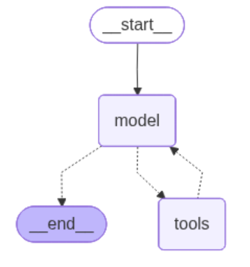

**举例2：接入内置工具**
绑定内置的TavilySearch搜索工具，可以借助Tavily进行网络搜索和信息爬取。
这里我们需要先在tavily官网注册并获得API-KEY（每月有免费额度）：https://www.tavily.com/。
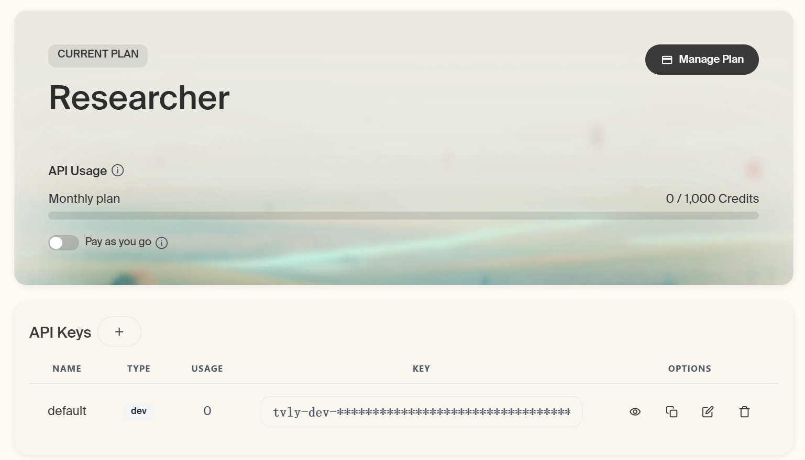

然后将API-KEY写到本地.env中的 TAVILY_API_KEY 变量中，即可进行调用了。

~~~python
1 from langchain_tavily import TavilySearch
2 from dotenv import load_dotenv
3 import os
4
5 load_dotenv(override=True)
6
7 web_search = TavilySearch(
8 tavily_api_key=os.getenv("TAVILY_API_KEY"),
9 max_results=2
10 )
11
~~~

12 #这是一个高度封装的网络搜索工具，可以直接调用：
~~~text
13 web_search.invoke("请问2026年足球世界杯有哪些参赛队？")
1 {'query': '请问2026年足球世界杯有哪些参赛队？',
2 'follow_up_questions': None,
3 'answer': None,
4 'images': [],
5 'results': [{'url': 'https://www.instagram.com/p/DWk8mU-geNg',
6 'title': '你準備好了嗎？ 2026 FIFA世界盃™ 48支隊伍全數到齊 ... - Instagram',
7 'content': '本屆賽事由美國、加拿大、墨西哥三國聯合主辦，總共48 支球隊、104 場比
~~~

賽、39 天賽程，這次的世界盃賽程本身就是前所未見的規模。',
~~~text
8 'score': 0.9974885,
9 'raw_content': None},
10 {'url': 'https://zh.wikipedia.org/zh-
hans/2026%E5%B9%B4%E5%9C%8B%E9%9A%9B%E8%B6%B3%E5%8D%94%E4%B8%96%E7%95%8
C%E7%9B%83%E5%A4%96%E5%9C%8D%E8%B3%BD',
11 'title': '2026年国际足联世界杯预选赛 - 维基百科',
12 'content': '2026年国际足联世界杯预选赛是一项国家队足球预选赛赛事，以决定出哪些球队
~~~

能够参与由加拿大、墨西哥和美国联合举办的2026年国际足联世界杯。本届世界杯决赛周名额
~~~text
增',
13 'score': 0.9974291,
14 'raw_content': None}],
15 'response_time': 0.79,
16 'request_id': 'dc00f93f-1b75-4222-86cc-4b6af567edf1'}
~~~

可以直接带入create_agent中作为外部工具。
~~~python
1 from langchain.chat_models import init_chat_model
2 from langchain.agents import create_agent
3 from langchain_tavily import TavilySearch
4 from dotenv import load_dotenv
5 import os
6 load_dotenv(override=True)
7 from rich import print as rprint
8
9 # 1.模型初始化
10 model = init_chat_model(
11 model="gpt-5.4-mini",
12 model_provider="openai",
13 api_key=os.getenv("CLOSEAI_API_KEY"),
14 base_url=os.getenv("CLOSEAI_BASE_URL")
15 )
16 # 2.工具实例化
17 web_search = TavilySearch(max_results=2)
18
~~~

~~~python
19 # 3.创建Agent
20 agent = create_agent(
21 model=model,
22 tools=[web_search],
23 #system_prompt="你是一名多才多艺的智能助手，可以调用工具帮助用户解决问题。"
24 )
25
26 # 4.运行Agent获得结果
27 result = agent.invoke(
28 {"messages": [{"role": "user", "content": "请帮我查询2024年诺贝尔物理学奖得主
是谁？"}]}
29 )
30
31 # rprint(result)
32 print(result['messages'][-1].content)
1 2024年诺贝尔物理学奖得主是：
2
3 - **John J. Hopfield**
4 - **Geoffrey E. Hinton**
5
~~~

6 授奖理由是：**“为实现机器学习的人工神经网络奠定基础性的发现和发明”**。
如果仔细观察本次运行过程，本次工具调用仍然是一次典型的Function calling执行流程，包括用户首次
发起消息在内，总共创建了4条消息，分别是human message、ai message (涉及function call
message）、tool message（涉及function response message）以及ai message（涉及final
responses）。
一次完整的 Function calling 执行流程如下：
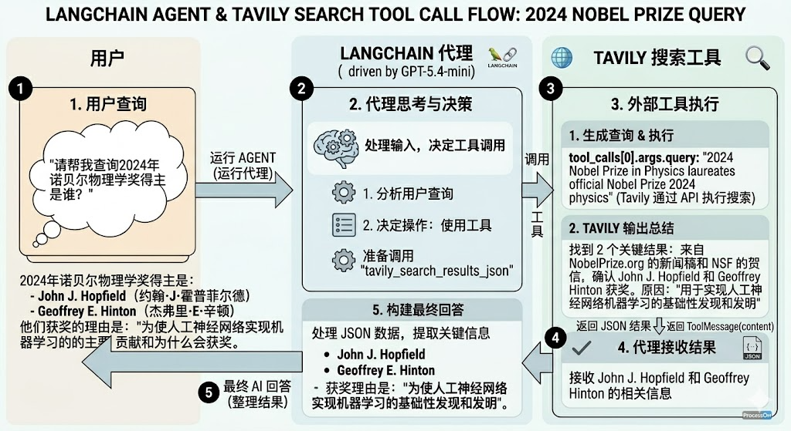

**举例3：绑定多个工具**
~~~python
1 from langchain.agents import create_agent
2 from langchain.tools import tool
3 from dotenv import load_dotenv
4 from rich import print as rprint
~~~

~~~python
5
6 load_dotenv()
7
8 @tool(parse_docstring=True)
9 def get_weather(city: str):
10 """
11 天气查询工具
12
13 Args:
14 city: 城市名称
15 """
16 return f"{city}今天天气挺好"
17
18 @tool(parse_docstring=True)
19 def get_news():
20 """
21 新闻查询工具
22 """
~~~

23 return "近期，受全球储蓄芯片短缺等多重因素影响，多地回收商称废旧手机回收市场迎来“火热
潮”，回收价格普遍上涨，旧手机成“香饽饽”。"
~~~python
24
25 agent = create_agent(
26 model,
27 tools=[get_weather, get_news]
28 )
29 response = agent.invoke({
30 "messages": ["你好，杭州今天的天气如何？今天有哪些新闻？"]
31 })
32
33 rprint(response)
34
~~~

输出
~~~text
1 {
2 'messages': [
3 HumanMessage(
4 content='你好，杭州今天的天气如何？今天有哪些新闻？',
5 additional_kwargs={},
6 response_metadata={},
7 id='6f69ed6d-76fe-4d1d-9e31-c00a4bedf623'
8 ),
9 AIMessage(
10 content='',
11 additional_kwargs={'refusal': None},
12 response_metadata={
13 'token_usage': {
14 'completion_tokens': 46,
15 'prompt_tokens': 152,
16 'total_tokens': 198,
17 'completion_tokens_details': {
18 'accepted_prediction_tokens': 0,
19 'audio_tokens': 0,
20 'reasoning_tokens': 0,
21 'rejected_prediction_tokens': 0
22 },
~~~

~~~text
23 'prompt_tokens_details': {'audio_tokens': 0,
'cached_tokens': 0},
24 'latency_checkpoint': {
25 'engine_tbt_ms': 4,
26 'engine_ttft_ms': 32,
27 'engine_ttlt_ms': 197,
28 'pre_inference_ms': 90,
29 'service_tbt_ms': 4,
30 'service_ttft_ms': 272,
31 'service_ttlt_ms': 429,
32 'total_duration_ms': 348,
33 'user_visible_ttft_ms': 182
34 }
35 },
36 'model_provider': 'openai',
37 'model_name': 'gpt-5.4-mini-2026-03-17',
38 'system_fingerprint': None,
39 'id': 'chatcmpl-DlcRS3bbpm4iVX6laeXtWj2vYnYMm',
40 'service_tier': 'default',
41 'finish_reason': 'tool_calls',
42 'logprobs': None
43 },
44 id='lc_run--019e7eaa-6712-7323-91e6-8af52084b894-0',
45 tool_calls=[
46 {
47 'name': 'get_weather',
48 'args': {'city': '杭州'},
49 'id': 'call_w9ARuAgN8iqfG2GR7gv00iBq',
50 'type': 'tool_call'
51 },
52 {'name': 'get_news', 'args': {}, 'id':
'call_vOLekRymIme8bWuVQdIew4vu', 'type': 'tool_call'}
53 ],
54 invalid_tool_calls=[],
55 usage_metadata={
56 'input_tokens': 152,
57 'output_tokens': 46,
58 'total_tokens': 198,
59 'input_token_details': {'audio': 0, 'cache_read': 0},
60 'output_token_details': {'audio': 0, 'reasoning': 0}
61 }
62 ),
63 ToolMessage(
64 content='杭州今天天气挺好',
65 name='get_weather',
66 id='21da1cc4-1d26-4d5b-a04a-a836644274fc',
67 tool_call_id='call_w9ARuAgN8iqfG2GR7gv00iBq'
68 ),
69 ToolMessage(
70 content='近期，受全球储蓄芯片短缺等多重因素影响，多地回收商称废旧手机回
~~~

收市场迎来“火热潮”，回收价格普遍
~~~text
71 上涨，旧手机成“香饽饽”。',
72 name='get_news',
73 id='d1fd947b-3d0f-47f5-9942-c4330f4d7fc6',
74 tool_call_id='call_vOLekRymIme8bWuVQdIew4vu'
75 ),
76 AIMessage(
77 content='杭州今天天气挺好。\n\n今天的新闻：\n1.
~~~

78 近期受全球储蓄芯片短缺等多重因素影响，多地回收商称废旧手机回收市场迎来“火热潮”，回收
价格普遍上涨，旧手机成了“香饽饽
~~~python
79 ”。\n\n如果你愿意，我也可以帮你继续整理成“天气 + 新闻摘要”的简版。',
80 additional_kwargs={'refusal': None},
81 response_metadata={
82 'token_usage': {
83 'completion_tokens': 91,
84 'prompt_tokens': 272,
85 'total_tokens': 363,
86 'completion_tokens_details': {
87 'accepted_prediction_tokens': 0,
88 'audio_tokens': 0,
89 'reasoning_tokens': 0,
90 'rejected_prediction_tokens': 0
91 },
92 'prompt_tokens_details': {'audio_tokens': 0,
'cached_tokens': 0},
93 'latency_checkpoint': {
94 'engine_tbt_ms': 5,
95 'engine_ttft_ms': 38,
96 'engine_ttlt_ms': 466,
97 'pre_inference_ms': 83,
98 'service_tbt_ms': 5,
99 'service_ttft_ms': 265,
100 'service_ttlt_ms': 686,
101 'total_duration_ms': 610,
102 'user_visible_ttft_ms': 183
103 }
104 },
105 'model_provider': 'openai',
106 'model_name': 'gpt-5.4-mini-2026-03-17',
107 'system_fingerprint': None,
108 'id': 'chatcmpl-DlcRTgUZZHsugIYnroPNDk3PXXQwW',
109 'service_tier': 'default',
110 'finish_reason': 'stop',
111 'logprobs': None
112 },
113 id='lc_run--019e7eaa-6cac-7901-b58c-d677bf6135be-0',
114 tool_calls=[],
115 invalid_tool_calls=[],
116 usage_metadata={
117 'input_tokens': 272,
118 'output_tokens': 91,
119 'total_tokens': 363,
120 'input_token_details': {'audio': 0, 'cache_read': 0},
121 'output_token_details': {'audio': 0, 'reasoning': 0}
122 }
123 )
124 ]
125 }
1 from IPython.display import Image, display
2
3 display(Image(agent.get_graph().draw_mermaid_png()))
~~~

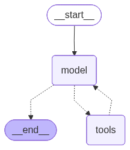

注意：只给 Agent 需要的工具，工具太多会混淆。一般2-5 个工具最佳
### 4.2 工具调用流程分析
LangChain 的 Agent 会将 模型 与 工具 结合起来，在实现上由一个基于 LangGraph 的图结构来编排执
行流程，如下所示。
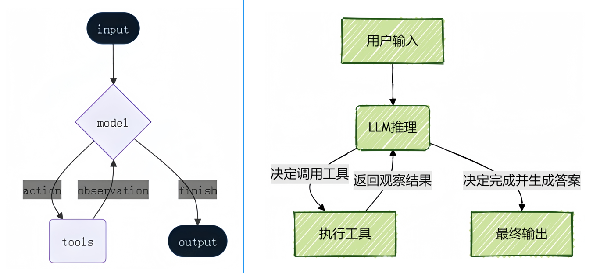

这与前文得到的 Agent 图结构是一致的，本质上就是经典的 **ReAct** **结构**：一个具备“ 思考-行动-观察 ”
不断循环的自主工作者。
~~~text
1 用户问题 → AI 思考 → 调用工具 → 观察结果 → 继续思考 → ... → 最终答案
~~~

当用户提出一个复杂需求时，Agent会像人类一样，先理解任务、规划步骤、使用合适的工具（如搜索
网络、查询数据库、执行计算）获取信息，Agent 会在一个循环中 反复调用模型和工具 ，直到某次模
型输出中 不再包含工具调用 则结束，最后综合所有信息给出最终答案。
完整流程：

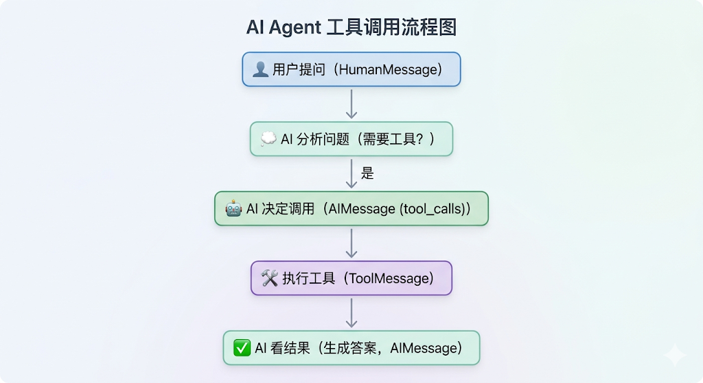

**举例：用户问题：“找出当前最流行的无线耳机并检查库存”的任务。**
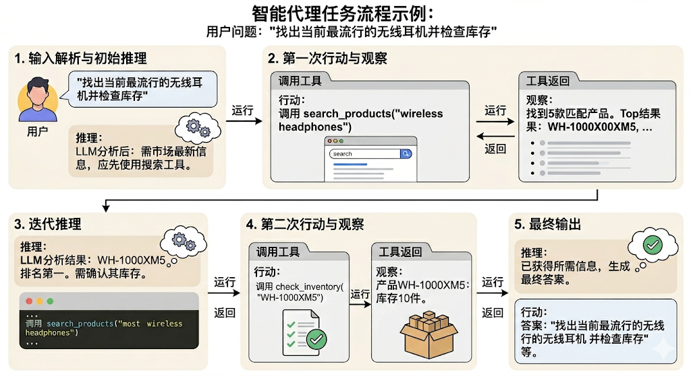

1、输入解析与初始推理
输入：用户查询：“找出当前最流行的无线耳机并检查库存”。
推理：LLM分析任务后认为：“要找出‘最流行’的产品，需要最新的市场信息，我应该先使用搜索工
具。”
2、第一次行动(action)与观察(observation)
行动：Agent调用 search_products工具 ，参数为“wireless headphones”。
观察：工具返回结果：“找到5款匹配产品。Top结果：WH-1000XM5, ...”
3、迭代推理
推理：LLM根据搜索结果分析：“WH-1000XM5是排名第一的型号。现在需要确认其库存状态才能
回答用户问题。”
4、第二次行动(action)与观察(observation)
行动：Agent调用 check_inventory工具 ，参数为“WH-1000XM5”。

观察：工具返回：“产品WH-1000XM5：库存10件。”
5、最终输出
推理：LLM综合所有信息后认为：“已获得所需信息，可以生成最终答案。”
行动：模型生成最终答案，不再调用工具。
### 4.3 重试机制
Agent可以在工具调用结果不满足要求时，自主重试。
~~~python
1 from langchain.agents import create_agent
2 from langchain.tools import tool
3 from langchain.messages import SystemMessage, HumanMessage
4 from dotenv import load_dotenv
5 from rich import print as rprint
6
7 load_dotenv(override=True)
8
9 flag = 0
10
11 @tool
12 def get_weather(city: str):
13 """
14 天气查询工具
15
16 Args:
17 city: 城市名称
18 """
19 global flag
20 flag += 1
21
22 if flag < 3:
23 # raise Exception("暂时无法访问")
24 return "TEMP_UNAVAILABLE: 天气服务暂时不可用，请稍后重试"
25
26 return f"{city}今天天气挺好"
27
28
29 messages = [
30 SystemMessage("""
~~~

31 你是一个天气助手。
~~~text
32 当工具返回以 'TEMP_UNAVAILABLE:' 开头的结果时，
~~~

33 说明是临时故障，不要立即放弃；
34 你应再次调用同一个工具，最多重试 3 次。
35 如果 3 次后仍失败，再向用户说明服务暂时不可用。
~~~python
36 """),
37 HumanMessage("你好，杭州今天的天气如何？")
38 ]
39 agent = create_agent(model, tools=[get_weather])
40 response = agent.invoke({"messages": messages})
41
42 # rprint(response)
43
44 for msg in response["messages"]:
45 msg.pretty_print()
~~~

输出
~~~text
1 ================================ System Message
================================
2
3
~~~

4 你是一个天气助手。
~~~text
5 当工具返回以 'TEMP_UNAVAILABLE:' 开头的结果时，
~~~

6 说明是临时故障，不要立即放弃；
7 你应再次调用同一个工具，最多重试 3 次。
8 如果 3 次后仍失败，再向用户说明服务暂时不可用。
~~~text
9
10 ================================ Human Message
=================================
11
~~~

12 你好，杭州今天的天气如何？
~~~yaml
13 ================================== Ai Message
==================================
14 Tool Calls:
15 get_weather (call_cvICuCPSk4U7aWk6YYkAzI5o)
16 Call ID: call_cvICuCPSk4U7aWk6YYkAzI5o
17 Args:
18 city: 杭州
19 ================================= Tool Message
=================================
20 Name: get_weather
21
22 TEMP_UNAVAILABLE: 天气服务暂时不可用，请稍后重试
23 ================================== Ai Message
==================================
24 Tool Calls:
25 get_weather (call_UQL2QTDxKaTCOXbY5Crwbae0)
26 Call ID: call_UQL2QTDxKaTCOXbY5Crwbae0
27 Args:
28 city: 杭州
29 ================================= Tool Message
=================================
30 Name: get_weather
31
32 TEMP_UNAVAILABLE: 天气服务暂时不可用，请稍后重试
33 ================================== Ai Message
==================================
34 Tool Calls:
35 get_weather (call_gZKuGbhp36wEyhjYgeupfu3b)
36 Call ID: call_gZKuGbhp36wEyhjYgeupfu3b
37 Args:
38 city: 杭州
39 ================================= Tool Message
=================================
40 Name: get_weather
41
~~~

42 杭州今天天气挺好
~~~text
43 ================================== Ai Message
==================================
44
~~~

45 杭州今天天气挺好。

模型三次调用 get_weather ，最终获得了满意的结果。
### 4.4 常见问题
**问题1：Agent** **如何选择工具？**
依据 ：工具的 docstring
~~~python
1 @tool
2 def get_weather(city: str) -> str:
3 """获取指定城市的天气信息""" # ← AI Agent读这个！
4 ...
5
6 @tool
7 def calculator(operation: str, a: float, b: float) -> str:
8 """执行基本的数学计算""" # ← AI Agent也读这个！
9 ...
~~~

AI 会根据：
1. 问题内容
2. 每个工具的描述
3. 自动选择最匹配的工具
**问题2：Agent** **为什么没有调用工具？**
原因：
工具的 docstring 不清晰
问题表述不明确
模型认为不需要工具
解决：
~~~python
1 # ❌ 不好
2 @tool
3 def tool1(x: str) -> str:
4 """做一些事情""" # 太模糊
5
6
7 # ✅ 好
8 @tool
9 def get_weather(city: str) -> str:
10 """
~~~

11 获取指定城市的实时天气信息
~~~yaml
12
13 Args:
14 city: 城市名称，如"北京"、"上海"
15 """
~~~

**问题3：Agent** **选错工具？**
原因：
多个工具的功能描述相似

工具太多导致混淆
解决：
只给必要的工具
工具描述要有明确区分
在 system_prompt 中说明工具使用场景
1 # ✅ 好：只给需要的工具
~~~text
2 agent = create_agent(
3 model=model,
4 tools=[get_weather, calculator] # 2-5 个工具最佳
5 )
6
~~~

7 # ❌ 不好：工具太多
~~~text
8 agent = create_agent(
9 model=model,
10 tools=[tool1, tool2, ..., tool20] # 会混淆
11 )
~~~

**问题4：如何知道** **Agent** **何时完成？**
当 AIMessage 不包含 tool_calls 时：
~~~python
1 for msg in response['messages']:
2 if isinstance(msg, AIMessage):
3 if hasattr(msg, 'tool_calls') and msg.tool_calls:
4 print("还在调用工具...")
5 else:
6 print("完成！最终答案：", msg.content)
~~~

**问题5：Agent** **可以调用多少次工具？**
默认没有限制，直到得到最终答案。但可能会：
超时
达到 token 限制
模型决定停止
**问题6：如何限制工具调用次数？**
LangChain 1.0 的 create_agent 默认使用 LangGraph，可以通过配置限制：
1 # 注意：这是高级用法，后续会详细学习
~~~text
2 config = {
3 "recursion_limit": 5 # 最多 5 步
4 }
5
6 response = agent.invoke(input, config=config)
~~~

## 5、Agent的高级用法1：设置Agent名称

创建Agent时，LangChain允许用户指定其名称
### 5.1 用法
~~~python
1 from langchain.agents import create_agent
2 from langchain.chat_models import init_chat_model
3 from dotenv import load_dotenv
4 import os
5 from rich import print as rprint
6
7 # 从.env文件中加载环境变量
8 load_dotenv(override=True)
9
10 model = init_chat_model(
11 model="gpt-5.4-mini",
12 model_provider="openai",
13 api_key=os.getenv("CLOSEAI_API_KEY"),
14 base_url=os.getenv("CLOSEAI_BASE_URL")
15 )
16
17
18 agent = create_agent(
19 model=model,
20 name = "chat_assistant"
21 )
22
23 response = agent.invoke({"messages": ["你好"]})
24
25 # rprint(response)
26
27 for msg in response["messages"]:
28 msg.pretty_print()
~~~

输出
~~~yaml
1 ================================ Human Message
=================================
2
3 你好
4 ================================== Ai Message
==================================
5 Name: chat_assistant
6
~~~

7 你好！有什么我可以帮你的吗？
输出的AI Message带有**Name**信息。
### 5.2 经典使用场景
name 在 Multi-Agent 场景中最常被提及，用于区分不同的 Agent。但它的作用并不局限于多 Agent
编排。在实际工程中，出现如下场景，通常都建议为 Agent 设置一个清晰且稳定的 name 。
**1.** **流式输出归因**
在启用流式输出时，name 可用于 标识当前输出内容来自哪个 Agent 。

这在多 Agent 协作、Agent 嵌套调用，或前端需要实时展示不同执行主体输出时尤其有用，便于准确区
分 token 或事件的来源。
**2.** **消息身份标记**
设置 name 后，Agent 产生的 AIMessage 会携带对应的name信息 。
这使得系统在 保存会话记录 、 回放执行过程 、 构建审计日志 或 前端展示消息角色 时，能够明确识
别消息的生成者。
**3.** **调试与trace可读性**
在调试、日志分析和链路追踪过程中，name 可以作为 Agent 的稳定标识，帮助开发者 快速判断当前执
行的是哪个 Agent 。
当系统中存在多个能力相近的 Agent，或一个 Agent 被嵌套在更复杂的工作流中时，名称能够显著提升
trace 的可读性 和 问题定位 效率。
**4.** **组件化封装**
在工程实践中，Agent 常被封装为可复用的能力模块，例如检索助手、SQL 助手、报告生成助手等。
为 Agent 设置 name ，有助于在模块注册、运行监控、日志归档和能力复用时保持一致的身份标识。
如果后续需要将该 Agent 进一步作为子图节点、工具能力或子模块接入更复杂系统，也能降低维护和迁
移成本。
**5.** **前端展示与运行态可观测性**
在带有可视化界面的应用中，name 还可以直接作为运行时 展示标识 使用。
例如，在执行面板中显示“当前活跃 Agent”“本轮输出来源”或“调用链路中的执行节点”时，name 能帮助
开发者和用户更直观地理解系统当前的执行状态。
**6.** **作为稳定的运行时身份标识**
从更通用的角度看，name 可以理解为 Agent 在系统中的“ 运行时身份 ID ”。
相比临时性的展示名称，一个稳定、规范的 name 更适合用于 日志检索 、 监控统计 、 链路分析 和
跨模块协作 ，因此在生产环境中通常建议显式设置，而不是依赖默认行为。
## 6、Agent的高级用法2：系统提示词
使用 create_agent 创建 Agent 时，需传入 模型 和 工具 、可选地传入 系统提示词 。**提示词为Agent**
**提供了任务背景、行为准则和操作指南。**
系统指令，即SystemMessage，通过 system_prompt 设置，定义 Agent 行为。这个参数可以是 str
或者 SystemMessage类型 。
使用建议：
明确说明 Agent 的角色
定义输出格式
说明何时使用工具
比如：
~~~text
1 agent = create_agent(
2 model=model,
3 tools=[get_weather],
4 system_prompt="""你是天气助手。
5
~~~

6 工作流程：
~~~text
7 1. 理解用户的城市查询
8 2. 使用 get_weather 工具获取数据
9 3. 简洁清晰地回答
10
11 输出格式：
12 - 天气状况
13 - 温度
14 - 注意事项（如有）
15 """
16 )
~~~

提示词设置有两种方式： 静态设置 和 动态设置 。动态设置需要借助**中间件**，后续讲解。
举例1：
~~~python
1 from langchain_tavily import TavilySearch
2 from langchain.agents import create_agent
3 from langchain.chat_models import init_chat_model
4 from dotenv import load_dotenv
5 import os
6 load_dotenv(override=True)
7
8
9 # 1.导入模型
10 model = init_chat_model(
11 model="gpt-5.4-mini",
12 model_provider="openai",
13 api_key=os.getenv("CLOSEAI_API_KEY"),
14 base_url=os.getenv("CLOSEAI_BASE_URL")
15 )
16
17 # 2.导入工具
18 web_search = TavilySearch(max_results=2)
19
20 # 3.创建Agent
21 agent = create_agent(
22 model=model,
23 tools=[web_search],
24 system_prompt="你是一名多才多艺的智能助手，可以调用工具帮助用户解决问题。"
25 )
26
27 # 4.运行Agent获得结果
28 result = agent.invoke(
29 {"messages": [
30 {"role": "user", "content": "请帮我查询2026年足球世界杯是哪个国家举办的？"}
31 ]}
32 )
33
34 print(result['messages'][-1].content)
1 2026年足球世界杯由**三个国家联合举办**：**加拿大、墨西哥和美国**。
~~~

举例2：
~~~python
1 from langchain.agents import create_agent
~~~

~~~python
2 from langchain_core.messages import SystemMessage
3 from langchain_core.tools import tool
4 from rich import print as rprint
5
~~~

6 # 工具：实现两数相加
~~~python
7 @tool
8 def add_numbers(a: int, b: int) -> str:
9 """计算并返回两个数的和。"""
10 return f"和为：{a + b}"
11
12
13 # 创建客服助手Agent
14 agent = create_agent(
15 model=model,
16 tools=[add_numbers], # 工具列表
17 # system_prompt="你是一个数学助手，解决日常的算术问题"
18 system_prompt=SystemMessage(content="你是一个数学助手，解决日常的算术问题")
19 )
20
21 response = agent.invoke(
22 {"messages": [
23 {"role": "user", "content": "10加上20再加上30是多少？"}
24 ]},
25 )
26
27 rprint(response)
28 # print(response["messages"][-1].content)
~~~

结果如下：
~~~text
1 {
2 'messages': [
3 HumanMessage(
4 content='10加上20再加上30是多少？',
5 additional_kwargs={},
6 response_metadata={},
7 id='bd84f000-da12-450c-aeef-0719afcfecfd'
8 ),
9 AIMessage(
10 content='',
11 additional_kwargs={'refusal': None},
12 response_metadata={
13 'token_usage': {
14 'completion_tokens': 22,
15 'prompt_tokens': 158,
16 'total_tokens': 180,
17 'completion_tokens_details': {
18 'accepted_prediction_tokens': 0,
19 'audio_tokens': 0,
20 'reasoning_tokens': 0,
21 'rejected_prediction_tokens': 0
22 },
23 'prompt_tokens_details': {'audio_tokens': 0,
'cached_tokens': 0},
24 'latency_checkpoint': {
25 'engine_tbt_ms': 3,
26 'engine_ttft_ms': 31,
~~~

~~~text
27 'engine_ttlt_ms': 106,
28 'pre_inference_ms': 94,
29 'service_tbt_ms': 4,
30 'service_ttft_ms': 282,
31 'service_ttlt_ms': 352,
32 'total_duration_ms': 267,
33 'user_visible_ttft_ms': 188
34 }
35 },
36 'model_provider': 'openai',
37 'model_name': 'gpt-5.4-mini-2026-03-17',
38 'system_fingerprint': None,
39 'id': 'chatcmpl-DmKgu0QquKeWrXBncvxCak9zkIkEf',
40 'service_tier': 'default',
41 'finish_reason': 'tool_calls',
42 'logprobs': None
43 },
44 id='lc_run--019e88cd-d248-76b0-836c-71c63856787a-0',
45 tool_calls=[
46 {
47 'name': 'add_numbers',
48 'args': {'a': 10, 'b': 20},
49 'id': 'call_PWuscHI7NFdVbAV9wsMzOWKy',
50 'type': 'tool_call'
51 }
52 ],
53 invalid_tool_calls=[],
54 usage_metadata={
55 'input_tokens': 158,
56 'output_tokens': 22,
57 'total_tokens': 180,
58 'input_token_details': {'audio': 0, 'cache_read': 0},
59 'output_token_details': {'audio': 0, 'reasoning': 0}
60 }
61 ),
62 ToolMessage(
63 content='和为：30',
64 name='add_numbers',
65 id='12635dff-6bd8-4325-b64b-bf203d4cacbb',
66 tool_call_id='call_PWuscHI7NFdVbAV9wsMzOWKy'
67 ),
68 AIMessage(
69 content='',
70 additional_kwargs={'refusal': None},
71 response_metadata={
72 'token_usage': {
73 'completion_tokens': 22,
74 'prompt_tokens': 194,
75 'total_tokens': 216,
76 'completion_tokens_details': {
77 'accepted_prediction_tokens': 0,
78 'audio_tokens': 0,
79 'reasoning_tokens': 0,
80 'rejected_prediction_tokens': 0
81 },
82 'prompt_tokens_details': {'audio_tokens': 0,
'cached_tokens': 0},
83 'latency_checkpoint': {
~~~

~~~text
84 'engine_tbt_ms': 3,
85 'engine_ttft_ms': 31,
86 'engine_ttlt_ms': 105,
87 'pre_inference_ms': 82,
88 'service_tbt_ms': 4,
89 'service_ttft_ms': 257,
90 'service_ttlt_ms': 336,
91 'total_duration_ms': 269,
92 'user_visible_ttft_ms': 176
93 }
94 },
95 'model_provider': 'openai',
96 'model_name': 'gpt-5.4-mini-2026-03-17',
97 'system_fingerprint': None,
98 'id': 'chatcmpl-DmKgvO5dZRkveTKDtLdPF4BObFmdZ',
99 'service_tier': 'default',
100 'finish_reason': 'tool_calls',
101 'logprobs': None
102 },
103 id='lc_run--019e88cd-d880-7601-a250-d4ddea91669d-0',
104 tool_calls=[
105 {
106 'name': 'add_numbers',
107 'args': {'a': 30, 'b': 30},
108 'id': 'call_dZDyMZS1BYRJHdW32uj4z8R8',
109 'type': 'tool_call'
110 }
111 ],
112 invalid_tool_calls=[],
113 usage_metadata={
114 'input_tokens': 194,
115 'output_tokens': 22,
116 'total_tokens': 216,
117 'input_token_details': {'audio': 0, 'cache_read': 0},
118 'output_token_details': {'audio': 0, 'reasoning': 0}
119 }
120 ),
121 ToolMessage(
122 content='和为：60',
123 name='add_numbers',
124 id='ffa8b21a-d3fe-4970-bddf-57d3e121f3bf',
125 tool_call_id='call_dZDyMZS1BYRJHdW32uj4z8R8'
126 ),
127 AIMessage(
128 content='10加上20再加上30等于 **60**。',
129 additional_kwargs={'refusal': None},
130 response_metadata={
131 'token_usage': {
132 'completion_tokens': 18,
133 'prompt_tokens': 230,
134 'total_tokens': 248,
135 'completion_tokens_details': {
136 'accepted_prediction_tokens': 0,
137 'audio_tokens': 0,
138 'reasoning_tokens': 0,
139 'rejected_prediction_tokens': 0
140 },
~~~

~~~text
141 'prompt_tokens_details': {'audio_tokens': 0,
'cached_tokens': 0},
142 'latency_checkpoint': {
143 'engine_tbt_ms': 4,
144 'engine_ttft_ms': 41,
145 'engine_ttlt_ms': 115,
146 'pre_inference_ms': 91,
147 'service_tbt_ms': 4,
148 'service_ttft_ms': 294,
149 'service_ttlt_ms': 360,
150 'total_duration_ms': 278,
151 'user_visible_ttft_ms': 203
152 }
153 },
154 'model_provider': 'openai',
155 'model_name': 'gpt-5.4-mini-2026-03-17',
156 'system_fingerprint': None,
157 'id': 'chatcmpl-DmKgwNFV9EzDelG0YCsReEfggh4Gg',
158 'service_tier': 'default',
159 'finish_reason': 'stop',
160 'logprobs': None
161 },
162 id='lc_run--019e88cd-dd3b-7271-80ec-76a8b980a858-0',
163 tool_calls=[],
164 invalid_tool_calls=[],
165 usage_metadata={
166 'input_tokens': 230,
167 'output_tokens': 18,
168 'total_tokens': 248,
169 'input_token_details': {'audio': 0, 'cache_read': 0},
170 'output_token_details': {'audio': 0, 'reasoning': 0}
171 }
172 )
173 ]
174 }
~~~

举例3：
~~~python
1 from langchain.agents import create_agent
2 from langchain.tools import tool
3 from langchain.messages import SystemMessage, HumanMessage
4
5 flag = 0
6
7 @tool
8 def get_weather(city: str):
9 """
10 天气查询工具
11
12 Args:
13 city: 城市名称
14 """
15 global flag
16 flag += 1
17
18 if flag < 3:
19 # raise Exception("暂时无法访问")
~~~

~~~text
20 return "TEMP_UNAVAILABLE: 天气服务暂时不可用，请稍后重试"
21
22 return f"{city}今天天气挺好"
23
24
25 messages = [
26 HumanMessage("你好，杭州今天的天气如何？")
27 ]
28
29 agent = create_agent(
30 model=model,
31 tools=[get_weather],
32 system_prompt=SystemMessage(
33 "你是一个天气助手。"
34 "当工具返回以 'TEMP_UNAVAILABLE:' 开头的结果时，"
~~~

35 "说明是临时故障，不要立即放弃；"
36 "你应再次调用同一个工具，最多重试 3 次。"
37 "如果 3 次后仍失败，再向用户说明服务暂时不可用。"
~~~python
38 )
39 )
40 response = agent.invoke({"messages": messages})
41 # print(response)
42 for msg in response["messages"]:
43 msg.pretty_print()
~~~

输出如下
~~~text
1 ================================ Human Message
=================================
2
~~~

3 你好，杭州今天的天气如何？
~~~yaml
4 ================================== Ai Message
==================================
5 Tool Calls:
6 get_weather (call_1NZMHHj1xByT0Zx7WhiK6AO1)
7 Call ID: call_1NZMHHj1xByT0Zx7WhiK6AO1
8 Args:
9 city: 杭州
10 ================================= Tool Message
=================================
11 Name: get_weather
12
13 TEMP_UNAVAILABLE: 天气服务暂时不可用，请稍后重试
14 ================================== Ai Message
==================================
15 Tool Calls:
16 get_weather (call_Lgfn3Ll8WTJqQRVVwLIzRQnX)
17 Call ID: call_Lgfn3Ll8WTJqQRVVwLIzRQnX
18 Args:
19 city: 杭州
20 ================================= Tool Message
=================================
21 Name: get_weather
22
23 TEMP_UNAVAILABLE: 天气服务暂时不可用，请稍后重试
24 ================================== Ai Message
==================================
~~~

~~~yaml
25 Tool Calls:
26 get_weather (call_PghYww2kjkigDZK8h6P5Lth0)
27 Call ID: call_PghYww2kjkigDZK8h6P5Lth0
28 Args:
29 city: 杭州
30 ================================= Tool Message
=================================
31 Name: get_weather
32
~~~

33 杭州今天天气挺好
~~~text
34 ================================== Ai Message
==================================
35
~~~

36 杭州今天天气挺好。
## 7、Agent的高级用法3：结构化输出
结构化输出是Agent的核心功能之一，它允许Agent以特定、可预测的格式返回数据，而不是传统的自然
语言响应。通过结构化输出，开发者可以直接获得 Pydantic模型 、 JSON对象 或 数据类 等结构化数
据，这些数据能够被应用程序直接使用，无需复杂的解析过程。
### 7.1 模型 vs Agent的结构化输出对比
第06章已经介绍过结构化输出，当时的重点是与 模型对象 的绑定，这里与Agent的结构化输出做对
比：
| **维度** | **模型的结构化输出** | **Agent 结构化输出** |
| --- | --- | --- |
| 操作 对象 | 作用于 大模型对象 | 作用于 Agent |
| 解析 时机 | 每次模型调用 生成 AIMessage 时，进 行解析 | 仅在 Agent 决定 "任务结束" 并输出最终 答案时解析 |
| 数据 流转 | 模型 结构化对象 | 模型 工具 反思 ... 结构化对象 |
| 绑定 方式 | 使用 with_structured_output | 使用 response_format 参数 |
| 适用 场景 | 单次、确定性 的任务（如提取字段、翻 译、分类） | 多步、复杂推理 的任务（如查文档后汇 总报表） |

### 7.2 结构化输出的4种策略
LangChain的create_agent()函数自动处理结构化输出的全过程。用户只需通过 “response_format”参
数 设置期望的输出模式（Schema）。
当模型生成结构化数据时，系统会自动捕获、验证并将结果存储在Agent状态的 structured_response
键中。

~~~python
1 def create_agent(
2 ...
3 response_format: Union[
4 ToolStrategy[StructuredResponseT],
5 ProviderStrategy[StructuredResponseT],
6 type[StructuredResponseT],
7 None,
8 ]
~~~

create_agent函数中的response_format参数支持四种不同的策略设置方式：
**①** **ProviderStrategy**
使用模型提供商的 原生结构化输出功能 实现结构化输出。
这里所说的“原生结构化输出”指的是大语言模型（LLM）提供商通过其API直接提供的、在模型响应
阶段就强制保证 输出格式符合预定规范 的能力，这种能力能够在模型生成内容的源头确保结构化
准确性。
适用于支持原生结构化输出的模型，比如OpenAI、Anthropic Claude或xAI Grok等。
举例：
~~~python
1 from pydantic import BaseModel, Field
2 from langchain.agents import create_agent
3 from langchain.agents.structured_output import ProviderStrategy
4 from langchain.messages import HumanMessage
5 from rich import print as rprint
6 from langchain.chat_models import init_chat_model
7 from dotenv import load_dotenv
8 import os
9
10 load_dotenv(override=True)
11
12 # 1.模型初始化
13 model = init_chat_model(
14 model="gpt-5.4-mini",
15 model_provider="openai",
16 api_key=os.getenv("CLOSEAI_API_KEY"),
17 base_url=os.getenv("CLOSEAI_BASE_URL")
18 )
19 # 2.Pydantic结构化方式定义
20 class ContactInfo(BaseModel):
21 """用户的联系方式"""
22 name: str = Field(description="用户姓名")
23 email: str = Field(description="用户邮箱地址")
24 phone: str = Field(description="用户的手机号")
25
26 # 3.agent初始化
27 agent = create_agent(
28 model=model,
29 response_format=ProviderStrategy(ContactInfo)
30 )
31
32 # 4.调用
33 response = agent.invoke({
34 "messages": [
~~~

~~~python
35 HumanMessage("从这段话中抽取结构化信息：小明的邮箱地址为：
shkstart@atguigu.com，手机号：12345678912")
36 ]
37 }
38 )
39
40 # rprint(response)
41
42 for msg in response["messages"]:
43 msg.pretty_print()
44
~~~

输出
~~~text
1 ================================ Human Message
=================================
2
3 从这段话中抽取结构化信息：小明的邮箱地址为：shkstart@atguigu.com，手机号：
12345678912
4 ================================== Ai Message
==================================
5
6 {"name":"小明","email":"shkstart@atguigu.com","phone":"12345678912"}
~~~

**②** **ToolStrategy**
对于不支持原生结构化输出的模型，LangChain采用“ToolStrategy”工具调用的方式实现结构化输出。
此策略兼容绝大多数 支持工具调用 的现代模型，其核心原理是动态创建一个" 虚拟工具 "，该工具的输
入参数对应着期望的数据结构。
当模型需要生成最终答案时，系统会引导模型 "调用"这个虚拟工具 ，从而间接产生符合要求的结构化数
据。
举例：
~~~python
1 from pydantic import BaseModel
2 from langchain.agents import create_agent
3 from langchain.agents.structured_output import ToolStrategy
4 from langchain.chat_models import init_chat_model
5 from dotenv import load_dotenv
6 import os
7
8 load_dotenv(override=True)
9
10 # 1.模型初始化
11 model = init_chat_model(
12 model="gpt-5.4-mini",
13 model_provider="openai",
14 api_key=os.getenv("CLOSEAI_API_KEY"),
15 base_url=os.getenv("CLOSEAI_BASE_URL")
16 )
17
18 # 2.Pydantic结构化方式定义
19 class ContactInfo(BaseModel):
20 name: str = Field(description="姓名")
21 email: str = Field(description="邮箱")
~~~

~~~python
22 phone: str = Field(description="电话")
23
24 # 3.工具的定义（根据需要定义）
25 @tool
26 def search_tool(query: str) -> str:
~~~

27 """这是一个搜索引擎。当大模型发现给定的上下文里缺少必要的联系人信息，
28 需要去互联网上查询时，才会调用这个工具。
~~~python
29 """
30 return f"搜索结果: 未找到关于 '{query}' 的更多额外信息。"
31
32 # 3.agent初始化
33 agent = create_agent(
34 model=model,
35 tools=[search_tool],
36 response_format=ToolStrategy(ContactInfo)
37 )
38
39 result = agent.invoke({
40 "messages": [{"role": "user", "content": "联系人信息: John Doe,
john@atguigu.com, (010) 56253825"}]
41 })
42
43 # print(result)
44 print(result["structured_response"])
1 name='John Doe' email='john@atguigu.com' phone='(010) 56253825'
~~~

**③** **type** **/** **AutoStrategy**
官方没有在参数列表或官方文档列出这种策略，但阅读源码可以看到。
~~~text
1 ResponseFormat = ToolStrategy[SchemaT] | ProviderStrategy[SchemaT] |
AutoStrategy[SchemaT]
2 """Union type for all supported response format strategies."""
~~~

当我们**直接传入一个定义类型**时，LangChain会**自动包装**为**AutoStrategy**，触发 自动选择策略 ：如果
模型支持原生结构化输出（如OpenAI、Anthropic Claude或xAI Grok），则优先使用
ProviderStrategy；否则使用ToolStrategy。
举例1：
~~~python
1 from langchain.agents.structured_output import AutoStrategy
2 from pydantic import BaseModel, Field
3 from langchain.agents import create_agent
4
5
6 class ContactInfo(BaseModel):
7 """联系人信息"""
8 name: str = Field(description="姓名")
9 email: str = Field(description="邮箱")
10 phone: str = Field(description="电话")
11
12
13 agent = create_agent(
14 model=model,
15 response_format=AutoStrategy(ContactInfo)
~~~

~~~python
16 )
17
18 result = agent.invoke({
19 "messages": [{"role": "user", "content": "联系人信息: John Doe,
john@atguigu.com, (010) 56253825"}]
20 })
21
22 # print(result)
23 print(result["structured_response"])
~~~

输出
~~~text
1 name='John Doe' email='john@atguigu.com' phone='(010) 56253825'
~~~

**特别注意**：在LangChain 1.0及以上版本中，直接传递模式（如response_format=ContactInfo）不再支
持，必须显式使用ToolStrategy或ProviderStrategy。（经过测试，目前LangChain 1.2版本还可使
用）。
举例2：
~~~python
1 from pydantic import BaseModel, Field
2 from langchain.agents import create_agent
3
4
5 class ContactInfo(BaseModel):
6 """联系人信息"""
7 name: str = Field(description="姓名")
8 email: str = Field(description="邮箱")
9 phone: str = Field(description="电话")
10
11 agent = create_agent(
12 model=model,
13 response_format=ContactInfo # Auto-selects ProviderStrategy
14 )
15
16 result = agent.invoke({
17 "messages": [{"role": "user", "content": "联系人信息: John Doe,
john@atguigu.com, (010) 56253825"}]
18 })
19
20 # print(result)
21 print(result["structured_response"])
1 name='John Doe' email='john@atguigu.com' phone='(010) 56253825'
~~~

**④** **None**
默认配置，表示不以结构化输出，以 自然语言 响应用户问题。
**总结：**
在实际大模型Agent开发场景中，如果使用到了结构化输出，推荐使用 “ToolStrategy”策略 ，所以后续
重点介绍这种策略方式结构化输出。

### 7.3 ToolStrategy使用详解
ToolStrategy通过 工具调用 （Tool Calling/Function Calling）实现结构化输出，所以LangChain会在
消息列表末尾 追加一条ToolMessage ，让整个链路完整。但实际上没有实际的工具执行，这是一条伪
消息。
ToolStrategy适用于任何支持工具调用的现代模型。
ToolStrategy的配置包含三个主要参数：
~~~python
1 class ToolStrategy(Generic[SchemaT]):
2 schema: type[SchemaT]
3 tool_message_content: str | None
4 handle_errors: Union[bool, str, type[Exception], tuple[type[Exception],
...], Callable[[Exception], str]]
~~~

|  |  | **TypedDict** |
| --- | --- | --- |
|  |  | 2] |

**tool_message_content（可选参数）**：用于自定义生成结构化输出时，会话历史中记录的提示信
息。默认使用展示输出数据的标准响应语句。
**handle_errors（可选参数）**：用于指定数据校验失败时的重试策略， 默认值为True 。
#### 7.3.1 结构化输出：schema参数
下面演示四种Schema进行结构化输出代码实现。
提前说明：因为涉及到不同的Schema在不同模型供应商下表现的支持力度不同（上一章有说明，这里
提供了两个模型供应商，大家自己选择）
使用CloseAI平台的模型：
~~~python
1 from langchain.chat_models import init_chat_model
2 from dotenv import load_dotenv
3 import os
4
5 # 从.env文件中加载环境变量
6 load_dotenv(override=True)
7
8 CLOSEAI_API_KEY = os.getenv("CLOSEAI_API_KEY")
9 CLOSEAI_BASE_URL = os.getenv("CLOSEAI_BASE_URL")
10
11 model = init_chat_model(
12 model="gpt-5.4-mini",
13 model_provider="openai",
14 api_key=CLOSEAI_API_KEY,
15 base_url=CLOSEAI_BASE_URL
16 )
~~~

使用OpenRouter平台的模型（使用梯子）：
~~~python
1 from langchain_openrouter import ChatOpenRouter
2 from dotenv import load_dotenv
3 import os
~~~

~~~python
4
5 load_dotenv(override=True)
6
7 OPENROUTER_API_KEY = os.getenv("OPENROUTER_API_KEY")
8 OPENROUTER_API_BASE = os.getenv("OPENROUTER_API_BASE")
9
10 model = ChatOpenRouter(
11 model="openai/gpt-5.4-mini",
12 api_key=OPENROUTER_API_KEY,
13 base_url=OPENROUTER_API_BASE,
14 )
~~~

**输出模式1：Pydantic类型**
Pydantic类型的Schema支持数据验证，**是优先推荐使用的方式**。
举例1：
~~~python
1 from pydantic import BaseModel, Field
2 from langchain.agents.structured_output import ToolStrategy
3 from langchain.agents import create_agent
4 from langchain.messages import HumanMessage
5
6 class ContactInfo(BaseModel):
7 """用户的联系方式"""
8 name: str = Field(description="用户姓名")
9 email: str = Field(description="用户邮箱地址")
10 phone: str = Field(description="用户的手机号")
11
12
13 agent = create_agent(
14 model=model,
15 response_format=ToolStrategy(ContactInfo)
16 )
17
18 response = agent.invoke({
19 "messages": [
20 HumanMessage("从这段话中抽取结构化信息：小明的邮箱地址为：
songhk@atguigu.com，手机号：12345678912")
21 ]
22 }
23 )
24
25 for msg in response["messages"]:
26 msg.pretty_print()
27
28 # print(response["structured_response"])
~~~

输出
~~~text
1 ================================ Human Message
=================================
2
3 从这段话中抽取结构化信息：小明的邮箱地址为：songhk@atguigu.com，手机号：
12345678912
4 ================================== Ai Message
==================================
~~~

~~~yaml
5 Tool Calls:
6 ContactInfo (call_0ULr5y5MWny1wAgv2JXLDDyO)
7 Call ID: call_0ULr5y5MWny1wAgv2JXLDDyO
8 Args:
9 name: 小明
10 email: songhk@atguigu.com
11 phone: 12345678912
12 ================================= Tool Message
=================================
13 Name: ContactInfo
14
15 Returning structured response: name='小明' email='songhk@atguigu.com'
phone='12345678912'
~~~

观察日志可知，这种方式将结构化信息作为 伪工具传递 ，显然使用了Function Calling方法。
举例2：
~~~python
1 from langchain_core.messages import SystemMessage
2 from pydantic import BaseModel, Field
3 from typing import Literal
4 from langchain.agents import create_agent
5 from langchain.agents.structured_output import ToolStrategy
6 from langchain.tools import tool
7 from rich import print as rprint
8
9 # 定义工具
10 @tool(parse_docstring=True)
11 def search_customer_database(query: str) -> str:
12 """
~~~

13 在客户数据库中搜索信息
~~~yaml
14
15 Args:
16 query (str): 客户查询字符串，例如 "张三" 或 "李四"
17
18 Returns:
~~~

19 str: 客户记录字符串，包含客户姓名、等级、最近购买日期和累计消费
~~~python
20 """
21 # 模拟数据库查询结果
22 if "张三" in query.lower():
23 return "客户记录：张三，VIP客户，最近购买日期：2026-01-15，累计消费：
$15,000"
24 elif "李四" in query.lower():
25 return "客户记录：李四，普通客户，最近购买日期：2025-12-20，累计消费：$3,200"
26 else:
27 return f"关于客户{query}，无记录"
28
29
30 @tool(parse_docstring=True)
31 def send_email(customer: str) -> str:
32 """
33 发送感谢邮件
34
35 Args:
36 customer (str): 客户名称，例如 "张三" 或 "李四"
37
38 Returns:
39 str: 确认消息，包含已发送的客户名称
~~~

~~~python
40 """
41 return f"已向 {customer} 发送感谢邮件"
42
43
44 # 定义Pydantic Schema
45 class CustomerAnalysis(BaseModel):
46 """客户分析报告"""
47 customer_name: str = Field(None, description="客户姓名")
48 customer_tier: Literal["潜在客户", "普通客户", "VIP客户", "流失风险"] =
Field("潜在客户",description="客户等级,只能是潜在客户、普通客户、VIP客户或流失风险")
49 recent_activity: str = Field(None, description="最近活动")
50 spending_level: Literal["低", "中", "高"] = Field(None, description="消费
水平")
51 send_email: bool = Field(False, description="是否已发送感谢邮件")
52
53
54 # 创建智能体
55 agent = create_agent(
56 model=model,
57 system_prompt=SystemMessage(content=""
58 "请分析指定客户的情况："
59 "1. 先搜索客户数据库了解最新情况 "
60 "2. 如果是VIP客户，则发送感谢邮件 "
61 "3. 基于搜索结果生成结构化分析报告 "
~~~

62 "4. 如果用户提问与客户记录无关或找不到客户
信息，则返回空对象，不发送感谢邮件"
~~~python
63 ),
64 tools=[search_customer_database, send_email],
65 response_format=ToolStrategy(CustomerAnalysis)
66 )
67
68 # 执行分析
69 result = agent.invoke({
70 "messages": [{"role": "user", "content": "请分析客户张三"}]
71 # "messages": [{"role": "user","content": "请分析客户李四"}]
72 # "messages": [{"role": "user","content": "请分析客户王五"}]
73 # "messages": [{"role": "user","content": "今天天气如何"}]
74 })
75
76 # 处理结果
77 # rprint(result)
78
79 if "structured_response" in result:
80 analysis = result["structured_response"]
81 print(analysis)
1 customer_name='张三' customer_tier='VIP客户' recent_activity='最近购买日期：
2026-01-15' spending_level='高' send_email=True
~~~

注意：
1. 如果是结构化输出，在系统提示词中**最后提示结构化输出结果**，如果提示词中先结构化输出结果
（Agent已经执行完成），可能会导致一些工具不会再被调用。
2. 系统提示词中最后加入“未找到用户”时的处理提示，避免程序一直调用工具尝试查找对应用户信
息。

**输出模式2：TypedDict类型**
TypedDict 允许为字典对象定义固定的键名和对应的 值类型 ，是 带有类型提示的字典结构 。具体的：
1. TypedDict字段定义采用 Annotated[类型, 默认值, "描述"]格式
2. 可选字段使用 Optional包装，默认值在 Annotated 中指定
3. TypedDict 不支持运行时验证。
举例1：
~~~python
1 from typing import TypedDict, Annotated
2 from langchain.agents.structured_output import ToolStrategy
3 from langchain.agents import create_agent
4 from langchain.messages import HumanMessage
5
6
7 class ContactInfo(TypedDict):
8 """用户的联系方式"""
9 name: Annotated[str, ..., "用户姓名"]
10 email: Annotated[str, ..., "用户邮箱地址"]
11 phone: Annotated[str, ..., "用户的手机号"]
12
13 agent = create_agent(
14 model=model,
15 response_format=ToolStrategy(ContactInfo)
16 )
17
18 response = agent.invoke({
19 "messages": [
20 HumanMessage("从这段话中抽取结构化信息：小明的邮箱地址为：
songhk@atguigu.com，手机号：12345678912")
21 ]
22 }
23 )
24
25 for msg in response["messages"]:
26 msg.pretty_print()
27
28 # print(response["structured_response"])
1 ================================ Human Message
=================================
2
3 从这段话中抽取结构化信息：小明的邮箱地址为：songhk@atguigu.com，手机号：
12345678912
4 ================================== Ai Message
==================================
5 Tool Calls:
6 ContactInfo (call_cyte01flJ8pJnPcsq7Gkb5V7)
7 Call ID: call_cyte01flJ8pJnPcsq7Gkb5V7
8 Args:
9 name: 小明
10 email: songhk@atguigu.com
11 phone: 12345678912
12 ================================= Tool Message
=================================
13 Name: ContactInfo
~~~

~~~text
14
15 Returning structured response: {'name': '小明', 'email':
'songhk@atguigu.com', 'phone': '12345678912'}
~~~

举例2：
~~~python
1 from langchain_core.messages import SystemMessage
2 from typing import Literal, Optional
3 from langchain.agents import create_agent
4 from langchain.agents.structured_output import ToolStrategy
5 from langchain.tools import tool
6
7
8 # 定义工具
9 @tool(parse_docstring=True)
10 def search_customer_database(query: str) -> str:
11 """
~~~

12 在客户数据库中搜索信息
~~~yaml
13
14 Args:
15 query (str): 客户查询字符串，例如 "张三" 或 "李四"
16
17 Returns:
~~~

18 str: 客户记录字符串，包含客户姓名、等级、最近购买日期和累计消费
~~~python
19 """
20 # 模拟数据库查询结果
21 if "张三" in query.lower():
22 return "客户记录：张三，VIP客户，最近购买日期：2026-01-15，累计消费：
$15,000"
23 elif "李四" in query.lower():
24 return "客户记录：李四，普通客户，最近购买日期：2025-12-20，累计消费：$3,200"
25 else:
26 return f"关于客户{query}，无记录"
27
28
29 @tool(parse_docstring=True)
30 def send_email(customer: str) -> str:
31 """
32 发送感谢邮件
33
34 Args:
35 customer (str): 客户名称，例如 "张三" 或 "李四"
36
37 Returns:
38 str: 确认消息，包含已发送的客户名称
39 """
40 return f"已向 {customer} 发送感谢邮件"
41
42
43 # 使用 TypedDict 定义客户分析报告 Schema
44 class CustomerAnalysis(TypedDict):
45 """客户分析报告"""
46 customer_name: Annotated[Optional[str], None, "客户姓名"]
47 customer_tier: Annotated[Literal["潜在客户", "普通客户", "VIP客户", "流失风
险"], "潜在客户", "客户等级"]
48 recent_activity: Annotated[Optional[str], None, "最近活动"]
~~~

~~~yaml
49 spending_level: Annotated[Optional[Literal["低", "中", "高"]], None, "消费
水平"]
50 send_email: Annotated[bool, False, "是否已发送感谢邮件"]
51
52
53 # 创建智能体
54 agent = create_agent(
55 model=model,
56 system_prompt=SystemMessage(content=""
57 "请分析指定客户的情况："
58 "1. 先搜索客户数据库了解最新情况 "
59 "2. 如果是VIP客户，则发送感谢邮件 "
60 "3. 基于搜索结果生成结构化分析报告 "
~~~

61 "4. 如果用户提问与客户记录无关或找不到客户
信息，则返回空对象，不发送感谢邮件"
~~~python
62 ),
63 tools=[search_customer_database, send_email],
64 response_format=ToolStrategy(CustomerAnalysis)
65 )
66
67 # 执行分析
68 result = agent.invoke({
69 "messages": [{"role": "user", "content": "请分析客户张三"}]
70 # "messages": [{"role": "user","content": "请分析客户李四"}]
71 # "messages": [{"role": "user","content": "请分析客户王五"}]
72 # "messages": [{"role": "user","content": "今天天气如何"}]
73 })
74
75 # 处理结果
76 # print("result:", result)
77 if "structured_response" in result:
78 analysis = result["structured_response"]
79 print(analysis)
1 {'customer_name': '张三', 'customer_tier': 'VIP客户', 'recent_activity':
'最近购买日期：2026-01-15，累计消费：$15,000', 'spending_level': '高',
'send_email': True}
~~~

**输出模式3：JsonSchema类型**
JSON Schema是提供一个标准的 JSON Schema 字典来定义结构。适合需要与多种编程语言交互或进行
复杂数据约束定义的场景。
举例1：
~~~python
1 from langchain.agents import create_agent
2 from langchain.messages import HumanMessage
3
4
5 json_schema = {
6 "title": "ContactInfo",
7 "description": "用户的联系方式",
8 "type": "object",
9 "properties": {
10 "name": {
~~~

~~~python
11 "description": "用户姓名",
12 "type": "string"
13 },
14 "email": {
15 "description": "用户邮箱地址",
16 "type": "string"
17 },
18 "phone": {
19 "description": "用户的手机号",
20 "type": "string"
21 }
22 },
23 "required": [
24 "name",
25 "email",
26 "phone"
27 ]
28 }
29
30 agent = create_agent(
31 model=model,
32 response_format=ToolStrategy(json_schema)
33 )
34
35 response = agent.invoke(
36 {
37 "messages": [
38 HumanMessage("从这段话中抽取结构化信息：小明的邮箱地址为：
songhk@atguigu.com，手机号：12345678912")
39 ]
40 }
41 )
42
43 for msg in response["messages"]:
44 msg.pretty_print()
45
46 # print(response["structured_response"])
~~~

输出
~~~yaml
1 ================================ Human Message
=================================
2
3 从这段话中抽取结构化信息：小明的邮箱地址为：songhk@atguigu.com，手机号：
12345678912
4 ================================== Ai Message
==================================
5 Tool Calls:
6 ContactInfo (call_4Q8JPgCttdnV9AHZEpNgSyuM)
7 Call ID: call_4Q8JPgCttdnV9AHZEpNgSyuM
8 Args:
9 name: 小明
10 email: songhk@atguigu.com
11 phone: 12345678912
12 ================================= Tool Message
=================================
13 Name: ContactInfo
~~~

~~~text
14
15 Returning structured response: {'name': '小明', 'email':
'songhk@atguigu.com', 'phone': '12345678912'}
~~~

举例2：
~~~python
1 from langchain_core.messages import SystemMessage
2 from typing import Literal, Optional
3 from langchain.agents import create_agent
4 from langchain.agents.structured_output import ToolStrategy
5 from langchain.tools import tool
6
7
8 # 定义工具
9 @tool(parse_docstring=True)
10 def search_customer_database(query: str) -> str:
11 """
~~~

12 在客户数据库中搜索信息
~~~yaml
13
14 Args:
15 query (str): 客户查询字符串，例如 "张三" 或 "李四"
16
17 Returns:
~~~

18 str: 客户记录字符串，包含客户姓名、等级、最近购买日期和累计消费
~~~python
19 """
20 # 模拟数据库查询结果
21 if "张三" in query.lower():
22 return "客户记录：张三，VIP客户，最近购买日期：2026-01-15，累计消费：
$15,000"
23 elif "李四" in query.lower():
24 return "客户记录：李四，普通客户，最近购买日期：2025-12-20，累计消费：
$3,200"
25 else:
26 return f"关于客户{query}，无记录"
27
28
29 @tool(parse_docstring=True)
30 def send_email(customer: str) -> str:
31 """
32 发送感谢邮件
33
34 Args:
35 customer (str): 客户名称，例如 "张三" 或 "李四"
36
37 Returns:
38 str: 确认消息，包含已发送的客户名称
39 """
40 return f"已向 {customer} 发送感谢邮件"
41
42
43 # 定义 JSON Schema 替代 Pydantic 模型
44 customer_analysis_schema = {
45 "title": "CustomerAnalysis",
46 "type": "object",
47 "description": "客户分析报告",
48 "properties": {
49 "customer_name": {
~~~

~~~text
50 "type": "string",
51 "default": "",
52 "description": "客户姓名"
53 },
54 "customer_tier": {
55 "type": "string",
56 "enum": ["潜在客户", "普通客户", "VIP客户", "流失风险"],
57 "default": "潜在客户",
58 "description": "客户等级"
59 },
60 "recent_activity": {
61 "type": "string",
62 "default": "",
63 "description": "最近活动"
64 },
65 "spending_level": {
66 "type": "string",
67 "enum": ["低", "中", "高"],
68 "default": "低",
69 "description": "消费水平"
70 },
71 "send_email": {
72 "type": "boolean",
73 "default": False,
74 "description": "是否已发送感谢邮件"
75 }
76 },
~~~

77 # 所有字段都是必须输出的
~~~text
78 "required": ["customer_name", "customer_tier", "recent_activity",
"spending_level"]
79 }
80
81 # 创建智能体
82 agent = create_agent(
83 model=model,
84 system_prompt=SystemMessage(content=""
85 "请分析指定客户的情况："
86 "1. 先搜索客户数据库了解最新情况 "
87 "2. 如果是VIP客户，则发送感谢邮件 "
88 "3. 基于搜索结果生成结构化分析报告 "
~~~

89 "4. 如果用户提问与客户记录无关或找不到客
户信息，则返回空对象，不发送感谢邮件"
~~~python
90 ),
91 tools=[search_customer_database, send_email],
92 response_format=ToolStrategy(customer_analysis_schema)
93 )
94
95 # 执行分析
96 result = agent.invoke({
97 "messages": [{"role": "user", "content": "请分析客户张三"}]
98 # "messages": [{"role": "user","content": "请分析客户李四"}]
99 # "messages": [{"role": "user","content": "请分析客户王五"}]
100 # "messages": [{"role": "user","content": "今天天气如何"}]
101 })
102
103 # 处理结果
104 # print("result:", result)
105 if "structured_response" in result:
~~~

~~~python
106 analysis = result["structured_response"]
107 print(analysis)
1 {'customer_name': '张三', 'customer_tier': 'VIP客户', 'recent_activity':
'最近购买日期：2026-01-15，累计消费：$15,000', 'spending_level': '高',
'send_email': True}
~~~

注意以上代码中定义json_schema的时候指定的title, description, type, properties, required是遵循
JSON Schema 规范的标准关键字，是固定写法。具体细节在第06章2.3节已经介绍过了。
**输出模式4：@dataclass类型**
@dataclass是Python 3.7引入的一个装饰器，用于简化**数据存储类的定义**。
举例1：
~~~python
1 from dataclasses import dataclass
2 from langchain.agents import create_agent
3 from langchain.messages import HumanMessage
4
5 @dataclass
6 class ContactInfo:
7 """用户的联系方式"""
8 name: str = Field(description="用户姓名")
9 email: str = Field(description="用户邮箱地址")
10 phone: str = Field(description="用户的手机号")
11
12
13 agent = create_agent(
14 model=model,
15 response_format=ToolStrategy(ContactInfo)
16 )
17
18 response = agent.invoke(
19 {
20 "messages": [
21 HumanMessage("从这段话中抽取结构化信息：小明的邮箱地址为：
songhk@atguigu.com，手机号：12345678912")
22 ]
23 }
24 )
25
26 for msg in response["messages"]:
27 msg.pretty_print()
28
29 # print(response["structured_response"])
1 ================================ Human Message
=================================
2
3 从这段话中抽取结构化信息：小明的邮箱地址为：songhk@atguigu.com，手机号：
12345678912
4 ================================== Ai Message
==================================
5 Tool Calls:
6 ContactInfo (call_3MRoBpJHDaoYB6jK7plgW1YF)
~~~

~~~yaml
7 Call ID: call_3MRoBpJHDaoYB6jK7plgW1YF
8 Args:
9 name: 小明
10 email: songhk@atguigu.com
11 phone: 12345678912
12 ================================= Tool Message
=================================
13 Name: ContactInfo
14
15 Returning structured response: ContactInfo(name='小明',
email='songhk@atguigu.com', phone='12345678912')
~~~

举例2：
~~~python
1 from langchain_core.messages import SystemMessage
2 from pydantic import BaseModel, Field
3 from typing import Literal
4 from langchain.agents import create_agent
5 from langchain.agents.structured_output import ToolStrategy
6 from langchain.tools import tool
7
8
9 # 定义工具
10 @tool(parse_docstring=True)
11 def search_customer_database(query: str) -> str:
12 """
~~~

13 在客户数据库中搜索信息
~~~yaml
14
15 Args:
16 query (str): 客户查询字符串，例如 "张三" 或 "李四"
17
18 Returns:
~~~

19 str: 客户记录字符串，包含客户姓名、等级、最近购买日期和累计消费
~~~python
20 """
21 # 模拟数据库查询结果
22 if "张三" in query.lower():
23 return "客户记录：张三，VIP客户，最近购买日期：2026-01-15，累计消费：
$15,000"
24 elif "李四" in query.lower():
25 return "客户记录：李四，普通客户，最近购买日期：2025-12-20，累计消费：$3,200"
26 else:
27 return f"关于客户{query}，无记录"
28
29
30 @tool(parse_docstring=True)
31 def send_email(customer: str) -> str:
32 """
33 发送感谢邮件
34
35 Args:
36 customer (str): 客户名称，例如 "张三" 或 "李四"
37
38 Returns:
39 str: 确认消息，包含已发送的客户名称
40 """
41 return f"已向 {customer} 发送感谢邮件"
42
~~~

~~~python
43
44 # 使用Dataclass定义Schema
45 @dataclass
46 class CustomerAnalysis:
47 """客户分析报告"""
48 customer_name: str = Field(None, description="客户姓名")
49 customer_tier: Literal["潜在客户", "普通客户", "VIP客户", "流失风险"] =
Field("潜在客户",
50
description="客户等级,只能是潜在客户、普通客户、VIP客户或流失风险")
51 recent_activity: str = Field(None, description="最近活动")
52 spending_level: Literal["低", "中", "高"] = Field(None, description="消费
水平")
53 send_email: bool = Field(False, description="是否已发送感谢邮件")
54
55
56 # 创建智能体
57 agent = create_agent(
58 model=model,
59 system_prompt=SystemMessage(content=""
60 "请分析指定客户的情况："
61 "1. 先搜索客户数据库了解最新情况 "
62 "2. 如果是VIP客户，则发送感谢邮件 "
63 "3. 基于搜索结果生成结构化分析报告 "
~~~

64 "4. 如果用户提问与客户记录无关或找不到客户
信息，则返回空对象，不发送感谢邮件"
~~~python
65 ),
66 tools=[search_customer_database, send_email],
67 response_format=ToolStrategy(CustomerAnalysis)
68 )
69
70 # 执行分析
71 result = agent.invoke({
72 "messages": [{"role": "user", "content": "请分析客户张三"}]
73 # "messages": [{"role": "user","content": "请分析客户李四"}]
74 # "messages": [{"role": "user","content": "请分析客户王五"}]
75 # "messages": [{"role": "user","content": "今天天气如何"}]
76 })
77
78 # 处理结果
79 # print("result:", result)
80 if "structured_response" in result:
81 analysis = result["structured_response"]
82 print(analysis)
1 CustomerAnalysis(customer_name='张三', customer_tier='VIP客户',
recent_activity='最近购买日期：2026-01-15', spending_level='高',
send_email=True)
~~~

**多schema联合模式**
ToolStrategy允许指定多个类型“ Union[类型1, 类型2] ”这种写法，LLM能够根据输入文本的内容，智能
地选择 最合适的一个 数据模型（Schema）来生成结构化输出，但是最终会只有一种类型输出。
适用于根据不同输入内容，生成不同的结构化输出的场景，但是底层工具转换结构化输出只会转换成一
种结构化类型输出。

~~~python
1 from pydantic import BaseModel, Field
2 from typing import Union
3 from langchain.agents import create_agent
4 from langchain.agents.structured_output import ToolStrategy
5 from langchain.messages import HumanMessage
6
7
8 class ContactInfo(BaseModel):
9 """用户的联系方式"""
10 name: str = Field(description="用户姓名")
11 email: str = Field(description="用户邮箱地址")
12 phone: str = Field(description="用户的手机号")
13
14 class EventInfo(BaseModel):
15 """事件详情"""
16 event_name: str = Field(description="事件名称")
17 date: str = Field(description="事件发生日期")
18
19 agent = create_agent(
20 model=model,
21 response_format=ToolStrategy(
22 Union[ContactInfo, EventInfo]
23 )
24 )
25
26 response = agent.invoke(
27 {
28 "messages": [
29 HumanMessage("从这段话中抽取结构化信息：小明的邮箱地址为：
shkstart@atguigu.com，手机号：12345678912")
30 ]
31 }
32 )
33
34 for msg in response["messages"]:
35 msg.pretty_print()
36
37 print(response["structured_response"])
~~~

输出
~~~yaml
1 ================================ Human Message
=================================
2
3 从这段话中抽取结构化信息：小明的邮箱地址为：shkstart@atguigu.com，手机号：
12345678912
4 ================================== Ai Message
==================================
5 Tool Calls:
6 ContactInfo (call_teJAkORKANUHugePT4Flnrut)
7 Call ID: call_teJAkORKANUHugePT4Flnrut
8 Args:
9 name: 小明
10 email: shkstart@atguigu.com
11 phone: 12345678912
12 ================================= Tool Message
=================================
~~~

~~~yaml
13 Name: ContactInfo
14
15 Returning structured response: name='小明' email='shkstart@atguigu.com'
phone='12345678912'
16 name='小明' email='shkstart@atguigu.com' phone='12345678912'
~~~

继续：
~~~python
1 response = agent.invoke(
2 {
3 "messages": [
4 HumanMessage("从这段话中抽取结构化信息：2026年高考报名人数突破1200万")
5 ]
6 }
7 )
8
9 for msg in response["messages"]:
10 msg.pretty_print()
11
12 print(response["structured_response"])
~~~

输出
~~~yaml
1 ================================ Human Message
=================================
2
3 从这段话中抽取结构化信息：2026年高考报名人数突破1200万
4 ================================== Ai Message
==================================
5 Tool Calls:
6 EventInfo (call_BrkVCSmkMZqWthLaW3sDaOzr)
7 Call ID: call_BrkVCSmkMZqWthLaW3sDaOzr
8 Args:
9 event_name: 高考报名人数突破1200万
10 date: 2026年
11 ================================= Tool Message
=================================
12 Name: EventInfo
13
14 Returning structured response: event_name='高考报名人数突破1200万'
date='2026年'
15 event_name='高考报名人数突破1200万' date='2026年'
~~~

#### 7.3.2 自定义工具消息：tool_message_content参数
如果采用ToolStrategy策略处理结构化输出时，LangChain会在消息列表末尾追加一条
Tool_message，让整个链路完整。但实际上没有实际的工具执行，这是一条伪消息。
我们可以通过ToolStrategy的 tool_message_content 参数定制其消息内容，将指定的内容写入对话历
史的提示信息，这样做的好处如下：
1. 在最终用户可见的对话流中，使用 更自然的消息 替代原始数据。
2. 用简短的确认信息替代可能很长的数据块， 减少token消耗 。
举例：

当不设置 tool_message_content时，模型收到的 ToolMessage里就包含了像 {'name': '张三', 'email':
'zhangsan@email.com'... ...} 这样的具体数据。当设置了tool_message_content时，模型收到的
ToolMessage只是一个预定义的确认信息，如“ 格式化输出成功！ ”。这种方式节省了上下文窗口的令牌
消耗，并且让对话流对最终用户更友好。
**说明：** 无论 tool_message_content如何设置，成功提取的结构化数据最终都会正确存入
result["structured_response"] 返回，自定义消息仅影响对话历史中的一条记录。
举例：
默认情况
~~~python
1 from pydantic import BaseModel, Field
2 from langchain.agents.structured_output import ToolStrategy
3 from langchain.agents import create_agent
4 from langchain.messages import HumanMessage
5 from rich import print as rprint
6
7 class ContactInfo(BaseModel):
8 """用户的联系方式"""
9 name: str = Field(description="用户姓名")
10 email: str = Field(description="用户邮箱地址")
11 phone: str = Field(description="用户的手机号")
12
13
14 agent = create_agent(
15 model=model,
16 response_format=ToolStrategy(ContactInfo)
17 )
18
19 response = agent.invoke({
20 "messages": [
21 HumanMessage("从这段话中抽取结构化信息：小明的邮箱地址为：
songhk@atguigu.com，手机号：12345678912")
22 ]
23 }
24 )
25
26 rprint(response)
~~~

输出
~~~text
1 {
2 'messages': [
3 HumanMessage(
4 content='从这段话中抽取结构化信息：小明的邮箱地址为：
songhk@atguigu.com，手机号：12345678912',
5 additional_kwargs={},
6 response_metadata={},
7 id='cee8f1fc-fb73-43b0-827f-3c7db875b21f'
8 ),
9 AIMessage(
10 content='',
11 additional_kwargs={},
12 response_metadata={
13 'model_name': 'openai/gpt-5.4-mini-20260317',
14 'id': 'gen-1780468963-yh9c7lZAjqiNoxJJwr5f',
~~~

~~~text
15 'created': 1780468963,
16 'object': 'chat.completion',
17 'finish_reason': 'tool_calls',
18 'logprobs': None,
19 'model_provider': 'openrouter'
20 },
21 id='lc_run--019e8c38-53c3-7801-9c2d-073587f3aea5-0',
22 tool_calls=[
23 {
24 'name': 'ContactInfo',
25 'args': {'name': '小明', 'email': 'songhk@atguigu.com',
'phone': '12345678912'},
26 'id': 'call_qPF7AApZBYkhS8Lv5DuXWYtr',
27 'type': 'tool_call'
28 }
29 ],
30 invalid_tool_calls=[],
31 usage_metadata={
32 'input_tokens': 91,
33 'output_tokens': 35,
34 'total_tokens': 126,
35 'input_token_details': {'cache_read': 0, 'cache_creation':
0},
36 'output_token_details': {'reasoning': 0}
37 }
38 ),
39 ToolMessage(
40 content="Returning structured response: name='小明'
email='songhk@atguigu.com' phone='12345678912'",
41 name='ContactInfo',
42 id='3d644146-3292-4817-b3e0-fffced5b55f1',
43 tool_call_id='call_qPF7AApZBYkhS8Lv5DuXWYtr'
44 )
45 ],
46 'structured_response': ContactInfo(name='小明',
email='songhk@atguigu.com', phone='12345678912')
47 }
~~~

自定义tool_message_content
~~~python
1 from pydantic import BaseModel, Field
2 from langchain.agents.structured_output import ToolStrategy
3 from langchain.agents import create_agent
4 from langchain.messages import HumanMessage
5 from rich import print as rprint
6
7 class ContactInfo(BaseModel):
8 """用户的联系方式"""
9 name: str = Field(description="用户姓名")
10 email: str = Field(description="用户邮箱地址")
11 phone: str = Field(description="用户的手机号")
12
13
14 agent = create_agent(
15 model=model,
16 response_format=ToolStrategy(ContactInfo,tool_message_content="已成功抽取
信息")
~~~

~~~python
17 )
18
19 response = agent.invoke({
20 "messages": [
21 HumanMessage("从这段话中抽取结构化信息：小明的邮箱地址为：
songhk@atguigu.com，手机号：12345678912")
22 ]
23 }
24 )
25
26 rprint(response)
~~~

输出
~~~text
1 {
2 'messages': [
3 HumanMessage(
4 content='从这段话中抽取结构化信息：小明的邮箱地址为：
songhk@atguigu.com，手机号：12345678912',
5 additional_kwargs={},
6 response_metadata={},
7 id='189ac7ea-a632-4391-ab01-dba014fe8e89'
8 ),
9 AIMessage(
10 content='',
11 additional_kwargs={},
12 response_metadata={
13 'model_name': 'openai/gpt-5.4-mini-20260317',
14 'id': 'gen-1780469017-pHgxPoxhnVjrXf30SKgy',
15 'created': 1780469017,
16 'object': 'chat.completion',
17 'finish_reason': 'tool_calls',
18 'logprobs': None,
19 'model_provider': 'openrouter'
20 },
21 id='lc_run--019e8c39-26df-7bb3-afb1-19cda137f52a-0',
22 tool_calls=[
23 {
24 'name': 'ContactInfo',
25 'args': {'name': '小明', 'email': 'songhk@atguigu.com',
'phone': '12345678912'},
26 'id': 'call_3WLGnyP5fjHRcBe5JjJX3eIa',
27 'type': 'tool_call'
28 }
29 ],
30 invalid_tool_calls=[],
31 usage_metadata={
32 'input_tokens': 91,
33 'output_tokens': 35,
34 'total_tokens': 126,
35 'input_token_details': {'cache_read': 0, 'cache_creation':
0},
36 'output_token_details': {'reasoning': 0}
37 }
38 ),
39 ToolMessage(
40 content='已成功抽取信息',
~~~

~~~text
41 name='ContactInfo',
42 id='0db7198c-edc2-4401-a09f-13aca5a7d3ae',
43 tool_call_id='call_3WLGnyP5fjHRcBe5JjJX3eIa'
44 )
45 ],
46 'structured_response': ContactInfo(name='小明',
email='songhk@atguigu.com', phone='12345678912')
47 }
~~~

#### 7.3.3 错误处理：handle_errors参数
受限于模型能力，大模型输出的内容可能并 不符合格式要求 ，ToolStrategy通过其 handle_errors参
数 提供了结构化过程错误处理策略，以下是主要的几种方式及其用途：
|  | **LangChain默认方式** |
| --- | --- |
| 错误消息模板 |  |

希望自动处理错误的通用场景。
**handle_errors=False**：关闭自动重试机制，任何异常都会 直接抛出 ，会 中断程序 运行。
**handle_errors="自定义字符串"**：捕获所有异常，但使用开发者 预设的固定字符串 作为错误消
息。适用于需要统一、友好的用户提示，或进行特定业务引导的场景。
**handle_errors=ExceptionType**：仅 捕获指定类型(如ValueError) 或元组中的异常类型并进行重
试， 其他异常直接抛出 。适用于需要 精准控制 ，只对特定错误进行重试的场景。
**handle_errors=callable**：灵活性最高的方式，使用开发者 自定义的函数来处理异常 ，可根据不
同的异常类型返回差异化的提示信息。适用于需要复杂、精细化错误处理的场景。
**情况1：设置为True/False/固定字符串**
设计思路：模型对于单条信息的格式化输出请求，输出了多个工具调用请求。也称为多结构化输出错
误。
~~~python
1 from pydantic import BaseModel, Field
2 from typing import Union
3 from langchain.agents import create_agent
4 from langchain.agents.structured_output import ToolStrategy
5 from rich import print as rprint
6
7 class ContactInfo(BaseModel):
8 """个人联系信息"""
9 name: str = Field(description="姓名")
10 email: str = Field(description="电子邮箱")
11
12
13 class EventDetails(BaseModel):
14 """活动详情"""
15 event_name: str = Field(description="活动名称")
16 date: str = Field(description="活动日期")
17
18
19 agent = create_agent(
20 model=model,
21 response_format=ToolStrategy(
22 Union[ContactInfo, EventDetails],
23 tool_message_content="提取完成！",
24 handle_errors=True
25 #handle_errors="请检查输入数据"
~~~

~~~python
26 )
27 )
28
29 result = agent.invoke({
30 "messages": [{
31 "role": "user",
32 "content": f"请提取以下文本中内容：姓名：张三，电子邮箱：
zhang3@atguigu.com，活动名称：公司年会，活动日期：2026-07-15"
33 }]
34 })
35
36 rprint(result)
37
38 # for msg in result["messages"]:
39 # msg.pretty_print()
40 #
41 # report_data = result["structured_response"]
42 # print(report_data)
~~~

**1）handle_errors设置为True**
运行后结果如下：
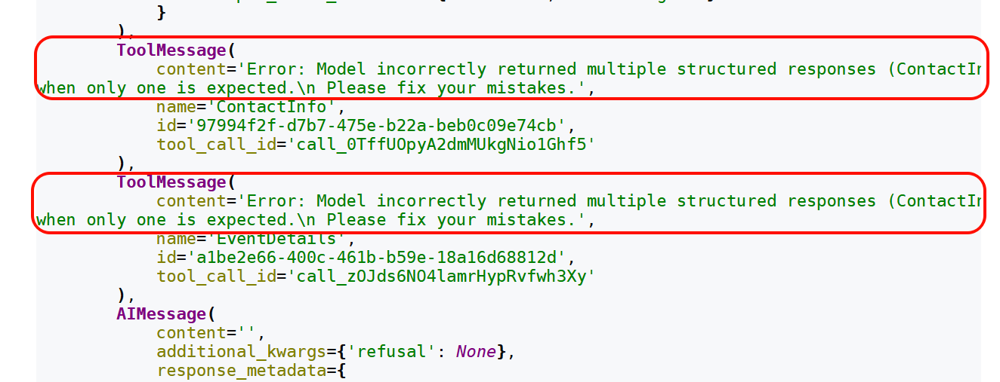

模型接收到错误反馈后，再次生成新的调用请求，直至成功或达到内部的最大重试次数。
ToolStrategy中自定义的tool_message_content控制的是成功后的消息内容，不影响错误消息内容。
**2）handle_errors设置为False**
运行后结果如下：
~~~yaml
1 MultipleStructuredOutputsError: Model incorrectly returned multiple
structured responses (ContactInfo, EventDetails) when only one is
expected.
2 During task with name 'model' and id 'db9a512a-d2a9-f6e4-0051-
fc5703dcb9c0'
~~~

**3）handle_errors设置为“请检查输入数据”**
运行后结果如下：
~~~text
1 }
2 {
3 'messages': [
4 HumanMessage(
~~~

~~~text
5 content='请提取以下文本中内容：姓名：张三，电子邮箱：
zhang3@atguigu.com，活动名称：公司年会，活动日期：
6 2026-07-15',
7 additional_kwargs={},
8 response_metadata={},
9 id='fc016142-2bba-4d7d-ae9d-a049d89339bb'
10 ),
11 AIMessage(
12 content='',
13 additional_kwargs={'refusal': None},
14 response_metadata={
15 'token_usage': {
16 'completion_tokens': 71,
17 'prompt_tokens': 208,
18 'total_tokens': 279,
19 'completion_tokens_details': {
20 'accepted_prediction_tokens': 0,
21 'audio_tokens': 0,
22 'reasoning_tokens': 0,
23 'rejected_prediction_tokens': 0
24 },
25 'prompt_tokens_details': {'audio_tokens': 0,
'cached_tokens': 0},
26 'latency_checkpoint': {
27 'engine_tbt_ms': 3,
28 'engine_ttft_ms': 33,
29 'engine_ttlt_ms': 276,
30 'pre_inference_ms': 88,
31 'service_tbt_ms': 3,
32 'service_ttft_ms': 375,
33 'service_ttlt_ms': 609,
34 'total_duration_ms': 531,
35 'user_visible_ttft_ms': 288
36 }
37 },
38 'model_provider': 'openai',
39 'model_name': 'gpt-5.4-mini-2026-03-17',
40 'system_fingerprint': None,
41 'id': 'chatcmpl-DmaeBotSr05l6BGYZkf2AfZiXCW4j',
42 'service_tier': 'default',
43 'finish_reason': 'tool_calls',
44 'logprobs': None
45 },
46 id='lc_run--019e8c75-b72e-7121-8492-c4850c549ba7-0',
47 tool_calls=[
48 {
49 'name': 'ContactInfo',
50 'args': {'name': '张三', 'email':
'zhang3@atguigu.com'},
51 'id': 'call_NBLcCvMstWj1CK8PiOJ3yH4Z',
52 'type': 'tool_call'
53 },
54 {
55 'name': 'EventDetails',
56 'args': {'event_name': '公司年会', 'date': '2026-07-
15'},
57 'id': 'call_74mfheDESm2LsUcO2SpC9rRD',
58 'type': 'tool_call'
~~~

~~~text
59 }
60 ],
61 invalid_tool_calls=[],
62 usage_metadata={
63 'input_tokens': 208,
64 'output_tokens': 71,
65 'total_tokens': 279,
66 'input_token_details': {'audio': 0, 'cache_read': 0},
67 'output_token_details': {'audio': 0, 'reasoning': 0}
68 }
69 ),
70 ToolMessage(
71 content='请检查输入数据',
72 name='ContactInfo',
73 id='e4c86dc2-c481-489b-b47a-a3a4a1c6fc17',
74 tool_call_id='call_NBLcCvMstWj1CK8PiOJ3yH4Z'
75 ),
76 ToolMessage(
77 content='请检查输入数据',
78 name='EventDetails',
79 id='d7675b23-eb5e-4bc4-adcc-7a1d82399edf',
80 tool_call_id='call_74mfheDESm2LsUcO2SpC9rRD'
81 ),
82 AIMessage(
83 content='',
84 additional_kwargs={'refusal': None},
85 response_metadata={
86 'token_usage': {
87 'completion_tokens': 71,
88 'prompt_tokens': 303,
89 'total_tokens': 374,
90 'completion_tokens_details': {
91 'accepted_prediction_tokens': 0,
92 'audio_tokens': 0,
93 'reasoning_tokens': 0,
94 'rejected_prediction_tokens': 0
95 },
96 'prompt_tokens_details': {'audio_tokens': 0,
'cached_tokens': 0},
97 'latency_checkpoint': {
98 'engine_tbt_ms': 3,
99 'engine_ttft_ms': 31,
100 'engine_ttlt_ms': 254,
101 'pre_inference_ms': 79,
102 'service_tbt_ms': 4,
103 'service_ttft_ms': 414,
104 'service_ttlt_ms': 623,
105 'total_duration_ms': 636,
106 'user_visible_ttft_ms': 335
107 }
108 },
109 'model_provider': 'openai',
110 'model_name': 'gpt-5.4-mini-2026-03-17',
111 'system_fingerprint': None,
112 'id': 'chatcmpl-DmaeCOCB5Uxpn7FAtTGpNOPsBgSZm',
113 'service_tier': 'default',
114 'finish_reason': 'tool_calls',
115 'logprobs': None
~~~

~~~text
116 },
117 id='lc_run--019e8c75-c0c0-76f1-95cb-a350fc846794-0',
118 tool_calls=[
119 {
120 'name': 'ContactInfo',
121 'args': {'name': '张三', 'email':
'zhang3@atguigu.com'},
122 'id': 'call_jlVDo6MSOODjW3S6qQ2Rks47',
123 'type': 'tool_call'
124 },
125 {
126 'name': 'EventDetails',
127 'args': {'event_name': '公司年会', 'date': '2026-07-
15'},
128 'id': 'call_0yyMPD4ff2P5BlB7tZP1g3lX',
129 'type': 'tool_call'
130 }
131 ],
132 invalid_tool_calls=[],
133 usage_metadata={
134 'input_tokens': 303,
135 'output_tokens': 71,
136 'total_tokens': 374,
137 'input_token_details': {'audio': 0, 'cache_read': 0},
138 'output_token_details': {'audio': 0, 'reasoning': 0}
139 }
140 ),
141 ToolMessage(
142 content='请检查输入数据',
143 name='ContactInfo',
144 id='8fc7e28a-c20a-459b-a1cf-4975561d6037',
145 tool_call_id='call_jlVDo6MSOODjW3S6qQ2Rks47'
146 ),
147 ToolMessage(
148 content='请检查输入数据',
149 name='EventDetails',
150 id='620c3d86-ff48-4af4-aa81-07370d56c548',
151 tool_call_id='call_0yyMPD4ff2P5BlB7tZP1g3lX'
152 ),
153 AIMessage(
154 content='',
155 additional_kwargs={'refusal': None},
156 response_metadata={
157 'token_usage': {
158 'completion_tokens': 71,
159 'prompt_tokens': 398,
160 'total_tokens': 469,
161 'completion_tokens_details': {
162 'accepted_prediction_tokens': 0,
163 'audio_tokens': 0,
164 'reasoning_tokens': 0,
165 'rejected_prediction_tokens': 0
166 },
167 'prompt_tokens_details': {'audio_tokens': 0,
'cached_tokens': 0},
168 'latency_checkpoint': {
169 'engine_tbt_ms': 4,
170 'engine_ttft_ms': 46,
~~~

~~~text
171 'engine_ttlt_ms': 310,
172 'pre_inference_ms': 128,
173 'service_tbt_ms': 3,
174 'service_ttft_ms': 487,
175 'service_ttlt_ms': 687,
176 'total_duration_ms': 571,
177 'user_visible_ttft_ms': 359
178 }
179 },
180 'model_provider': 'openai',
181 'model_name': 'gpt-5.4-mini-2026-03-17',
182 'system_fingerprint': None,
183 'id': 'chatcmpl-DmaeDvP6HV3Zn4eEv5fRqEXV92Nhy',
184 'service_tier': 'default',
185 'finish_reason': 'tool_calls',
186 'logprobs': None
187 },
188 id='lc_run--019e8c75-c65d-7d42-881f-3557838a3f03-0',
189 tool_calls=[
190 {
191 'name': 'ContactInfo',
192 'args': {'name': '张三', 'email':
'zhang3@atguigu.com'},
193 'id': 'call_o935XfYmmwgt5ZimBJVg8fS7',
194 'type': 'tool_call'
195 },
196 {
197 'name': 'EventDetails',
198 'args': {'event_name': '公司年会', 'date': '2026-07-
15'},
199 'id': 'call_loG60u2yeX3cSToqvEwjG4DI',
200 'type': 'tool_call'
201 }
202 ],
203 invalid_tool_calls=[],
204 usage_metadata={
205 'input_tokens': 398,
206 'output_tokens': 71,
207 'total_tokens': 469,
208 'input_token_details': {'audio': 0, 'cache_read': 0},
209 'output_token_details': {'audio': 0, 'reasoning': 0}
210 }
211 ),
212 ToolMessage(
213 content='请检查输入数据',
214 name='ContactInfo',
215 id='6a5dc8d1-1a9f-4934-83a2-6dc037296b69',
216 tool_call_id='call_o935XfYmmwgt5ZimBJVg8fS7'
217 ),
218 ToolMessage(
219 content='请检查输入数据',
220 name='EventDetails',
221 id='fc8b46e9-cfb9-42cb-b92f-97c650f91937',
222 tool_call_id='call_loG60u2yeX3cSToqvEwjG4DI'
223 ),
224 AIMessage(
225 content='',
226 additional_kwargs={'refusal': None},
~~~

~~~text
227 response_metadata={
228 'token_usage': {
229 'completion_tokens': 29,
230 'prompt_tokens': 493,
231 'total_tokens': 522,
232 'completion_tokens_details': {
233 'accepted_prediction_tokens': 0,
234 'audio_tokens': 0,
235 'reasoning_tokens': 0,
236 'rejected_prediction_tokens': 0
237 },
238 'prompt_tokens_details': {'audio_tokens': 0,
'cached_tokens': 0},
239 'latency_checkpoint': {
240 'engine_tbt_ms': 4,
241 'engine_ttft_ms': 39,
242 'engine_ttlt_ms': 166,
243 'pre_inference_ms': 126,
244 'service_tbt_ms': 5,
245 'service_ttft_ms': 405,
246 'service_ttlt_ms': 525,
247 'total_duration_ms': 414,
248 'user_visible_ttft_ms': 279
249 }
250 },
251 'model_provider': 'openai',
252 'model_name': 'gpt-5.4-mini-2026-03-17',
253 'system_fingerprint': None,
254 'id': 'chatcmpl-DmaeF5dnz4cKcsowkMwqaysAyy4s2',
255 'service_tier': 'default',
256 'finish_reason': 'tool_calls',
257 'logprobs': None
258 },
259 id='lc_run--019e8c75-cce4-7403-81f6-dbd0cd24ce63-0',
260 tool_calls=[
261 {
262 'name': 'ContactInfo',
263 'args': {'name': '张三', 'email':
'zhang3@atguigu.com'},
264 'id': 'call_FXgGHA6Q2eYrXIqtyp7rLb37',
265 'type': 'tool_call'
266 }
267 ],
268 invalid_tool_calls=[],
269 usage_metadata={
270 'input_tokens': 493,
271 'output_tokens': 29,
272 'total_tokens': 522,
273 'input_token_details': {'audio': 0, 'cache_read': 0},
274 'output_token_details': {'audio': 0, 'reasoning': 0}
275 }
276 ),
277 ToolMessage(
278 content='提取完成！',
279 name='ContactInfo',
280 id='ff4ca4b0-eec0-485a-972b-4fc07fb0f799',
281 tool_call_id='call_FXgGHA6Q2eYrXIqtyp7rLb37'
282 )
~~~

~~~text
283 ],
284 'structured_response': ContactInfo(name='张三',
email='zhang3@atguigu.com')
285 }
~~~

以上代码中注意如下几点：
1. ToolStrategy允许指定多个类型“Union[ContactInfo, EventDetails]”这种写法，但是最终只会转换
成一种结构化类型输出。
2. 当ToolStrategy通过“Union[ContactInfo, EventDetails]”指定多个类型时，在内部调用生成结构化
类型工具会报错。此时：
handle_errors=True（默认值）开始发挥作用，系统会生成一个ToolMessage，明确告诉
LLM“Error: Model incorrectly returned multiple structured responses (ContactInfo,
EventDetails) when only one is expected.”，大模型收到这个精准的反馈后，会重新进行推
理，最终选择并输出一个最符合要求的Schema。
如果handle_errors 设置为False，执行代码过程直接报错。
3. 当格式化输出有错误时，Agent内部会进行工具调用重试，直到符合要求格式化输出前， 可能会进
行多次重试 。
**情况2：设置为指定异常类型**
默认情况下，LangChain会处理结构化输出处理时抛出的两类异常：
**1.** **MultipleStructuredOutputsError**
多结构化输出错误，当返回的工具调用**请求数量大于1**时，抛出该异常，默认情况下LangChain会拦截异
常并提醒模型重试。
**2.** **StructuredOutputValidationError**
输出结构化验证错误，当输出格式不符合结构化要求时，抛出上述异常。
默认情况下LangChain会拦截该异常并自动重试。
~~~python
1 from pydantic import BaseModel, Field
2 from typing import Union
3 from langchain.agents import create_agent
4 from langchain.agents.structured_output import ToolStrategy,
StructuredOutputValidationError, MultipleStructuredOutputsError
5 from rich import print as rprint
6
7 class ContactInfo(BaseModel):
8 """个人联系信息"""
9 name: str = Field(description="姓名")
10 email: str = Field(description="电子邮箱")
11
12
13 class EventDetails(BaseModel):
14 """活动详情"""
15 event_name: str = Field(description="活动名称")
16 date: str = Field(description="活动日期")
17
18
19 agent = create_agent(
20 model=model,
21 response_format=ToolStrategy(
22 Union[ContactInfo, EventDetails],
23 tool_message_content="提取完成！",
~~~

~~~python
24 handle_errors=
(MultipleStructuredOutputsError,StructuredOutputValidationError)
25 # handle_errors=(StructuredOutputValidationError)
26 )
27 )
28
29 result = agent.invoke({
30 "messages": [{
31 "role": "user",
32 "content": f"请提取以下文本中内容：姓名：张三，电子邮箱：
zhang3@atguigu.com，活动名称：公司年会，活动日期：2026-07-15"
33 }]
34 })
35
36 rprint(result)
37
~~~

输出如下：
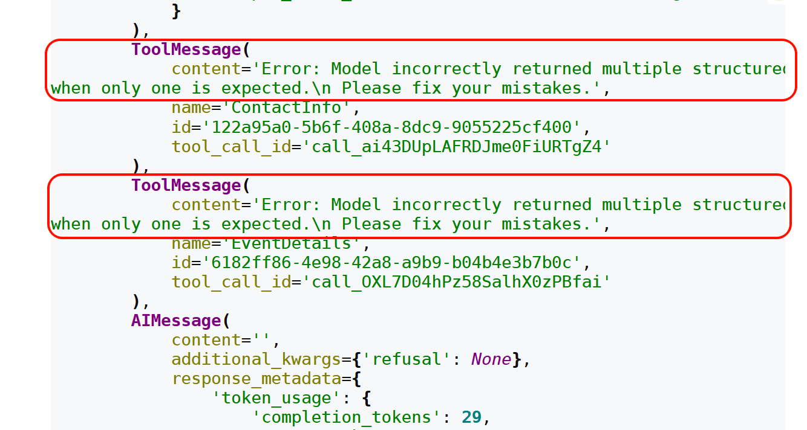

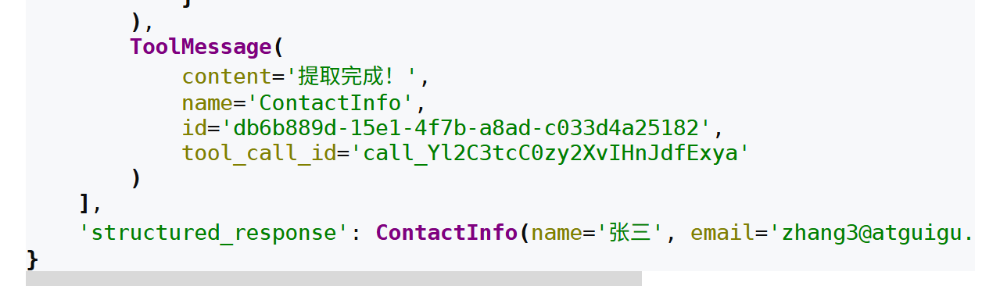

**情况3：设置为自定义错误处理函数**
指定异常处理函数并返回字符串时，LangChain会在遇到异常时自动重试并将异常处理函数的返回值作
为ToolMessage的内容。
我们也可以选择在异常处理函数中抛出异常。
~~~python
1 from pydantic import BaseModel, Field
2 from typing import Union
3 from langchain.agents import create_agent
~~~

~~~python
4 from langchain.agents.structured_output import ToolStrategy,
StructuredOutputValidationError, MultipleStructuredOutputsError
5 from rich import print as rprint
6
~~~

7 # 自定义错误处理函数
~~~python
8 def custom_error_handler(error: Exception) -> str:
9 """自定义错误处理器"""
10 error_str = str(error)
11
12 print(f"捕获到错误类型：{type(error).__name__}")
13 print(f"错误详情：{error_str}")
14
15 if isinstance(error, StructuredOutputValidationError):
16 return "数据格式有误，请检查字段是否符合要求。"
17 elif isinstance(error, MultipleStructuredOutputsError):
18 return "检测到多个响应，请选择最相关的一个进行返回。"
19 else:
20 return f"Error: {error_str}"
21
22
23 class ContactInfo(BaseModel):
24 """个人联系信息"""
25 name: str = Field(description="姓名")
26 email: str = Field(description="电子邮箱")
27
28
29 class EventDetails(BaseModel):
30 """活动详情"""
31 event_name: str = Field(description="活动名称")
32 date: str = Field(description="活动日期")
33
34
35 agent = create_agent(
36 model=model,
37 response_format=ToolStrategy(
38 Union[ContactInfo, EventDetails],
39 tool_message_content="提取完成！",
40 handle_errors=custom_error_handler
41 )
42 )
43
44 result = agent.invoke({
45 "messages": [{
46 "role": "user",
47 "content": f"请提取以下文本中内容：姓名：张三，电子邮箱：
zhang3@atguigu.com，活动名称：公司年会，活动日期：2026-07-15"
48 }]
49 })
50
51 rprint(result)
52
~~~

handle_errors指定自定义错误处理，运行后结果如下：
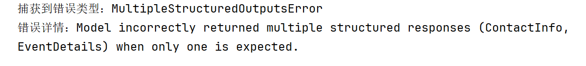

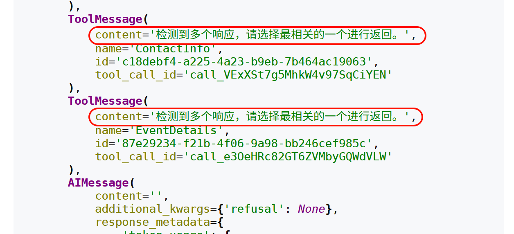

## 8、Agent的高级用法4：流式输出及模式
### 8.1 流式输出的说明
|  | **invoke** |
| --- | --- |
| 流式调用 |  |

LLM 延迟时尤其有效。
**流式输出好处：**
大型语言模型生成完整响应通常需要几秒钟时间，对于长输出可能达到10-20 秒，用户期望即时反
馈， 流式传输让等待过程更加可控 。
相比非流式传输需要用户长时间等待完整响应，流式传输可以立即显示文字逐渐出现的效果， 大
幅降低用户的等待焦虑 。
**设置方式：**
通过“ agent.stream(stream_mode=指定模式) ”来指定。具体模式有：values、updates（默认）、
messages、custom、checkpoints、tasks、debug。
### 8.2 具体的输出模式
#### 8.2.1 values输出模式
当 stream_mode 设置为values模式时，每个步骤执行后，都会输出完整的状态信息，适用于每一步都
要获取完整状态、状态持久化场景。
举例：
~~~python
1 from langchain.agents import create_agent
2 from langchain.tools import tool
3 from typing import Dict, Any
4 from rich import print as rprint
5
6 @tool
7 def query_customer_data(customer_id: str) -> Dict[str, Any]:
8 """
~~~

9 查询客户基本信息
~~~yaml
10
11 Args:
12 customer_id: 客户ID，用于唯一标识客户
13
~~~

~~~text
14 Returns:
~~~

15 包含客户基本信息的字典，如姓名、等级、加入日期等
~~~python
16 """
17 # 模拟数据库查询
18 return {"name": "张三","level": "VIP","join_date": "2023-01-15"}
19
20
21 @tool
22 def check_order_history(customer_id: str) -> Dict[str, Any]:
23 """
~~~

24 查询客户订单历史
~~~yaml
25
26 Args:
27 customer_id: 客户ID，用于唯一标识客户
28
29 Returns:
~~~

30 包含客户订单历史的字典，如总订单数、总花费等
~~~python
31 """
32 return {"total_orders": 15,"total_spent": 25800.00}
33
34
35 @tool
36 def get_current_promotions() -> Dict[str, Any]:
37 """
~~~

38 获取当前可用促销活动
~~~text
39
40 Returns:
~~~

41 包含当前可用促销活动的字典，如活动名称、有效日期等
~~~python
42 """
43 return {
44 "promotions": ["老用户优惠", "会员专属折扣"],
45 "valid_until": "2027-01-31"
46 }
47
48
49 # 创建客户服务Agent
50 customer_service_agent = create_agent(
51 model=model,
52 tools=[query_customer_data, check_order_history, get_current_promotions]
53 )
54
55
56 for chunk in customer_service_agent.stream(
57
58 {"messages": [{"role": "user","content": "查询客户ID为 CUST123456 的个
人信息、历史订单和可用优惠"}]},
59 stream_mode="values"
60 ):
61 rprint(chunk)
62 print("-" * 50)
~~~

代码运行后示意结果如下：

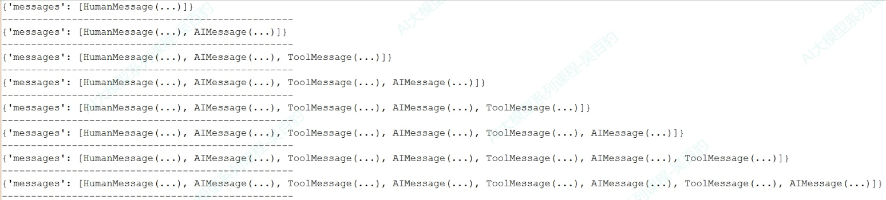

#### 8.2.2 updates输出模式
这种模式就是默认模式。该模式中，每个步骤执行后，只增量更新状态中发生变化的内容，用于监控
Agent 执行进度，例如观察Agent决定调用工具、工具执行结果等步骤。
代码如下：
1 # 其他工具代码同上，保持不变
~~~python
2 # ... ...
3 for chunk in customer_service_agent.stream(
4 {"messages": [{"role": "user","content": "查询客户ID为 CUST123456 的完整
信息和可用优惠"}]},
5 stream_mode="updates"
6 ):
7 rprint(chunk)
8 print("-" * 50)
~~~

运行结果如下：
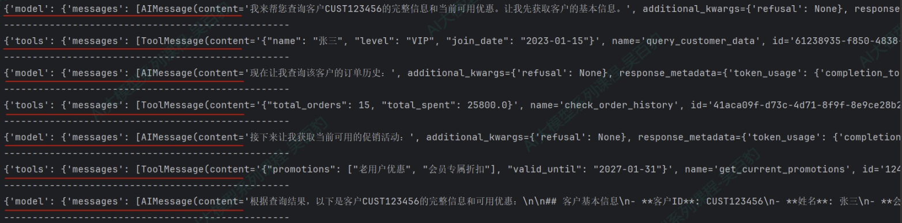

#### 8.2.3 messages输出模式
该模式中会输出流式返回的Token以及相关的元数据（如：来自哪个节点），可以用在实现类似
ChatGPT 的打字机效果场景，为聊天机器人等交互式应用提供最佳的实时体验。
代码如下：
1 # 其他工具代码同上，保持不变
~~~python
2 # ... ...
3 for chunk in customer_service_agent.stream(
4 {"messages": [{"role": "user","content": "查询客户ID为 CUST123456 的完
整信息和可用优惠"}]},
5 stream_mode="messages"
6 ):
7 print(chunk)
8 print("-" * 50)
9
10 # print(chunk[0].content,end="",flush=True)
~~~

运行结果如下：
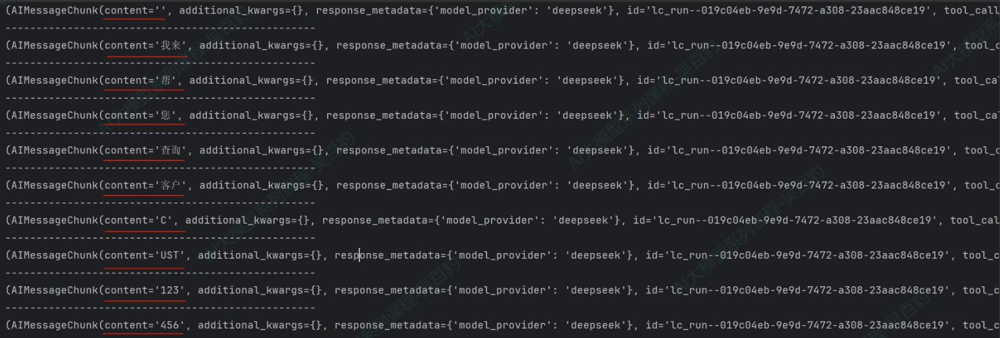

#### 8.2.4 tasks输出模式
该模式会输出当前task任务开始和结束的时间，包含任务的结果和错误信息，该模式用于监控任务的生
命周期。
代码如下：
1 # 其他工具代码同上，保持不变
~~~python
2 # ... ...
3 for chunk in customer_service_agent.stream(
4 {"messages": [{"role": "user","content": "查询客户ID为 CUST123456 的完整
信息和可用优惠"}]},
5 stream_mode="tasks"
6 ):
7 print(chunk)
8 print("-" * 50)
~~~

运行结果如下：
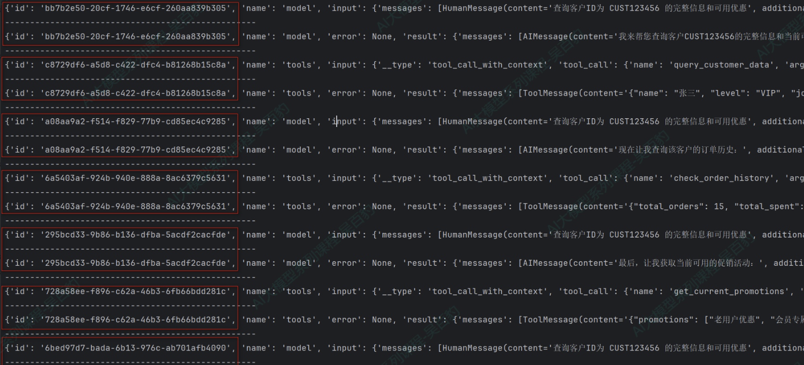

#### 8.2.5 debug输出模式
该模式与tasks模式类似，比task模式多输出任务步骤、时间戳、task类型（task/task_result），该模式
用于调试、监控task任务的生命周期。
代码如下：

1 # 其他工具代码同上，保持不变
~~~python
2 # ... ...
3 for chunk in customer_service_agent.stream(
4 {"messages": [{"role": "user","content": "查询客户ID为 CUST123456 的完整
信息和可用优惠"}]},
5 stream_mode="debug"
6 ):
7 print(chunk)
8 print("-" * 50)
~~~

运行结果如下：
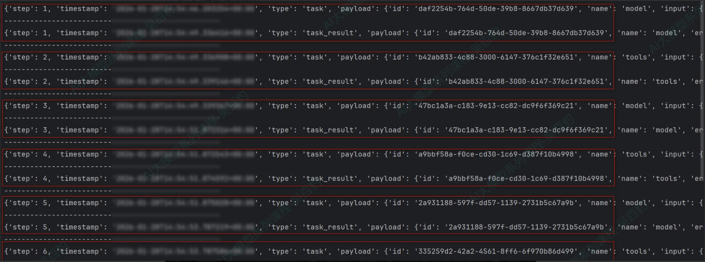

#### 8.2.6 checkpoints输出模式
该模式中，每当检查点（checkpoint）被创建时会触发输出，输出包含检查点中的状态，用于需要状态
持久化、工作流恢复或分布式执行跟踪的高级场景。
代码案例如下：
~~~python
1 from langgraph.checkpoint.memory import InMemorySaver
2
~~~

3 # 其他工具代码同上，保持不变
~~~text
4 # ... ...
5 # 1. 创建内存检查点存储
6 checkpointer = InMemorySaver()
7
8 # 2. 创建Agent
9 customer_service_agent = create_agent(
10 model=model,
11 tools=[query_customer_data, check_order_history,
get_current_promotions],
12 checkpointer=checkpointer # 启用检查点
13 )
14
15 # 3. 创建唯一的会话ID
16 config = {"configurable": {"thread_id": "session01"}}
17
18 # 4. 调用Agent
19 checkpoint_count = 0
20
21 # 使用checkpoints模式进行流式监控
22 for chunk in customer_service_agent.stream(
23 {"messages": [{"role": "user","content": "查询客户ID为 CUST123456 的完
整信息和可用优惠"}]},
~~~

~~~python
24 config=config,
25 stream_mode="checkpoints"
26 ):
27 checkpoint_count += 1
28 print(f"检查点 #{checkpoint_count}")
29 print(chunk)
30 print("-" * 50)
~~~

运行结果如下，每次输出都会将相关MESSAGE追加到values.messages中。
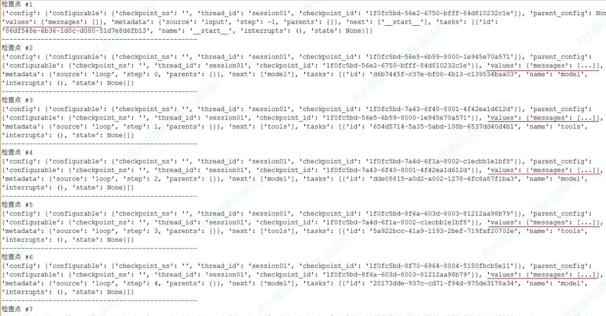

#### 8.2.7 custom输出模式
开发者通过 get_stream_writer 在工具或节点内部 自定义发送的数据 ，用于 输出 业务逻辑相关的进
度信息（如“已处理10/100条记录”）、自定义日志或指标。
举例：生成销售报告和库存报告Agent
~~~python
1 from langchain.agents import create_agent
2 from langgraph.config import get_stream_writer
3 from langchain.tools import tool
4 import time
5
6 @tool
7 def generate_sales_report() -> str:
8 """生成销售报告"""
9 writer = get_stream_writer()
10
11 writer({"type": "生成销售报告", "message": "开始生成销售报告"})
12
13 # 模拟数据处理
14 for i in range(1, 4):
15 time.sleep(0.5)
16 writer({"type": "生成销售报告","message": f"生成销售报告进度百分比：{i *
25}%"})
17
18 writer({"type": "生成销售报告", "message": "报告生成完成"})
19
20 return f"销售报告：总收入150万元，同比增长12%"
21
22
~~~

~~~python
23 @tool
24 def generate_inventory_report() -> str:
25 """生成库存报告"""
26 writer = get_stream_writer()
27 writer("开始库存分析...")
28 time.sleep(0.5)
29 writer("检查当前库存量...")
30 time.sleep(0.5)
31 writer("生成库存报告...")
32
33 return "当前库存量为10000件，库存充足，无异常"
34
35
36 # 创建报告生成agent
37 reporting_agent = create_agent(
38 model=model,
39 tools=[generate_sales_report, generate_inventory_report]
40 )
41
42 for chunk in reporting_agent.stream(
43 {"messages": [{"role": "user","content": "生成销售报告和库存报告"}]},
44 stream_mode="custom"
45 ):
46 print(chunk)
47 print("-" * 50)
~~~

运行结果如下：
~~~text
1 {'type': '生成销售报告', 'message': '开始生成销售报告'}
2 --------------------------------------------------
3 开始库存分析...
4 --------------------------------------------------
5 {'type': '生成销售报告', 'message': '生成销售报告进度百分比：25%'}
6 --------------------------------------------------
7 检查当前库存量...
8 --------------------------------------------------
9 {'type': '生成销售报告', 'message': '生成销售报告进度百分比：50%'}
10 --------------------------------------------------
11 生成库存报告...
12 --------------------------------------------------
13 {'type': '生成销售报告', 'message': '生成销售报告进度百分比：75%'}
14 --------------------------------------------------
15 {'type': '生成销售报告', 'message': '报告生成完成'}
16 --------------------------------------------------
~~~

### 8.3 流式输出模式总结
如下是LangChain Agent输出模式对比：

| **模式** | **输出内容** | **使用场景** |
| --- | --- | --- |
| values | 每个步骤执行后，都会输出完整的状态 信息 | 适用于每一步都要获取完整状态、状 态持久化场景 |
| updates（默 认） | 每个步骤执行后，只增量更新状态中发 生变化的内容 | 用于监控Agent 执行进度，例如观察 Agent决定调用工具、工具执行结果 等步骤 |
| messages | 输出流式返回的Token以及相关的元数 据（如：来自哪个节点model/tool） | 实现类似ChatGPT 的打字机效果，为 聊天机器人等交互式应用提供最佳的 实时体验 |
| tasks | 输出当前task任务开始和结束的时间， 包含任务的结果和错误信息 | 该模式用于监控任务的生命周期 |
| debug | 与tasks模式类似，比task模式多输出 任务步骤、时间戳、task类型 （task/task_result） | 该模式用于调试、监控task任务的生 命周期 |
| checkpoints | 当检查点（checkpoint）被创建时会 触发输出，输出包含检查点中的状态 | 用于需要状态持久化、工作流恢复或 分布式执行跟踪的高级场景 |
| custom | 通过get_stream_writer在工具或节点 内部自定义发送的数据 | 用于输出业务逻辑相关的进度信息 （如“已处理10/100条记录”）、自定 义日志或指标 |

我们可以根据不同的目标来选择不同的输出模式。例如：
实现 实时对话交互 ，优先选择messages模式；
观察Agent的 思考与执行步骤 ，优先选择updates模式；
需要查看 每一步状态 优先选择values/tasks/debug模式；
在工具执行时 输出自定义业务 日志优先选择custom模式。
此外，以上这些模式还可以组合使用，例如，可以同时指定 stream_mode=[“tasks”，“updates”] ，这
样在同一个循环里 既能 查看Agent task任务执行内容， 又能 显示Agent每步的更新。
举例：
1 # 其他工具代码同上，保持不变
~~~python
2 # ... ...
3 # 创建客户服务Agent
4 customer_service_agent = create_agent(
5 model=model,
6 tools=[query_customer_data, check_order_history, get_current_promotions]
7 )
8
9
10 for stream_mode, chunk in customer_service_agent.stream(
11 {"messages": [{"role": "user","content": "查询客户ID为 CUST123456 的完
整信息和可用优惠"}]},
12 stream_mode=["tasks", "updates"]
13 ):
14 print(f"当前流模式: {stream_mode}, 当前数据: {chunk}")
15 print("-" * 50)
~~~

当指定多模式后，可以通过“ for stream_mode, chunk in customer_service_agent.stream... ”来遍历
dict，dict的key(stream_mode)是执行模式，value(chunk)是该模式输出的结果。代码运行输出结果如
下：
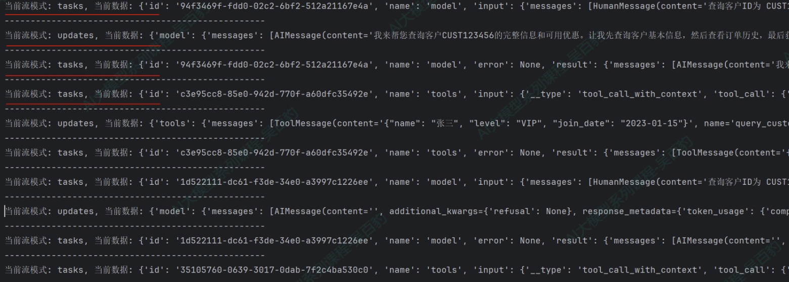

## 9、实战：多功能智能助手
项目需求：开发一个多功能智能助手，支持：
1. **天气查询**：查询城市天气
2. **数学计算**：复杂数学运算
3. **时间查询**：获取当前时间、日期计算
4. **货币转换**：多种货币之间转换
5. **信息搜索**：搜索产品、新闻等信息
### 9.1 模型的初始化
~~~python
1
2 # 1、模型的初始化
3 import os
4 from dotenv import load_dotenv
5 from langchain.chat_models import init_chat_model
6
7 # 从.env文件中加载环境变量
8 load_dotenv(override=True)
9
10 # 模型的初始化
11 model = init_chat_model(
12 model="gpt-5.4-mini",
13 model_provider="openai",
14 api_key=os.getenv("CLOSEAI_API_KEY"),
15 base_url=os.getenv("CLOSEAI_BASE_URL")
16 )
~~~

### 9.2 工具的定义
~~~python
1 # ==================== 工具定义 ====================
2 from langchain_core.tools import tool
3 import math
4 from datetime import datetime, timedelta
5
6 @tool
~~~

~~~python
7 def get_weather(city: str) -> str:
~~~

8 """获取指定城市的实时天气信息
~~~text
9
~~~

10 支持中国主要城市的天气查询
~~~yaml
11
12 Args:
13 city: 城市名称，如"北京"、"上海"、"深圳"等
14
15 Returns:
~~~

16 包含温度、天气状况、空气质量的详细信息
~~~text
17
18 Examples:
19 get_weather("北京") 返回 "多云，15-22℃，空气质量良"
20 """
21 weather_db = {
22 "北京": "多云，15-22℃，空气质量良，湿度 45%",
23 "上海": "晴天，18-25℃，空气质量优，湿度 60%",
24 "深圳": "小雨，22-28℃，空气质量优，湿度 75%",
25 "成都": "阴天，16-23℃，空气质量良，湿度 70%",
26 "杭州": "晴天，17-24℃，空气质量优，湿度 55%",
27 "广州": "多云，21-29℃，空气质量良，湿度 72%"
28 }
29
30 result = weather_db.get(city)
31 if result:
32 return f"{city}：{result}"
33 else:
34 return f"抱歉，暂不支持查询{city}的天气信息。当前支持：北京、上海、深圳、成
~~~

都、杭州、广州"
~~~python
35
36 @tool
37 def calculator(expression: str) -> str:
38 """执行数学计算
39
40 支持基本运算符（+、-、*、/、**）和常用数学函数
41
42 Args:
43 expression: 数学表达式，可以包含：
44 - 基本运算：2 + 3, 10 * 5, 100 / 4
45 - 幂运算：2 ** 10
46 - 函数：sqrt(16), abs(-5), pow(2, 3)
47
48 Returns:
~~~

49 计算结果或错误信息
~~~text
50
51 Examples:
52 calculator("2 + 3 * 4") 返回 "14"
53 calculator("sqrt(16)") 返回 "4.0"
54 """
55 try:
56 # 安全的数学运算环境
57 safe_functions = {
58 "sqrt": math.sqrt,
59 "pow": pow,
60 "abs": abs,
61 "round": round,
62 "sin": math.sin,
63 "cos": math.cos,
~~~

~~~python
64 "tan": math.tan,
65 "log": math.log,
66 "pi": math.pi,
67 "e": math.e
68 }
69
70 result = eval(expression, {"__builtins__": {}}, safe_functions)
71 return f"{expression} = {result}"
72 except Exception as e:
73 return f"计算出错：{str(e)}\n提示：请检查表达式格式，支持的函数有 sqrt,
abs, pow, sin, cos, tan, log"
74
75 @tool
76 def get_time_info(query_type: str = "current") -> str:
77 """获取时间相关信息
78
79 Args:
80 query_type: 查询类型
81 - "current": 当前时间
82 - "date": 今天日期
83 - "tomorrow": 明天日期
84 - "yesterday": 昨天日期
85 - "weekday": 星期几
86
87 Returns:
~~~

88 时间信息字符串
~~~python
89
90 Examples:
91 get_time_info("current") 返回 "2025年1月25日 14:30:25"
92 get_time_info("weekday") 返回 "星期六"
93 """
94 now = datetime.now()
95
96 if query_type == "current":
97 return now.strftime("当前时间：%Y年%m月%d日 %H:%M:%S")
98 elif query_type == "date":
99 return now.strftime("今天是：%Y年%m月%d日")
100 elif query_type == "tomorrow":
101 tomorrow = now + timedelta(days=1)
102 return tomorrow.strftime("明天是：%Y年%m月%d日")
103 elif query_type == "yesterday":
104 yesterday = now - timedelta(days=1)
105 return yesterday.strftime("昨天是：%Y年%m月%d日")
106 elif query_type == "weekday":
107 weekdays = ["星期一", "星期二", "星期三", "星期四", "星期五", "星期六",
"星期日"]
108 return f"今天是{weekdays[now.weekday()]}"
109 else:
110 return f"不支持的查询类型：{query_type}。支持：current, date, tomorrow,
yesterday, weekday"
111
112 @tool
113 def convert_currency(amount: float, from_curr: str, to_curr: str) -> str:
114 """货币转换工具
~~~

115 支持主要货币之间的实时汇率转换
~~~yaml
116
117 Args:
118 amount: 金额数值
~~~

~~~python
119 from_curr: 源货币代码（CNY/USD/EUR/GBP/JPY/HKD）
120 to_curr: 目标货币代码（CNY/USD/EUR/GBP/JPY/HKD）
121
122 Returns:
123 转换结果
124
125 Examples:
126 convert_currency(100, "CNY", "USD") 返回 "100 CNY = 14.00 USD"
127 """
128 # 汇率表（相对于 CNY）
129 exchange_rates = {
130 "CNY": 1.0, # 人民币
131 "USD": 0.14, # 美元
132 "EUR": 0.13, # 欧元
133 "GBP": 0.11, # 英镑
134 "JPY": 20.8, # 日元
135 "HKD": 1.09 # 港币
136 }
137
138 # 货币名称
139 currency_names = {
140 "CNY": "人民币", "USD": "美元", "EUR": "欧元",
141 "GBP": "英镑", "JPY": "日元", "HKD": "港币"
142 }
143
144 from_curr = from_curr.upper()
145 to_curr = to_curr.upper()
146
147 if from_curr not in exchange_rates:
148 return f"不支持的源货币：{from_curr}。支持的货币：CNY, USD, EUR, GBP,
JPY, HKD"
149 if to_curr not in exchange_rates:
150 return f"不支持的目标货币：{to_curr}。支持的货币：CNY, USD, EUR, GBP,
JPY, HKD"
151
152 # 转换逻辑：先转为 CNY，再转为目标货币
153 cny_amount = amount / exchange_rates[from_curr]
154 result_amount = cny_amount * exchange_rates[to_curr]
155
156 from_name = currency_names[from_curr]
157 to_name = currency_names[to_curr]
158
159 return f"{amount} {from_name}（{from_curr}）= {result_amount:.2f}
{to_name}（{to_curr}）"
160
161 @tool
162 def search_info(keyword: str, category: str = "all") -> str:
163 """搜索各类信息
164
165 Args:
166 keyword: 搜索关键词
167 category: 搜索分类
168 - "product": 搜索产品
169 - "news": 搜索新闻
170 - "all": 搜索所有
171
172 Returns:
173 搜索结果
~~~

~~~text
174 """
175 # 模拟数据库
176 products = {
177 "手机": "iPhone 15 (¥5999), 小米14 (¥3999), 华为Mate60 (¥6999)",
178 "笔记本": "MacBook Pro (¥12999), ThinkPad X1 (¥9999), 华为MateBook
(¥7999)",
179 "耳机": "AirPods Pro (¥1999), Sony WH-1000XM5 (¥2499)"
180 }
181
182 news = {
183 "AI": "1. GPT-5 即将发布 2. AI 芯片市场增长 30% 3. 新AI法规出台",
184 "科技": "1. 量子计算新突破 2. 6G 技术测试 3. 新能源汽车销量创新高"
185 }
186
187 results = []
188
189 if category in ["product", "all"]:
190 for key, value in products.items():
191 if keyword in key:
192 results.append(f"【产品】{key}：{value}")
193
194 if category in ["news", "all"]:
195 for key, value in news.items():
196 if keyword in key or keyword in value:
197 results.append(f"【新闻】{key} 相关：{value}")
198
199 if results:
200 return "\n".join(results)
201 else:
202 return f"未找到关于 '{keyword}' 的{category}信息"
203
~~~

### 9.3 agent的创建
~~~python
1 from langchain.agents import create_agent
2
3
4 class SmartAssistant:
5 """多功能智能助手"""
6 def __init__(self):
7 # 初始化模型
8 self.model = model
9
10 # 工具列表
11 self.tools = [
12 get_weather,
13 calculator,
14 get_time_info,
15 convert_currency,
16 search_info
17 ]
18
19 # 系统提示词
20 system_prompt = """你是一个多功能智能助手，可以帮助用户：
21
22 🌤 查询天气：使用 get_weather 工具
23 🔢 数学计算：使用 calculator 工具
~~~

~~~text
24 ⏰ 时间查询：使用 get_time_info 工具
25 💱 货币转换：使用 convert_currency 工具
26 🔍 信息搜索：使用 search_info 工具
27
28 重要提示：
~~~

29 1. 仔细阅读用户问题，确定需要使用哪个工具
30 2. 如果需要多个工具，按顺序调用
31 3. 总是用友好、专业的语气回答
32 4. 如果工具返回了数据，要用通俗易懂的语言解释给用户
33 5. 如果无法完成任务，诚实地告诉用户原因
~~~python
34
35 请始终使用中文回答。"""
36
37 # ✅ 创建 agent
38 self.agent = create_agent(
39 model=self.model,
40 tools=self.tools,
41 system_prompt=system_prompt
42 )
43
44 # 对话历史
45 self.messages = []
46
47 def chat(self, user_input: str) -> str:
48 """对话接口"""
49 # 添加用户消息
50 self.messages.append({"role": "user", "content": user_input})
51
52 # 调用 agent
53 result = self.agent.invoke({"messages": self.messages})
54
55 # 更新消息历史
56 self.messages = result["messages"]
57
58 # 返回最后一条 AI 消息
59 for msg in reversed(self.messages):
60 if msg.type == "ai" and msg.content:
61 return msg.content
62
63 return "抱歉，我无法处理这个请求。"
64
65 def reset(self):
66 """重置对话历史"""
67 self.messages = []
68
~~~

### 9.4 主程序
~~~python
1 # ==================== 主程序 ====================
2
3 def main():
4 assistant = SmartAssistant()
5
6 print("=" * 40)
7 print("🤖 多功能智能助手（LangChain 1.2）")
8 print("=" * 40)
9 print("\n我可以帮你：")
~~~

~~~python
10 print(" 🌤 查询天气")
11 print(" 🔢 数学计算")
12 print(" ⏰ 时间查询")
13 print(" 💱 货币转换")
14 print(" 🔍 信息搜索")
15 print("\n输入 'quit' 退出，输入 'reset' 重置对话\n")
16
17 demos = [
18 "北京今天天气怎么样？",
19 "帮我算一下 (25 + 17) * 3",
20 "现在几点了？",
21 "100 美元等于多少人民币？"
22 ]
23
24 for demo in demos:
25 print(f"👤 {demo}")
26 response = assistant.chat(demo)
27 print(f"🤖 {response}\n")
28
29 # 重置对话
30 assistant.reset()
31
32 # 交互模式
33 print("=" * 40)
34 print("💬 进入交互模式")
35 print("=" * 40)
36
37 while True:
38 user_input = input("\n👤 你: ")
39
40 if user_input.lower() == 'quit':
41 print("再见！👋")
42 break
43
44 if user_input.lower() == 'reset':
45 assistant.reset()
46 print("✅ 对话已重置")
47 continue
48
49 if not user_input.strip():
50 continue
51
52 # 调用助手
53 response = assistant.chat(user_input)
54 print(f"🤖 助手: {response}")
55
56 if __name__ == "__main__":
57 main()
~~~

输出：
~~~text
1 ========================================
2 🤖 多功能智能助手（LangChain 1.2）
3 ========================================
4
~~~

5 我可以帮你：
6 🌤 查询天气

7 🔢 数学计算
8 ⏰ 时间查询
9 💱 货币转换
~~~text
10 🔍 信息搜索
11
12 输入 'quit' 退出，输入 'reset' 重置对话
13
~~~

14 👤 北京今天天气怎么样？
~~~text
15 🤖 北京今天天气是：**多云，15–22℃**，**空气质量良**，湿度 **45%**。
~~~

16 整体来说比较适合外出，建议穿**轻薄外套**会更舒服。
~~~text
17
18 👤 帮我算一下 (25 + 17) * 3
19 🤖 计算结果是：**126**。
20
~~~

21 👤 现在几点了？
~~~text
22 🤖 现在是：**2026年06月03日 19:45:40**。
23
24 👤 100 美元等于多少人民币？
25 🤖 **100 美元（USD）约等于 714.29 人民币（CNY）**。
26
27 ========================================
~~~

28 💬 进入交互模式
~~~text
29 ========================================
30 再见！👋
~~~
