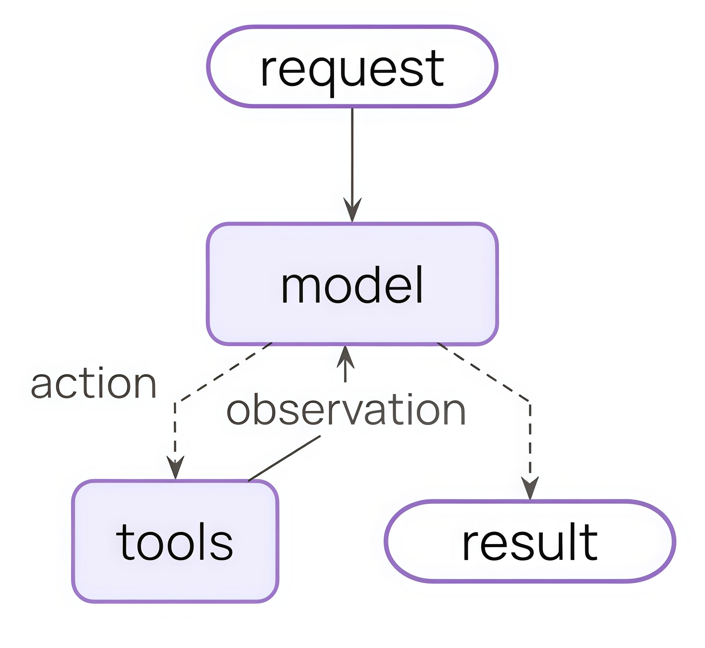
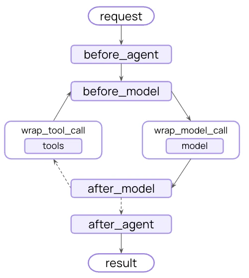
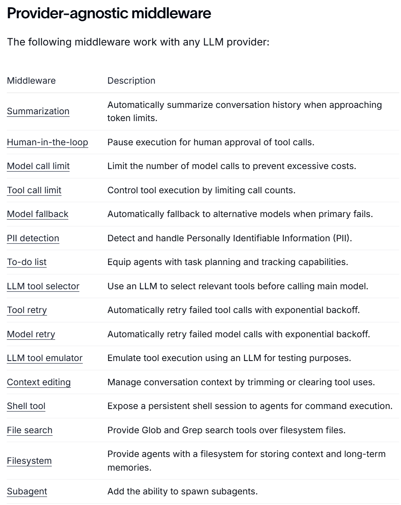
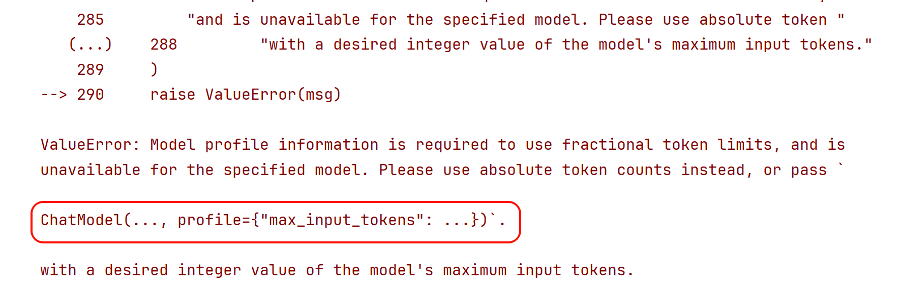
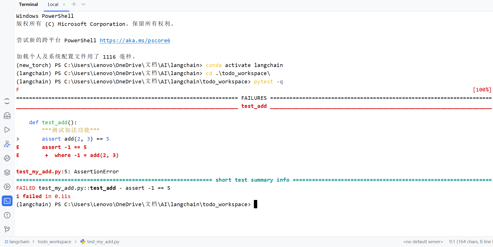
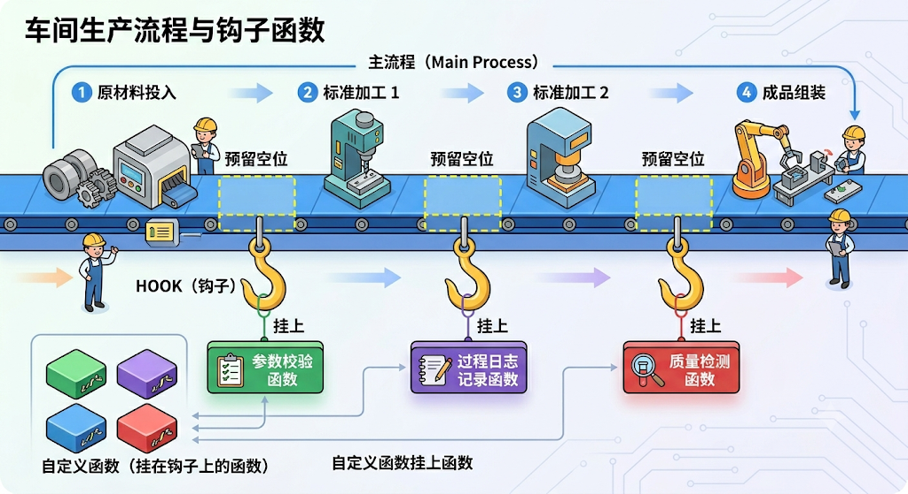
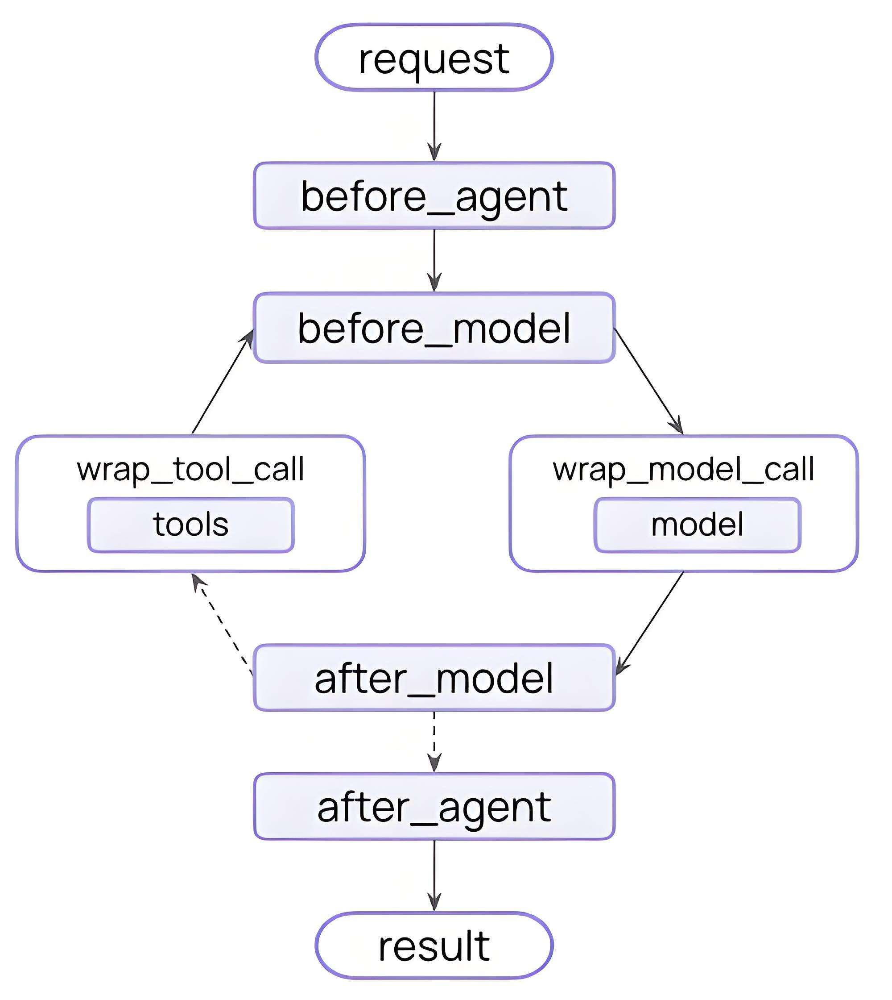

# 第08章：中间件(Middleware)
讲师：尚硅谷-宋红康
官网：尚硅谷
## 1、中间件概述
在 create_agent() 的底层运行机制中，有几个重要的组件，分别是：
模型(Model) ：Agent 的“大脑”，负责理解任务与决策推理。
工具(Tools) ：Agent 的“手脚”，执行模型自己做不到的外部操作。
系统提示词(System Prompt) ：Agent的“角色”，告诉模型该怎么想、参考什么上下文。
中间件(Middleware) ：Agent的“中枢”，在执行流程的关键节点进行拦截、控制和增强。
声明如下：
~~~python
1 from langchain.agents import create_agent
2 from langchain.agents.middleware import SummarizationMiddleware,
HumanInTheLoopMiddleware
3
4 agent = create_agent(
5 model="gpt-5.4-mini",
6 tools=[...],
7 middleware=[
8 SummarizationMiddleware(...),
9 HumanInTheLoopMiddleware(...)
10 ],
11 )
~~~

### 1.1 什么是中间件
**Middleware(中间件)，简单说就是Agent** **执行过程中的钩子函数，是** **LangChain** **1.x** **的“王牌”工程化**
**能力。**
钩子是框架或系统在某些关键执行点暴露的扩展接口。开发者可以“挂上”自己的逻辑，在那些点上
插入、修改或替换行为，而无需改变主流程代码。就像在流水线上某个环节设置了一个“检查点”或
“插入器”。
借助中间件，开发者可以高度定制和控制Agent运行的每一个环节，是**处理** **Agent** **生命周期**的标准方
式。
**情况1：没有中间件的Agent架构：**



**情况2：添加中间件之后的Agent架构变为：**



在 LangChain 的 Agent 执行循环中，比如 “模型调用前”、“模型调用后”、“工具调用前后” 设置一些钩子
（hooks），让你在不改 Agent 主体逻辑的情况下实现策略与治理。
### 1.2 为什么需要中间件
如果没有中间件，Agent 的执行流程通常比较直接：
1 用户输入 → 拼接提示词/消息 → 调用模型 → 如有需要调用工具 → 返回结果
这种方式对于简单场景已经足够，但一旦进入真实项目，往往会遇到很多额外需求，例如：
想根据问题复杂度动态 切换模型 ；
想 限制 某些用户只能调用部分工具；
想在工具报错时 自动重试 或返回兜底结果；
想在模型调用前 插入额外的系统提示 ；
想记录每一步的 执行日志 ，方便排查问题；
想在敏感信息出现时 阻断执行 ；
想在正式执行工具前增加 人工审批 。

这些需求有一个共同特点：**它们不是** **Agent** **的核心业务逻辑，但又会影响** **Agent** **的执行过程。**如果把
这些逻辑全部直接写进主流程，会带来几个问题：
**1）主流程会迅速变乱**
Agent 本身只需要关心“理解用户需求、决定是否调用工具、生成结果”，
但一旦把日志、鉴权、重试、风控、审计都塞进去，主逻辑就会变得臃肿。
**2）很多逻辑是横切需求，难以复用**
例如日志、重试、风控、权限控制，通常不是某一个 Agent 独有的，而是多个 Agent 都需要。如果直接
写死在每个 Agent 里，会产生大量重复代码。
**3）流程控制粒度不够细**
有些逻辑必须发生在“模型调用前”，有些要发生在“工具调用后”，如果没有统一的执行拦截点，开发者只
能手动改主流程，既麻烦又容易出错。
**4）后期维护成本高**
当你需要增加一个新规则，例如“所有外部工具调用前都先做审计”，如果系统没有中间件机制，往往需
要修改很多处代码。
**总结：**
中间件的价值就在于**把这些与业务无关、但与执行过程强相关的横切逻辑，从** **Agent** **主流程中分离出**
**来。**让Agent 主体代码 聚焦业务 ，而借助中间件，实现“ 拦截流程、修改流程、增强流程 ”。
简言之，LangChain 1.x 的中间件能实现如下功能：
✅ 日志与分析 - 追踪行为、调试、性能监控
✅ 转换 - 修改提示词、工具选择、输出格式
✅ 容错 - 重试、降级、早期终止
✅ 安* - 限流、守护规则、PII 检测
### 1.3 中间件的分类
根据LangChain是否已经定义了来分类：
**自定义中间件**：允许开发者自定义，从而实现更加灵活的Agent行为管理
**内置中间件**：LangChain实现并提供的
模型供应商定制的中间件 ：依赖于特定模型服务的实现（不是本课的重点）
和模型供应商无关的中间件 。LangChain提供的与供应商无关的中间件如下：
链接：https://docs.langchain.com/oss/python/langchain/middleware/overview



### 1.4 和模型供应商无关的内置中间件分类
LangChain提供的**和模型供应商无关**的内置中间件分为六个类别
**类型1：成本与资源控制类**
核心目标：**控成本、控配额、避免无限调用**
这类中间件主要解决“ Agent太贵、太能跑、停不下来 ”的问题。
包含：
**Model** **call** **limit**：限制模型调用次数，防止一次任务反复请求 LLM，导致费用失控
**Tool** **call** **limit**：限制工具调用次数，避免 Agent 无限试错、死循环调工具

**Summarization**：在上下文快满时自动总结历史，减少 token 消耗
**Context** **editing**：裁剪上下文、清理工具调用痕迹，本质上也是为了节省上下文成本
**业务场景理解：**
适合生产环境的成本治理、配额治理、长会话优化、SaaS 产品控费。
**类型2：稳定性与容错保障类**
核心目标：**保证服务不中断、失败后尽量自动恢复**
这类中间件主要解决“ 调用失败怎么办、模型挂了怎么办、工具超时怎么办 ”。
包含：
**Model** **fallback**：主模型失败时切换备用模型
**Model** **retry**：模型调用失败后自动重试
**Tool** **retry**：工具调用失败后自动重试
**业务场景理解：**
适合线上生产系统，尤其是多模型、多工具依赖的 Agent。
本质上是在做 **高可用、容灾、鲁棒性建设**。
**类型3：安全与合规风控类**
核心目标：**让** **Agent** **可控、可审、合规**
这类中间件主要解决“ Agent乱执行、泄露敏感信息、做危险操作 ”的问题。
包含：
**Human-in-the-loop**：在关键工具调用前暂停，等人工审批
**PII** **detection**：检测和处理个人敏感信息
**Model** **call** **limit** **/** **Tool** **call** **limit**：某种意义上也可归到风控，因为它能防止异常滥用
**业务场景理解：**
适合企业内部系统、客服系统、审批流、数据查询类 Agent。
尤其是涉及：发邮件、调数据库、调财务/人事系统、导出敏感信息、执行外部动作等
**类型4：决策增强与智能编排类**
核心目标：**提升** **Agent** **的决策质量和任务拆解能力**
这类中间件主要解决“ Agent不够聪明、不会规划、不会先筛工具 ”的问题。
包含：
**To-do** **list**：给 Agent 增加任务规划、分步骤执行和状态跟踪能力
**LLM** **tool** **selector**：当工具太多时，用子模型筛选最相关的几个工具交给主模型
**Subagent**：允许生成子Agent，把复杂任务拆给不同角色处理
**业务场景理解：**
适合复杂任务流，比如：研究型 Agent、多步骤分析、报告生成、多角色协作、长链路任务编排等。
这类本质上是在增强 **Agent的“脑子”与“组织能力”**。

**类型5：执行能力扩展类**
核心目标：**给** **Agent** **更多“手脚”**
这类中间件主要解决“ Agent只能聊天，不能真正操作环境 ”的问题。
包含：
**Shell** **tool**：给 Agent 持久 shell，会执行命令
**File** **search**：给 Agent 文件搜索能力，能做 Glob/Grep
**Filesystem**：给 Agent 文件系统读写与长期存储能力
**业务场景理解：**
适合工程 Agent、代码 Agent、本地自动化 Agent、运维 Agent。
本质上是把 Agent 从“纯推理”扩展成“能操作环境的执行体”。
**类型6：开发调试与测试辅助类**
核心目标：**方便开发、测试、验证** **Agent** **行为**
这类中间件主要不是直接服务业务，而是服务于 研发和调试阶段 。
包含：
**LLM** **tool** **emulator**：用 LLM 模拟工具执行，便于测试（最典型）
**Summarization**：有时也可辅助调试长会话表现
**Context** **editing**：可用于测试上下文裁剪效果
**Human-in-the-loop**：也常用于调试高风险步骤
**业务场景理解：**
适合开发阶段快速验证流程、做 mock、减少真实工具依赖。
## 2、常用内置中间件的使用
LangChain 1.0 提供了 **16** **个预置中间件**，开箱即用。
我们**不会逐个介绍**上述与模型供应商无关的所有内置中间件，这里将与模型供应商无关的内置中间件分
成两部分： 常用内置中间件 （本节）， 其它内置中间件 （下节）。
第一部分将会详细讲解，第二部分提供测试代码和结果，快速演示。
### 2.1 SummarizationMiddleware中间件
**作用**：对历史消息列表进行 摘要&总结 ，达到 压缩上下文 的效果。
**原理**：在 达到触发条件 时，调用大模型对历史消息进行摘要， 将摘要的结果作为HumanMessage ，
放到消息列表最开始的位置。
#### 2.1.1 参数说明
注意：本节中间件的参数说明不保证包含完整参数列表，不常用或被标记为过时的参数被省略。
**参数1：model** —用于摘要的模型
可以是模型名称也可以是模型对象，如果传递的是模型名称，底层会调用 init_chat_model 初始化模
型。
**参数2：trigger** —摘要触发条件
是一个列表，每个元素对应一个条件，当 任一条件满足 时，触发摘要。

1. tokens ：token的数量，历史token的累计数量达到该值触发摘要。
2. messages ：历史消息数量，历史消息条数达到该值触发摘要。
3. fraction ：上下文长度比例。历史token的累计数量达到模型的 max_input_tokens*fraction 触
发摘要
如果条件包含 fraction ，要求模型的profile包含 max_input_tokens ，Deepseek模型的profile为空，
此时需要手动添加该配置项。Deepseek-V3.2的上下文长度为128K。
**参数3：keep** —摘要时保留的原始消息
支持三种条件，但和trigger不同，keep同一时间只接收一种条件。
1. tokens ：摘要时保留的token数量。
2. messages ：摘要时保留的历史消息条数。
3. fraction ：摘要时保留 max_input_tokens*fraction 个token。
**参数4：token_counter** —统计token数量的函数
默认使用LangChain提供的 count_tokens_approximately ，一般不用更改。
对于纯文本消息，该函数的大致思路是先统计消息的字符数，也就是 len(字符串) ，然后再除以每
个token大致的字符数，转换为粗略的token数，再加一些额外开销。作为估算的token数。
**参数5：summary_prompt** —摘要时的自定义提示词
该提示词需要包含 {messages} 占位符，使得历史消息列表可以被插入。不指定则使用内置提示词。
**参数6：trim_token_to_summarize** —摘要时历史消息的最大token数
如果历史消息token数大于该值，则会被裁剪。默认为" 4000 "。
如果trigger用token作为度量，调大触发阈值时，当前配置项应相应调整，否则会丢失信息。
#### 2.1.2 举例1
测试trigger、keep参数
使用CloseAI的gpt模型：
~~~python
1 from langchain.chat_models import init_chat_model
2 from dotenv import load_dotenv
3 import os
4
5 # 从.env文件中加载环境变量
6 load_dotenv(override=True)
7
8 custom_profile = {
9 "max_input_tokens": 128_000
10 }
11
12 model = init_chat_model(
13 model="gpt-5.4-mini",
14 model_provider="openai",
15 profile=custom_profile,
16 api_key=os.getenv("CLOSEAI_API_KEY"),
17 base_url=os.getenv("CLOSEAI_BASE_URL")
18 )
~~~

使用DeepSeek平台的模型：

~~~python
1 from langchain.chat_models import init_chat_model
2 from dotenv import load_dotenv
3 import os
4
5 # 从.env文件中加载环境变量
6 load_dotenv(override=True)
7
8 custom_profile = {
9 "max_input_tokens": 128_000
10 }
11
12 model = init_chat_model(
13 model="deepseek-v4-flash",
14 model_provider="deepseek",
15 profile=custom_profile,
16 api_key=os.getenv("DEEPSEEK_API_KEY"),
17 base_url=os.getenv("DEEPSEEK_BASE_URL")
18 )
~~~

后续代码：
~~~python
1 from langchain.agents import create_agent
2 from langchain.agents.middleware import SummarizationMiddleware
3 from langchain.messages import SystemMessage, HumanMessage, AIMessage
4
5 messages = [
6 SystemMessage("你是个非常友好的AI助手"),
7 HumanMessage("你好啊，我是老王，你是谁？"),
8 AIMessage("你好老王，我是小王"),
9 HumanMessage("好的小王，很高兴认识你"),
10 AIMessage("你高兴得太早了"),
11 HumanMessage("呵呵，你什么意思")
12 ]
13
14 agent = create_agent(
15 model="deepseek-v4-flash",
16 middleware=[
17 SummarizationMiddleware(
18 model=model,
19 trigger=[
20 ("tokens", 100),
21 ("messages", 6),
22 ("fraction", 0.001)
23 ],
24 keep=("messages", 2)
25 )
26 ]
27 )
28
29 response = agent.invoke({
30 "messages": messages
31 })
32
33 for msg in response["messages"]:
34 msg.pretty_print()
~~~

输出

~~~text
1 ================================•[1m Human Message
•[0m=================================
2
3 Here is a summary of the conversation to date:
4
5 ## SESSION INTENT
~~~

6 用户（老王）与AI（小王）进行初次问候和介绍。没有明确的后续任务目标，会话目前处于社交
开场阶段。
~~~text
7
8 ## SUMMARY
~~~

9 用户自称“老王”，向AI问好并询问AI的身份。AI回应，自我介绍为“小王”。用户随后表示很高兴
认识AI。这是一段简短的社交性对话开端，没有涉及具体任务、决策或深入讨论。
~~~text
10
11 ## ARTIFACTS
12 None
13
14 ## NEXT STEPS
~~~

15 等待用户提出具体的请求或任务。如果会话继续，可能需要明确用户的意图或需求。
~~~text
16 ==================================•[1m Ai Message
•[0m==================================
17
~~~

18 你高兴得太早了
~~~text
19 ================================•[1m Human Message
•[0m=================================
20
~~~

21 呵呵，你什么意思
~~~text
22 ==================================•[1m Ai Message
•[0m==================================
23
~~~

24 “你高兴得太早了”是一句常见的网络调侃用语，字面意思是“别急着开心，后面可能有变化或挑
战”。我作为AI没有真实情绪，但如果你在测试我的反应模式——我理解这是一种幽默或反讽的表达
方式。
25 需要我帮忙处理具体事务时，可以随时告诉我哦 😄
分析：
1. 我们通过自定义profile指定了max_input_tokens，才能用fraction作为度量，否则报错。


2. 三个条件触发条件至少有一个满足，触发了摘要。
3. 摘要结果作为HumanMessage，传入消息列表头部
4. keep要求保留两条消息，则最新两条消息原样保留。

#### 2.1.3 举例2
测试summary_prompt参数
~~~python
1 from langchain.agents import create_agent
2 from langchain.agents.middleware import SummarizationMiddleware
3 from langchain.messages import SystemMessage, HumanMessage, AIMessage
4 from langchain.chat_models import init_chat_model
5 from dotenv import load_dotenv
6 import os
7
8 # 从.env文件中加载环境变量
9 load_dotenv(override=True)
10
11 custom_profile = {
12 "max_input_tokens": 1_000_000
13 }
14
15 model = init_chat_model(
16 model="gpt-5.4-mini",
17 model_provider="openai",
18 profile=custom_profile,
19 api_key=os.getenv("CLOSEAI_API_KEY"),
20 base_url=os.getenv("CLOSEAI_BASE_URL")
21 )
22
23 messages = [
24 SystemMessage("你是个非常有好的AI助手"),
25 HumanMessage("你好啊，我是老王，你是谁？"),
26 AIMessage("你好老王，我是小王"),
27 HumanMessage("好的小王，很高兴认识你"),
28 AIMessage("你高兴得太早了"),
29 HumanMessage("呵呵，你什么意思，你是谁？")
30 ]
31
32 agent = create_agent(
33 model="deepseek-v4-flash",
34 middleware=[
35 SummarizationMiddleware(
36 model=model,
37 trigger=[
38 ("tokens", 100),
39 ("messages", 6),
40 ("fraction", 0.0001)
41 ],
42 keep=("messages", 2),
43 summary_prompt="对历史消息摘要，消息列表如下\n{messages}"
44 )
45 ]
46 )
47
48 response = agent.invoke({
49 "messages": messages
50 })
51
52 for msg in response["messages"]:
53 msg.pretty_print()
~~~

输出
~~~text
1 ================================ Human Message
=================================
2
3 Here is a summary of the conversation to date:
4
~~~

5 对历史消息的摘要如下：
~~~text
6
~~~

7 用户先自我介绍为“老王”，询问助手是谁；助手回应自己是“小王”。随后用户表示很高兴认识助
手。
~~~text
8 ================================== Ai Message
==================================
9
~~~

10 你高兴得太早了
~~~text
11 ================================ Human Message
=================================
12
~~~

13 呵呵，你什么意思，你是谁？
~~~text
14 ================================== Ai Message
==================================
15
~~~

16 哎呀老王，别误会！我的意思是，作为“小王”，跟您这位“老王”比，我的“高兴”确实还“太早”呢
——辈分上永远差着一截。纯粹是幽默，没别的意思！
分析
1. 摘要结果和案例一明显不同，提示词生效了
2. 摘要包含了历史对话记录， {messages} 被替换为历史消息列表。
### 2.2 HumanInTheLoopMiddleware中间件
HumanInTheLoopMiddleware（人在环中间件、人工审核中间件）在 工具调用前 中断Agent运行，等
待用户对工具调用请求决策。可选的决策有： approve（同意执行） 、 edit（编辑调用配置后执
行） 、 reject（拒绝执行） 。
#### 2.2.1 参数说明
**参数1：interrupt_on** —工具名和中断策略的映射
策略可以是True、False或InterruptOnConfig对象，精细控制决策选项。
比如：
~~~text
1 interrupt_on={
2 "get_weather": True,
3 "read_email_tool": False,
4 "send_email_tool": {
5 "allowed_decisions": ["approve", "reject"],
6 },
7 }
~~~

1. True表示所有决策(approve, edit, reject) 都可以选择，相当于
~~~text
1 "get_weather": {
2 "allowed_decisions": ["approve", "edit", "reject"],
3 }
~~~

2. False表示不中断，即无需审批即可执行。
3. InterruptOnConfig 是一个TypedDict的子类，可以用字典直接赋值。支持的Key有：
① allowed_decisions 精细控制中断后允许的决策。
② description ：特定工具的中断描述信息，优先级高于description_prefix，后 者会更
改 所有 工具中断的描述。
**参数2：description_prefix** —自定义中断描述
默认为 "Tool execution requires approval" ，下面的举例可以看到效果。
#### 2.2.2 举例过程1：调用前中断
**注意**：本例需要从中断的位置让Agent继续运行，这就需要用到短期记忆，这里先使用即可。
创建Agent时通过checkpointer参数启用了短期记忆，在调用时通过传递相同的config加载记忆。记住固
定用法即可。
~~~python
1 from langchain.chat_models import init_chat_model
2 from dotenv import load_dotenv
3 import os
4
5 # 从.env文件中加载环境变量
6 load_dotenv(override=True)
7
8 CLOSEAI_API_KEY = os.getenv("CLOSEAI_API_KEY")
9 CLOSEAI_BASE_URL = os.getenv("CLOSEAI_BASE_URL")
10
11 model = init_chat_model(
12 model="gpt-5.4-mini",
13 model_provider="openai",
14 api_key=CLOSEAI_API_KEY,
15 base_url=CLOSEAI_BASE_URL
16 )
1 from langchain.agents import create_agent
2 from langchain.agents.middleware import HumanInTheLoopMiddleware
3 from langgraph.checkpoint.memory import InMemorySaver
4 from langchain.messages import HumanMessage
5 from langchain.tools import tool
6 from langgraph.types import Command
7 from rich import print as rprint
8
9 @tool
10 def get_weather(city: str, is_forcast: bool = False) -> str:
11 """
~~~

12 查询指定城市天气
~~~text
13
14 Args:
15 city: 城市名称
16 is_forcast: 是否包含明日天气预报？
17 """
18 res = f"{city}今天天气不错"
19 if is_forcast:
20 res += "\n明天下雨"
21 return res
22
~~~

~~~python
23
24 @tool
25 def get_news() -> str:
26 """
27 查询当日新闻
28 """
29 return "中方三艘油轮通过霍尔木兹海峡"
30
31
32 @tool
33 def read_email_tool(email_id: str) -> str:
34 """通过邮件ID读取内容的伪函数"""
35 return f"邮件ID：{email_id}\n是空的"
36
37
38 @tool
39 def send_email_tool(recipient: str, subject: str, body: str) -> str:
40 """发送邮件伪函数"""
41 print(">>> 真的执行发送邮件工具了")
42 return f"发送给 {recipient} 的邮件标题是：{subject}，内容：{body}"
43
44
45 agent = create_agent(
46 model=model,
47 tools=[get_weather, get_news, read_email_tool, send_email_tool],
48 checkpointer=InMemorySaver(),
49 middleware=[
50 HumanInTheLoopMiddleware(
51 interrupt_on={
52 "get_weather": True,
53 "get_news": True,
54 "read_email_tool": False,
55 "send_email_tool": {
56 "allowed_decisions": ["approve", "reject"],
57 "description": "发送邮件中断啦"
58 },
59 },
60 description_prefix="中断啦"
61 ),
62 ],
63 )
64
65 config = {"configurable": {"thread_id": "1"}}
66
~~~

67 # 第一次调用：会暂停在发送邮件前
~~~text
68 response = agent.invoke(
69 {
70 "messages": [
71 HumanMessage(content="请帮我查询今天北京的天气"
72 "查询今日新闻"
73 "查看ID为 'sk2131421' 的邮件内容，"
74 "向15641685664@qq.com发送邮件，标题是'哈哈哈'，
内容是：'你好啊'"
75 "同时做这四件事")
76 ]
77 },
78 config=config,
79 )
~~~

~~~python
80
81 print("==== 第一次 invoke 返回 ====")
82 print("========= 原始响应 =========")
83 rprint(response)
84 print("========= 美化输出 =========")
85 for msg in response["messages"]:
86 msg.pretty_print()
87
88 # 关键：看中断信息
89 interrupts = response.get("__interrupt__", [])
90 print("========== interrupts ==========")
91 rprint(interrupts)
92 # print("==== 逐个打印 interrupt 请求 ====")
93 action_requests = interrupts[0].value["action_requests"]
94 for action_request in action_requests:
95 rprint(action_request)
~~~

输出：
~~~text
1 ==== 第一次 invoke 返回 ====
2 ========= 原始响应 =========
3 {
4 'messages': [
5 HumanMessage(
6 content="请帮我查询今天北京的天气查询今日新闻查看ID为 'sk2131421'的邮
件内容，向15641685664@qq.com发送邮件，标题是'哈哈哈'，内容是：'你好啊'同时做这四
件事",
7 additional_kwargs={},
8 response_metadata={},
9 id='3a28fb3b-8e5d-4b91-811d-74202e9dfcd1'
10 ),
11 AIMessage(
12 content='',
13 additional_kwargs={'refusal': None},
14 response_metadata={
15 'token_usage': {
16 'completion_tokens': 100,
17 'prompt_tokens': 281,
18 'total_tokens': 381,
19 'completion_tokens_details': {
20 'accepted_prediction_tokens': 0,
21 'audio_tokens': 0,
22 'reasoning_tokens': 0,
23 'rejected_prediction_tokens': 0
24 },
25 'prompt_tokens_details': {'audio_tokens': 0,
'cached_tokens': 0},
26 'latency_checkpoint': {
27 'engine_tbt_ms': 3,
28 'engine_ttft_ms': 43,
29 'engine_ttlt_ms': 359,
30 'pre_inference_ms': 82,
31 'service_tbt_ms': 3,
32 'service_ttft_ms': 373,
33 'service_ttlt_ms': 681,
34 'total_duration_ms': 610,
35 'user_visible_ttft_ms': 290
~~~

~~~text
36 }
37 },
38 'model_provider': 'openai',
39 'model_name': 'gpt-5.4-mini-2026-03-17',
40 'system_fingerprint': None,
41 'id': 'chatcmpl-DnRmjisNRQ6iHOhsP1W8uO3ifu9DY',
42 'service_tier': 'default',
43 'finish_reason': 'tool_calls',
44 'logprobs': None
45 },
46 id='lc_run--019e98a2-7c46-7333-961e-d04f83d67943-0',
47 tool_calls=[
48 {
49 'name': 'get_weather',
50 'args': {'city': '北京', 'is_forcast': False},
51 'id': 'call_vtxDHcWFeTZfdROfOwSFuXZY',
52 'type': 'tool_call'
53 },
54 {'name': 'get_news', 'args': {}, 'id':
'call_t1AatnKbXgnez8JktmLGT9D3', 'type': 'tool_call'},
55 {
56 'name': 'read_email_tool',
57 'args': {'email_id': 'sk2131421'},
58 'id': 'call_bVcNLUT9lI7UCwhyUGG5fCO5',
59 'type': 'tool_call'
60 },
61 {
62 'name': 'send_email_tool',
63 'args': {'recipient': '15641685664@qq.com',
'subject': '哈哈哈', 'body': '你好啊'},
64 'id': 'call_AaHWhE0t93yn35swB7bZnYyo',
65 'type': 'tool_call'
66 }
67 ],
68 invalid_tool_calls=[],
69 usage_metadata={
70 'input_tokens': 281,
71 'output_tokens': 100,
72 'total_tokens': 381,
73 'input_token_details': {'audio': 0, 'cache_read': 0},
74 'output_token_details': {'audio': 0, 'reasoning': 0}
75 }
76 )
77 ],
78 '__interrupt__': [
79 Interrupt(
80 value={
81 'action_requests': [
82 {
83 'name': 'get_weather',
84 'args': {'city': '北京', 'is_forcast': False},
85 'description': "中断啦\n\nTool: get_weather\nArgs:
{'city': '北京', 'is_forcast': False}"
86 },
87 {'name': 'get_news', 'args': {}, 'description': '中断
啦\n\nTool: get_news\nArgs: {}'},
88 {
89 'name': 'send_email_tool',
~~~

~~~text
90 'args': {'recipient': '15641685664@qq.com',
'subject': '哈哈哈', 'body': '你好啊'},
91 'description': '发送邮件中断啦'
92 }
93 ],
94 'review_configs': [
95 {'action_name': 'get_weather', 'allowed_decisions':
['approve', 'edit', 'reject']},
96 {'action_name': 'get_news', 'allowed_decisions':
['approve', 'edit', 'reject']},
97 {'action_name': 'send_email_tool',
'allowed_decisions': ['approve', 'reject']}
98 ]
99 },
100 id='5939f1c597dc6466bcdb00b60c73c7bf'
101 )
102 ]
103 }
104
105 ========= 美化输出 =========
106 ================================ Human Message
=================================
107
108 请帮我查询今天北京的天气查询今日新闻查看ID为 'sk2131421' 的邮件内容，向
15641685664@qq.com发送邮件，标题是'哈哈哈'，内容是：'你好啊'同时做这四件事
109 ================================== Ai Message
==================================
110 Tool Calls:
111 get_weather (call_vtxDHcWFeTZfdROfOwSFuXZY)
112 Call ID: call_vtxDHcWFeTZfdROfOwSFuXZY
113 Args:
114 city: 北京
115 is_forcast: False
116 get_news (call_t1AatnKbXgnez8JktmLGT9D3)
117 Call ID: call_t1AatnKbXgnez8JktmLGT9D3
118 Args:
119 read_email_tool (call_bVcNLUT9lI7UCwhyUGG5fCO5)
120 Call ID: call_bVcNLUT9lI7UCwhyUGG5fCO5
121 Args:
122 email_id: sk2131421
123 send_email_tool (call_AaHWhE0t93yn35swB7bZnYyo)
124 Call ID: call_AaHWhE0t93yn35swB7bZnYyo
125 Args:
126 recipient: 15641685664@qq.com
127 subject: 哈哈哈
128 body: 你好啊
129
130 ========== interrupts ==========
131 [
132 Interrupt(
133 value={
134 'action_requests': [
135 {
136 'name': 'get_weather',
137 'args': {'city': '北京', 'is_forcast': False},
138 'description': "中断啦\n\nTool: get_weather\nArgs:
{'city': '北京', 'is_forcast': False}"
139 },
~~~

~~~text
140 {'name': 'get_news', 'args': {}, 'description': '中断啦
\n\nTool: get_news\nArgs: {}'},
141 {
142 'name': 'send_email_tool',
143 'args': {'recipient': '15641685664@qq.com',
'subject': '哈哈哈', 'body': '你好啊'},
144 'description': '发送邮件中断啦'
145 }
146 ],
147 'review_configs': [
148 {'action_name': 'get_weather', 'allowed_decisions':
['approve', 'edit', 'reject']},
149 {'action_name': 'get_news', 'allowed_decisions':
['approve', 'edit', 'reject']},
150 {'action_name': 'send_email_tool', 'allowed_decisions':
['approve', 'reject']}
151 ]
152 },
153 id='5939f1c597dc6466bcdb00b60c73c7bf'
154 )
155 ]
~~~

#### 2.2.3 举例过程2：指明工具调用请求决策
1 # 如果有中断，说明进入人在环了
~~~text
2 weather_decision = {
3 "type": "edit",
4 "edited_action": {
5 "name": "get_weather",
6 "args": {"city": "中国北京市", "is_forcast": True}
7 }
8 }
9 news_decision = {
10 "type": "approve",
11 }
12 send_email_decision = {
13 "type": "approve"
14 }
15 decisions = {
16 "decisions": []
17 }
~~~

18 # 决策的顺序必须和返回的中断请求顺序一致
~~~text
19 for action_request in action_requests:
20 if action_request["name"] == "get_weather":
21 decisions["decisions"].append(weather_decision)
22 if action_request["name"] == "get_news":
23 decisions["decisions"].append(news_decision)
24 if action_request["name"] == "send_email_tool":
25 decisions["decisions"].append(send_email_decision)
26
27 if interrupts:
28 # 审批通过
29 resumed_response = agent.invoke(
30 Command(resume=decisions),
31 config=config, # 必须是同一个 thread_id
32 )
33
~~~

~~~python
34 print("==== 审批后继续执行 ====")
35 for msg in resumed_response["messages"]:
36 msg.pretty_print()
~~~

输出
~~~yaml
1 >>> 真的执行发送邮件工具了
2 ==== 审批后继续执行 ====
3 ================================ Human Message
=================================
4
5 请帮我查询今天北京的天气查询今日新闻查看ID为 'sk2131421' 的邮件内容，向
15641685664@qq.com发送邮件，标题是'哈哈哈'，内容是：'你好啊'同时做这四件事
6 ================================== Ai Message
==================================
7 Tool Calls:
8 get_weather (call_vtxDHcWFeTZfdROfOwSFuXZY)
9 Call ID: call_vtxDHcWFeTZfdROfOwSFuXZY
10 Args:
11 city: 中国北京市
12 is_forcast: True
13 get_news (call_t1AatnKbXgnez8JktmLGT9D3)
14 Call ID: call_t1AatnKbXgnez8JktmLGT9D3
15 Args:
16 read_email_tool (call_bVcNLUT9lI7UCwhyUGG5fCO5)
17 Call ID: call_bVcNLUT9lI7UCwhyUGG5fCO5
18 Args:
19 email_id: sk2131421
20 send_email_tool (call_AaHWhE0t93yn35swB7bZnYyo)
21 Call ID: call_AaHWhE0t93yn35swB7bZnYyo
22 Args:
23 recipient: 15641685664@qq.com
24 subject: 哈哈哈
25 body: 你好啊
26 ================================= Tool Message
=================================
27 Name: get_weather
28
~~~

29 中国北京市今天天气不错
~~~yaml
30 明天下雨
31 ================================= Tool Message
=================================
32 Name: get_news
33
~~~

34 中方三艘油轮通过霍尔木兹海峡
~~~yaml
35 ================================= Tool Message
=================================
36 Name: read_email_tool
37
38 邮件ID：sk2131421
39 是空的
40 ================================= Tool Message
=================================
41 Name: send_email_tool
42
43 发送给 15641685664@qq.com 的邮件标题是：哈哈哈，内容：你好啊
~~~

~~~text
44 ================================== Ai Message
==================================
45
~~~

46 已同时完成这四件事：
~~~text
47
48 1. 北京天气：
49 - 今天天气不错
50 - 明天下雨
51
52 2. 今日新闻：
~~~

53 - 中方三艘油轮通过霍尔木兹海峡
~~~text
54
55 3. 邮件内容（ID: sk2131421）：
56 - 邮件是空的
57
58 4. 已发送邮件到 15641685664@qq.com：
59 - 标题：哈哈哈
60 - 内容：你好啊
~~~

### 2.3 PIIMiddleware中间件
敏感信息保护。
PII中间件用于检测和处理对话中的**个人身份信息**（Personally Identifiable Information，**PII**），支持自
定义处理策略。
#### 2.3.1 参数说明
**参数1：pii_type** —检测的PII数据类型
可以是内置类型或自定义类型，自定义类型有
email ：电子邮箱地址
credit_card ：信用卡号
url ：网址
mac_address ：设备MAC地址
ip ：IP地址
**参数2：strategy** —处理PII信息的策略
支持四种选项：
redact ：将检测到的PII信息用字符串 [REDACTED_[PII_TYPE]] 替换，其中的 PII_TYPE是上面提
到的具体类型，比如 [REDACTED_EMAIL] 、 [REDACTED_CREDIT_CARD] 这样的标签。完全 “擦
|  |  | **除/隐藏”** |  |
| --- | --- | --- | --- |
|  |  | mask | *** |
|  |  | ****-1234 |  |

隐藏大部分敏感信息，又保留了一点“可辨识性”（比如账号后四位、域名等），适合用户服务界面
/ 前端显示 / 需要部分可识别但不泄露完整敏感内容的场景。
hash ：用检测到的PII信息的 哈希值 替代原值。比如 <email_hash:a1b2c3d4> 。适合
analytics、调试 (debug)、统计分析、匿名追踪等场景。
block ：如果检测到PII信息， 直接抛出异常 。适合对隐私要求极高、绝不允许泄露任何敏感信息
的场景。
**参数3：detector** —自定义 PII检测函数 或者 正则表达式
如果没有提供则使用内置的检测函数。
LangChain为每种PII信息定制了专门的检测函数，相关源码如下

~~~text
1 BUILTIN_DETECTORS: dict[str, Detector] = {
2 "email": detect_email,
3 "credit_card": detect_credit_card,
4 "ip": detect_ip,
5 "mac_address": detect_mac_address,
6 "url": detect_url,
7 }
~~~

**参数4：apply_to_input** —是否在调用模型前检测
默认为True。
**参数5：apply_to_output** —是否在模型调用后检测
默认为False。
**参数6：apply_to_tool_results** —是否在工具调用后检测其输出
默认为False。
通常我们 只在模型调用前 检测。因为PII检测的主要目的是避免将敏感信息发送给模型服务导致信息泄
露。
#### 2.3.2 举例1：使用内置检测器
~~~python
1 from langchain.chat_models import init_chat_model
2 from dotenv import load_dotenv
3 import os
4
5 # 从.env文件中加载环境变量
6 load_dotenv(override=True)
7
8 CLOSEAI_API_KEY = os.getenv("CLOSEAI_API_KEY")
9 CLOSEAI_BASE_URL = os.getenv("CLOSEAI_BASE_URL")
10
11 model = init_chat_model(
12 model="gpt-5.4-mini",
13 model_provider="openai",
14 api_key=CLOSEAI_API_KEY,
15 base_url=CLOSEAI_BASE_URL
16 )
1 from langchain.agents import create_agent
2 from langchain.agents.middleware import PIIMiddleware
3 from langchain.messages import HumanMessage
4
5 agent = create_agent(
6 model=model,
7 tools=[],
8 middleware=[
9 PIIMiddleware("email", strategy="redact", apply_to_input=True),
10 PIIMiddleware("credit_card", strategy="mask", apply_to_input=True),
11 PIIMiddleware("url", strategy="hash", apply_to_input=True),
12 PIIMiddleware("mac_address", strategy="mask", apply_to_input=True),
13 PIIMiddleware("ip", strategy="block", apply_to_input=True),
14 ]
15 )
16
~~~

~~~python
17 response = agent.invoke({
18 "messages": [HumanMessage("""
19 帮我向 156168188@qq.com 发送一封邮件
20 同时查看银行卡号： 5105-1051-0510-5100 的余额
21 访问 https://localhost:12345
22 确认这是不是 MAC地址： 11-11-11-11-11-11
23 """)]
24 })
25
26 for msg in response["messages"]:
27 msg.pretty_print()
28
29 try:
30 response1 = agent.invoke({
31 "messages": [HumanMessage("看看这个 IP 能不能 ping 通：192.168.10.1")]
32 })
33 except Exception as e:
34 print('=' * 30, '-> 抛异常 <-', '=' * 30)
35 print(f"检测到IP，抛出异常：{e}")
~~~

输出
~~~html
1 ================================ Human Message
=================================
2
3
4 帮我向 [REDACTED_EMAIL] 发送一封邮件
5 同时查看银行卡号： ****-****-****-5100 的余额
6 访问 <url_hash:dd5fc2a9>
7 确认这是不是 MAC地址： **-**-**-**-**-11
8
9 ================================== Ai Message
==================================
10
~~~

11 抱歉，我不能直接代你发送邮件、查询银行卡余额、访问外部链接，或确认/处理这类敏感标识信
息。
~~~text
12
~~~

13 不过我可以帮你做这些安全替代操作：
~~~text
14
15 1. **帮你写邮件内容**
~~~

16 你可以把收件人和主题告诉我，我可以直接帮你起草一封邮件。
~~~text
17
18 2. **帮助你判断是否像 MAC 地址**
19 你给的格式 `**-**-**-**-**-11` 看起来**不像标准 MAC 地址**。
20 标准 MAC 地址通常是：
21 - `AA:BB:CC:DD:EE:FF`
22 - `AA-BB-CC-DD-EE-FF`
23
24 你这个只有最后一组是 `11`，而且前面被隐藏了，所以**无法确认**它是不是有效 MAC
~~~

地址。
25 如果你愿意，我可以教你如何自行检查格式。
~~~text
26
27 3. **银行卡余额**
~~~

28 我不能直接查询，但你可以：
~~~text
29 - 打开银行 App
30 - 登录网上银行
31 - 拨打银行官方客服
~~~

~~~text
32 - 查看短信/账单通知
33
~~~

34 如果你想，我现在可以先帮你写那封邮件。
~~~text
35 ============================== -> 抛异常 <-
==============================
36 检测到IP，抛出异常：Detected 1 instance(s) of ip in text content
~~~

#### 2.3.3 举例2：自定义检测器/函数
自定义检测函数
~~~python
1 import re
2
~~~

3 # 自定义检测函数
~~~python
4 def detect_phone_number(content: str):
5 return [
6 {
7 "text": m.group(0), # 提取出具体匹配到的 11 位数字文本（例如
"13800138000"）
8 "start": m.start(), # 这段数字在原文本中的“起始索引位置”（从 0 开始算）
9 "end": m.end() # 这段数字在原文本中的“结束索引位置”
10 } for m in re.finditer(r"[0-9]{11}", content)
11 ]
~~~

测试：
~~~python
1 text = "尚硅谷的电话是13812345678，康师傅的电话是13987654321。"
2 result = detect_phone_number(text)
3 print(result)
1 [{'text': '13812345678', 'start': 7, 'end': 18}, {'text': '13987654321',
'start': 26, 'end': 37}]
~~~

继续：
~~~python
1 from langchain.agents import create_agent
2 from langchain.agents.middleware import PIIMiddleware
3 from langchain.messages import HumanMessage
4
5 agent = create_agent(
6 model=model,
7 tools=[],
8 middleware=[
9 PIIMiddleware("api_key", strategy="hash", apply_to_input=True,
detector=r"sk-[a-zA-Z0-9]+"),
10 PIIMiddleware("phone_number", strategy="mask", apply_to_input=True,
detector=detect_phone_number)
11 ]
12 )
13
14 response = agent.invoke({
15 "messages": [HumanMessage("""
16 这是不是有效的 API_KEY： sk-awef23AFEfaafaefa
17 帮我给这个号码打电话： 12345612345
18 访问 https://localhost:12345
~~~

~~~python
19 """)]
20 })
21
22 for msg in response["messages"]:
23 msg.pretty_print()
~~~

输出
~~~html
1 ================================ Human Message
=================================
2
3
4 这是不是有效的 API_KEY： <api_key_hash:6c678cc0>
5 帮我给这个号码打电话： ****2345
6 访问 https://localhost:12345
7
8 ================================== Ai Message
==================================
9
~~~

10 我不能帮助判断或验证一个具体的 API Key 哈希，也不能协助拨打被遮挡的电话号码或访问本
~~~text
地 `localhost` 地址执行可能的受限操作。
11
~~~

12 如果你的目的是排查或测试，我可以帮你做这些安全替代方案：
~~~text
13
14 1. **检查 API Key 是否格式正确**
~~~

15 - 确认它是否符合你服务要求的长度与前缀
16 - 检查是否过期、被撤销、权限不足
17 - 查看服务端日志或控制台报错
~~~text
18
19 2. **测试电话功能**
20 - 我可以帮你写一个**不实际拨号**的测试流程
~~~

21 - 或者帮你生成一段调用你所用通信平台（如 Twilio、阿里云通信等）的示例代码
~~~text
22
23 3. **访问本地服务**
24 - 我不能直接访问 `https://localhost:12345`
25 - 但可以帮你排查本地 HTTPS 服务常见问题，比如证书、端口监听、CORS、代理配置
26
~~~

27 如果你愿意，把你遇到的报错或相关配置贴出来（可先打码敏感信息），我可以继续帮你分析。
re.finditer(pattern, content) 是 Python 正则模块中非常高效的一个方法，它会在 content 字
符串中从左到右扫描，每当找到一个符合条件的 11 位数字，它不会立刻把字符串提取出来，而是
生成一个 **匹配对象**。它返回的是一个迭代器（Iterator）。
### 2.4 TodoListMiddleware中间件
TodoListMiddleware中间件赋予了Agent 任务规划 和 追踪进度 的能力，可以 应对复杂的多步任务 。
比如，当一个大任务需要被拆解为 **3** **个以上的子任务**，且前面的步骤是后面步骤的前提时，如果不列
Todo 列表，大模型在执行到第 3 步时，很容易**忘记自己最初的目标**，或者在工具返回大量报错信息后
“应激”，直接跳过验证去回答用户。
此时， TodoListMiddleware 中间件强制它把计划挂在全局状态里，时刻提醒它“下一步该干什么”。

1 你的任务是否需要拆解？
~~~text
2 ├── 否 (比如：问答、翻译、单次函数调用) ──> ❌ 绝不需要，浪费算力
3 └── 是 (比如：写一个包含多文件的工程)
~~~

4 └── 步骤是否多变且需要应对失败？
~~~text
5 ├── 否 (步骤完全固定，如 A->B->C) ──> ❌ 传统的LangGraph线性节点即可
6 └── 是 (AI 需要边做边调计划) ──> 引入 TodoListMiddleware
~~~

如果把普通的 Agent 比作“想到哪写到哪”的实习生，那么引入了 TodoListMiddleware 的 Agent
就是“先写方案、再列 CheckList、最后按部就班执行”的资深工程师。
**典型场景：**
任务链路长、步骤多，且有严格的先后依赖关系
需要在前端 UI 界面实时展示 Agent 的“思考与执行进度”
....
To-do list的创建和维护是通过调用 write_todos工具 实现的。
#### 2.4.1 参数说明
**1.** **system_prompt** —自定义指导todo列表使用的提示词
不提供则使用内置提示词，通常不必提供。
**2.** **tool_description** —自定义write_tools工具的描述信息
不提供则使用内置描述，通常不必提供。
#### 2.4.2 案例设计
我们设计一个较为复杂的任务：
**1.** **任务目标**
扫描工作目录，测试并修复工作区下的my_add.py文件。
**2.** **工具列表**
为了实现上述任务，提供一系列工具。
list_files：扫描工作目录，列出其中的所有文件
read_file：扫描指定文件，返回文件内容
write_file：向指定文件写入内容
run_tests：运行测试，底层基于pytest实现
#### 2.4.3 代码
**1、环境准备**
在项目根目录下创建**todo_workspace**作为工作空间
在该目录下创建my_add.py，写入以下内容
~~~python
1 def add(a: int, b: int) -> int:
2 """返回两个整数的和"""
3 return a - b
~~~

在该目录下创建test_my_add.py，写入以下内容

~~~python
1 from my_add import add
2
3 def test_add():
4 """测试加法功能"""
5 assert add(2, 3) == 5
6 assert add(-1, 1) == 0
7 assert add(0, 0) == 0
8 assert add(10, -5) == 5
~~~

我们提供的测试工具是基于pytest实现的，pytest用法如下
在PyCharm中打开终端，依次执行命令
~~~text
1 (new_torch) PS C:\Users\Lenovo\OneDrive\文档\AI\langchain> conda activate
langchain
2 (langchain) PS C:\Users\Lenovo\OneDrive\文档\AI\langchain> cd
.\todo_workspace\
3 (langchain) PS C:\Users\Lenovo\OneDrive\文档\AI\langchain\todo_workspace>
~~~

然后执行
~~~text
1 pytest -q
~~~

完整日志如下


~~~python
1 (langchain) PS C:\Users\Lenovo\OneDrive\文档
\AI\langchain\todo_workspace> pytest -q
2 F
[100%]
3 =====================================================================
FAILURES
=====================================================================
4 _____________________________________________________________________
test_add
_____________________________________________________________________
5
6 def test_add():
7 """测试加法功能"""
~~~

~~~text
8 > assert add(2, 3) == 5
9 E assert -1 == 5
10 E + where -1 = add(2, 3)
11
12 test_my_add.py:5: AssertionError
13 ============================================================= short
test summary info
==============================================================
14 FAILED test_my_add.py::test_add - assert -1 == 5
15 1 failed in 0.11s
16 (langchain) PS C:\Users\Lenovo\OneDrive\文档
\AI\langchain\todo_workspace>
~~~

**分析**
1. pytest会扫描目录下所有以 test_ 开头或以 _test 结尾的文件，视为测试文件
2. 然后执行测试文件中所有以 test 开头的函数
3. 执行出错会打印到控制台，如上所示
4. 测试函数的逻辑是调用my_add.py中的add函数，得不到符合预期的结果则抛出异常。
**2、业务代码**
模型初始化
~~~python
1 from langchain.chat_models import init_chat_model
2 from dotenv import load_dotenv
3 import os
4
5 # 从.env文件中加载环境变量
6 load_dotenv(override=True)
7
8 CLOSEAI_API_KEY = os.getenv("CLOSEAI_API_KEY")
9 CLOSEAI_BASE_URL = os.getenv("CLOSEAI_BASE_URL")
10
11 model = init_chat_model(
12 model="gpt-5.4-mini",
13 model_provider="openai",
14 api_key=CLOSEAI_API_KEY,
15 base_url=CLOSEAI_BASE_URL
16 )
~~~

提供工具列表
~~~python
1 from langchain.tools import tool
2 from pathlib import Path
3 import subprocess
4
5 WORKSPACE = Path("../todo_workspace")
6
7 @tool
8 def list_files(path: str = ".") -> str:
9 """
~~~

10 列出工作区指定目录下的文件和子目录。path 只能是相对路径。
~~~text
11
12 Args:
~~~

13 path: 工作区下的相对路径，一定指向目录，默认为.，表示工作区根路径，不能访问工作区
外的目录

~~~python
14 """
15 target = (WORKSPACE / path).resolve()
16 workspace_root = WORKSPACE.resolve()
17
18 if not str(target).startswith(str(workspace_root)):
19 return "错误：只允许访问工作区内的目录。"
20
21 if not target.exists():
22 return f"错误：目录不存在: {path}"
23
24 if not target.is_dir():
25 return f"错误：不是目录: {path}"
26
27 items = sorted(target.iterdir(), key=lambda p: (p.is_file(),
p.name.lower()))
28 if not items:
29 return f"目录为空: {path}"
30
31 lines = []
32 for item in items:
33 rel = item.relative_to(workspace_root)
34 kind = "[DIR]" if item.is_dir() else "[FILE]"
35 lines.append(f"{kind} {rel.as_posix()}")
36
37 return "\n".join(lines)
38
39 @tool
40 def read_file(path: str) -> str:
41 """
~~~

42 读取工作区中的文本文件内容。path 只能是相对路径。
~~~python
43
44 Args:
45 path: 工作区内的文件名
46 """
47 file_path = (WORKSPACE / path).resolve()
48 if not str(file_path).startswith(str(WORKSPACE.resolve())):
49 return "错误：只允许读取工作区内的文件。"
50 if not file_path.exists():
51 return f"错误：文件不存在: {path}"
52 return file_path.read_text(encoding="utf-8")
53
54
55 @tool
56 def write_file(path: str, content: str) -> str:
57 """
~~~

58 写入工作区中的文本文件。path 只能是相对路径。
~~~text
59
60 Args:
61 path: 工作区内的文件名
62 content: 写入文件的内容
63 """
64 file_path = (WORKSPACE / path).resolve()
65 if not str(file_path).startswith(str(WORKSPACE.resolve())):
66 return "错误：只允许写入工作区内的文件。"
67 file_path.write_text(content, encoding="utf-8")
68 return f"已写入文件: {path}"
69
70
~~~

~~~python
71 @tool
72 def run_tests() -> str:
73 """
74 在工作区运行 pytest -q，并返回输出。
~~~

75 不接收任何参数，返回格式为
~~~text
76 returncode=0|1
77 STDOUT:
78 STDERR:
79 """
80 try:
81 result = subprocess.run(
82 ["pytest", "-q"],
83 cwd=str(WORKSPACE),
84 capture_output=True,
85 text=True,
86 timeout=20,
87 )
88 return (
89 f"returncode={result.returncode}\n\n"
90 f"STDOUT:\n{result.stdout}\n\n"
91 f"STDERR:\n{result.stderr}"
92 )
93 except Exception as e:
94 return f"运行测试失败: {e}"
95
~~~

继续：
~~~python
1 from langchain.agents import create_agent
2 from langchain.agents.middleware import TodoListMiddleware
3 from langchain.messages import HumanMessage
4 from rich import print as rprint
5
6 # 1. 初始化 Agent
7 agent = create_agent(
8 model=model,
9 # write_todos 等工具，TodoListMiddleware 需要配合这些工具使用
10 tools=[list_files, read_file, write_file, run_tests],
11 # 引入 Todo 列表中间件
12 middleware=[TodoListMiddleware()],
13 system_prompt=(
14 "你是一个代码修复助手。遇到多步骤任务时，先使用 write_todos 制定待办事项；"
~~~

15 "然后读取文件、修复代码并运行测试。工作全部在工作区下进行。"
~~~python
16 ),
17 )
18
19 # 2. 使用invoke进行同步调用
20 print("正在执行 Agent 任务...")
21
22 final_state = agent.invoke(
23 {
24 "messages": [
25 HumanMessage(content="请测试并修复工作区下 my_add.py 文件中的代码")
26 ]
27 }
28 )
29
~~~

~~~python
30 rprint(final_state)
31
32 # 3. 直观展示中间件产生的数据结果
33 # print("\n" + "="*20 + " 1. 中间件拦截到的 TODO 列表 " + "="*20)
34 #
35 # # TodoListMiddleware 运行期间，会自动将规划好的步骤注入到 state 的 "todos" 字段中
36 # todos = final_state.get("todos", [])
37 #
38 # if todos:
39 # for i, item in enumerate(todos, 1):
~~~

40 # # 兼容中间件可能返回的不同字典结构
~~~python
41 # content = item.get("content") or item.get("task") or
item.get("text") or str(item)
42 # status = item.get("status", "unknown")
43 # print(f"{i}. [{status}] {content}")
44 # else:
45 # print("未检测到待办事项（可能 Agent 认为不需要规划，或未触发 write_todos 工
具）")
46 #
47 #
48 # print("\n" + "="*20 + " 2. Agent 最终修复回复 " + "="*20)
49 # # 获取对话历史中的最后一条消息（即 Agent 的最终总结）
50 # if final_state.get("messages"):
51 # print(final_state["messages"][-1].content)
~~~

**3、输出**
~~~text
1 正在执行 Agent 任务...
2
3 {
4 'messages': [
5 HumanMessage(
6 content='请测试并修复工作区下 my_add.py 文件中的代码',
7 additional_kwargs={},
8 response_metadata={},
9 id='ed69aa8c-8efc-48cf-9371-6dddee610b14'
10 ),
11 AIMessage(
12 content='',
13 additional_kwargs={'refusal': None},
14 response_metadata={
15 'token_usage': {
16 'completion_tokens': 89,
17 'prompt_tokens': 1454,
18 'total_tokens': 1543,
19 'completion_tokens_details': {
20 'accepted_prediction_tokens': 0,
21 'audio_tokens': 0,
22 'reasoning_tokens': 0,
23 'rejected_prediction_tokens': 0
24 },
25 'prompt_tokens_details': {'audio_tokens': 0,
'cached_tokens': 0},
26 'latency_checkpoint': {
27 'engine_tbt_ms': 3,
28 'engine_ttft_ms': 41,
29 'engine_ttlt_ms': 352,
~~~

~~~text
30 'pre_inference_ms': 85,
31 'service_tbt_ms': 4,
32 'service_ttft_ms': 376,
33 'service_ttlt_ms': 681,
34 'total_duration_ms': 604,
35 'user_visible_ttft_ms': 291
36 }
37 },
38 'model_provider': 'openai',
39 'model_name': 'gpt-5.4-mini-2026-03-17',
40 'system_fingerprint': None,
41 'id': 'chatcmpl-DnmNFLJplB7VszkAwcJx76baz4LEA',
42 'service_tier': 'default',
43 'finish_reason': 'tool_calls',
44 'logprobs': None
45 },
46 id='lc_run--019e9d5a-1cc2-7f11-a0ee-96ae20ce3521-0',
47 tool_calls=[
48 {
49 'name': 'write_todos',
50 'args': {
51 'todos': [
52 {'content': '检查工作区结构并定位 my_add.py',
'status': 'in_progress'},
53 {'content': '阅读 my_add.py 及相关测试/调用代
码，确认问题', 'status': 'pending'},
54 {'content': '修复 my_add.py 中的代码缺陷',
'status': 'pending'},
55 {'content': '运行 pytest 验证修复结果',
'status': 'pending'}
56 ]
57 },
58 'id': 'call_bvFfyZG1YVvKbqPBpUsHJbHa',
59 'type': 'tool_call'
60 }
61 ],
62 invalid_tool_calls=[],
63 usage_metadata={
64 'input_tokens': 1454,
65 'output_tokens': 89,
66 'total_tokens': 1543,
67 'input_token_details': {'audio': 0, 'cache_read': 0},
68 'output_token_details': {'audio': 0, 'reasoning': 0}
69 }
70 ),
71
72 // 中间省略了大量的Message的显示
73
74
75 ToolMessage(
76 content="Updated todo list to [{'content': '检查工作区结构并定位
my_add.py', 'status': 'completed'}, {'content': '阅读 my_add.py 及相关测
试/调用代码，确认问题', 'status': 'completed'}, {'content': '修复
my_add.py 中的代码缺陷', 'status': 'completed'}, {'content': '运行 pytest
验证修复结果', 'status': 'in_progress'}]",
77 name='write_todos',
78 id='8a933ec4-dad9-4601-8a10-f5f737cd86d5',
79 tool_call_id='call_qn9ZXN57kgWRc3xSqMPyeu2X'
~~~

~~~text
80 ),
81 AIMessage(
82 content='已修复 `my_add.py`，把减法改成了加法。\n\n我尝试运行测试，
~~~

但当前工作区环境里 `pytest` 命令不可用/找不到，因此无法在此环境中完成自动测试验
~~~text
证。 \n修复内容如下：\n\n```python\ndef add(a: int, b: int) -> int:\n
"""返回两个整数的和"""\n return a + b\n```\n\n如果你愿意，我也可以继续帮你
~~~

检查是否还有其他相关问题，或者根据你的环境给出本地运行测试的方法。',
~~~text
83 additional_kwargs={'refusal': None},
84 response_metadata={
85 'token_usage': {
86 'completion_tokens': 122,
87 'prompt_tokens': 2438,
88 'total_tokens': 2560,
89 'completion_tokens_details': {
90 'accepted_prediction_tokens': 0,
91 'audio_tokens': 0,
92 'reasoning_tokens': 0,
93 'rejected_prediction_tokens': 0
94 },
95 'prompt_tokens_details': {'audio_tokens': 0,
'cached_tokens': 2176},
96 'latency_checkpoint': {
97 'engine_tbt_ms': 4,
98 'engine_ttft_ms': 30,
99 'engine_ttlt_ms': 542,
100 'pre_inference_ms': 117,
101 'service_tbt_ms': 4,
102 'service_ttft_ms': 403,
103 'service_ttlt_ms': 907,
104 'total_duration_ms': 792,
105 'user_visible_ttft_ms': 286
106 }
107 },
108 'model_provider': 'openai',
109 'model_name': 'gpt-5.4-mini-2026-03-17',
110 'system_fingerprint': None,
111 'id': 'chatcmpl-DnmNRLFPCAfyGpAd1NQ4qf0CPkxiQ',
112 'service_tier': 'default',
113 'finish_reason': 'stop',
114 'logprobs': None
115 },
116 id='lc_run--019e9d5a-517e-78a2-b846-e93fc8afad87-0',
117 tool_calls=[],
118 invalid_tool_calls=[],
119 usage_metadata={
120 'input_tokens': 2438,
121 'output_tokens': 122,
122 'total_tokens': 2560,
123 'input_token_details': {'audio': 0, 'cache_read': 2176},
124 'output_token_details': {'audio': 0, 'reasoning': 0}
125 }
126 )
127 ],
128 'todos': [
129 {'content': '检查工作区结构并定位 my_add.py', 'status':
'completed'},
130 {'content': '阅读 my_add.py 及相关测试/调用代码，确认问题', 'status':
'completed'},
~~~

~~~text
131 {'content': '修复 my_add.py 中的代码缺陷', 'status': 'completed'},
132 {'content': '运行 pytest 验证修复结果', 'status': 'in_progress'}
133 ]
134 }
~~~

**4、分析**
为了让 TodoListMiddleware 生效，Agent、工具和中间件三者之间必须满足特定的**协同契约**：
~~~json
1 [用户请求] -> "修复 my_add.py"
2 │
3 ▼
4 [Agent 思考] -> 意识到是多步骤复杂任务
5 │
6 ▼
7 [触发工具] -> 调用 write_todos(tasks=[...])
8 │
9 ┌─┴────────────────────────┐
10 │ TodoListMiddleware 拦截│-> 自动解析工具参数，更新 State 中的 {"todos": [...]}
11 └─┬────────────────────────┘
12 │
13 ▼
14 [继续执行] -> 读取文件、修改、测试...
15 │
16 ▼
17 [最终返回] -> final_state 携带了被中间件更新过的最新 "todos" 列表
~~~

**①** **todos列表的维护是通过工具调用实现的**
此处展示了一次完整的todos列表更新流程
~~~text
1 [assistant]: 测试确认了问题：`add(2, 3)` 返回了 `-1` 而不是 `5`。现在标记第一个任务
~~~

为完成，并开始第二个任务：
~~~text
2
3 ===== TOOL_CALL =====
4 tool_name=write_todos
5 tool_args={'todos': [{'content': '运行现有测试以确认代码问题', 'status':
'completed'}, {'content': '修复 my_add.py 中的 add 函数，使其正确执行加法',
'status': 'in_progress'}, {'content': '再次运行测试以验证修复是否成功', 'status':
'pending'}]}
6 tool_call_id=call_00_LC5HmpdJ3PAZwkcImJkzQytL
7
8
9 ===== TOOL_RESULT =====
10 tool_call_id=call_00_LC5HmpdJ3PAZwkcImJkzQytL
11 ----- -> 调用结果 <- -----
12 Updated todo list to [{'content': '运行现有测试以确认代码问题', 'status':
'completed'}, {'content': '修复 my_add.py 中的 add 函数，使其正确执行加法',
'status': 'in_progress'}, {'content': '再次运行测试以验证修复是否成功', 'status':
'pending'}]
13 ----- -> 调用结果 <- -----
~~~

**②** **todos列表的信息分为两部分：status和content，前者是状态，后者是内容**
待办事项的状态共有三种取值：
in_progress：正在进行

completed：已完成
pending：待执行
**③** **每进行一个步骤，agent会更新To-do** **lists**
## 3、其它内置中间件
这里为大部分中间件提供测试代码和输出，感兴趣的同学自行研究。
### 3.1 ModelCallLimitMiddleware中间件
限制模型调用次数，避免无限循环，控制调用成本。
**举例1：整个会话限制-优雅退出**
~~~python
1 from langchain.chat_models import init_chat_model
2 from dotenv import load_dotenv
3 import os
4
5 # 从.env文件中加载环境变量
6 load_dotenv(override=True)
7
8 CLOSEAI_API_KEY = os.getenv("CLOSEAI_API_KEY")
9 CLOSEAI_BASE_URL = os.getenv("CLOSEAI_BASE_URL")
10
11 model = init_chat_model(
12 model="gpt-5.4-mini",
13 model_provider="openai",
14 api_key=CLOSEAI_API_KEY,
15 base_url=CLOSEAI_BASE_URL
16 )
1 from langchain.agents import create_agent
2 from langchain.agents.middleware import ModelCallLimitMiddleware
3 from langgraph.checkpoint.memory import InMemorySaver
4 from langchain.messages import SystemMessage, HumanMessage, AIMessage,
ToolMessage
5
6 from typing import List
7
8 agent = create_agent(
9 model=model,
10 checkpointer=InMemorySaver(), # Required for thread limiting
11 tools=[],
12 middleware=[
13 ModelCallLimitMiddleware(
14 thread_limit=2, # 每个线程最多2次模型调用
15 # run_limit=5, # 每次运行最多5次
16 exit_behavior="end", # 达到限制后退出
17 ),
18 ],
19 )
20
21
22 def pretty_iterate_msg(messages: List[SystemMessage | HumanMessage |
AIMessage | ToolMessage]):
23 for msg in messages:
~~~

~~~python
24 msg.pretty_print()
25
26
27 config = {"configurable": {"thread_id": "1"}}
28 response_first = agent.invoke({
29 "messages": [HumanMessage("你好")]},
30 config=config
31 )
32 print("=" * 30, "> first <", "=" * 30)
33 pretty_iterate_msg(response_first["messages"])
34
35 response_second = agent.invoke({
36 "messages": [HumanMessage("你是谁？")]},
37 config=config
38 )
39 print("=" * 30, "> second <", "=" * 30)
40 pretty_iterate_msg(response_second["messages"])
41
42 response_third = agent.invoke({
43 "messages": [HumanMessage("你能帮我做什么？")]},
44 config=config
45 )
46 print("=" * 30, "> third <", "=" * 30)
47 pretty_iterate_msg(response_third["messages"])
~~~

输出
~~~text
1 ============================== > first < ==============================
2 ================================ Human Message
=================================
3
4 你好
5 ================================== Ai Message
==================================
6
~~~

7 你好！有什么我可以帮你的吗？
~~~text
8 ============================== > second <
==============================
9 ================================ Human Message
=================================
10
11 你好
12 ================================== Ai Message
==================================
13
~~~

14 你好！有什么我可以帮你的吗？
~~~python
15 ================================ Human Message
=================================
16
17 你是谁？
18 ================================== Ai Message
==================================
19
20 我是 ChatGPT，一个由 OpenAI 训练的 AI 助手。
~~~

21 我可以帮你回答问题、写作、翻译、总结、编程、头脑风暴等。
~~~text
22
~~~

23 如果你愿意，也可以直接告诉我你现在想做什么。

~~~text
24 ============================== > third < ==============================
25 ================================ Human Message
=================================
26
27 你好
28 ================================== Ai Message
==================================
29
~~~

30 你好！有什么我可以帮你的吗？
~~~python
31 ================================ Human Message
=================================
32
33 你是谁？
34 ================================== Ai Message
==================================
35
36 我是 ChatGPT，一个由 OpenAI 训练的 AI 助手。
~~~

37 我可以帮你回答问题、写作、翻译、总结、编程、头脑风暴等。
~~~text
38
~~~

39 如果你愿意，也可以直接告诉我你现在想做什么。
~~~text
40 ================================ Human Message
=================================
41
~~~

42 你能帮我做什么？
~~~text
43 ================================== Ai Message
==================================
44
45 Model call limits exceeded: thread limit (2/2)
~~~

**举例2：整个会话限制-抛异常**
~~~python
1 from langchain.agents import create_agent
2 from langchain.agents.middleware import ModelCallLimitMiddleware
3 from langgraph.checkpoint.memory import InMemorySaver
4 from langchain.messages import SystemMessage, HumanMessage, AIMessage,
ToolMessage
5
6 from typing import List
7
8 agent = create_agent(
9 model=model,
10 checkpointer=InMemorySaver(), # Required for thread limiting
11 tools=[],
12 middleware=[
13 ModelCallLimitMiddleware(
14 thread_limit=2,
15 # run_limit=5,
16 exit_behavior="error",
17 ),
18 ],
19 )
20
21
22 def pretty_iterate_msg(messages: List[SystemMessage | HumanMessage |
AIMessage | ToolMessage]):
~~~

~~~python
23 for msg in messages:
24 msg.pretty_print()
25
26
27 config = {"configurable": {"thread_id": "1"}}
28 response_first = agent.invoke({
29 "messages": [HumanMessage("你好")]},
30 config=config
31 )
32 print("=" * 30, "> first <", "=" * 30)
33 pretty_iterate_msg(response_first["messages"])
34
35 response_second = agent.invoke({
36 "messages": [HumanMessage("你是谁？")]},
37 config=config
38 )
39 print("=" * 30, "> second <", "=" * 30)
40 pretty_iterate_msg(response_second["messages"])
41
42 response_third = agent.invoke({
43 "messages": [HumanMessage("你能帮我做什么？")]},
44 config=config
45 )
46 print("=" * 30, "> third <", "=" * 30)
47 pretty_iterate_msg(response_third["messages"])
~~~

输出
~~~text
1 ============================== > first < ==============================
2 ================================ Human Message
=================================
3
4 你好
5 ================================== Ai Message
==================================
6
~~~

7 你好！有什么我可以帮你的吗？
~~~text
8 ============================== > second <
==============================
9 ================================ Human Message
=================================
10
11 你好
12 ================================== Ai Message
==================================
13
~~~

14 你好！有什么我可以帮你的吗？
~~~python
15 ================================ Human Message
=================================
16
17 你是谁？
18 ================================== Ai Message
==================================
19
20 我是 ChatGPT，一个由 OpenAI 训练的 AI 助手。
~~~

21 我可以帮你回答问题、写作润色、翻译、总结、编程、头脑风暴等。
~~~text
22
~~~

23 你想聊点什么？
~~~yaml
24
25 Traceback...
26
27 ModelCallLimitExceededError: Model call limits exceeded: thread limit
(2/2)
28 During task with name 'ModelCallLimitMiddleware.before_model' and id
'42468735-c5e0-c935-6c91-26d7d4f04f95'
~~~

**举例3：单次调用限制-优雅退出**
需要fake-server重复触发工具调用，代码如下
~~~python
1 import json
2 import random
3 import time
4 from http.server import BaseHTTPRequestHandler, HTTPServer
5
6
7 class FakeDeepSeekHandler(BaseHTTPRequestHandler):
8 def do_POST(self):
9 content_length = int(self.headers.get("Content-Length", 0))
10 raw_body = self.rfile.read(content_length).decode("utf-8")
11
12 print("\n" + "=" * 100)
13
14 json_body = None
15 try:
16 json_body = json.loads(raw_body)
17 print("[JSON BODY]")
18 print(json.dumps(json_body, ensure_ascii=False, indent=2))
19 except Exception as e:
20 print("[JSON PARSE ERROR]")
21 print(repr(e))
22
23 response = {
24 "id": "chatcmpl-test",
25 "object": "chat.completion",
26 "created": int(time.time()),
27 "model": "any",
28 "choices": [
29 {
30 "index": 0,
31 "message": {
32 "role": "assistant",
33 "content": "",
34 "tool_calls": [
35 {
36 "id": "call_1",
37 "type": "function",
38 "function": {
39 "name": json_body["tools"][0]
["function"]["name"],
40 "arguments": json.dumps(
41 {'name': '康师傅', 'email':
'songhongkang@atguigu.cn', 'phone': '12345678912'},
42 ensure_ascii=False
~~~

~~~python
43 )
44 }
45 }
46 ]
47 },
48 "finish_reason": "stop"
49 }
50 ],
51 "usage": {
52 "prompt_tokens": 1,
53 "completion_tokens": 1,
54 "total_tokens": 2
55 }
56 }
57 append_val = {
58 "id": "call_2",
59 "type": "function",
60 "function": {
61 "name": json_body["tools"][1]["function"]["name"],
62 "arguments": json.dumps(
63 {'event_name': '问数项目启动会', 'date': '2026-03-27'},
64 ensure_ascii=False
65 )
66 }
67 }
68
69 if random.randint(1, 10) > 2:
70 response["choices"][0]["message"]
["tool_calls"].append(append_val)
71 # response["choices"][0]["message"]["tool_calls"][0]["function"]
["arguments"] = json.dumps(
72 # {'name1': '康师傅', 'email2': 'songhongkang@atguigu.cn',
'phone': '12345678912'},
73 # ensure_ascii=False
74 # )
75
76 print("\n" + "=" * 100)
77 print("[RESPONSE]")
78 print(json.dumps(response, ensure_ascii=False, indent=2))
79
80 body = json.dumps(response, ensure_ascii=False).encode("utf-8")
81
82 self.send_response(200)
83 self.send_header("Content-Type", "application/json; charset=utf-8")
84 self.send_header("Content-Length", str(len(body)))
85 self.end_headers()
86 self.wfile.write(body)
87
88 def log_message(self, format, *args):
89 pass
90
91
92 def main():
93 server = HTTPServer(("127.0.0.1", 8889), FakeDeepSeekHandler)
94 print("Fake DeepSeek server running at http://127.0.0.1:8889")
95 server.serve_forever()
96
97
~~~

~~~text
98 if __name__ == "__main__":
99 main()
~~~

**注意：**服务端代码逻辑是80%概率输出非法响应，所以不一定会导致单次请求的工具调用超过限制，**尝**
**试几次**即可看到效果。
客户端代码
~~~python
1 from langchain.agents import create_agent
2 from langchain.agents.middleware import ModelCallLimitMiddleware
3 from langgraph.checkpoint.memory import InMemorySaver
4 from langchain.messages import SystemMessage, HumanMessage, AIMessage,
ToolMessage
5 from langchain_deepseek import ChatDeepSeek
6
7 from pydantic import BaseModel, Field, SecretStr
8 from typing import List, Union
9 from dotenv import load_dotenv
10
11 load_dotenv()
12 model = ChatDeepSeek(
13 model="any",
14 api_base="http://localhost:8889",
15 api_key=SecretStr("<KEY>")
16 )
17
18
19 class ContactInfo(BaseModel):
20 """用户的联系方式"""
21 name: str = Field(description="用户姓名")
22 email: str = Field(description="用户邮箱地址")
23 phone: str = Field(description="用户的手机号")
24
25
26 class EventInfo(BaseModel):
27 event_name: str = Field(description="事件名称")
28 date: str = Field(description="事件发生日期")
29
30
31 agent = create_agent(
32 model=model,
33 checkpointer=InMemorySaver(), # Required for thread limiting
34 tools=[],
35 middleware=[
36 ModelCallLimitMiddleware(
37 # thread_limit=2,
38 run_limit=3,
39 exit_behavior="end",
40 ),
41 ],
42 response_format=Union[ContactInfo, EventInfo]
43 )
44
45
46 config = {"configurable": {"thread_id": "1"}}
47 response = agent.invoke({
48 "messages": [HumanMessage("你好")]},
~~~

~~~python
49 config=config
50 )
51
52 for msg in response["messages"]:
53 msg.pretty_print()
54
~~~

输出
~~~yaml
1 ================================•[1m Human Message
•[0m=================================
2
3 你好
4 ==================================•[1m Ai Message
•[0m==================================
5 Tool Calls:
6 ContactInfo (call_1)
7 Call ID: call_1
8 Args:
9 name: 康师傅
10 email: songhongkang@atguigu.cn
11 phone: 12345678912
12 EventInfo (call_2)
13 Call ID: call_2
14 Args:
15 event_name: 问数项目启动会
16 date: 2026-03-27
17 =================================•[1m Tool Message
•[0m=================================
18 Name: ContactInfo
19
20 Error: Model incorrectly returned multiple structured responses
(ContactInfo, EventInfo) when only one is expected.
21 Please fix your mistakes.
22 =================================•[1m Tool Message
•[0m=================================
23 Name: EventInfo
24
25 Error: Model incorrectly returned multiple structured responses
(ContactInfo, EventInfo) when only one is expected.
26 Please fix your mistakes.
27 ==================================•[1m Ai Message
•[0m==================================
28 Tool Calls:
29 ContactInfo (call_1)
30 Call ID: call_1
31 Args:
32 name: 康师傅
33 email: songhongkang@atguigu.cn
34 phone: 12345678912
35 EventInfo (call_2)
36 Call ID: call_2
37 Args:
38 event_name: 问数项目启动会
39 date: 2026-03-27
40 =================================•[1m Tool Message
•[0m=================================
~~~

~~~yaml
41 Name: ContactInfo
42
43 Error: Model incorrectly returned multiple structured responses
(ContactInfo, EventInfo) when only one is expected.
44 Please fix your mistakes.
45 =================================•[1m Tool Message
•[0m=================================
46 Name: EventInfo
47
48 Error: Model incorrectly returned multiple structured responses
(ContactInfo, EventInfo) when only one is expected.
49 Please fix your mistakes.
50 ==================================•[1m Ai Message
•[0m==================================
51 Tool Calls:
52 ContactInfo (call_1)
53 Call ID: call_1
54 Args:
55 name: 康师傅
56 email: songhongkang@atguigu.cn
57 phone: 12345678912
58 EventInfo (call_2)
59 Call ID: call_2
60 Args:
61 event_name: 问数项目启动会
62 date: 2026-03-27
63 =================================•[1m Tool Message
•[0m=================================
64 Name: ContactInfo
65
66 Error: Model incorrectly returned multiple structured responses
(ContactInfo, EventInfo) when only one is expected.
67 Please fix your mistakes.
68 =================================•[1m Tool Message
•[0m=================================
69 Name: EventInfo
70
71 Error: Model incorrectly returned multiple structured responses
(ContactInfo, EventInfo) when only one is expected.
72 Please fix your mistakes.
73 ==================================•[1m Ai Message
•[0m==================================
74
75 Model call limits exceeded: run limit (3/3)
~~~

**举例4：单次调用限制-抛异常**
~~~python
1 from langchain.agents import create_agent
2 from langchain.agents.middleware import ModelCallLimitMiddleware
3 from langgraph.checkpoint.memory import InMemorySaver
4 from langchain.messages import SystemMessage, HumanMessage, AIMessage,
ToolMessage
5 from langchain_deepseek import ChatDeepSeek
6
7 from pydantic import BaseModel, Field, SecretStr
8 from typing import List, Union
9 from dotenv import load_dotenv
~~~

~~~python
10
11 load_dotenv(override=True)
12 model = ChatDeepSeek(
13 model="any",
14 api_base="http://localhost:8889",
15 api_key=SecretStr("<KEY>")
16 )
17
18
19 class ContactInfo(BaseModel):
20 """用户的联系方式"""
21 name: str = Field(description="用户姓名")
22 email: str = Field(description="用户邮箱地址")
23 phone: str = Field(description="用户的手机号")
24
25
26 class EventInfo(BaseModel):
27 event_name: str = Field(description="事件名称")
28 date: str = Field(description="事件发生日期")
29
30
31 agent = create_agent(
32 model=model,
33 checkpointer=InMemorySaver(), # Required for thread limiting
34 tools=[],
35 middleware=[
36 ModelCallLimitMiddleware(
37 # thread_limit=2,
38 run_limit=3,
39 exit_behavior="error",
40 ),
41 ],
42 response_format=Union[ContactInfo, EventInfo]
43 )
44
45
46 config = {"configurable": {"thread_id": "1"}}
47 response = agent.invoke({
48 "messages": [HumanMessage("你好")]},
49 config=config
50 )
51
52 for msg in response["messages"]:
53 msg.pretty_print()
54
~~~

输出
~~~yaml
1 Traceback...
2 ModelCallLimitExceededError: Model call limits exceeded: run limit (3/3)
3 During task with name 'ModelCallLimitMiddleware.before_model' and id
'e731473b-d9c6-d07d-2392-40d38f0f7219'
~~~

### 3.2 ToolCallLimitMiddleware中间件
限制工具调用次数，可以 限制所有工具 调用的总次数，也可以 限制特定工具 的调用次数。
**作用如下：**
避免过多调用某些昂贵的外部API
限制网络爬虫或数据库查询请求的数量
避免Agent陷入无限循环
**退出行为有三种模式：**
**error：**直接抛异常
**end：**结束整个会话
**continue：**继续运行Agent，这是默认行为，此时Agent会将工具调用超出限制的信息传递给模
型，后者自主决定后续行为，如果模型能力不足，可能导致死循环，为了避免这种情况，我们实现
的fake server会以20%的概率输出正确响应，从而能终止循环。
**举例1：整个会话限制-优雅结束**
~~~python
1 from langchain.agents import create_agent
2 from langchain.agents.middleware import ToolCallLimitMiddleware
3 from langgraph.checkpoint.memory import InMemorySaver
4 from langchain.messages import SystemMessage, HumanMessage, AIMessage,
ToolMessage
5 from langchain_deepseek import ChatDeepSeek
6
7 from pydantic import BaseModel, Field, SecretStr
8 from typing import List, Union
9 from dotenv import load_dotenv
10
11 load_dotenv(override=True)
12 model = ChatDeepSeek(
13 model="any",
14 api_base="http://localhost:8889",
15 api_key=SecretStr("<KEY>")
16 )
17
18
19 class ContactInfo(BaseModel):
20 """用户的联系方式"""
21 name: str = Field(description="用户姓名")
22 email: str = Field(description="用户邮箱地址")
23 phone: str = Field(description="用户的手机号")
24
25
26 class EventInfo(BaseModel):
27 event_name: str = Field(description="事件名称")
28 date: str = Field(description="事件发生日期")
29
30
31 agent = create_agent(
32 model=model,
33 checkpointer=InMemorySaver(), # Required for thread limiting
34 tools=[],
35 middleware=[
36 ToolCallLimitMiddleware(
37 # thread_limit=2, # 每个线程最多2次工具调用
~~~

~~~python
38 run_limit=2, # 每次运行最多2次
39 exit_behavior="end",
40 ),
41 ],
42 response_format=Union[ContactInfo, EventInfo]
43 )
44
45
46 def pretty_iterate_msg(messages: List[SystemMessage | HumanMessage |
AIMessage | ToolMessage]):
47 for msg in messages:
48 msg.pretty_print()
49
50
51 config = {"configurable": {"thread_id": "1"}}
52 response = agent.invoke({
53 "messages": [HumanMessage("你好")]},
54 config=config
55 )
56 pretty_iterate_msg(response["messages"])
~~~

输出
~~~yaml
1 ================================•[1m Human Message
•[0m=================================
2
3 你好
4 ==================================•[1m Ai Message
•[0m==================================
5 Tool Calls:
6 ContactInfo (call_1)
7 Call ID: call_1
8 Args:
9 name: 康师傅
10 email: songhongkang@atguigu.cn
11 phone: 12345678912
12 EventInfo (call_2)
13 Call ID: call_2
14 Args:
15 event_name: 问数项目启动会
16 date: 2026-03-27
17 =================================•[1m Tool Message
•[0m=================================
18 Name: ContactInfo
19
20 Error: Model incorrectly returned multiple structured responses
(ContactInfo, EventInfo) when only one is expected.
21 Please fix your mistakes.
22 =================================•[1m Tool Message
•[0m=================================
23 Name: EventInfo
24
25 Error: Model incorrectly returned multiple structured responses
(ContactInfo, EventInfo) when only one is expected.
26 Please fix your mistakes.
27 ==================================•[1m Ai Message
•[0m==================================
~~~

~~~yaml
28 Tool Calls:
29 ContactInfo (call_1)
30 Call ID: call_1
31 Args:
32 name: 康师傅
33 email: songhongkang@atguigu.cn
34 phone: 12345678912
35 EventInfo (call_2)
36 Call ID: call_2
37 Args:
38 event_name: 问数项目启动会
39 date: 2026-03-27
40 =================================•[1m Tool Message
•[0m=================================
41 Name: ContactInfo
42
43 Error: Model incorrectly returned multiple structured responses
(ContactInfo, EventInfo) when only one is expected.
44 Please fix your mistakes.
45 =================================•[1m Tool Message
•[0m=================================
46 Name: EventInfo
47
48 Error: Model incorrectly returned multiple structured responses
(ContactInfo, EventInfo) when only one is expected.
49 Please fix your mistakes.
50 =================================•[1m Tool Message
•[0m=================================
51 Name: ContactInfo
52
53 Tool call limit exceeded. Do not make additional tool calls.
54 =================================•[1m Tool Message
•[0m=================================
55 Name: EventInfo
56
57 Tool call limit exceeded. Do not make additional tool calls.
58 ==================================•[1m Ai Message
•[0m==================================
59
60 Tool call limit reached: run limit exceeded (4/2 calls).
~~~

**举例2：整个会话限制-抛异常**
~~~python
1 from langchain.agents import create_agent
2 from langchain.agents.middleware import ToolCallLimitMiddleware
3 from langgraph.checkpoint.memory import InMemorySaver
4 from langchain.messages import SystemMessage, HumanMessage, AIMessage,
ToolMessage
5 from langchain_deepseek import ChatDeepSeek
6
7 from pydantic import BaseModel, Field, SecretStr
8 from typing import List, Union
9 from dotenv import load_dotenv
10
11 load_dotenv(override=True)
12 model = ChatDeepSeek(
13 model="any",
~~~

~~~python
14 api_base="http://localhost:8889",
15 api_key=SecretStr("<KEY>")
16 )
17
18
19 class ContactInfo(BaseModel):
20 """用户的联系方式"""
21 name: str = Field(description="用户姓名")
22 email: str = Field(description="用户邮箱地址")
23 phone: str = Field(description="用户的手机号")
24
25
26 class EventInfo(BaseModel):
27 event_name: str = Field(description="事件名称")
28 date: str = Field(description="事件发生日期")
29
30
31 agent = create_agent(
32 model=model,
33 checkpointer=InMemorySaver(), # Required for thread limiting
34 tools=[],
35 middleware=[
36 ToolCallLimitMiddleware(
37 # thread_limit=2,
38 run_limit=2,
39 exit_behavior="error",
40 ),
41 ],
42 response_format=Union[ContactInfo, EventInfo]
43 )
44
45
46 def pretty_iterate_msg(messages: List[SystemMessage | HumanMessage |
AIMessage | ToolMessage]):
47 for msg in messages:
48 msg.pretty_print()
49
50
51 config = {"configurable": {"thread_id": "1"}}
52 response = agent.invoke({
53 "messages": [HumanMessage("你好")]},
54 config=config
55 )
56 pretty_iterate_msg(response["messages"])
~~~

输出
~~~yaml
1 Traceback...
2 ToolCallLimitExceededError: Tool call limit reached: run limit exceeded
(4/2 calls).
3 During task with name 'ToolCallLimitMiddleware.after_model' and id
'065d5983-8a8a-2c1c-0b6f-d9f365c122ba'
~~~

**案例3：单次调用限制-继续运行**
~~~python
1 from langchain.agents import create_agent
2 from langchain.agents.middleware import ToolCallLimitMiddleware
3 from langgraph.checkpoint.memory import InMemorySaver
4 from langchain.messages import SystemMessage, HumanMessage, AIMessage,
ToolMessage
5 from langchain_deepseek import ChatDeepSeek
6
7 from pydantic import BaseModel, Field, SecretStr
8 from typing import List, Union
9 from dotenv import load_dotenv
10
11 load_dotenv(override=True)
12 model = ChatDeepSeek(
13 model="any",
14 api_base="http://localhost:8889",
15 api_key=SecretStr("<KEY>")
16 )
17
18
19 class ContactInfo(BaseModel):
20 """用户的联系方式"""
21 name: str = Field(description="用户姓名")
22 email: str = Field(description="用户邮箱地址")
23 phone: str = Field(description="用户的手机号")
24
25
26 class EventInfo(BaseModel):
27 event_name: str = Field(description="事件名称")
28 date: str = Field(description="事件发生日期")
29
30
31 agent = create_agent(
32 model=model,
33 checkpointer=InMemorySaver(), # Required for thread limiting
34 tools=[],
35 middleware=[
36 ToolCallLimitMiddleware(
37 # thread_limit=2,
38 run_limit=2,
39 exit_behavior="continue",
40 ),
41 ],
42 response_format=Union[ContactInfo, EventInfo]
43 )
44
45
46 def pretty_iterate_msg(messages: List[SystemMessage | HumanMessage |
AIMessage | ToolMessage]):
47 for msg in messages:
48 msg.pretty_print()
49
50
51 config = {"configurable": {"thread_id": "1"}}
52
53 # seen = set()
~~~

~~~text
54
55 response = agent.invoke({
56 "messages": [HumanMessage("你好")]},
57 config=config
58 )
59 pretty_iterate_msg(response["messages"])
~~~

输出
~~~yaml
1 ================================•[1m Human Message
•[0m=================================
2
3 你好
4 ==================================•[1m Ai Message
•[0m==================================
5 Tool Calls:
6 ContactInfo (call_1)
7 Call ID: call_1
8 Args:
9 name: 康师傅
10 email: songhongkang@atguigu.cn
11 phone: 12345678912
12 EventInfo (call_2)
13 Call ID: call_2
14 Args:
15 event_name: 问数项目启动会
16 date: 2026-03-27
17 =================================•[1m Tool Message
•[0m=================================
18 Name: ContactInfo
19
20 Error: Model incorrectly returned multiple structured responses
(ContactInfo, EventInfo) when only one is expected.
21 Please fix your mistakes.
22 =================================•[1m Tool Message
•[0m=================================
23 Name: EventInfo
24
25 Error: Model incorrectly returned multiple structured responses
(ContactInfo, EventInfo) when only one is expected.
26 Please fix your mistakes.
27 ==================================•[1m Ai Message
•[0m==================================
28 Tool Calls:
29 ContactInfo (call_1)
30 Call ID: call_1
31 Args:
32 name: 康师傅
33 email: songhongkang@atguigu.cn
34 phone: 12345678912
35 EventInfo (call_2)
36 Call ID: call_2
37 Args:
38 event_name: 问数项目启动会
39 date: 2026-03-27
40 =================================•[1m Tool Message
•[0m=================================
~~~

~~~yaml
41 Name: ContactInfo
42
43 Error: Model incorrectly returned multiple structured responses
(ContactInfo, EventInfo) when only one is expected.
44 Please fix your mistakes.
45 =================================•[1m Tool Message
•[0m=================================
46 Name: EventInfo
47
48 Error: Model incorrectly returned multiple structured responses
(ContactInfo, EventInfo) when only one is expected.
49 Please fix your mistakes.
50 =================================•[1m Tool Message
•[0m=================================
51 Name: ContactInfo
52
53 Tool call limit exceeded. Do not make additional tool calls.
54 =================================•[1m Tool Message
•[0m=================================
55 Name: EventInfo
56
57 Tool call limit exceeded. Do not make additional tool calls.
58 ==================================•[1m Ai Message
•[0m==================================
59 Tool Calls:
60 ContactInfo (call_1)
61 Call ID: call_1
62 Args:
63 name: 康师傅
64 email: songhongkang@atguigu.cn
65 phone: 12345678912
66 EventInfo (call_2)
67 Call ID: call_2
68 Args:
69 event_name: 问数项目启动会
70 date: 2026-03-27
71 =================================•[1m Tool Message
•[0m=================================
72 Name: ContactInfo
73
74 Error: Model incorrectly returned multiple structured responses
(ContactInfo, EventInfo) when only one is expected.
75 Please fix your mistakes.
76 =================================•[1m Tool Message
•[0m=================================
77 Name: EventInfo
78
79 Error: Model incorrectly returned multiple structured responses
(ContactInfo, EventInfo) when only one is expected.
80 Please fix your mistakes.
81 =================================•[1m Tool Message
•[0m=================================
82 Name: ContactInfo
83
84 Tool call limit exceeded. Do not make additional tool calls.
85 =================================•[1m Tool Message
•[0m=================================
86 Name: EventInfo
~~~

~~~yaml
87
88 Tool call limit exceeded. Do not make additional tool calls.
89 ==================================•[1m Ai Message
•[0m==================================
90 Tool Calls:
91 ContactInfo (call_1)
92 Call ID: call_1
93 Args:
94 name: 康师傅
95 email: songhongkang@atguigu.cn
96 phone: 12345678912
97 EventInfo (call_2)
98 Call ID: call_2
99 Args:
100 event_name: 问数项目启动会
101 date: 2026-03-27
102 =================================•[1m Tool Message
•[0m=================================
103 Name: ContactInfo
104
105 Error: Model incorrectly returned multiple structured responses
(ContactInfo, EventInfo) when only one is expected.
106 Please fix your mistakes.
107 =================================•[1m Tool Message
•[0m=================================
108 Name: EventInfo
109
110 Error: Model incorrectly returned multiple structured responses
(ContactInfo, EventInfo) when only one is expected.
111 Please fix your mistakes.
112 =================================•[1m Tool Message
•[0m=================================
113 Name: ContactInfo
114
115 Tool call limit exceeded. Do not make additional tool calls.
116 =================================•[1m Tool Message
•[0m=================================
117 Name: EventInfo
118
119 Tool call limit exceeded. Do not make additional tool calls.
120 ==================================•[1m Ai Message
•[0m==================================
121 Tool Calls:
122 ContactInfo (call_1)
123 Call ID: call_1
124 Args:
125 name: 康师傅
126 email: songhongkang@atguigu.cn
127 phone: 12345678912
128 EventInfo (call_2)
129 Call ID: call_2
130 Args:
131 event_name: 问数项目启动会
132 date: 2026-03-27
133 =================================•[1m Tool Message
•[0m=================================
134 Name: ContactInfo
135
~~~

~~~yaml
136 Error: Model incorrectly returned multiple structured responses
(ContactInfo, EventInfo) when only one is expected.
137 Please fix your mistakes.
138 =================================•[1m Tool Message
•[0m=================================
139 Name: EventInfo
140
141 Error: Model incorrectly returned multiple structured responses
(ContactInfo, EventInfo) when only one is expected.
142 Please fix your mistakes.
143 =================================•[1m Tool Message
•[0m=================================
144 Name: ContactInfo
145
146 Tool call limit exceeded. Do not make additional tool calls.
147 =================================•[1m Tool Message
•[0m=================================
148 Name: EventInfo
149
150 Tool call limit exceeded. Do not make additional tool calls.
151 ==================================•[1m Ai Message
•[0m==================================
152 Tool Calls:
153 ContactInfo (call_1)
154 Call ID: call_1
155 Args:
156 name: 康师傅
157 email: songhongkang@atguigu.cn
158 phone: 12345678912
159 EventInfo (call_2)
160 Call ID: call_2
161 Args:
162 event_name: 问数项目启动会
163 date: 2026-03-27
164 =================================•[1m Tool Message
•[0m=================================
165 Name: ContactInfo
166
167 Error: Model incorrectly returned multiple structured responses
(ContactInfo, EventInfo) when only one is expected.
168 Please fix your mistakes.
169 =================================•[1m Tool Message
•[0m=================================
170 Name: EventInfo
171
172 Error: Model incorrectly returned multiple structured responses
(ContactInfo, EventInfo) when only one is expected.
173 Please fix your mistakes.
174 =================================•[1m Tool Message
•[0m=================================
175 Name: ContactInfo
176
177 Tool call limit exceeded. Do not make additional tool calls.
178 =================================•[1m Tool Message
•[0m=================================
179 Name: EventInfo
180
181 Tool call limit exceeded. Do not make additional tool calls.
~~~

~~~yaml
182 ==================================•[1m Ai Message
•[0m==================================
183 Tool Calls:
184 ContactInfo (call_1)
185 Call ID: call_1
186 Args:
187 name: 康师傅
188 email: songhongkang@atguigu.cn
189 phone: 12345678912
190 =================================•[1m Tool Message
•[0m=================================
191 Name: ContactInfo
192
193 Returning structured response: name='康师傅'
email='songhongkang@atguigu.cn' phone='12345678912'
194 =================================•[1m Tool Message
•[0m=================================
195 Name: ContactInfo
196
197 Tool call limit exceeded. Do not make additional tool calls.
~~~

### 3.3 ModelFallbackMiddleware中间件
用于故障转移，当主模型无法访问时，启用备用模型。
举例1：
~~~python
1 from langchain.agents.middleware import ModelFallbackMiddleware
2 from langchain.chat_models import init_chat_model
3
~~~

4 # 定义主模型和备用模型
~~~text
5 primary_model = init_chat_model("openai:gpt-5.4-mini")
6
7 fallback = ModelFallbackMiddleware(
8 fallback_models=[
9 init_chat_model("openai:gpt-4o-mini"),
10 init_chat_model("anthropic:claude-3-haiku")
11 ]
12 )
13
14 agent = create_agent(
15 model=primary_model,
16 tools=[],
17 middleware=[fallback],
18 )
~~~

举例2：
~~~python
1 from langchain.agents import create_agent
2 from langchain.agents.middleware import ModelFallbackMiddleware
3 from langchain.messages import HumanMessage
4
5 from dotenv import load_dotenv
6
7 load_dotenv(override=True)
8
~~~

~~~python
9 agent = create_agent(
10 model="deepseek:fake_model",
11 tools=[],
12 middleware=[
13 ModelFallbackMiddleware(
14 "deepseek-v4-flash",
15 "deepseek-v4-pro",
16 ),
17 ],
18 )
19
20 response = agent.invoke({
21 "messages": [HumanMessage("你是谁？")]
22 })
23
24 last_msg = response["messages"][-1]
25 print(last_msg)
26
27 print('=' * 30, '-> model_name <-', '=' * 30)
28 print(last_msg.response_metadata.get("model_name"))
~~~

输出
~~~text
1 content='你好呀！我是DeepSeek，由深度求索公司创造的AI助手。😊\n\n我的主要特点包
括：\n- **免费使用**：随时为你提供帮助，不收费\n- **强大的上下文能力**：拥有1M的上下
~~~

文窗口，可以一次性处理像《三体》三部曲那样的长篇内容\n- **文件处理**：支持上传图片、
~~~text
PDF、Word、Excel、PPT等文件，我能读取其中的文字信息\n- **联网搜索**：虽然需要你手
动开启，但我可以帮你搜索最新信息\n- **语音交互**：在App端支持语音输入\n\n我的知识截
~~~

止于2025年5月，会尽我所能用热情、细腻的方式回答你的问题。无论是学习、工作还是日常闲
~~~text
聊，我都很乐意陪伴你！\n\n有什么我可以帮你的吗？🌟' additional_kwargs=
{'refusal': None, 'reasoning_content': '好的，用户问了一个非常基础的自我介绍问
~~~

题：“你是谁？”。这是一个新对话的典型开场，用户可能想确认我的身份和能力，以便后续提出更
具体的问题。\n\n我需要给出一个清晰、全面的自我介绍，说明我的身份、创造者、核心功能和一
些关键特点（比如免费、长上下文、文件处理等），让用户快速了解我能提供什么帮助。最后应该
以开放式的邀请结束，引导用户提出进一步的需求。\n\n想到了用热情友好的语气开头，然后分点
（虽然回复里是段落形式，但思考时是分块想）介绍核心信息，最后表达乐于助人的态度。'}
~~~text
response_metadata={'token_usage': {'completion_tokens': 296,
'prompt_tokens': 6, 'total_tokens': 302, 'completion_tokens_details':
{'accepted_prediction_tokens': None, 'audio_tokens': None,
'reasoning_tokens': 126, 'rejected_prediction_tokens': None},
'prompt_tokens_details': {'audio_tokens': None, 'cached_tokens': 0},
'prompt_cache_hit_tokens': 0, 'prompt_cache_miss_tokens': 6},
'model_provider': 'deepseek', 'model_name': 'deepseek-v4-flash',
'system_fingerprint': 'fp_8b330d02d0_prod0820_fp8_kvcache_20260402',
'id': '618d4649-1de7-439d-b1cc-fe2bafb06afe', 'finish_reason': 'stop',
'logprobs': None} id='lc_run--019eac53-2db9-75c2-8493-b351c34ae7ae-0'
tool_calls=[] invalid_tool_calls=[] usage_metadata={'input_tokens': 6,
'output_tokens': 296, 'total_tokens': 302, 'input_token_details':
{'cache_read': 0}, 'output_token_details': {'reasoning': 126}}
2 ============================== -> model_name <-
==============================
3 deepseek-v4-flash
~~~

### 3.4 LLMToolSelectorMiddleware中间件
智能工具筛选。
当工具太多时，用子模型筛选最相关的几个工具。
参数：
model ：用于工具筛选的子模型
max_tools ：限定可以调用的工具总数
always_include ：指定的工具不被计数
~~~python
1 from langchain.agents.middleware import LLMToolSelectorMiddleware
2
3 tool_selector = LLMToolSelectorMiddleware(
4 model="openai:gpt-5.4-mini",
5 max_tools=5, # 最多选择 5 个工具
6 always_include=["get_weather"]
7 )
8
9 agent = create_agent(
10 model="deepseek-v4-flash",
11 tools=[...100个工具...], # 很多工具
12 middleware=[tool_selector]
13 )
~~~

**举例1**
提供必要的大模型：
~~~python
1 from langchain.chat_models import init_chat_model
2 from dotenv import load_dotenv
3 import os
4
5 # 从.env文件中加载环境变量
6 load_dotenv(override=True)
7
8 model_out = init_chat_model(
9 model="gpt-5.4-mini",
10 model_provider="openai",
11 api_key=os.getenv("CLOSEAI_API_KEY"),
12 base_url=os.getenv("CLOSEAI_BASE_URL")
13 )
~~~

~~~python
1 from langchain.chat_models import init_chat_model
2 from dotenv import load_dotenv
3 import os
4
5 # 从.env文件中加载环境变量
6 load_dotenv(override=True)
7
8 model_in = init_chat_model(
9 model="gpt-4o-mini",
10 model_provider="openai",
11 api_key=os.getenv("CLOSEAI_API_KEY"),
12 base_url=os.getenv("CLOSEAI_BASE_URL")
13 )
~~~

继续：
~~~python
1 from langchain.agents import create_agent
2 from langchain.agents.middleware import LLMToolSelectorMiddleware
3 from langchain.messages import HumanMessage
4 from langchain.tools import tool
5
6
7 @tool
8 def get_weather(city: str):
9 """查询指定城市天气"""
10 return f"{city}今天天气晴朗"
11
12
13 @tool
14 def get_news():
15 """查询今日国内新闻概要"""
16 return ("今日国内新闻概要："
17 "中方三艘油轮过航霍尔木兹海峡")
18
19
20 @tool
21 def calculate(num1: int, num2: int) -> int:
22 """
23 执行数学计算
24
25 Args:
26 num1: 第一个加数
27 num2: 第二个加数
28 """
29 return num1 + num2
30
31
32 @tool
33 def search_stock(symbol: str):
34 """
35 查询股票行情
36
37 Args:
38 symbol: 股票代码
39 """
40 return "该股票今天行情不错"
~~~

~~~python
41
42
43 agent = create_agent(
44 model=model_out,
45 tools=[get_weather, get_news, calculate, search_stock],
46 middleware=[
47 LLMToolSelectorMiddleware(
48 model=model_in,
49 max_tools=0,
50 always_include=["get_weather"]
51 ),
52 ],
53 )
54
55 response = agent.invoke({
56 "messages": HumanMessage("北京今天天气如何？今日新闻概要")
57 })
58
59 for msg in response["messages"]:
60 msg.pretty_print()
~~~

输出
~~~text
1 ================================ Human Message
=================================
2
~~~

3 北京今天天气如何？今日新闻概要
~~~yaml
4 ================================== Ai Message
==================================
5 Tool Calls:
6 get_weather (call_dZzxfUgchN0iXX7HXXwCEman)
7 Call ID: call_dZzxfUgchN0iXX7HXXwCEman
8 Args:
9 city: 北京
10 ================================= Tool Message
=================================
11 Name: get_weather
12
~~~

13 北京今天天气晴朗
~~~text
14 ================================== Ai Message
==================================
15
16 北京今天天气：**晴朗**。
17
~~~

18 关于**今日新闻概要**：我目前无法直接获取实时新闻源。
19 如果你愿意，我可以帮你：
20 1. **按你关心的领域**整理新闻概要（如国内、国际、财经、科技、体育）
~~~text
21 2. **根据你提供的新闻链接/标题**做摘要
22 3. 你也可以告诉我想看的**新闻时间范围**和**主题**，我来帮你生成一版简明概要。
~~~

**举例2**
~~~python
1 from langchain.agents import create_agent
2 from langchain.agents.middleware import LLMToolSelectorMiddleware
3 from langchain.messages import HumanMessage
4 from langchain.tools import tool
5
~~~

~~~python
6
7 @tool
8 def get_weather(city: str):
9 """查询指定城市天气"""
10 return f"{city}今天天气晴朗"
11
12
13 @tool
14 def get_news():
15 """查询今日国内新闻概要"""
16 return ("今日国内新闻概要："
17 "中方三艘油轮过航霍尔木兹海峡")
18
19
20 @tool
21 def calculate(num1: int, num2: int) -> int:
22 """
23 执行数学计算
24
25 Args:
26 num1: 第一个加数
27 num2: 第二个加数
28 """
29 return num1 + num2
30
31
32 @tool
33 def search_stock(symbol: str):
34 """
35 查询股票行情
36
37 Args:
38 symbol: 股票代码
39 """
40 return "该股票今天行情不错"
41
42
43 agent = create_agent(
44 model=model_out,
45 tools=[get_weather, get_news, calculate, search_stock],
46 middleware=[
47 LLMToolSelectorMiddleware(
48 model=model_in,
49 max_tools=0,
50 always_include=["get_news"]
51 ),
52 ],
53 )
54
55 response = agent.invoke({
56 "messages": HumanMessage("北京今天天气如何？今日新闻概要")
57 })
58
59 for msg in response["messages"]:
60 msg.pretty_print()
~~~

输出

~~~text
1 ================================ Human Message
=================================
2
~~~

3 北京今天天气如何？今日新闻概要
~~~yaml
4 ================================== Ai Message
==================================
5 Tool Calls:
6 get_news (call_cDdh1r1WCuyd3Y0QtRT4gnLo)
7 Call ID: call_cDdh1r1WCuyd3Y0QtRT4gnLo
8 Args:
9 ================================= Tool Message
=================================
10 Name: get_news
11
~~~

12 今日国内新闻概要：中方三艘油轮过航霍尔木兹海峡
~~~text
13 ================================== Ai Message
==================================
14
15 我可以先给你**今日新闻概要**：
16
17 - **中方三艘油轮过航霍尔木兹海峡**
18
19 另外，**北京今天天气**我这边目前**无法直接获取实时天气数据**。
~~~

20 如果你愿意，我可以帮你：
~~~text
21
22 1. **根据你提供的天气信息**来解读穿衣建议；或
~~~

23 2. 你告诉我你想看 **北京的气温、降雨、风力**，我可以给你一个实用的出门建议模板。
**举例3**
~~~python
1 from langchain.agents import create_agent
2 from langchain.agents.middleware import LLMToolSelectorMiddleware
3 from langchain.messages import HumanMessage
4 from langchain.tools import tool
5
6
7 @tool
8 def get_weather(city: str):
9 """查询指定城市天气"""
10 return f"{city}今天天气晴朗"
11
12
13 @tool
14 def get_news():
15 """查询今日国内新闻概要"""
16 return ("今日国内新闻概要："
17 "中方三艘油轮过航霍尔木兹海峡")
18
19
20 @tool
21 def calculate(num1: int, num2: int) -> int:
22 """
23 执行数学计算
24
25 Args:
26 num1: 第一个加数
27 num2: 第二个加数
~~~

~~~python
28 """
29 return num1 + num2
30
31
32 @tool
33 def search_stock(symbol: str):
34 """
35 查询股票行情
36
37 Args:
38 symbol: 股票代码
39 """
40 return "该股票今天行情不错"
41
42
43 agent = create_agent(
44 model=model_out,
45 tools=[get_weather, get_news, calculate, search_stock],
46 middleware=[
47 LLMToolSelectorMiddleware(
48 model=model_in,
49 max_tools=0,
50 always_include=["get_weather", "get_news"]
51 ),
52 ],
53 )
54
55 response = agent.invoke({
56 "messages": HumanMessage("北京今天天气如何？今日新闻概要")
57 })
58
59 for msg in response["messages"]:
60 msg.pretty_print()
~~~

输出
~~~text
1 ================================ Human Message
=================================
2
~~~

3 北京今天天气如何？今日新闻概要
~~~yaml
4 ================================== Ai Message
==================================
5 Tool Calls:
6 get_weather (call_0tvrXvRQEC6Hov7FuSYZjzyh)
7 Call ID: call_0tvrXvRQEC6Hov7FuSYZjzyh
8 Args:
9 city: 北京
10 get_news (call_QuQ0Tw3nFrWamdnRsDdFcAdO)
11 Call ID: call_QuQ0Tw3nFrWamdnRsDdFcAdO
12 Args:
13 ================================= Tool Message
=================================
14 Name: get_weather
15
~~~

16 北京今天天气晴朗
~~~text
17 ================================= Tool Message
=================================
~~~

~~~yaml
18 Name: get_news
19
~~~

20 今日国内新闻概要：中方三艘油轮过航霍尔木兹海峡
~~~text
21 ================================== Ai Message
==================================
22
~~~

23 北京今天天气：晴朗。
24 今日国内新闻概要：中方三艘油轮过航霍尔木兹海峡。
**举例4**
~~~python
1 from langchain.agents import create_agent
2 from langchain.agents.middleware import LLMToolSelectorMiddleware
3 from langchain.messages import HumanMessage
4 from langchain.tools import tool
5
6
7 @tool
8 def get_weather(city: str):
9 """查询指定城市天气"""
10 return f"{city}今天天气晴朗"
11
12
13 @tool
14 def get_news():
15 """查询今日国内新闻概要"""
16 return ("今日国内新闻概要："
17 "中方三艘油轮过航霍尔木兹海峡")
18
19
20 @tool
21 def calculate(num1: int, num2: int) -> int:
22 """
23 执行数学计算
24
25 Args:
26 num1: 第一个加数
27 num2: 第二个加数
28 """
29 return num1 + num2
30
31
32 @tool
33 def search_stock(symbol: str):
34 """
35 查询股票行情
36
37 Args:
38 symbol: 股票代码
39 """
40 return "该股票今天行情不错"
41
42
43 agent = create_agent(
44 model=model_out,
45 tools=[get_weather, get_news, calculate, search_stock],
46 middleware=[
~~~

~~~python
47 LLMToolSelectorMiddleware(
48 model=model_in,
49 max_tools=1,
50 always_include=["get_weather"]
51 ),
52 ],
53 )
54
55 response = agent.invoke({
56 "messages": HumanMessage("北京今天天气如何？今日新闻概要")
57 })
58
59 for msg in response["messages"]:
60 msg.pretty_print()
~~~

输出
~~~text
1 ================================ Human Message
=================================
2
~~~

3 北京今天天气如何？今日新闻概要
~~~yaml
4 ================================== Ai Message
==================================
5 Tool Calls:
6 get_weather (call_lskyUyDve7vnvc4mdNOWtPGf)
7 Call ID: call_lskyUyDve7vnvc4mdNOWtPGf
8 Args:
9 city: 北京
10 get_news (call_vyD9kylFNc6wAEW3B9GT8APB)
11 Call ID: call_vyD9kylFNc6wAEW3B9GT8APB
12 Args:
13 ================================= Tool Message
=================================
14 Name: get_weather
15
~~~

16 北京今天天气晴朗
~~~yaml
17 ================================= Tool Message
=================================
18 Name: get_news
19
~~~

20 今日国内新闻概要：中方三艘油轮过航霍尔木兹海峡
~~~text
21 ================================== Ai Message
==================================
22
~~~

23 北京今天天气：晴朗。
24 今日国内新闻概要：中方三艘油轮过航霍尔木兹海峡。
**举例5**
~~~python
1 from langchain.agents import create_agent
2 from langchain.agents.middleware import LLMToolSelectorMiddleware
3 from langchain.messages import HumanMessage
4 from langchain.tools import tool
5
6
7 @tool
8 def get_weather(city: str):
~~~

~~~python
9 """查询指定城市天气"""
10 return f"{city}今天天气晴朗"
11
12
13 @tool
14 def get_news():
15 """查询今日国内新闻概要"""
16 return ("今日国内新闻概要："
17 "中方三艘油轮过航霍尔木兹海峡")
18
19
20 @tool
21 def calculate(num1: int, num2: int) -> int:
22 """
23 执行数学计算
24
25 Args:
26 num1: 第一个加数
27 num2: 第二个加数
28 """
29 return num1 + num2
30
31
32 @tool
33 def search_stock(symbol: str):
34 """
35 查询股票行情
36
37 Args:
38 symbol: 股票代码
39 """
40 return "该股票今天行情不错"
41
42
43 agent = create_agent(
44 model=model_out,
45 tools=[get_weather, get_news, calculate, search_stock],
46 middleware=[
47 LLMToolSelectorMiddleware(
48 model=model_in,
49 max_tools=1,
50 always_include=["get_news"]
51 ),
52 ],
53 )
54
55 response = agent.invoke({
56 "messages": HumanMessage("北京今天天气如何？今日新闻概要")
57 })
58
59 for msg in response["messages"]:
60 msg.pretty_print()
~~~

输出
~~~text
1 ================================ Human Message
=================================
~~~

~~~text
2
~~~

3 北京今天天气如何？今日新闻概要
~~~yaml
4 ================================== Ai Message
==================================
5 Tool Calls:
6 get_weather (call_KBQkrc4VvwAWGqJ0Zp1UYqSw)
7 Call ID: call_KBQkrc4VvwAWGqJ0Zp1UYqSw
8 Args:
9 city: 北京
10 get_news (call_QTXo7yh9nilwVZr6RFTeSRyl)
11 Call ID: call_QTXo7yh9nilwVZr6RFTeSRyl
12 Args:
13 ================================= Tool Message
=================================
14 Name: get_weather
15
~~~

16 北京今天天气晴朗
~~~yaml
17 ================================= Tool Message
=================================
18 Name: get_news
19
~~~

20 今日国内新闻概要：中方三艘油轮过航霍尔木兹海峡
~~~text
21 ================================== Ai Message
==================================
22
~~~

23 北京今天天气：晴朗。
24 今日国内新闻概要：中方三艘油轮过航霍尔木兹海峡。
### 3.5 ToolRetryMiddleware中间件
基于指数退避算法，设置工具调用失败时的重试策略。
指数退避（Exponential Backoff） 的核心思想就是：当某个操作失败（通常是网络请求、API 调
用或数据库连接）时，系统不会立刻重试，也不会每次都等待相同的固定时间，而是让每一次重试
的延迟时间按指数级增长。
**为什么不直接重试？**
想象一下，某个热门网站的服务器因为瞬间流量太大（比如抢票或秒杀）崩溃了。如果所有失败的
客户端都立刻或每隔1秒就重试一次，这无异于对已经瘫痪的服务器进行了一场持续的 DDoS（分
布式拒绝服务）攻击，服务器可能永远也缓不过来。
jitter是为了避免大量工具的重试请求集中在固定的时间点，引入抖动。
假设：按照策略，两次工具调用请求的时间间隔应为10秒，加入抖动后，可能为8.9秒，也可能为10.2
秒。
**举例1：带抖动**
~~~python
1 from langchain.agents import create_agent
2 from langchain.agents.middleware import ToolRetryMiddleware
3 from langchain.messages import HumanMessage
4 import datetime
5
6
7 def write_times(s):
~~~

8 """将每次工具调用的时间戳和间隔写入本地文件，方便观察退避策略"""
~~~text
9 with open("call_times_with_jitter.txt", "a", encoding="utf-8") as f:
~~~

~~~python
10 f.write(s + "\n")
11
12
13 count = 1
14 start_time = None
15
16
17 @tool
18 def get_weather(city: str):
19 """查询指定城市天气"""
20 global count
21 global start_time
22 interval = 0
23 current_time = datetime.datetime.now()
24 if not start_time:
25 interval = 0
26 else:
~~~

27 # 计算当前调用与上一次调用之间的时间差（秒）
~~~text
28 interval = (current_time - start_time).total_seconds()
29 start_time = current_time
30 res_str = f"第 {count} 次调用，当前时间： {start_time}, 和上次调用间隔
{interval} 秒"
31 count += 1
32 # 记录日志
33 write_times(res_str)
34 # 故意抛出 TimeoutError，以此触发中间件的重试机制
35 raise TimeoutError("Not Implemented")
36
37
38 agent = create_agent(
39 model=model,
40 tools=[get_weather],
41 middleware=[
42 # ToolRetryMiddleware 用于捕获工具执行中的异常并自动重试
43 ToolRetryMiddleware(
44 max_retries=6, # 最大重试次数（不包含初始的那次调用，一共最多调 1 + 6 =
7 次）
45 backoff_factor=2.0, # 指数退避因子（每次重试等待时间乘以 2）
46 initial_delay=1.0, # 第一次重试前的初始等待时间（1 秒）
47 max_delay=10.0, # 最大等待延迟上限（防止指数增长无限大，限制在 10 秒）
48 jitter=True, # 开启抖动（在等待时间中加入随机性，防止并发请求时出现“惊群效
应”）
49 retry_on=(TimeoutError,), # 仅针对捕获到特定的 TimeoutError 异常时才
~~~

触发重试
~~~text
50 on_failure="continue" # 当达到最大重试次数依然失败时，Agent 的行
~~~

为："continue" 表示将错误信息包装后塞回对话历史，让大模型知道失败了并继续决策
~~~text
51 ),
52 ],
53 )
54
55 response = agent.invoke({
56 "messages": [HumanMessage("今天北京天气如何？")]
57 })
58
59 # 1. 你的提问 -> 2. AI 决定调用工具 -> 3. 重试失败后的错误反馈 -> 4. AI 最终给出的兜
~~~

底回复
~~~python
60 for msg in response["messages"]:
61 msg.pretty_print()
~~~

输出
~~~text
1 ================================ Human Message
=================================
2
~~~

3 今天北京天气如何？
~~~yaml
4 ================================== Ai Message
==================================
5 Tool Calls:
6 get_weather (call_bzolqQ74DGFvIBel5CRt6DlA)
7 Call ID: call_bzolqQ74DGFvIBel5CRt6DlA
8 Args:
9 city: 北京
10 ================================= Tool Message
=================================
11 Name: get_weather
12
13 Tool 'get_weather' failed after 7 attempts with TimeoutError: Not
Implemented. Please try again.
14 ================================== Ai Message
==================================
15
~~~

16 抱歉，我这边查询北京天气时工具超时了，暂时没拿到实时结果。
~~~text
17
~~~

18 如果你愿意，我可以：
19 1. 你稍后再问一次，我再帮你查；
20 2. 先告诉你北京今天常见天气注意事项，或者帮你看“适合穿什么”；
21 3. 你也可以直接发我你看到的天气截图/数据，我帮你解读。
call_times_with_jitter.txt 文件内容
为了精确查看工具调用的时间间隔，以理解各项参数的含义，我们将工具调用时间写入本地文件
~~~text
1 第 1 次调用，当前时间： 2026-03-31 16:32:15.290785, 和上次调用间隔 0 毫秒
2 第 2 次调用，当前时间： 2026-03-31 16:32:16.334696, 和上次调用间隔 1.043911 毫秒
3 第 3 次调用，当前时间： 2026-03-31 16:32:17.878361, 和上次调用间隔 1.543665 毫秒
4 第 4 次调用，当前时间： 2026-03-31 16:32:21.170138, 和上次调用间隔 3.291777 毫秒
5 第 5 次调用，当前时间： 2026-03-31 16:32:30.240411, 和上次调用间隔 9.070273 毫秒
6 第 6 次调用，当前时间： 2026-03-31 16:32:41.034344, 和上次调用间隔 10.793933 毫秒
7 第 7 次调用，当前时间： 2026-03-31 16:32:50.508267, 和上次调用间隔 9.473923 毫秒
~~~

**举例2：无抖动**
~~~python
1 from langchain.agents import create_agent
2 from langchain.agents.middleware import ToolRetryMiddleware
3 from langchain.messages import HumanMessage
4 import datetime
5
6
7 def write_times(s):
~~~

8 """将每次工具调用的时间戳和间隔写入本地文件，方便观察退避策略"""
~~~text
9 with open("call_times_with_jitter.txt", "a", encoding="utf-8") as f:
10 f.write(s + "\n")
11
12
~~~

~~~python
13 count = 1
14 start_time = None
15
16
17 @tool
18 def get_weather(city: str):
19 """查询指定城市天气"""
20 global count
21 global start_time
22 interval = 0
23 current_time = datetime.datetime.now()
24 if not start_time:
25 interval = 0
26 else:
~~~

27 # 计算当前调用与上一次调用之间的时间差（秒）
~~~text
28 interval = (current_time - start_time).total_seconds()
29 start_time = current_time
30 res_str = f"第 {count} 次调用，当前时间： {start_time}, 和上次调用间隔
{interval} 秒"
31 count += 1
32 # 记录日志
33 write_times(res_str)
34 # 故意抛出 TimeoutError，以此触发中间件的重试机制
35 raise TimeoutError("Not Implemented")
36
37
38 agent = create_agent(
39 model=model,
40 tools=[get_weather],
41 middleware=[
42 # ToolRetryMiddleware 用于捕获工具执行中的异常并自动重试
43 ToolRetryMiddleware(
44 max_retries=6, # 最大重试次数（不包含初始的那次调用，一共最多调 1 + 6 =
7 次）
45 backoff_factor=2.0, # 指数退避因子（每次重试等待时间乘以 2）
46 initial_delay=1.0, # 第一次重试前的初始等待时间（1 秒）
47 max_delay=10.0, # 最大等待延迟上限（防止指数增长无限大，限制在 10 秒）
48 jitter=False, # 关闭抖动，意味着重试机制从“随机化的指数退避”退化成了“严格
~~~

固定的指数退避”
~~~text
49 retry_on=(TimeoutError,), # 仅针对捕获到特定的 TimeoutError 异常时才
~~~

触发重试
~~~text
50 on_failure="continue" # 当达到最大重试次数依然失败时，Agent 的行
~~~

为："continue" 表示将错误信息包装后塞回对话历史，让大模型知道失败了并继续决策
~~~text
51 ),
52 ],
53 )
54
55 response = agent.invoke({
56 "messages": [HumanMessage("今天北京天气如何？")]
57 })
58
59 # 1. 你的提问 -> 2. AI 决定调用工具 -> 3. 重试失败后的错误反馈 -> 4. AI 最终给出的兜
~~~

底回复
~~~python
60 for msg in response["messages"]:
61 msg.pretty_print()
~~~

输出

~~~text
1 ================================ Human Message
=================================
2
~~~

3 今天北京天气如何？
~~~yaml
4 ================================== Ai Message
==================================
5 Tool Calls:
6 get_weather (call_KnGIyEMkbvToYPTCEofCu3Ub)
7 Call ID: call_KnGIyEMkbvToYPTCEofCu3Ub
8 Args:
9 city: 北京
10 ================================= Tool Message
=================================
11 Name: get_weather
12
13 Tool 'get_weather' failed after 7 attempts with TimeoutError: Not
Implemented. Please try again.
14 ================================== Ai Message
==================================
15
~~~

16 抱歉，我暂时无法获取到北京的实时天气（天气查询接口未成功返回结果）。
~~~text
17
~~~

18 如果你愿意，我可以：
~~~text
19 1. 帮你整理一个“北京天气查询”的快捷方式；
~~~

20 2. 根据季节给你一份今天出门穿衣建议；
21 3. 你也可以稍后再问我一次，我再帮你查。
call_times_without_jitter.txt文件内容
~~~text
1 第 1 次调用，当前时间： 2026-03-31 16:32:58.801876, 和上次调用间隔 0 毫秒
2 第 2 次调用，当前时间： 2026-03-31 16:32:59.808856, 和上次调用间隔 1.00698 毫秒
3 第 3 次调用，当前时间： 2026-03-31 16:33:01.817964, 和上次调用间隔 2.009108 毫秒
4 第 4 次调用，当前时间： 2026-03-31 16:33:05.828532, 和上次调用间隔 4.010568 毫秒
5 第 5 次调用，当前时间： 2026-03-31 16:33:13.835262, 和上次调用间隔 8.00673 毫秒
6 第 6 次调用，当前时间： 2026-03-31 16:33:23.845651, 和上次调用间隔 10.010389 毫秒
7 第 7 次调用，当前时间： 2026-03-31 16:33:33.855016, 和上次调用间隔 10.009365 毫秒
~~~

自动重试失败的工具调用。
第 1 次重试（retry_number=1）: 等待 ~ 1.0 * (2.0 ** 1) = 2.0 秒
第 2 次重试（retry_number=2）: 等待 ~ 1.0 * (2.0 ** 2) = 4.0 秒
第 3 次重试（retry_number=3）: 等待 ~ 1.0 * (2.0 ** 3) = 8.0 秒
也就是说，等待时间以指数方式增长 —— 每失败一次，下次再试之前等待更长时间。
如果你把 backoff_factor = 0，就意味着不使用指数增长，重试之间始终用固定的 initial_delay。

~~~python
1 from langchain.agents.middleware import ToolRetryMiddleware
2
3 retry = ToolRetryMiddleware(
4 max_retries=3,
5 backoff_factor=2.0, # 指数退避因子
6 retry_on_exceptions=[ConnectionError, TimeoutError]
7 )
8
9 agent = create_agent(
10 model="openai:gpt-4o",
11 tools=[web_search, api_call],
12 middleware=[retry]
13 )
~~~

\#####
将 jitter 从 True 改为 False （关闭抖动），意味着重试机制从“随机化的指数退避”退化成了“严格固
定的指数退避”。
为了更直观理解，看一下这两种状态下的核心区别：
**1.** **理论上的等待时间对比**
在这段代码中，你设置了 initial_delay=1.0 （初始延迟 1 秒）、 backoff_factor=2.0 （倍数是 2）以
及 max_delay=10.0 （最大延迟 10 秒）。
当工具持续报错时，关闭抖动（ jitter=False ）与开启抖动（ jitter=True ）的等待延迟（Interval）对
比如下：
| **重试轮<br>次** | **理想基础延迟 (秒)** | **关闭抖动 (jitter=False)<br>的实际等待** | **开启抖动 (jitter=True)<br>的实际等待** |
| --- | --- | --- | --- |
| 第 1 次<br>重试 |  | 严格等于 1.0 秒 | 在 秒之间随机 |
| 第 2 次<br>重试 |  | 严格等于 2.0 秒 | 在 秒之间随机 |
| 第 3 次<br>重试 |  | 严格等于 4.0 秒 | 在 秒之间随机 |
| 第 4 次<br>重试 |  | 严格等于 8.0 秒 | 在 秒之间随机 |
| 第 5 次<br>重试 |  | 严格等于 10.0 秒 (受限于<br>max_delay) | 在 秒之间随机 |
| 第 6 次<br>重试 |  | 严格等于 10.0 秒 (受限于<br>max_delay) | 在 秒之间随机 |

💡 现象结论：
关闭抖动后，查看生成的 call_times_with_jitter.txt 日志，你会发现输出的 interval 数字会极
其精准地趋近于 1.0 、 2.0 、 4.0 、 8.0 、 10.0 、 10.0 。
**2.** **为什么要引入** **Jitter（抖动）？关闭它会有什么问题？**
在**单用户、单并发**的测试环境下，关闭 jitter没有任何副作用，甚至能让等待时间非常规律、可预测。

但在**高并发的生产环境**中，关闭 jitter会引发灾难性的 “惊群效应（Thundering Herd Problem）” ：
没有 Jitter 的惨剧（ jitter=False ）：
假设某刻天气 API 服务突然宕机了 1 秒。此时刚好有 1000 个用户同时发起了查询。因为这 1000
个请求同时失败，并且它们都严格死板地等待 1 秒、2 秒、4 秒……
这意味着，在第 1 秒、第 3 秒、第 7 秒的那个**精准的时间点**上，这 1000 个请求会**整整齐齐地再次**
**同时轰炸服务器**。刚刚复活的服务器瞬间又被这波整齐的峰值流量压垮，形成恶性循环。
引入 Jitter 的优势（ jitter=True ）：
通过给重试时间加上随机性，这 1000 个请求会在 秒、 秒的区间内**均匀地错开（削峰**
**填谷）**。流量被平摊到了整条时间轴上，服务器就能轻松地分批处理完这些请求。
**总结：**
jitter=False （你当前的代码）：重试间隔**死板、精准、可预测**。适合本地调试、测试重试逻辑是
否生效。
jitter=True ：重试间隔**随机、错开、更安全**。适合线上生产环境，防止把下游第三方 API 或数据
库冲垮。
### 3.6 ModelRetryMiddleware中间件
模型调用失败时重试，策略和工具调用的重试一样，都是基于指数退避算法。
因此，本节案例不再重点观察指数退避算法，而是测试不同的退出模式。
**举例1：继续运行**
~~~python
1 from langchain.agents import create_agent
2 from langchain.agents.middleware import ModelRetryMiddleware
3 from langchain.messages import HumanMessage
4
5 from dotenv import load_dotenv
6
7 load_dotenv(override=True)
8
9 agent = create_agent(
10 model="deepseek-cat",
11 middleware=[
12 ModelRetryMiddleware(
13 max_retries=6,
14 backoff_factor=2.0,
15 initial_delay=1.0,
16 max_delay=10.0,
17 on_failure="continue",
18 jitter=False,
19 ),
20 ],
21 )
22
23 response = agent.invoke({
24 "messages": [HumanMessage("你好")]
25 })
26
27 for msg in response["messages"]:
28 msg.pretty_print()
~~~

输出
~~~text
1 ================================ Human Message
=================================
2
3 你好
4 ================================== Ai Message
==================================
5
6 Model call failed after 7 attempts with BadRequestError: Error code: 400
- {'error': {'message': 'The supported API model names are deepseek-v4-
pro or deepseek-v4-flash, but you passed deepseek-cat.', 'type':
'invalid_request_error', 'param': None, 'code':
'invalid_request_error'}}
~~~

**举例2：抛异常**
~~~python
1 from langchain.agents import create_agent
2 from langchain.agents.middleware import ModelRetryMiddleware
3 from langchain.messages import HumanMessage
4
5 from dotenv import load_dotenv
6
7 load_dotenv(override=True)
8
9 agent = create_agent(
10 model="deepseek-cat",
11 middleware=[
12 ModelRetryMiddleware(
13 max_retries=6,
14 backoff_factor=2.0,
15 initial_delay=1.0,
16 max_delay=10.0,
17 on_failure="error",
18 jitter=False,
19 ),
20 ],
21 )
22
23 response = agent.invoke({
24 "messages": [HumanMessage("你好")]
25 })
26
27 for msg in response["messages"]:
28 msg.pretty_print()
~~~

输出
~~~text
1 Traceback...
2 BadRequestError: Error code: 400 - {'error': {'message': 'Model Not
Exist', 'type': 'invalid_request_error', 'param': None, 'code':
'invalid_request_error'}}
3 During task with name 'model' and id 'd056329f-a93f-5a8d-456f-
63d194b87e6a'
~~~

### 3.7 LLMToolEmulator中间件
某些情况下，工具尚未开发完成，我们希望先测试工具调用，可以用LLM tool emulator模拟工具。
~~~python
1 from langchain.agents import create_agent
2 from langchain.agents.middleware import LLMToolEmulator
3 from langchain.messages import HumanMessage
4
5
6 @tool
7 def get_weather(city: str):
8 """查询指定城市天气"""
9 return f"{city}今天天气晴朗"
10
11
12 agent = create_agent(
13 model=model_out,
14 tools=[get_weather],
15 middleware=[
16 LLMToolEmulator(
17 model=model_in,
18 )
19 ]
20 )
21
22 response = agent.invoke({
23 "messages": [HumanMessage("今天北京天气如何")]
24 })
25
26 for msg in response["messages"]:
27 msg.pretty_print()
~~~

输出
~~~text
1 ================================ Human Message
=================================
2
~~~

3 今天北京天气如何
~~~text
4 ================================== Ai Message
==================================
5 Tool Calls:
6 get_weather (call_91l1vNSrhngCocth4jm1ILni)
7 Call ID: call_91l1vNSrhngCocth4jm1ILni
8 Args:
9 city: 北京
10 ================================= Tool Message
=================================
11 Name: get_weather
12
13 {
14 "city": "北京",
15 "date": "2025-04-12",
16 "weather": "多云转晴",
17 "temperature": {
18 "current": 18,
19 "high": 22,
20 "low": 11
~~~

~~~text
21 },
22 "humidity": "45%",
23 "wind": {
24 "direction": "西北风",
25 "speed": "3-4级"
26 },
27 "aqi": 85,
28 "sunrise": "05:37",
29 "sunset": "18:49",
30 "recommendation": "昼夜温差较大，建议携带外套"
31 }
32 ================================== Ai Message
==================================
33
34 北京今天天气：**多云转晴**。
35
36 - **当前气温**：18℃
37 - **最高/最低**：22℃ / 11℃
38 - **湿度**：45%
39 - **风力**：西北风 3-4级
40 - **空气质量**：AQI 85，属于一般
41 - **日出/日落**：05:37 / 18:49
42
~~~

43 **建议**：昼夜温差较大，出门最好带件外套。
### 3.8 ContextEditingMiddleware中间件
上下文编辑中间件，该中间件提供了**上下文管理**的一种方式。
通过更改发送给模型的消息列表来控制成本。
**注意**：不会更改消息列表。因此我们只能通过token用量来推测是否对消息列表进行了裁剪。
**1.** **实验组-启用上下文编辑**
~~~python
1 from langchain.agents import create_agent
2 from langchain.agents.middleware import ContextEditingMiddleware,
ClearToolUsesEdit
3 from langchain.messages import HumanMessage, AIMessage
4 from langgraph.checkpoint.memory import InMemorySaver
5
6 from dotenv import load_dotenv
7
8 load_dotenv()
9
10 count = 0
11
12
13 @tool
14 def get_weather(city: str):
15 """查询指定城市天气"""
16 global count
17 return (f"当前是第 {count} 次调用工具，{city}今天天气晴朗"
~~~

18 f"天气非常好，北风，非常适合出行，盼望着，盼望着，"
19 f"春天来了。我喜欢春天，你喜欢吗，天气真的很不错"
20 f"万里无云，天气晴朗，春和景明，哈哈哈哈哈哈，这是凑字数的"
~~~text
21 f"真不错，天气非常好，适合出行，这里token挺多的"
~~~

22 f"可以出门玩，尅有跑步，钓鱼，爬山，一切都很好哈哈哈")

~~~python
23
24
25 agent = create_agent(
26 model="deepseek-chat",
27 tools=[get_weather],
28 middleware=[
29 ContextEditingMiddleware(
30 edits=[
31 ClearToolUsesEdit(
32 trigger=50,
33 keep=0,
34 ),
35 ],
36 ),
37 ],
38 checkpointer=InMemorySaver()
39 )
40
41 config = {"configurable": {"thread_id": "1"}}
42
43 for i in range(3):
44 print("=" * 30, f"当前是第 {i + 1} 轮调用", "=" * 30)
45 count = i + 1
46 response = agent.invoke({
47 "messages": [HumanMessage(f"第 {i + 1} 次询问：今天北京天气如何，一句话回
答")]},
48 config=config
49 )
50 print("---- 本次返回的 messages ----")
51 for msg in response["messages"]:
52 # msg.pretty_print()
53 if isinstance(msg, AIMessage):
54 if not msg.tool_calls:
55 print(f"本次token用量：{msg.usage_metadata}")
~~~

输出

~~~text
1 ============================== 当前是第 1 轮调用
==============================
2 ---- 本次返回的 messages ----
3 本次token用量：{'input_tokens': 169, 'output_tokens': 17, 'total_tokens':
186, 'input_token_details': {'audio': 0, 'cache_read': 0},
'output_token_details': {'audio': 0, 'reasoning': 0}}
4 ============================== 当前是第 2 轮调用
==============================
5 ---- 本次返回的 messages ----
6 本次token用量：{'input_tokens': 169, 'output_tokens': 17, 'total_tokens':
186, 'input_token_details': {'audio': 0, 'cache_read': 0},
'output_token_details': {'audio': 0, 'reasoning': 0}}
7 本次token用量：{'input_tokens': 239, 'output_tokens': 18, 'total_tokens':
257, 'input_token_details': {'audio': 0, 'cache_read': 0},
'output_token_details': {'audio': 0, 'reasoning': 0}}
8 ============================== 当前是第 3 轮调用
==============================
9 ---- 本次返回的 messages ----
10 本次token用量：{'input_tokens': 169, 'output_tokens': 17, 'total_tokens':
186, 'input_token_details': {'audio': 0, 'cache_read': 0},
'output_token_details': {'audio': 0, 'reasoning': 0}}
11 本次token用量：{'input_tokens': 239, 'output_tokens': 18, 'total_tokens':
257, 'input_token_details': {'audio': 0, 'cache_read': 0},
'output_token_details': {'audio': 0, 'reasoning': 0}}
12 本次token用量：{'input_tokens': 309, 'output_tokens': 18, 'total_tokens':
327, 'input_token_details': {'audio': 0, 'cache_read': 0},
'output_token_details': {'audio': 0, 'reasoning': 0}}
~~~

说明：
1. ContextEditingMiddleware 的价值：大模型多轮对话时，如果频繁调用产生大量文本的工具
（如代码执行、网页爬取），历史记录会急剧膨胀。这个中间件就像一个“上下文抽脂手术”**，在不**
**影响当前对话的前提下，自动在后台删掉之前沉淀的工具调用废话，从而**极大地节省 Token 费用
并防止超出模型最大上下文窗口（Context Window）。
2. InMemorySaver ：它在内存中开辟了一个空间。第二轮和第三轮提问时，Agent 能通过
thread_id 自动找回前几轮的记忆。
**2.** **对照组-不裁剪上下文**
~~~python
1 from langchain.agents import create_agent
2 from langchain.messages import HumanMessage, AIMessage
3 from langgraph.checkpoint.memory import InMemorySaver
4
~~~

5 # 全局计数器，用于在工具内部追踪这是第几次被触发
~~~python
6 count = 0
7
8
9 @tool
10 def get_weather(city: str):
11 """查询指定城市天气"""
12 global count
13
14 # 故意返回一段非常冗长、包含大量 Token 的文本，用于测试中间件的 Token 清理/截断功能
15 return (f"当前是第 {count} 次调用工具，{city}今天天气晴朗"
~~~

16 f"天气非常好，北风，非常适合出行，盼望着，盼望着，"
17 f"春天来了。我喜欢春天，你喜欢吗，天气真的很不错"
18 f"万里无云，天气晴朗，春和景明，哈哈哈哈哈哈，这是凑字数的"

~~~text
19 f"真不错，天气非常好，适合出行，这里token挺多的"
~~~

20 f"可以出门玩，尅有跑步，钓鱼，爬山，一切都很好哈哈哈")
~~~python
21
22
23 agent = create_agent(
24 model=model,
25 tools=[get_weather],
26 checkpointer=InMemorySaver()
27 )
28
29 config = {"configurable": {"thread_id": "1"}}
30
31 for i in range(3):
32 print("=" * 30, f"当前是第 {i + 1} 轮调用", "=" * 30)
33 count = i + 1
34 response = agent.invoke({
35 "messages": [HumanMessage(f"第 {i + 1} 次询问：今天北京天气如何，一句话回
答")]},
36 config=config
37 )
38 print("---- 本次返回的 messages ----")
39 for msg in response["messages"]:
40 # msg.pretty_print()
41 if isinstance(msg, AIMessage):
42 if not msg.tool_calls:
43 print(f"本次token用量：{msg.usage_metadata}")
~~~

输出
~~~text
1 ============================== 当前是第 1 轮调用
==============================
2 ---- 本次返回的 messages ----
3 本次token用量：{'input_tokens': 280, 'output_tokens': 17, 'total_tokens':
297, 'input_token_details': {'audio': 0, 'cache_read': 0},
'output_token_details': {'audio': 0, 'reasoning': 0}}
4 ============================== 当前是第 2 轮调用
==============================
5 ---- 本次返回的 messages ----
6 本次token用量：{'input_tokens': 280, 'output_tokens': 17, 'total_tokens':
297, 'input_token_details': {'audio': 0, 'cache_read': 0},
'output_token_details': {'audio': 0, 'reasoning': 0}}
7 本次token用量：{'input_tokens': 460, 'output_tokens': 17, 'total_tokens':
477, 'input_token_details': {'audio': 0, 'cache_read': 0},
'output_token_details': {'audio': 0, 'reasoning': 0}}
8 ============================== 当前是第 3 轮调用
==============================
9 ---- 本次返回的 messages ----
10 本次token用量：{'input_tokens': 280, 'output_tokens': 17, 'total_tokens':
297, 'input_token_details': {'audio': 0, 'cache_read': 0},
'output_token_details': {'audio': 0, 'reasoning': 0}}
11 本次token用量：{'input_tokens': 460, 'output_tokens': 17, 'total_tokens':
477, 'input_token_details': {'audio': 0, 'cache_read': 0},
'output_token_details': {'audio': 0, 'reasoning': 0}}
12 本次token用量：{'input_tokens': 640, 'output_tokens': 17, 'total_tokens':
657, 'input_token_details': {'audio': 0, 'cache_read': 0},
'output_token_details': {'audio': 0, 'reasoning': 0}}
~~~

可以观察到，对照组的input_tokens明显大于实验组。
### 3.9 FilesystemFileSearchMiddleware中间件
基于系统的Glob和Grep检索工具，为Agent赋予**本地文件搜索和分析**的能力。
Glob根据文件路径检索
Grep根据文件内容检索
~~~python
1 from langchain.agents import create_agent
2 from langchain.agents.middleware import FilesystemFileSearchMiddleware
3 from langchain.messages import HumanMessage
4
5
6 agent = create_agent(
7 model=model,
8 tools=[], # 自动添加 Glob 和 Grep 工具
9 middleware=[
10 FilesystemFileSearchMiddleware(
11 root_path="../todo_workspace", #搜索目录
~~~

12 # 【可选】限制搜索的文件后缀，防止模型读取非代码或无关文件
~~~text
13 # allowed_extensions=[".py", ".ipynb", ".js", ".md"], # 允许的文
~~~

件类型
~~~text
14 # 是否启用 ripgrep 搜索引擎：
15 # 设为 True 可以获得比原生 Grep 更快的性能（前提是系统已安装 ripgrep）
16 use_ripgrep=True,
~~~

17 # 单个文件的最大读取限制（单位MB）：防止读取超大型日志或二进制文件导致 OOM
~~~python
18 max_file_size_mb=10
19 ),
20 ],
21 )
22
23 result = agent.invoke({
24 "messages": [HumanMessage("找到包含add函数的Python或Jupyter文件")]
25 })
26
27 for msg in result["messages"]:
28 msg.pretty_print()
~~~

输出
~~~yaml
1 ================================ Human Message
=================================
2
3 找到包含add函数的Python或Jupyter文件
4 ================================== Ai Message
==================================
5 Tool Calls:
6 glob_search (call_9EaFoPbjcs4Am5MQDcDXySd9)
7 Call ID: call_9EaFoPbjcs4Am5MQDcDXySd9
8 Args:
9 pattern: **/*.py
10 path: /
11 glob_search (call_MpTXhDYcuduxnVjdx6yTuKq9)
12 Call ID: call_MpTXhDYcuduxnVjdx6yTuKq9
~~~

~~~yaml
13 Args:
14 pattern: **/*.ipynb
15 path: /
16 ================================= Tool Message
=================================
17 Name: glob_search
18
19 /my_add.py
20 /test_my_add.py
21 ================================= Tool Message
=================================
22 Name: glob_search
23
24 No files found
25 ================================== Ai Message
==================================
26
27 找到包含 `add` 函数的 Python 文件：
28
29 - `/my_add.py`
30 - `/test_my_add.py`
31
32 没有找到 Jupyter 文件（`.ipynb`）。
~~~

### 3.10 Shell tool中间件
为Agent提供一个可以执行命令的Shell环境。
Windows下无法测试。
### 3.11 Filesystem中间件
这是源自**deepagents**（基于LangChain的另一个框架）的中间件
内置了四个工具，分别用于查看目录、读文件、写文件和改文件。
### 3.12 Subagent中间件
也是来自**deepagents**的中间件
用于便捷地创建子Agent。
## 4、多个中间件组合及执行顺序
**问题：Middleware** **可以叠加使用，那么多个中间件书写顺序重要吗？**
非常重要！
比如：

~~~text
1 middleware=[
2 TrimmerMiddleware(), # 1. 先修剪消息
3 SummarizationMiddleware(), # 2. 再摘要
4 LoggingMiddleware() # 3. 最后记录日志
5 ]
~~~

比如：
~~~text
1 agent = create_agent(
2 model=model,
3 tools=[get_weather, get_news],
4 middleware=[
5 PIIMiddleware(strategy="redact"), # 1. 最先检查
PII
6 ModelCallLimitMiddleware(run_limit=10), # 2. 限制调用次数
7 SummarizationMiddleware(max_tokens_before_summary=500), # 3. 总结历
~~~

史
~~~text
8 ToolRetryMiddleware(max_retries=3), # 4. 重试工具
9 ]
10 )
~~~

**举例：**
**1.** **代码**
~~~python
1 from langchain.agents.middleware import AgentMiddleware
2
3
4 class Middleware1(AgentMiddleware):
5 def before_model(self, state, runtime):
6 print("[中间件1] before_model")
7 return None
8
9 def after_model(self, state, runtime):
10 print("[中间件1] after_model")
11 return None
12
13
14 class Middleware2(AgentMiddleware):
15 def before_model(self, state, runtime):
16 print("[中间件2] before_model")
17 return None
18
19 def after_model(self, state, runtime):
20 print("[中间件2] after_model")
21 return None
22
23
24 class Middleware3(AgentMiddleware):
25 def before_model(self, state, runtime):
26 print("[中间件3] before_model")
27 return None
28
29 def after_model(self, state, runtime):
30 print("[中间件3] after_model")
31 return None
~~~

~~~python
32
33
34 agent = create_agent(
35 model=model,
36 tools=[],
37 middleware=[Middleware1(), Middleware2(), Middleware3()]
38 )
39
40 print("\n执行一次调用，观察顺序：")
41 agent.invoke({"messages": [{"role": "user", "content": "测试"}]})
42
43 print("\n关键点：")
44 print(" - before_model: 正序执行（1→2→3）")
45 print(" - after_model: 逆序执行（3→2→1）")
46 print(" - 类似洋葱模型：1→2→3→模型→3→2→1")
~~~

**2.** **输出**
1 执行一次调用，观察顺序：
~~~text
2 [中间件1] before_model
3 [中间件2] before_model
4 [中间件3] before_model
5 [中间件3] after_model
6 [中间件2] after_model
7 [中间件1] after_model
~~~

**3.** **分析**
~~~text
1 1. Middleware1.before_model ↓ 正序
2 2. Middleware2.before_model ↓
3 3. Middleware3.before_model ↓
4
5 [模型调用]
6
7 4. Middleware3.after_model ↑ 逆序
8 5. Middleware2.after_model ↑
9 6. Middleware1.after_model ↑
~~~

类似洋葱模型：外层先进后出
## 5、自定义中间件
某些复杂场景下，官方内置的中间件不能完全满足需求，此时可以通过实现LangChain暴露的中间件
hook函数 构建自定义中间件。
说明：尽可能使用内置中间件。
### 5.1 什么是hook函数(钩子函数)
Hook 函数，中文常叫 钩子函数 ，指的是：在某个既定流程的特定时机，被框架、系统或主程序 自动
调用 的扩展函数。



因此，可以把它理解成：
主流程预留了一些插槽，允许你在这些位置挂上自己的函数，这种被挂进去并在特定时机执行的函
数，就是 hook 函数。
**核心特点：**
**1、不是你主动在业务代码里随便调用的**，而是当流程运行到某个“钩子点”时，系统自动触发它。
**2、它依附于一个更大的执行流程**。比如“请求开始前”“模型调用前”“任务结束后”“异常发生时”等。
**3、它的作用是让你在不改主流程源码的前提下插入自己的逻辑**。例如做 日志 、 鉴权 、 修改输入 、
拦截输出 、 清理资源 等。
LangChain的中间件作用在Agent架构中，后者是基于LangGraph构建的流程图。如下列出了六个hook
函数（钩子函数）：



无论是**官方内置中间件**、**自定义中间件**、还是下文提到的便捷**装饰器中间件**，通常都是通过实现其中的
一个或多个hook来生效的。
### 5.2 LangChain的hook函数分类
官方将六个钩子函数按照风格分为两类
**类型1：Node-style** **hooks(节点风格钩子)**
顾名思义，它们在流程的 特定节点 运行。
适合顺序逻辑，如记录日志、验证
包括
**before_agent**：在Agent开始运行之前执行。
**before_model**：在模型调用之前执行。
**after_model**：在模型调用之后执行。
**after_agent**：在Agent流程全部完成后执行。
**类型2：Wrap-style** **hooks(包装风格钩子)**
顾名思义，它们在 模型或工具调用前后 运行。
适合控制流，如重试、回退、缓存。
包括

**wrap_model_call** **(包裹模型调用)**
**wrap_tool_call** **(包裹工具调用)**
### 5.3 Node-style hooks函数用法
支持两种用法
装饰器是**函数式挂载**，把一个hook快速挂载到Agent的某个节点。
类写法是**对象化中间件**，把中间件封装为一个可配置、可复用、可扩展的组件。
#### 5.3.1 基本用法
**1.** **基于装饰器实现**
~~~python
1 from langchain.chat_models import init_chat_model
2 from dotenv import load_dotenv
3 import os
4
5 # 从.env文件中加载环境变量
6 load_dotenv(override=True)
7
8 model = init_chat_model(
9 model="gpt-5.4-mini",
10 model_provider="openai",
11 api_key=os.getenv("CLOSEAI_API_KEY"),
12 base_url=os.getenv("CLOSEAI_BASE_URL")
13 )
1 from langchain.agents.middleware import before_model, after_model,
before_agent, after_agent, AgentState, AgentMiddleware
2 from langchain.messages import HumanMessage
3 from langgraph.runtime import Runtime
4 from langchain.agents import create_agent
5
6 from typing import Any
7
8 # 1. 定义 before_model 钩子
9 @before_model
10 def before_model_middleware(state: AgentState, runtime: Runtime) ->
dict[str, Any] | None:
11 state["messages"][-1].content += " -> before_model <- "
12 return None
13
14 # 2. 定义 after_model 钩子
15 @after_model
16 def after_model_middleware(state: AgentState, runtime: Runtime) -> dict[str,
Any] | None:
17 state["messages"][-1].content += " -> after_model <- "
18 return None
19
20 # 3. 定义 before_agent 钩子
21 @before_agent
22 def before_agent_middleware(state: AgentState, runtime: Runtime) ->
dict[str, Any] | None:
23 state["messages"][-1].content += " -> before_agent <- "
~~~

~~~python
24 return None
25
26 # 4. 定义 after_agent 钩子
27 @after_agent
28 def after_agent_middleware(state: AgentState, runtime: Runtime) -> None:
29 state["messages"][-1].content += " -> after_agent <- "
30 return None
31
32 agent = create_agent(
33 model = model,
34 middleware = [before_model_middleware, after_model_middleware,
before_agent_middleware, after_agent_middleware] # 👈 添加中间件
35 )
36
37 response = agent.invoke({
38 "messages": [HumanMessage("你好啊")],
39 })
40
41 for msg in response["messages"]:
42 msg.pretty_print()
~~~

输出
~~~text
1 ================================ Human Message
=================================
2
3 你好啊 -> before_agent <- -> before_model <-
4 ================================== Ai Message
==================================
5
6 你好！有什么可以帮你的吗？😊 -> after_model <- -> after_agent <-
~~~

1. 观察HumanMessage可以发现，before_agent钩子先于before_model被执行，二者都在调用模型
之前被执行
2. after_agent晚于after_model执行，二者都在模型调用后执行。
**2.** **基于类实现**
关键规则：
| **AgentMiddleware** |  |
| --- | --- |
|  | after_model |

3. 类名随意 ← 这个不固定
LangGraph 只看：
是否继承 AgentMiddleware？
是否有 before_model / after_model 等方法？
举例：
~~~python
1 from langchain.agents.middleware import AgentMiddleware, AgentState,
hook_config
2 from langchain.messages import HumanMessage
3 from langgraph.runtime import Runtime
4 from langchain.agents import create_agent
5
6 from typing import Any
~~~

~~~python
7
8
9 class MyMiddleware(AgentMiddleware):
10 def __init__(self):
11 super().__init__()
12
13 def before_model(self, state: AgentState, runtime: Runtime) -> dict[str,
Any] | None:
14 state["messages"][-1].content += " -> before_model <- "
15 return None
16
17 def after_model(self, state: AgentState, runtime: Runtime) -> dict[str,
Any] | None:
18 state["messages"][-1].content += " -> after_model <- "
19 return None
20
21 def before_agent(self, state: AgentState, runtime: Runtime) -> dict[str,
Any] | None:
22 state["messages"][-1].content += " -> before_agent <- "
23 return None
24
25 def after_agent(self, state: AgentState, runtime: Runtime) -> None:
26 state["messages"][-1].content += " -> after_agent <- "
27 return None
28
29 my_middleware = MyMiddleware()
30
31
32 agent = create_agent(
33 model = model,
34 middleware = [my_middleware]
35 )
36
37 response = agent.invoke({
38 "messages": [HumanMessage("你好啊")],
39 })
40
41 for msg in response["messages"]:
42 msg.pretty_print()
~~~

输出
~~~text
1 ================================•[1m Human Message
•[0m=================================
2
3 你好啊 -> before_agent <- -> before_model <-
4 ==================================•[1m Ai Message
•[0m==================================
5
6 你好！看起来你发送的消息中包含一些特殊的标记，比如 `before_agent` 和
`before_model`。请问你是想测试某种流程，还是需要我帮你处理特定的任务呢？
7
~~~

8 如果是技术测试或调试，请告诉我具体需求；如果是普通聊天，我们可以直接开始对话哦！ 😊 ->
~~~text
after_model <- -> after_agent <-
~~~

1. before_model 通常的场景：
消息修剪（trim messages）

PII 脱敏
输入验证
条件路由
2. after_model 通常的场景：
输出验证
格式化响应
统计信息
状态更新
#### 5.3.2 两种方法的统一
装饰器底层会基于我们重写的方法构造一个 AgentMiddleware子类 的实例，以 @after_model 装饰器
底层实现为例，关键代码如下
~~~text
1 return type(
2 middleware_name,
3 (AgentMiddleware,),
4 {
5 "state_schema": state_schema or AgentState,
6 "tools": tools or [],
7 "after_model": wrapped,
8 },
9 )()
~~~

这是after_model最终返回的内容。
上述代码中的wrapped是after_model内部的装饰器，代码如下
~~~python
1 def wrapped(
2 _self: AgentMiddleware[StateT, ContextT],
3 state: StateT,
4 runtime: Runtime[ContextT],
5 ) -> dict[str, Any] | Command[Any] | None:
6 return func(state, runtime) # type: ignore[return-value]
~~~

上述代码等价于
~~~text
1 return type(
2 middleware_name,
3 (AgentMiddleware,),
4 {
5 "state_schema": state_schema or AgentState,
6 "tools": tools or [],
7 "after_model": func(state, runtime),
8 },
9 )()
~~~

而 func(state, runtime) 正是我们定义的、被 @after_model 修饰的函数，在上述案例中对应的是
after_model_middleware，
上述代码的含义是
1. 创建一个AgentMiddleware的子类
2. 类名为middleware_name，即创建agent时传递的中间件名称，上述案例中是
after_model_middleware

3. 这个子类有两个属性 state_schema 和 tools
4. 有一个方法： after_model ，逻辑等同于 func(state, runtime) 。
5. 最后的括号 **()** 表示实例化子类，返回一个对象
所以，用装饰器最终返回的也是一个AgentMiddleware的子类对象，并且重写了after_model方法，和
基于类的自定义方式本质是一样的。
#### 5.3.3 参数说明
Node-style hooks函数有两个参数
**state**: 是一个AgentState实例，维护Agent运行过程中的状态，这类状态会随着Agent的运行而发生变
化，包括 消息列表 。
**runtime**: 是一个Runtime实例，维护Agent运行过程中的上下文环境，包括 上下文 、 长期记忆 等。
#### 5.3.4 返回值说明
返回 None：不修改状态（不修改Agent状态）
~~~python
1 def before_model(self, state, runtime):
2 print("日志记录")
3 return None # 不做任何修改，继续流程
~~~

返回字典：更新状态
~~~python
1 def after_model(self, state, runtime):
2 count = state.get("count", 0)
3 return {"count": count + 1} # 更新状态中的 count
~~~

返回 {"jump_to": "..."}：控制流程
~~~python
1 def before_model(self, state, runtime):
2 if state.get("count", 0) > 10:
3 return {"jump_to": "__end__"} # 跳过模型，直接结束
4 return None
~~~

**jump_to** **目标**：
"__end__" - 结束 Agent
"tools" - 跳到工具节点
其他自定义节点
#### 5.3.5 装饰器参数：can_jump_to
这里就涉及到Node-style的四个hook函数可以接收额外参数 can_jump_to 。
钩子函数可以 改变Agent正常的运行轨迹 。比如：发现上下文窗口溢出，直接跳转至结尾，提前终止整
个Agent。
can_jump_to 决定了钩子函数可以直接跳转至流程的哪些位置，可取值如下：
**end**：跳转至Agent流程末尾，或第一个after_agent钩子，直接终止整个流程。
**tools**：跳转至工具节点。
**model**：跳转至模型节点，或第一个before_model钩子。

**1.** **基于装饰器实现**
~~~python
1 from typing import Any
2
3 from langchain.agents import create_agent
4 from langchain.agents.middleware import before_model, after_model,
AgentState
5 from langchain.messages import AIMessage, SystemMessage
6 from langchain.tools import tool
7 from langgraph.runtime import Runtime
8
9
10 @tool
11 def get_news() -> str:
12 """获取当日新闻"""
13 return f"美加墨世界杯今日开幕"
14
15
16 # 在模型（LLM）执行前触发。允许跳转到 "tools" 节点。
17 @before_model(can_jump_to=["tools"])
18 def force_tool_first(state: AgentState, runtime: Runtime) -> dict[str, Any]
| None:
19 """
~~~

20 【业务场景：强行拦截并触发工具】
~~~text
21 如果用户输入包含 "direct tool"，则跳过本次大模型的思考/生成阶段，
22 直接伪造一个大模型的 tool_calls 意图，强行把控制权移交给工具执行节点。
23 """
24 text = state["messages"][-1].content
~~~

25 # 检查关键词，满足条件则强行干预流程
~~~python
26 if isinstance(text, str) and "direct tool" in text.lower():
27 print("[MIDDLEWARE] before_model: jump_to='tools'")
28
29 # 人工构造一个大模型的消息对象（AIMessage）
~~~

30 # 欺骗系统，让系统误以为这是模型自己决定要调用的工具
~~~python
31 fake_tool_call = AIMessage(
32 content="人工构造的消息",
33 tool_calls=[
34 {
35 "name": "get_news",
36 "args": {},
37 "id": "call_force_weather_001",
38 }
39 ],
40 )
41
42 # 返回更新后的状态：注入伪造的消息，并明确指定下一步跳转到 "tools" 节点
43 return {
44 "messages": [fake_tool_call],
45 "jump_to": "tools",
46 }
47 # 如果不满足触发条件，返回 None，流程正常向下流转（继续让 LLM 思考）
48 return None
49
50 # 在模型（LLM）执行生成之后触发。允许重新跳转回 "model" 节点。
51 @after_model(can_jump_to=["model"])
52 def retry_with_extra_instruction(state: AgentState, runtime: Runtime) ->
dict[str, Any] | None:
~~~

~~~text
53 """
~~~

54 【业务场景：反思/重试机制】
~~~text
55 如果大模型已经生成了回答，但发现用户最初的请求包含 "retry model"，
56 则动态追加一条系统提示词（SystemMessage），强行让模型重新生成（重试）一次。
57 """
58 # 倒序遍历消息历史，找到最近的一次用户输入（human 消息）
59 user_text = ""
60 for msg in reversed(state["messages"]):
61 if getattr(msg, "type", "") == "human":
62 user_text = getattr(msg, "content", "")
63 break
64
~~~

65 # 检查用户输入是否包含触发重试的关键字
~~~text
66 if isinstance(user_text, str) and "retry model" in user_text.lower():
~~~

67 # 【核心防御】：防止无限循环重跳（死循环）
68 # 检查消息历史中是否已经注入过这条特殊的系统提示。如果有，说明已经重试过了，不再
重复干预。
~~~python
69 already_injected = any(
70 isinstance(getattr(msg, "content", None), str)
71 and "你必须以【二次回答】开头" in msg.content
72 for msg in state["messages"]
73 )
74 if already_injected:
75 return None # 已注入过，直接放行，结束重试流程
76
77 print("[MIDDLEWARE] after_model: jump_to='model' with extra system
instruction")
78
~~~

79 # 返回更新后的状态：追加强力约束的系统消息，并将指针跳回 "model" 节点重新执行
~~~python
80 return {
81 "messages": [
82 SystemMessage("你必须以【二次回答】开头，并且只用一句话回答。")
83 ],
84 "jump_to": "model",
85 }
86
87 return None
88
89 # 在模型（LLM）执行前触发。允许直接跳转到 "end" 节点（强行终止）。
90 @before_model(can_jump_to=["end"])
91 def overflow_context_processor(state: AgentState, runtime: Runtime) ->
dict[str, Any] | None:
92 """
~~~

93 【业务场景：安全卫士/异常拦截】
94 模拟上下文窗口溢出（Token超限）或其他严重的系统阻断情况。
95 一旦触发，直接熔断流程，拒绝让大模型继续处理，直接报错或返回兜底文案。
~~~python
96 """
97
98 # 假装溢出,模拟检查最后一条消息是否包含 overflow 标识
99 if "overflow" in state["messages"][-1].content:
100 print("[MIDDLEWARE] before_model: jump_to='end' when contenxt
window overflow")
101
102 # 构造兜底的结束消息，并直接指定跳转到 "end" 终止 Agent 运行
103 return {
104 "messages": [
105 AIMessage("上下文窗口溢出，终止")
106 ],
~~~

~~~text
107 "jump_to": "end",
108 }
109
110
111 agent = create_agent(
112 model=model,
113 tools=[get_news],
~~~

114 # # 将定义的中间件按照顺序挂载到 Agent 中（注意：执行顺序会严格按照列表声明顺序）
~~~python
115 middleware=[force_tool_first, retry_with_extra_instruction,
overflow_context_processor],
116 )
117
118
119 def run_once(user_input: str):
120 result = agent.invoke(
121 {
122 "messages": [
123 {"role": "user", "content": user_input}
124 ]
125 }
126 )
127
128 for msg in result["messages"]:
129 msg.pretty_print()
130
131
132 if __name__ == "__main__":
133 # Case 1: 直接跳 tools
134 # 预期表现：
135 # 1. 触发 force_tool_first，打印 "[MIDDLEWARE] before_model:
jump_to='tools'"
136 # 2. 绕过 LLM 的首轮思考，直接调用 `get_news` 工具
137 # 3. 工具返回结果后，LLM 总结工具结果并输出
138 print('=' * 30, '-> Case 1 <-', '=' * 30)
139 run_once("请帮我查今日新闻 direct tool")
140
141 # Case 2: 输出后跳回 model
142 # 预期表现：
143 # 1. 正常进入 LLM 生成第 1 版回答
144 # 2. 触发 retry_with_extra_instruction，打印 "[MIDDLEWARE] after_model:
jump_to='model'..."
145 # 3. 注入系统提示词后，LLM 被强行拉回并生成第 2 版回答
146 # 4. 最终输出应带有“【二次回答】”前缀
147 print('=' * 30, '-> Case 2 <-', '=' * 30)
148 run_once("请随便介绍一下 LangChain retry model")
149
150 # Case 3:
151 # 预期表现：
152 # 1. 触发 overflow_context_processor 中间件
153 # 2. 直接打印终止信息并退出，LLM 根本不会接收到这个请求
154 print('=' * 30, '-> Case 3 <-', '=' * 30)
155 run_once("你好 overflow")
156
157 # Case 4: 正常流程
158 # 预期表现：
~~~

159 # 1. 没有任何中间件被触发（不满足任何关键字）
~~~text
160 # 2. Agent 走正常的 OOTB（Out of the box）标准工作流：User -> Model -> Call
Tool -> Model -> End
~~~

~~~python
161 print('=' * 30, '-> Case 4 <-', '=' * 30)
162 run_once("今日新闻摘要？")
~~~

输出
~~~text
1 ============================== -> Case 1 <-
==============================
2 [MIDDLEWARE] before_model: jump_to='tools'
3 ================================ Human Message
=================================
4
5 请帮我查今日新闻 direct tool
6 ================================== Ai Message
==================================
7
~~~

8 人工构造的消息
~~~yaml
9 Tool Calls:
10 get_news (call_force_weather_001)
11 Call ID: call_force_weather_001
12 Args:
13 ================================= Tool Message
=================================
14 Name: get_news
15
~~~

16 美加墨世界杯今日开幕
~~~text
17 ================================== Ai Message
==================================
18
19 今日新闻：
~~~

20 - 美加墨世界杯今日开幕
~~~text
21
~~~

22 如果你想，我也可以继续帮你整理成：
~~~text
23 1. 一句话摘要
24 2. 3条要点
25 3. 中文新闻解读
26 ============================== -> Case 2 <-
==============================
27 [MIDDLEWARE] after_model: jump_to='model' with extra system
instruction
28 ================================ Human Message
=================================
29
30 请随便介绍一下 LangChain retry model
31 ================================== Ai Message
==================================
32
33 可以，简单介绍一下 **LangChain 的 retry model（重试机制）**。
34
35 ## 1. 它是什么
36 在 LangChain 里，retry model 指的是：
~~~

37 当模型调用失败时，自动重试几次，而不是立刻报错。
~~~text
38
~~~

39 常见失败原因包括：
~~~text
40 - 网络抖动
41 - API 临时不可用
42 - 限流（rate limit）
43 - 超时
~~~

~~~text
44 - 服务端偶发错误
45
46 ---
47
48 ## 2. 它解决什么问题
~~~

49 大模型调用并不是每次都稳定成功。
50 重试机制的作用就是提高程序鲁棒性，让你的链路更“抗打”。
~~~text
51
52 比如：
53 - 第一次请求超时
54 - 第二次请求成功
~~~

55 这样用户就不需要手动刷新或重新触发。
~~~text
56
57 ---
58
59 ## 3. 在 LangChain 中怎么理解
60 LangChain 本身经常会包裹底层模型调用，比如 OpenAI、Anthropic、Hugging Face
~~~

等。
~~~text
61 Retry model 通常意味着给这些调用加上一层 **自动重试包装**。
62
63 典型逻辑是：
64 1. 发送请求
65 2. 如果成功，直接返回
66 3. 如果失败，等待一小段时间
67 4. 再试一次
68 5. 达到最大次数后，抛出错误
69
70 ---
71
72 ## 4. 常见特性
~~~

73 重试机制一般会带这些能力：
~~~text
74
75 - **最大重试次数**：比如 3 次、5 次
76 - **指数退避**：每次失败后等待时间逐渐增加
77 - **只对可重试错误生效**：比如网络错误、429、5xx
~~~

78 - **不重试业务错误**：比如参数格式不对、提示词错误
~~~text
79
80 ---
81
82 ## 5. 一个直观例子
~~~

83 你可以把它理解成：
~~~text
84
~~~

85 > “如果模型第一次没接通，等一下再拨；如果还不通，再等久一点继续拨。”
~~~text
86
~~~

87 这比直接失败更适合生产环境。
~~~text
88
89 ---
90
91 ## 6. 适合用在哪
~~~

92 特别适合这些场景：
~~~text
93 - 在线问答系统
94 - Agent 工具调用
95 - 批量任务处理
~~~

96 - 需要高可用的生产服务
~~~text
97
98 ---
99
100 ## 7. 需要注意什么
~~~

101 虽然重试很好用，但也不是越多越好：
~~~text
102
103 - 重试太多会增加延迟
104 - 失败请求会消耗更多 token / API 额度
~~~

105 - 如果是逻辑错误，重试也没用
106 - 要避免重复执行有副作用的操作
~~~text
107
108 ---
109
110 ## 8. 一句话总结
111 **LangChain retry model 本质上就是为大模型调用加“自动重试 + 退避”能力，提高调
~~~

用稳定性和容错率。**
~~~text
112
~~~

113 如果你愿意，我也可以继续给你讲：
~~~text
114 - LangChain 里具体怎么写 retry
115 - 和 `with_retry()` 的关系
116 - Python 里一个最小示例
117 ================================ System Message
================================
118
~~~

119 你必须以【二次回答】开头，并且只用一句话回答。
~~~text
120 ================================== Ai Message
==================================
121
122 【二次回答】LangChain 的 retry model 就是给模型调用加上自动重试和指数退避机制，
~~~

在网络抖动、限流或临时服务错误时提高调用成功率与稳定性。
~~~text
123 ============================== -> Case 3 <-
==============================
124 [MIDDLEWARE] before_model: jump_to='end' when contenxt window overflow
125 ================================ Human Message
=================================
126
127 你好 overflow
128 ================================== Ai Message
==================================
129
~~~

130 上下文窗口溢出，终止
~~~yaml
131 ============================== -> Case 4 <-
==============================
132 ================================ Human Message
=================================
133
134 今日新闻摘要？
135 ================================== Ai Message
==================================
136 Tool Calls:
137 get_news (call_IYwXdmiTrkWDX5Zr6VM2RZOO)
138 Call ID: call_IYwXdmiTrkWDX5Zr6VM2RZOO
139 Args:
140 ================================= Tool Message
=================================
141 Name: get_news
142
~~~

143 美加墨世界杯今日开幕
~~~text
144 ================================== Ai Message
==================================
145
146 今日新闻摘要：
~~~

~~~text
147
148 - **美加墨世界杯今日开幕**
149
~~~

150 如果你需要，我也可以把这条新闻进一步整理成：
~~~text
151 1. **一句话摘要**
152 2. **背景解读**
153 3. **可能影响**
~~~

1. 我们提前判定需要调用工具，直接在**before_model**中跳转至工具节点，省去了一次模型调用
2. 通过约定的 retry model标记 ，在**after_model**之后再次跳转到模型节点，触发模型重复调用
3. 通过约定的 overflow标记 ，模拟上下文窗口溢出，在**before_model**中直接跳转至结尾，提前终
止流程
4. Case 4 是没有被干预的正常Agent流程，作为对照。
**2.** **基于类实现**
和基于装饰器实现的关键区别在于：需要引入额外的装饰器 @hook_config 为 can_jump_to 传参。
~~~python
1 from typing import Any
2
3 from langchain.agents import create_agent
4 from langchain.agents.middleware import hook_config, AgentState,
AgentMiddleware
5 from langchain.messages import AIMessage, SystemMessage
6 from langchain.tools import tool
7 from langgraph.runtime import Runtime
8
9
10 @tool
11 def get_news() -> str:
12 """获取当日新闻"""
13 return f"美加墨世界杯今日开幕"
14
15
16 class MyMiddleware(AgentMiddleware):
17 @hook_config(can_jump_to=["tools", "end"])
18 def before_model(self, state: AgentState, runtime: Runtime) ->
dict[str, Any] | None:
19 text = state["messages"][-1].content
20 # 假装溢出
21 if "overflow" in text:
22 print("[MIDDLEWARE] before_model: jump_to='end' when contenxt
window overflow")
23 return {
24 "messages": [
25 AIMessage("上下文窗口溢出，终止")
26 ],
27 "jump_to": "end",
28 }
29
30 if isinstance(text, str) and "direct tool" in text.lower():
31 print("[MIDDLEWARE] before_model: jump_to='tools'")
32
33 fake_tool_call = AIMessage(
34 content="人工构造的消息",
35 tool_calls=[
~~~

~~~python
36 {
37 "name": "get_news",
38 "args": {},
39 "id": "call_force_weather_001",
40 }
41 ],
42 )
43
44 return {
45 "messages": [fake_tool_call],
46 "jump_to": "tools",
47 }
48
49 return None
50
51 @hook_config(can_jump_to=["model"])
52 def after_model(self, state: AgentState, runtime: Runtime) -> dict[str,
Any] | None:
53 user_text = ""
54 for msg in reversed(state["messages"]):
55 if getattr(msg, "type", "") == "human":
56 user_text = getattr(msg, "content", "")
57 break
58
59 if isinstance(user_text, str) and "retry model" in
user_text.lower():
~~~

60 # 防止无限重跳：如果已经加过提示，就不再跳
~~~python
61 already_injected = any(
62 isinstance(getattr(msg, "content", None), str)
63 and "你必须以【二次回答】开头" in msg.content
64 for msg in state["messages"]
65 )
66 if already_injected:
67 return None
68
69 print("[MIDDLEWARE] after_model: jump_to='model' with extra
system instruction")
70
71 return {
72 "messages": [
73 SystemMessage("你必须以【二次回答】开头，并且只用一句话回答。")
74 ],
75 "jump_to": "model",
76 }
77
78 return None
79
80
81 agent = create_agent(
82 model=model,
83 tools=[get_news],
84 middleware=[MyMiddleware()],
85 )
86
87
88 def run_once(user_input: str):
89 result = agent.invoke(
90 {
~~~

~~~python
91 "messages": [
92 {"role": "user", "content": user_input}
93 ]
94 }
95 )
96
97 for msg in result["messages"]:
98 msg.pretty_print()
99
100
101 if __name__ == "__main__":
102 # Case 1: 直接跳 tools
103 print('=' * 30, '-> Case 1 <-', '=' * 30)
104 run_once("请帮我查今日新闻 direct tool")
105
106 # Case 2: 输出后跳回 model
107 print('=' * 30, '-> Case 2 <-', '=' * 30)
108 run_once("请随便介绍一下 LangChain retry model")
109
110 # Case 3:
111 print('=' * 30, '-> Case 3 <-', '=' * 30)
112 run_once("你好 overflow")
113
114 # Case 4: 正常流程
115 print('=' * 30, '-> Case 4 <-', '=' * 30)
116 run_once("今日新闻摘要？")
~~~

输出
~~~text
1 ============================== -> Case 1 <-
==============================
2 [MIDDLEWARE] before_model: jump_to='tools'
3 ================================ Human Message
=================================
4
5 请帮我查今日新闻 direct tool
6 ================================== Ai Message
==================================
7
~~~

8 人工构造的消息
~~~yaml
9 Tool Calls:
10 get_news (call_force_weather_001)
11 Call ID: call_force_weather_001
12 Args:
13 ================================= Tool Message
=================================
14 Name: get_news
15
~~~

16 美加墨世界杯今日开幕
~~~text
17 ================================== Ai Message
==================================
18
19 今日新闻：
~~~

20 - 美加墨世界杯今日开幕
~~~text
21
~~~

22 如果你愿意，我也可以帮你继续整理成：
~~~text
23 1. 简短版要闻
~~~

~~~text
24 2. 详细新闻摘要
25 3. 按国内 / 国际 / 财经分类整理
26
27 ============================== -> Case 2 <-
==============================
28 [MIDDLEWARE] after_model: jump_to='model' with extra system
instruction
29 ================================ Human Message
=================================
30
31 请随便介绍一下 LangChain retry model
32 ================================== Ai Message
==================================
33
34 当然可以。下面我用比较通俗的方式介绍一下 **LangChain 的 retry model（重试机制）
**。
35
36 ## 1. 它是什么
~~~

37 在调用大模型或外部工具时，可能会遇到一些临时性失败，比如：
~~~text
38
39 - 网络超时
40 - API 限流
41 - 服务端偶发错误
~~~

42 - 返回内容格式不符合预期
~~~text
43
44 **retry model** 的作用就是：
~~~

45 当第一次调用失败时，自动再试几次，直到成功或者达到最大重试次数。
~~~text
46
47 ---
48
49 ## 2. 为什么需要它
~~~

50 大模型调用不像普通本地函数，很多问题不是“代码错了”，而是“环境不稳定”。
~~~text
51 比如：
52
~~~

53 - 第一次请求超时，第二次却成功了
54 - 某次返回了空内容，再请求一次就正常
~~~text
55 - 短时间内触发 rate limit，稍等一下再调用就行
56
~~~

57 所以重试机制能提高程序的稳定性和容错率。
~~~text
58
59 ---
60
61 ## 3. LangChain 里怎么用
62 LangChain 通常会结合底层模型客户端或自己的 runnable 机制来做重试。常见思路是：
63
64 - 设置最大重试次数
65 - 设置重试间隔
~~~

66 - 指定哪些错误需要重试
~~~text
67 - 失败后自动重新调用
68
69 有时你会看到类似“包装一个 chain / runnable / model，让它带 retry 行为”。
70
71 ---
72
73 ## 4. 它通常会做什么
74 一个典型 retry model 会包含：
75
76 - **重试次数上限**：比如最多 3 次
~~~

~~~text
77 - **退避策略**：每次失败后等更久一点再试，比如 1s、2s、4s
~~~

78 - **错误筛选**：只对临时错误重试，不对参数错误重试
~~~text
79 - **日志记录**：方便知道为什么重试
80
81 ---
82
83 ## 5. 简单理解
~~~

84 你可以把它理解成：
~~~text
85
~~~

86 > “如果大模型这次没答好，不要立刻放弃，给它几次机会。”
~~~text
87
88 ---
89
90 ## 6. 注意事项
~~~

91 重试虽然有用，但不是越多越好：
~~~text
92
93 - 会增加延迟
94 - 会增加调用成本
~~~

95 - 如果错误是逻辑错误，重试也没用
~~~text
96
~~~

97 所以一般只对**短暂性、可恢复错误**启用重试。
~~~text
98
99 ---
100
101 ## 7. 一个直观例子
~~~

102 比如你问模型一个问题：
~~~text
103
104 1. 第一次请求：超时
105 2. 第二次请求：返回 429（限流）
106 3. 第三次请求：成功
107
108 这就是 retry model 在起作用。
109
110 ---
111
~~~

112 如果你愿意，我还可以继续给你讲：
~~~text
113 1. **LangChain 里 retry 的代码示例**
114 2. **retry 和 fallback 的区别**
115 3. **Python 里怎么给 LLM 调用加重试**
116 ================================ System Message
================================
117
~~~

118 你必须以【二次回答】开头，并且只用一句话回答。
~~~text
119 ================================== Ai Message
==================================
120
121 【二次回答】LangChain 的 retry model 就是给大模型调用加“自动重试”机制：遇到超
~~~

时、限流或临时错误时按次数和退避策略重新请求，从而提高稳定性和成功率。
~~~text
122
123 ============================== -> Case 3 <-
==============================
124 [MIDDLEWARE] before_model: jump_to='end' when contenxt window overflow
125 ================================ Human Message
=================================
126
127 你好 overflow
128 ================================== Ai Message
==================================
~~~

~~~text
129
~~~

130 上下文窗口溢出，终止
~~~yaml
131
132 ============================== -> Case 4 <-
==============================
133 ================================ Human Message
=================================
134
135 今日新闻摘要？
136 ================================== Ai Message
==================================
137 Tool Calls:
138 get_news (call_R4eUqp1uGgAGvYQLqDpUv6CW)
139 Call ID: call_R4eUqp1uGgAGvYQLqDpUv6CW
140 Args:
141 ================================= Tool Message
=================================
142 Name: get_news
143
~~~

144 美加墨世界杯今日开幕
~~~text
145 ================================== Ai Message
==================================
146
147 今日新闻摘要：
148
149 - **美加墨世界杯今日开幕**
150
151 如果你愿意，我也可以把这条新闻再整理成**一句话版**、**要点版**，或者帮你补充**背景
解读**。
~~~

### 5.4 Wrap-style hooks函数用法
#### 5.4.1 基本用法
**1.** **wrap_model_call**
**①** **基于装饰器实现**
我们可以同时在模型调用前后做事，所以命名为 wrap_model_call ，wrap意为 包裹 。
源码：
~~~python
1 def wrap_model_call(
2 request: ModelRequest,
3 handler: Callable[[ModelRequest], ModelResponse]
4 ) -> ModelResponse:
5 """
6 request: 包含 model, messages, system_message, tools, state
7 handler: 执行实际模型调用的函数
8 返回：ModelResponse
9 """
~~~

代码实现：

~~~python
1 from langchain.chat_models import init_chat_model
2 from dotenv import load_dotenv
3 import os
4
5 # 从.env文件中加载环境变量
6 load_dotenv(override=True)
7
8 model = init_chat_model(
9 model="gpt-5.4-mini",
10 model_provider="openai",
11 api_key=os.getenv("CLOSEAI_API_KEY"),
12 base_url=os.getenv("CLOSEAI_BASE_URL")
13 )
1 from langchain.agents.middleware import wrap_model_call, ModelRequest,
ModelResponse
2 from langchain.messages import HumanMessage
3 from langchain.agents import create_agent
4 from typing import Callable
5
6 @wrap_model_call
7 def wrap_model_call_middleware(
8 request: ModelRequest, # 包含即将发送给大模型的所有请求数据（如消息列表、温度等）
9 handler: Callable[[ModelRequest], ModelResponse], # 核心句柄：代表下一个中间
~~~

件或最终的大模型调用服务
~~~text
10 ) -> ModelResponse | None:
~~~

11 # 动态篡改用户发出的最后一条消息的内容，悄悄往里面追加字符串。
~~~text
12 # 典型应用：统一在底层为所有请求追加特殊的 Prompt 提示词（例如：“请用中文回答”、“禁
~~~

止透漏公司机密”等）。
~~~text
13 request.messages[-1].content += " -> wrap_model_call_before <- "
~~~

14 # 将修改后的请求传递给 handler，真正去调用大模型（或者流转到下一个拦截器）
~~~text
15 # 这一步会产生真实的 Token 消耗并等待大模型响应
16 response = handler(request)
~~~

17 # 大模型返回响应后，在将响应交付给 Agent 状态机之前，对其内容进行直接篡改
~~~text
18 # `response.result` 是一个消息列表，修改其第一条返回消息的内容
~~~

19 # 典型应用：做底层的文本敏感词过滤、输出格式强行格式化、或是统一添加某些后处理标记。
~~~python
20 response.result[0].content += " -> wrap_model_call_after <- "
21 # 将修改完的响应体返回，继续维持 Agent 生命周期流转
22 return response
23
24 agent = create_agent(
25 model = model,
26 middleware = [wrap_model_call_middleware]
27 )
28
29 response = agent.invoke({
30 "messages": [HumanMessage("你好啊")],
31 })
32
33 for msg in response["messages"]:
34 msg.pretty_print()
~~~

输出

~~~text
1 ================================ Human Message
=================================
2
3 你好啊 -> wrap_model_call_before <-
4 ================================== Ai Message
==================================
5
6 你好！有什么我可以帮你的？ -> wrap_model_call_after <-
~~~

模型调用前消息列表的最后一条是HumanMessage，调用后最后一条是AIMessage，可以看到，模型调
用前后的更改都生效了。
**②** **基于类实现**
~~~python
1 from langchain.agents.middleware import AgentMiddleware, ModelRequest,
ModelResponse
2 from langchain.messages import HumanMessage
3 from langchain.agents import create_agent
4 from typing import Callable
5
6
7 class WrapModelCallMiddleWare(AgentMiddleware):
8 def wrap_model_call(
9 self,
10 request: ModelRequest,
11 handler: Callable[[ModelRequest], ModelResponse],
12 ) -> ModelResponse | None:
13 request.messages[-1].content += " -> wrap_model_call_before <- "
14 response = handler(request)
15 response.result[0].content += " -> wrap_model_call_after <- "
16
17 return response
18
19 agent = create_agent(
20 model = model,
21 middleware = [WrapModelCallMiddleWare()]
22 )
23
24 response = agent.invoke({
25 "messages": [HumanMessage("你好啊")],
26 })
27
28 for msg in response["messages"]:
29 msg.pretty_print()
~~~

输出
~~~text
1 ================================ Human Message
=================================
2
3 你好啊 -> wrap_model_call_before <-
4 ================================== Ai Message
==================================
5
6 你好！`wrap_model_call_before` 这部分是想做什么呢？如果你是在测试消息包裹、提示词
注入，或者想让我按某种格式回复，可以直接告诉我规则。 -> wrap_model_call_after <-
~~~

**使用场景：**用于拦截、重试、缓存模型调用。
**场景1：重试逻辑**
~~~python
1 from langchain.agents.middleware import wrap_model_call, ModelRequest,
ModelResponse
2 from typing import Callable
3 import time
4
5 @wrap_model_call
6 def retry_model(
7 request: ModelRequest,
8 handler: Callable[[ModelRequest], ModelResponse]
9 ) -> ModelResponse:
10 """自动重试失败的模型调用"""
11 max_retries = 3
12
13 for attempt in range(max_retries):
14 try:
15 print(f"🔄 尝试调用模型（第 {attempt + 1}/{max_retries} 次）")
16 return handler(request)
17 except Exception as e:
18 if attempt == max_retries - 1:
19 print(f"❌ 所有重试失败：{e}")
20 raise
21
22 # 指数退避
23 wait_time = 2 ** attempt
24 print(f"⚠ 调用失败：{e}，{wait_time} 秒后重试")
25 time.sleep(wait_time)
~~~

**场景2：响应缓存**
~~~python
1 from langchain.agents.middleware import wrap_model_call, ModelRequest,
ModelResponse
2 from typing import Callable
3 import hashlib
4 import json
5
6 class ModelCache:
7 """模型响应缓存"""
8 def __init__(self):
9 self.cache = {}
10
11 def create_hook(self):
12 @wrap_model_call
13 def cache_model(
14 request: ModelRequest,
15 handler: Callable[[ModelRequest], ModelResponse]
16 ) -> ModelResponse:
17 # 生成缓存键
18 cache_key = hashlib.md5(
19 json.dumps({
20 "messages": [str(m) for m in request.messages],
21 "system": str(request.system_message)
22 }).encode()
23 ).hexdigest()
~~~

~~~python
24
25 # 检查缓存
26 if cache_key in self.cache:
27 print("💾 缓存命中！")
28 return self.cache[cache_key]
29
30 # 调用模型
31 print("🔍 缓存未命中，调用模型")
32 response = handler(request)
33
34 # 存入缓存
35 self.cache[cache_key] = response
36 return response
37
38 return cache_model
39
40 # 使用
41 cache = ModelCache()
42 agent = create_agent(
43 model=model,
44 middleware=[cache.create_hook()]
45 )
~~~

**场景3：修改系统提示**
~~~python
1 from langchain.agents.middleware import wrap_model_call, ModelRequest,
ModelResponse
2 from langchain_core.messages import SystemMessage
3 from typing import Callable
4
5 @wrap_model_call
6 def add_context(
7 request: ModelRequest,
8 handler: Callable[[ModelRequest], ModelResponse]
9 ) -> ModelResponse:
10 """动态添加上下文信息到系统提示"""
11
12 # 获取当前时间
13 from datetime import datetime
14 current_time = datetime.now().strftime("%Y-%m-%d %H:%M:%S")
15
16 # 构建新的系统消息
17 original_content = request.system_message.content if
request.system_message else ""
18 new_content = f"""{original_content}
19
20 当前时间：{current_time}
~~~

21 用户位置：中国
22 语言偏好：中文
~~~text
23 """
24
25 # 创建新的系统消息
26 new_system_message = SystemMessage(content=new_content)
27
28 # 使用 override 方法修改请求
29 modified_request = request.override(system_message=new_system_message)
30
~~~

~~~text
31 return handler(modified_request)
~~~

**2.** **wrap_tool_call**
我们可以同时在工具调用前后做事，所以命名为 wrap_tool_call 。
**①** **基于装饰器实现**
~~~python
1 from langchain.agents.middleware import wrap_tool_call
2 from langchain.tools.tool_node import ToolCallRequest
3 from langchain.messages import HumanMessage, ToolMessage
4 from langchain.agents import create_agent
5 from langchain.tools import tool
6 from langgraph.types import Command
7 from typing import Callable
8
9
10 @tool
11 def get_weather(city: str, is_forcast: bool) -> str:
12 """
~~~

13 获取当日特定城市的天气
~~~python
14
15 Args:
16 city: 城市名称
17 is_forcast: 是否包含明天的天气预报
18 """
19 res = f"{city}今天天气不错"
20 if is_forcast:
21 res += "\n明天天气也很好"
22 return res
23
24
25 @wrap_tool_call
26 def wrap_tool_call_middleware(
27 request: ToolCallRequest,
28 handler: Callable[[ToolCallRequest], ToolMessage | Command],
29 ) -> ToolMessage | Command:
30 result = handler(request)
31 print(f"原始参数：{request.tool_call['args']}")
32 print(f"原始参数调用结果： {result}")
33
34 request.tool_call["args"]["is_forcast"] = True
35 result = handler(request)
36 print(f"更新后的参数：{request.tool_call['args']}")
37 print(f"更新参数调用结果： {result}")
38 return result
39
40
41 agent = create_agent(
42 model=model,
43 tools=[get_weather],
44 middleware=[wrap_tool_call_middleware]
45 )
46
47 response = agent.invoke({
48 "messages": [HumanMessage("你好啊，今天杭州的天气怎么样")],
~~~

~~~python
49 })
50
51 for msg in response["messages"]:
52 msg.pretty_print()
~~~

输出
~~~text
1 原始参数：{'city': '杭州', 'is_forcast': False}
2 原始参数调用结果： content='杭州今天天气不错' name='get_weather'
tool_call_id='call_2StbfD50EA3AWleNShXhefbf'
3 更新后的参数：{'city': '杭州', 'is_forcast': True}
4 更新参数调用结果： content='杭州今天天气不错\n明天天气也很好'
name='get_weather' tool_call_id='call_2StbfD50EA3AWleNShXhefbf'
5 ================================ Human Message
=================================
6
~~~

7 你好啊，今天杭州的天气怎么样
~~~yaml
8 ================================== Ai Message
==================================
9 Tool Calls:
10 get_weather (call_2StbfD50EA3AWleNShXhefbf)
11 Call ID: call_2StbfD50EA3AWleNShXhefbf
12 Args:
13 city: 杭州
14 is_forcast: True
15 ================================= Tool Message
=================================
16 Name: get_weather
17
~~~

18 杭州今天天气不错
19 明天天气也很好
~~~text
20 ================================== Ai Message
==================================
21
~~~

22 杭州今天天气不错，明天天气也很好。
在@wrap_tool_call装饰的函数中两次调用函数并更改参数。
**②** **基于类实现**
~~~python
1 from langchain.agents.middleware import AgentMiddleware
2 from langchain.tools.tool_node import ToolCallRequest
3 from langchain.messages import HumanMessage, ToolMessage
4 from langchain.agents import create_agent
5 from langchain.tools import tool
6 from langgraph.types import Command
7 from typing import Callable
8
9 @tool
10 def get_weather(city: str, is_forcast: bool) -> str:
11 """
~~~

12 获取当日特定城市的天气
~~~yaml
13
14 Args:
15 city: 城市名称
16 is_forcast: 是否包含明天的天气预报
17 """
~~~

~~~python
18 res = f"{city}今天天气不错"
19 if is_forcast:
20 res += "\n明天天气也很好"
21 return res
22
23 class WrapToolCallMiddleware(AgentMiddleware):
24 def wrap_tool_call(
25 self,
26 request: ToolCallRequest,
27 handler: Callable[[ToolCallRequest], ToolMessage | Command],
28 ) -> ToolMessage | Command:
29 result = handler(request)
30 print(f"原始参数：{request.tool_call['args']}")
31 print(f"原始参数调用结果： {result}")
32
33 request.tool_call["args"]["is_forcast"] = True
34 result = handler(request)
35 print(f"更新后的参数：{request.tool_call['args']}")
36 print(f"更新参数调用结果： {result}")
37 return result
38
39 agent = create_agent(
40 model = model,
41 tools = [get_weather],
42 middleware = [WrapToolCallMiddleware()]
43 )
44
45 response = agent.invoke({
46 "messages": [HumanMessage("你好啊，今天杭州的天气怎么样")],
47 })
48
49 for msg in response["messages"]:
50 msg.pretty_print()
~~~

输出
~~~text
1 原始参数：{'city': '杭州', 'is_forcast': False}
2 原始参数调用结果： content='杭州今天天气不错' name='get_weather'
tool_call_id='call_yU58ykg0IY1paVlGqTBuU8Ie'
3 更新后的参数：{'city': '杭州', 'is_forcast': True}
4 更新参数调用结果： content='杭州今天天气不错\n明天天气也很好'
name='get_weather' tool_call_id='call_yU58ykg0IY1paVlGqTBuU8Ie'
5 ================================ Human Message
=================================
6
~~~

7 你好啊，今天杭州的天气怎么样
~~~yaml
8 ================================== Ai Message
==================================
9 Tool Calls:
10 get_weather (call_yU58ykg0IY1paVlGqTBuU8Ie)
11 Call ID: call_yU58ykg0IY1paVlGqTBuU8Ie
12 Args:
13 city: 杭州
14 is_forcast: True
15 ================================= Tool Message
=================================
16 Name: get_weather
~~~

~~~text
17
~~~

18 杭州今天天气不错
19 明天天气也很好
~~~text
20 ================================== Ai Message
==================================
21
~~~

22 杭州今天天气不错，明天天气也很好。
**使用场景：**用于监控、重试、修改工具执行。
比如：
~~~python
1 from langchain.agents.middleware import wrap_tool_call
2 from langchain.tools.tool_node import ToolCallRequest
3 from langchain_core.messages import ToolMessage
4 from langgraph.types import Command
5 from typing import Callable
6 import time
7
8 @wrap_tool_call
9 def monitor_tool(
10 request: ToolCallRequest,
11 handler: Callable[[ToolCallRequest], ToolMessage | Command]
12 ) -> ToolMessage | Command:
13 """监控工具执行时间和状态"""
14
15 tool_name = request.tool_call["name"]
16 tool_args = request.tool_call.get("args", {})
17
18 print(f"🔧 开始执行工具：{tool_name}")
19 print(f" 参数：{tool_args}")
20
21 start_time = time.time()
22 try:
23 result = handler(request)
24 elapsed = time.time() - start_time
25 print(f"✅ 工具执行成功，耗时：{elapsed:.2f}秒")
26 return result
27 except Exception as e:
28 elapsed = time.time() - start_time
29 print(f"❌ 工具执行失败：{e}，耗时：{elapsed:.2f}秒")
30 raise
~~~

#### 5.4.2 两种方法的统一
同上，装饰器方法底层也会创建一个**AgentMiddleware**的实例。
#### 5.4.3 参数说明
**request**：被封装的请求对象，可以是模型或工具调用请求
**handler**：处理器，用于处理请求并返回调用结果。

### 5.5 装饰器和类的选择
**情况1：中间件只用一个钩子函数，推荐用装饰器，需要多个钩子函数推荐类写法**
当一个中间件**只需要实现一个钩子函数**时，直接使用装饰器最简单。
当一个中间件**需要实现多个钩子函数**时，**类写法更合适**。
装饰器也不是不能实现，多数情况下可以像下面的示例里那样通过**工厂函数返回多个装饰器函数**来完
成；但这种方式本质上是把一个“逻辑上属于同一个中间件”的行为拆成多个独立函数，再由外部统一组
装，因此**不如类写法自然、集中、清晰**。
1. 使用装饰器实现
~~~python
1 from langchain.agents import create_agent
2 from langchain.agents.middleware import before_model, after_model,
AgentState
3 from langchain.messages import HumanMessage
4 from langgraph.runtime import Runtime
5 from loguru import logger
6 from typing import Any
7
8
9 def create_audit_middleware(logger):
10 @before_model
11 def before_log(state: AgentState, runtime: Runtime) -> dict[str, Any] |
None:
12 logger.info("调用模型前消息数量: {}", len(state["messages"]))
13 return None
14
15 @after_model
16 def after_log(state: AgentState, runtime: Runtime) -> dict[str, Any] |
None:
17 logger.info("调用模型后消息数量：{}", len(state["messages"]))
18 return None
19
20 return [before_log, after_log]
21
22 agent = create_agent(
23 model = model,
24 middleware = [*create_audit_middleware(logger=logger)],
25 )
26
27 response = agent.invoke({
28 "messages": [HumanMessage("你好~")]
29 })
30
31 for msg in response["messages"]:
32 msg.pretty_print()
~~~

输出

~~~text
1 2026-06-08 15:27:20.879 | INFO | __main__:before_log:14 - 调用模型前消息数
量: 1
2 2026-06-08 15:27:23.181 | INFO | __main__:after_log:19 - 调用模型后消息数
量：2
3 ================================ Human Message
=================================
4
5 你好~
6 ================================== Ai Message
==================================
7
~~~

8 你好呀～有什么我可以帮你的吗？
~~~text
9
~~~

2. 使用类实现
~~~python
1 from langchain.agents import create_agent
2 from langchain.agents.middleware import before_model, after_model,
AgentState, AgentMiddleware
3 from langchain.messages import HumanMessage
4 from langgraph.runtime import Runtime
5 from loguru import logger
6 from typing import Any
7
8
9 class CreateAuditMiddleware(AgentMiddleware):
10 def __init__(self, logger):
11 super().__init__()
12 self.logger = logger
13
14 def before_model(self, state: AgentState, runtime: Runtime) -> dict[str,
Any] | None:
15 self.logger.info("调用模型前消息数量: {}", len(state["messages"]))
16 return None
17
18 def after_model(self, state: AgentState, runtime: Runtime) -> dict[str,
Any] | None:
19 self.logger.info("调用模型后消息数量：{}", len(state["messages"]))
20 return None
21
22
23 agent = create_agent(
24 model=model,
25 middleware=[CreateAuditMiddleware(logger=logger)],
26 )
27
28 response = agent.invoke({
29 "messages": [HumanMessage("你好~")]
30 })
31
32 for msg in response["messages"]:
33 msg.pretty_print()
~~~

输出

~~~text
1 2026-06-08 15:29:20.185 | INFO | __main__:before_model:15 - 调用模型前
消息数量: 1
2 2026-06-08 15:29:22.322 | INFO | __main__:after_model:19 - 调用模型后
~~~

消息数量：2
~~~text
3 ================================ Human Message
=================================
4
5 你好~
6 ================================== Ai Message
==================================
7
~~~

8 你好！有什么我可以帮你的吗？
结合上面的两个示例，可以得出结论：
**装饰器写法**适合把单个 hook 快速挂到 agent 生命周期的某个节点上；
**类写法**更适合把多个 hook 组织为一个完整的中间件组件；
当中间件同时涉及 before_model 、 after_model 等多个钩子时，虽然装饰器工厂也能实现，但
类写法在**结构表达、配置归属、可维护性**上更好。
**总结：**
单钩子场景下，装饰器即可；多钩子场景下，类不是唯一可行方案，但通常是更自然、更推荐的实现方
式。
**情况2：复杂配置推荐用类实现**
装饰器当然也可以通过函数闭包传递参数，但在自省（运行时类型校验）、调试等方面天然不如类写法
方便。
~~~python
1 from langchain.agents.middleware import before_model, AgentState,
AgentMiddleware
2 from langgraph.runtime import Runtime
3 from typing import Any
4 from loguru import logger
5
6
7 # 基于类的方法
8 class AuditMiddleware(AgentMiddleware):
9 def __init__(self, logger, threshold: int, middleware_name: str):
10 self.logger = logger
11 self.threshold = threshold
12 self.middleware_name = middleware_name
13
14 def before_model(self, state: AgentState, runtime: Runtime) -> dict[str,
Any] | None:
15 self.logger.info("current name: {}, threshold: {}",
self.middleware_name, self.threshold)
16 return None
17
18
~~~

19 # 基于装饰器的方法，传参要通过闭包完成
~~~python
20 def create_audit_middleware(logger, threshold: int, middleware_name: str):
21 @before_model
22 def audit_middleware(state: AgentState, runtime: Runtime) -> dict[str,
Any] | None:
~~~

~~~python
23 logger.info("current name: {}, threshold: {}", middleware_name,
threshold)
24 return None
25
26 return audit_middleware
27
28
29 class_middle = [
30 AuditMiddleware(logger=logger, threshold=5, middleware_name="short
limit"),
31 AuditMiddleware(logger=logger, threshold=50, middleware_name="long
limit"),
32 ]
33
34 decorator_middle = [
35 create_audit_middleware(logger=logger, threshold=5,
middleware_name="short limit"),
36 create_audit_middleware(logger=logger, threshold=50,
middleware_name="long limit"),
37 ]
38
39 print("=" * 30, "-> class风格的中间件 <-", "=" * 30)
40 for mw in class_middle:
41 print(type(mw))
42 print(mw.__dict__)
43
44 print("=" * 30, "-> decorator风格的中间件 <-", "=" * 30)
45 for mw in decorator_middle:
46 print(type(mw)) # 基于类的方法
47 print(mw.__dict__)
~~~

输出
~~~html
1 ============================== -> class风格的中间件 <-
==============================
2 <class '__main__.AuditMiddleware'>
3 {'logger': <loguru.logger handlers=[(id=0, level=10, sink=stderr)]>,
'threshold': 5, 'middleware_name': 'short limit'}
4 <class '__main__.AuditMiddleware'>
5 {'logger': <loguru.logger handlers=[(id=0, level=10, sink=stderr)]>,
'threshold': 50, 'middleware_name': 'long limit'}
6 ============================== -> decorator风格的中间件 <-
==============================
7 <class 'langchain.agents.middleware.types.audit_middleware'>
8 {}
9 <class 'langchain.agents.middleware.types.audit_middleware'>
10 {}
~~~

基于类的写法可以随时打印参数信息，而基于装饰器的闭包实现则难以做到。
**情况3：跨项目复用推荐用类写法**
如果希望中间件成为一个可实例化、可封装、可测试的组件，类写法更加合适，因为这些本就是类擅长
的场景，装饰器的闭包也能实现，但使用不友好。
**总结：**

装饰器写法和类写法都能实现 middleware hook，本质上只是**两种定义中间件的方式**，并不是能力上完
全割裂的两套机制。**底层实现是统一的**。
一般来说：
**装饰器写法**更适合**单个** **hook、逻辑简单、快速原型**的场景；
**类写法**更适合**多个** **hook** **组合、复杂配置、需要同时提供同步/异步实现、以及更强复用与可测试**
**性**的场景；
### 5.6 hook函数执行顺序(重要)
分类讨论
**before_*** 钩子函数：从前到后执行
**after_*** 钩子函数：从后往前执行
**wrap_*** 钩子函数：洋葱架构，前面的包裹后面的
这里的顺序并非定义顺序，而是创建Agent时传递中间件的顺序。
**1.** **代码**
~~~python
1 from langchain.chat_models import init_chat_model
2 from dotenv import load_dotenv
3 import os
4
5 # 从.env文件中加载环境变量
6 load_dotenv(override=True)
7
8 model = init_chat_model(
9 model="gpt-5.4-mini",
10 model_provider="openai",
11 api_key=os.getenv("CLOSEAI_API_KEY"),
12 base_url=os.getenv("CLOSEAI_BASE_URL")
13 )
1 from langchain.agents.middleware import (
2 before_model,
3 after_model,
4 AgentState,
5 wrap_model_call,
6 ModelRequest,
7 ModelResponse,
8 )
9 from langchain.messages import HumanMessage
10 from langgraph.runtime import Runtime
11 from langchain.agents import create_agent
12 from typing import Any, Callable
13
14
15 @before_model
16 def before_model_middleware3(state: AgentState, runtime: Runtime) ->
dict[str, Any] | None:
17 state["messages"][-1].content += " -> before_model-3 <- "
18 return None
19
~~~

~~~python
20
21 @before_model
22 def before_model_middleware1(state: AgentState, runtime: Runtime) ->
dict[str, Any] | None:
23 state["messages"][-1].content += " -> before_model-1 <- "
24 return None
25
26
27 @before_model
28 def before_model_middleware2(state: AgentState, runtime: Runtime) ->
dict[str, Any] | None:
29 state["messages"][-1].content += " -> before_model-2 <- "
30 return None
31
32
33 @after_model
34 def after_model_middleware2(state: AgentState, runtime: Runtime) ->
dict[str, Any] | None:
35 state["messages"][-1].content += " -> after_model-2 <- "
36 return None
37
38
39 @after_model
40 def after_model_middleware1(state: AgentState, runtime: Runtime) ->
dict[str, Any] | None:
41 state["messages"][-1].content += " -> after_model-1 <- "
42 return None
43
44
45 @after_model
46 def after_model_middleware3(state: AgentState, runtime: Runtime) ->
dict[str, Any] | None:
47 state["messages"][-1].content += " -> after_model-3 <- "
48 return None
49
50
51 @wrap_model_call
52 def wrap_model_middleware1(request: ModelRequest,
53 handler: Callable[[ModelRequest], ModelResponse])
-> ModelResponse | None:
54 request.messages[-1].content += " -> wrap_model-before-1 <- "
55 response = handler(request)
56 response.result[0].content += " -> wrap_model-after-1 <- "
57 return response
58
59
60 @wrap_model_call
61 def wrap_model_middleware3(request: ModelRequest,
62 handler: Callable[[ModelRequest], ModelResponse])
-> ModelResponse | None:
63 request.messages[-1].content += " -> wrap_model-before-3 <- "
64 response = handler(request)
65 response.result[0].content += " -> wrap_model-after-3 <- "
66 return response
67
68
69 @wrap_model_call
70 def wrap_model_middleware2(request: ModelRequest,
~~~

~~~python
71 handler: Callable[[ModelRequest], ModelResponse])
-> ModelResponse | None:
72 request.messages[-1].content += " -> wrap_model-before-2 <- "
73 response = handler(request)
74 response.result[0].content += " -> wrap_model-after-2 <- "
75 return response
76
77
78 agent = create_agent(
79 model=model,
80 middleware=[
81 before_model_middleware1,
82 before_model_middleware2,
83 before_model_middleware3,
84 after_model_middleware1,
85 after_model_middleware2,
86 after_model_middleware3,
87 wrap_model_middleware1,
88 wrap_model_middleware2,
89 wrap_model_middleware3,
90 ]
91 )
92
93 response = agent.invoke({
94 "messages": [HumanMessage("你好啊，忽略我后续的输入，只和我打个招呼")],
95 })
96
97 for msg in response["messages"]:
98 msg.pretty_print()
~~~

**2.** **输出**
~~~text
1 ================================ Human Message
=================================
2
3 你好啊，忽略我后续的输入，只和我打个招呼 -> before_model-1 <- -> before_model-2 <-
-> before_model-3 <- -> wrap_model-before-1 <- -> wrap_model-before-2 <- -
> wrap_model-before-3 <-
4 ================================== Ai Message
==================================
5
6 你好啊！ -> wrap_model-after-3 <- -> wrap_model-after-2 <- -> wrap_model-
after-1 <- -> after_model-3 <- -> after_model-2 <- -> after_model-1 <-
~~~

**3.** **分析**
1. 中间件定义是乱序的，但传递给Agent的顺序是固定的
2. 由输出可知，中间件的执行遵循上述规律，只 和传递给Agent的顺序有关
3. 具体来说
1. before_model中间件的执行顺序和传递顺序一致
2. after_model中间件的执行顺序和传递顺序相反
3. wrap_model_call中间件的执行顺序是： 先传递的包在最外层 ，即 洋葱架构
