# RAG全栈技术实战指南

<!-- PDF 第 1 页 -->

## 目录

- [什么是RAG](#page-002)
  - [RAG与LLM的关系](#topic-002)
  - [外部知识与检索增强原理](#topic-003)
  - [AI搜索、企业知识库与Agent](#topic-005)
- [RAG是LLM最重要的落地场景](#page-006)
  - [学术研究](#topic-006)
  - [企业应用](#topic-010)
  - [开源生态](#topic-013)
- [RAG岗位需求](#page-014)
  - [岗位招聘需求](#topic-014)
  - [岗位职责与能力要求](#topic-016)
- [课程内容和亮点](#page-017)
  - [课程内容概览](#topic-017)
  - [RAG技术栈](#topic-018)
  - [实战项目：企业员工助手](#topic-021)
  - [项目软技能](#topic-023)
- [课程适合人群](#page-025)
- [课程学习方式](#page-026)
- [讲师介绍](#page-027)

---

<!-- PDF 第 2 页 -->

## 什么是RAG

### RAG与LLM的关系

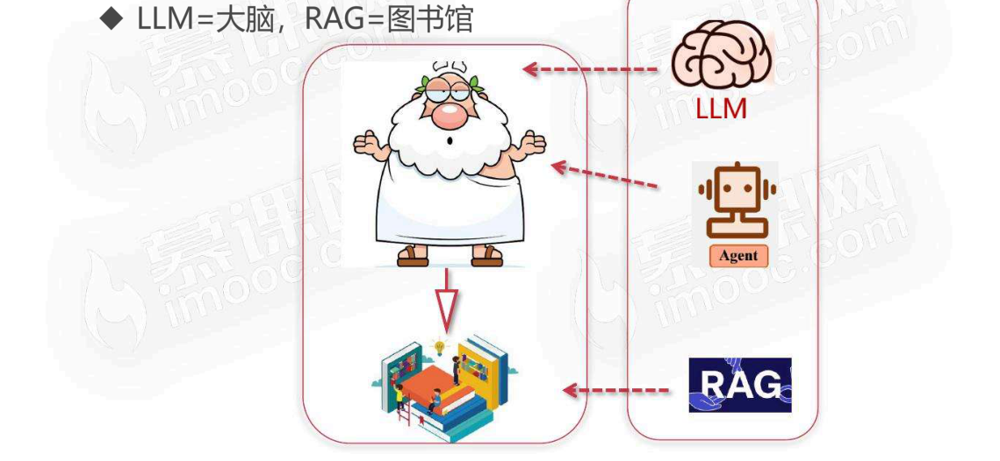

- LLM=大脑，RAG=图书馆

<!-- PDF 第 3 页 -->

### 外部知识与检索增强原理

- RAG为LLM提供了认知以外的知识

- 大语言模型（LLM）
  - 受限于训练预料，缺乏对领域知识和实时信息的认识
- 检索式增强生成（RAG）
  - 为大语言模型提供回答问题所需要的外部知识，减少大模型的幻觉
- 好处
  - RAG所提供的知识不需要改变LLM本身，只要把知识放在问题的上下文中，输入到LLM

<!-- PDF 第 4 页 -->

- RAG为LLM提供了认知以外的知识

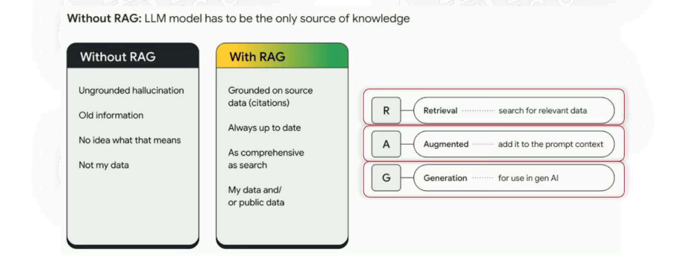

<!-- PDF 第 5 页 -->

### AI搜索、企业知识库与Agent

- RAG是除AI Agent以外最重要的LLM落地方向

- AI搜索
  - 搜索直接给出答案，将搜索到内容作为外部知识和问题一起输入到LLM（秘塔搜索/360搜索）

- 企业知识库
  - 让LLM充分利用企业内部知识，为企业赋能（智能客服/智能业务助理/智能运维）

- AI Agent
  - RAG本身也是Agent中的memory模块（长期记忆）

<!-- PDF 第 6 页 -->

## RAG是LLM最重要的落地场景

### 学术研究

- RAG在学术圈

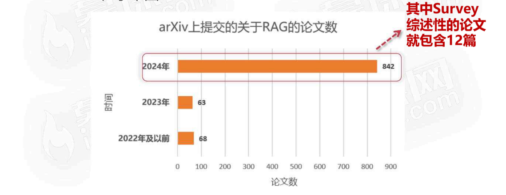

<!-- PDF 第 7 页 -->

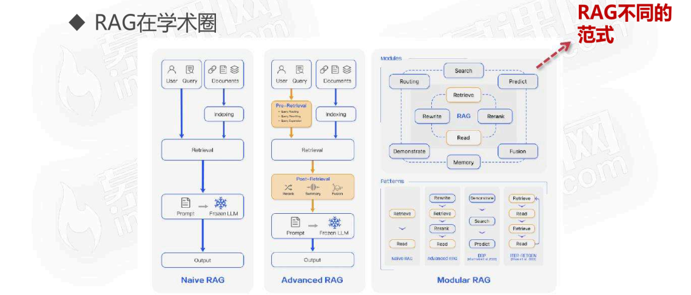

- RAG在学术圈

<!-- PDF 第 8 页 -->

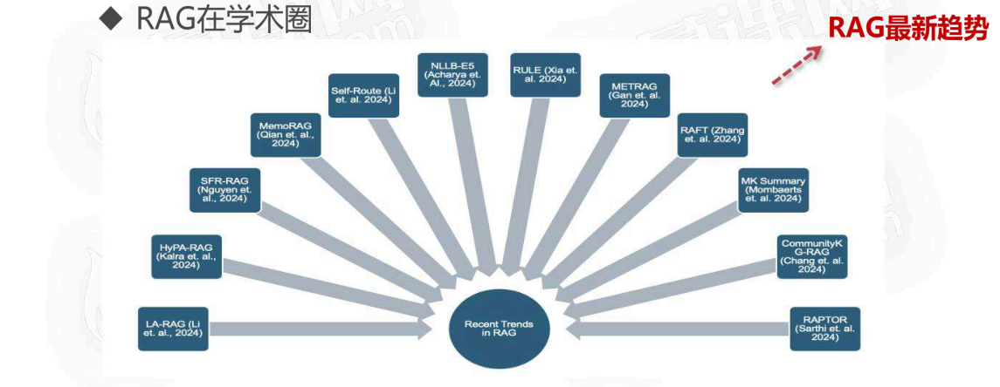

- RAG在学术圈

<!-- PDF 第 9 页 -->

- RAG在学术圈

Graph RAG

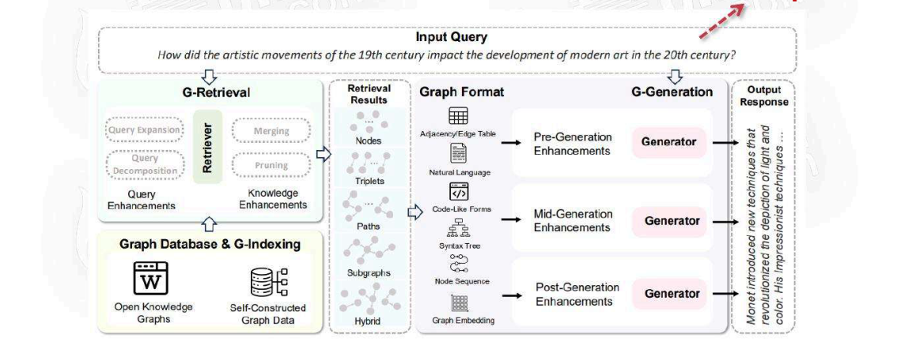

<!-- PDF 第 10 页 -->

### 企业应用

RAG主题占据近20%

- RAG在企业圈

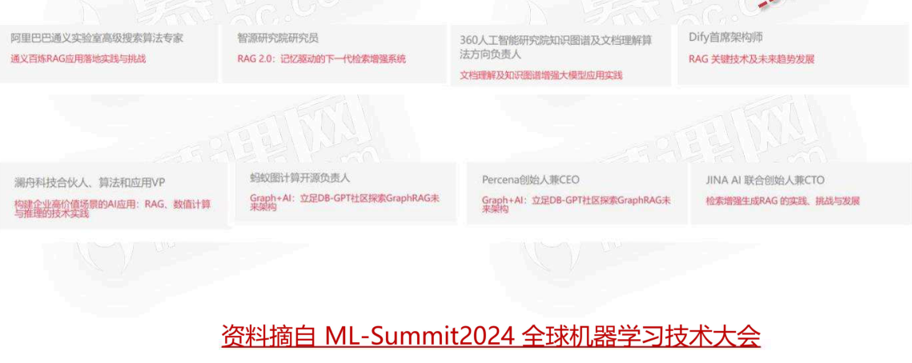

<!-- PDF 第 11 页 -->

- RAG在企业圈

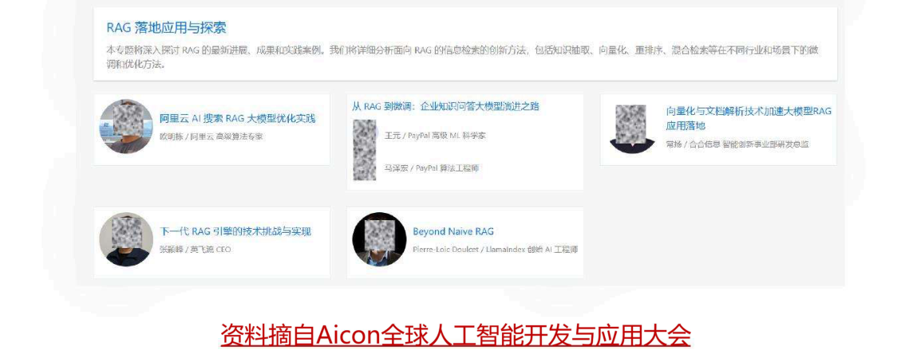

<!-- PDF 第 12 页 -->

AI办公

- RAG在企业圈

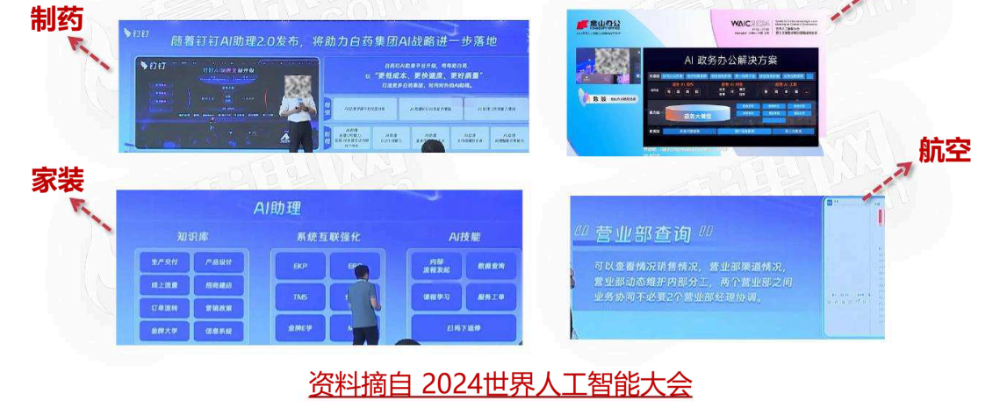

随著钉钉AI助理20发布，将助力白药集团AIb略进一步落地

<!-- PDF 第 13 页 -->

### 开源生态

- RAG在开源圈

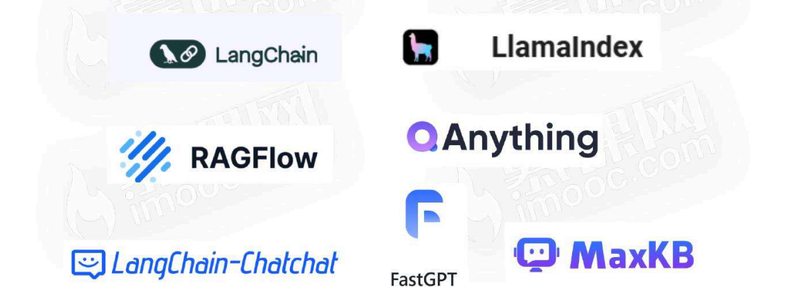

<!-- PDF 第 14 页 -->

## RAG岗位需求

### 岗位招聘需求

- RAG岗位需求

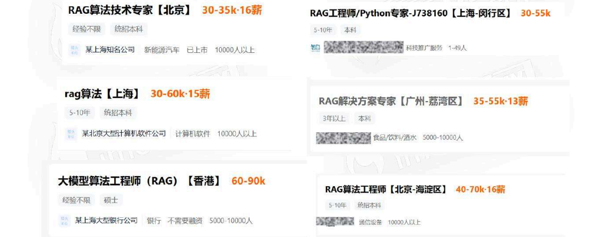

<!-- PDF 第 15 页 -->

- RAG岗位需求

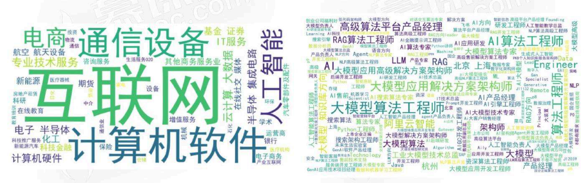

<!-- PDF 第 16 页 -->

### 岗位职责与能力要求

- RAG岗位人才要求

1. 负责RAG系统的产品规划和功能设计，包括知识库管理、检索优化、推理逻辑等核心功能。

2. 制定产品路线图，确定技术方向和功能优先级。

3. 深度参与产品架构方案设计，确保RAG知识库在应用场景的性能和用户体验持续优化。

4. 收集并分析用户需求，提出改进建议，推动产品迭代。

5. 设计产品交互流程，优化用户界面，提升产品易用性。

6. 参与设计RAG知识库的重排算法、入库算法等全链路开发环节，从产品角度设计测试方法和评估方案。

7. 协调各部门资源，推进产品开发进度，确保项目按时交付。

8. 跟踪行业动态，研究竞品，确保产品保持市场竞争力。

<!-- PDF 第 17 页 -->

## 课程内容和亮点

### 课程内容概览

- RAG全栈技术实战指南

- RAG技术细节
- 项目实战
- 项目软技能

<!-- PDF 第 18 页 -->

### RAG技术栈

- RAG全栈技术实战指南

- RAG技术细节
  - LLM大语言模型：基础token、transformer的知识、LLM训练过程，LLM技术演变、LLM涌现能力，如何为RAG挑选合适的LLM，以及不同的LLM调用方式
  - embedding模型：embedding特点和背后的技术架构，介绍主流embedding模型产品及其选型步骤、3种调用embedding方式和2种计算应用
  - Embedding数据库：详细介绍主流向量数据库chroma/milvus，深入探讨索引技术IVF/HNSW/PQ

<!-- PDF 第 19 页 -->

- RAG全栈技术实战指南

- RAG技术细节
  - 文本解析和分块：阐述下GIGO原则，多种文档格式文件解析（也包括RAGFlow中的deep-doc模块）以及文本分块技术（递归文本分块、语义分块）
  - RAG评估：RAG系统的关键；讲解评估的标准和自动评估框架ragas
  - 14种检索增强：6种查询增强，3种多索引增强，2种检索后增强：rerank重排和混合检索；以及模块增强：迭代增强生成和self-RAG自适应增强

<!-- PDF 第 20 页 -->

- RAG全栈技术实战指南

- RAG技术细节
  - RAG+Graph：将知识图谱KG引入RAG，学习通过neo4j构建graphRAG
  - RAG+Agent：基于ReAct agent思路实现RAG路由，使得可以通过用户的问题自动选择合适的RAG系统来响应用户的请求
  - RAG+微调：介绍LLM微调和embedding微调相关的技术

<!-- PDF 第 21 页 -->

### 实战项目：企业员工助手

- 课程项目：企业员工组手

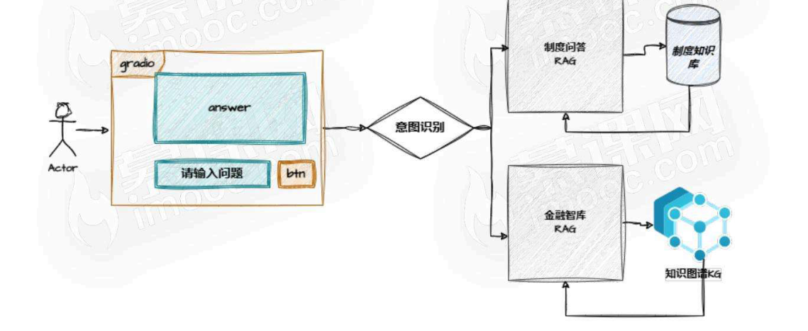

<!-- PDF 第 22 页 -->

- 课程项目：企业员工组手

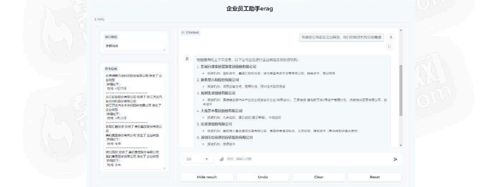

<!-- PDF 第 23 页 -->

### 项目软技能

- 项目软技能

- 项目软技能
  - LLM需求能力分析：不同项目角色需要对AI大模型的了解程度差异性分析
  - 企业应用开发要求：企业级应用的高可用性
  - 转变思想：AI应用开发和传统软件开发的区别

<!-- PDF 第 24 页 -->

- 项目软技能

- 项目软技能
  - 项目管理：企业里代码规范和代码管理
  - 自我提升：如何自我学习，跟进前沿技术
  - AI岗位面试技巧：知识和框架

<!-- PDF 第 25 页 -->

## 课程适合人群

- 适合人群

- 有一定的python基础
  - 课程中代码是通过python来实现，需要了解一些简单的python基础，课程中用到相关的库也会在课程中做一些讲解
- 想转型到AI应用开发的开发者
  - 可以从课程中学习到关于LLM、RAG、Agent、embedding、知识图谱等技术和实战，来提升AI应用开发能力，同时也了解AI应用开发过程的特殊性
- 抢先收获AI红利的开发者
  - LLM作为新质生产力，2024是AI应用的爆发年，而Agent、RAG是AI应用的主流落地方向

<!-- PDF 第 26 页 -->

## 课程学习方式

- 课程学习方式

- 技术原理学习
  - 学习RAG相关技术的底层逻辑

- 动手实践
  - AI应用开发最重要的就是躬身入局，理论+实践

- 答疑解惑
  - 对学员学习过程中遇到的问题进行答疑解惑

<!-- PDF 第 27 页 -->

## 讲师介绍

- 阿基米口

- AI领域10年从业经验
- 机器学习+CV+LLM
- AI模型训练和AI应用开发实战项目经验
- AI项目管理
- infoQ写作社区、阿里云开发者社区签约作者
