# 01提示词工程

## 目录

- [通义千问大模型接入](#page-001)
  - [本地部署与云端模型接入方式](#page-002)
  - [注册并认证阿里云百炼账号](#page-003)
  - [创建百炼 API Key](#page-004)
  - [安装 OpenAI SDK 并获取示例代码](#page-005)
  - [运行官方调试代码验证接入](#page-006)
  - [使用 dotenv 隐藏 API Key](#page-007)
  - [messages 结构与三种对话角色](#page-008)
- [代码调用云端大模型](#page-009)
  - [调用百炼模型的三个准备步骤](#page-010)
- [使用环境变量保护APIKEY](#page-012)
  - [环境变量与模型密钥配置](#page-013)
- [Ollama简介](#page-015)
  - [Ollama 的用途与本地部署优势](#page-016)
  - [Ollama模型库](#page-017)
  - [Ollama 的模型管理与两种访问方式](#page-018)
- [Windows/Mac系统部署Ollama](#page-020)
  - [下载安装 Ollama 并运行模型](#page-021)
- [Ollama的基础命令](#page-023)
  - [查看、下载和运行本地模型](#page-024)
- [代码调用Ollama的本地模型](#page-025)
  - [修改接入地址和模型名称以调用 Ollama](#page-026)
- [OpenAI库的基础使用](#page-027)
  - [OpenAI SDK 的作用与调用流程](#page-028)
  - [创建客户端：密钥与接入地址](#page-029)
  - [调用模型：model 与 messages 参数](#page-030)
  - [读取 ChatCompletion 中的回答内容](#page-031)
  - [OpenAI 模型调用完整示例](#page-032)
- [OpenAI库的流式输出](#page-034)
  - [开启 stream 并逐段读取模型输出](#page-035)
- [OpenAI库附带历史消息调用模型](#page-036)
  - [通过 messages 传入历史对话](#page-037)
- [LLM介绍](#page-039)
  - [大语言模型的定义与发展脉络](#page-040)
  - [语言模型 (Language Model, LM)](#page-041)
  - [LLM主要类别架构](#page-042)
  - [自编码模型 (AutoEncoder model，AE)](#page-043)
  - [自回归模型 (Autoregressive model，AR)](#page-044)
  - [序列到序列（Sequence to Sequence Model）](#page-045)
- [主流LLM介绍](#page-047)
  - [不同模型规模的资源需求对比](#page-048)
  - [LLaMA模型](#page-049)
  - [ChatGLM模型](#page-050)
  - [Qwen模型](#page-051)
  - [DeepSeek模型](#page-052)
- [大模型prompt工程指南](#page-054)
  - [提示词工程概念](#page-055)
  - [技巧一：详细描述需求](#page-056)
  - [技巧二：指定模型角色](#page-057)
  - [技巧三：使用分隔符划分输入](#page-058)
  - [技巧四：明确任务执行步骤](#page-059)
  - [技巧五：提供参考示例](#page-060)
  - [使用参考文本作答，减少模型幻觉](#page-061)
- [提示词实战案例介绍](#page-063)
  - [金融文本任务与提示词优化方法](#page-064)
  - [Zero-shot思想](#page-065)
  - [Few-shot思想](#page-066)
- [提示词实战案例 LLM实现金融文本分类](#page-068)
  - [LLM文本分类任务介绍](#page-069)
  - [文本分类的 Few-shot 提示词设计](#page-070)
  - [准备分类标签、示例与待分类文本](#page-071)
  - [构建分类任务的历史消息列表](#page-072)
  - [调用 Qwen 执行文本分类](#page-073)
- [Json数据格式](#page-074)
  - [JSON 的用途与文本格式对比](#page-075)
  - [JSON 对象与数组的结构](#page-076)
  - [Python中使用Json](#page-077)
- [提示词实战案例 LLM实现金融文本信息抽取](#page-079)
  - [LLM信息抽取任务介绍](#page-080)
  - [信息抽取的 Few-shot 提示词设计](#page-081)
  - [定义金融实体 Schema 与抽取示例](#page-082)
  - [构建信息抽取的历史消息](#page-083)
  - [清洗模型响应并解析 JSON](#page-084)
  - [封装信息抽取的 Qwen 调用函数](#page-085)
  - [执行信息抽取并展示结果](#page-086)
  - [练习彩票信息抽取作业](#page-087)
- [提示词实战案例 LLM实现金融文本匹配](#page-088)
  - [LLM信息文本匹配任务介绍](#page-089)
  - [文本匹配的 Few-shot 提示词设计](#page-090)
  - [准备文本匹配的工具与样本](#page-091)
  - [构建文本匹配提示词](#page-092)
  - [封装文本匹配的模型调用](#page-093)
  - [执行文本匹配并查看输出](#page-094)
- [课后作业](#page-095)
  - [提示词优化作业](#page-096)

<a id="page-001"></a>

## 通义千问大模型接入

<!-- PDF 第 1 页 -->

当前章节：《前置准备》

高 级 数 字 化 人 才 培 训 专 家

<details>
<summary>第 1 页原图</summary>


</details>

<a id="page-002"></a>

### 本地部署与云端模型接入方式

<!-- PDF 第 2 页 -->

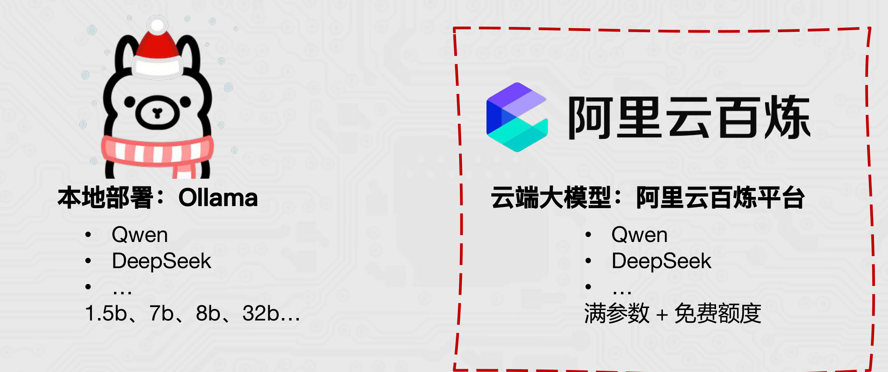

高 级 数 字 化 人 才 培 训 专 家

<details>
<summary>第 2 页原图</summary>

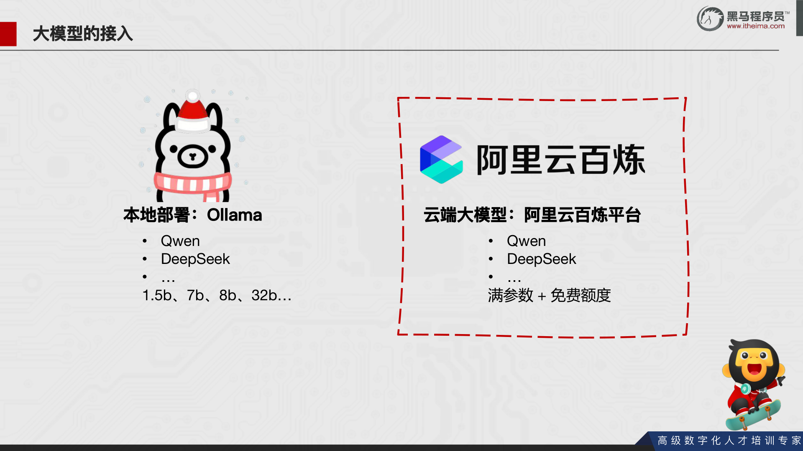

</details>

<a id="page-003"></a>

### 注册并认证阿里云百炼账号

<!-- PDF 第 3 页 -->

接入通义千问大模型：进入阿里云的百炼大模型平台， 完成注册，登录，实名（使用支付宝扫一下）。

高 级 数 字 化 人 才 培 训 专 家

<details>
<summary>第 3 页原图</summary>

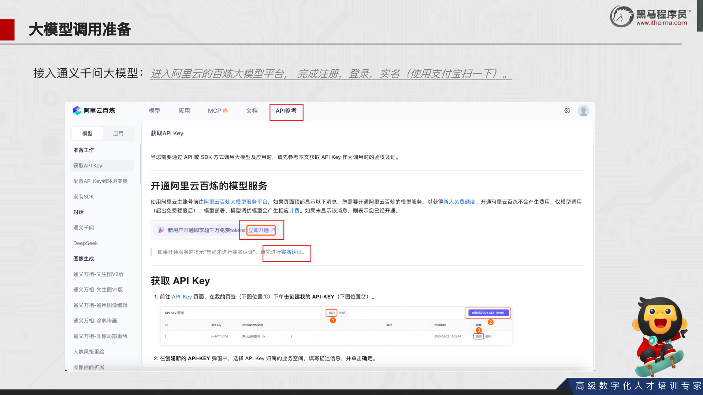

</details>

<a id="page-004"></a>

### 创建百炼 API Key

<!-- PDF 第 4 页 -->

创建API KEY：

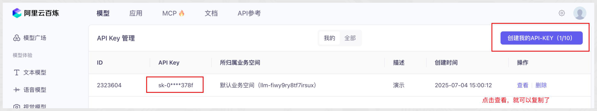

高 级 数 字 化 人 才 培 训 专 家

<details>
<summary>第 4 页原图</summary>

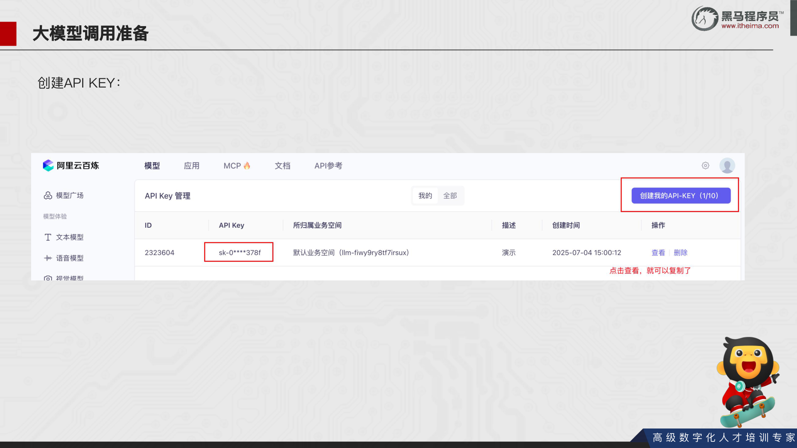

</details>

<a id="page-005"></a>

### 安装 OpenAI SDK 并获取示例代码

<!-- PDF 第 5 页 -->

安装SDK测试代码：

~~~~
# 基于pip安装openai库
pip install openai
~~~~

如图所示，获取测试代码

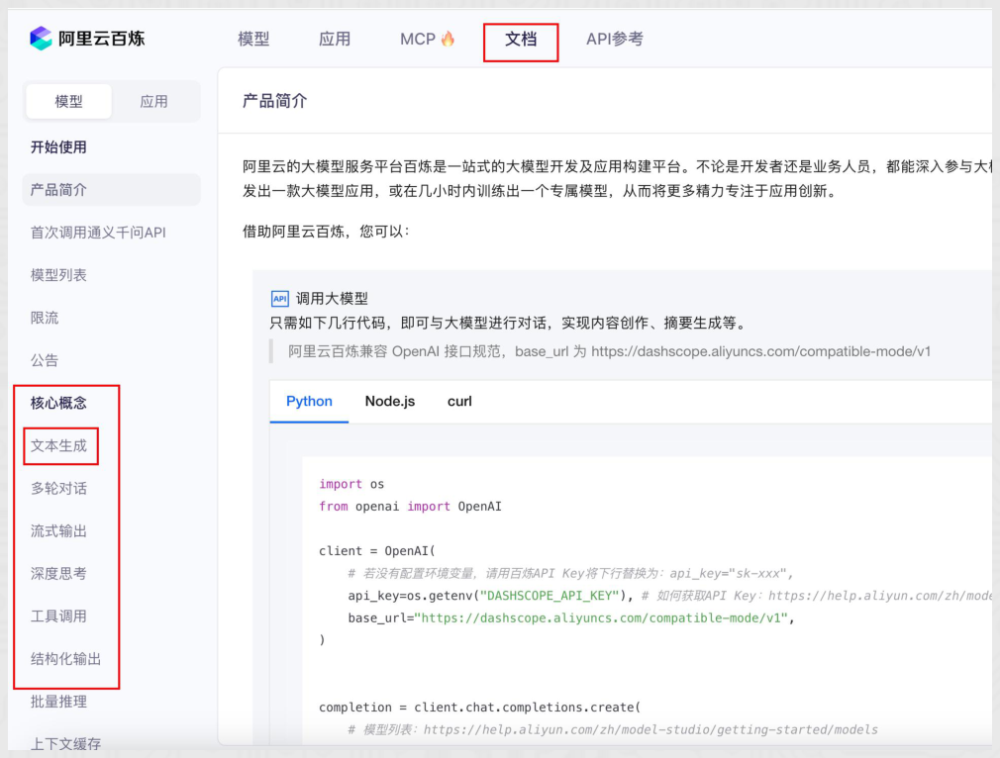

高 级 数 字 化 人 才 培 训 专 家

<details>
<summary>第 5 页原图</summary>

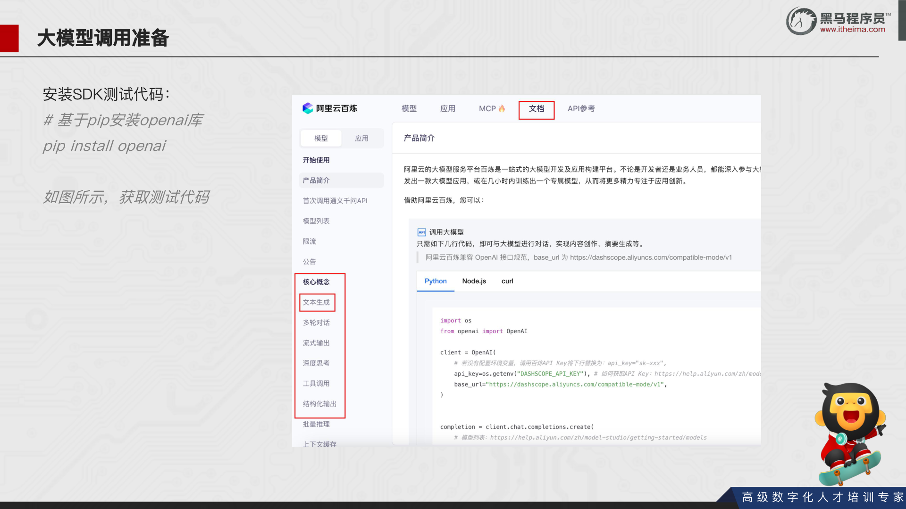

</details>

<a id="page-006"></a>

### 运行官方调试代码验证接入

<!-- PDF 第 6 页 -->

验证：复制并指向官方提供的调试代码

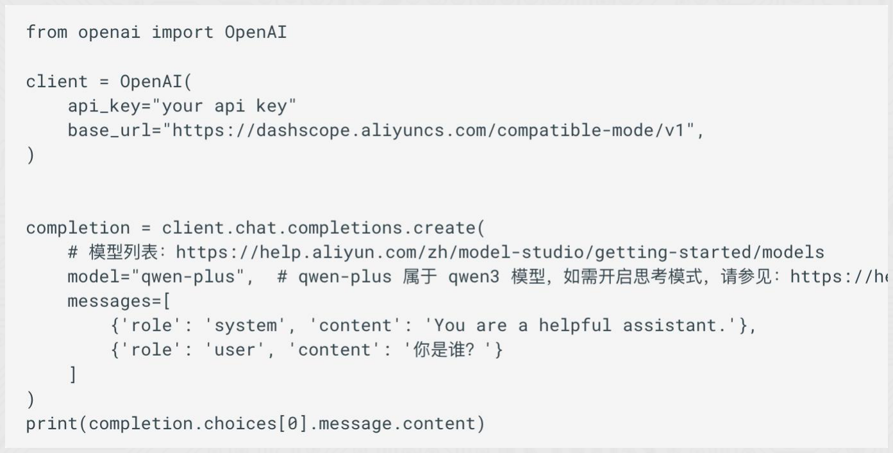

高 级 数 字 化 人 才 培 训 专 家

<details>
<summary>第 6 页原图</summary>

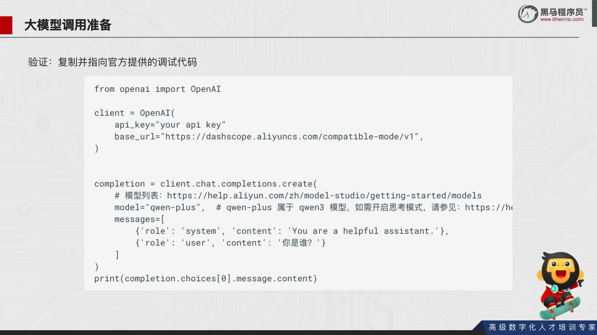

</details>

<a id="page-007"></a>

### 使用 dotenv 隐藏 API Key

<!-- PDF 第 7 页 -->

安全优化：为避免在代码中明文出现APIKEY，可以使用dotenv库改造代码隐藏APIKEY

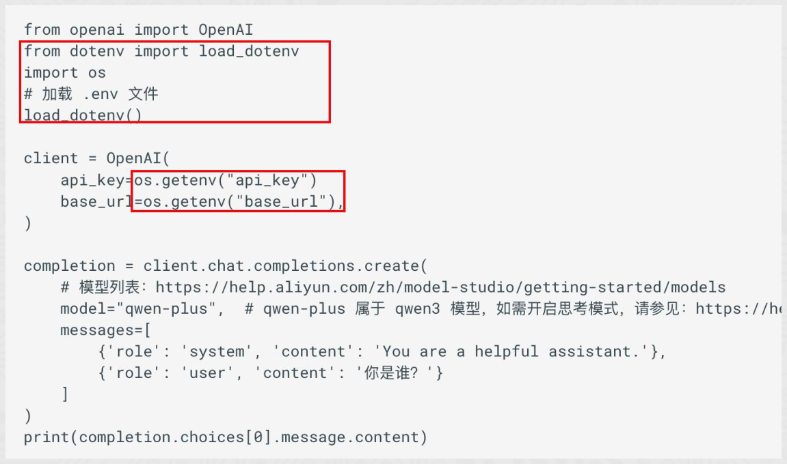

高 级 数 字 化 人 才 培 训 专 家

<details>
<summary>第 7 页原图</summary>

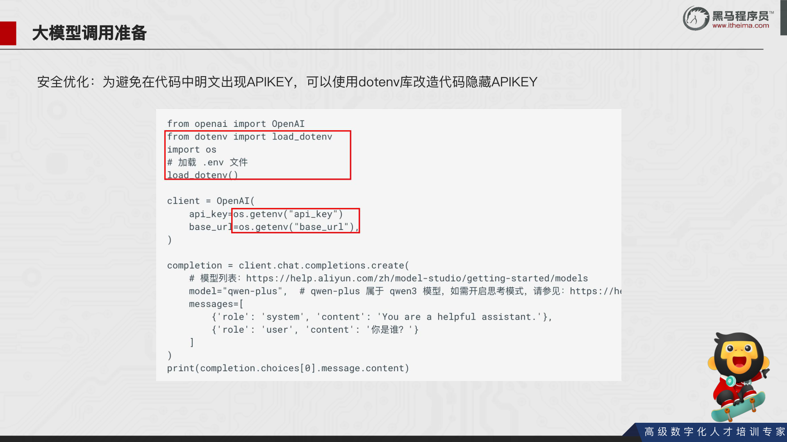

</details>

<a id="page-008"></a>

### messages 结构与三种对话角色

<!-- PDF 第 8 页 -->

前文代码的messages是一个list，内嵌了多个字典。可以发现字典的结构是：{‘role’: ... , ‘content’: ...}

其中role表示的是角色，content表示的是内容。

在chat 大语言模型中，user、assistant、system 是三种核心角色，它们的定位和功能不同，共同构成对话的上下文结构。

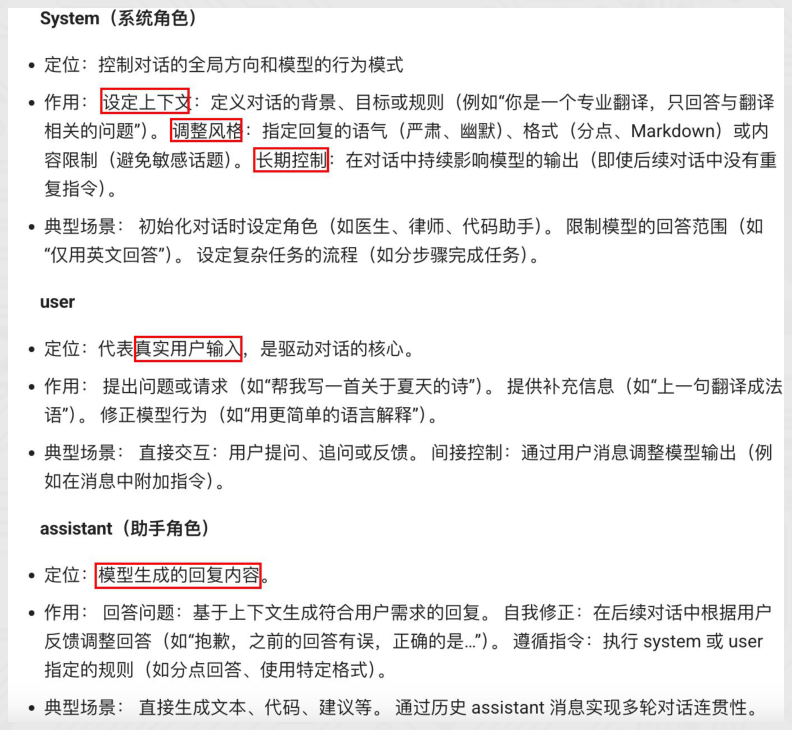

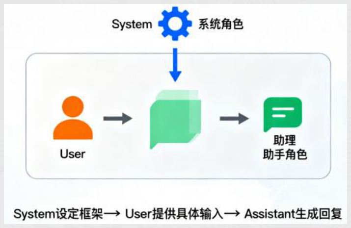

高 级 数 字 化 人 才 培 训 专 家

<details>
<summary>第 8 页原图</summary>

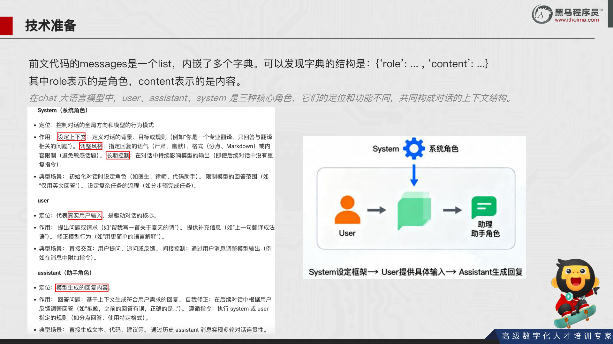

</details>

<a id="page-009"></a>

## 代码调用云端大模型

<!-- PDF 第 9 页 -->

当前章节：《前置准备》

高 级 数 字 化 人 才 培 训 专 家

<details>
<summary>第 9 页原图</summary>


</details>

<a id="page-010"></a>

### 调用百炼模型的三个准备步骤

<!-- PDF 第 10 页 -->

通过代码调用阿里云百炼平台上的模型很简单，仅需要：

- 阿里云百炼平台上，创建API-KEY

- 通过pip为Python程序提供 OpenAI 库: pip install openai

- 编写代码测试（可从百炼平台官网复制代码，直接执行）

高 级 数 字 化 人 才 培 训 专 家

<details>
<summary>第 10 页原图</summary>

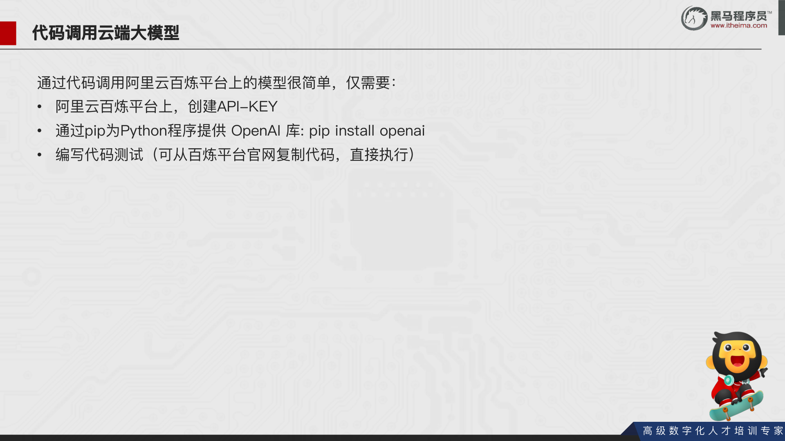

</details>

<a id="page-011"></a>

### 代码调用云端大模型小结

<!-- PDF 第 11 页 -->

通过代码调用阿里云百炼平台大模型，主要动作

- 准备好API-KEY

- 安装openai库

- 复制官网示例代码并执行（可在代码中替换需要
    调用的模型）

高 级 数 字 化 人 才 培 训 专 家

<details>
<summary>第 11 页原图</summary>

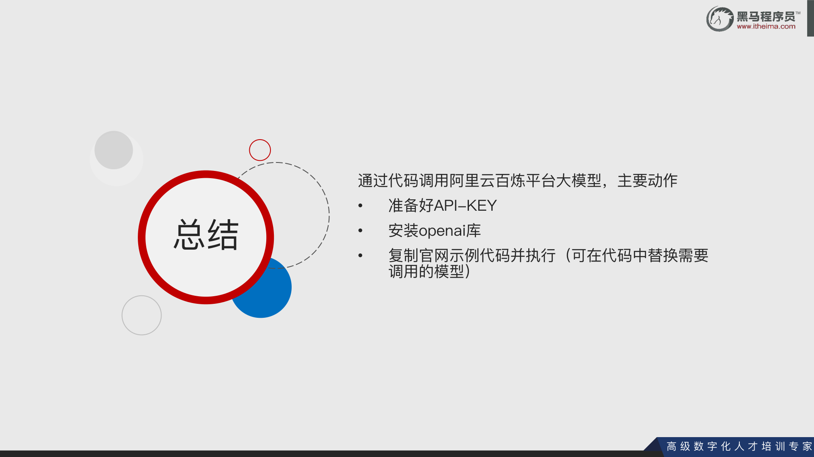

</details>

<a id="page-012"></a>

## 使用环境变量保护APIKEY

<!-- PDF 第 12 页 -->

当前章节：《前置准备》

高 级 数 字 化 人 才 培 训 专 家

<details>
<summary>第 12 页原图</summary>


</details>

<a id="page-013"></a>

### 环境变量与模型密钥配置

<!-- PDF 第 13 页 -->

如下代码，将APIKEY明文显示在代码中，是有很大的安全隐患的。我们可以通过环境变量来隐藏明文
APIKEY。

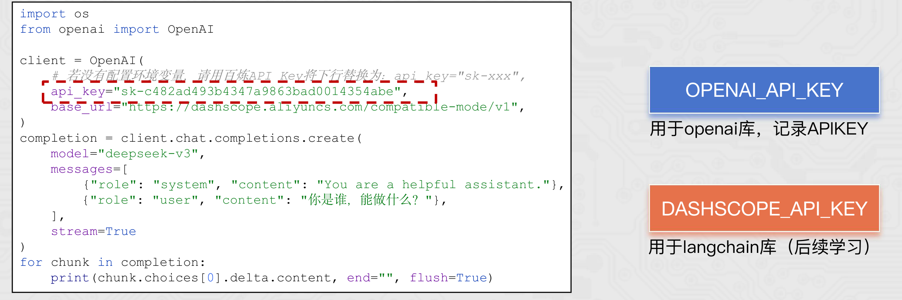

高 级 数 字 化 人 才 培 训 专 家

<details>
<summary>第 13 页原图</summary>

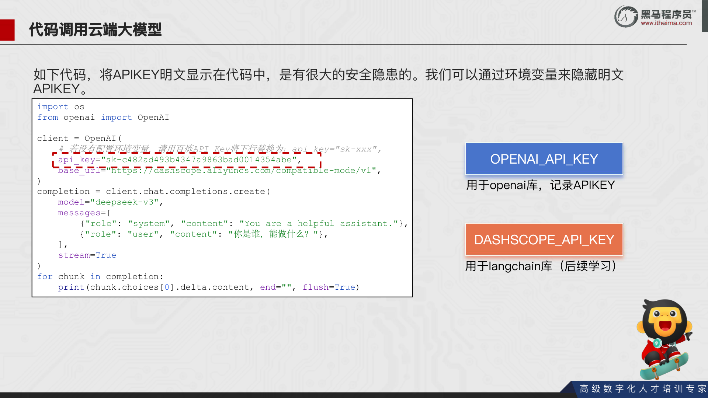

</details>

<a id="page-014"></a>

### 使用环境变量保护APIKEY小结

<!-- PDF 第 14 页 -->

- 将APIKEY暴露在代码中是不合理的

- 可以通过环境变量：OPENAI\_API\_KEY和
    DASHSCOPE\_API\_KEY记录值，代码会自动读取变量从而
    获取值

- Windows系统通过图形化界面配置环境变量

- Mac系统在终端内修改 .zshrc 文件添加环境变量
    - export OPENAI\_API\_KEY=xxx
    - export DASHSCOPE\_API\_KEY=xxx

- 配置完成后，重启PyCharm生效（如不生效可以重启电脑）

高 级 数 字 化 人 才 培 训 专 家

<details>
<summary>第 14 页原图</summary>

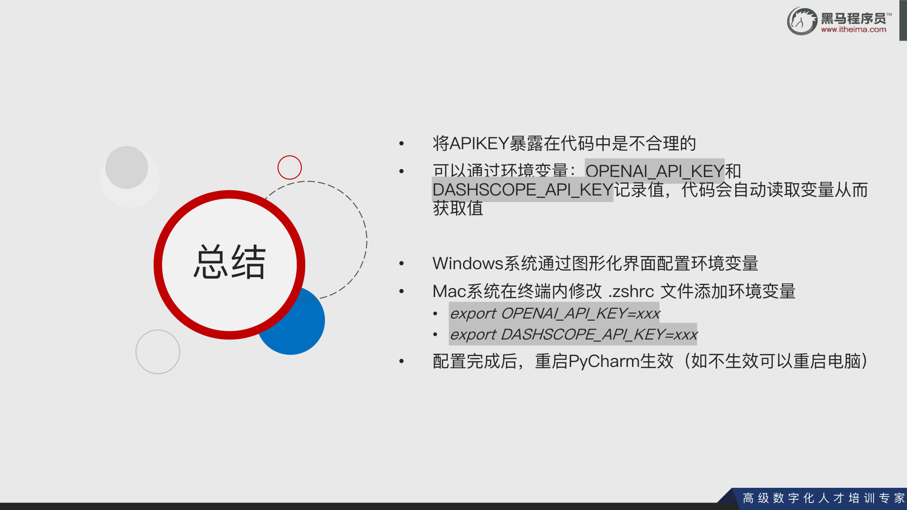

</details>

<a id="page-015"></a>

## Ollama简介

<!-- PDF 第 15 页 -->

当前章节：《前置准备》

高 级 数 字 化 人 才 培 训 专 家

<details>
<summary>第 15 页原图</summary>

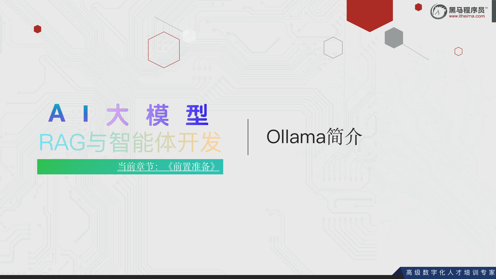

</details>

<a id="page-016"></a>

### Ollama 的用途与本地部署优势

<!-- PDF 第 16 页 -->

为了避免未来阿里云免费额度到期或不提供免费活动导致的无法开发，课程额外补
充：

基于Ollama部署本地模型，供代码调用。

PS：此为备用方案，课程主体还是基于阿里云百炼平台做开发。

ollama：是一款旨在简化大型语言模型本地部署和运行过程的开源软件。

- ollama提供了一个轻量级、易于扩展的框架，让开发者能够在本地机器上轻松构
    建和管理LLMs（大型语言模型）

- 通过ollama，开发者可以导入和定制自己的模型，无需关注复杂的底层实现细节。

- 网址：https://ollama.com

简单来说可以认为是阿里云百炼平台的本地版，在自己电脑上部署和运行大模型，
由自己电脑的硬件提供算力支撑模型运行。


高 级 数 字 化 人 才 培 训 专 家

<details>
<summary>第 16 页原图</summary>

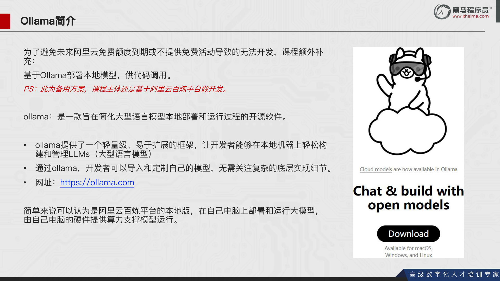

</details>

<a id="page-017"></a>

### Ollama模型库

<!-- PDF 第 17 页 -->

ollama 支持多种开源模型，涵盖文本生成、代码生成、多模态推理等场
景。用户可以根据需求选择合适的模型，并通过简单的命令行操作在本地
运行。

ollama 官方模型库: https://ollama.com/library

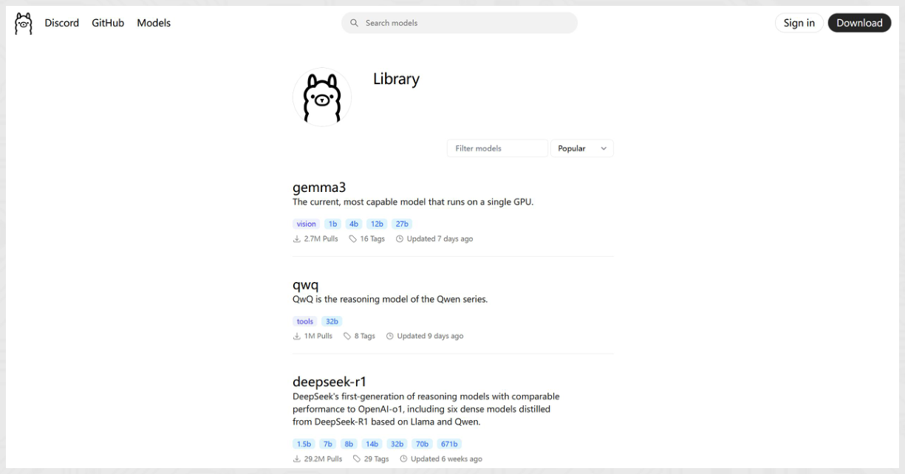


高 级 数 字 化 人 才 培 训 专 家

<details>
<summary>第 17 页原图</summary>

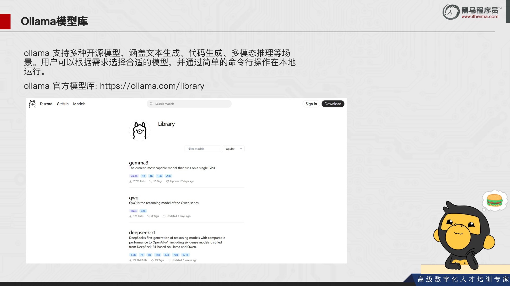

</details>

<a id="page-018"></a>

### Ollama 的模型管理与两种访问方式

<!-- PDF 第 18 页 -->

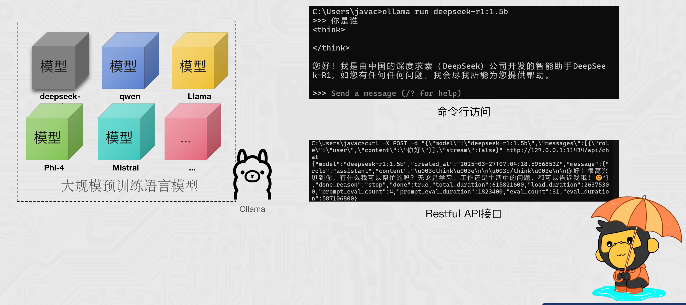

高 级 数 字 化 人 才 培 训 专 家

<details>
<summary>第 18 页原图</summary>

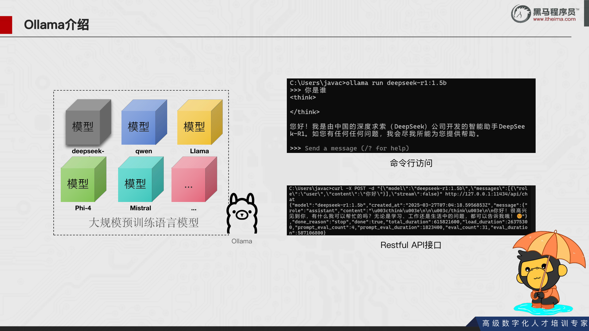

</details>

<a id="page-019"></a>

### Ollama简介小结

<!-- PDF 第 19 页 -->

1. ollama是什么?

是一款旨在简化大型语言模型本地部署和运行过程的开源软件。

2. 如何查看ollama支持的模型?

通过ollama 官方模型库: https://ollama.com/library

- deepseek-r1,qwen等模型均有提供

高 级 数 字 化 人 才 培 训 专 家

<details>
<summary>第 19 页原图</summary>

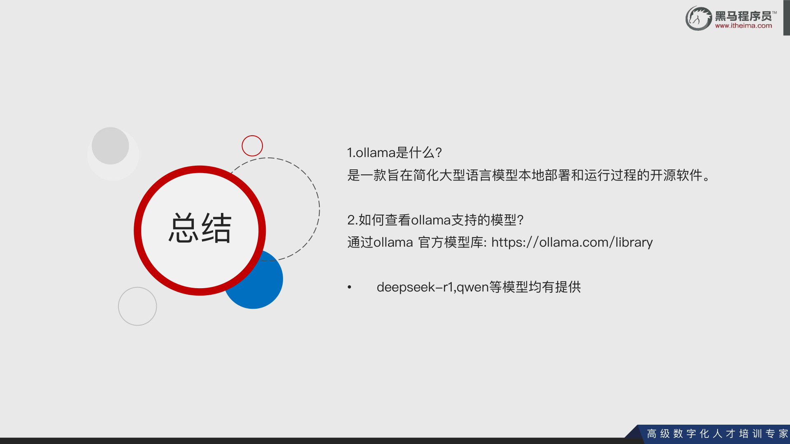

</details>

<a id="page-020"></a>

## Windows/Mac系统部署Ollama

<!-- PDF 第 20 页 -->

当前章节：《前置准备》

高 级 数 字 化 人 才 培 训 专 家

<details>
<summary>第 20 页原图</summary>


</details>

<a id="page-021"></a>

### 下载安装 Ollama 并运行模型

<!-- PDF 第 21 页 -->

Ollama的部署还是很简单的，只需要进入官方网站点击Download按钮下载安装。

安装完成后，通过命令：

- ollama run 模型名称

即可运行对应的模型，并在命令行内做交互。


高 级 数 字 化 人 才 培 训 专 家

<details>
<summary>第 21 页原图</summary>

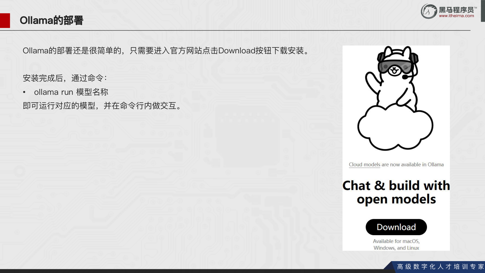

</details>

<a id="page-022"></a>

### Windows/Mac系统部署Ollama小结

<!-- PDF 第 22 页 -->

1. Ollama部署：在官网下载并安装客户端即可。

2. 蒸馏模型就是对标准大模型核心技能的学习，并进行瘦身，从而获
    得更低的性能要求。 简单来说蒸馏模型就是标准大模型的学生，学
    到了老师的核心本领，但没有老师强。根据参数量的不同，参数量
    越大，蒸馏模型学到老师核心本领就越扎实，性能越好。

3. 参数量选择：

- 集显：1.5b左右

- 4G独显：8b以内

- 8G独显：14b以内

- …具体可以自己试一试

- 参数量越大对硬件要求越高，如果硬件能力不足，模型运算和吐
    字速度会下降。

高 级 数 字 化 人 才 培 训 专 家

<details>
<summary>第 22 页原图</summary>

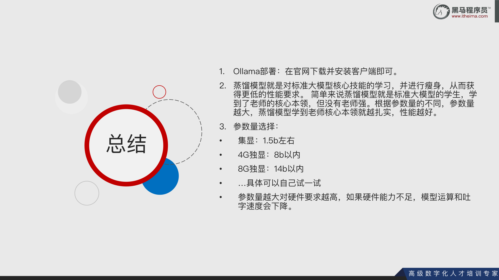

</details>

<a id="page-023"></a>

## Ollama的基础命令

<!-- PDF 第 23 页 -->

当前章节：《前置准备》

高 级 数 字 化 人 才 培 训 专 家

<details>
<summary>第 23 页原图</summary>

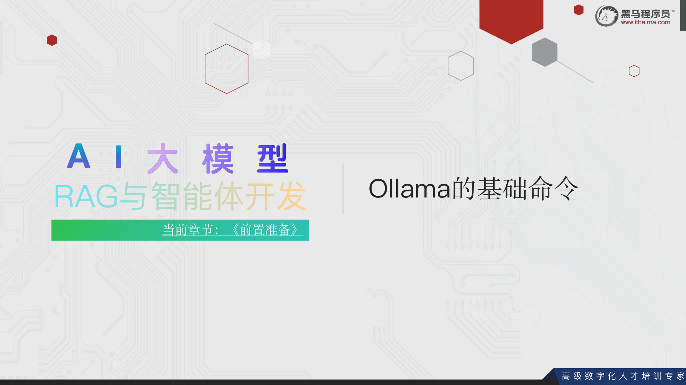

</details>

<a id="page-024"></a>

### 查看、下载和运行本地模型

<!-- PDF 第 24 页 -->

完成Ollama的部署和使用后，后续如果要管理电脑中的模型，可以使用Ollama命令。

主要介绍如下几个命令：

- ollama list：列出当前已下载的模型

- ollama pull 模型名称：联网下载指定的模型

- ollama run 模型名称：运行指定的模型（如不存在会先下载）

- ollama –-help：查看其它可用的命令帮助

PS：上述命令操作，请先运行Ollama

PS：上述命令操作，Windows系统和Mac系统通用


高 级 数 字 化 人 才 培 训 专 家

<details>
<summary>第 24 页原图</summary>

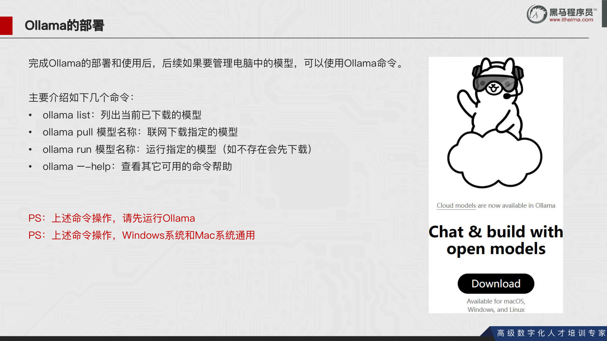

</details>

<a id="page-025"></a>

## 代码调用Ollama的本地模型

<!-- PDF 第 25 页 -->

当前章节：《前置准备》

高 级 数 字 化 人 才 培 训 专 家

<details>
<summary>第 25 页原图</summary>


</details>

<a id="page-026"></a>

### 修改接入地址和模型名称以调用 Ollama

<!-- PDF 第 26 页 -->

使用代码调用Ollama的本地模型还是很简单的，只需要将原有代码进行简单改动即可。

~~~~
from openai import OpenAI
client = OpenAI(
    base_url="https://dashscope.aliyuncs.com/compatible-mode/v1",
)
completion = client.chat.completions.create(
    model="deepseek-v3",
    messages=[
        {"role": "system", "content": "You are a helpful assistant."},
        {"role": "user", "content": "你是谁，能做什么？"},
    ],
    stream=True
)
for chunk in completion:
    print(chunk.choices[0].delta.content, end="", flush=True)
 
~~~~

- 将base\_url改为：http://localhost:11434/v1

- 将model改为对应本地模型名称，如：qwen3:4b

高 级 数 字 化 人 才 培 训 专 家

<details>
<summary>第 26 页原图</summary>

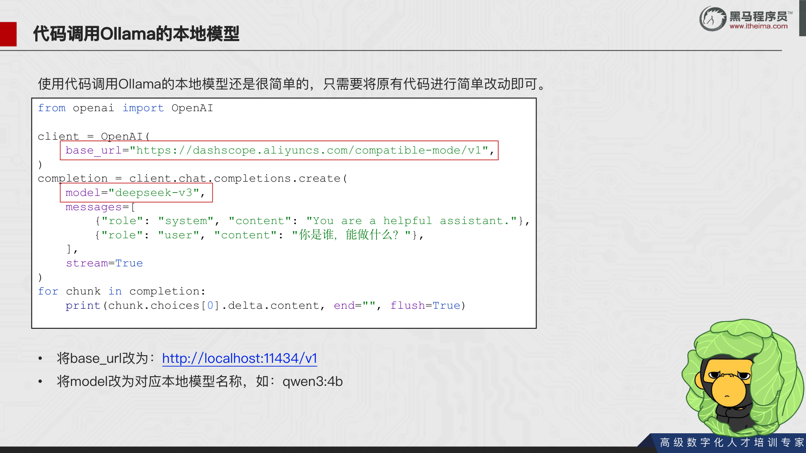

</details>

<a id="page-027"></a>

## OpenAI库的基础使用

<!-- PDF 第 27 页 -->

当前章节：《Python OpenAI库入门》

高 级 数 字 化 人 才 培 训 专 家

<details>
<summary>第 27 页原图</summary>

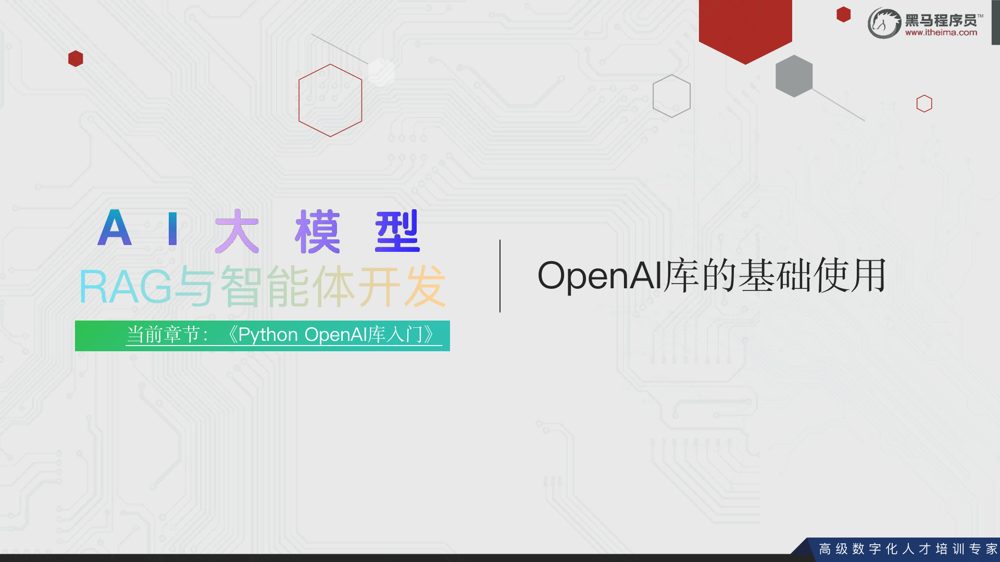

</details>

<a id="page-028"></a>

### OpenAI SDK 的作用与调用流程

<!-- PDF 第 28 页 -->

OpenAI库是OpenAI官方推出的Python SDK，核心作用是让开发者能简单、高效地调用 OpenAI 的各类 API（如 GPT 聊天、
DALL・E 绘图、语音转文字等），无需手动处理 HTTP 请求、身份验证等底层细节。

由于其发布较早且比较易用，现如今许多模型服务商（如阿里云百炼平台）均兼容OpenAI SDK的调用。


高 级 数 字 化 人 才 培 训 专 家

<details>
<summary>第 28 页原图</summary>

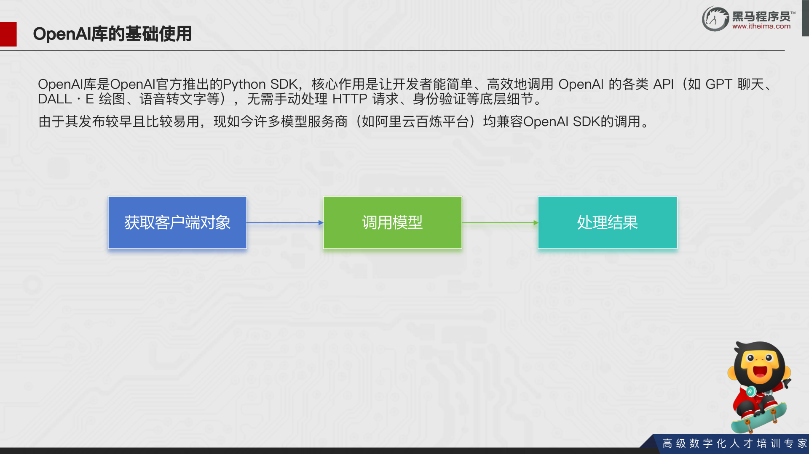

</details>

<a id="page-029"></a>

### 创建客户端：密钥与接入地址

<!-- PDF 第 29 页 -->

获取客户端对象

~~~~
from openai import OpenAI
 
client: OpenAI = OpenAI(
    api_key="your_api_key_here", 
    base_url="https://dashscope.aliyuncs.com/compatible-mode/v1"
)
~~~~

主要是用如上2个参数：
- api\_key：模型服务商提供的APIKEY密钥
- base\_url：模型服务商的API接入地址

    - 主要基于此参数来切换不同的模型服务商（如OpenAI、阿
        里云、腾讯云等）


高 级 数 字 化 人 才 培 训 专 家

<details>
<summary>第 29 页原图</summary>

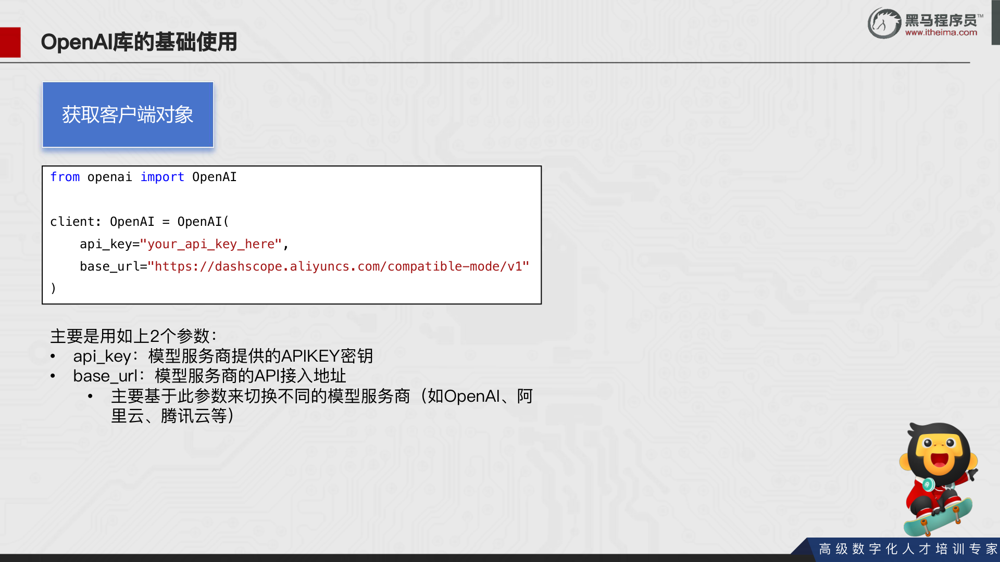

</details>

<a id="page-030"></a>

### 调用模型：model 与 messages 参数

<!-- PDF 第 30 页 -->

调用模型

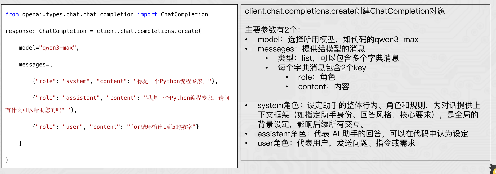

高 级 数 字 化 人 才 培 训 专 家

<details>
<summary>第 30 页原图</summary>

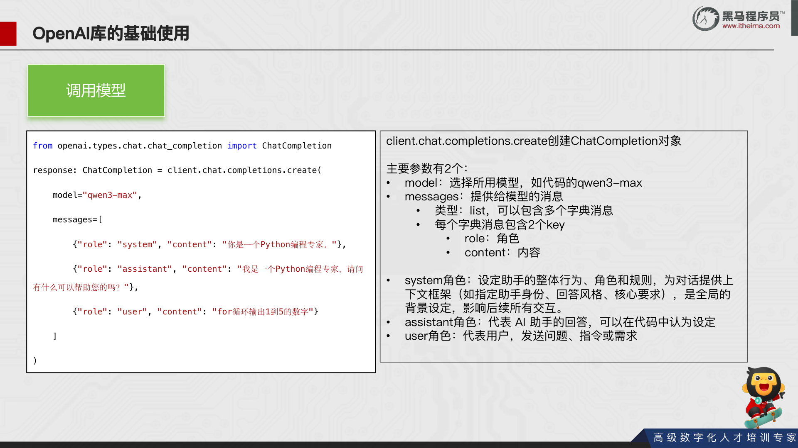

</details>

<a id="page-031"></a>

### 读取 ChatCompletion 中的回答内容

<!-- PDF 第 31 页 -->

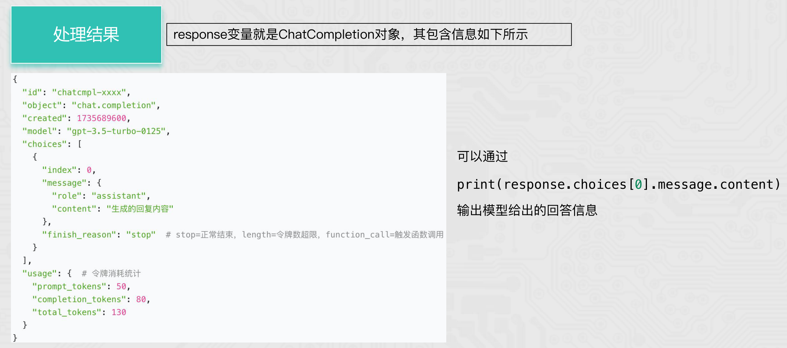

高 级 数 字 化 人 才 培 训 专 家

<details>
<summary>第 31 页原图</summary>

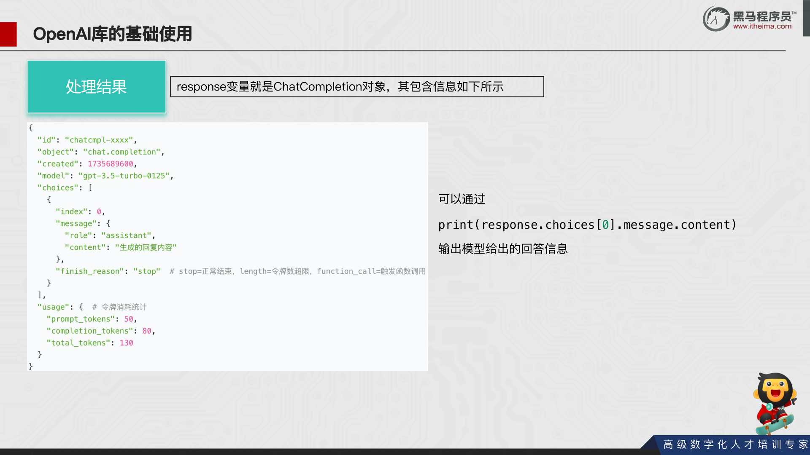

</details>

<a id="page-032"></a>

### OpenAI 模型调用完整示例

<!-- PDF 第 32 页 -->

完整的基础代码

~~~~
from openai import OpenAI
from openai.types.chat.chat_completion import ChatCompletion
 
client: OpenAI = OpenAI( 
    base_url="https://dashscope.aliyuncs.com/compatible-mode/v1"
)
 
response: ChatCompletion = client.chat.completions.create(
    model="qwen3-max",
    messages=[
        {"role": "system", "content": "你是一个Python编程专家。"}, 
        {"role": "assistant", "content": "我是一个Python编程专家。请问有什么可以帮助您的吗？
"},
        {"role": "user", "content": "for循环输出1到5的数字"}
    ]
)
 
print(response.choices[0].message.content)
~~~~


高 级 数 字 化 人 才 培 训 专 家

<details>
<summary>第 32 页原图</summary>

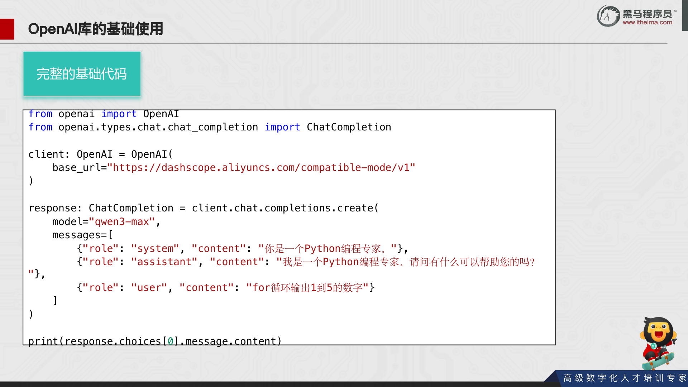

</details>

<a id="page-033"></a>

### OpenAI库的基础使用小结

<!-- PDF 第 33 页 -->

OpenAI库是OpenAI公司发布的Python SDK，方便与编程调用
其产品，现许多模型服务商都兼容OpenAI SDK的调用。

使用主要就3个流程：

- 创建客户端对象（OpenAI类对象）

~~~~
•
和模型对话（ client.chat.completions.create ），可以提供3
个角色使用
•
system：设定模型的行为和规则
•
assistant：设定模型的回答，由用户设定
•
user：用户的提问
•
处理结果：response.choices[0].message.content
~~~~

高 级 数 字 化 人 才 培 训 专 家

<details>
<summary>第 33 页原图</summary>

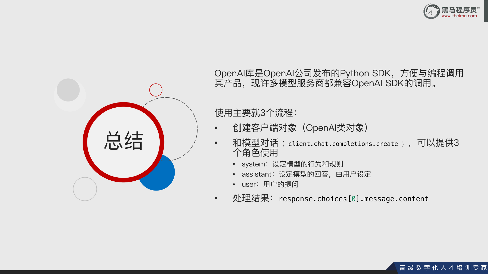

</details>

<a id="page-034"></a>

## OpenAI库的流式输出

<!-- PDF 第 34 页 -->

当前章节：《Python OpenAI库入门》

高 级 数 字 化 人 才 培 训 专 家

<details>
<summary>第 34 页原图</summary>


</details>

<a id="page-035"></a>

### 开启 stream 并逐段读取模型输出

<!-- PDF 第 35 页 -->

可以设定结果输出为stream模式（流式输出），获得更好的使用体验。

开启流式输出主要就2步：

1. 在client.chat.completions.create()调用模型的时候设定参数：stream=True

2. for循环response对象，并在循环内输出内容

~~~~
from openai import OpenAI
from openai.types.chat.chat_completion import ChatCompletion
 
client: OpenAI = OpenAI( 
    base_url="https://dashscope.aliyuncs.com/compatible-mode/v1"
)
 
response: ChatCompletion = client.chat.completions.create(
    model="qwen3-max",
    messages=[
        {"role": "system", "content": "你是一个Python编程专家。"}, 
        {"role": "assistant", "content": "我是一个Python编程专家。请问有什么可以帮助您的吗？"},
        {"role": "user", "content": "for循环输出1到5的数字"}
    ], 
    stream=True     # 开启流式输出功能
)
 
for chunk in response:
    if chunk.choices[0].delta.content:
        print(chunk.choices[0].delta.content, end='', flush=True)
~~~~

高 级 数 字 化 人 才 培 训 专 家

<details>
<summary>第 35 页原图</summary>

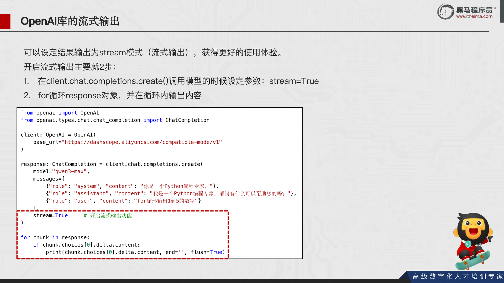

</details>

<a id="page-036"></a>

## OpenAI库附带历史消息调用模型

<!-- PDF 第 36 页 -->

当前章节：《Python OpenAI库入门》

高 级 数 字 化 人 才 培 训 专 家

<details>
<summary>第 36 页原图</summary>

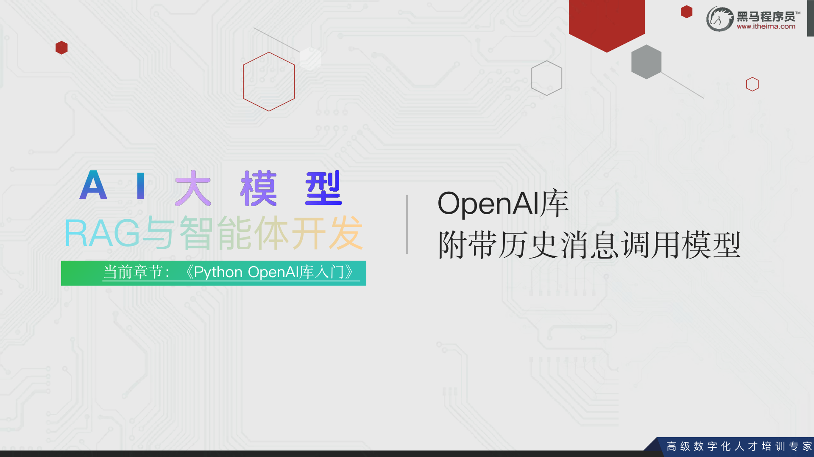

</details>

<a id="page-037"></a>

### 通过 messages 传入历史对话

<!-- PDF 第 37 页 -->

调用模型传入的参数messages，其要求是list对象，即表明其支持非常多的消息在内。

我们可以基于此，将历史消息填入，让模型知晓对话的上下文，更好的回答

~~~~
from openai import OpenAI
# 1. 获取client对象，OpenAI类对象
client = OpenAI(
    base_url="https://dashscope.aliyuncs.com/compatible-mode/v1"
)
# 2. 调用模型
response = client.chat.completions.create(
    model="qwen3-max",
    messages=[
        {"role": "system", "content": "你是AI助理，回答很简洁"},
        {"role": "user", "content": "小明有2条宠物狗"},
        {"role": "assistant", "content": "好的"},
        {"role": "user", "content": "小红有3只宠物猫"},
        {"role": "assistant", "content": "好的"},
        {"role": "user", "content": "总共有几个宠物？"}
    ],
    stream=True     # 开启了流式输出的功能
)
# 3. 处理结果
# print(response.choices[0].message.content)
for chunk in response:
    print(
        chunk.choices[0].delta.content,
        end=" ",        # 每一段之间以空格分隔
        flush=True      # 立刻刷新缓冲区
    )
~~~~

高 级 数 字 化 人 才 培 训 专 家

<details>
<summary>第 37 页原图</summary>

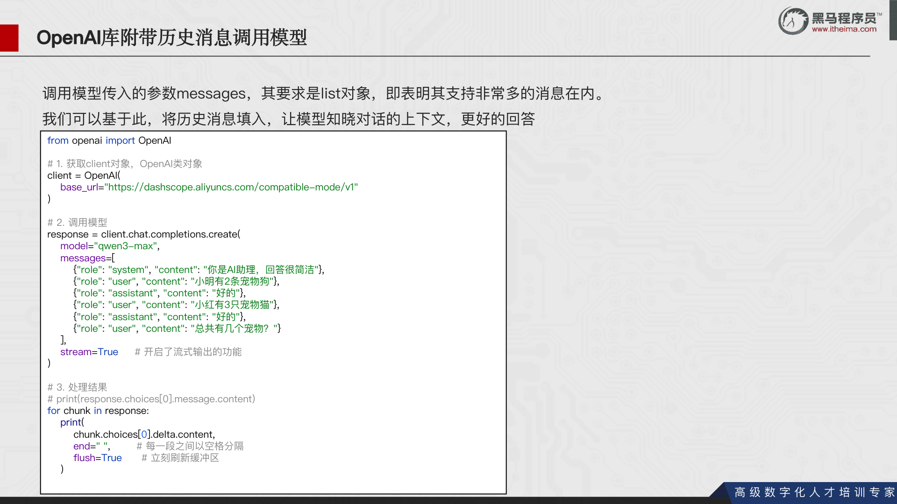

</details>

<a id="page-038"></a>

### OpenAI库附带历史消息调用模型小结

<!-- PDF 第 38 页 -->

我们可以在调用模型的时候，通过：

- 在messages的list内，组织历史消息提供给模型

PS：当前的历史消息是一次性的，如果是生产系统可以将消息保存到
文件、数据库等持久化工具内，需要的时候提取使用

后续学习LangChain库，会学习短期记忆和长期记忆的使用方法。

高 级 数 字 化 人 才 培 训 专 家

<details>
<summary>第 38 页原图</summary>

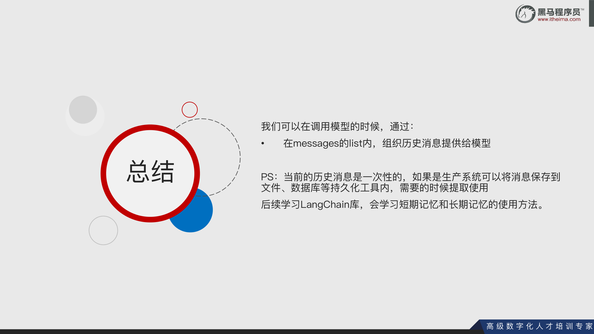

</details>

<a id="page-039"></a>

## LLM介绍

<!-- PDF 第 39 页 -->

当前章节：《提示词工程》

高 级 数 字 化 人 才 培 训 专 家

<details>
<summary>第 39 页原图</summary>

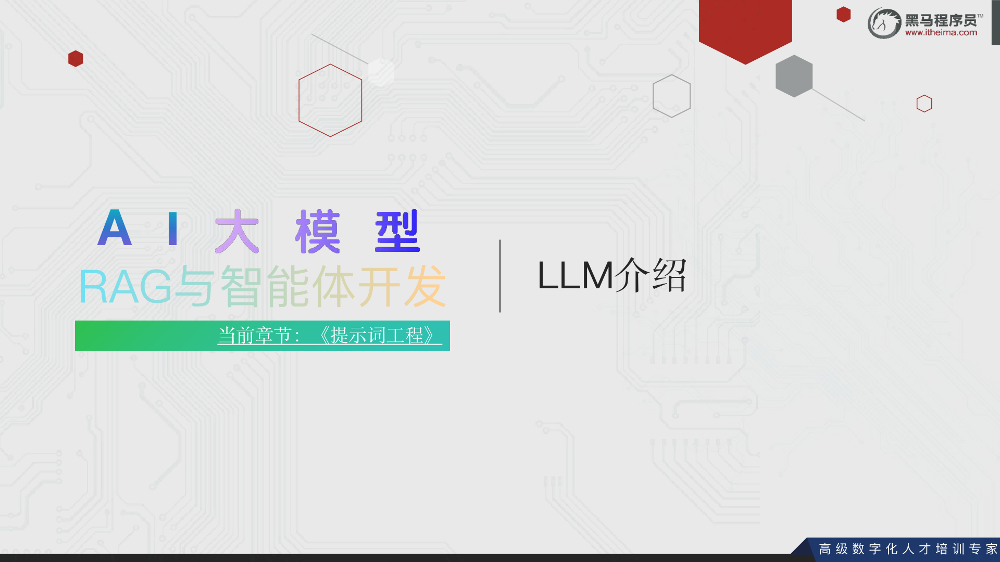

</details>

<a id="page-040"></a>

### 大语言模型的定义与发展脉络

<!-- PDF 第 40 页 -->

大语言模型 (英文：Large Language Model，缩写LLM) 是一种人工智能模型, 旨在理解和生成人类语言. 大语言模型可以
处理多种自然语言任务，如文本分类、问答、翻译、对话等等.

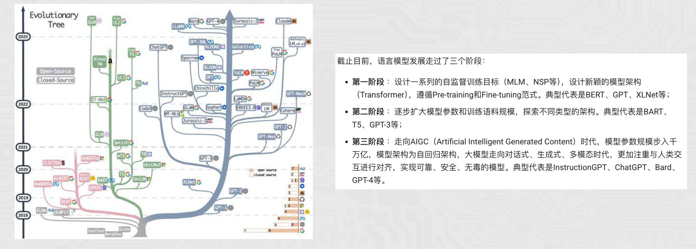

高 级 数 字 化 人 才 培 训 专 家

<details>
<summary>第 40 页原图</summary>

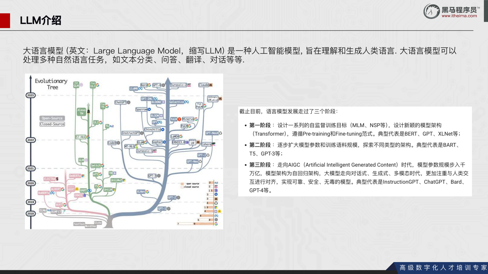

</details>

<a id="page-041"></a>

### 语言模型 (Language Model, LM)

<!-- PDF 第 41 页 -->

语言模型（Language Model）旨在建模词汇序列的生成概率，提升机器的语言智能水平，使机器能够模拟人
类说话、写作的模式进行自动文本输出。

通俗理解: 用来计算一个句子的概率的模型，也就是判断一句话是否是人话的概率.

标准定义：对于某个句子序列, 如S = {W1, W2, W3, …, Wn}, 语言模型就是计算该序列发生的概率, 即P(S).
如果给定的词序列符合语用习惯, 则给出高概率, 否则给出低概率.


高 级 数 字 化 人 才 培 训 专 家

<details>
<summary>第 41 页原图</summary>

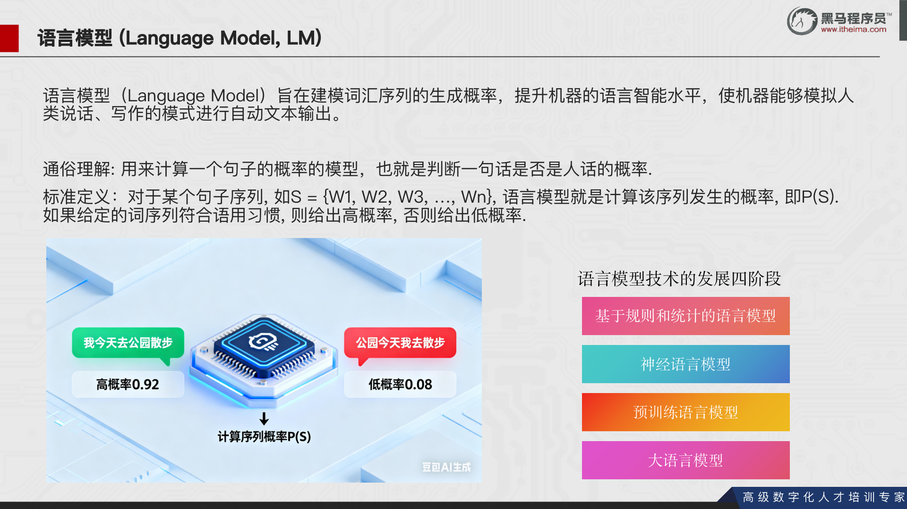

</details>

<a id="page-042"></a>

### LLM主要类别架构

<!-- PDF 第 42 页 -->

LLM本身基于transformer架构。自2017年，attention is all you need诞生起，原始的transformer模型为不
同领域的模型提供了灵感和启发。

基于原始的Transformer框架，衍生出了一系列模型，一些模型仅仅使用encoder或decoder，有些模型同时
使用encoder+decoder。

LLM分类一般分为三种：自编码模型（encoder）、自回归模型(decoder)和序列到序列模型(encoder-
decoder)。

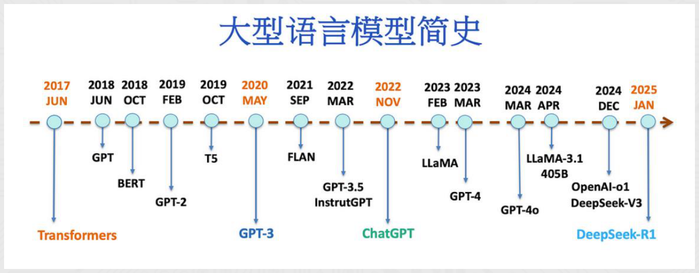

高 级 数 字 化 人 才 培 训 专 家

<details>
<summary>第 42 页原图</summary>

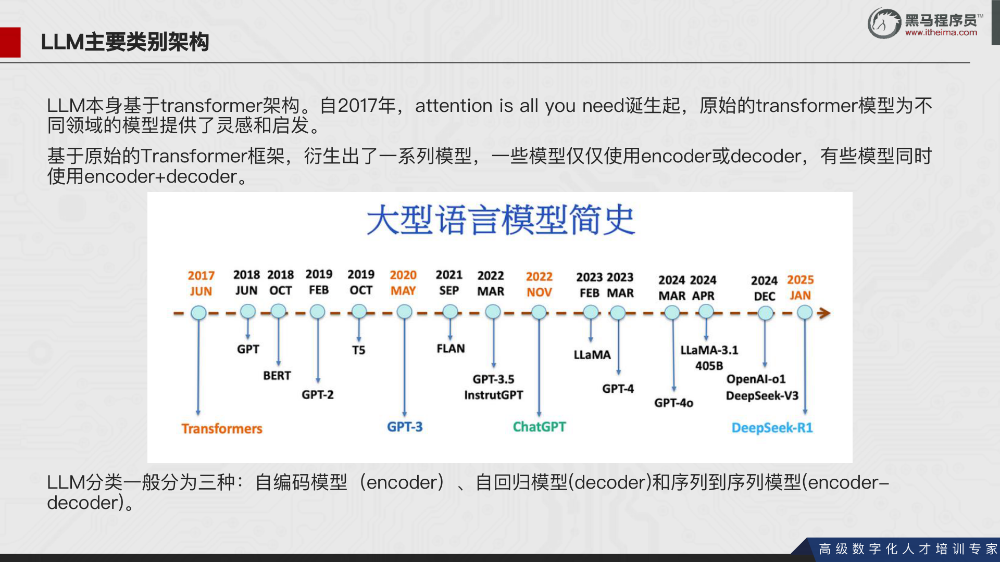

</details>

<a id="page-043"></a>

### 自编码模型 (AutoEncoder model，AE)

<!-- PDF 第 43 页 -->

AE模型，代表作BERT，其特点为：Encoder-Only, 基本原理：是在输入中随机MASK掉一部分单词，根据上下文预测这个
词。AE模型通常用于内容理解任务，比如自然语言理解（NLU）中的分类任务：情感分析、提取式问答。

代表模型 BERT

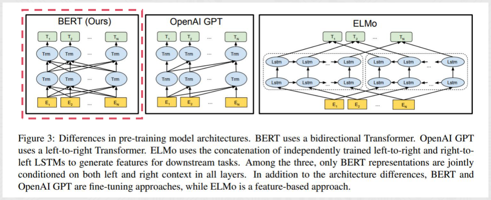

高 级 数 字 化 人 才 培 训 专 家

<details>
<summary>第 43 页原图</summary>

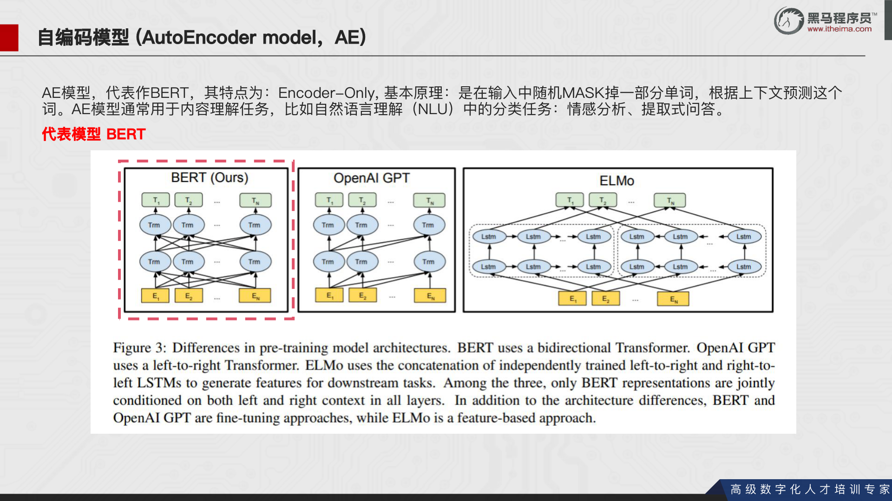

</details>

<a id="page-044"></a>

### 自回归模型 (Autoregressive model，AR)

<!-- PDF 第 44 页 -->

AR模型，代表作GPT，其特点为：Decoder-Only，基本原理：从左往右学习的模型，只能利用上文或者下文的信息，比如：
AR模型从一系列time steps中学习，并将上一步的结果作为回归模型的输入，以预测下一个time step的值。

AR模型通常用于生成式任务，在长文本的生成能力很强，比如自然语言生成（NLG）领域的任务：摘要、翻译或抽象问答。

代表模型 GPT

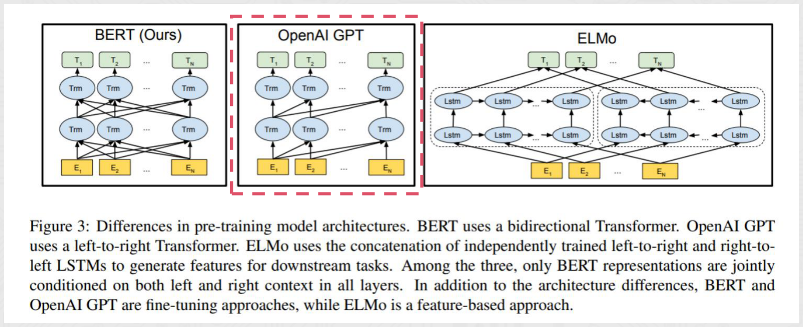

高 级 数 字 化 人 才 培 训 专 家

<details>
<summary>第 44 页原图</summary>

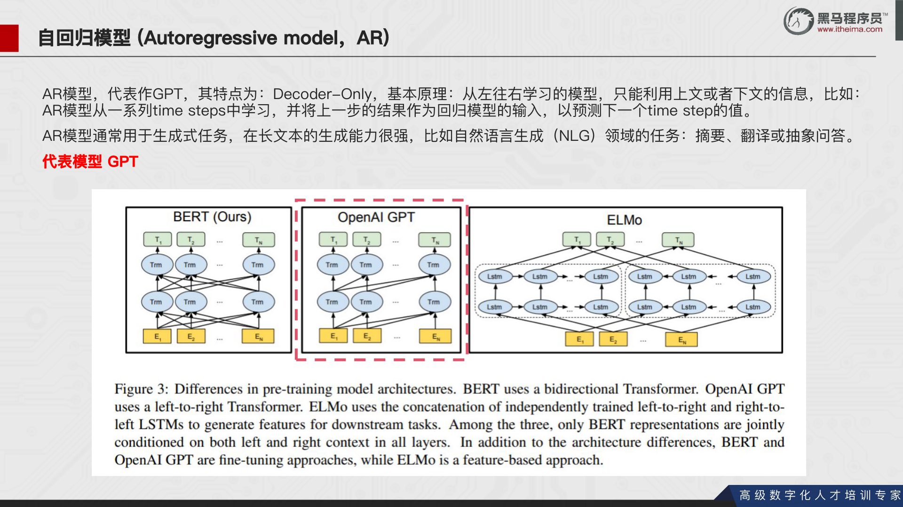

</details>

<a id="page-045"></a>

### 序列到序列（Sequence to Sequence Model）

<!-- PDF 第 45 页 -->

encoder-decoder模型同时使用编码器和解码器。它将每个task视作序列到序列的转换/生成（比如，文本到文本，文本到
图像或者图像到文本的多模态任务）。对于文本分类任务来说，编码器将文本作为输入，解码器生成文本标签。

Encoder-decoder模型通常用于需要内容理解和生成的任务，比如机器翻译。

代表模型T5

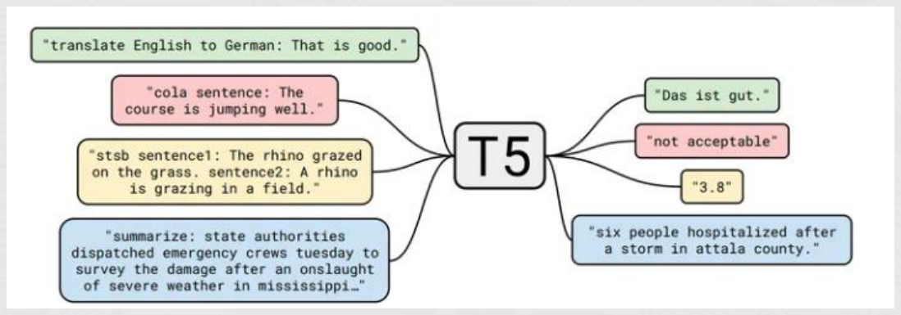

高 级 数 字 化 人 才 培 训 专 家

<details>
<summary>第 45 页原图</summary>

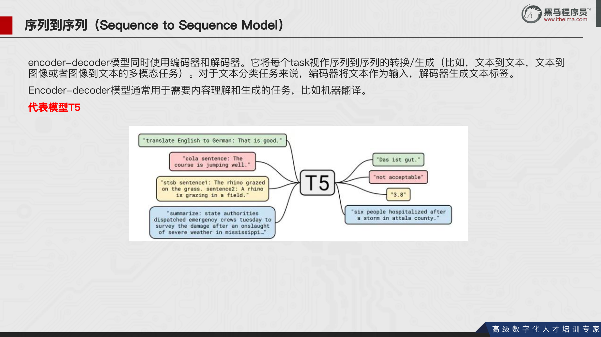

</details>

<a id="page-046"></a>

### LLM介绍小结

<!-- PDF 第 46 页 -->

大语言模型 (英文：Large Language Model，缩写LLM) 是
一种人工智能模型, 旨在理解和生成人类语言.

语言模型技术的发展四阶段：

- 基于规则和统计的语言模型

- 神经语言模型

- 预训练语言模型

- 大语言模型

大语言模型主要分为3类：自编码模型（encoder，代表：
BERT）、自回归模型(decoder，代表：GPT)和序列到序列
模型(encoder-decoder，代表：T5)。

高 级 数 字 化 人 才 培 训 专 家

<details>
<summary>第 46 页原图</summary>

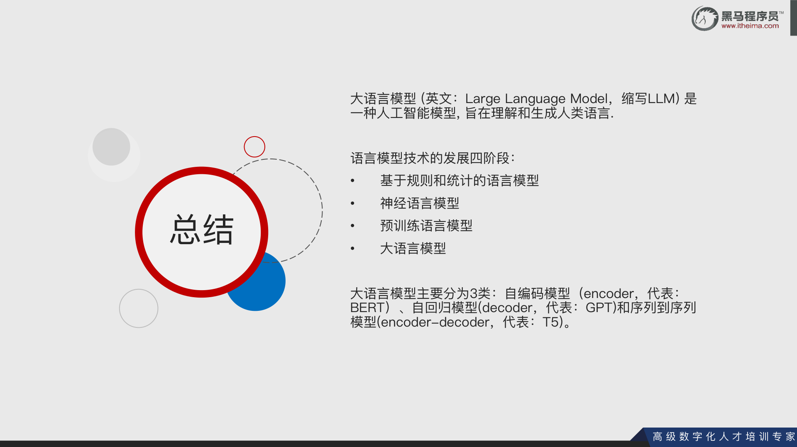

</details>

<a id="page-047"></a>

## 主流LLM介绍

<!-- PDF 第 47 页 -->

当前章节：《提示词工程》

高 级 数 字 化 人 才 培 训 专 家

<details>
<summary>第 47 页原图</summary>


</details>

<a id="page-048"></a>

### 不同模型规模的资源需求对比

<!-- PDF 第 48 页 -->

随着ChatGPT迅速火爆，引发了大模型的时代变革，国内外各大公司也快速跟进生成式AI市场，近百款大模型发布及应用。

目前，比较流行的开源的大语言模型主要以下几种：LLaMA大模型、ChatGLM大模型、Qwen大模型、DeepSeek大模型

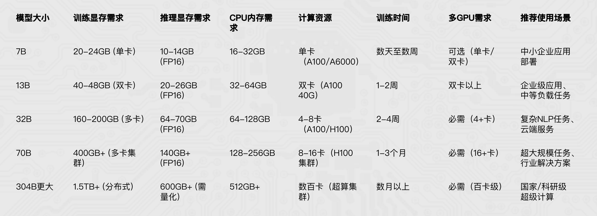

高 级 数 字 化 人 才 培 训 专 家

<details>
<summary>第 48 页原图</summary>

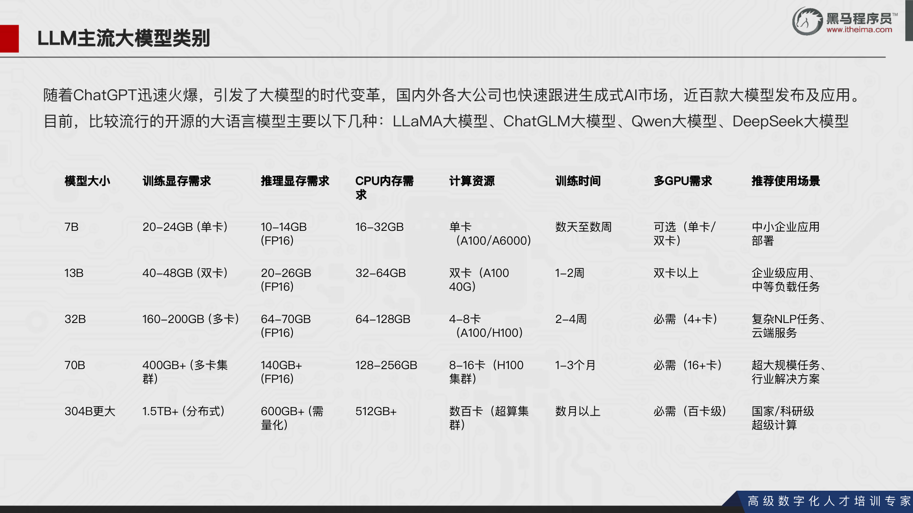

</details>

<a id="page-049"></a>

### LLaMA模型

<!-- PDF 第 49 页 -->

LLaMA（Large Language Model Meta AI），由 Meta AI 于2023年发布的一个开放且高效的大型基础语言模型，共有
7B、13B、33B、65B（650 亿）四种版本。

LLaMA训练数据是以英语为主的拉丁语系，另外还包含了来自 GitHub
的代码数据。

- 训练数据以英文为主，不包含中韩日文，所有训练数据都是开源的。

- 其中LLaMA-65B 和 LLaMA-33B 是在 1.4万亿 (1.4T) 个 token上
    训练的

- 而最小的模型 LLaMA-7B 和LLaMA-13B 是在 1万亿 (1T) 个
    token 上训练的。


高 级 数 字 化 人 才 培 训 专 家

<details>
<summary>第 49 页原图</summary>

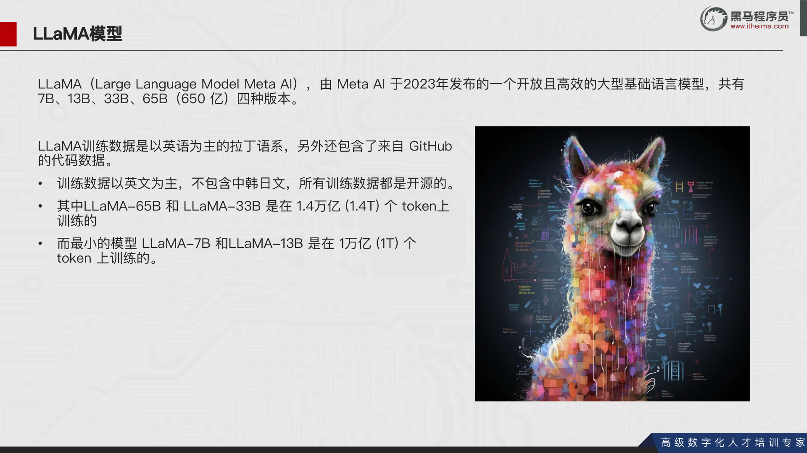

</details>

<a id="page-050"></a>

### ChatGLM模型

<!-- PDF 第 50 页 -->

ChatGLM 是清华大学提出的一个开源、支持中英双语的对话语言模型。

该模型使用了和 ChatGPT 相似的技术

- 经过约 1T 标识符的中英双语训练(中英文比例为 1:1)

- 辅以监督微调、反馈自助、人类反馈强化学习等技术的加持

- 62 亿参数的 ChatGLM-6B 已经能生成相当符合人类偏好的回答。


高 级 数 字 化 人 才 培 训 专 家

<details>
<summary>第 50 页原图</summary>

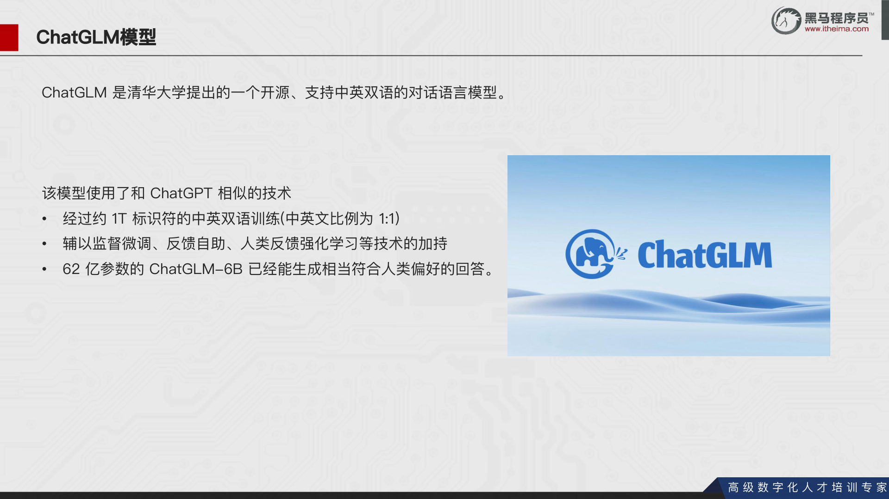

</details>

<a id="page-051"></a>

### Qwen模型

<!-- PDF 第 51 页 -->

通义千问是由阿里云自主研发的大模型，用于理解和分析用户输入的自然语言，以及图片、音频、视频等多模态数据。

Qwen模型也是 Decoder-only架构，但结合前人的工
作做了一些改进，比如：

- 位置编码：使用 RoPE（Rotary Positional
    Embedding），增强长文本建模能力。

- 归一化层：采用 RMSNorm，替代传统
    LayerNorm，提升训练稳定性。

- 激活函数：使用 SwiGLU，相比 GeLU 能更好地
    提取特征。

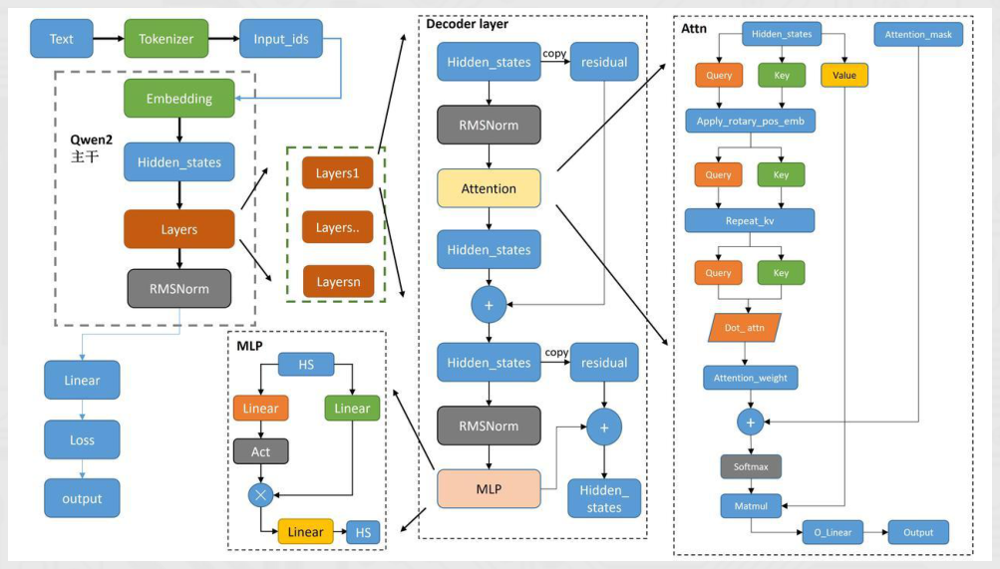

高 级 数 字 化 人 才 培 训 专 家

<details>
<summary>第 51 页原图</summary>

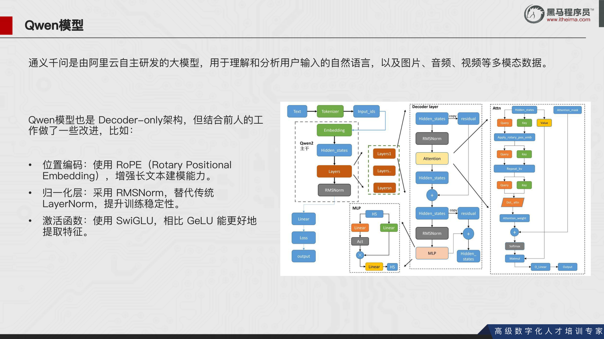

</details>

<a id="page-052"></a>

### DeepSeek模型

<!-- PDF 第 52 页 -->

DeepSeek 模型是由杭州深度求索人工智能基础技术研究有限公司开发的一系列人工智能模型。该系列模型以 Transformer
架构为基础，核心采用创新的 DeepSeekMoE（混合专家）与 MLA（多头潜在注意力）技术路线，覆盖通用语言、代码、视
觉、数学等多个领域.

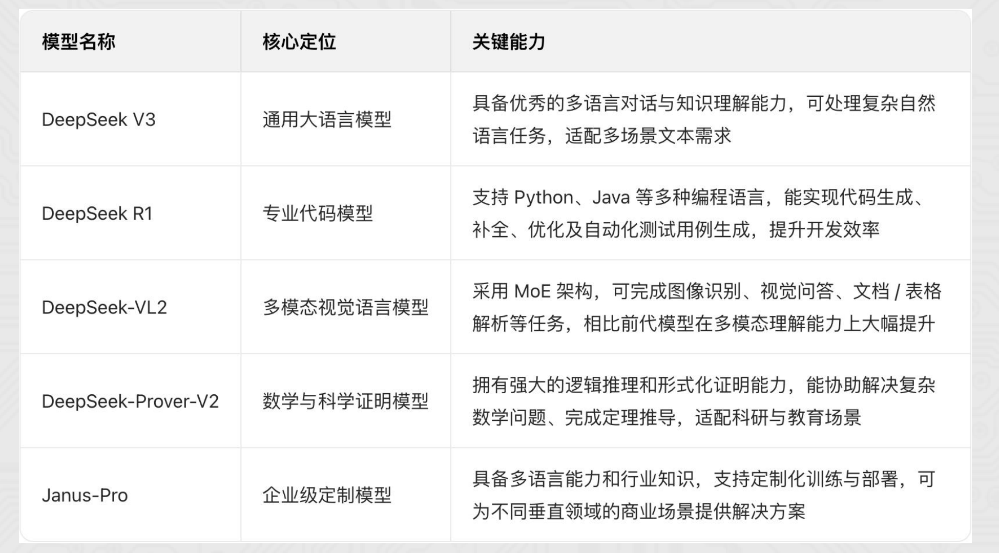

高 级 数 字 化 人 才 培 训 专 家

<details>
<summary>第 52 页原图</summary>

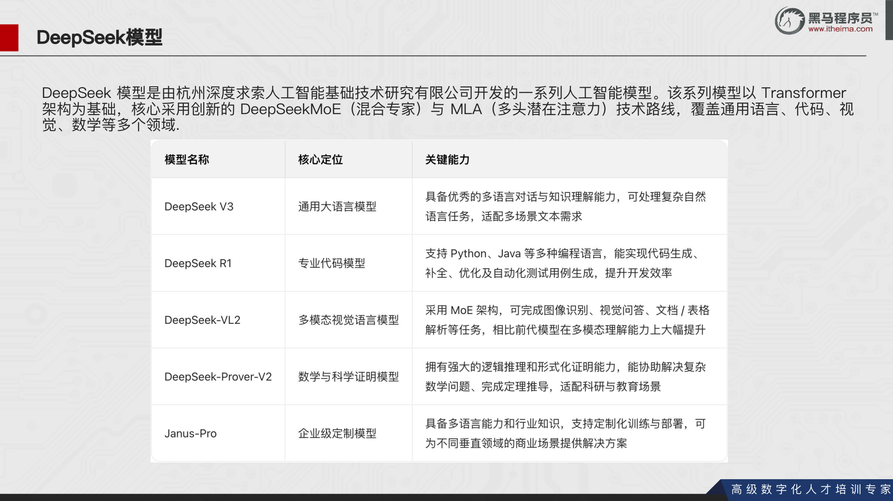

</details>

<a id="page-053"></a>

### 主流LLM介绍小结

<!-- PDF 第 53 页 -->

主流的开源大模型主要有：

- LLaMA，Meta AI 2023发布，偏向英语系

- ChatGLM，清华发布，类ChatGPT

- Qwen，阿里发布，时下流行

- DeepSeek，深度求索发布

高 级 数 字 化 人 才 培 训 专 家

<details>
<summary>第 53 页原图</summary>

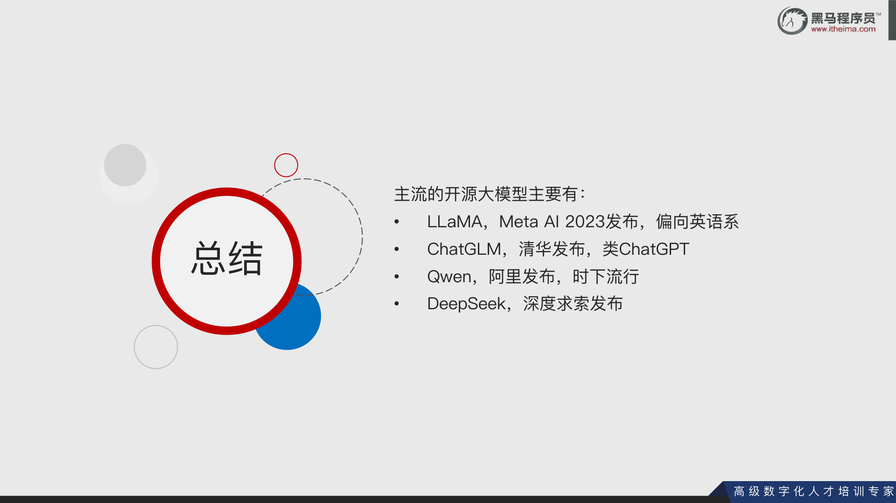

</details>

<a id="page-054"></a>

## 大模型prompt工程指南

<!-- PDF 第 54 页 -->

当前章节：《提示词工程》

- 了解什么是提示词工程
- 掌握提示工程的设计技巧

高 级 数 字 化 人 才 培 训 专 家

<details>
<summary>第 54 页原图</summary>

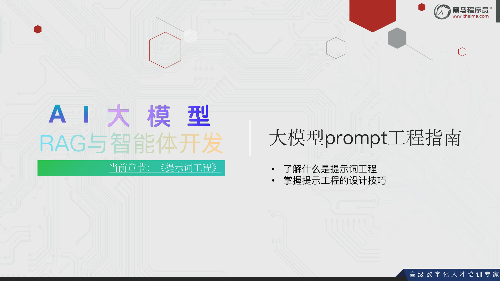

</details>

<a id="page-055"></a>

### 提示词工程概念

<!-- PDF 第 55 页 -->

提示工程（Prompt Engineering），也称为 In-Context Prompting，是指在不更新模型权重的情况下如何与大模型交互以引
导其行为以获得所需结果的方法。

在人工智能领域，Prompt指的是用户给大型语言模型发出的指令。

- 例如，“「讲个笑话」”、“「用Python编个贪吃蛇游戏」”、
    “「写封情书」"等。
- 虽然看似简单，但实际上，Prompt的设计对于模型的结果影响
    很大。
- 因此如何设计prompt，进而与模型更好的交互，是研究人员必
    备的必不可少的技能（提示工程）。

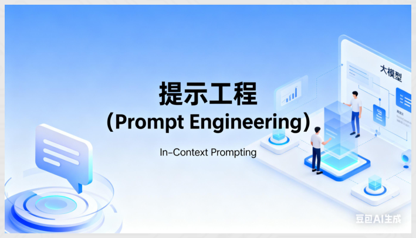

高 级 数 字 化 人 才 培 训 专 家

<details>
<summary>第 55 页原图</summary>

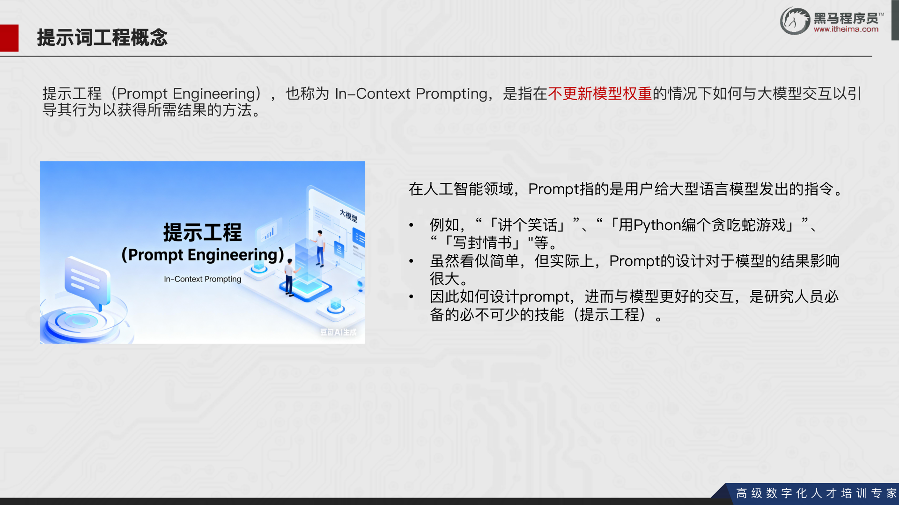

</details>

<a id="page-056"></a>

### 技巧一：详细描述需求

<!-- PDF 第 56 页 -->

任何Prompt技巧，都不如清晰的表达你的需求。这就类似人与人沟通，如果话说不明白，不可能让别人理解你的思想。因此，
写出清晰的指令，是核心。

技巧1：详细的描述


高 级 数 字 化 人 才 培 训 专 家

<details>
<summary>第 56 页原图</summary>

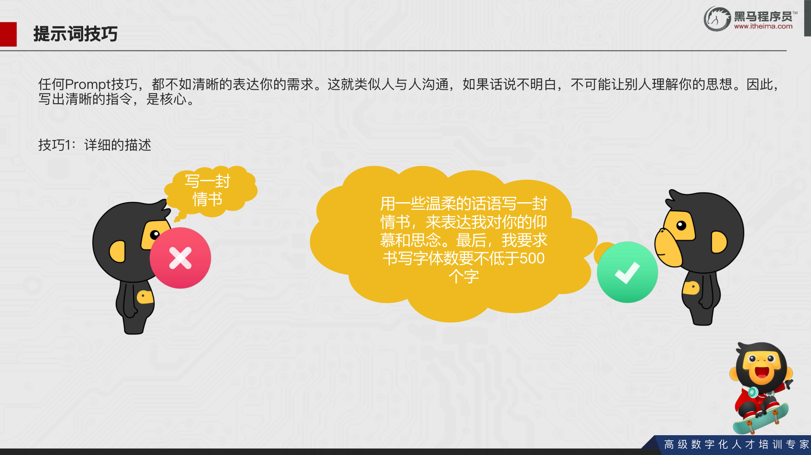

</details>

<a id="page-057"></a>

### 技巧二：指定模型角色

<!-- PDF 第 57 页 -->

任何Prompt技巧，都不如清晰的表达你的需求。这就类似人与人沟通，如果话说不明白，不可能让别人理解你的思想。因此，
写出清晰的指令，是核心。


高 级 数 字 化 人 才 培 训 专 家

<details>
<summary>第 57 页原图</summary>

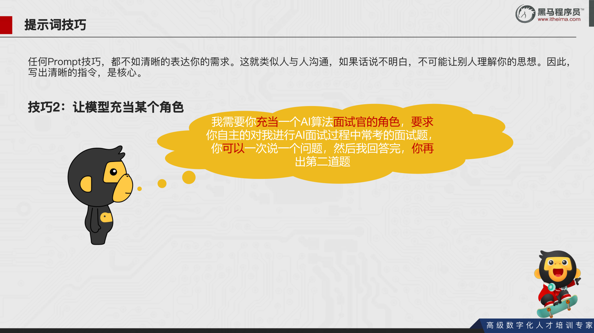

</details>

<a id="page-058"></a>

### 技巧三：使用分隔符划分输入

<!-- PDF 第 58 页 -->

技巧3：使用分隔符标明输入的不同部分

中括号、XML标签、三引号等分隔符可以帮助划分要区别对待的文本，也可以帮助模型更好的理解文本内容。常用''''''把内容
框起来


高 级 数 字 化 人 才 培 训 专 家

<details>
<summary>第 58 页原图</summary>

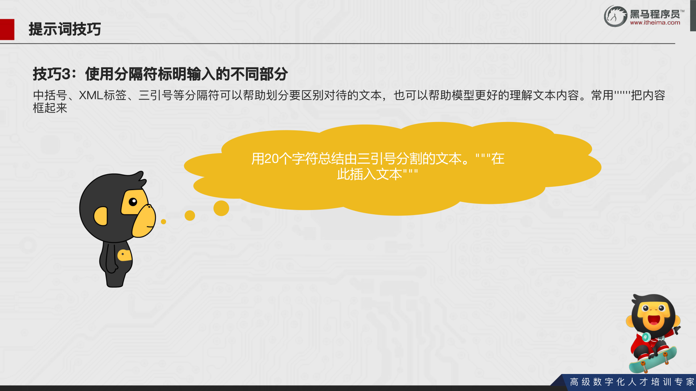

</details>

<a id="page-059"></a>

### 技巧四：明确任务执行步骤

<!-- PDF 第 59 页 -->

技巧4：对任务指定步骤

对于可以拆分的任务可以尽量拆开，最好能为其指定一系列步骤，明确步骤可以让模型更容易实现它们。


高 级 数 字 化 人 才 培 训 专 家

<details>
<summary>第 59 页原图</summary>

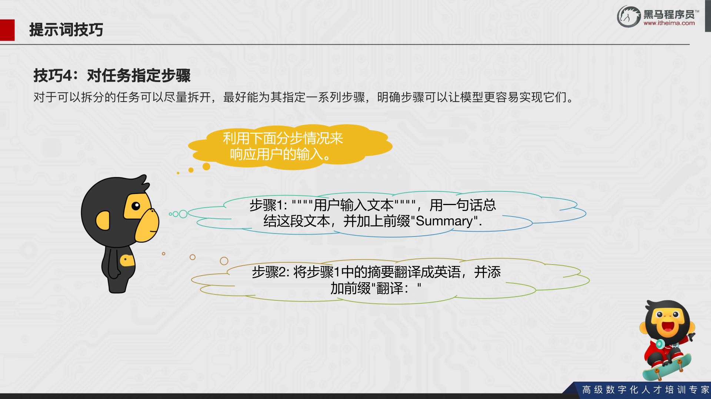

</details>

<a id="page-060"></a>

### 技巧五：提供参考示例

<!-- PDF 第 60 页 -->

技巧5：提供例子

本质类似于few-shot leaning。先扔给大模型举例，然后让模型按照例子来输出


高 级 数 字 化 人 才 培 训 专 家

<details>
<summary>第 60 页原图</summary>

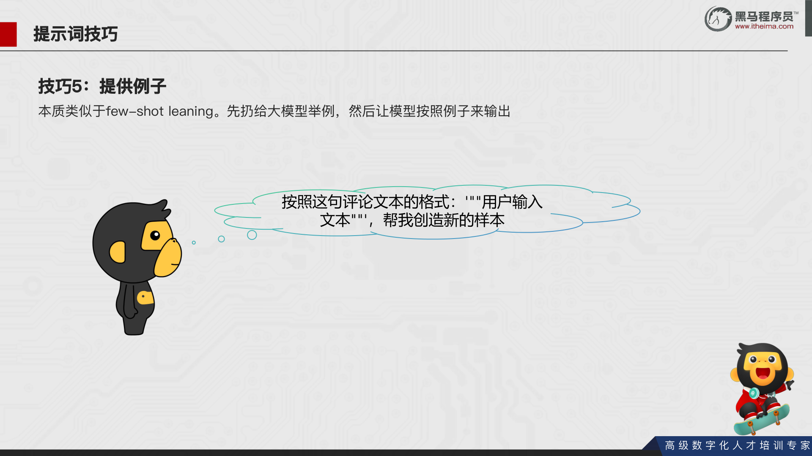

</details>

<a id="page-061"></a>

### 使用参考文本作答，减少模型幻觉

<!-- PDF 第 61 页 -->

基于文本文档，辅助大模型问答，降低模型"幻觉"（一本正经的胡说八道）问题。

即使用参考文本作答 经典的知识库用法，让大模型使用我们提供的信息来组成答案。


高 级 数 字 化 人 才 培 训 专 家

<details>
<summary>第 61 页原图</summary>

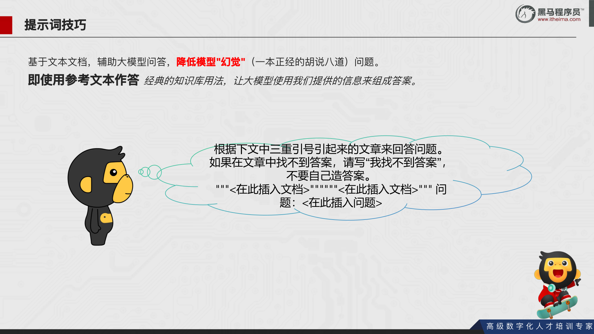

</details>

<a id="page-062"></a>

### 大模型prompt工程指南小结

<!-- PDF 第 62 页 -->

提示词工程就是更好的向模型提问的技巧。

大模型本身是一种很简单的结构，即：用户输入，模型输出。

- 用更详细、更清晰、有逻辑、有参考的提问，获得期望中的回答
    效果

- 不管是RAG还是Agent智能体亦或是其它围绕模型的各类复杂的
    开发工作，本质上都可以简单总结为在提示词上下功夫。

提示词优化是所有大模型应用开发的基础必修课，一个好的提示词，
甚至能让基础模型的输出效果媲美经过简单微调的模型。

高 级 数 字 化 人 才 培 训 专 家

<details>
<summary>第 62 页原图</summary>

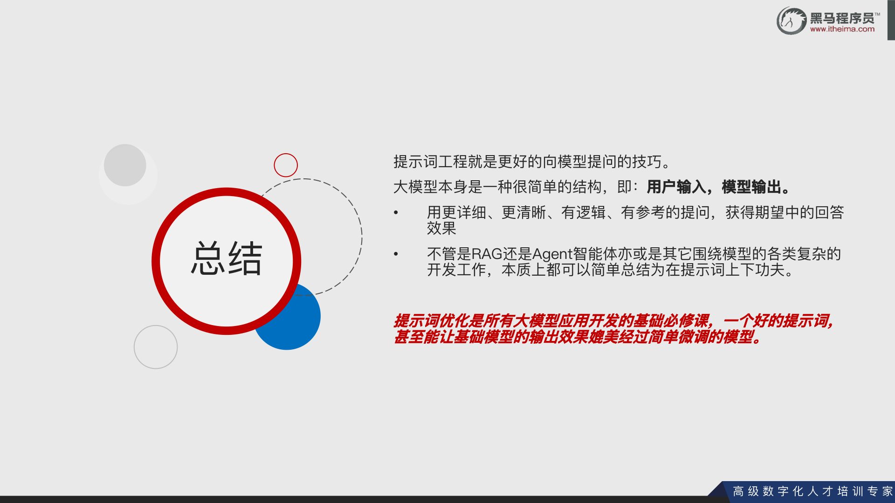

</details>

<a id="page-063"></a>

## 提示词实战案例介绍

<!-- PDF 第 63 页 -->

当前章节：《提示词工程》

- 了解案例的背景和整体任务
- 掌握Zero-shot、Few-shot的思想

高 级 数 字 化 人 才 培 训 专 家

<details>
<summary>第 63 页原图</summary>


</details>

<a id="page-064"></a>

### 金融文本任务与提示词优化方法

<!-- PDF 第 64 页 -->

当前金融领域信息化发展的时代,金融数据大量激增,许多投资者和研究者试图通过对这些数据进行深度分析而获得一些有效的
决策和帮助,尽可能减少决策失误带来的损失。

所以,针对金融数据的分析方法研究是目前十分有益且热门的话题。

当前案例主要有三大业务场景实现：

- 基于大模型完成：金融文本分类

- 基于大模型完成：金融文本信息抽取

- 基于大模型完成：金融文本匹配

大模型选择：Qwen在线大模型（阿里云通义千问 qwen3-max）

采用方法：基于Few-Shot + Zero-Shot的思想，设计prompt（提示词）, 进而应用大模型完成相应的任务

高 级 数 字 化 人 才 培 训 专 家

<details>
<summary>第 64 页原图</summary>

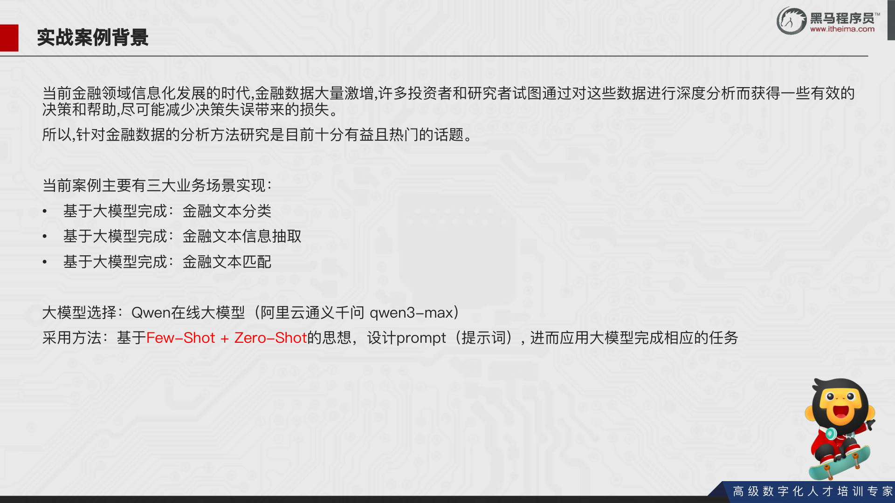

</details>

<a id="page-065"></a>

### Zero-shot思想

<!-- PDF 第 65 页 -->

Zero-shot学习（Zero-shot Learning）是指在训练阶段不存在与测试阶段完全相同的类别，但是模型可以使用训练过的知识
来推广到测试集中的新类别上。

这种能力被称为“零样本”学习，因为模型在训练时从未见过测试集中的新类别，在模型训练和提示词优化中均有体现。

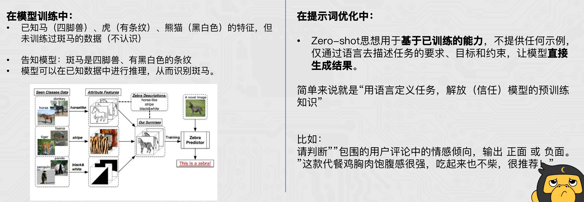

高 级 数 字 化 人 才 培 训 专 家

<details>
<summary>第 65 页原图</summary>

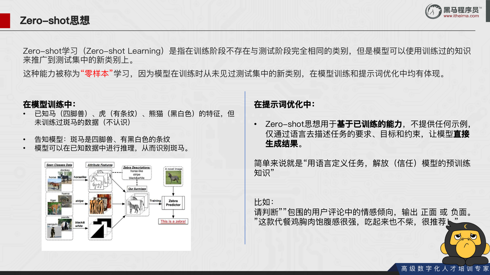

</details>

<a id="page-066"></a>

### Few-shot思想

<!-- PDF 第 66 页 -->

Few-shot学习（Few-shot Learning）是指少样本学习，当模型在学习了一定类别的大量数据后，对于新的类别，只需要少
量的样本就能快速学习，对应的有one-shot learning，单样本学习，也算样本少到为一的情况下的一种few-shot learning。

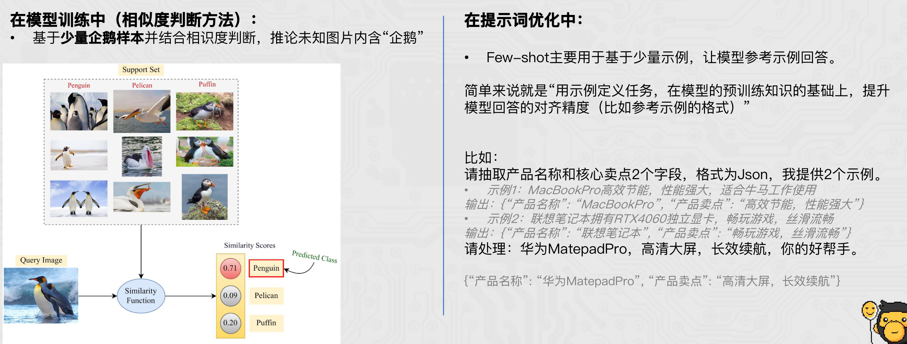

高 级 数 字 化 人 才 培 训 专 家

<details>
<summary>第 66 页原图</summary>

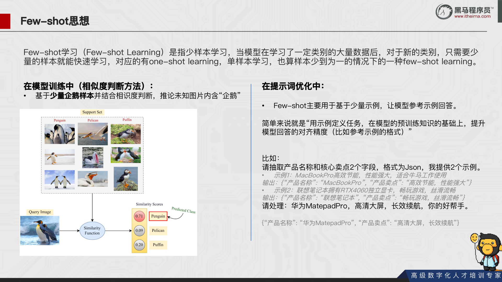

</details>

<a id="page-067"></a>

### 提示词实战案例介绍小结

<!-- PDF 第 67 页 -->

提示词工程实战的业务需求是在金融业务内完成：

- 文本分类

- 信息抽取

- 文本匹配

共3个任务目标，通过zero-shot、few-shot思想设计提示词完成。

在模型训练层面：

- Zero-shot：零样本，基于模型训练阶段学习的属性/语义关联，
    去迁移到未知的新类别

- Few-shot：少样本，基于少量样本，快速泛化识别新样本

在提示词优化层面：

- Zero-shot：无提示，语言描述任务，依赖模型预训练知识回答

- Few-shot：给与模型少量示例，引导模型对齐示例输出结果

高 级 数 字 化 人 才 培 训 专 家

<details>
<summary>第 67 页原图</summary>

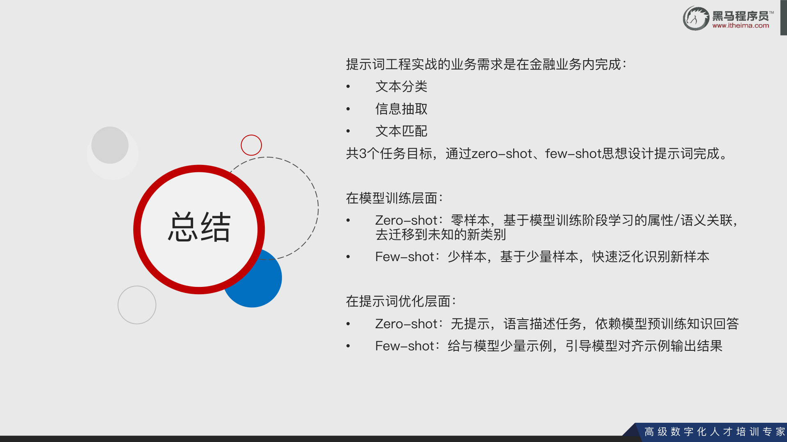

</details>

<a id="page-068"></a>

## 提示词实战案例 LLM实现金融文本分类

<!-- PDF 第 68 页 -->

当前章节：《提示词工程》

- 掌握Fewshot方式下prompt的设计方式
- 掌握利用LLM实现文本分类的代码

高 级 数 字 化 人 才 培 训 专 家

<details>
<summary>第 68 页原图</summary>

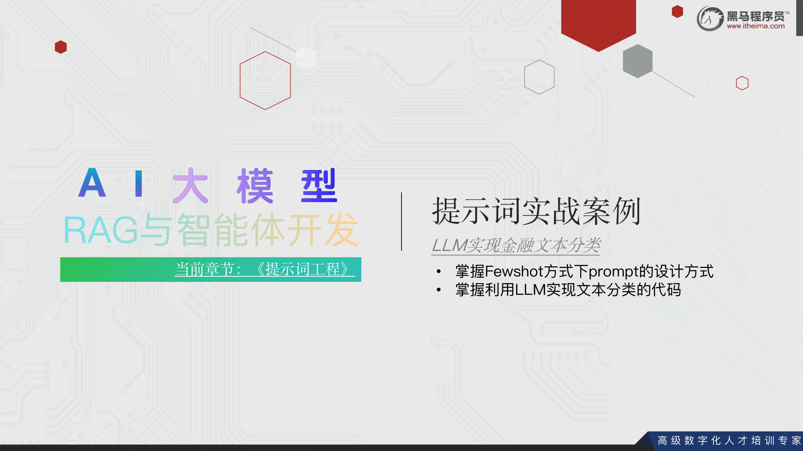

</details>

<a id="page-069"></a>

### LLM文本分类任务介绍

<!-- PDF 第 69 页 -->

下面几段文本来自某平台发布的金融领域文本：

1. "今日，央行发布公告宣布降低利率，以刺激经济增长。这一降息举措将影响贷款利率，并在未来几个季度内对金融市场产生影响。",

2. "ABC公司今日发布公告称，已成功完成对XYZ公司股权的收购交易。本次交易是ABC公司在扩大业务范围、加强市场竞争力方面的重要举措。

据悉，此次收购将进一步巩固ABC公司在行业中的地位，并为未来业务发展提供更广阔的发展空间。详情请见公司官方网站公告栏",

3. "公司资产负债表显示，公司偿债能力强劲，现金流充足，为未来投资和扩张提供了坚实的财务基础。",

4. "最新的分析报告指出，可再生能源行业预计将在未来几年经历持续增长，投资者应该关注这一领域的投资机会",

我们的目的是期望模型能够帮助我们识别出这4段话中，每一句话描述的是一个什么类型的报告。

即期望的输出结果为：\['新闻报道', '公司公告', '财务公告 '分析师报告'\]


高 级 数 字 化 人 才 培 训 专 家

<details>
<summary>第 69 页原图</summary>

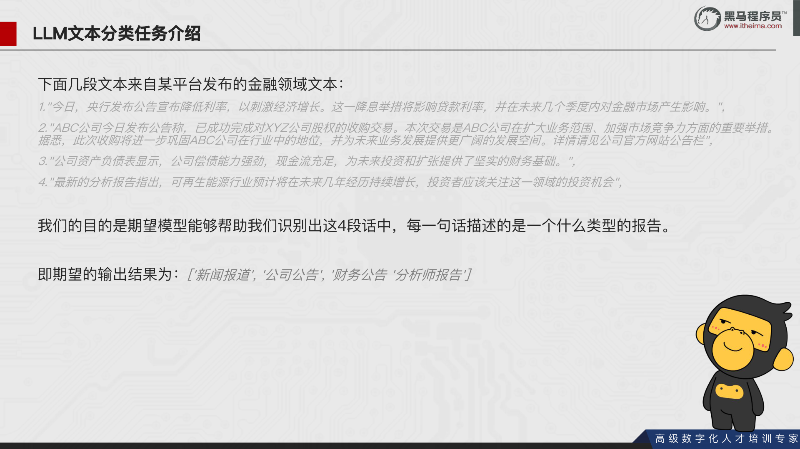

</details>

<a id="page-070"></a>

### 文本分类的 Few-shot 提示词设计

<!-- PDF 第 70 页 -->

对于大模型来讲，prompt 的设计非常重要，一个 明确 的 prompt 能够帮助我们更好从大模型中获得我们想要的结果。

在该任务的 prompt 设计中，我们主要考虑 2 点：

- 需要向模型解释什么叫作「文本分类任务」

- 需要让模型按照我们指定的格式输出

为了让模型知道什么叫做「文本分类」，我们借用 FewShot 的方式，给模型展示一些正确的例子：

User: "今日，股市经历了一轮震荡，受到宏观经济数据和全球贸易紧张局势的影响。投资者密切关注美联储可能的政策调整，以适应市场的不
确定性。" 是\['新闻报道', '公司公告', '财务公告 '分析师报告'\]里的什么类别？

Bot: 新闻报道

User: "本公司年度财务报告显示，去年公司实现了稳步增长的盈利，同时资产负债表呈现强劲的状况。经济环境的稳定和管理层的有效战略执
行为公司的健康发展奠定了基础。"是\['新闻报道', '公司公告', '财务公告 '分析师报告'\]里的什么类别？

Bot: 财务报告

其中，User 代表我们输入给模型的句子，Bot 代表模型的回复内容。

注意：上述例子中 Bot 的部分也是由人工输入的，其目的是希望看到在看到类似 User 中的句子时，模型应当做出类似 Bot
的回答。

高 级 数 字 化 人 才 培 训 专 家

<details>
<summary>第 70 页原图</summary>

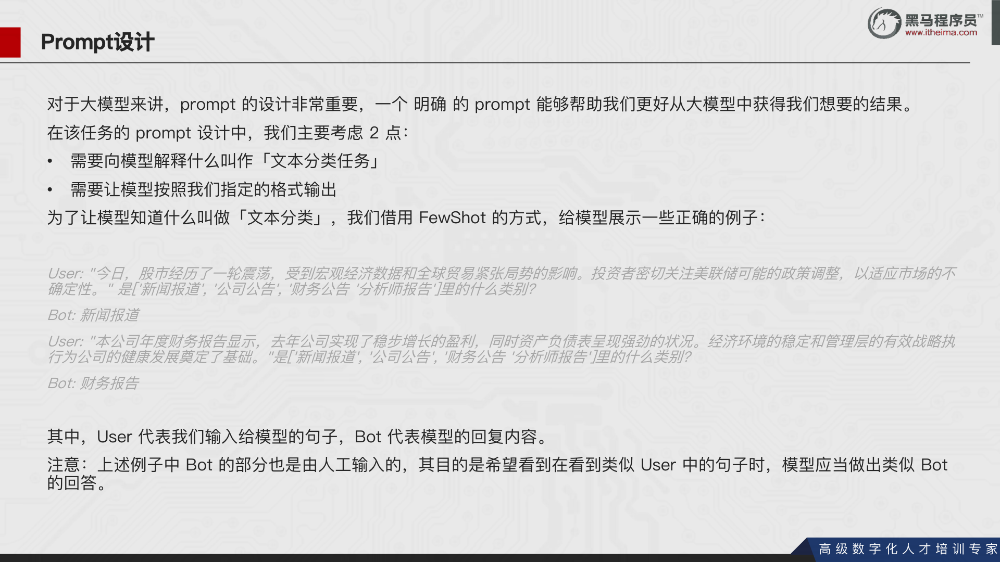

</details>

<a id="page-071"></a>

### 准备分类标签、示例与待分类文本

<!-- PDF 第 71 页 -->

实现llm\_classification.py代码脚本文件，主要包含：init\_prompts()和qwen\_model() 2个核心函数

导入工具包：

~~~~
from openai import OpenAI
# 1. 获取client对象，OpenAI类对象
client = OpenAI(
    base_url="https://dashscope.aliyuncs.com/compatible-mode/v1"
)
examples_data = {       # 示例数据
    '新闻报道': '今日，股市经历了一轮震荡，受到宏观经济数据和全球贸易紧张局势的影响。投资者密切关注美联储可能的政策调整，以适应市场的不确定性。',
    '财务报告': '本公司年度财务报告显示，去年公司实现了稳步增长的盈利，同时资产负债表呈现强劲的状况。经济环境的稳定和管理层的有效战略执行为公司
的健康发展奠定了基础。',
    '公司公告': '本公司高兴地宣布成功完成最新一轮并购交易，收购了一家在人工智能领域领先的公司。这一战略举措将有助于扩大我们的业务领域，提高市场
竞争力',
    '分析师报告': '最新的行业分析报告指出，科技公司的创新将成为未来增长的主要推动力。云计算、人工智能和数字化转型被认为是引领行业发展的关键因素，
投资者应关注这些趋势'
}
# 分类列表
examples_types = ['新闻报道', '财务报道', '公司公告', '分析师报告']
# 提问数据
questions = [
    "今日，央行发布公告宣布降低利率，以刺激经济增长。这一降息举措将影响贷款利率，并在未来几个季度内对金融市场产生影响。",
    "ABC公司今日发布公告称，已成功完成对XYZ公司股权的收购交易。本次交易是ABC公司在扩大业务范围、加强市场竞争力方面的重要举措。据悉，此次收购将
进一步巩固ABC公司在行业中的地位，并为未来业务发展提供更广阔的发展空间。详情请见公司官方网站公告栏",
    "公司资产负债表显示，公司偿债能力强劲，现金流充足，为未来投资和扩张提供了坚实的财务基础。",
    "最新的分析报告指出，可再生能源行业预计将在未来几年经历持续增长，投资者应该关注这一领域的投资机会",
    "小明喜欢小新哟"
]
~~~~

高 级 数 字 化 人 才 培 训 专 家

<details>
<summary>第 71 页原图</summary>

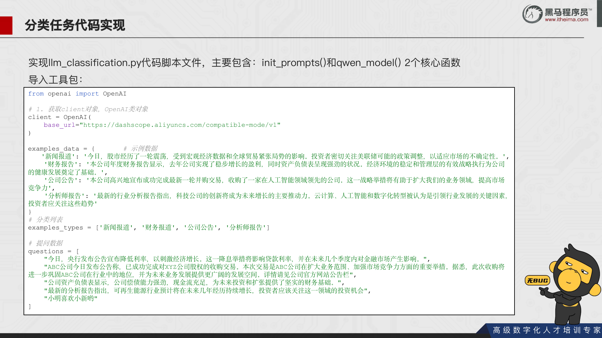

</details>

<a id="page-072"></a>

### 构建分类任务的历史消息列表

<!-- PDF 第 72 页 -->

构建init\_prompts()函数，将准备好的示例数据，添加到list中，作为历史对话消息存在，基于FewShot模式提示模型

~~~~
def init_prompt(examples):
    prompt_list = [
        {"role": "system", "content": f"你是一个金融专家，需要对输入的金融领域文
本进行分析，将类型归类到examples_types，不在这四类的数据，输出'不清楚类型'，以下是几
个示例分类："}
    ]
    for class_type, example_text in examples.items():
        prompt_list.append({"role": "user", "content": example_text})
        prompt_list.append({"role": "assistant", "content": class_type})
    return prompt_list
 
~~~~

高 级 数 字 化 人 才 培 训 专 家

<details>
<summary>第 72 页原图</summary>

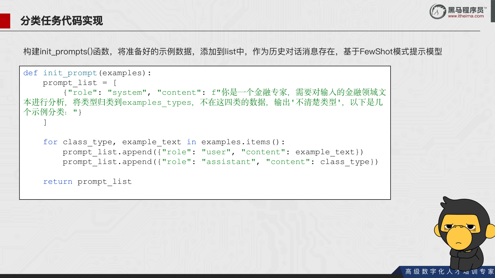

</details>

<a id="page-073"></a>

### 调用 Qwen 执行文本分类

<!-- PDF 第 73 页 -->

调用模型

~~~~
if __name__ == '__main__':
    messages = init_prompt(examples_data)
    for q in questions:
        response = client.chat.completions.create(
            model="qwen3-max",
            messages=messages + [{"role": "user", "content": f"请分析如下句子是什么类别：{q}"}],
            stream=False
        )
        print(response.choices[0].message.content)
 
~~~~


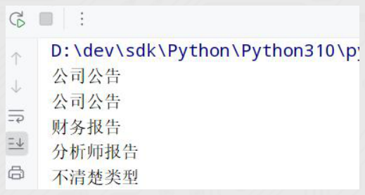

高 级 数 字 化 人 才 培 训 专 家

<details>
<summary>第 73 页原图</summary>

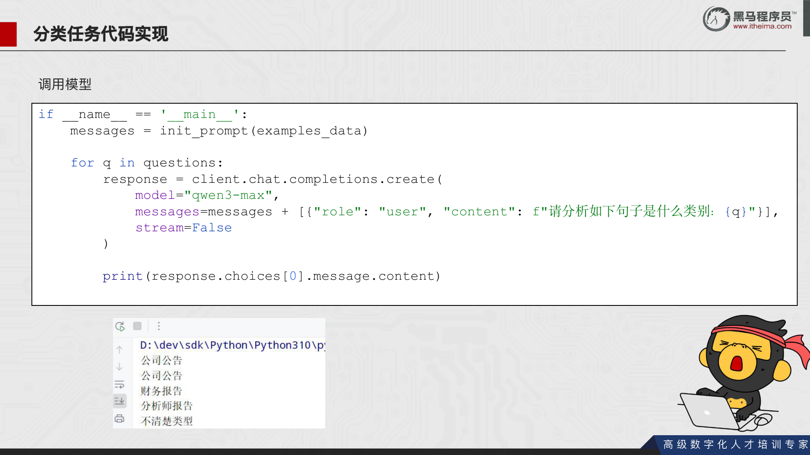

</details>

<a id="page-074"></a>

## Json数据格式

<!-- PDF 第 74 页 -->

当前章节：《提示词工程》

高 级 数 字 化 人 才 培 训 专 家

<details>
<summary>第 74 页原图</summary>

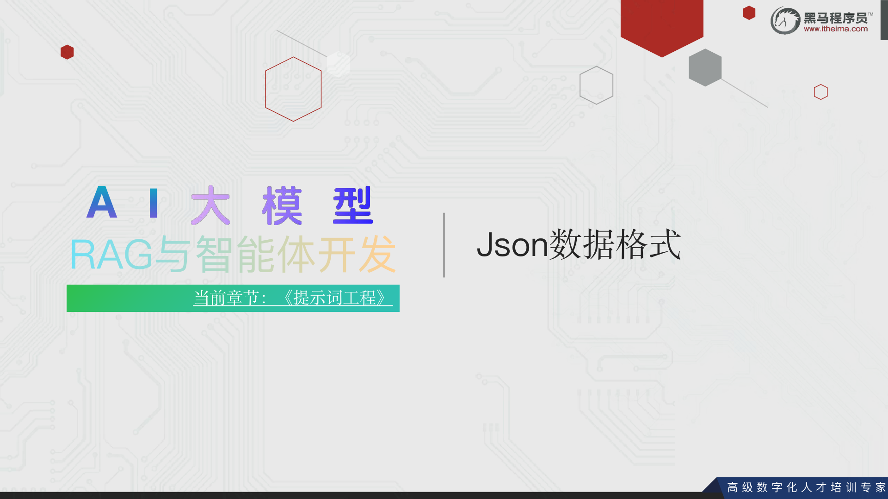

</details>

<a id="page-075"></a>

### JSON 的用途与文本格式对比

<!-- PDF 第 75 页 -->

JSON（JavaScript Object Notation）是一种轻量级的数据交换格式，易于人阅读和编写，同时也易于机器解析和生成。

Json是带有格式的字符串，主要用于数据交换，即程序和程序之间的信息互传，使用Json会更加方便，如下示例：

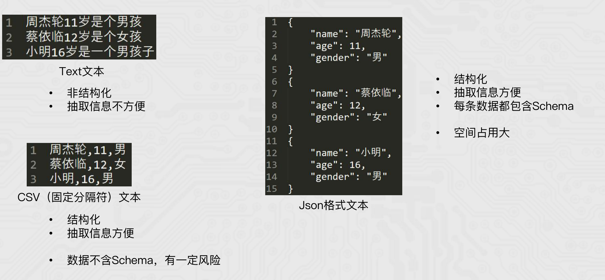

高 级 数 字 化 人 才 培 训 专 家

<details>
<summary>第 75 页原图</summary>

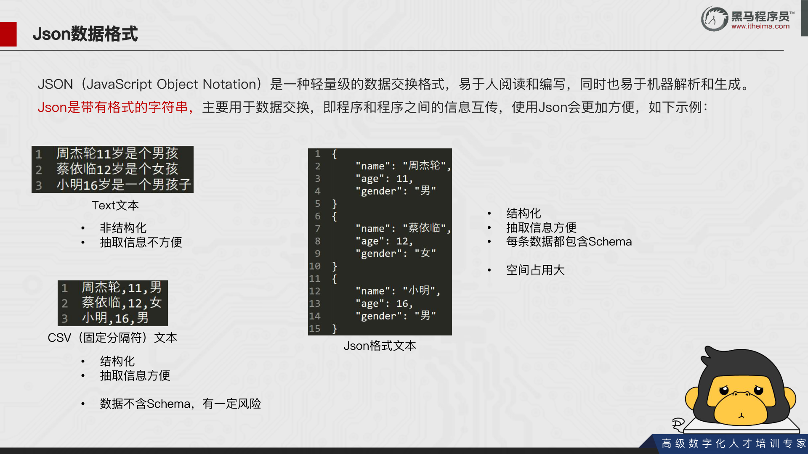

</details>

<a id="page-076"></a>

### JSON 对象与数组的结构

<!-- PDF 第 76 页 -->

Json主要有2种结构：Json对象和Json数组

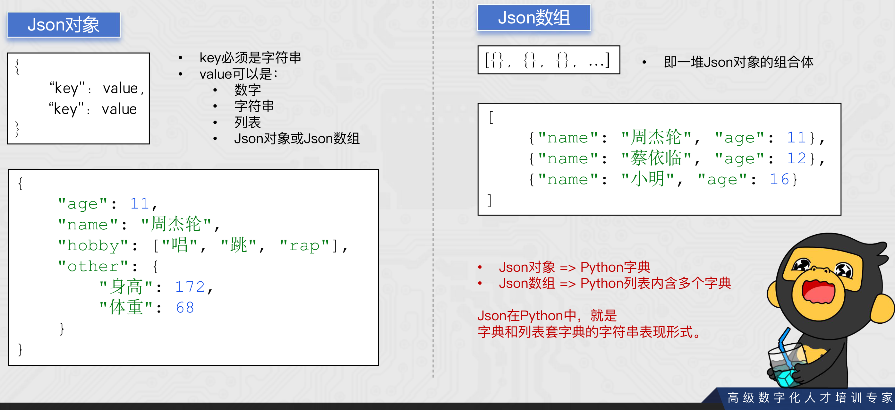

高 级 数 字 化 人 才 培 训 专 家

<details>
<summary>第 76 页原图</summary>

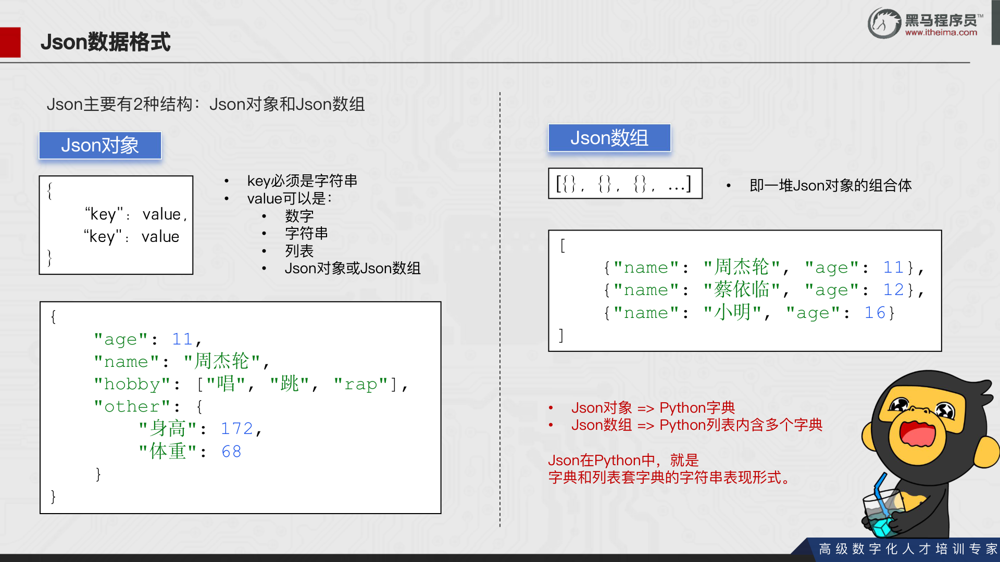

</details>

<a id="page-077"></a>

### Python中使用Json

<!-- PDF 第 77 页 -->

Python中使用Json主要完成：

- 将Python字典、列表转换为Json字符串

- 读取Json字符串，转换为Python字典或列表

主要使用Python内置的json库

- json.dumps(字典或列表, ensure\_ascii=False)：将字典或列表转换为Json字符串

    - ensure\_ascii参数确保中文能正常显示
    - 返回值：Json字符串

- json.loads(json字符串)：将Json字符串转换为Python字典或列表

    - 返回值：Python字典 或 Python列表


高 级 数 字 化 人 才 培 训 专 家

<details>
<summary>第 77 页原图</summary>

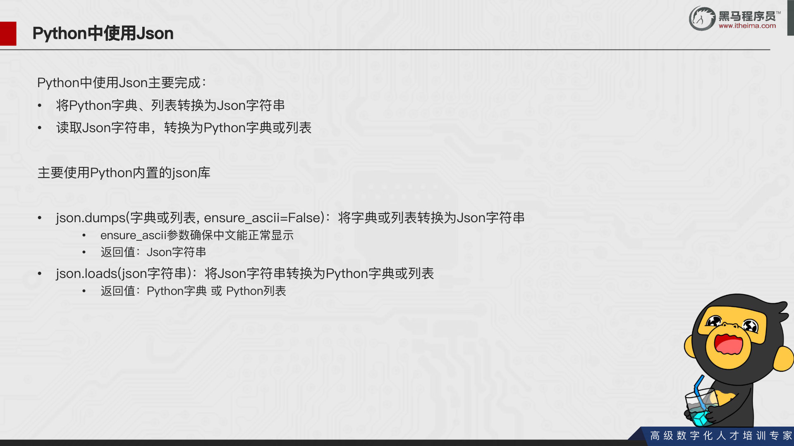

</details>

<a id="page-078"></a>

### Json数据格式小结

<!-- PDF 第 78 页 -->

Json是一种带有格式的字符串，可以很好的记录数据和结构

- 便于不同程序之间数据交互

Json作为字符串，其内容和Python的数据结构可以有所对应。

- Json对象  Python字典

~~~~
{
    "age": 11, 
    "name": "周杰轮", 
    "hobby": ["唱", "跳", "rap"], 
    "other": {
        "身高": 172, 
        "体重": 68
    }
}
~~~~

- Json数组  Python列表（内含多个字典）

~~~~
[
    {"name": "周杰轮", "age": 11}, 
    {"name": "蔡依临", "age": 12}, 
    {"name": "小明", "age": 16}
]
import json
~~~~

- json.dumps(字典或列表, ensure\_ascii=False)
    - 将Python数据结构转为Json字符串

- json.loads(json字符串)
    - 将Json字符串转为Python数据结构

高 级 数 字 化 人 才 培 训 专 家

<details>
<summary>第 78 页原图</summary>

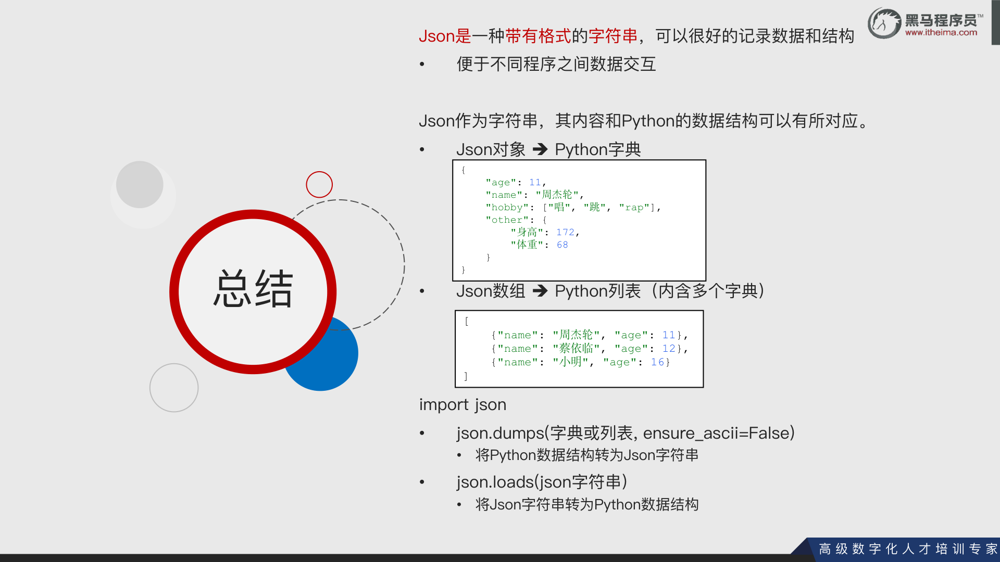

</details>

<a id="page-079"></a>

## 提示词实战案例 LLM实现金融文本信息抽取

<!-- PDF 第 79 页 -->

当前章节：《提示词工程》

高 级 数 字 化 人 才 培 训 专 家

<details>
<summary>第 79 页原图</summary>


</details>

<a id="page-080"></a>

### LLM信息抽取任务介绍

<!-- PDF 第 80 页 -->

首先，我们定义信息抽取的Schema：

~~~~
# 定义不同实体下的具备属性
schema = {
    '金融': ['日期', '股票名称', '开盘价', '收盘价', '成交量'],
}
 
~~~~

下面几段文本来自某平台发布的股票信息：

1. '2023-02-15，寓意吉祥的节日，股票佰笃\[BD\]美股开盘价10美元，虽然经历了波动，但最终以13美元收盘，成交量

微幅增加至460,000，投资者情绪较为平稳。',
2. '2023-04-05，市场迎来轻松氛围，股票盘古(0021)开盘价23元，尽管经历了波动，但最终以26美元收盘，成交量缩

小至310,000，投资者保持观望态度。',

我们的目的是期望模型能够帮助我们识别出这2段话中的SPO三元组信息。


高 级 数 字 化 人 才 培 训 专 家

<details>
<summary>第 80 页原图</summary>

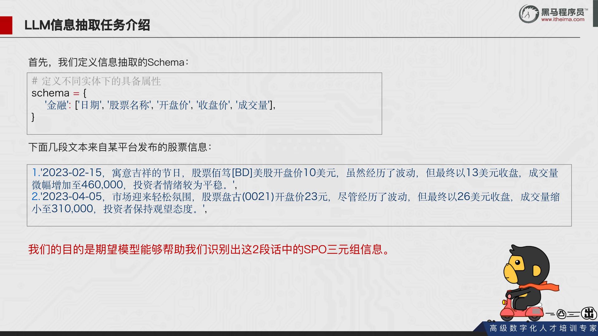

</details>

<a id="page-081"></a>

### 信息抽取的 Few-shot 提示词设计

<!-- PDF 第 81 页 -->

在该任务的 prompt 设计中，我们主要考虑 2 点：

- 需要向模型解释什么叫作「信息抽取任务」

- 需要让模型按照我们指定的格式（json）输出

为了让模型知道什么叫做「信息抽取」，我们借用 FewShot 的方式，先给模型展示几个正确的例子：

User:'2023-01-10，股市震荡。股票古哥-D\[EOOE\]美股今日开盘价100美元，一度飙升至105美元，随后回落至98美元，最终以102美元收盘，
成交量达到520000。'。提取上述句子中“金融”('日期', '股票名称', '开盘价', '收盘价', '成交量')类型的实体，并按照JSON格式输出，上述句子
中没有的信息用\['原文中未提及'\]来表示，多个值之间用','分隔。

Bot: {'日期': \['2023-01-10'\],'股票名称': \['古哥-D\[EOOE\]美股'\],'开盘价': \['100美元'\], '收盘价': \['102美元'\],成交量': \['520000'\]} ...

其中，User 代表我们输入给模型的句子，Bot 代表模型的回复内容。

注意：上述例子中 Bot 的部分也是由人工输入的，其目的是希望看到在看到类似 User 中的句子时，模型应当做出类似 Bot
的回答。

高 级 数 字 化 人 才 培 训 专 家

<details>
<summary>第 81 页原图</summary>

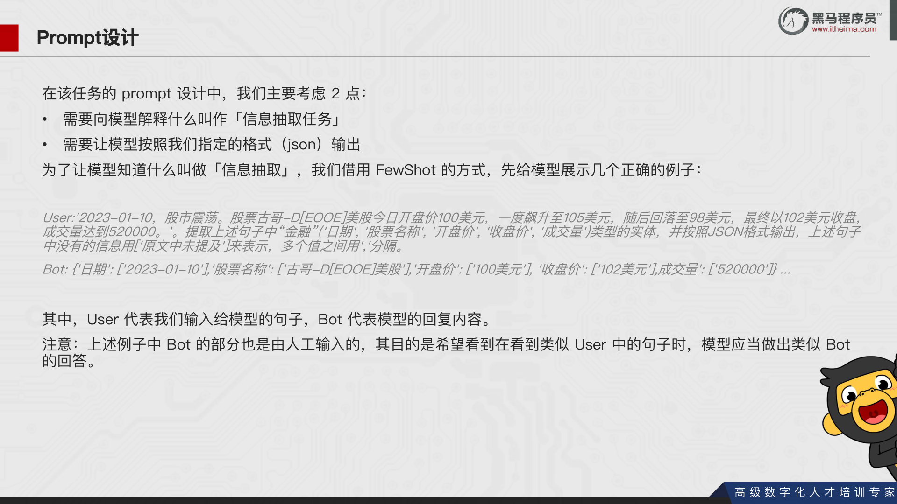

</details>

<a id="page-082"></a>

### 定义金融实体 Schema 与抽取示例

<!-- PDF 第 82 页 -->

本次信息抽取任务实现的主要过程：构造prompt -\> 对句子做分类 -\> 进行信息抽取

导入必备的工具包：

~~~~
from dotenv import load_dotenv
import openai
import json
import re
import os
### 加载环境变量
load_dotenv()
# 定义不同实体下的具备属性
schema = {
    '金融': ['日期', '股票名称', '开盘价', '收盘价', '成交量'],
}
IE_PATTERN = "{}\n\n提取上述句子中{}的实体，并按照JSON格式输出，上述句子中不存在的信息用['原文中未提及']来表示，多个值之间用','分隔。"
# 提供一些例子供模型参考
ie_examples = {
        '金融': [
                    {
                        'content': '2023-01-10，股市震荡。股票古哥-D[EOOE]美股今日开盘价100美元，一度飙升至105美元，随后回落至98美元，最终以102美元收盘，成交量达到520000。',
                        'answers': {
                                        '日期': ['2023-01-10'],
                                        '股票名称': ['古哥-D[EOOE]美股'],
                                        '开盘价': ['100美元'],
                                        '收盘价': ['102美元'],
                                        '成交量': ['520000'],
                            }
                    }
        ]
}
 
~~~~

高 级 数 字 化 人 才 培 训 专 家

<details>
<summary>第 82 页原图</summary>

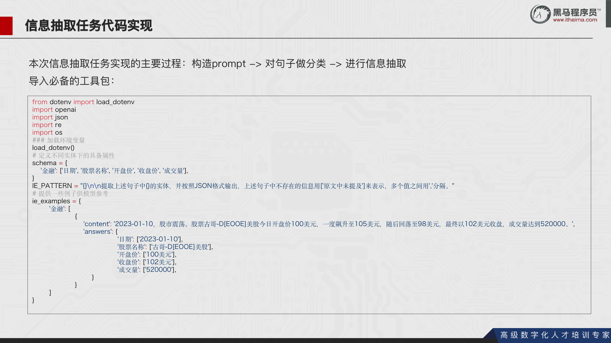

</details>

<a id="page-083"></a>

### 构建信息抽取的历史消息

<!-- PDF 第 83 页 -->

构建init\_prompts()函数:

~~~~
# 2 构建函数，进行prompt设计
def init_prompt(ie_examples):
    '''
    构建实体提取提示词
    :param ie_examples:
    :return:
    '''
    history = [
        {'role': 'system', 'content': "现在你需要帮助我完成信息抽取任务，当我给你一个句子时，你需要帮我抽取出句子中实体信息，并按照
JSON的格式输出，上述句子中没有的信息用['原文中未提及']来表示，多个值之间用','分隔。"}
    ]
    for example_cls, examples in ie_examples.items():
        for example in examples:
            history.append({'role': 'user', 'content': IE_PATTERN.format(example['content'], schema[example_cls])})
            history.append({'role':'assistant','content':json.dumps(example['answers'])})
    return  history
 
~~~~

高 级 数 字 化 人 才 培 训 专 家

<details>
<summary>第 83 页原图</summary>

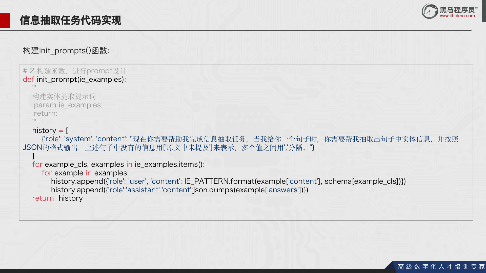

</details>

<a id="page-084"></a>

### 清洗模型响应并解析 JSON

<!-- PDF 第 84 页 -->

构建clean\_response()函数:

~~~~
def clean_response(response: str):
    """
    后处理模型输出。
    Args:
        response (str): _description_
    """
    if '```json' in response:
        res = re.findall(r'```json(.*?)```', response)
        if len(res) and res[0]:
            response = res[0]
        response.replace('、', ',')
    try:
        return json.loads(response)
    except:
        return response
 
~~~~

高 级 数 字 化 人 才 培 训 专 家

<details>
<summary>第 84 页原图</summary>

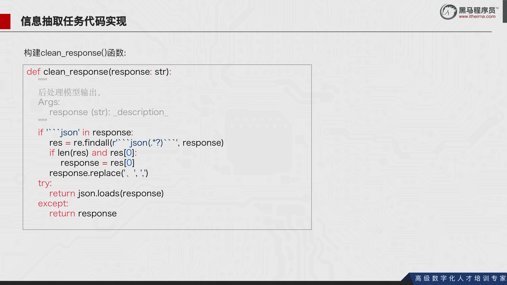

</details>

<a id="page-085"></a>

### 封装信息抽取的 Qwen 调用函数

<!-- PDF 第 85 页 -->

构建qwen\_model()函数:

~~~~
def qwen_model(prompt, client, history=[]):
    '''
    构建qwen模型推理
    :param prompt:
    :param client:
    :param history:
    :return:
    '''
    completion = client.chat.completions.create(
        model=os.getenv("model"),
        messages=history+[{'role': 'user', 'content': prompt}]
    )
    resp = completion.choices[0].message.content
    return  resp
 
~~~~

高 级 数 字 化 人 才 培 训 专 家

<details>
<summary>第 85 页原图</summary>

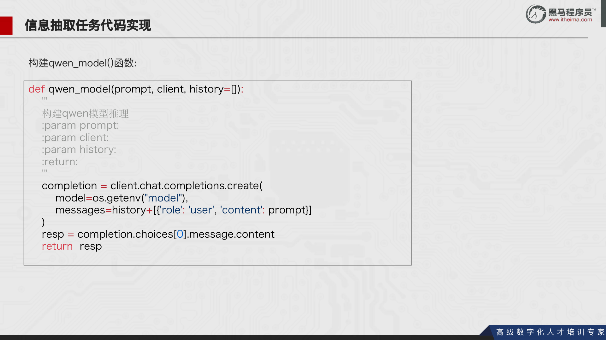

</details>

<a id="page-086"></a>

### 执行信息抽取并展示结果

<!-- PDF 第 86 页 -->

代码调用和结果展示:

~~~~
if __name__ == '__main__':
    history = init_prompt(ie_examples)
    for sentence in sentences:
        resp=qwen_model(IE_PATTERN.format(sentence, 
schema['金融']), client, history)
        print(resp)
        print(clean_response(resp))
 
~~~~

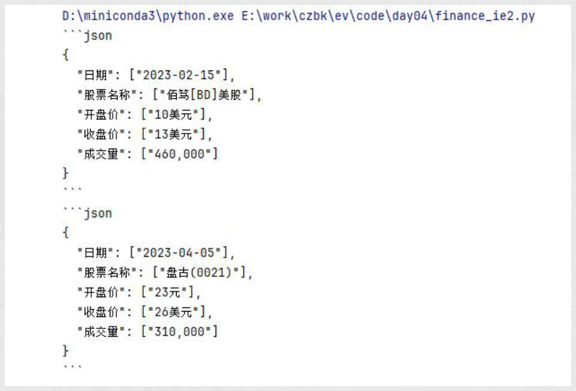

高 级 数 字 化 人 才 培 训 专 家

<details>
<summary>第 86 页原图</summary>

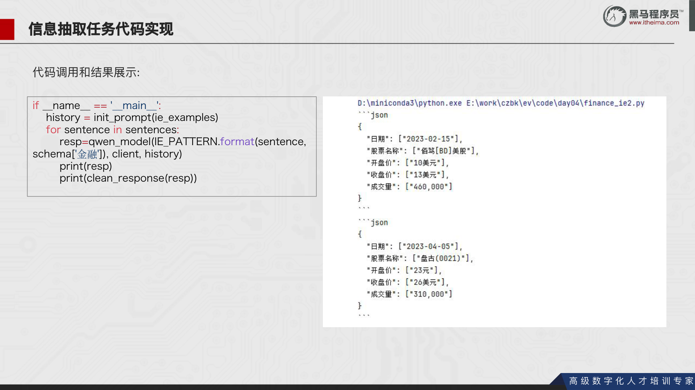

</details>

<a id="page-087"></a>

### 练习彩票信息抽取作业

<!-- PDF 第 87 页 -->

有如下5条文本，需要抽取信息：

1. 2025年第100期，开好红球22 21 06 01 03 11 篮球 07，一等奖中奖为2注。

2. 2025101期，有3注1等奖，10注2等奖，开号篮球11，中奖红球3、5、7、11、12、16。

期待经过通过模型抽取信息得到如下结果：

1. {“期数”: “2025100”，”中奖号码”: \[1, 3, 6, 11, 21, 22, 7\], “一等奖”: “2注”}

2. {“期数”: “2025101”，”中奖号码”: \[3, 5, 7, 11, 12, 16, 11\], “一等奖”: “3注”}

请设计Prompt，基于FewShot，对模型做示例的提示，得到需要的结果。


高 级 数 字 化 人 才 培 训 专 家

<details>
<summary>第 87 页原图</summary>

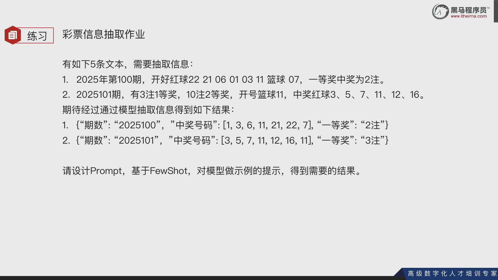

</details>

<a id="page-088"></a>

## 提示词实战案例 LLM实现金融文本匹配

<!-- PDF 第 88 页 -->

当前章节：《提示词工程》

高 级 数 字 化 人 才 培 训 专 家

<details>
<summary>第 88 页原图</summary>


</details>

<a id="page-089"></a>

### LLM信息文本匹配任务介绍

<!-- PDF 第 89 页 -->

首先，我们构造几个短文本对：

1. ('股票市场今日大涨，投资者乐观。', '持续上涨的市场让投资者感到满意。'),
2. ('油价大幅下跌，能源公司面临挑战。', '未来智能城市的建设趋势愈发明显。'),
3. ('利率上升，影响房地产市场。', '高利率对房地产有一定冲击。'),

我们期望模型能够帮我们识别出成对的句子中，2句话是否是有关联的。

我们期望模型输出的结果为：

\['是', '不是', '是'\]


高 级 数 字 化 人 才 培 训 专 家

<details>
<summary>第 89 页原图</summary>

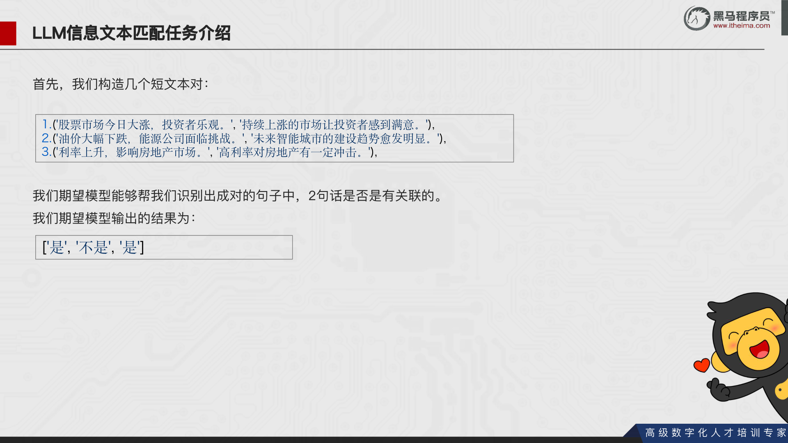

</details>

<a id="page-090"></a>

### 文本匹配的 Few-shot 提示词设计

<!-- PDF 第 90 页 -->

在该任务的 prompt 设计中，我们主要考虑 2 点：

- 需要向模型解释什么叫作「文本匹配任务」

- 需要让模型按照我们指定的格式输出

为了让模型知道什么叫做「文本匹配任务」，我们借用 FewShot 的方式，先给模型展示几个正确的例子：

User:

句子一: 公司ABC发布了季度财报，显示盈利增长。\\n

句子二: 财报披露，公司ABC利润上升

Bot: 是

User:

句子一: 黄金价格下跌，投资者抛售。\\n

句子二: 外汇市场交易额创下新高

Bot: 不是 ...

其中，User 代表我们输入给模型的句子，Bot 代表模型的回复内容。

注意：上述例子中 Bot 的部分也是由人工输入的，其目的是希望看到在看到类似 User 中的句子时，模型应当做出类似 Bot
的回答。


高 级 数 字 化 人 才 培 训 专 家

<details>
<summary>第 90 页原图</summary>

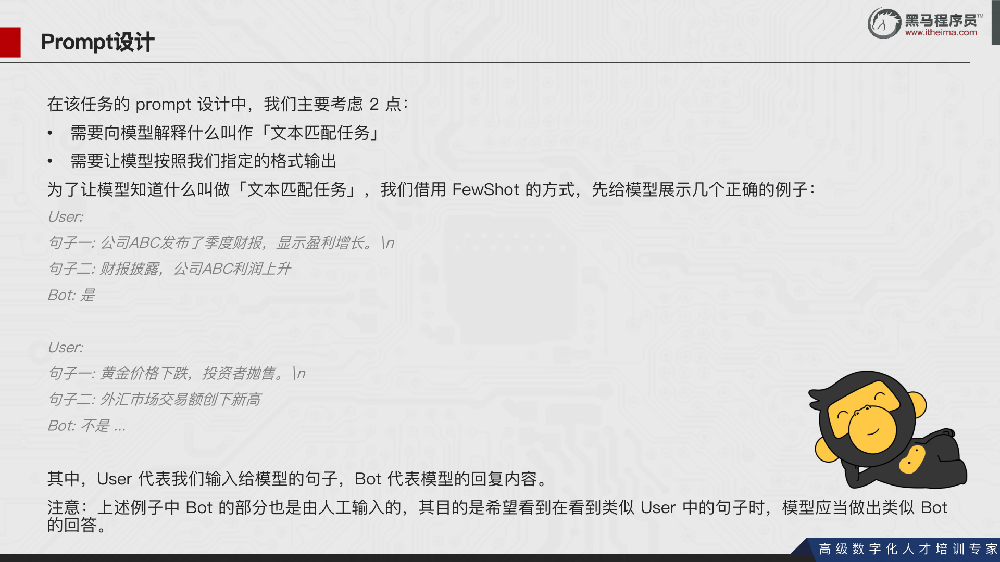

</details>

<a id="page-091"></a>

### 准备文本匹配的工具与样本

<!-- PDF 第 91 页 -->

导入必备的工具包:

~~~~
"""
利用 Qwen LLM 进行文本匹配
"""
# 1 导入必备的工具包
from dotenv import load_dotenv
from openai import OpenAI
import json
import re
import os
# 提供相似，不相似的语义匹配例子
examples = {
    '是': [
        ('公司ABC发布了季度财报，显示盈利增长。', '财报披露，公司ABC利润上升。'),
    ],
    '不是': [
        ('黄金价格下跌，投资者抛售。', '外汇市场交易额创下新高。'),
        ('央行降息，刺激经济增长。', '新能源技术的创新。')
    ]
}
 
~~~~

高 级 数 字 化 人 才 培 训 专 家

<details>
<summary>第 91 页原图</summary>

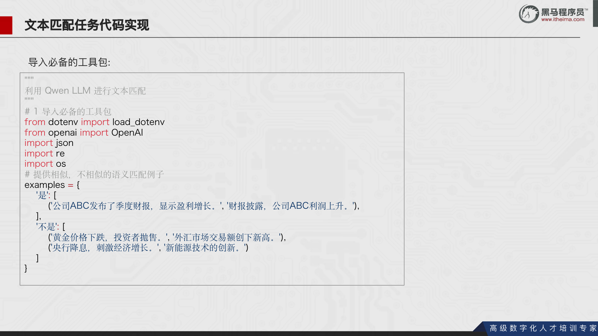

</details>

<a id="page-092"></a>

### 构建文本匹配提示词

<!-- PDF 第 92 页 -->

构建init\_prompts()函数:

~~~~
# 2 构建函数，进行prompt设计（描述清楚任务及输出格式）
def init_prompt(examples):
    '''
    定义匹配的history
    :param examples:
    :return:
    '''
    history = [
        {'role': 'system', 'content': '判断2个句子语义是否相似，相似句子返回是，不相似句子返回不是，不要其他回答'},
    ]
    for label,example in examples.items():
        for sentence_pair in example:
            history.append({'role': 'user', 'content': "句子一：{}\n句子二：{}\n 是否是语义相同的句子？".format(sentence_pair[0], 
sentence_pair[1])})
            history.append({'role': 'assistant', 'content': label})
    return  history
 
~~~~

高 级 数 字 化 人 才 培 训 专 家

<details>
<summary>第 92 页原图</summary>

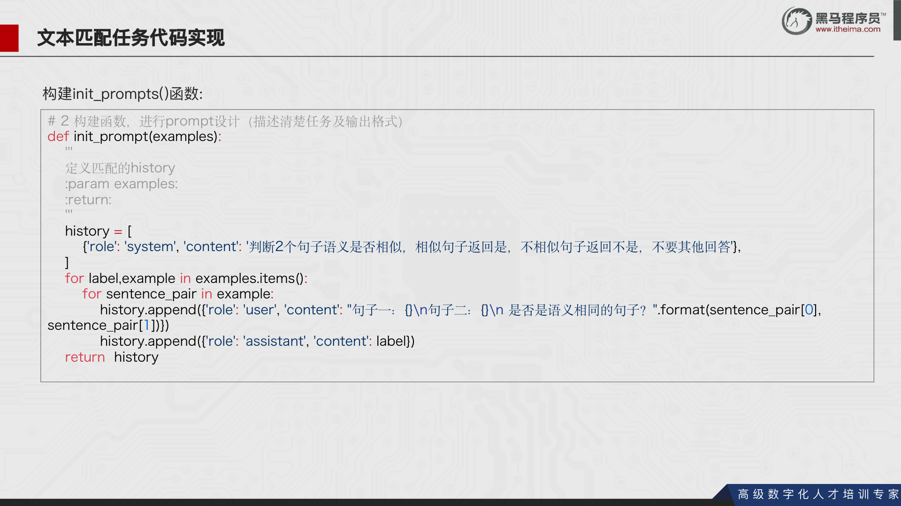

</details>

<a id="page-093"></a>

### 封装文本匹配的模型调用

<!-- PDF 第 93 页 -->

构建qwen\_model()函数:

~~~~
def qwen_model(prompt, client, history=[]):
    '''
    qwen模型推理
    '''
    completion = client.chat.completions.create(
        model=os.getenv("model"),
        messages=history+[{'role': 'user', 'content': prompt}]
    )
    return completion.choices[0].message.content
 
~~~~

高 级 数 字 化 人 才 培 训 专 家

<details>
<summary>第 93 页原图</summary>

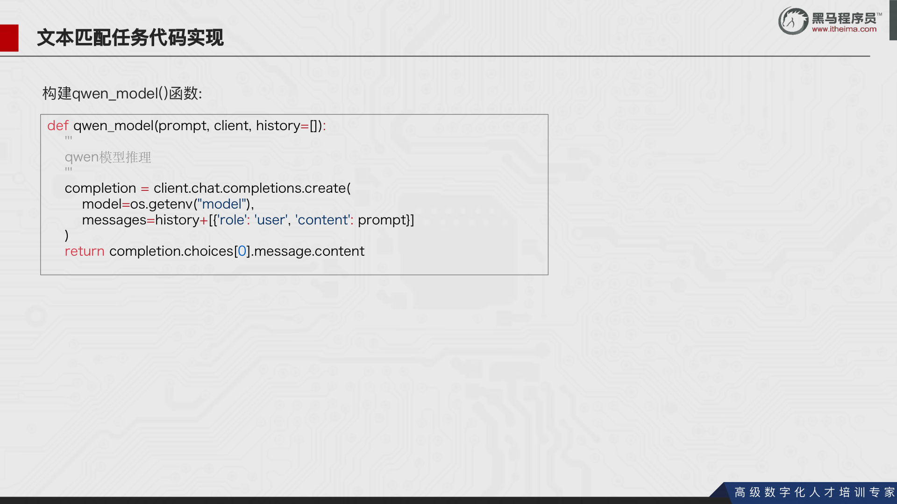

</details>

<a id="page-094"></a>

### 执行文本匹配并查看输出

<!-- PDF 第 94 页 -->

代码调用和结果打印展示:

~~~~
if __name__ == '__main__':
    history = init_prompt(examples)
    for pairs in sentence_pairs:
        print(pairs)
        prompt = "句子一：{}\n句子二：{}\n 是否是语义相同的句子？
".format(pairs[0], pairs[1])
        response = qwen_model(prompt, client, history)
        print(response)
 
~~~~


高 级 数 字 化 人 才 培 训 专 家

<details>
<summary>第 94 页原图</summary>

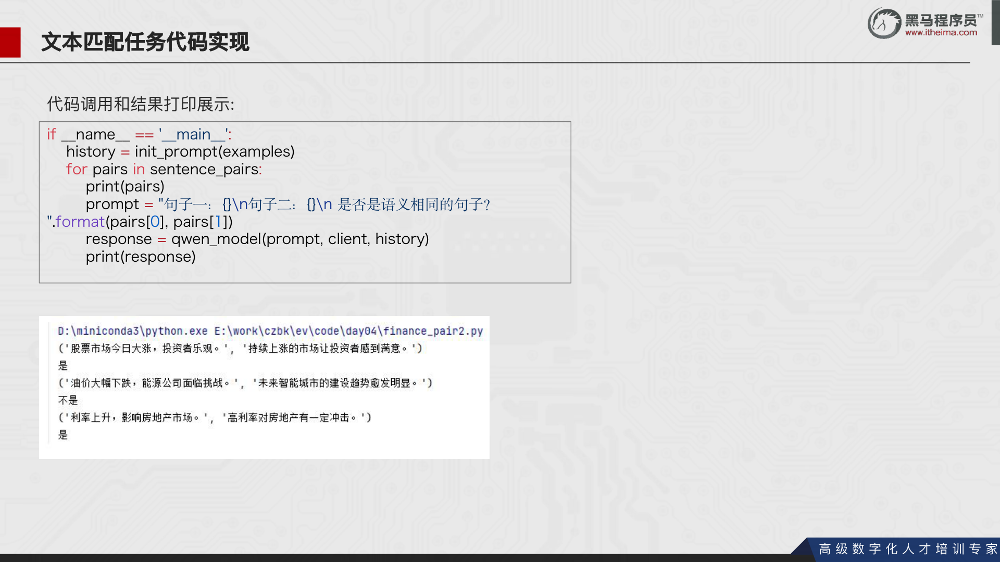

</details>

<a id="page-095"></a>

## 课后作业

<!-- PDF 第 95 页 -->

当前章节：《提示词工程》

高 级 数 字 化 人 才 培 训 专 家

<details>
<summary>第 95 页原图</summary>


</details>

<a id="page-096"></a>

### 提示词优化作业

<!-- PDF 第 96 页 -->

代码调用和结果打印展示:

~~~~
if __name__ == '__main__':
    history = init_prompt(examples)
    for pairs in sentence_pairs:
        print(pairs)
        prompt = "句子一：{}\n句子二：{}\n 是否是语义相同的句子？
".format(pairs[0], pairs[1])
        response = qwen_model(prompt, client, history)
        print(response)
 
~~~~

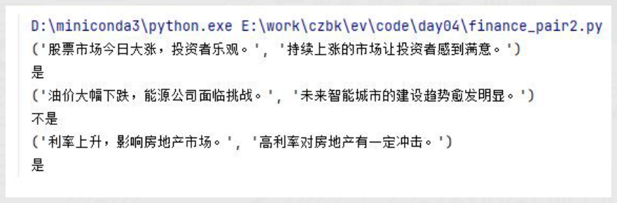

高 级 数 字 化 人 才 培 训 专 家

<details>
<summary>第 96 页原图</summary>

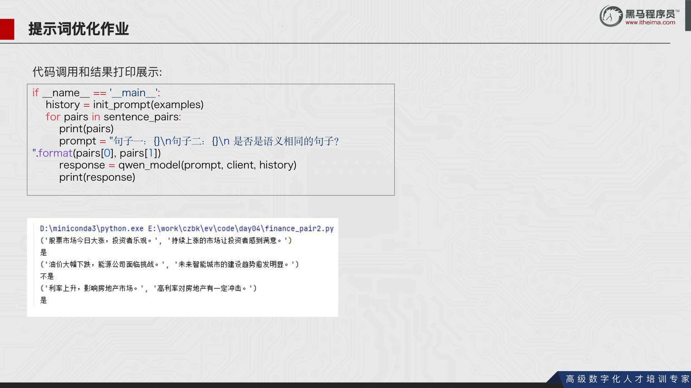

</details>
