# 掌握未来AI趋势 RAG引领大语言模型新纪元

<!-- PDF 第 1 页 -->

## 目录

- [本章简介](#page-002)
- [大模型应用遍地开花](#page-003)
- [大模型的两面性](#page-004)
- [大模型的局限](#page-005)
- [企业需求](#page-006)
- [大模型局限 vs 企业需求](#page-007)
- [解锁RAG三大核心](#page-008)
- [大模型的long context vs RAG](#page-010)
  - [长上下文能力与产品示例](#topic-010)
  - [成本、效率与数据安全](#topic-012)
  - [超长上下文检索能力的局限](#topic-013)
- [RAG技术栈：从60分到90分的跨越](#page-015)
  - [企业RAG的六类挑战](#topic-015)
  - [完整技术栈与技术选型](#topic-017)
- [RAG人才炙手可热，你准备好了吗？](#page-018)
  - [人才市场需求](#topic-018)
  - [行业分布](#topic-019)
  - [开发能力要求](#topic-020)
- [本课程案例说明](#page-021)
  - [项目组成与开发环境](#topic-021)
  - [制度问答模块](#topic-022)
  - [金融智库模块](#topic-023)
  - [项目总体架构](#topic-024)

---

<!-- PDF 第 2 页 -->

## 本章简介

- 大模型应用为什么需要RAG
- 解锁RAG三大核心
- 大模型long context能力与RAG的争议
- 怎么学习RAG技术栈
- RAG市场前景如何
- 课程实战项目介绍

<!-- PDF 第 3 页 -->

## 大模型应用遍地开花

- 大模型应用场景：查资料、写文案、会议总结、写代码、找bug、阅读论文、数据分析
- 国内大模型产品：文心一言、KIMI Chat、海螺AI、天工AI、秘塔搜索、360 AI搜索、秘塔写作猫
- 国外大模型产品：GPT4-O、Gemini、Claude、GitHub Copilot

<!-- PDF 第 4 页 -->

## 大模型的两面性

- 擅长创意创造：文案生成，故事生成，文本润色无标准答案的创意类的任务，生成式AI都表现的非常出色

- 缺乏领域知识：受限于训练语料，甚至都不知道今天是几号

<!-- PDF 第 5 页 -->

## 大模型的局限

- 缺乏企业专业知识：企业内部私有数据不公开；针对这部分数据的问题，大语言模型的输出没有得到任何已知事实的支持，输出的结果可信度低，存在幻觉问题

- 知识时效性：大模型知识更新难（需要重新训练）

- 结果不可解释性：大模型输出具有随机性，无法解释合理性

<!-- PDF 第 6 页 -->

## 企业需求

- 企业业务需要有内部私有数据支撑

- 企业的业务知识会不断变化和更新

- 企业需要给客户准确的信息，内容可追溯可解释

<!-- PDF 第 7 页 -->

## 大模型局限 vs 企业需求

- 如何有效的利用外部的企业数据：RAG（检索增强生成）

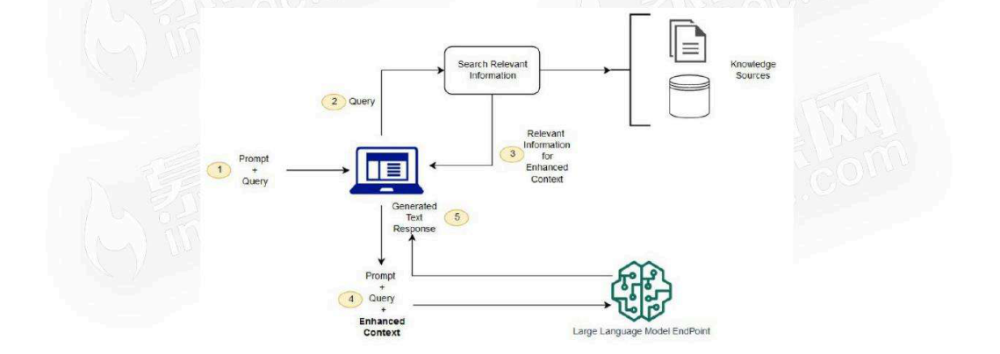

<!-- PDF 第 8 页 -->

## 解锁RAG三大核心

- RAG=知识库+检索＋大语言模型

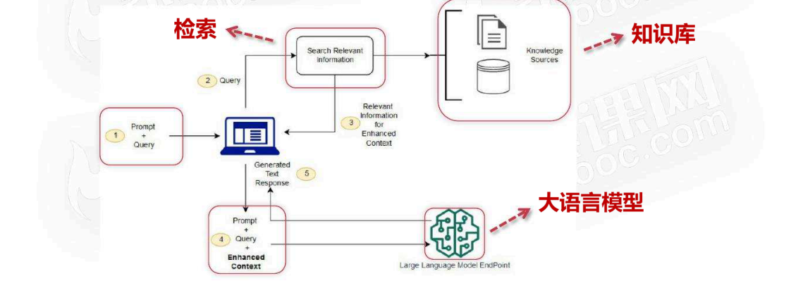

<!-- PDF 第 9 页 -->

- 知识库：囊括企业私有的数据，满足企业业务需求，可以根据需要进行更新和维护

- 检索：根据用户的问题，在知识库中找到相关的信息，为回答提供丰富的上下文信息

- 大语言模型：在丰富上下文加持下，大语言模型可以根据上下文信息来回答问题，减缓幻觉，降低生成错误信息的概率

<!-- PDF 第 10 页 -->

## 大模型的long context vs RAG

### 长上下文能力与产品示例

- 大模型的long Context能力：支持百万级别token输入

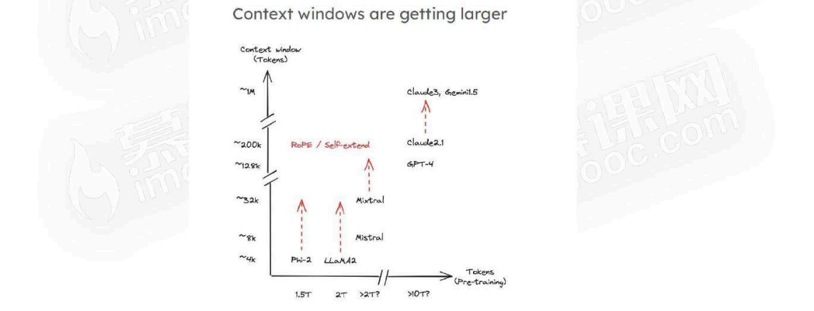

<!-- PDF 第 11 页 -->

- Kimi chat支持200万token输入

<!-- PDF 第 12 页 -->

### 成本、效率与数据安全

- 把企业知识作为长上下文直接输入到大语言模型，是否可行？

- 问题分析1：推理成本高，效率低

- 问题分析2：企业私有数据的安全风险高

<!-- PDF 第 13 页 -->

### 超长上下文检索能力的局限

- 问题分析3：大模型处理超长上下文的能力不完美，有待提升

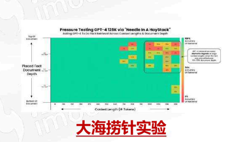

在一个超长的上下文中的随机位置插入多个“针”（needles，即知识点）

验证大模型在超长上下文中能否精准的检索出这些“针”

<!-- PDF 第 14 页 -->

- 问题分析3：大模型处理超长上下文的能力不完美，有待提升

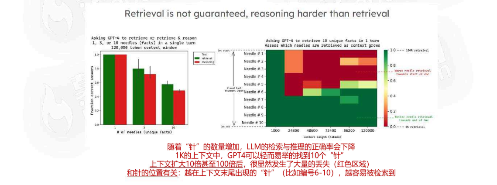

<!-- PDF 第 15 页 -->

## RAG技术栈：从60分到90分的跨越

### 企业RAG的六类挑战

- 企业RAG面临的问题1：企业数据复杂多样（结构化、非结构化、格式多样），如何处理企业数据？

- 企业RAG面临的问题2：处理好的数据如何构建知识库（如何分块，如何高效索引）

- 企业RAG面临的问题3：用户问题的多样

<!-- PDF 第 16 页 -->

- 企业RAG面临的问题4：RAG中知识增强的关键是获得和问题相关的信息，如何高效的检索是关键？

- 企业RAG面临的问题5：如何处理多个上下文相关的信息（如何排序相关信息，如何写合适的prompt激发大模型潜能，哪种大模型合适）

- 企业RAG面临的问题6：如何评估RAG符合企业项目要求？

<!-- PDF 第 17 页 -->

### 完整技术栈与技术选型

- 面对企业RAG挑战，需要全面的RAG技术栈知识，找到不同项目最适合的技术

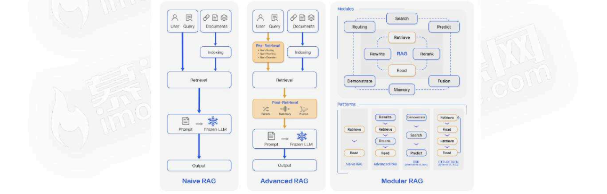

<!-- PDF 第 18 页 -->

## RAG人才炙手可热，你准备好了吗？

### 人才市场需求

- 企业AI应用人才火热

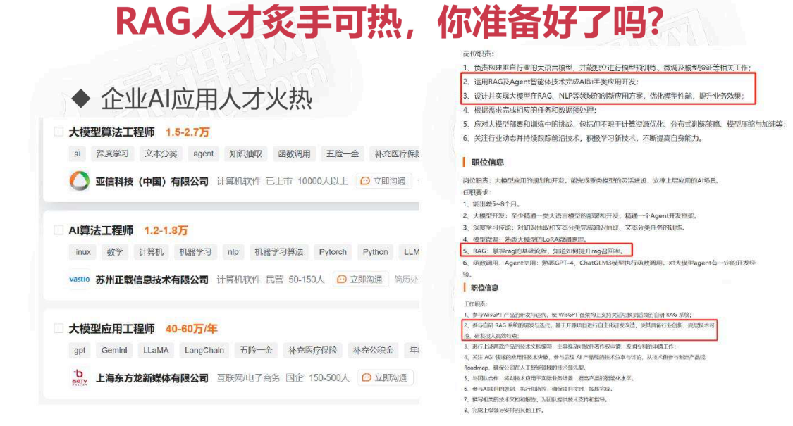

<!-- PDF 第 19 页 -->

### 行业分布

- 企业AI应用开发行业分布

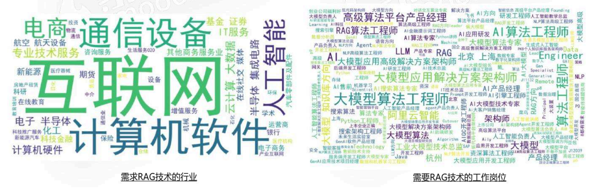

<!-- PDF 第 20 页 -->

### 开发能力要求

- 企业AI应用开发能力要求

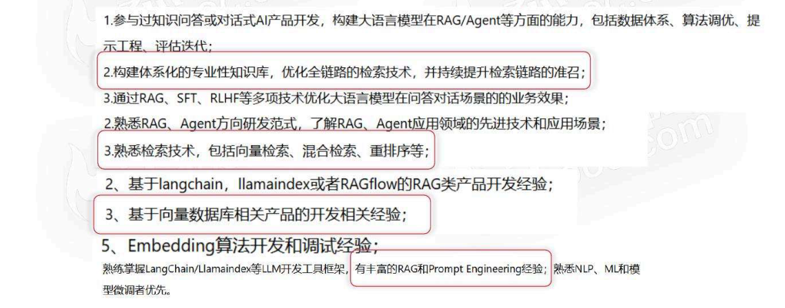

<!-- PDF 第 21 页 -->

## 本课程案例说明

### 项目组成与开发环境

- 企业员工组手：制度问答模块、基于知识图谱的企业知识问答模块【金融智库】
- 开发环境：python3.9、langchain、llamaindex、pytorch、transformers、gradio、fastapi、chroma、neo4j、jupyter

<!-- PDF 第 22 页 -->

### 制度问答模块

- 制度问答模块：是帮助员工更好的了解公司的制度，如考勤制度，报销制度等

- 数据：考勤管理和差旅费用标准（PDF、EXCEL）

- 目的：RAG整体流程和优化技术

<!-- PDF 第 23 页 -->

### 金融智库模块

- 金融智库：企业业务组手，基于知识图谱的企业知识问答模块，提供多方面的金融知识，给予金融员工分析和投资决策

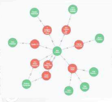

- 数据：金融知识图谱数据（图数据库）

- 目的：将知识图谱引入RAG，提升RAG能力

<!-- PDF 第 24 页 -->

### 项目总体架构

- 总体架构图

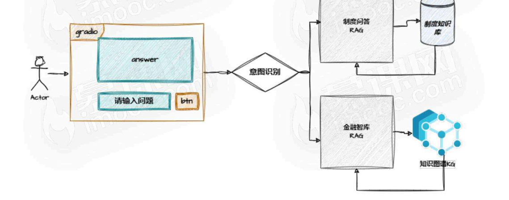
