# 02大模型RAG开发

## 目录

- [RAG介绍](#page-001)
  - [大模型的局限与 RAG 的作用](#page-002)
  - [RAG 工作流程与标准架构图](#page-003)
  - [离线准备线与在线服务线](#page-004)
  - [RAG标准流程](#page-005)
- [向量的基础概念](#page-007)
  - [向量在 RAG 流程中的作用](#page-008)
  - [向量：文本的数学表示](#page-009)
  - [文本嵌入与相似度匹配](#page-010)
  - [向量维度的含义与选择](#page-011)
- [【扩展】余弦相似度](#page-013)
  - [向量方向、长度与夹角](#page-014)
  - [余弦相似度的公式与计算示例](#page-015)
- [LangChain 简介](#page-016)
  - [LangChain 的定位与开发价值](#page-017)
  - [LangChain 的六类核心功能](#page-018)
- [LangChain 环境部署](#page-020)
  - [LangChain安装](#page-021)
- [Models：大语言模型接入](#page-022)
  - [LLMs、Chat Models 与 Embeddings 的分类](#page-023)
  - [LLMs（阿里云大语言模型的访问）](#page-024)
  - [LLMs（Ollama本地大语言模型的访问）](#page-025)
- [Models：流式输出](#page-027)
  - [invoke 与 stream 的调用方式](#page-028)
- [Models：聊天模型与消息](#page-030)
  - [AIMessage、HumanMessage 与 SystemMessage](#page-031)
  - [使用 HumanMessage 调用聊天模型](#page-032)
  - [组合 SystemMessage 与 HumanMessage](#page-033)
  - [加入 AIMessage 构建多轮对话](#page-034)
- [Models：消息简写](#page-035)
  - [消息类与二元组写法的对应关系](#page-036)
  - [简写消息的动态转换与变量占位](#page-037)
- [Models：文本嵌入](#page-038)
  - [使用阿里云 DashScopeEmbeddings](#page-039)
  - [使用本地 OllamaEmbeddings](#page-040)
  - [三类模型的接入方式与接口对照](#page-041)
- [Prompts：通用提示词模板](#page-043)
  - [PromptTemplate 的基础写法与链式调用](#page-044)
- [FewShotPromptTemplate：少样本提示词](#page-046)
  - [FewShotPromptTemplate 的参数与结构](#page-047)
  - [组装示例并生成完整提示词](#page-048)
  - [调用模型执行少样本任务](#page-049)
  - [练习：抽取产品名称与核心卖点](#page-051)
- [提示词模板的 format 与 invoke](#page-052)
  - [模板方法示例与继承关系](#page-053)
  - [format 与 invoke 的行为差异](#page-054)
- [ChatPromptTemplate：历史会话模板](#page-055)
  - [通过 from_messages 创建会话模板](#page-056)
  - [使用 MessagesPlaceholder 动态注入历史消息](#page-057)
  - [结合历史示例完成反义词任务](#page-058)
- [Chains：链的基础使用](#page-059)
  - [组件串联原理与 Runnable 继承关系](#page-060)
  - [创建链并通过 invoke 或 stream 执行](#page-061)
- [Python 管道运算符重载](#page-063)
  - [管道运算符与魔法方法的对应关系](#page-064)
  - [实现 Test 与 MySequence 链式调用](#page-065)
- [StrOutputParser：字符串输出解析](#page-066)
  - [直接串联两个模型时的类型错误](#page-067)
  - [AIMessage 与模型输入类型不兼容的原因](#page-068)
  - [用 StrOutputParser 转换输出并连接模型](#page-069)
- [Runnable：可执行组件接口](#page-071)
  - [RunnableSequence 的形成与链式组合](#page-072)
- [JsonOutputParser：多模型执行链](#page-073)
  - [多模型链中的数据处理流程](#page-074)
  - [将 AIMessage 转为提示词需要的字典](#page-075)
  - [使用 JsonOutputParser 构建完整多模型链](#page-076)
- [RunnableLambda：自定义函数入链](#page-078)
  - [将普通函数转换为 Runnable 组件](#page-079)
  - [使用 Lambda 转换模型输出的示例](#page-080)
  - [普通函数直接入链的自动包装机制](#page-081)
- [Memory：临时会话记忆](#page-083)
  - [为链附加历史记录与内存存储](#page-084)
  - [按会话 ID 管理临时记忆的完整示例](#page-085)
- [Memory：长期会话记忆](#page-087)
  - [从内存记忆转向本地文件存储](#page-088)
  - [实现 FileChatMessageHistory 的核心接口](#page-089)
  - [持久化会话链与多轮对话测试](#page-090)
- [Document Loaders：文档加载基础](#page-091)
  - [Document 的内容与元数据结构](#page-092)
  - [load 与 lazy_load 的加载方式](#page-093)
  - [CSVLoader 的基础用法](#page-094)
  - [自定义 CSV 分隔符、引号与字段名](#page-095)
- [JSONLoader：JSON 文档加载](#page-097)
  - [jq Schema 的 JSON 信息抽取规则](#page-098)
  - [加载 JSON 文件与 JSON Lines](#page-099)
- [PyPDFLoader：PDF 文档加载](#page-101)
  - [配置 PDF 加载方式与密码](#page-102)
- [TextLoader 与文档分割](#page-103)
  - [文本文件加载与大文档问题](#page-104)
  - [使用 RecursiveCharacterTextSplitter 切分文档](#page-105)
- [Vector Stores：向量存储](#page-107)
  - [向量存储在 RAG 中的作用与统一接口](#page-108)
  - [InMemoryVectorStore 与 Chroma 的使用](#page-109)
- [检索向量并构建提示词](#page-111)
  - [检索匹配信息并组装问答上下文](#page-112)
- [RunnablePassthrough：向量检索入链](#page-113)
  - [将向量检索与上下文传递加入链](#page-114)

## RAG介绍

<!-- PDF 第 1 页 -->

- 理解什么是RAG
- 理解RAG解决什么问题
- 理解RAG的工作流程

Part : LangChain RAG开发

高 级 数 字 化 人 才 培 训 专 家

第 1 页原图

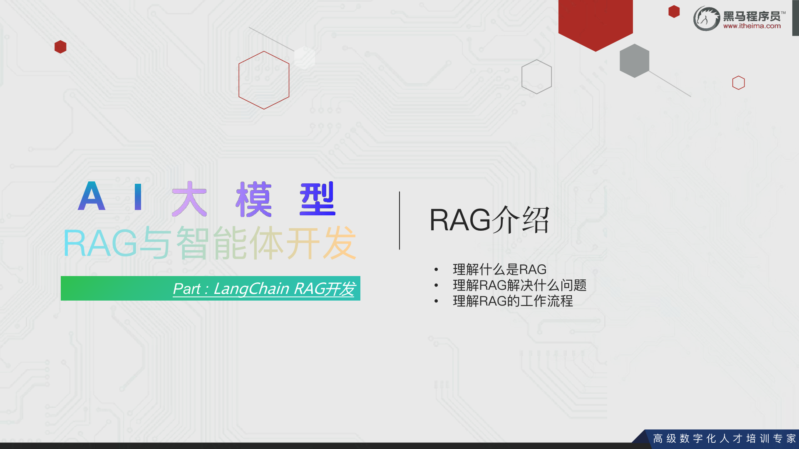

### 大模型的局限与 RAG 的作用

<!-- PDF 第 2 页 -->

通⽤的基础⼤模型存在一些问题：

- LLM的知识不是实时的，模型训练好后不具备自动更新知识的能力，会导致部分信息滞后

- LLM领域知识是缺乏的，⼤模型的知识来源于训练数据，这些数据主要来自公开的互联网和开源数据集，无法覆盖特定领域或高度专业化
    的内部知识

- 幻觉问题，LLM有时会在回答中⽣成看似合理但实际上是错误的信息

- 数据安全性

RAG（Retrieval-Augmented Generation）即检索增强⽣成，为⼤模型提供了从特定数据源检索到的信息，以此来修正和补充生成的答案。
可以总结为一个公式：RAG = 检索技术 + LLM 提示

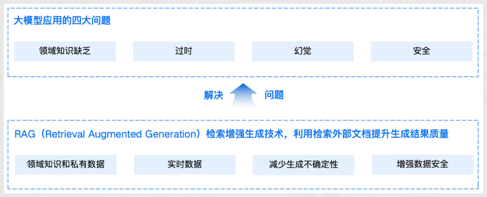

高 级 数 字 化 人 才 培 训 专 家

第 2 页原图

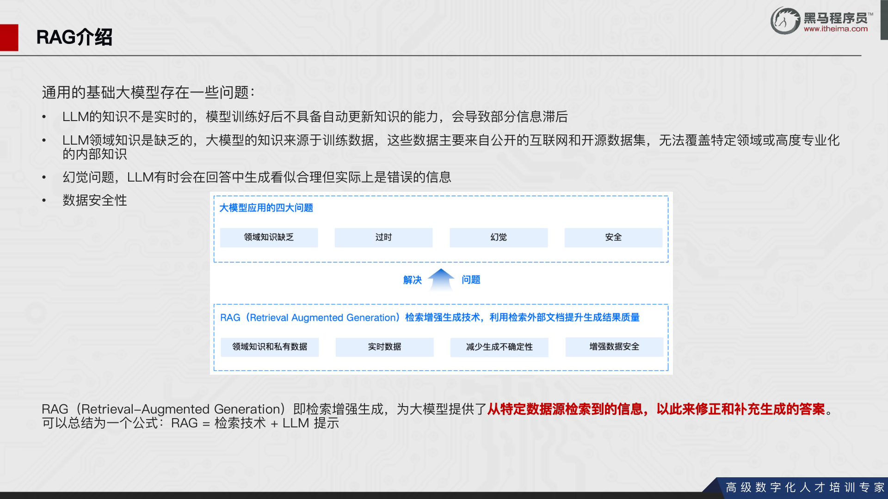

### RAG 工作流程与标准架构图

<!-- PDF 第 3 页 -->

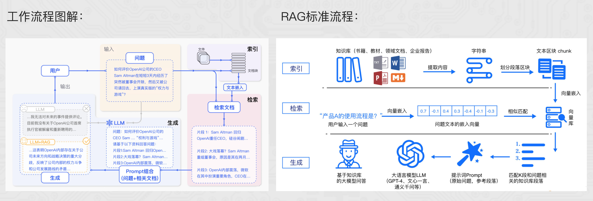

高 级 数 字 化 人 才 培 训 专 家

第 3 页原图

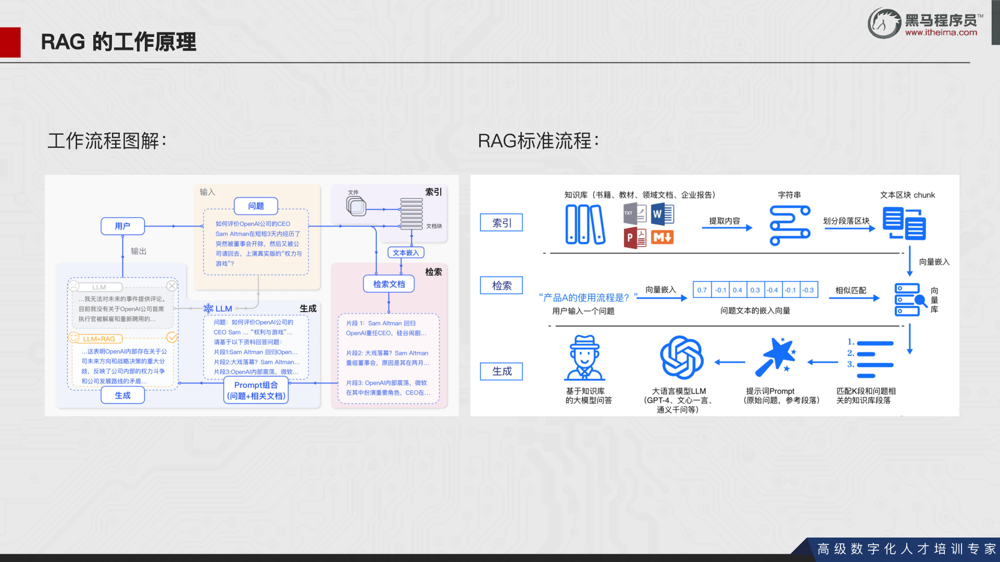

### 离线准备线与在线服务线

<!-- PDF 第 4 页 -->

简单来说，RAG工作分为两条线：
离线准备线 / 在线服务线

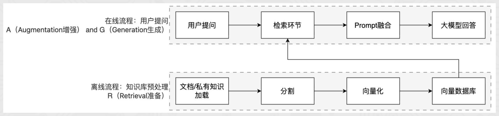

高 级 数 字 化 人 才 培 训 专 家

第 4 页原图

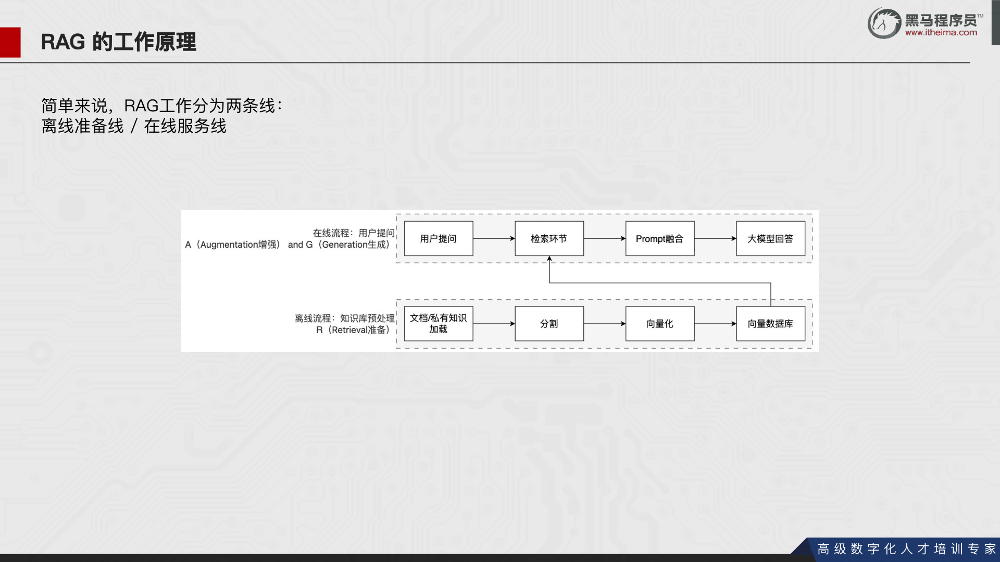

### RAG标准流程

<!-- PDF 第 5 页 -->

**RAG 标准流程由索引（Indexing）、检索（Retriever）和⽣成（Generation）三个核心阶段组成。**

- `索引阶段`，通过处理多种来源多种格式的文档提取其中文本，将其切分为标准长度的文本块（chunk），并进行嵌入向量化
    （embedding），向量存储在向量数据库（vector database）中。
    - 加载文件
    - 内容提取
    - 文本分割 ，形成chunk
    - 文本向量化
    - 存向量数据库
    
- `检索阶段`，⽤户输入的查询（query）被转化为向量表示，通过相似度匹配从向量数据库中检索出最相关的文本块。
    - query向量化
    - 在文本向量中匹配出与问句向量相似的top\_k个
    
- `生成阶段`，检索到的相关文本与原始查询共同构成提示词（Prompt），输入⼤语言模型（LLM），⽣成精确且具备上下文关联的回答。
    - 匹配出的文本作为上下文和问题一起添加到prompt中
    - 提交给LLM⽣成答案：

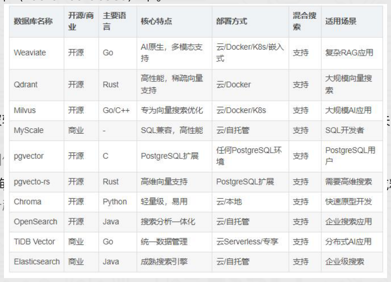

高 级 数 字 化 人 才 培 训 专 家

第 5 页原图

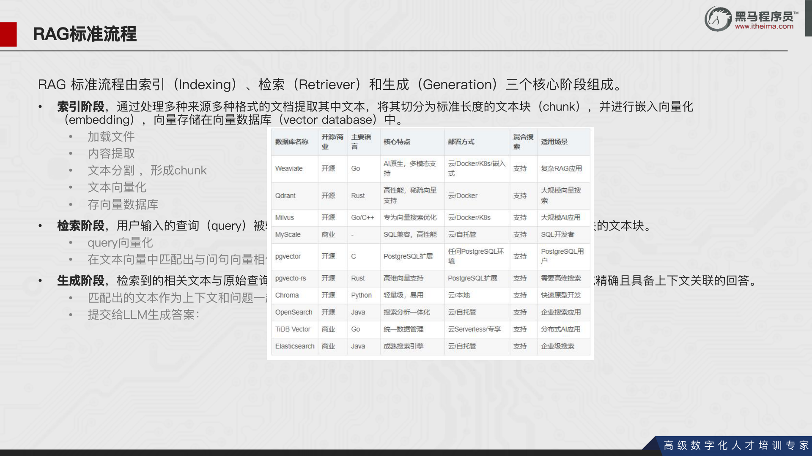

### RAG介绍小结

<!-- PDF 第 6 页 -->

模型本质上就是⽤户输入，模型给出输出，⽤户能做的就是
在输入上做功夫。

RAG就是在向模型提问之前基于已有的知识库或文档内容做
检索，确保向模型提问的内容更精准以及包含足够的信息量
⽤以提供给模型。

RAG的核心工作是2个流程：

RAG的核心价值：

- 解决知识实效性问题：⼤模型的训练数据有截止时间，RAG 可以
    接入最新文档（如公司财报、政策文件），让模型输出 “与时俱进”。

- 降低模型幻觉：模型的回答基于检索到的事实性资料，而非纯靠自身
    记忆，⼤幅减少编造信息的概率。

- 无需重新训练模型：相比微调（Fine-tuning），RAG 只需更新知
    识库，成本更低、效率更高。

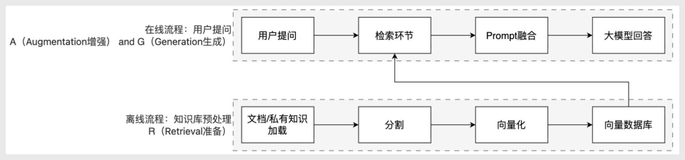

高 级 数 字 化 人 才 培 训 专 家

第 6 页原图

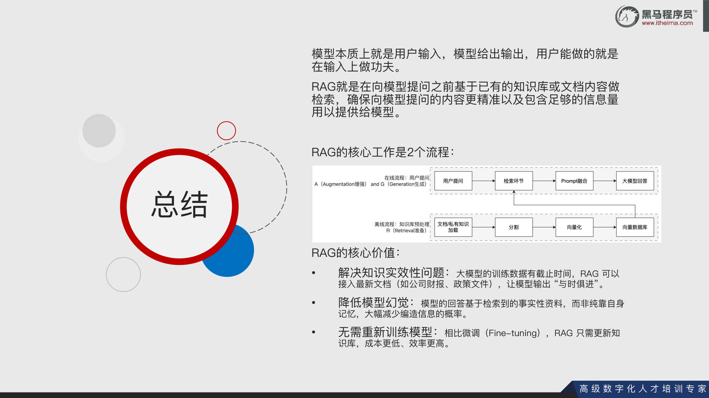

## 向量的基础概念

<!-- PDF 第 7 页 -->

Part : LangChain RAG开发

高 级 数 字 化 人 才 培 训 专 家

第 7 页原图

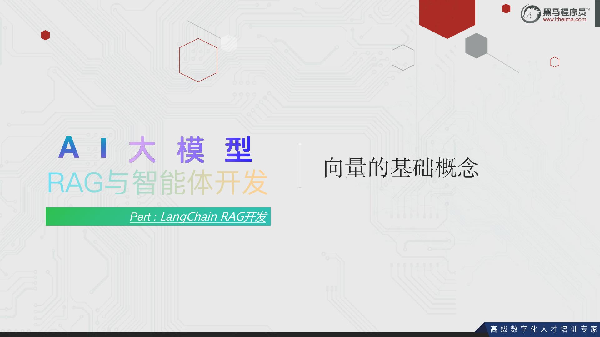

### 向量在 RAG 流程中的作用

<!-- PDF 第 8 页 -->

RAG流程中，向量库是一个重要的节点。

- 离线流程：知识和信息  向量嵌入（向量化）  存入向量库

- 在线流程：⽤户的提问  向量嵌入（向量化）  在向量库中匹配

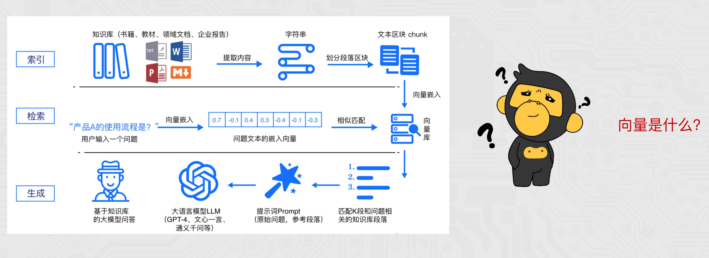

高 级 数 字 化 人 才 培 训 专 家

第 8 页原图

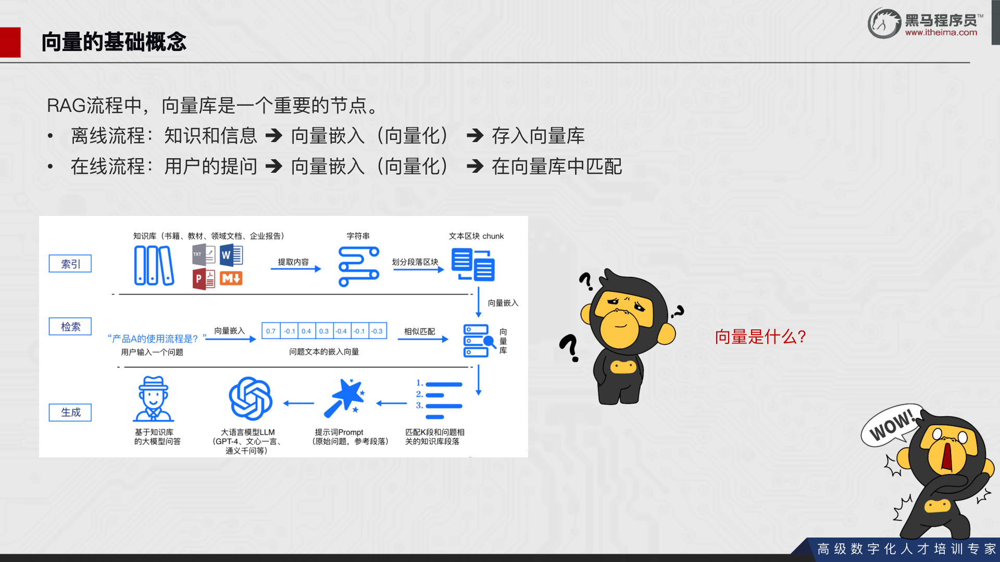

### 向量：文本的数学表示

<!-- PDF 第 9 页 -->

向量（Vector）就是文本的 “数学身份证”：它把一段文字的语义信息，转换成一串固定长度的数字列表，让
计算机能 “看懂” 文字的含义并做相似度计算。

简单来说，就是让计算机更方便的理解不同的文本内容，是否表述的是一个意思。

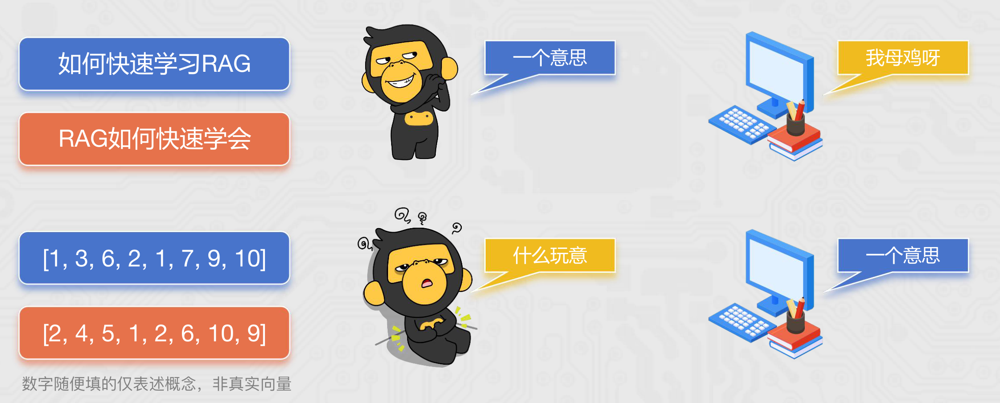

高 级 数 字 化 人 才 培 训 专 家

第 9 页原图

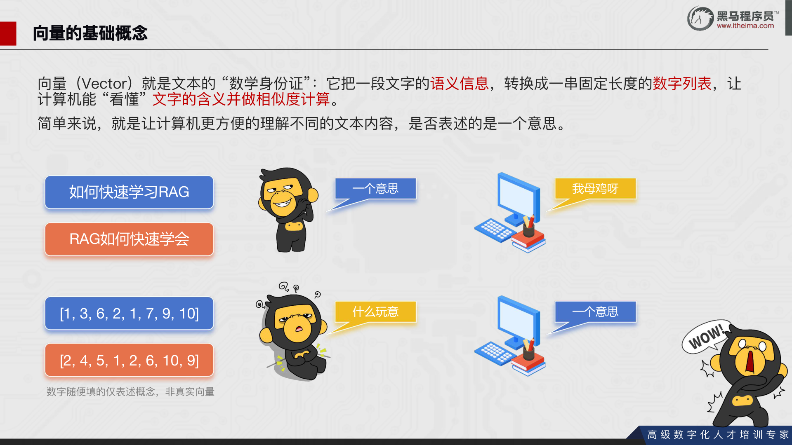

### 文本嵌入与相似度匹配

<!-- PDF 第 10 页 -->

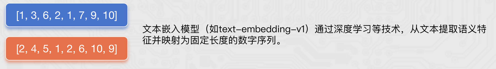

向量嵌入的过程，我们一般选⽤合适的文本嵌入模型来完成。

在向量匹配的过程中，如何识别2段文本是否表述相似的含义，主要可以通过如余弦相似度等算法来完成。

比如（下列案例中向量为示例，仅描述概念，非真实向量）：

- A： “如何快速学打篮球”  \[0.2, 0.5, 0.8\]

- B： “打篮球怎么学得快”  \[0.18, 0.52, 0.79\]

- C： “运动后吃什么好呢”  \[0.9, 0.1, 0.2\]

通过余弦相似度算法可以计算得到：A和B相似度0.999789，A和C相似度0.361446

由此可通过精确的数学计算，去匹配2段文本是否描述同一个意思，提高语义匹配的效率和精度。

高 级 数 字 化 人 才 培 训 专 家

第 10 页原图

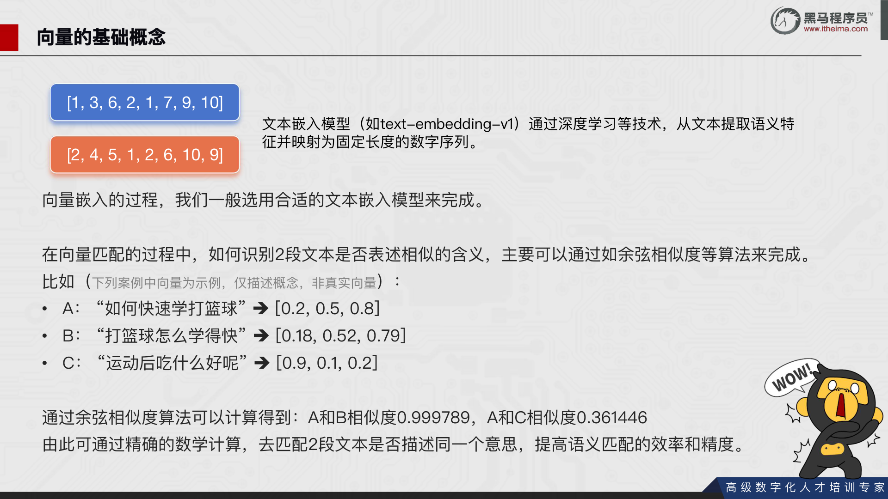

### 向量维度的含义与选择

<!-- PDF 第 11 页 -->

如何更为精准的完成语义匹配，⽣成向量的维度是一个很重要的指标。

如text-embedding-v1模型，可以⽣成1536维的向量（一段文本固定得到1536个数字序列），比较实⽤。

- 1536个数字表示，这段文本在1536个主题（抽象的语义特征）方向上的得分（强度）

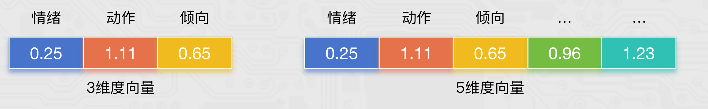

- ⽣成向量的维度越多，就更好的记录文本的语义特征，做语义匹配会更加精准。

- 更多的向量会在计算、存储和匹配过程中，带来更⼤的压力。

选择合适的向量维度需要在精确和性能之间做平衡。

一般1536维算是比较好的选择。

高 级 数 字 化 人 才 培 训 专 家

第 11 页原图

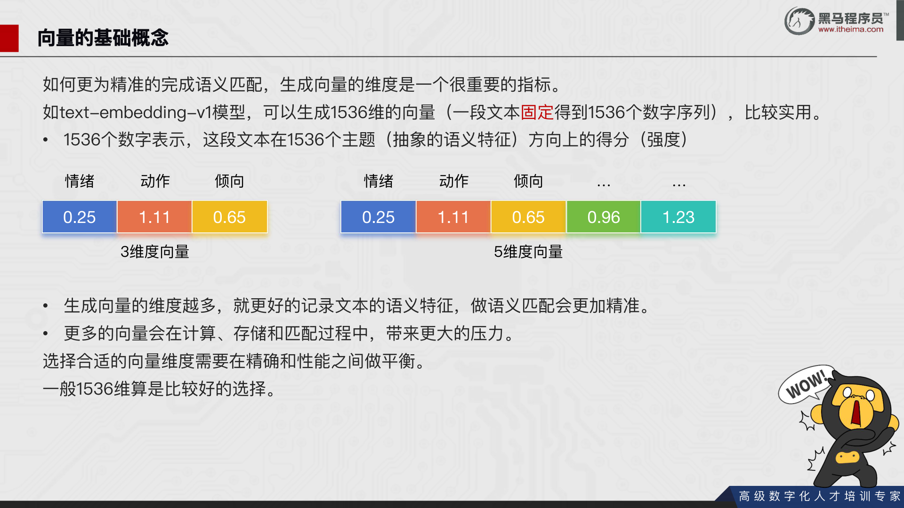

### 向量的基础概念小结

<!-- PDF 第 12 页 -->

向量（Vector）就是文本的 “数学身份证”

它把一段文字的语义信息，转换成一串固定长度的数字列表，让计算机
能 “看懂” 文字的含义并做相似度计算。

- 向量的计算（文本嵌入过程），可借助文本嵌入模型实现，如text-
    embedding-v1

- 向量的匹配通过算法实现，如余弦相似度

- 向量的维度表示一段文本在多个抽象语义特征方面的强度
    - 维度数代表模型⽤多少个抽象语义特征来描述文本
    - 维度越多，做语义匹配越精准
    - 但性能压力也会增⼤

高 级 数 字 化 人 才 培 训 专 家

第 12 页原图

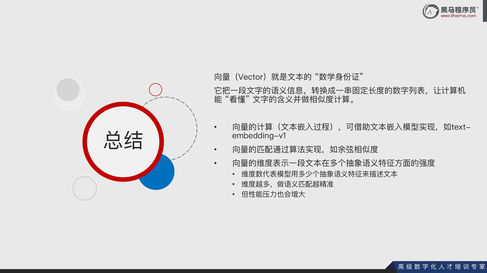

## 【扩展】余弦相似度

<!-- PDF 第 13 页 -->

Part : LangChain RAG开发

高 级 数 字 化 人 才 培 训 专 家

第 13 页原图

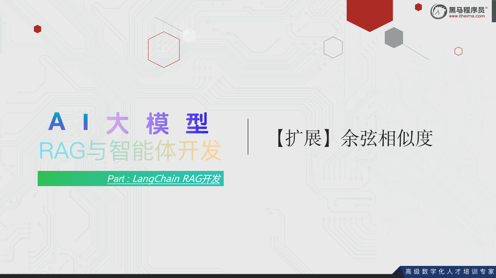

### 向量方向、长度与夹角

<!-- PDF 第 14 页 -->

向量的数字序列，共同决定了向量在高维空间中的方向和长度.而余弦相似度主要就是撇除长度的影响，得到
方向的夹角。夹角越小越相似，即方向相同。

如何体现向量的方向和长度呢？以一维向量为例：

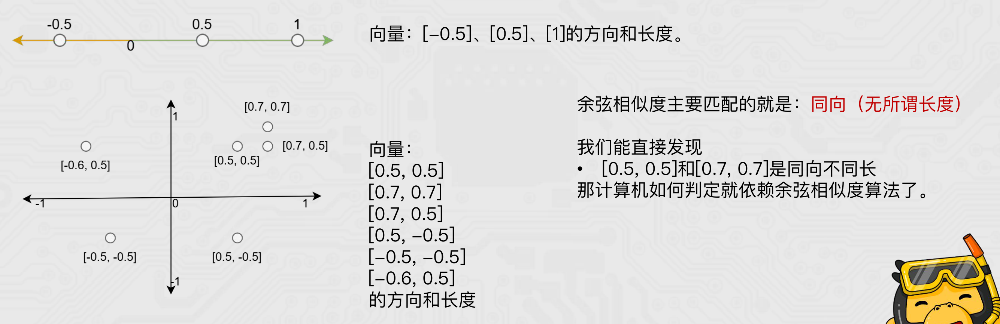

PS：3维乃至更高纬度难以描述，但概念一致

高 级 数 字 化 人 才 培 训 专 家

第 14 页原图

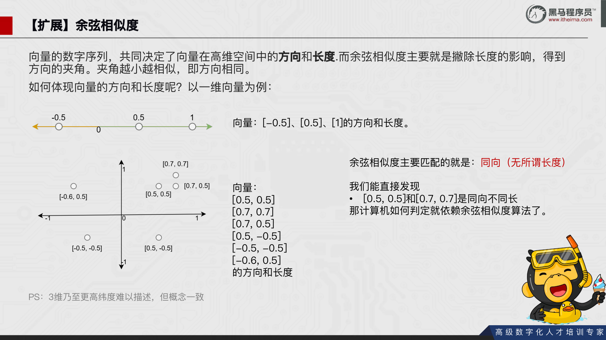

### 余弦相似度的公式与计算示例

<!-- PDF 第 15 页 -->

在文本向量语义匹配中，余弦相似度是衡量两个向量方向相似程度的核心算法，即判断两段文本语义是否相近。

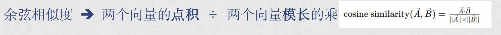

以：A\[0.5, 0.5\]、B\[0.7, 0.7\]、C\[0.7, 0.5\]、D\[-0.6, -0.5\]为例

- 点积：两个向量在同维度的乘积之和。

    - 向量AB点积：vec\_a\[0\]×vec\_b\[0\] + vec\_a\[1\]×vec\_b\[1\] + ... + vec\_a\[n\]×vec\_b\[n\]
    - 如AB的点积是：0.5\*0.7 + 0.5\*0.7 = 0.74

- 模长：单个向量不同维度的平方之和开根号，如A的模长是：√(0.5\*0.5 + 0.5\*0.5)

    - 向量模长： \|\|vec\|\| = √(vec\[0\]² + vec\[1\]² + ... + vec\[n\]²)
    - 如向量A的模长： √(0.5\*0.5 + 0.5\*0.5)     √是开根号

如AB之间的余弦相似度为： AB点积 ÷ (A模长 \* B模长)

- AB余弦相似度：(0.5\*0.7 + 0.5\*0.7) ÷ ( √(0.5\*0.5 + 0.5\*0.5) \* √(0.7\*0.7 + 0.7\*0.7) ) = 1.0

- AC 余弦相似度：(0.50.7 + 0.50.5) ÷ ( √(0.50.5 + 0.50.5) \* √(0.70.7 + 0.50.5) ) ≈ 0.986

- AD 余弦相似度：(0.5\*(-0.6) + 0.5\*(-0.5)) ÷ ( √(0.50.5 + 0.50.5) \* √((-0.6)(-0.6) + (-0.5)(-0.5)) ) ≈ -0.996

高 级 数 字 化 人 才 培 训 专 家

第 15 页原图

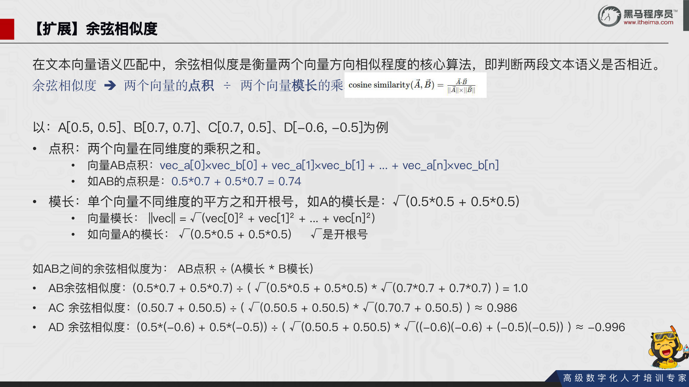

## LangChain 简介

<!-- PDF 第 16 页 -->

Part : LangChain RAG开发

高 级 数 字 化 人 才 培 训 专 家

第 16 页原图

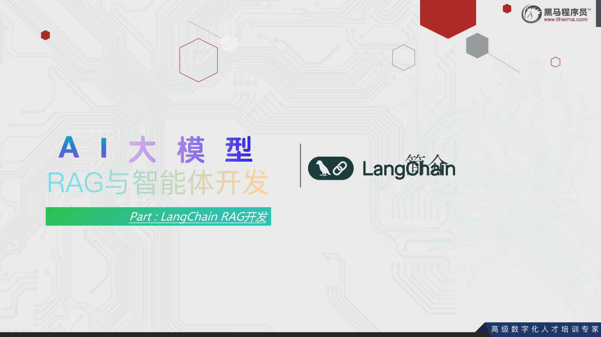

### LangChain 的定位与开发价值

<!-- PDF 第 17 页 -->

LangChain 由 Harrison Chase 创建于2022年10月，它是围绕LLMs（⼤语言模型）建立的一个框架.

LangChain自身并不开发LLMs，它的核心理念是为各种LLMs实现通⽤的接口，把LLMs相关的组件“链接”在一起，

简化LLMs应⽤的开发难度,方便开发者快速地开发复杂的LLMs应⽤.

高 级 数 字 化 人 才 培 训 专 家

第 17 页原图

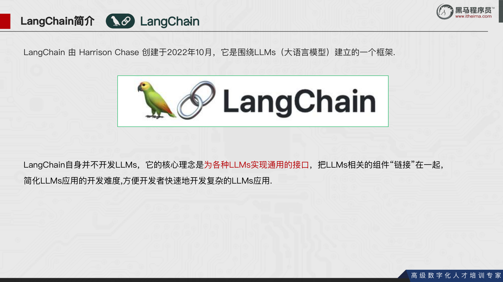

### LangChain 的六类核心功能

<!-- PDF 第 18 页 -->

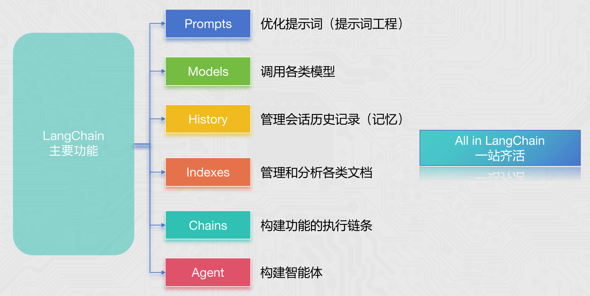

高 级 数 字 化 人 才 培 训 专 家

第 18 页原图

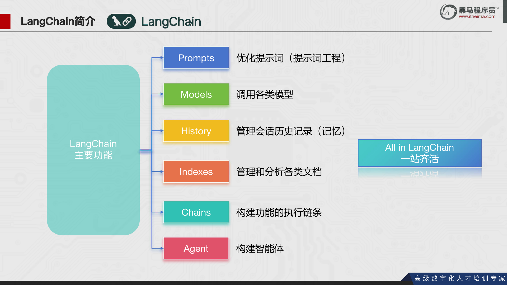

### LangChain 简介小结

<!-- PDF 第 19 页 -->

LangChain是一个开发LLM相关业务功能的集⼤成者，
是一个Python的第三方库，提供了各种功能的API。

提供：

- 提示词优化的相关功能API

- 调⽤各类模型的功能API

- 会话记忆的相关功能API

- 各类文档管理分析的功能API

- 构建Agent智能体的相关功能API

- 各类功能链式执行的能力

LangChain是后续学习RAG开发的主力框架

Full LLM power—you only need LangChain

高 级 数 字 化 人 才 培 训 专 家

第 19 页原图

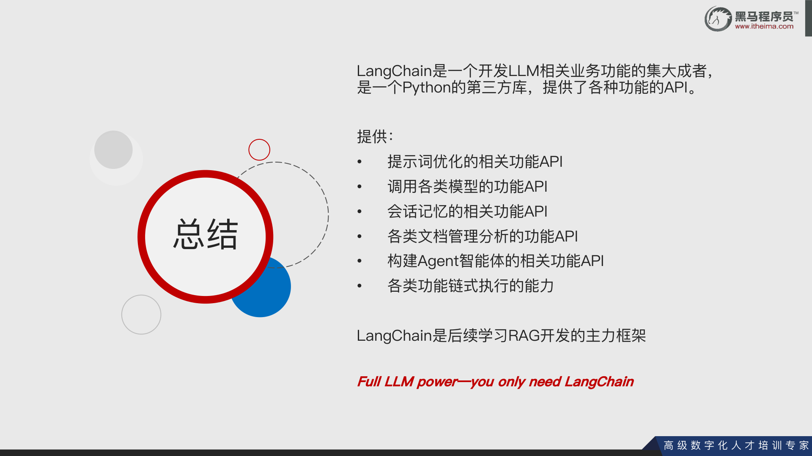

## LangChain 环境部署

<!-- PDF 第 20 页 -->

Part : LangChain RAG开发

高 级 数 字 化 人 才 培 训 专 家

第 20 页原图

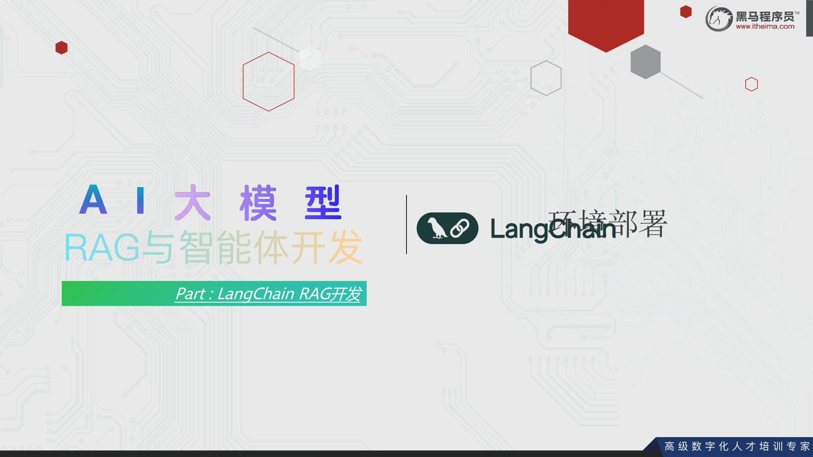

### LangChain安装

<!-- PDF 第 21 页 -->

~~~~
pip install langchain langchain-community langchain-ollama langchain-chroma dashscope chromadb bs4 jq
~~~~

- langchain：核心包
- langchain-community：社区支持包，提供了更多的第三方模型调⽤（我们⽤的阿里云千问模型就需要这个包）
- langchain-ollama：Ollama支持包，支持调⽤Ollama托管部署的本地模型
- langchain-chroma：ChromaDB支持包，支持调⽤ChromaDB
- dashscope：阿里云通义千问的Python SDK
- chromadb：轻量向量数据库（后续使⽤）
- bs4：BeautifulSqop4库，协助解析HTML文档（后续学习文档加载器使⽤）

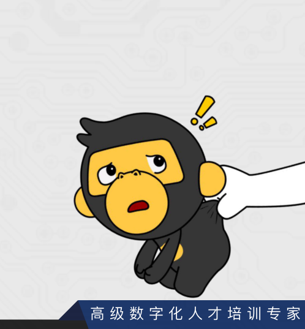

高 级 数 字 化 人 才 培 训 专 家

第 21 页原图

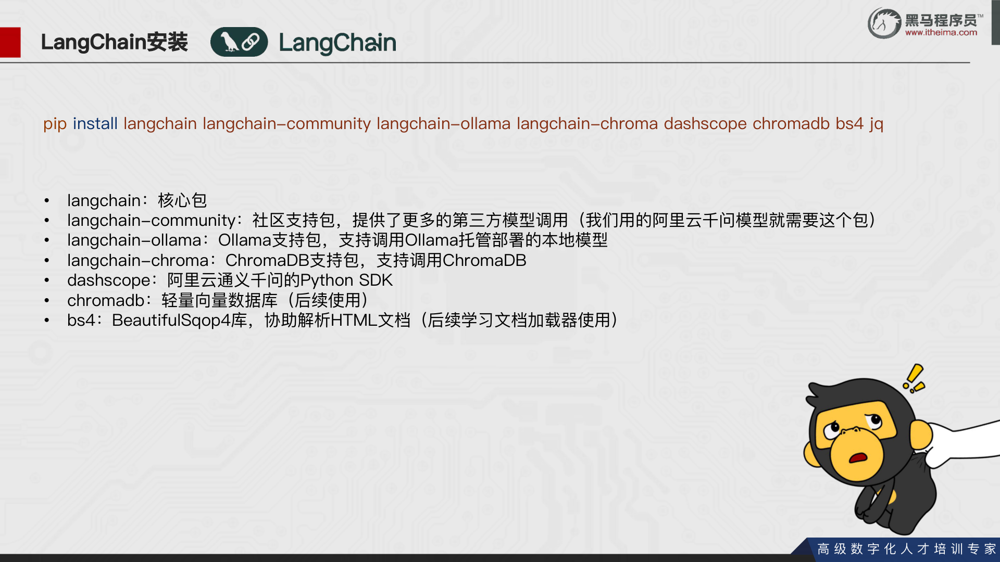

## Models：大语言模型接入

<!-- PDF 第 22 页 -->

Part : LangChain RAG开发

高 级 数 字 化 人 才 培 训 专 家

第 22 页原图

### LLMs、Chat Models 与 Embeddings 的分类

<!-- PDF 第 23 页 -->

现在市面上的模型多如牛毛，各种各样的模型不断出现，LangChain模型组件提供了与各种模型的集成，并为所有模型提供一
个精简的统一接口。

LangChain目前支持三种类型的模型：LLMs（⼤语言模型）、Chat Models(聊天模型)、Embeddings Models(嵌入模型）.

- LLMs:是技术范畴的统称，指基于⼤参数量、海量文本训练的 Transformer 架构模型，核心能力是理解和⽣成自然语言，
    主要服务于文本⽣成场景

- 聊天模型:是应⽤范畴的细分，是专为对话场景优化的 LLMs，核心能力是模拟人类对话的轮次交互，主要服务于聊天场景

- 文本嵌入模型: 文本嵌入模型接收文本作为输入, 得到文本的向量.

LangChain支持的三类模型，它们的使⽤场景不同，输入和输出不同，开发者需要根据项目需要选择相应。

我们所⽤的阿里云通义千问系列主要来自于：langchain\_community包

高 级 数 字 化 人 才 培 训 专 家

第 23 页原图

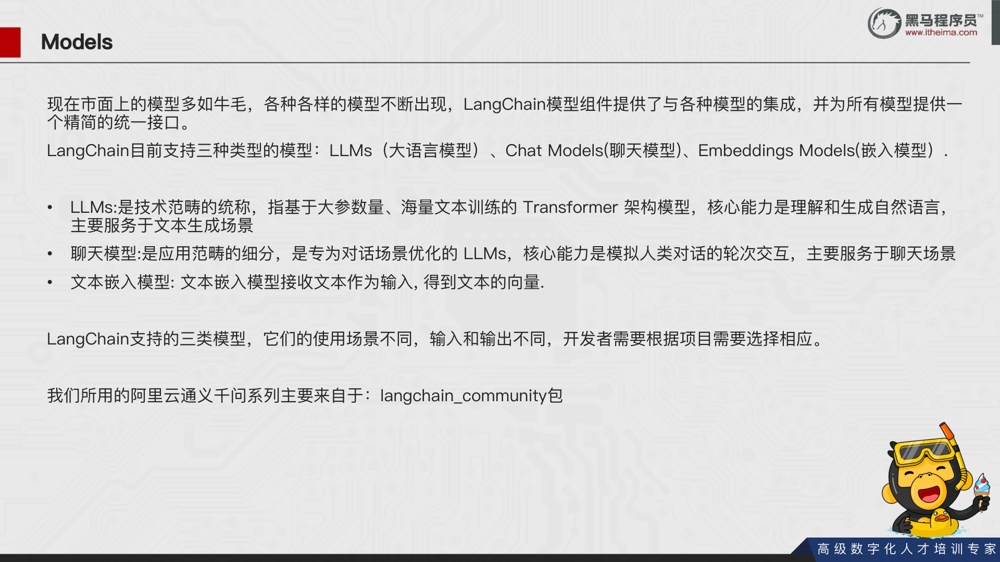

### LLMs（阿里云大语言模型的访问）

<!-- PDF 第 24 页 -->

LLMs使⽤场景最多，常⽤⼤模型的下载库：

- https://huggingface.co/models

- https://modelscope.cn/models

同时LangChain支持对许多模型的调⽤，以通义千问为例：

~~~~
from langchain_community.llms.tongyi import Tongyi
### 实例化模型
llm = Tongyi(model='qwen-max')
### 模型推理
res = llm.invoke("帮我讲个笑话吧")
print(res)
~~~~

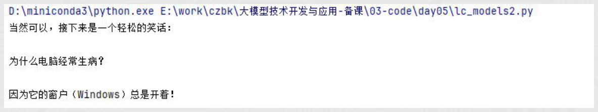

高 级 数 字 化 人 才 培 训 专 家

第 24 页原图

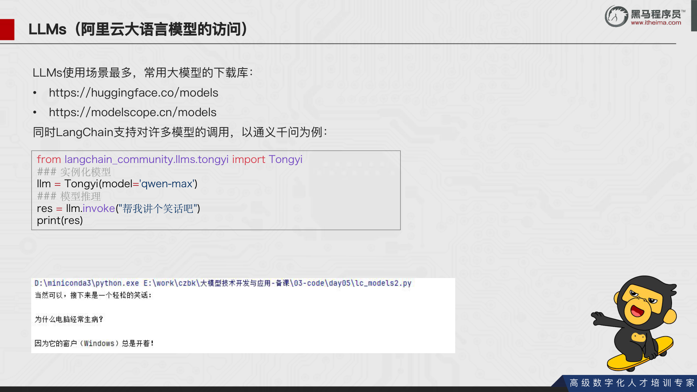

### LLMs（Ollama本地大语言模型的访问）

<!-- PDF 第 25 页 -->

如果要访问本地Ollama的模型，简单更改一下代码。

通过langchain\_ollama包导入OllamaLLM类即可（请确保Ollama已经启动并提前下载好要使⽤的模型）。

~~~~
from langchain_ollama import OllamaLLM
model = OllamaLLM(model="qwen3:4b")
# 通过invoke方法去调用模型
res = model.invoke(input="你是谁呀能做什么？")
print(res)
~~~~

高 级 数 字 化 人 才 培 训 专 家

第 25 页原图

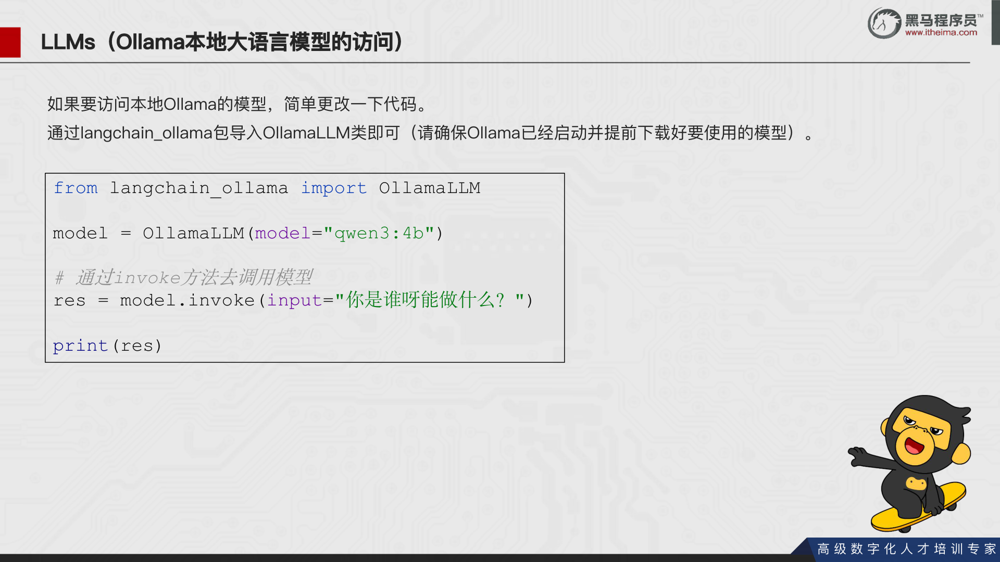

### 大语言模型接入小结

<!-- PDF 第 26 页 -->

通过：

~~~~
•
from langchain_community.llm.tongyi import 
Tongyi 导入通义千问系列的支持
•
from langchain_ollama import OllamaLLM 导入
Ollama系列的支持
~~~~

创建好模型对象后，通过invoke对模型发起提问

并可以直接打印输出结果

高 级 数 字 化 人 才 培 训 专 家

第 26 页原图

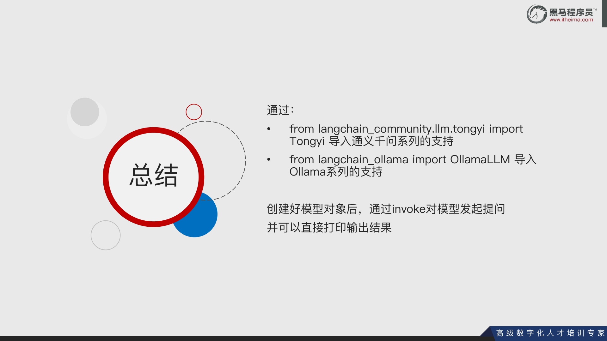

## Models：流式输出

<!-- PDF 第 27 页 -->

Part : LangChain RAG开发

高 级 数 字 化 人 才 培 训 专 家

第 27 页原图

### invoke 与 stream 的调用方式

<!-- PDF 第 28 页 -->

如果需要流式输出结果，需要将模型的invoke方法改为stream方法即可。

- invoke方法：一次型返回完整结果

- stream方法：逐段返回结果，流式输出

~~~~
# langchain_community
from langchain_community.llms.tongyi import Tongyi
# 不用qwen3-max，因为qwen3-max是聊天模型，qwen-max是大语言模型
model = Tongyi(model="qwen-max")
# 调用invoke向模型提问
res = model.stream(input="你是谁呀能做什么？")
for chunk in res:
    print(chunk, end="", flush=True)
~~~~

高 级 数 字 化 人 才 培 训 专 家

第 28 页原图

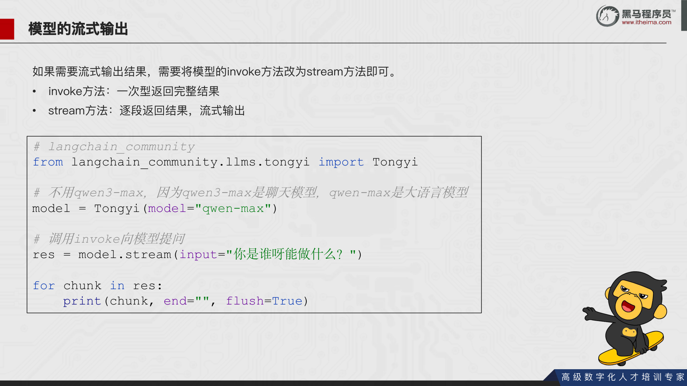

### Models：流式输出小结

<!-- PDF 第 29 页 -->

模型对象有2个方法去调⽤模型：

- invoke，调⽤模型，一次型返回完整结果

- stream，调⽤模型，逐段流式输出

这两个方法是新版LangChain(1.0版本后)中基于Runnable接口的通⽤核
心方法。

绝⼤多数组件（如提示词模板、链、向量检索、工具调⽤等，后续学习）
都支持这两个方法，这也是 LangChain 设计的核心统一范式。

高 级 数 字 化 人 才 培 训 专 家

第 29 页原图

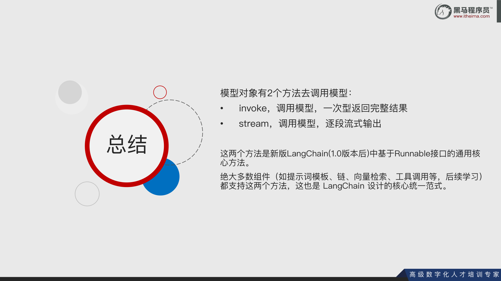

## Models：聊天模型与消息

<!-- PDF 第 30 页 -->

Part : LangChain RAG开发

高 级 数 字 化 人 才 培 训 专 家

第 30 页原图

### AIMessage、HumanMessage 与 SystemMessage

<!-- PDF 第 31 页 -->

聊天消息包含下面几种类型，使⽤时需要按照约定传入合适的值：

- AIMessage: 就是 AI 输出的消息，可以是针对问题的回答. (OpenAI库中的assistant角色）

- HumanMessage: 人类消息就是⽤户信息，由人给出的信息发送给LLMs的提示信息，比如“实现一个快速排序方法”.
    (OpenAI库中的user角色）

- SystemMessage: 可以⽤于指定模型具体所处的环境和背景，如角色扮演等。你可以在这里给出具体的指示，比如“作为一
    个代码专家”，或者“返回json格式”. (OpenAI库中的system角色）

高 级 数 字 化 人 才 培 训 专 家

第 31 页原图

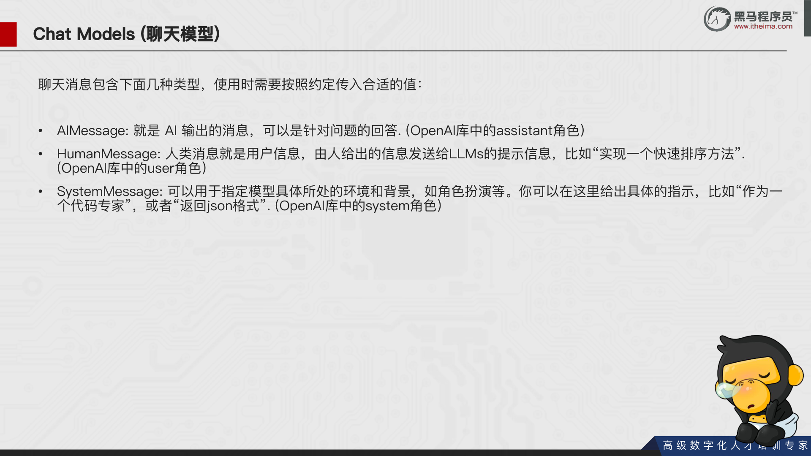

### 使用 HumanMessage 调用聊天模型

<!-- PDF 第 32 页 -->

演示单独使⽤HumanMessage

~~~~
from langchain_community.chat_models.tongyi import ChatTongyi
from langchain_core.messages import HumanMessage
# 初始化模型
chat = ChatTongyi(model="qwen3-max")
# 准备消息list
messages = [
    HumanMessage(content="给我写一首唐诗")
]
# 流式输出
for chunk in chat.stream(input=messages):
    print(chunk.content, end="", flush=True)
~~~~

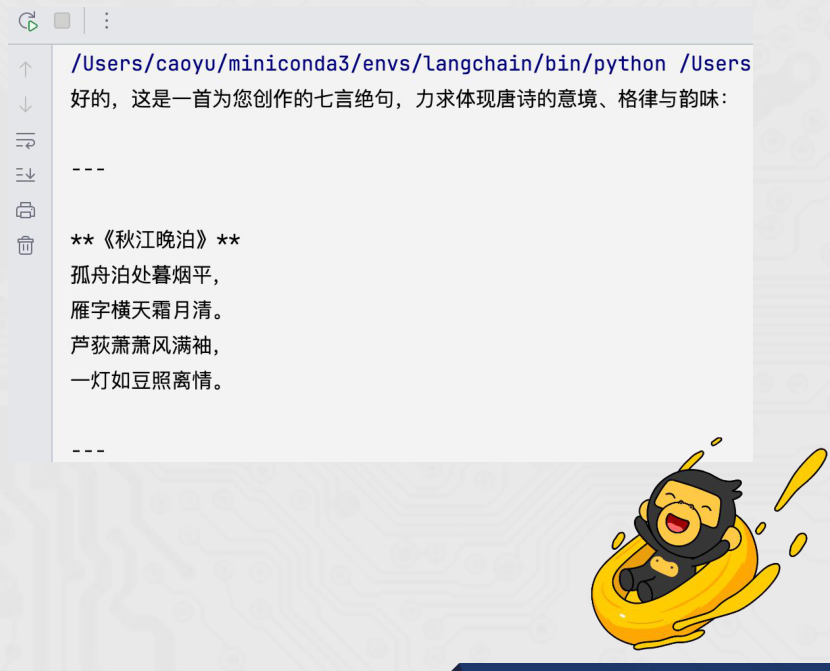

高 级 数 字 化 人 才 培 训 专 家

第 32 页原图

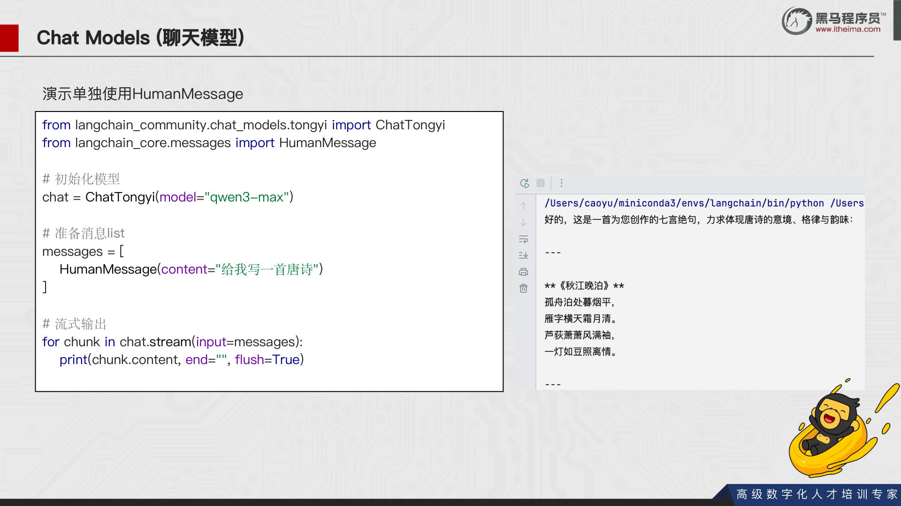

### 组合 SystemMessage 与 HumanMessage

<!-- PDF 第 33 页 -->

演示SystemMessage + HumanMessage

~~~~
from langchain_community.chat_models.tongyi import ChatTongyi
from langchain_core.messages import HumanMessage, SystemMessage
# 初始化模型
chat = ChatTongyi(model="qwen3-max")
# 准备消息list
messages = [
    SystemMessage(content="你是一名来自边塞的诗人"),
    HumanMessage(content="给我写一首唐诗")
]
# 流式输出
for chunk in chat.stream(input=messages):
    print(chunk.content, end="", flush=True) 
~~~~

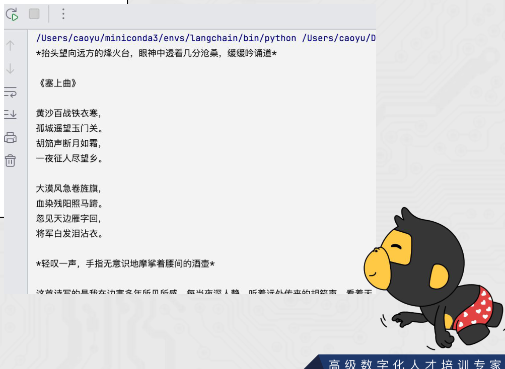

高 级 数 字 化 人 才 培 训 专 家

第 33 页原图

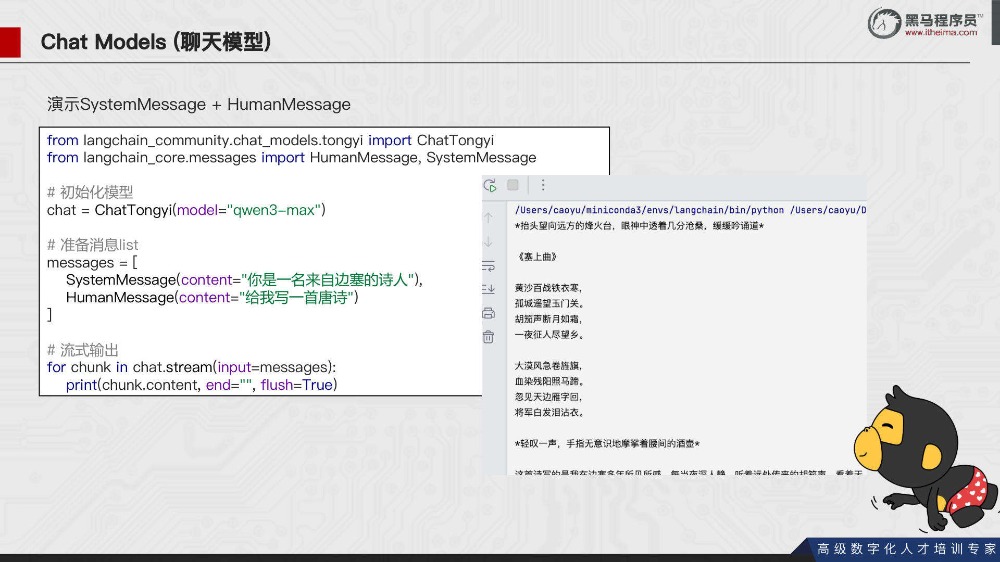

### 加入 AIMessage 构建多轮对话

<!-- PDF 第 34 页 -->

演示SystemMessage + HumanMessage + AIMessage

~~~~
from langchain_community.chat_models.tongyi import ChatTongyi
from langchain_core.messages import HumanMessage, SystemMessage, AIMessage
# 初始化模型
chat = ChatTongyi(model="qwen3-max")
# 准备消息list
messages = [
    SystemMessage(content="你是一名来自边塞的诗人"),
    HumanMessage(content="给我写一首唐诗"),
    AIMessage(content="锄禾日当午，汗滴禾下土，谁知盘中餐，粒粒皆辛苦。"),
    HumanMessage(content="给予你上一首的格式，再来一首")
]
# 流式输出
for chunk in chat.stream(input=messages):
    print(chunk.content, end="", flush=True) 
~~~~

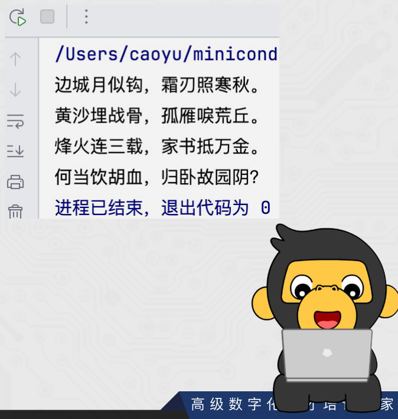

高 级 数 字 化 人 才 培 训 专 家

第 34 页原图

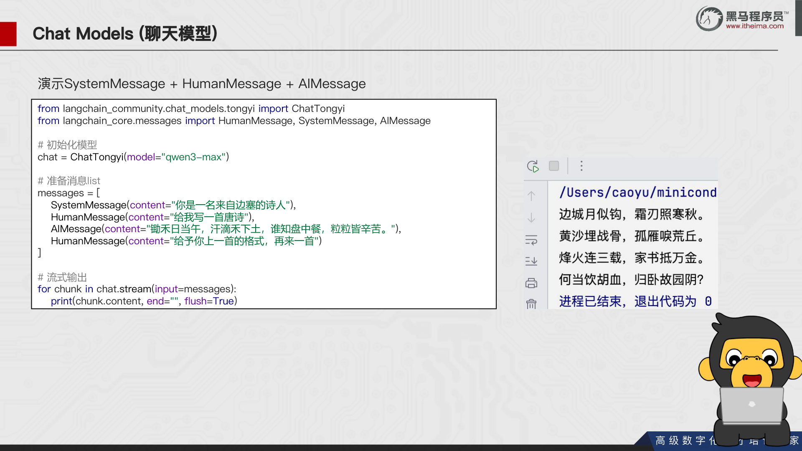

## Models：消息简写

<!-- PDF 第 35 页 -->

Part : LangChain RAG开发

高 级 数 字 化 人 才 培 训 专 家

第 35 页原图

### 消息类与二元组写法的对应关系

<!-- PDF 第 36 页 -->

SystemMessage、HumanMessage、AIMessage可以有如下的简写形式

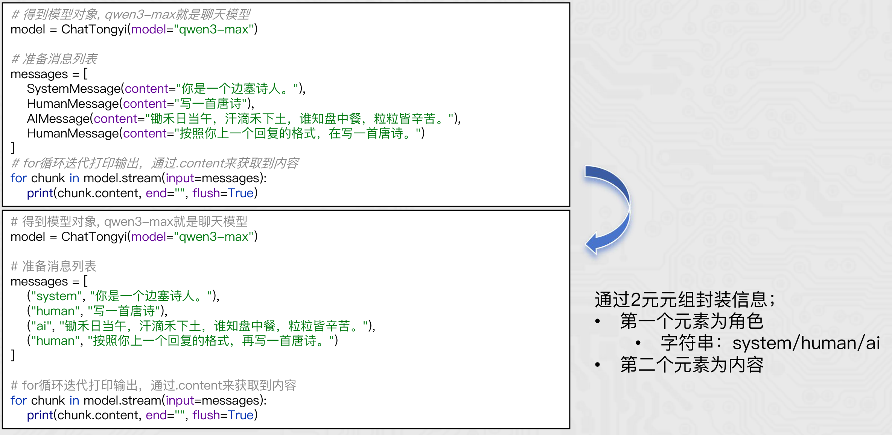

高 级 数 字 化 人 才 培 训 专 家

第 36 页原图

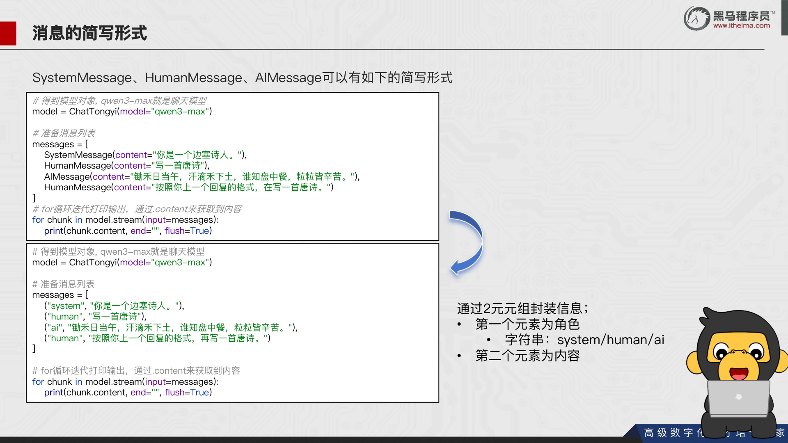

### 简写消息的动态转换与变量占位

<!-- PDF 第 37 页 -->

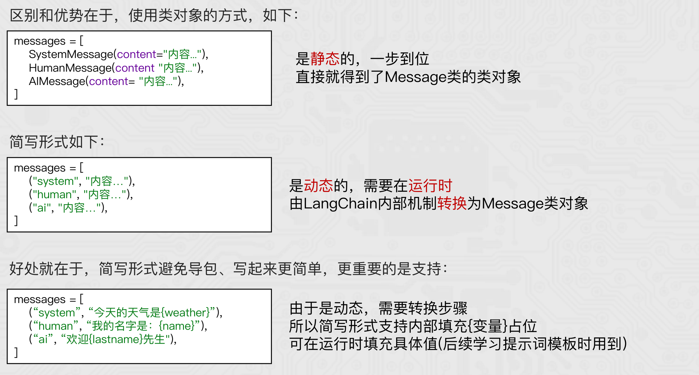

高 级 数 字 化 人 才 培 训 专 家

第 37 页原图

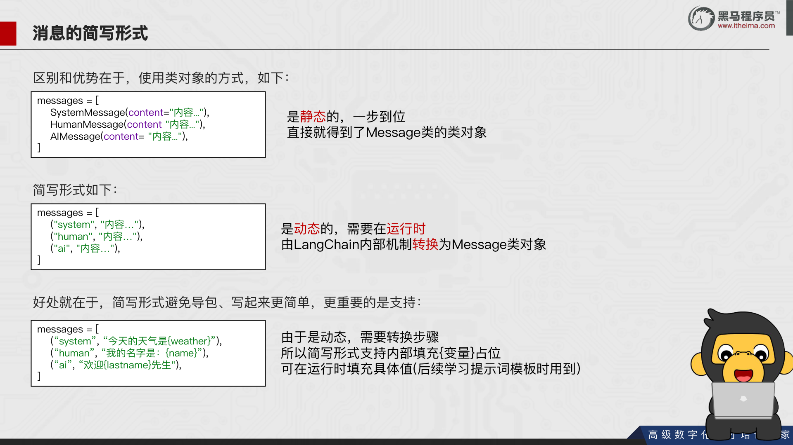

## Models：文本嵌入

<!-- PDF 第 38 页 -->

Part : LangChain RAG开发

高 级 数 字 化 人 才 培 训 专 家

第 38 页原图

### 使用阿里云 DashScopeEmbeddings

<!-- PDF 第 39 页 -->

Embeddings Models嵌入模型的特点：将字符串作为输入，返回一个浮点数的列表（向量）。

在NLP中，Embedding的作⽤就是将数据进行文本向量化。

阿里云千问模型访问方式：

~~~~
from langchain_community.embeddings import DashScopeEmbeddings
# 初始化嵌入模型对象，其默认使用模型是：text-embedding-v1
embed = DashScopeEmbeddings()
# 测试
print(embed.embed_query("我喜欢你"))
print(embed.embed_documents(['我喜欢你', '我稀饭你', '晚上吃啥'])) 
~~~~

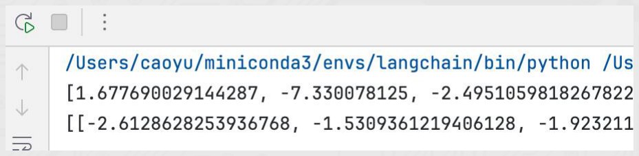

高 级 数 字 化 人 才 培 训 专 家

第 39 页原图

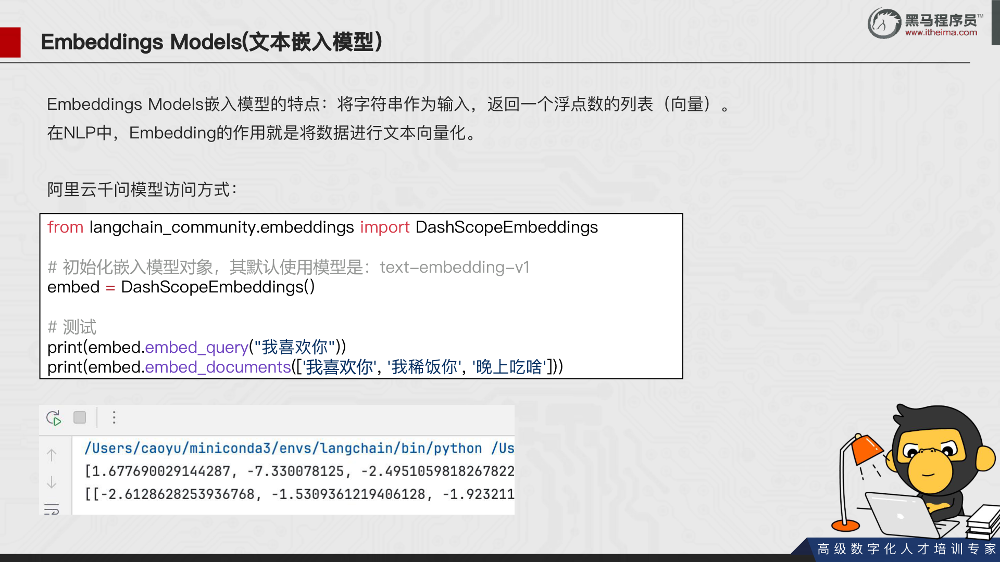

### 使用本地 OllamaEmbeddings

<!-- PDF 第 40 页 -->

本地Ollama模型访问方式：

通过langchain\_ollama导入OllamaEmbeddings使⽤，其余不变。

~~~~
from langchain_ollama import OllamaEmbeddings
# 初始化嵌入模型对象，其默认使用模型是：text-embedding-v1
embed = OllamaEmbeddings(model="qwen3-embedding")
# 测试
print(embed.embed_query("我喜欢你"))
print(embed.embed_documents(['我喜欢你', '我稀饭你', '晚上吃啥']))
~~~~

高 级 数 字 化 人 才 培 训 专 家

第 40 页原图

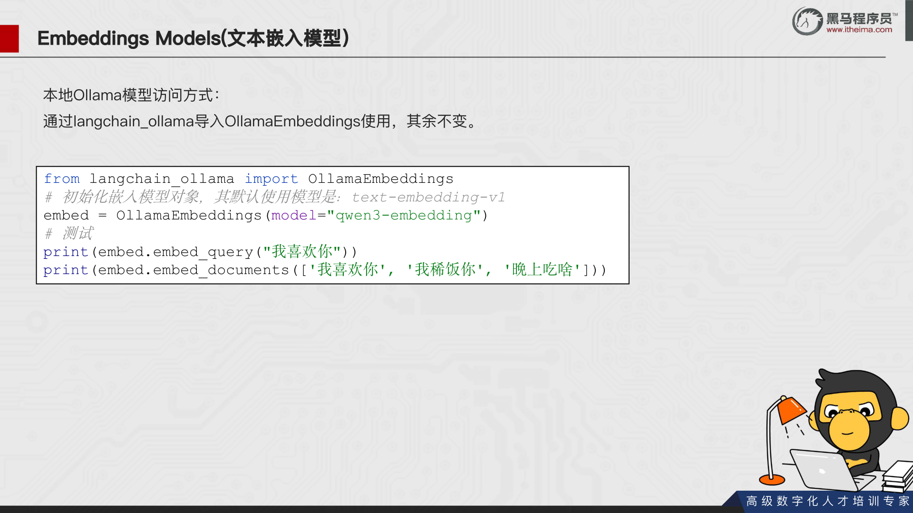

### 三类模型的接入方式与接口对照

<!-- PDF 第 41 页 -->

目前所掌握的LangChain API如下：

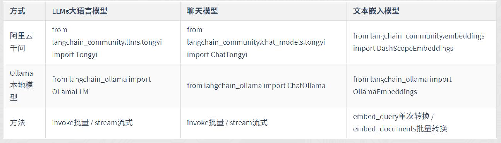

高 级 数 字 化 人 才 培 训 专 家

第 41 页原图

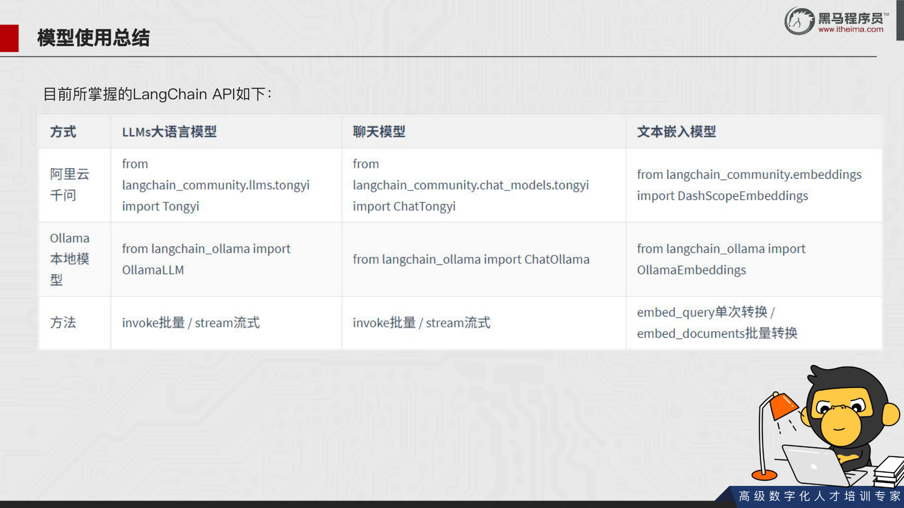

### Models：文本嵌入小结

<!-- PDF 第 42 页 -->

LangChain在模型的支持上主要基于LangChain\_community包提供。

主要支持三类模型：

- LLMs：⼤语言模型，主⽤于文本⽣成

- Chat Model：聊天模型，主⽤于多轮次对话的聊天场景

- Embeddings Model：文本嵌入模型，主⽤于⽣成文本向量

LangChain框架和OpenAI库一样，提供三种角色：

- HumanMessage类，即User角色

- AIMessage类，即Assistant角色

- SystemMessage类，即System角色

高 级 数 字 化 人 才 培 训 专 家

第 42 页原图

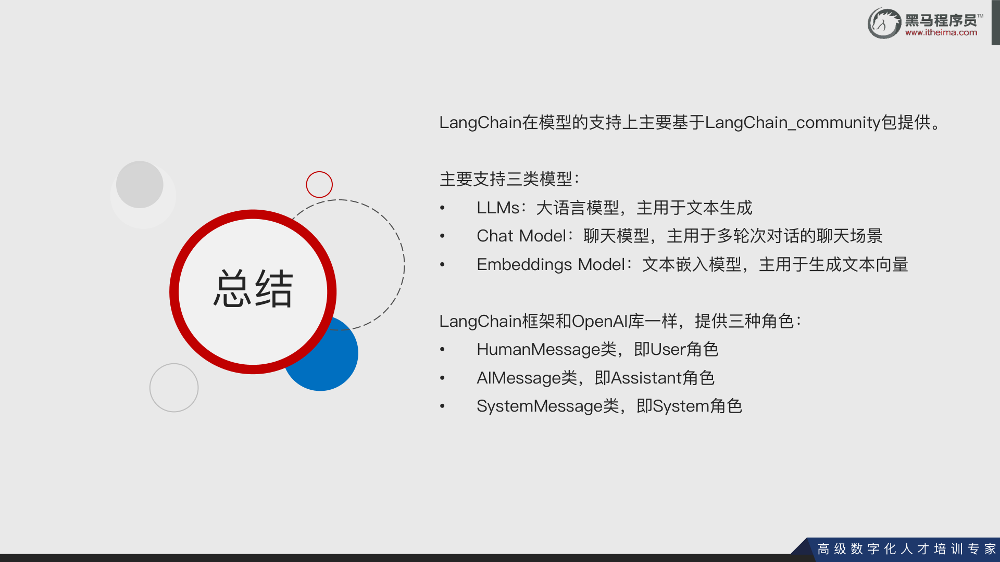

## Prompts：通用提示词模板

<!-- PDF 第 43 页 -->

Part : LangChain RAG开发

高 级 数 字 化 人 才 培 训 专 家

第 43 页原图

### PromptTemplate 的基础写法与链式调用

<!-- PDF 第 44 页 -->

提示词优化在模型应⽤中非常重要，LangChain提供了PromptTemplate类，⽤来协助优化提示词。

PromptTemplate表示提示词模板，可以构建一个自定义的基础提示词模板，支持变量的注入，最终⽣成所需的提示词。

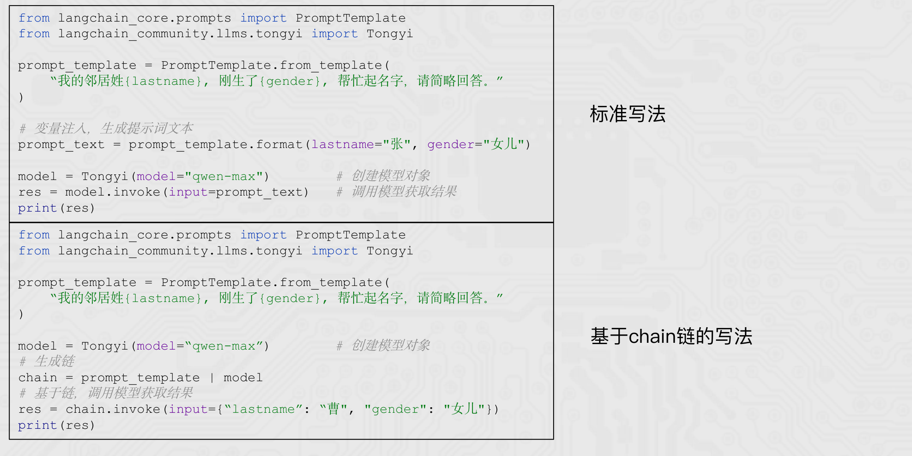

高 级 数 字 化 人 才 培 训 专 家

第 44 页原图

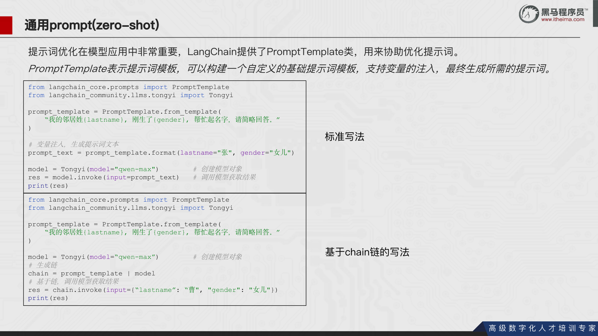

### Prompts：通用提示词模板小结

<!-- PDF 第 45 页 -->

基于PromptTemplate类可以得到提示词模板，支持基于模板注入变
量得到最终提示词。

- zero-shot思想下，可以基于PromptTemplate直接完成。

- few-shot思想下，需要更换为FewShotPromptTemplate（后
    续学习）

PS：使⽤PromptTemplate还不如自己手动拼接字符串？

- 使⽤Template模板构建提示词，在⼤型工程中更容易做标准化模板

- Template模板类，支持LangChian框架的链式调⽤（Runnable接口，
    后续学习）
    - PromptTemplate
    - FewShotPromptTemplate(后续学习)
    - ChatPromptTemplate(后续学习)

高 级 数 字 化 人 才 培 训 专 家

第 45 页原图

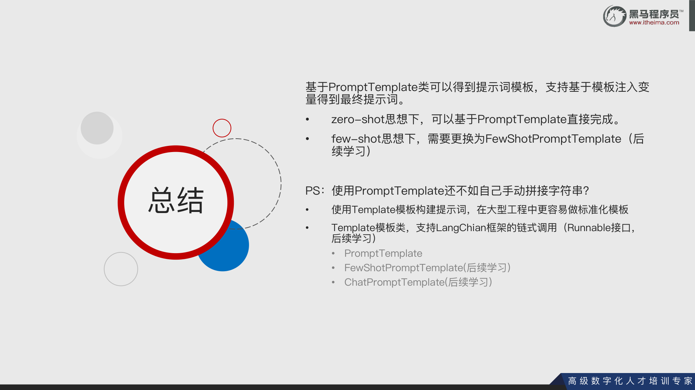

## FewShotPromptTemplate：少样本提示词

<!-- PDF 第 46 页 -->

Part : LangChain RAG开发

高 级 数 字 化 人 才 培 训 专 家

第 46 页原图

### FewShotPromptTemplate 的参数与结构

<!-- PDF 第 47 页 -->

~~~~
from langchain_core.prompts import FewShotPromptTemplate
FewShotPromptTemplate(
    examples=None,
    example_prompt=None,
    prefix=None,
    suffix=None,
    input_variables=None
)
~~~~

参数：
- examples：示例数据，list，内套字典
- example\_prompt：示例数据的提示词模板
- prefix：组装提示词，示例数据前内容
- suffix：组装提示词，示例数据后内容
- input\_variables：列表，注入的变量列表

高 级 数 字 化 人 才 培 训 专 家

第 47 页原图

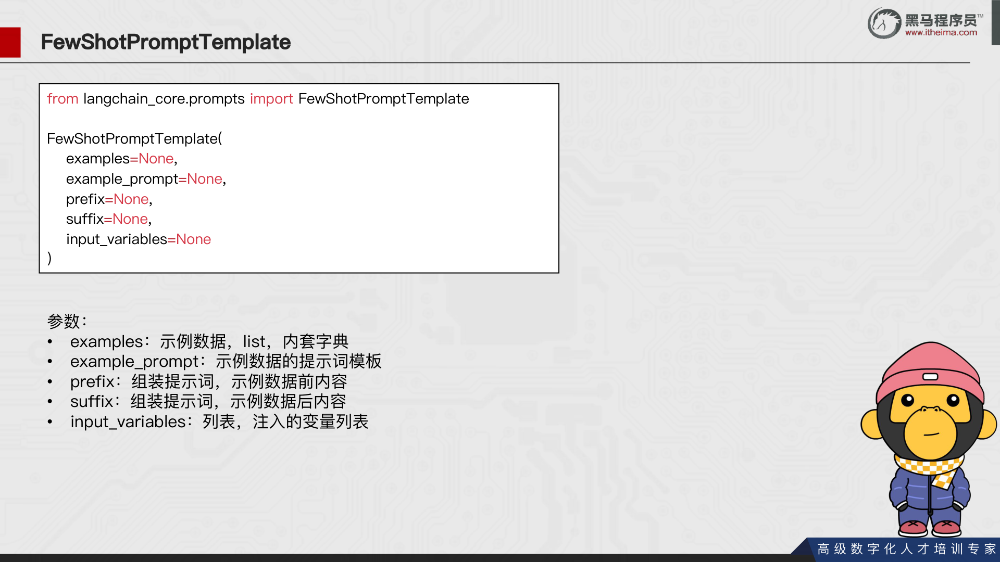

### 组装示例并生成完整提示词

<!-- PDF 第 48 页 -->

~~~~
from langchain_core.prompts import FewShotPromptTemplate, PromptTemplate
example_template = PromptTemplate.from_template("单词:{word}, 反义词:{antonym}")
example_data = [                            # 示例数据，list内套字典
         {"word": "大", "antonym": "小"},
    {"word": "上", "antonym": "下"}
]
few_shot_prompt = FewShotPromptTemplate(    # FewShot提示词模板对象
         example_prompt=example_template,
    examples=example_data,
    prefix="给出给定词的反义词，有如下示例：",
    suffix="基于示例告诉我：{input_word}的反义词是？",
    input_variables=['input_word']
)
# 获得最终提示词
prompt_text = few_shot_prompt.invoke(input={"input_word": "左"}).to_string()
print(prompt_text)
~~~~

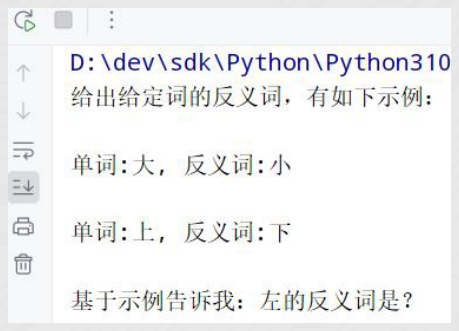

高 级 数 字 化 人 才 培 训 专 家

第 48 页原图

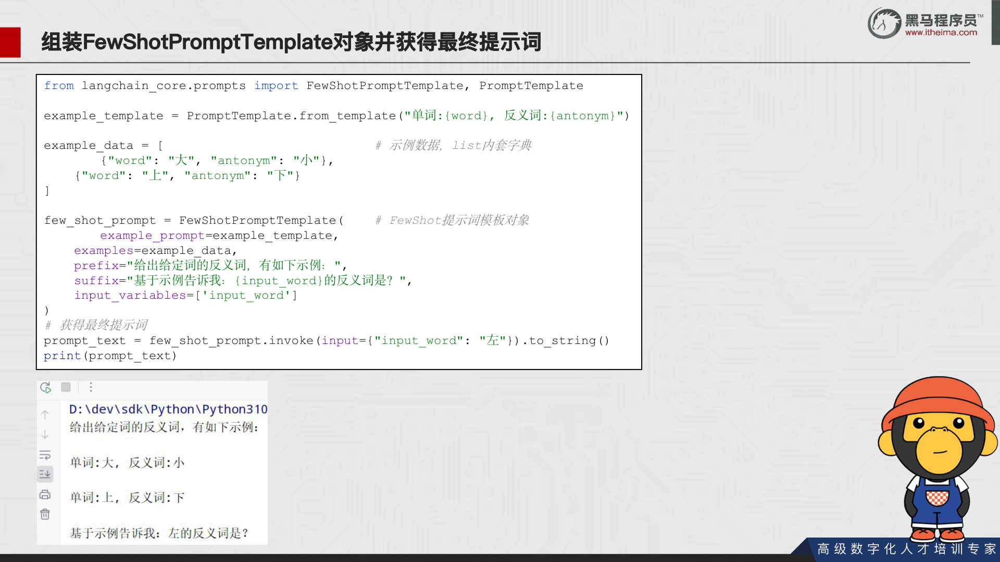

### 调用模型执行少样本任务

<!-- PDF 第 49 页 -->

~~~~
from langchain_core.prompts import FewShotPromptTemplate, PromptTemplate
from langchain_community.chat_models.tongyi import ChatTongyi
example_template = PromptTemplate(      # 示例的提示词模板对象
    input_variables=['word', 'antonym'],
    template="word: {word}, antonym: {antonym}"
)
example_data = [                        # 示例数据，list内套字典
    {"word": "大", "antonym": "小"},
    {"word": "上", "antonym": "下"}
]
few_shot_prompt = FewShotPromptTemplate(# FewShot提示词模板对象
    examples=example_data,
    example_prompt=example_template,
    prefix="给出给定词的反义词，有如下示例：",
    suffix="基于示例告诉我：{input_word}的反义词是？",
    input_variables=['input_word']
)
# 获得最终提示词
prompt_text = few_shot_prompt \
    .invoke(input={"input_word": "左"}) \
    .to_string()
model = ChatTongyi(model="qwen3-max")
for chunk in model.stream(input=prompt_text):
    print(chunk.content, end="", flush=True) 
~~~~

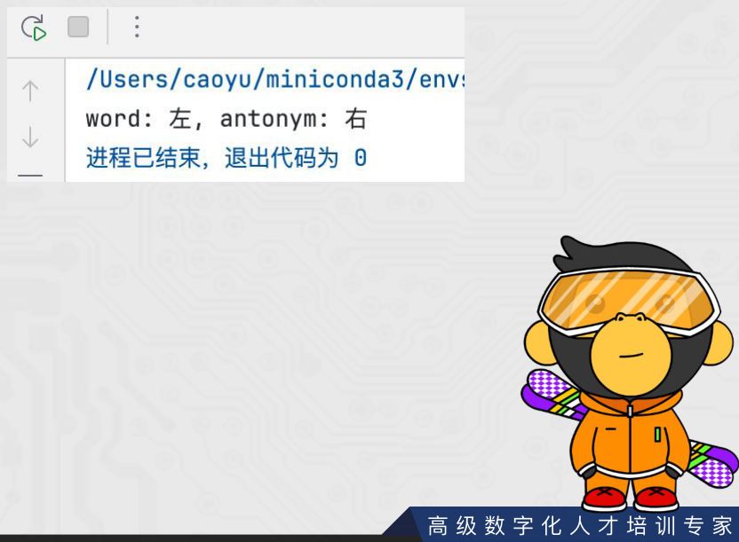

高 级 数 字 化 人 才 培 训 专 家

第 49 页原图

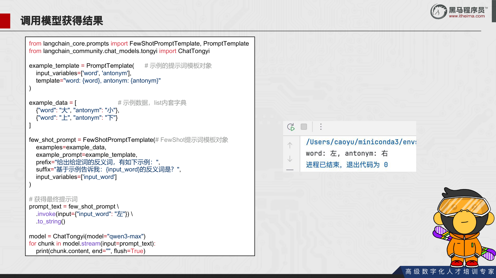

### FewShotPromptTemplate：少样本提示词小结

<!-- PDF 第 50 页 -->

FewShotPromptTemplate类对象构建需要5个核心参数：

- example\_prompt：示例数据的提示词模板

- examples：示例数据，list，内套字典

- prefix：组装提示词，示例数据前内容

- suffix：组装提示词，示例数据后内容

- input\_variables：列表，注入的变量列表

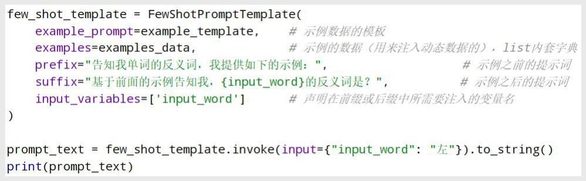

高 级 数 字 化 人 才 培 训 专 家

第 50 页原图

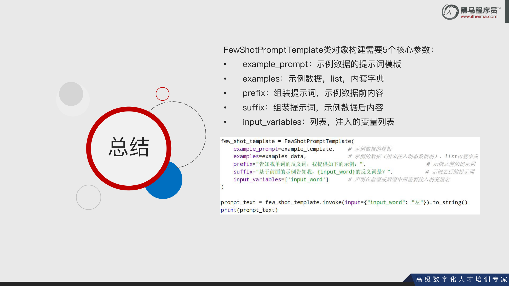

### 练习：抽取产品名称与核心卖点

<!-- PDF 第 51 页 -->

在前面学习few-shot思想的时候，我们有一个文字案例。

请基于代码，构建FewShotPromptTemplate，并调⽤模型获得结果。

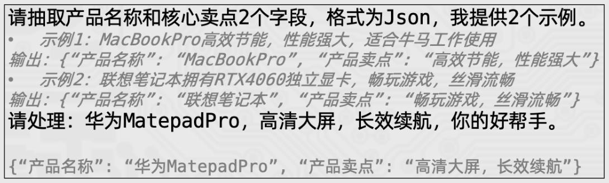

高 级 数 字 化 人 才 培 训 专 家

第 51 页原图

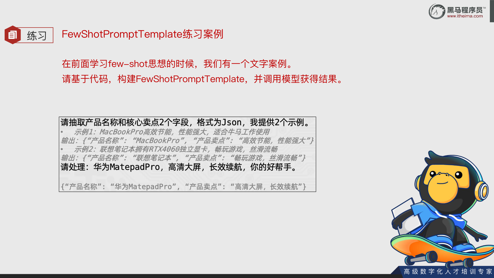

## 提示词模板的 format 与 invoke

<!-- PDF 第 52 页 -->

Part : LangChain RAG开发

高 级 数 字 化 人 才 培 训 专 家

第 52 页原图

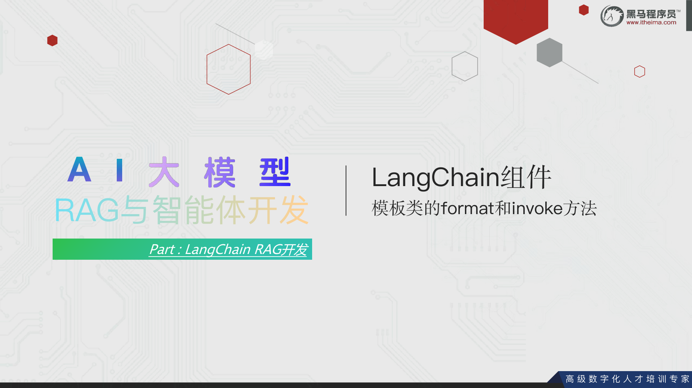

### 模板方法示例与继承关系

<!-- PDF 第 53 页 -->

在PromptTemplate（通⽤提示词模板）和FewShotPromptTemplate（FewShot提示词模板）的使⽤中，我们使⽤了如下：

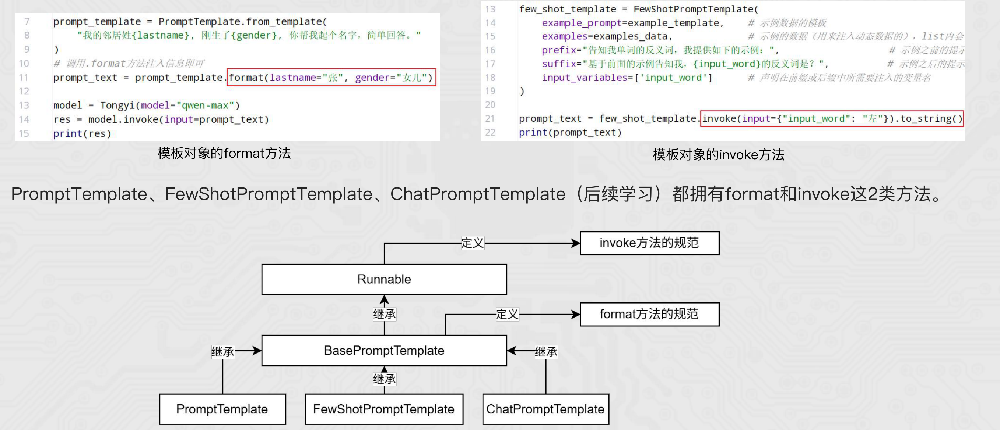

高 级 数 字 化 人 才 培 训 专 家

第 53 页原图

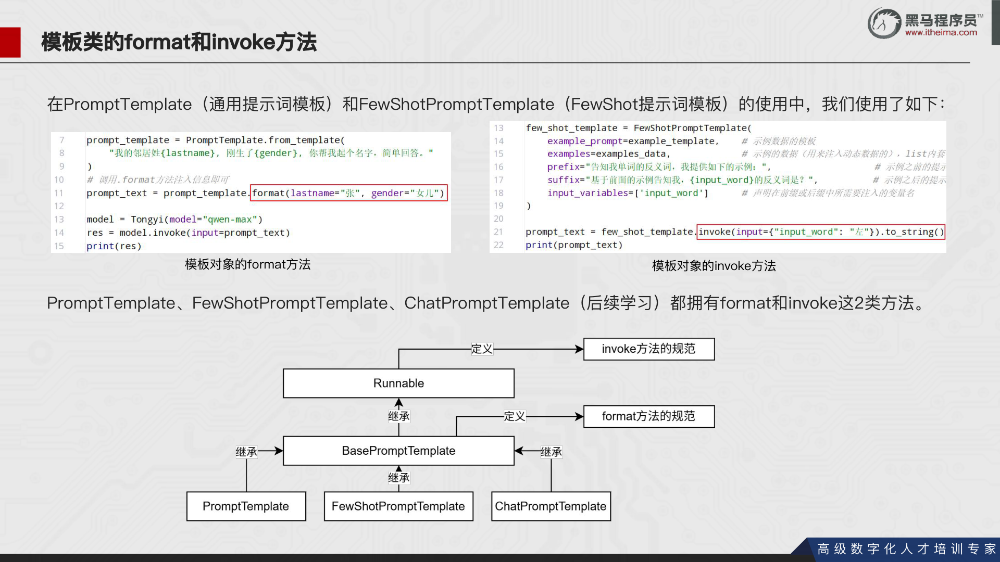

### format 与 invoke 的行为差异

<!-- PDF 第 54 页 -->

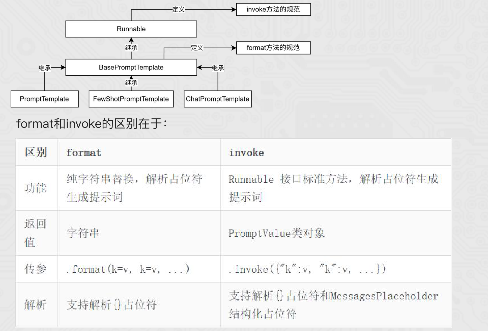

高 级 数 字 化 人 才 培 训 专 家

第 54 页原图

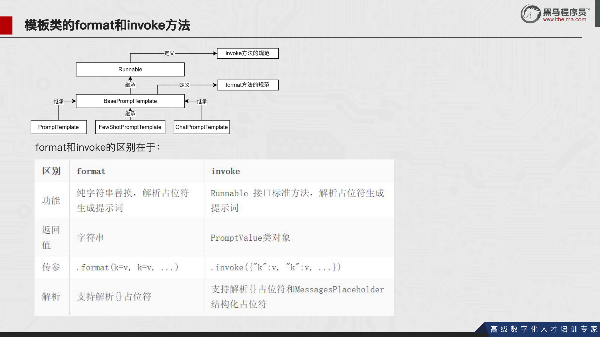

## ChatPromptTemplate：历史会话模板

<!-- PDF 第 55 页 -->

Part : LangChain RAG开发

高 级 数 字 化 人 才 培 训 专 家

第 55 页原图

### 通过 from_messages 创建会话模板

<!-- PDF 第 56 页 -->

PromptTemplate：通⽤提示词模板，支持动态注入信息。

FewShotPromptTemplate：支持基于模板注入任意数量的示例信息。

ChatPromptTemplate：支持注入任意数量的历史会话信息。

- 通过from\_messages方法，从列表中获取多轮次会话作为聊天的基础模板

    - PS: 前面PromptTemplate类用的from\_template仅能接入一条消息，而from\_messages可以接入一个list的消息

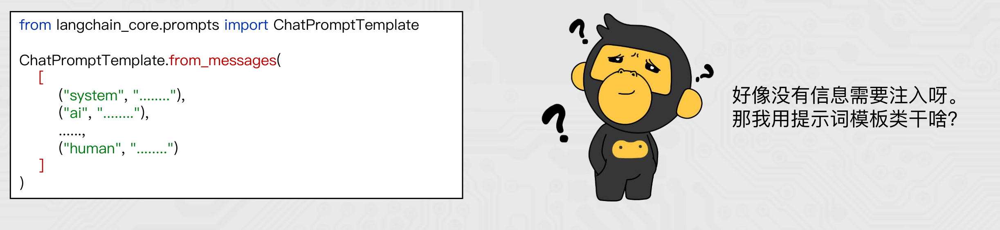

高 级 数 字 化 人 才 培 训 专 家

第 56 页原图

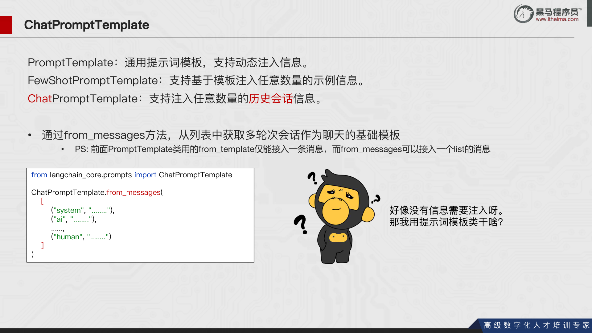

### 使用 MessagesPlaceholder 动态注入历史消息

<!-- PDF 第 57 页 -->

历史会话信息并不是静态的（固定的），而是随着对话的进行不停地积攒，即动态的。

所以，历史会话信息需要支持动态注入。

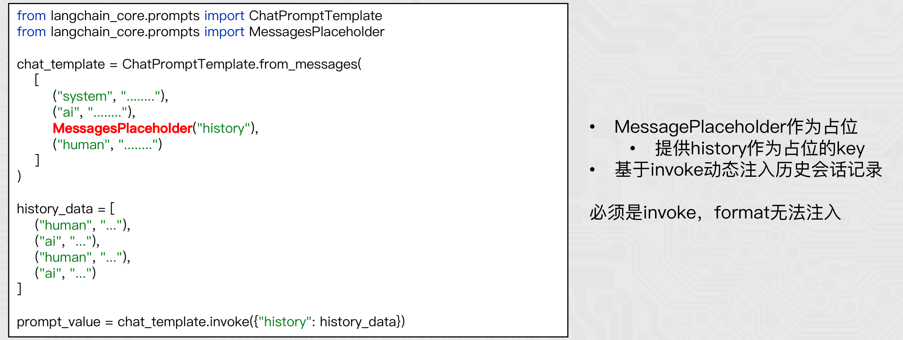

高 级 数 字 化 人 才 培 训 专 家

第 57 页原图

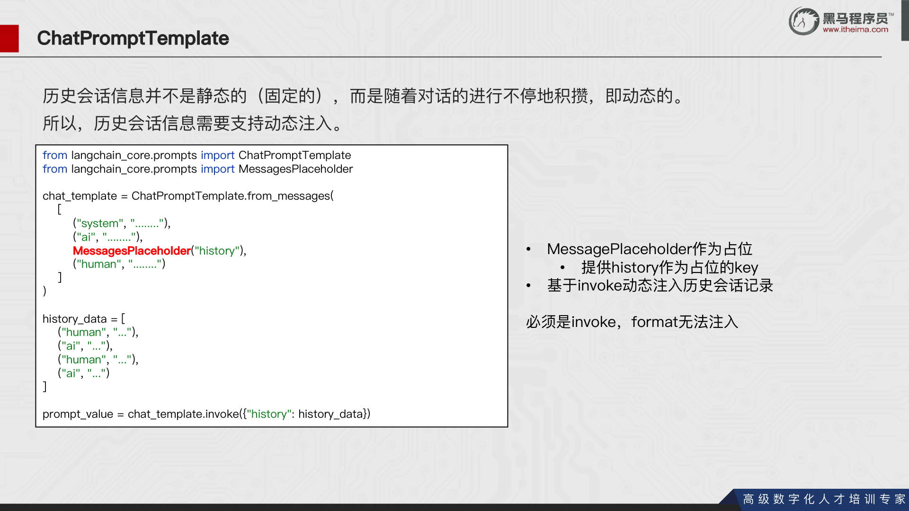

### 结合历史示例完成反义词任务

<!-- PDF 第 58 页 -->

也可以基于聊天模型，并组装聊天历史的模式，做提示词工程。

few-shot提示方式：求反义词 examples = \[ {"word": "开心", "antonym": "难过"}, {"word": "高", "antonym": "矮"}, \]

~~~~
from langchain_community.chat_models import ChatTongyi
from langchain_core.output_parsers import StrOutputParser
from langchain_core.prompts import ChatPromptTemplate, MessagesPlaceholder
from langchain_core.messages import HumanMessage, AIMessage
prompt = ChatPromptTemplate.from_messages(
    [
        (“system”, “给出每个单词的反义词”),
        # 存储多轮对话的历史记录  history是占位符名称,后续从字典按history作为key取value替代内
容
        MessagesPlaceholder(“history”),
        (“human”, “{question}”)
    ]
)
model = ChatTongyi(model=“qwen3-max”)
# StrOutputParser() LangChain内置的结果解析器,可以直接提取结果文本内容,剔除其余元数据信
息
chain = prompt | model | StrOutputParser()
# 无历史会话的提问
for chunk in chain.stream(input={“history”: [], “question”: “粗”}):
    print(chunk)
print(“*”*20)
#带有历史的提问 用 HumanMessage（用户消息）和 AIMessage（模型消息）封装历史对话
history = [     # history 要求是一个列表,内部封装用户和AI的对话记录
    HumanMessage(content="开心"),  # 对应 ("human", "开心")
    AIMessage(content="难过"),    # 对应 ("ai", "难过")
    HumanMessage(content="高"),   # 对应 ("human", "高")
    AIMessage(content="矮")      # 对应 ("ai", "矮")
]
# 简化写法,元组的第一个元素是角色(标准角色名 human ai) 第二个元素是消息
# history = [
#     ("human", "开心"), ("ai", "难过"),
#     ("human", "高"), ("ai", "矮")
# ]
for chunk in chain.stream(input={"history": history, "question": "粗"}):
~~~~

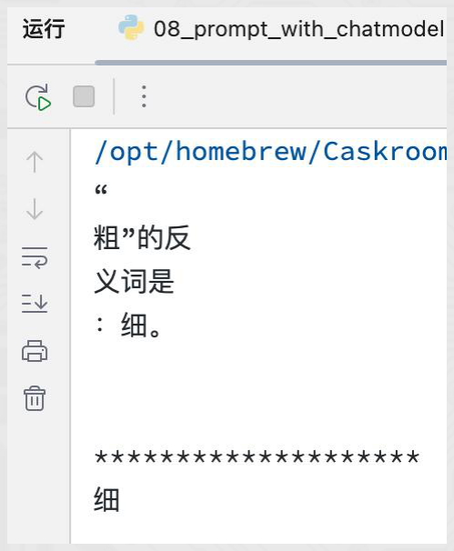

高 级 数 字 化 人 才 培 训 专 家

print(chunk)

第 58 页原图

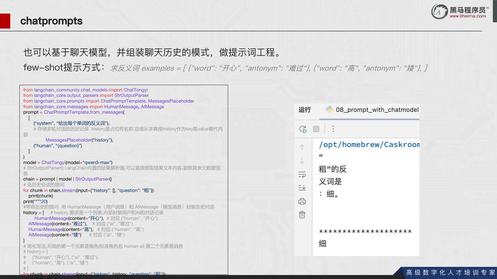

## Chains：链的基础使用

<!-- PDF 第 59 页 -->

Part : LangChain RAG开发

高 级 数 字 化 人 才 培 训 专 家

第 59 页原图

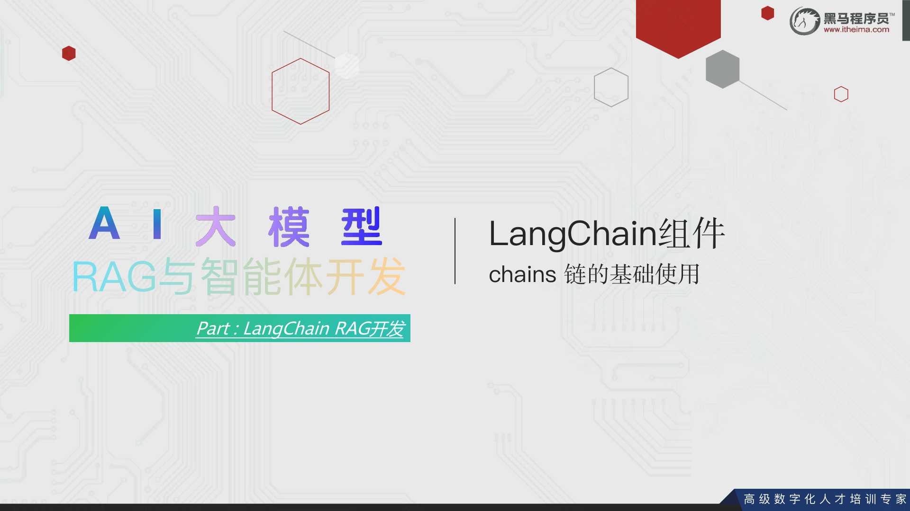

### 组件串联原理与 Runnable 继承关系

<!-- PDF 第 60 页 -->

「将组件串联，上一个组件的输出作为下一个组件的输入」是 LangChain 链（尤其是 \| 管道链）的核心工作原
理，这也是链式调⽤的核心价值：实现数据的自动化流转与组件的协同工作，如下。

~~~~
chain = prompt_template | model
~~~~

核心前提：即Runnable子类对象才能入链（以及Callable、Mapping接口子类对象也可加入（后续了解⽤的不多））。

我们目前所学习到的组件，均是Runnable接口的子类，如下类的继承关系：

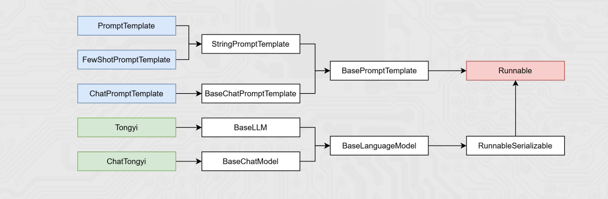

高 级 数 字 化 人 才 培 训 专 家

第 60 页原图

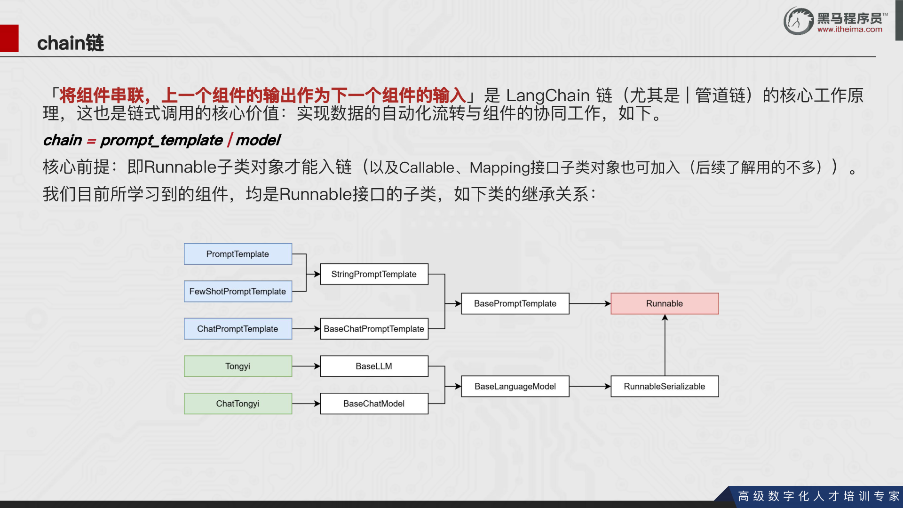

### 创建链并通过 invoke 或 stream 执行

<!-- PDF 第 61 页 -->

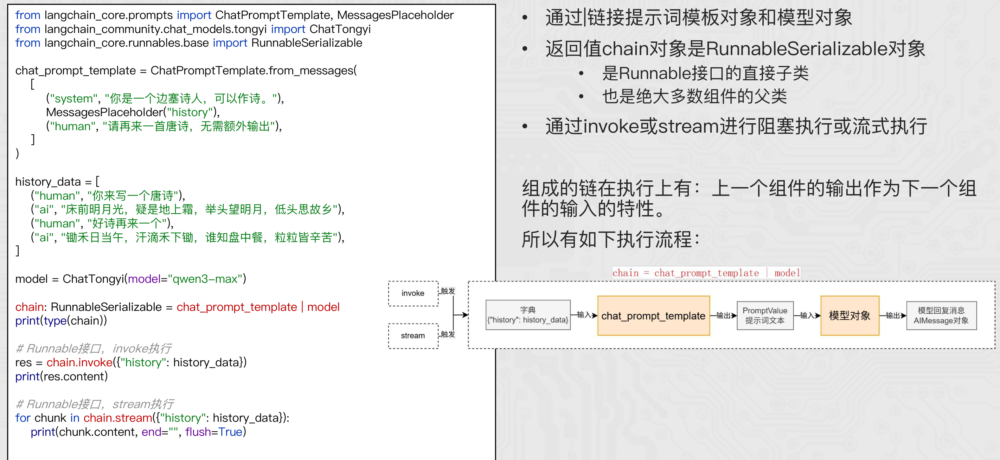

高 级 数 字 化 人 才 培 训 专 家

第 61 页原图

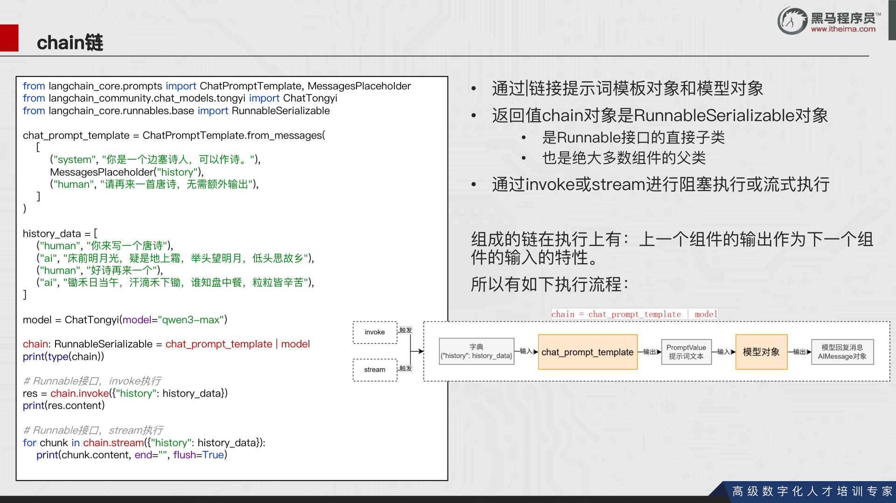

### Chains：链的基础使用小结

<!-- PDF 第 62 页 -->

LangChain中链是一种将各个组件串联在一起，按顺序执行，
前一个组件的输出作为下一个组件的输入。

- 可以通过 “\|” 符号来让各个组件形成链

- 成链的各个组件，需是Runnable接口的子类

- 形成的链是RunnableSerializable对象（Runnabl接口子
    类）

- 可通过链调⽤invoke或stream触发整个链条的执行

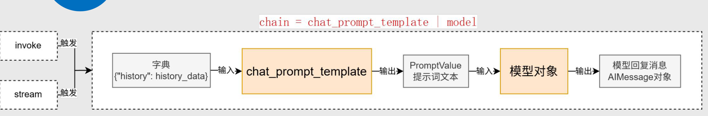

高 级 数 字 化 人 才 培 训 专 家

第 62 页原图

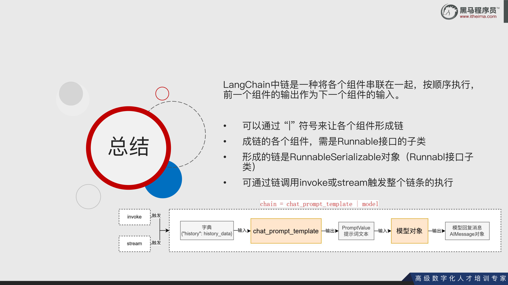

## Python 管道运算符重载

<!-- PDF 第 63 页 -->

Part : LangChain RAG开发

高 级 数 字 化 人 才 培 训 专 家

第 63 页原图

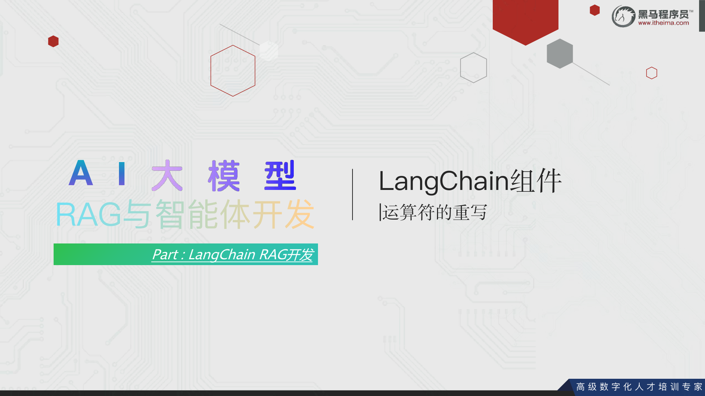

### 管道运算符与魔法方法的对应关系

<!-- PDF 第 64 页 -->

前文代码中： chain = chat\_prompt\_template \| model

在语法上使⽤了\|运算符的重写

在 Python 中，运算符（如 +、\|）的行为由类的魔法方法决定。例如：

- a + b 本质调⽤的是 a.\_\_add\_\_(b)

- a \| b 本质调⽤的是 a.\_\_or\_\_(b)

只需要自行实现类的\_\_or\_\_方法，即可对\|符号的功能进行重写。

示例：

- 让 a\|b\|c 的代码得到一个自定义的类对象(类似列表即\[a, b, c\])

- 调⽤run方法依次输出a、b、c

- 我们需要重写 \| 即 \_\_or\_\_方法

高 级 数 字 化 人 才 培 训 专 家

第 64 页原图

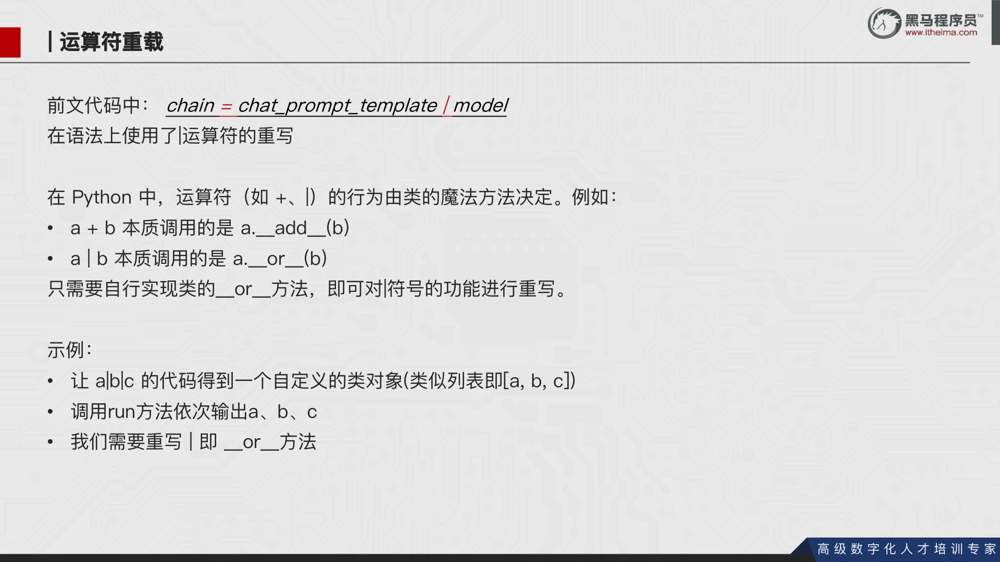

### 实现 Test 与 MySequence 链式调用

<!-- PDF 第 65 页 -->

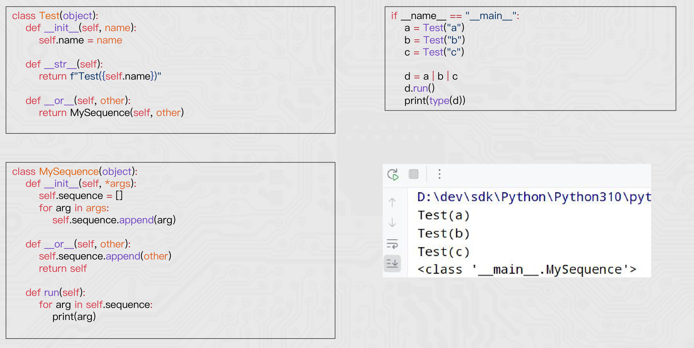

高 级 数 字 化 人 才 培 训 专 家

第 65 页原图

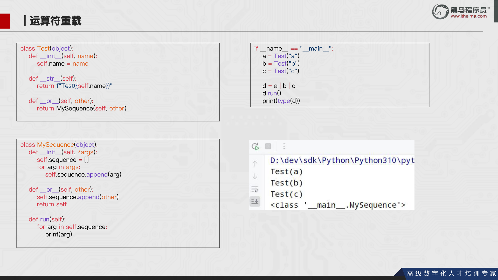

## StrOutputParser：字符串输出解析

<!-- PDF 第 66 页 -->

Part : LangChain RAG开发

高 级 数 字 化 人 才 培 训 专 家

第 66 页原图

### 直接串联两个模型时的类型错误

<!-- PDF 第 67 页 -->

有如下代码，想要以第一次模型的输出结果，第二次去询问模型：

~~~~
from langchain_core.prompts import PromptTemplate
from langchain_community.chat_models.tongyi import ChatTongyi
model = ChatTongyi(model="qwen3-max")
prompt = PromptTemplate.from_template(
    "我邻居姓：{lastname}, 刚生了{gender}，请起名，仅告知名字无需其它内容"
)
chain = prompt | model | model
res = chain.invoke({"lastname": "张", "gender": "女儿"})
print(res.content)
~~~~

- 链的构建完全符合要求（参与的组件）

- 但是运行报错（ValueError: Invalid input type \<class 'langchain\_core.messages.ai.AIMessage'\>. Must be a PromptValue, str, or list of BaseMessages.）

高 级 数 字 化 人 才 培 训 专 家

第 67 页原图

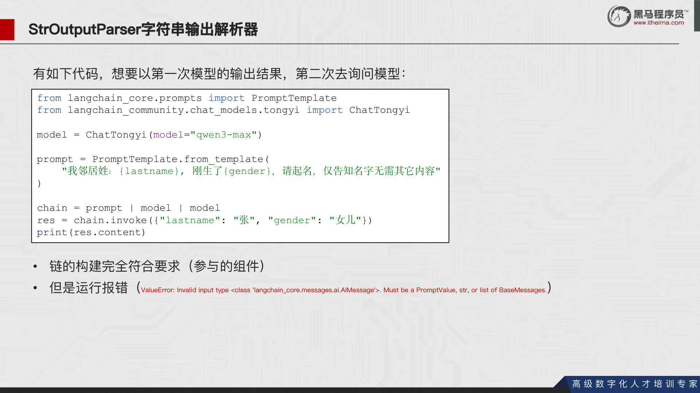

### AIMessage 与模型输入类型不兼容的原因

<!-- PDF 第 68 页 -->

~~~~
chain = prompt | model | model
~~~~

错误的主要原因是：

模型（ChatTongyi）源码中关于invoke方法明确指定了input的类型：

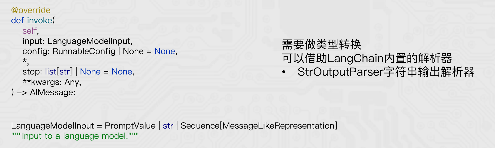

高 级 数 字 化 人 才 培 训 专 家

第 68 页原图

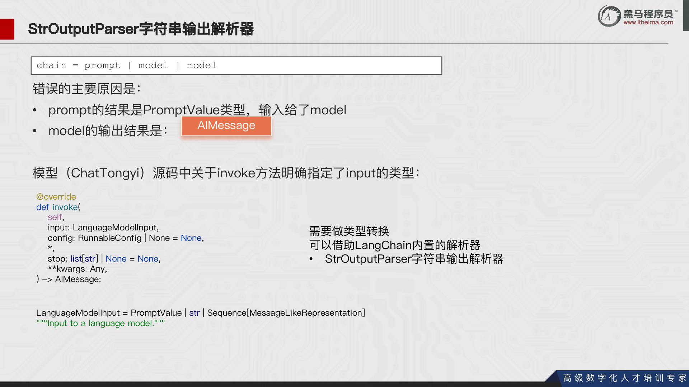

### 用 StrOutputParser 转换输出并连接模型

<!-- PDF 第 69 页 -->

StrOutputParser是LangChain内置的简单字符串解析器

- 可以将AIMessage解析为简单的字符串，符合了模型invoke方法要求（可传入字符串，不接收AIMessage
    类型）

- 是Runnable接口的子类（可以加入链）

~~~~
parser = StrOutputParser()
chain = prompt | model | parser | model
@override
def invoke(
    self,
    input: LanguageModelInput,
    config: RunnableConfig | None = None,
    *,
    stop: list[str] | None = None,
    **kwargs: Any,
) -> AIMessage:
 
LanguageModelInput = PromptValue | str | Sequence[MessageLikeRepresentation]
"""Input to a language model."""
~~~~

高 级 数 字 化 人 才 培 训 专 家

第 69 页原图

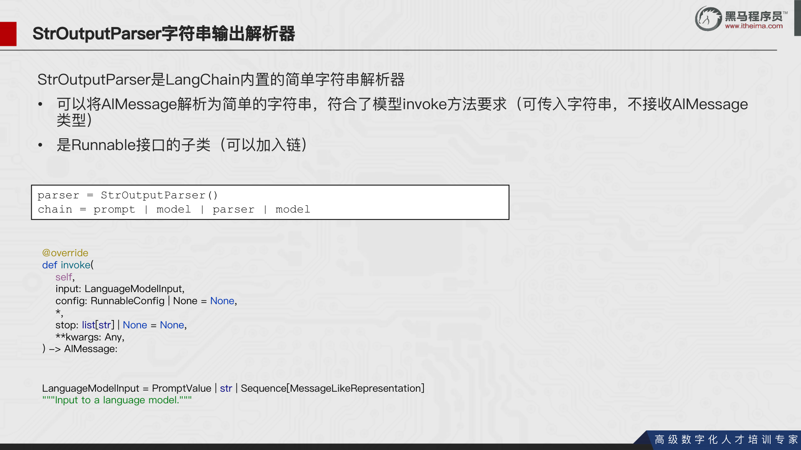

### StrOutputParser：字符串输出解析小结

<!-- PDF 第 70 页 -->

StrOutputParser是LangChain内置的简单字符串解析器。

- 可以将AIMessage类型转换为基础字符串

- 可以加入chain作为组件存在（Runnable接口子类）

高 级 数 字 化 人 才 培 训 专 家

第 70 页原图

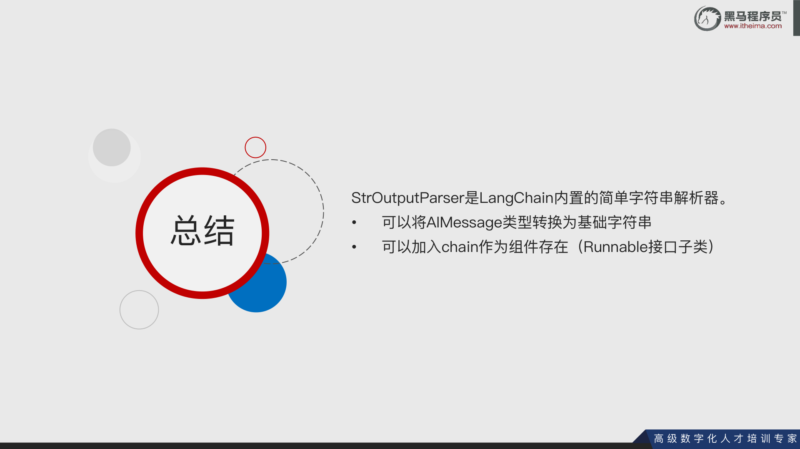

## Runnable：可执行组件接口

<!-- PDF 第 71 页 -->

Part : LangChain RAG开发

高 级 数 字 化 人 才 培 训 专 家

第 71 页原图

### RunnableSequence 的形成与链式组合

<!-- PDF 第 72 页 -->

LangChain 中的绝⼤多数核心组件都继承了 Runnable 抽象基类（位于 langchain\_core.runnables.base）。

代码：

~~~~
chain = prompt | model
~~~~

chain变量是RunnableSequence（RunnableSerializable子类）类型

而得到这个类型的原因就是Runnable基类内部对\_\_or\_\_魔术方法的改写。

同时，在后面继续使⽤\|添加新的组件，依旧会得到RunnableSequence，这就是链的基础架构。

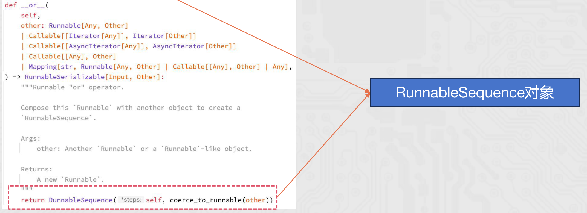

高 级 数 字 化 人 才 培 训 专 家

第 72 页原图

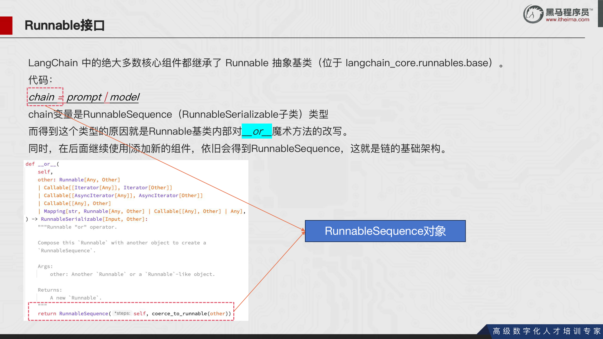

## JsonOutputParser：多模型执行链

<!-- PDF 第 73 页 -->

Part : LangChain RAG开发

高 级 数 字 化 人 才 培 训 专 家

第 73 页原图

### 多模型链中的数据处理流程

<!-- PDF 第 74 页 -->

~~~~
chain = prompt | model | parser | model | parser
~~~~

在前面我们完成了这样的需求去构建多模型链，不过这种做法并不标准，因为：

上一个模型的输出，没有被处理就输入下一个模型。

正常情况下我们应该有如下处理逻辑：

即：

- 上一个模型的输出结果，应该作为提示词模版的输入，构建下一个提示词，⽤来二次调⽤模型。

高 级 数 字 化 人 才 培 训 专 家

第 74 页原图

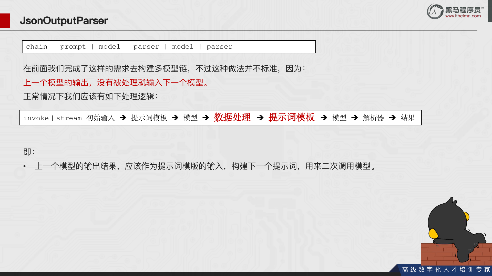

### 将 AIMessage 转为提示词需要的字典

<!-- PDF 第 75 页 -->

根据输出和输入的要求：

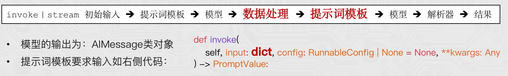

所以，我们需要完成：

将模型输出的AIMessage  转为字典  注入第二个提示词模板中，形成新的提示词（PromptValue对象）

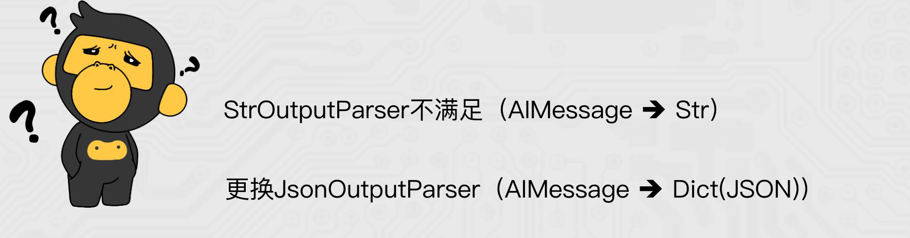

高 级 数 字 化 人 才 培 训 专 家

第 75 页原图

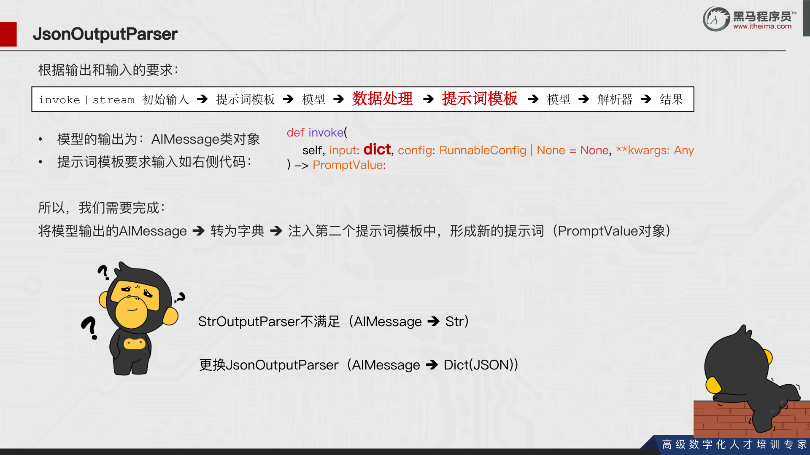

### 使用 JsonOutputParser 构建完整多模型链

<!-- PDF 第 76 页 -->

~~~~
from langchain_core.output_parsers import StrOutputParser
from langchain_core.output_parsers import JsonOutputParser
from langchain_core.prompts import PromptTemplate
from langchain_community.chat_models.tongyi import ChatTongyi
str_parser = StrOutputParser()
json_parser = JsonOutputParser()
model = ChatTongyi(model="qwen3-max")
first_prompt = PromptTemplate.from_template(
    "我邻居姓：{lastname}，刚生了{gender}，请起名，并封装到JSON格式返回给我，"
    "要求key是name，value就是起的名字。请严格遵守格式要求"
)
second_prompt = PromptTemplate.from_template(
    "姓名{name}，请帮我解析含义。"
)
chain = first_prompt | model | json_parser | second_prompt | model | str_parser
res: str = chain.invoke({"lastname": "张", "gender": "女儿"})
print(res)
print(type(res))
~~~~

高 级 数 字 化 人 才 培 训 专 家

第 76 页原图

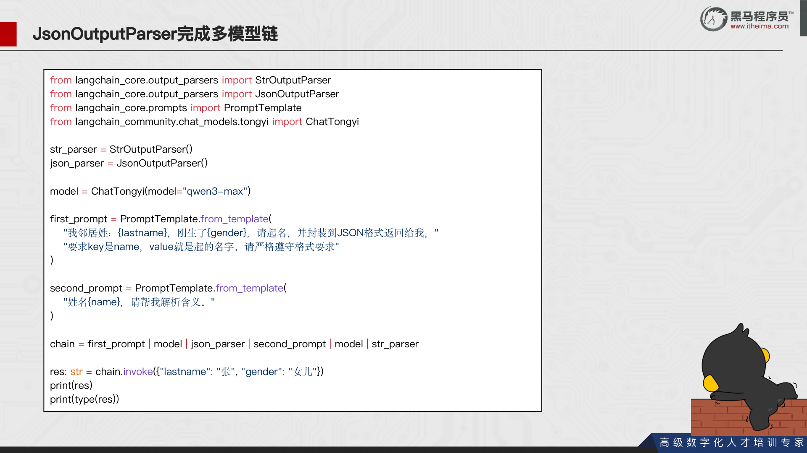

### JsonOutputParser：多模型执行链小结

<!-- PDF 第 77 页 -->

在构建链的时候要注意整体兼容性，注意前后组件的输入和
输出要求。

- 模型输入：PromptValue或字符串或序列
    （BaseMessage、list、tuple、str、dict）。

- 模型输出：AIMessage

- 提示词模板输入：要求是字典

- 提示词模板输出：PromptValue对象

- StrOutputParser：AIMessage输入、str输出

- JsonOutputParser:AIMessage输入、dict输出

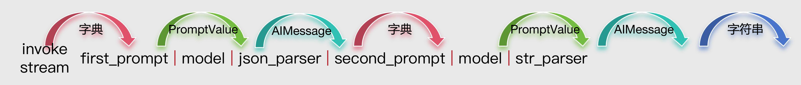

高 级 数 字 化 人 才 培 训 专 家

第 77 页原图

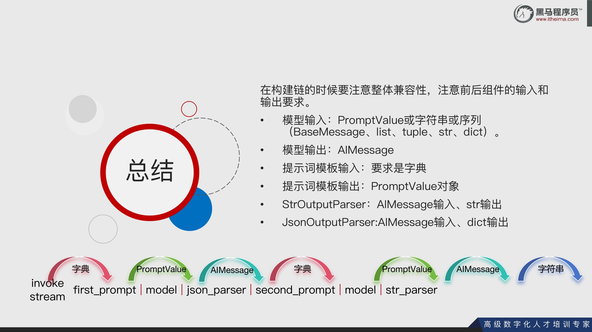

## RunnableLambda：自定义函数入链

<!-- PDF 第 78 页 -->

Part : LangChain RAG开发

高 级 数 字 化 人 才 培 训 专 家

第 78 页原图

### 将普通函数转换为 Runnable 组件

<!-- PDF 第 79 页 -->

~~~~
chain = first_prompt | model | json_parser | second_prompt | model | str_parser
~~~~

前文我们根据JsonOutputParser完成了多模型执行链条的构建。

- 除了JsonOutputParser这类固定功能的解析器之外

- 我们也可以自己编写Lambda匿名函数来完成自定义逻辑的数据转换，想怎么转换就怎么转换，更自由。

想要完成这个功能，可以基于RunnableLambda类实现。

RunnableLambda类是LangChain内置的，将普通函数等转换为Runnable接口实例，方便自定义函数加入chain。

语法：

RunnableLambda(函数对象或lambda匿名函数)

高 级 数 字 化 人 才 培 训 专 家

第 79 页原图

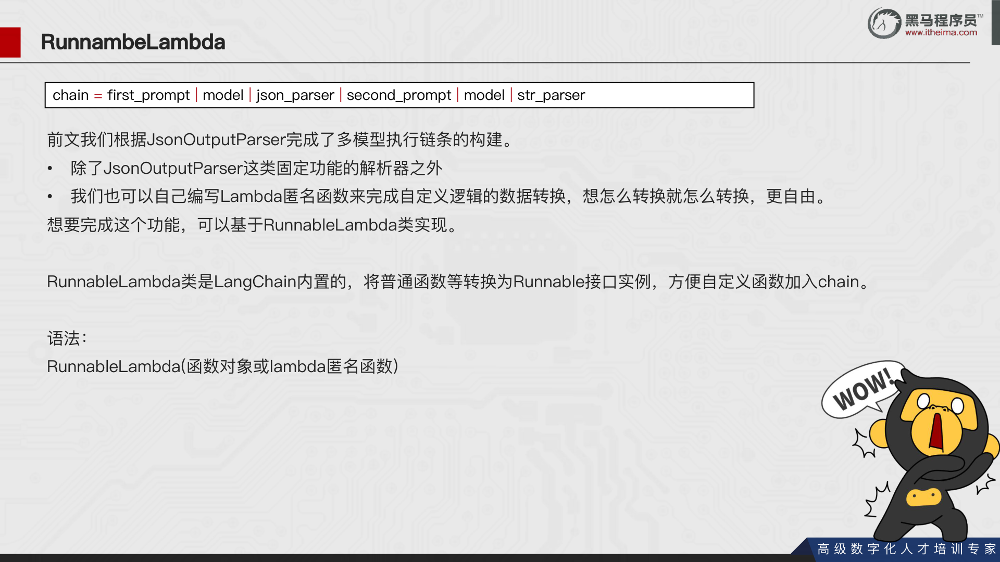

### 使用 Lambda 转换模型输出的示例

<!-- PDF 第 80 页 -->

~~~~
from langchain_core.output_parsers import StrOutputParser
from langchain_core.runnables import RunnableLambda
from langchain_core.prompts import PromptTemplate
from langchain_community.chat_models.tongyi import ChatTongyi
str_parser = StrOutputParser()
my_func = RunnableLambda(lambda ai_msg: {"name": ai_msg.content})
model = ChatTongyi(model="qwen3-max")
first_prompt = PromptTemplate.from_template(
    "我邻居姓：{lastname}，刚⽣了{gender}，请起名，仅告知我名字，不要额外信息"
)
second_prompt = PromptTemplate.from_template(
    "姓名{name}，请帮我解析含义。"
)
chain = first_prompt | model | my_func | second_prompt | model | str_parser
res: str = chain.invoke({"lastname": "张", "gender": "女儿"})
print(res)
print(type(res))
~~~~

高 级 数 字 化 人 才 培 训 专 家

第 80 页原图

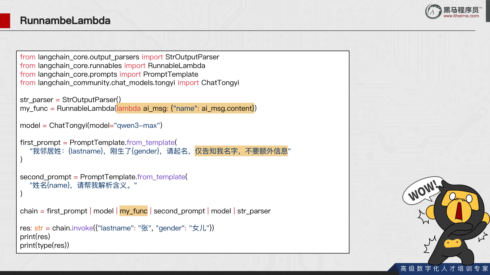

### 普通函数直接入链的自动包装机制

<!-- PDF 第 81 页 -->

~~~~
chain = first_prompt | model | (lambda ai_msg: {"name": ai_msg.content}) | second_prompt | model | str_parser
~~~~

跳过RunnableLambda类，直接让函数加入链也是可以的。
因为Runnable接口类在实现\_\_or\_\_的时候，支持Callable接口的实例。
- 函数就是Callable接口的实例

~~~~
def __or__(
    self,
    other: Runnable[Any, Other]
    | Callable[[Iterator[Any]], Iterator[Other]]
    | Callable[[AsyncIterator[Any]], AsyncIterator[Other]]
    | Callable[[Any], Other]
    | Mapping[str, Runnable[Any, Other] | Callable[[Any], Other] | Any],
) -> RunnableSerializable[Input, Other]:
~~~~

如上代码示例，\|符号（底层是调用\_\_or\_\_）组链，是支持函数加入的。
其本质是将函数自动转换为RunnableLambda

高 级 数 字 化 人 才 培 训 专 家

第 81 页原图

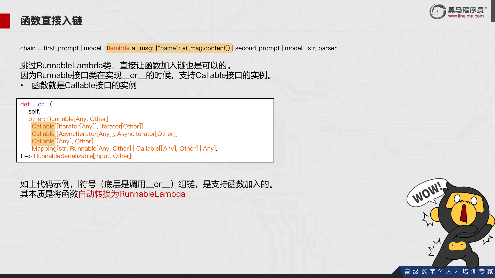

### RunnableLambda：自定义函数入链小结

<!-- PDF 第 82 页 -->

如果像要在链中加入自定义函数，可以选择：

- 将函数封装入RunnableLambda类对象，其是Runnable
    接口实例，可以直接入链

- 直接将函数入链，函数会自动转换为RunnableLambda
    对象

高 级 数 字 化 人 才 培 训 专 家

第 82 页原图

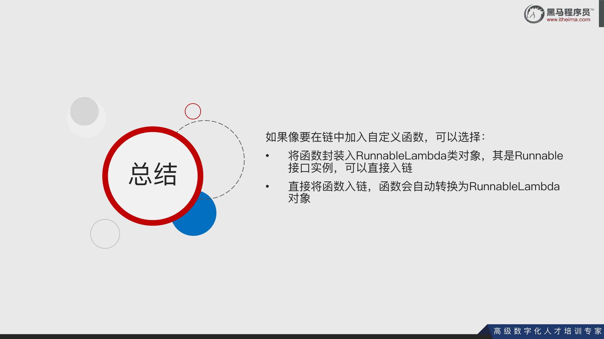

## Memory：临时会话记忆

<!-- PDF 第 83 页 -->

InMemoryChatMessageHistory

Part : LangChain RAG开发

高 级 数 字 化 人 才 培 训 专 家

第 83 页原图

### 为链附加历史记录与内存存储

<!-- PDF 第 84 页 -->

如果想要封装历史记录，除了自行维护历史消息外，也可以借助LangChain内置的历史记录附加功能。

LangChain提供了History功能，帮助模型在有历史记忆的情况下回答。

- 基于RunnableWithMessageHistory在原有链的基础上创建带有历史记录功能的新链（新Runnable实例）

- 基于InMemoryChatMessageHistory为历史记录提供内存存储（临时⽤）

~~~~
from langchain_core.runnables.history import RunnableWithMessageHistory
# 通过RunnableWithMessageHistory获取一个新的带有历史记录功能的chain
conversation_chain = RunnableWithMessageHistory(
    some_chain,           # 被附加历史消息的Runnable，通常是chain
    None,                 # 获取指定会话ID的历史会话的函数
    input_messages_key="input",         # 声明⽤户输入消息在模板中的占位符
    history_messages_key="chat_history" # 声明历史消息在模板中的占位符
)
# 获取指定会话ID的历史会话记录函数
chat_history_store = {}     # 存放多个会话ID所对应的历史会话记录
# 函数传入为会话ID（字符串类型）
# 函数要求返回BaseChatMessageHistory的子类
# BaseChatMessageHistory类专⽤于存放某个会话的历史记录
# InMemoryChatMessageHistory是官方自带的基于内存存放历史记录的类
def get_history(session_id):
    if session_id not in chat_history_store:
        # 返回一个新的实例
        chat_history_store[session_id] = InMemoryChatMessageHistory()
    return chat_history_store[session_id]
~~~~

高 级 数 字 化 人 才 培 训 专 家

第 84 页原图

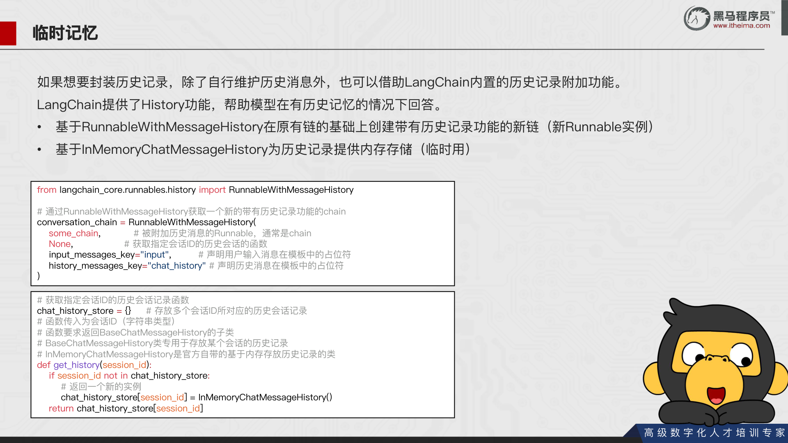

### 按会话 ID 管理临时记忆的完整示例

<!-- PDF 第 85 页 -->

完整代码：

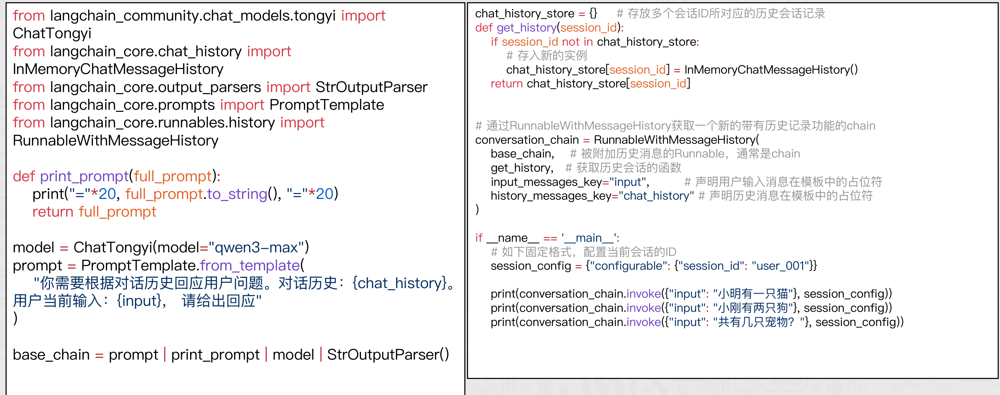

高 级 数 字 化 人 才 培 训 专 家

第 85 页原图

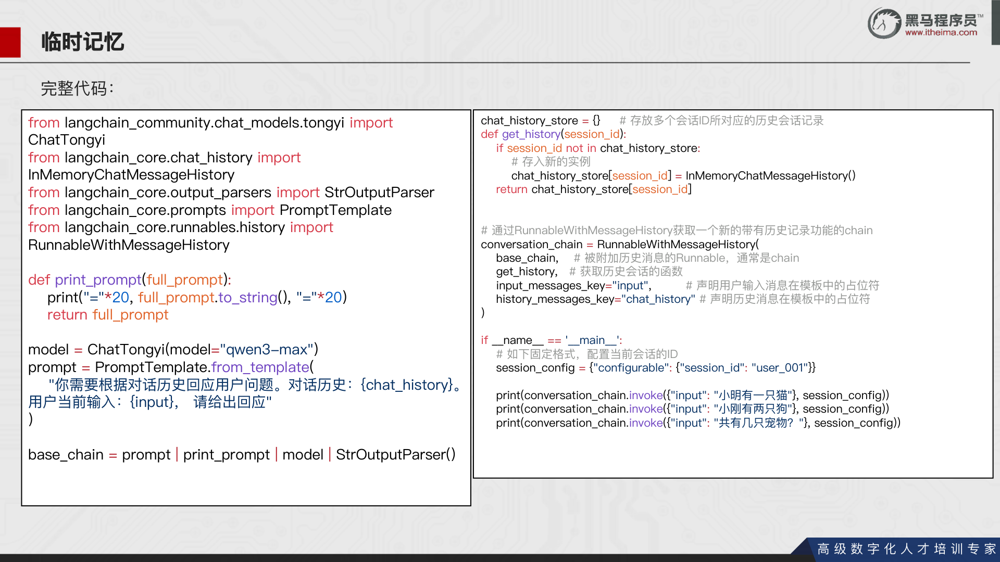

### Memory：临时会话记忆小结

<!-- PDF 第 86 页 -->

RunnableWithMessageHistory是LangChain内Runnable接口的实
现，主要⽤于：

- 创建一个带有历史记忆功能的Runnable实例（链）

它在创建的时候需要提供一个BaseChatMessageHistory的具体实
现（⽤来存储历史消息）

- InMemoryChatMessageHistory可以实现在内存中存储历史

额外的，如果想要在invoke或stream执行链的同时，将提示词print
出来，可以在链中加入自定义函数实现。

- 注意：函数的输入应原封不动返回出去，避免破坏原有业务，
    仅在return之前，print所需信息即可。

高 级 数 字 化 人 才 培 训 专 家

第 86 页原图

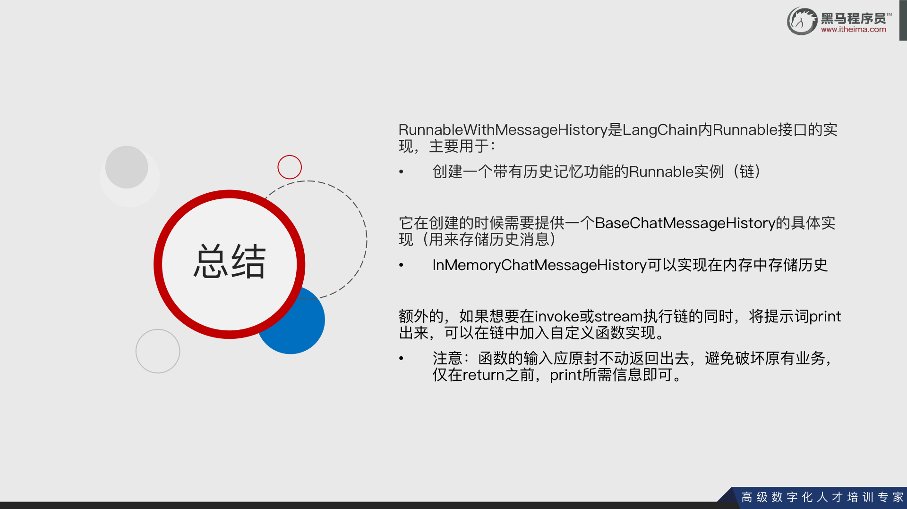

## Memory：长期会话记忆

<!-- PDF 第 87 页 -->

自实现FileChatMessageHistory

Part : LangChain RAG开发

高 级 数 字 化 人 才 培 训 专 家

第 87 页原图

### 从内存记忆转向本地文件存储

<!-- PDF 第 88 页 -->

使⽤InMemoryChatMessageHistory仅可以在内存中临时存储会话记忆，一旦程序退出，则记忆丢失。

InMemoryChatMessageHistory 类继承自 BaseChatMessageHistory

在官方注释中给出了相关实现的指南，并给出了基于文件
的历史消息存储示例代码。

我们可以自行实现一个基于Json格式和本地文件的会话数
据保存。

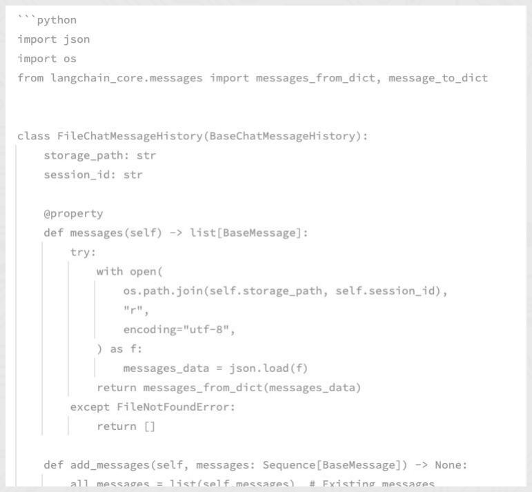

高 级 数 字 化 人 才 培 训 专 家

第 88 页原图

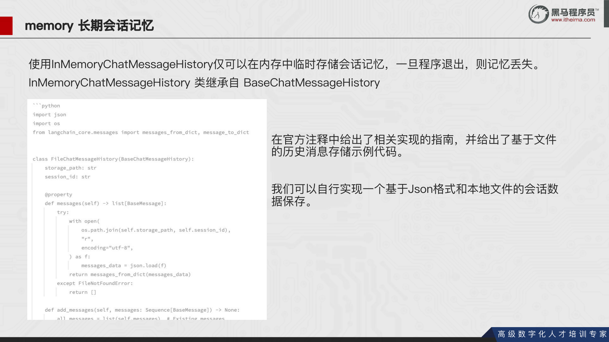

### 实现 FileChatMessageHistory 的核心接口

<!-- PDF 第 89 页 -->

FileChatMessageHistory类实现，核心思路：

- 基于文件存储会话记录，以session\_id为文件名，不同
    session\_id有不同文件存储消息

继承BaseChatMessageHistory实现如下3个方法：
- add\_messages:同步模式，添加消息
- messages:同步模式，获取消息
- clear：同步模式，清除消息

如右侧代码，官方在BaseChatMessageHistory类的注释
中提供了一个基于文件存储的示例代码。

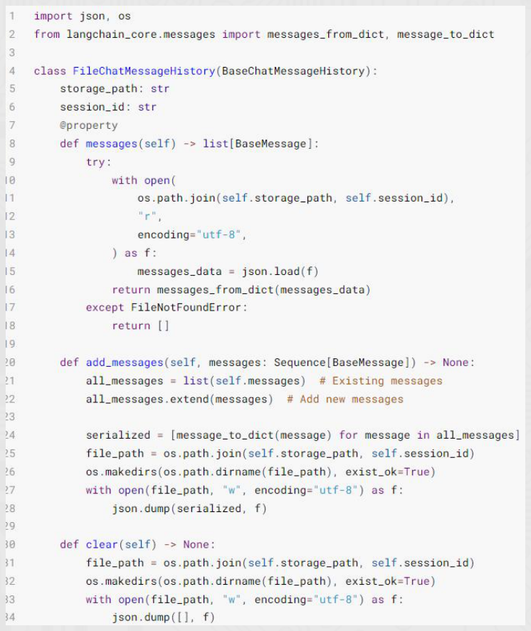

高 级 数 字 化 人 才 培 训 专 家

第 89 页原图

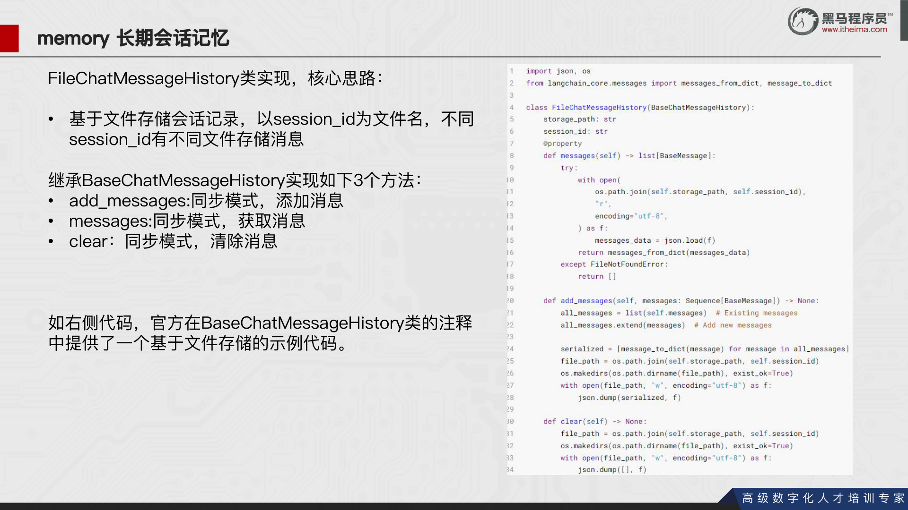

### 持久化会话链与多轮对话测试

<!-- PDF 第 90 页 -->

其余核心代码

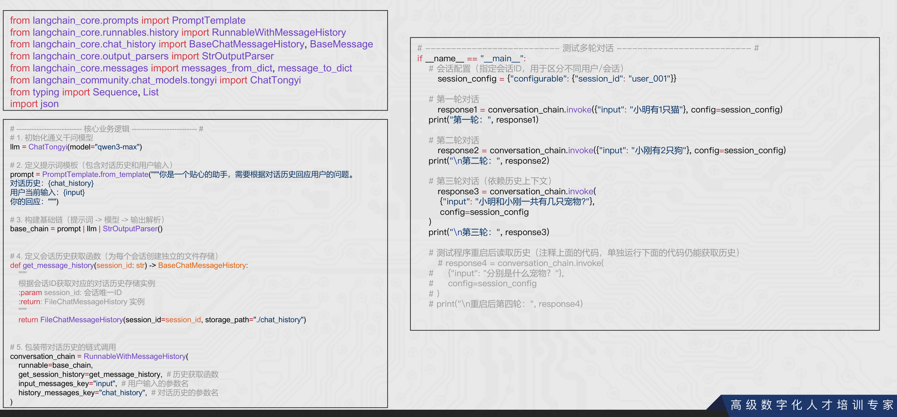

高 级 数 字 化 人 才 培 训 专 家

第 90 页原图

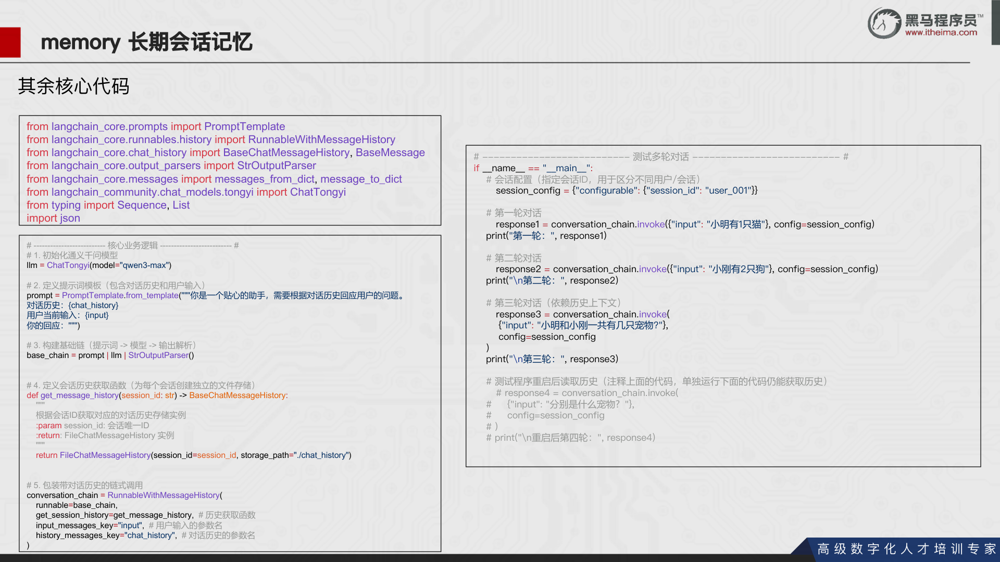

## Document Loaders：文档加载基础

<!-- PDF 第 91 页 -->

Part : LangChain RAG开发

高 级 数 字 化 人 才 培 训 专 家

第 91 页原图

### Document 的内容与元数据结构

<!-- PDF 第 92 页 -->

文档加载器提供了一套标准接口，⽤于将不同来源（如 CSV、PDF 或 JSON等）的数据读取为 LangChain
的文档格式。这确保了无论数据来源如何，都能对其进行一致性处理。

文档加载器（内置或自行实现）需实现BaseLoader接口。

Class Document，是LangChain内文档的统一载体，所有文档加载器最终返回此类的实例。

一个基础的Document类实例，基于如下代码创建：

~~~~
from langchain_core.documents import Document
document = Document(
    page_content="Hello, world!", metadata={"source": 
"https://example.com"}
)
~~~~

可以看到，Document类其核心记录了：

- page\_content：文档内容

- metadata：文档元数据（字典）

高 级 数 字 化 人 才 培 训 专 家

第 92 页原图

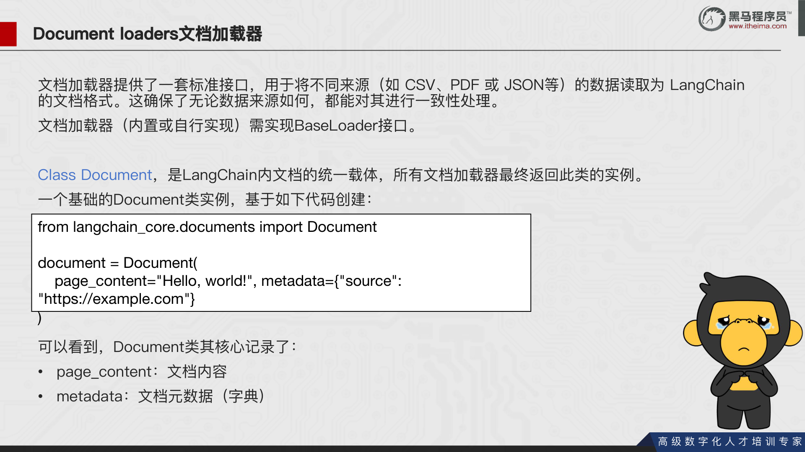

### load 与 lazy_load 的加载方式

<!-- PDF 第 93 页 -->

不同的文档加载器可能定义了不同的参数，但是其都实现了统一的接口（方法）。

- load()：一次性加载全部文档

- lazy\_load()：延迟流式传输文档，对⼤型数据集很有⽤，避免内存溢出。

一个简单的CSVLoader的使⽤示例如下：

~~~~
from langchain_community.document_loaders.csv_loader 
import CSVLoader
loader = CSVLoader(
    ...  # 初始化参数
)
# 一次性加载全部文档
documents = loader.load()
# 对于⼤数据集，分段返回文档
for document in loader.lazy_load():
    print(document)
~~~~

高 级 数 字 化 人 才 培 训 专 家

第 93 页原图

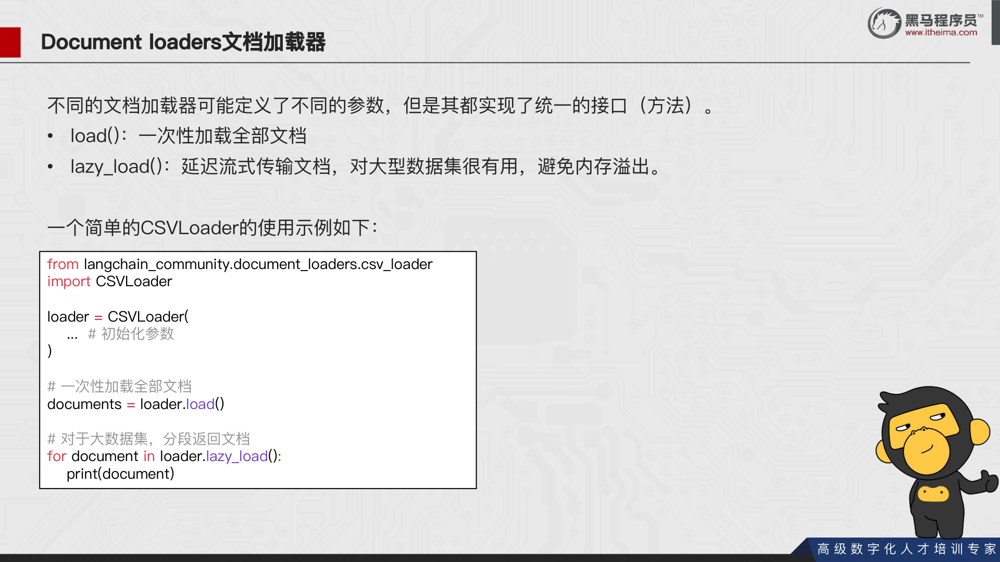

### CSVLoader 的基础用法

<!-- PDF 第 94 页 -->

LangChain内置了许多文档加载器，详细参见官方文档：
https://docs.langchain.com/oss/python/integrations/document\_loaders

我们简单的学习如下几个常⽤的文档加载器：

- CSVLoader

- JSONLoader

- PDFLoader

~~~~
from langchain_community.document_loaders.csv_loader import 
CSVLoader
loader = CSVLoader(file_path="./xxx.csv")
data = loader.load()
print(data)
~~~~

高 级 数 字 化 人 才 培 训 专 家

第 94 页原图

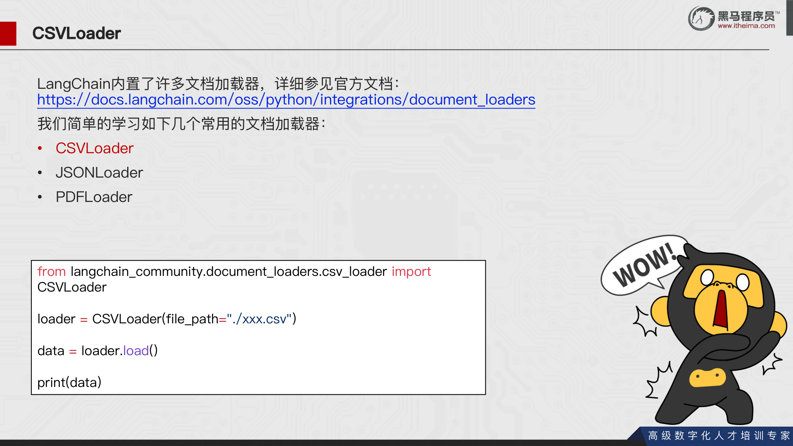

### 自定义 CSV 分隔符、引号与字段名

<!-- PDF 第 95 页 -->

自定义CSV文件的解析和加载

~~~~
loader = CSVLoader(
    file_path=“./xxx.csv”,
    csv_args={
        “delimiter”: ",",   # 指定分隔符
        “quotechar”: '"'     # 指定字符串的引号包裹
        # 字段列表（无表头使⽤，有表头勿⽤会读取首行做为数据）
        "fieldnames": ["name", "age", "gender"],
    },
)
data = loader.load()
print(data)
~~~~

高 级 数 字 化 人 才 培 训 专 家

第 95 页原图

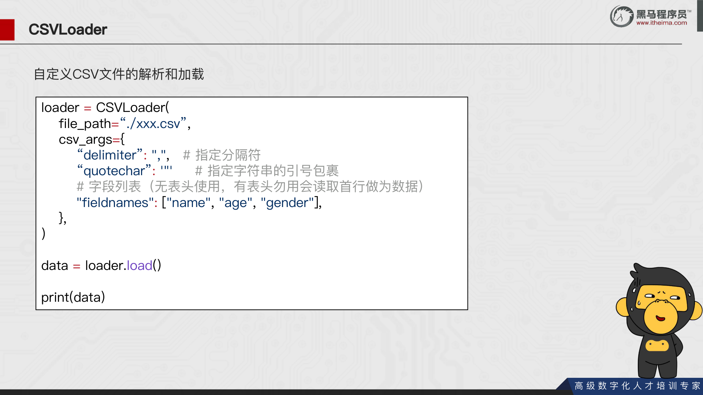

### Document Loaders：文档加载基础小结

<!-- PDF 第 96 页 -->

LangChain内置了许多种类的文档加载器

- 文档加载器均继承于BaseLoader类

- 返回Document类型的对象

- load方法一次性批量加载（返回list内含Document对象），如
    内容过多可能list太⼤，出现内存溢出问题

- lazy\_load方法会得到⽣成器对象，可⽤for循环依次获取单个
    Document对象，适⽤于⼤文档避免内存存不下。

CSVLoader⽤于加载CSV文件，加载成功得到的即Document对象。

高 级 数 字 化 人 才 培 训 专 家

第 96 页原图

## JSONLoader：JSON 文档加载

<!-- PDF 第 97 页 -->

Part : LangChain RAG开发

高 级 数 字 化 人 才 培 训 专 家

第 97 页原图

### jq Schema 的 JSON 信息抽取规则

<!-- PDF 第 98 页 -->

JSONLoader⽤于将JSON数据加载为Document类型对象。

使⽤JSONLoader需要额外安装： pip install jq

jq是一个跨平台的json解析工具，LangChain底层对JSON的解析就是基于jq工具实现的。

将JSON数据的信息抽取出来，封装为Document对象，抽取的时候依赖jq\_schema语法。

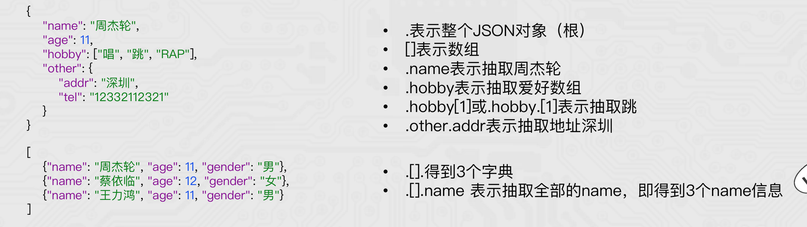

高 级 数 字 化 人 才 培 训 专 家

第 98 页原图

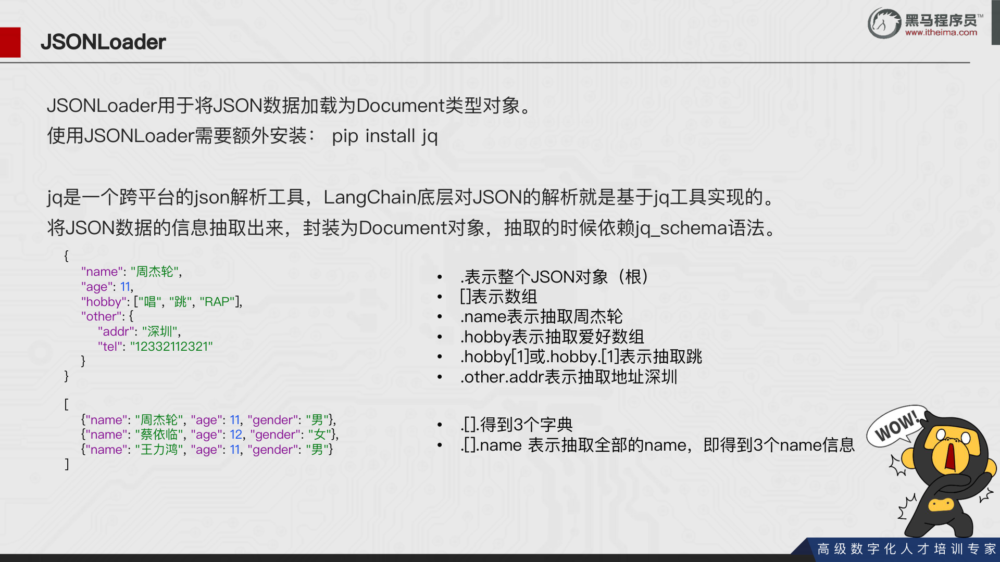

### 加载 JSON 文件与 JSON Lines

<!-- PDF 第 99 页 -->

了解jq的基本抽取规则后，即可使⽤JSONLoader加载JSON文件了。

~~~~
from langchain_community.document_loaders import JSONLoader
loader = JSONLoader(
    file_path="xxx.json",   # 文件路径
    jq_schema=".",          # jq schema语法
    text_content=False,     # 抽取的是否是字符串，默认True
    json_lines=True,        # 是否是JsonLines文件（每一行都是JSON的文件）
)
~~~~

如下是一个典型的JsonLines文件

{"name": "周杰轮", "age": 11, "gender": "男"}
{"name": "蔡依临", "age": 12, "gender": "女"}
{"name": "王力鸿", "age": 11, "gender": "男"}

高 级 数 字 化 人 才 培 训 专 家

第 99 页原图

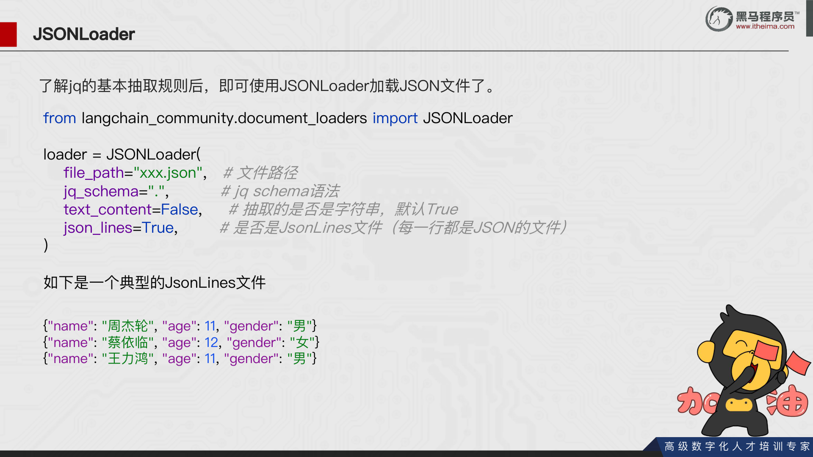

### JSONLoader：JSON 文档加载小结

<!-- PDF 第 100 页 -->

JSONLoader依赖jq库，通过pip install jq安装。

- JSONLoader使⽤jq的解析语法，常见如：
    - .表示根、\[\]表示数组
    - .name表示从根取name的值
    - .hobby\[1\]表示取hobby对应数组的第二个元素
    - .\[\]表示将数组内的每个字典（JSON对象）都取到
    - .\[\].name表示取数组内每个字典（JSON）对象的name对应的值

JSONLoader初始化有4个主要参数：

- file\_path：文件路径，必填

- jq\_schema：jq解析语法，必填

- text\_content：抽取到的是否是字符串，默认True，非必填

- json\_lines：是否是JsonLines文件，默认False，非必填
    - JsonLines文件：每一行都是一个独立的字典（Json对象）

高 级 数 字 化 人 才 培 训 专 家

第 100 页原图

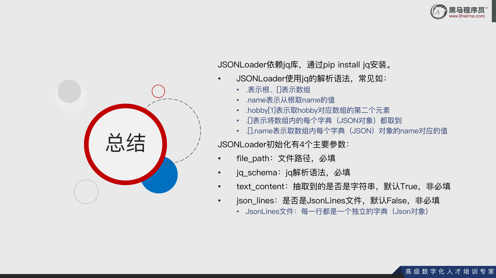

## PyPDFLoader：PDF 文档加载

<!-- PDF 第 101 页 -->

Part : LangChain RAG开发

高 级 数 字 化 人 才 培 训 专 家

第 101 页原图

### 配置 PDF 加载方式与密码

<!-- PDF 第 102 页 -->

LangChain内支持许多PDF的加载器，我们选择其中的PyPDFLoader使⽤。

PyPDFLoader加载器，依赖PyPDF库，所以，需要安装它：

~~~~
pip install pypdf
~~~~

PyPDFLoader使⽤还是比较简单的，如下代码即可快速加载PDF中的文字内容了：

~~~~
from langchain_community.document_loaders import PyPDFLoader
loader = PyPDFLoader(
    file_path="",   # 文件路径必填
    mode='page',    # 读取模式，可选page（按页面划分不同Document）和single（单个Document）
    password='password', # 文件密码
)
~~~~

高 级 数 字 化 人 才 培 训 专 家

第 102 页原图

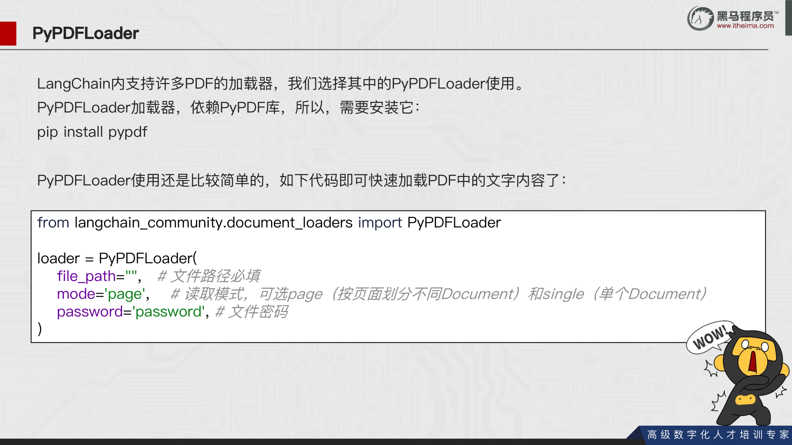

## TextLoader 与文档分割

<!-- PDF 第 103 页 -->

Part : LangChain RAG开发

高 级 数 字 化 人 才 培 训 专 家

第 103 页原图

### 文本文件加载与大文档问题

<!-- PDF 第 104 页 -->

除了前文学习的三个Loader以外，还有一个基本的加载器：TextLoader

作⽤：读取文本文件（如.txt），将全部内容放入一个Document对象中。

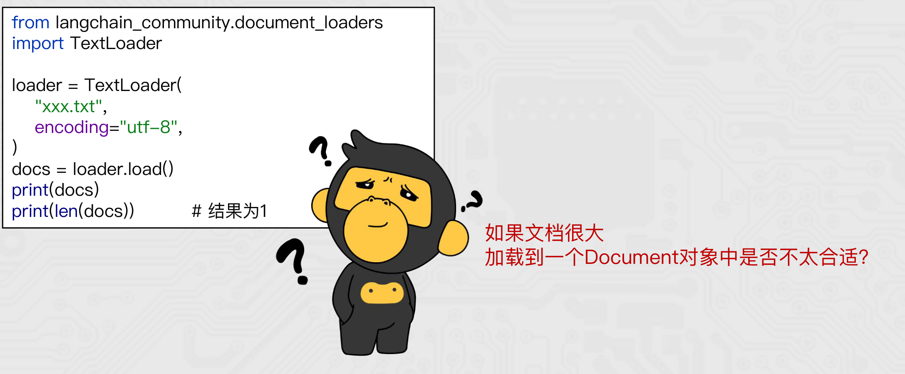

高 级 数 字 化 人 才 培 训 专 家

第 104 页原图

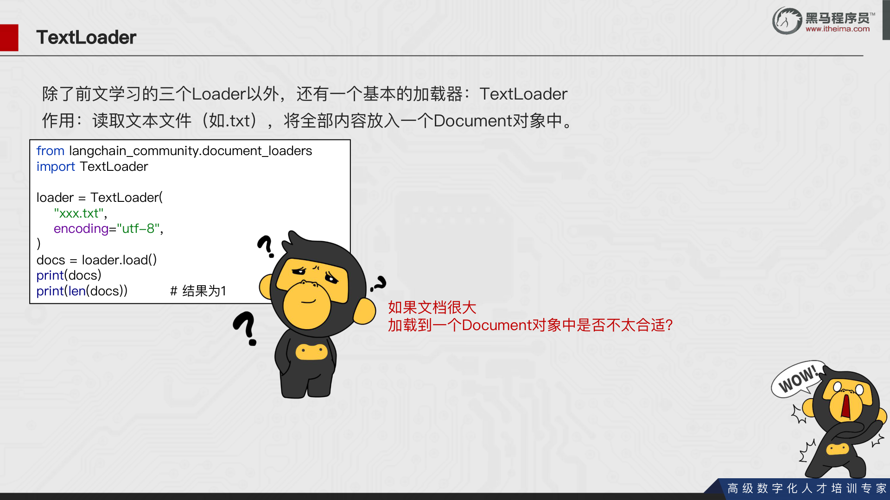

### 使用 RecursiveCharacterTextSplitter 切分文档

<!-- PDF 第 105 页 -->

RecursiveCharacterTextSplitter，递归字符文本分割器，主要⽤于按自然段落分割⼤文档。

是LangChain官方推荐的默认字符分割器。

它在保持上下文完整性和控制片段⼤小之间实现了良好平衡，开箱即⽤效果佳。

~~~~
from langchain_community.document_loaders import TextLoader
from langchain_text_splitters import RecursiveCharacterTextSplitter
loader = TextLoader(
    "../P3_LangChainRAG开发/data/Python基础语法.txt",
    encoding="utf-8",
)
docs = loader.load()
splitter = RecursiveCharacterTextSplitter(
    chunk_size=500,     # 分段的最⼤字符数
    chunk_overlap=50,   # 分段之间允许重叠的字符数
    # 文本分段依据
    separators=["\n\n", "\n", "。", "！", "？", ".", "!", "?", " ", ""],
    # 字符统计依据（函数）
    length_function=len,
)
split_docs = splitter.split_documents(docs)
~~~~

高 级 数 字 化 人 才 培 训 专 家

第 105 页原图

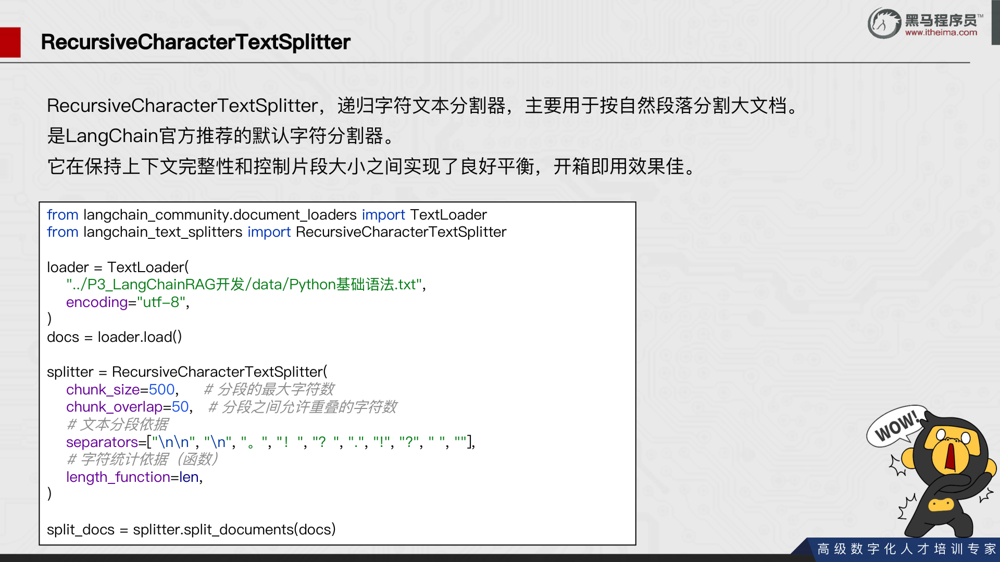

### TextLoader 与文档分割小结

<!-- PDF 第 106 页 -->

TextLoader是一个简单的加载器，可以加载文本文件内容，返回仅
有一个Document对象的list。

RecursiveCharacterTextSplitter递归字符文本分割器，是
LangChain官方推荐的默认分割器。

- 基于文本的自然段落分割⼤文档为小文档

- 可以指定小文档的最⼤字符数、重叠字符数

- 可以手动指定段落划分的依据（符号）以及字符数量统计函数

高 级 数 字 化 人 才 培 训 专 家

第 106 页原图

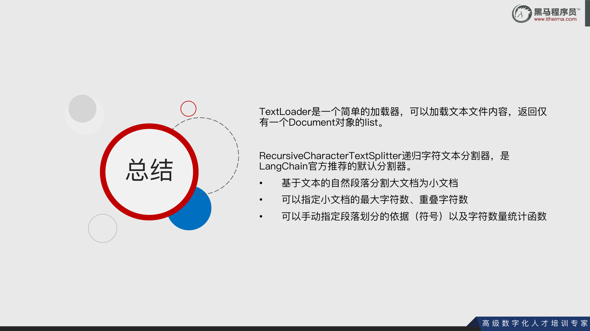

## Vector Stores：向量存储

<!-- PDF 第 107 页 -->

Part : LangChain RAG开发

高 级 数 字 化 人 才 培 训 专 家

第 107 页原图

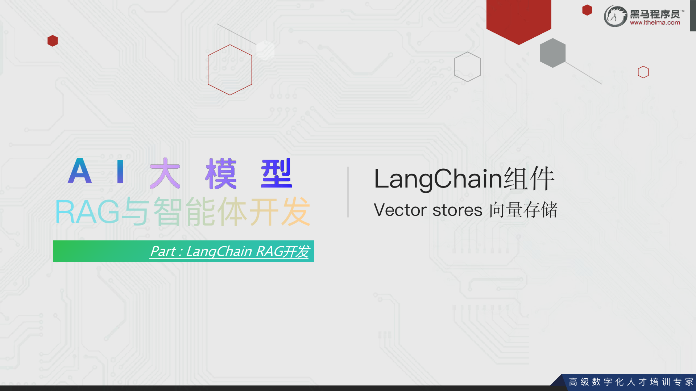

### 向量存储在 RAG 中的作用与统一接口

<!-- PDF 第 108 页 -->

基于LangChain的向量存储，存储嵌入数据，并执行相似性搜索。

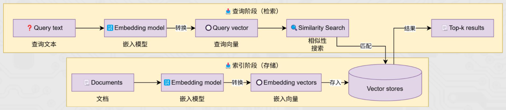

如图，这是一个典型的向量存储应⽤，也即是典型的RAG流程。

这部分开发主要涉及到：

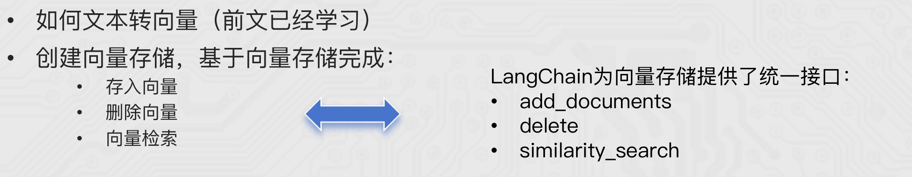

高 级 数 字 化 人 才 培 训 专 家

第 108 页原图

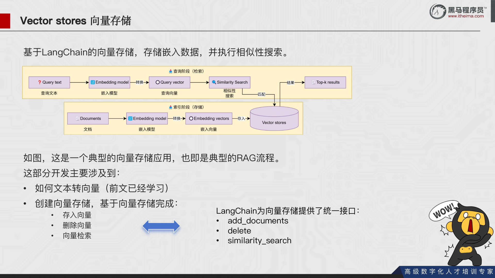

### InMemoryVectorStore 与 Chroma 的使用

<!-- PDF 第 109 页 -->

内置向量存储的使⽤

~~~~
from langchain_core.vectorstores import InMemoryVectorStore
from langchain_community.embeddings import DashScopeEmbeddings
vector_store = InMemoryVectorStore(embedding=DashScopeEmbeddings())
# 添加文档到向量存储，并指定id
vector_store.add_documents(documents=[doc1, doc2], ids=["id1", "id2"])
# 删除文档（通过指定的id删除）
vector_store.delete(ids=["id1"])
# 相似性搜索
similar_docs = vector_store.similarity_search("your query here", 4)
~~~~

外部（Chroma）向量存储的使⽤

~~~~
from langchain_community.embeddings import DashScopeEmbeddings
from langchain_chroma import Chroma
vector_store = Chroma(
    collection_name="example_collection",
    embedding_function=DashScopeEmbeddings(),
    persist_directory="./chroma_langchain_db",  # Where to save data locally, remove if not necessary
)
~~~~

高 级 数 字 化 人 才 培 训 专 家

第 109 页原图

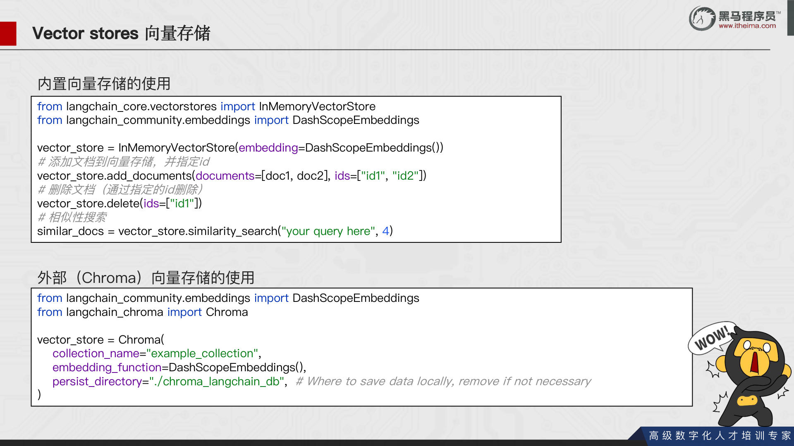

### Vector Stores：向量存储小结

<!-- PDF 第 110 页 -->

LangChain内提供向量存储功能，可以基于：

- InMemoryVectorStore，完成内存向量存储

- Chroma，外部数据库向量存储

向量存储类均提供3个通⽤API接口：

- add\_document，添加文档到向量存储

- delete，从向量存储中删除文档

- similarity\_search：相似度搜索

整体向量存储使⽤流程如下（RAG流程）：

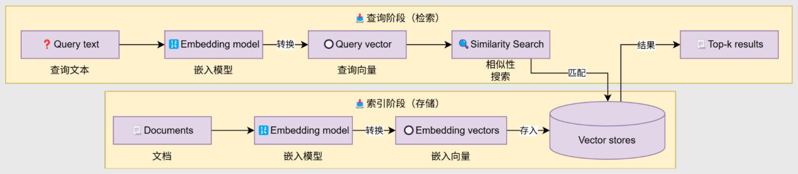

高 级 数 字 化 人 才 培 训 专 家

第 110 页原图

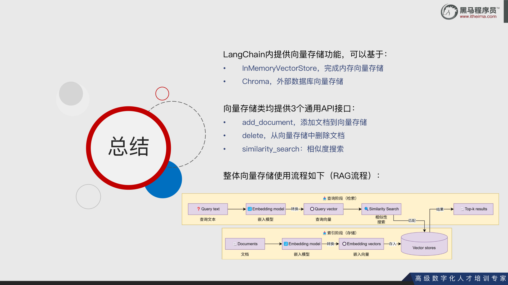

## 检索向量并构建提示词

<!-- PDF 第 111 页 -->

Part : LangChain RAG开发

高 级 数 字 化 人 才 培 训 专 家

第 111 页原图

### 检索匹配信息并组装问答上下文

<!-- PDF 第 112 页 -->

向量存储的实例，通过add\_texts(list\[str\])方法可以快速添加到向量
存储中。

流程：

1. 先通过向量存储检索匹配信息

2. 将⽤户提问和匹配信息一同封装到提示词模板中提问模型

高 级 数 字 化 人 才 培 训 专 家

第 112 页原图

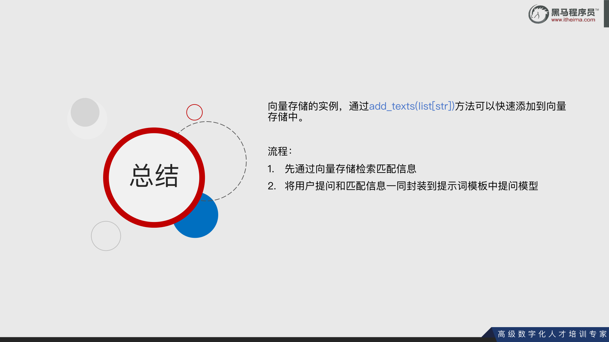

## RunnablePassthrough：向量检索入链

<!-- PDF 第 113 页 -->

Part : LangChain RAG开发

高 级 数 字 化 人 才 培 训 专 家

第 113 页原图

### 将向量检索与上下文传递加入链

<!-- PDF 第 114 页 -->

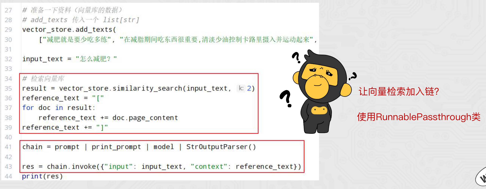

高 级 数 字 化 人 才 培 训 专 家

第 114 页原图

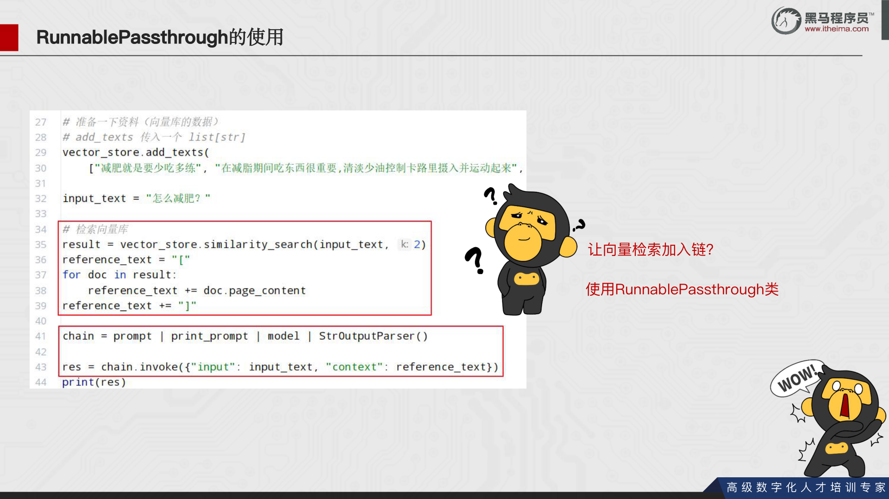

