# RAG核心一 挑选符合企业的90分大语言基石模型

<!-- PDF 第 1 页 -->
<a id="page-001"></a>

## 目录

- [本章简介](#page-002)
- [什么是大语言模型](#page-004)
  - [文本生成与概率预测](#topic-004)
  - [Token、词表与分词](#topic-006)
  - [BPE分词与GPT词表](#topic-008)
  - [Token的语义与粒度](#topic-010)
  - [Transformer与自注意力机制](#topic-011)
  - [GPT发展历程](#topic-014)
  - [预训练、指令微调与人类反馈](#topic-015)
  - [大语言模型的能力](#topic-017)
- [国内外大模型产品必知必会](#page-018)
  - [产品生态](#topic-018)
  - [开源模型](#topic-019)
  - [闭源模型](#topic-020)
- [没有GPU如何调用大模型？](#page-021)
  - [算力需求与计算特点](#topic-021)
  - [模型文件与推理流程](#topic-023)
  - [GPU本地调用](#topic-025)
  - [CPU调用：Ollama](#topic-026)
  - [厂商API调用](#topic-028)
- [火眼金星：如何分辨大模型的好坏](#page-030)
  - [模型规模与涌现能力](#topic-030)
  - [模型评测的步骤](#topic-032)
  - [常见模型评测机构](#topic-033)
- [RAG应用：挑选大模型的四大步骤](#page-037)
  - [RAG所需的模型能力](#topic-037)
  - [模型选型的四个步骤](#topic-038)
- [总结和展望](#page-039)
  - [大语言模型知识回顾](#topic-039)
  - [产品经理的能力要求](#topic-041)
  - [应用开发工程师的能力要求](#topic-042)
  - [推理部署工程师的能力要求](#topic-043)
  - [算法工程师的能力要求](#topic-044)

---

<!-- PDF 第 2 页 -->
<a id="page-002"></a>

## 本章简介

- 大语言模型是RAG系统的重要组成，如何为RAG应用挑选合适的大语言模型是开发RAG应用的关键

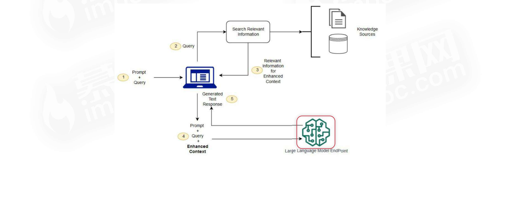

<!-- PDF 第 3 页 -->
<a id="page-003"></a>


- 了解大模型技术和发展
- 国内外大模型产品
- 大模型的三种调用方式
- 如何分辨大模型的好坏
- 挑选大模型的4个步骤
- 加餐：你需要多大程度了解大模型？


<!-- PDF 第 4 页 -->
<a id="page-004"></a>

## 什么是大语言模型

<a id="topic-004"></a>

### 文本生成与概率预测

- 大语言模型是文字接龙，一个字一个字的逐个生成

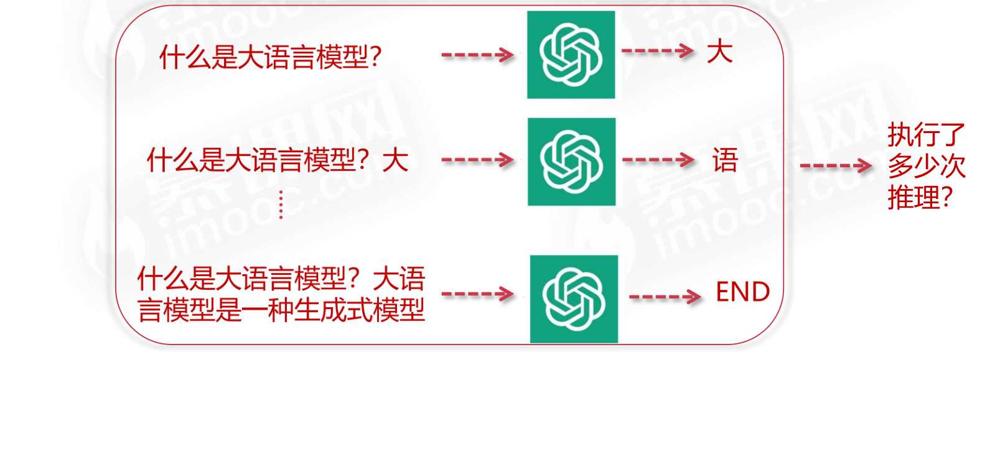

<!-- PDF 第 5 页 -->
<a id="page-005"></a>


- 大语言模型是概率模型，预测所有字出现的概率，根据概率高低选择要生成的字

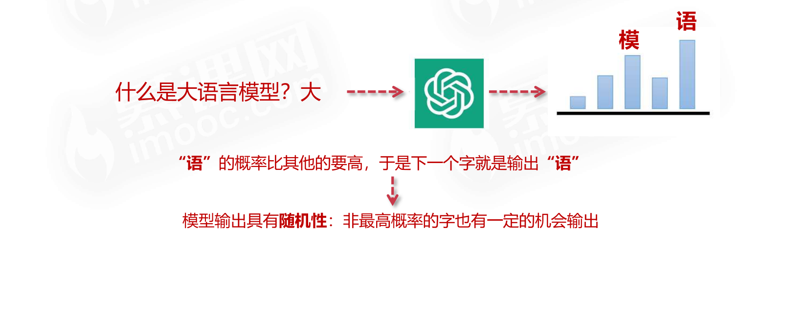

<!-- PDF 第 6 页 -->
<a id="page-006"></a>

<a id="topic-006"></a>

### Token、词表与分词

- 所有字到底有多少？大语言模型把要预测的每一个字称为token，现在大语言模型都是按照token来计费的；所有的token称为vocab词表

- GPT-3
  - 5万

- Qwen2
  - 15万

- LLaMA3.1
  - 12万

<!-- PDF 第 7 页 -->
<a id="page-007"></a>


- Token是如何生成的？生成token的方式称为分词（Tokenizer）

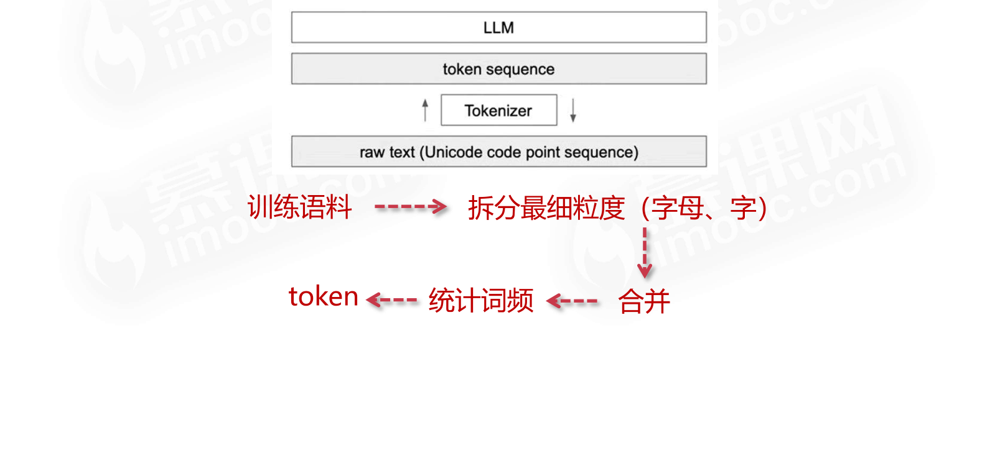

<!-- PDF 第 8 页 -->
<a id="page-008"></a>

<a id="topic-008"></a>

### BPE分词与GPT词表

- BPE Tokenizer分词法（从小到大合并）

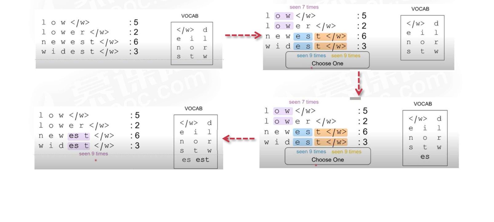

<!-- PDF 第 9 页 -->
<a id="page-009"></a>


- GPT1的词表

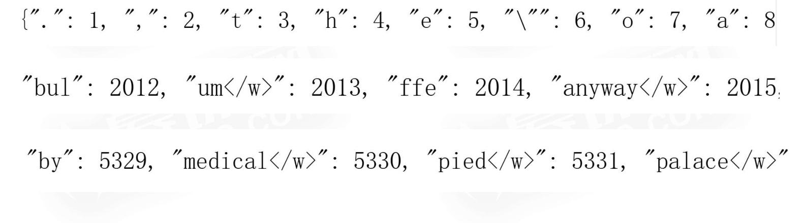

https://huggingface.co/openai-community/openai-gpt/raw/main/vocab.json

<!-- PDF 第 10 页 -->
<a id="page-010"></a>

<a id="topic-010"></a>

### Token的语义与粒度

- 重新认识token

语料中出现最频繁的部分

- token
  - 子词 un happy like ing a b c 笑 我们
- Token为什么不能是单词
  - 数量太大，语义重叠 like likes
- Token为什么不能是字符
  - 毫无语义 a b c

<!-- PDF 第 11 页 -->
<a id="page-011"></a>

<a id="topic-011"></a>

### Transformer与自注意力机制

- 大语言模型背后的技术架构：transformer

预测下一个token概率

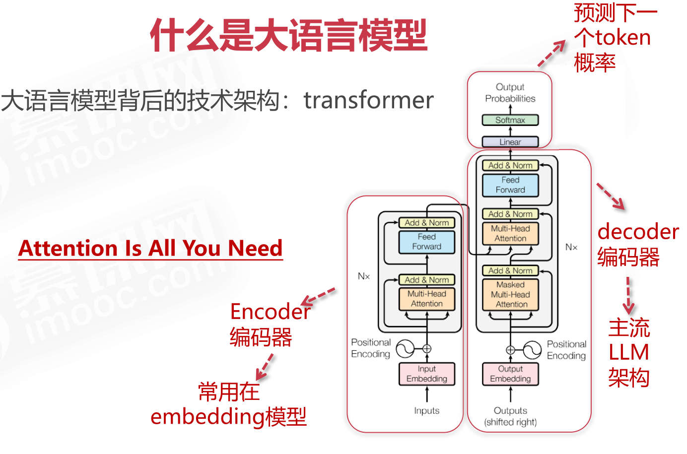

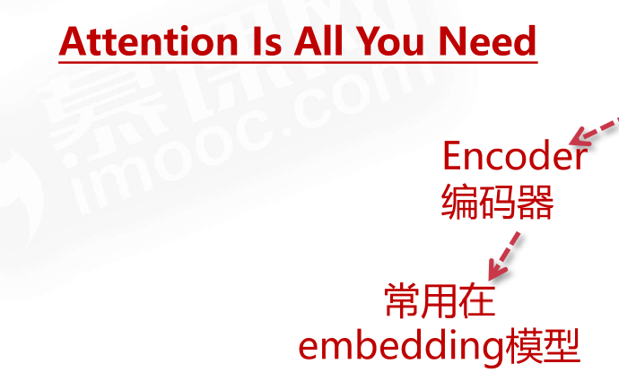

<!-- PDF 第 12 页 -->
<a id="page-012"></a>


- 理解transformer：self-Attention(multi-head-attention)

目的 → 理解词语的语义，生成好的语义特征

我要买一个苹果，我饿了

我要买一部苹果，现在的安卓系统太卡了

相同的词在不同的上下文语境中含义是不一样的

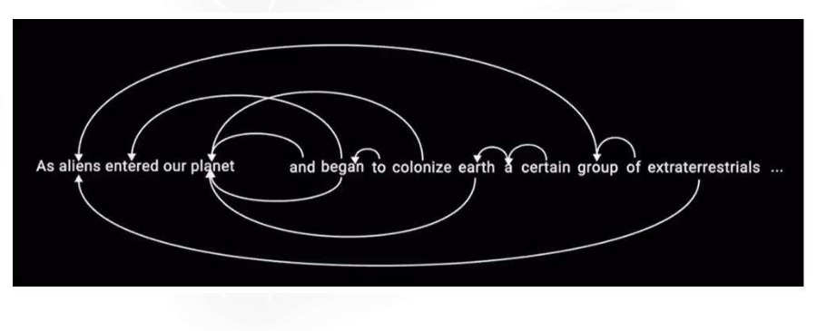

每个词和其所在上下文的每个词有一定的联系，这种联系可以很强相关，也可以是弱相关

<!-- PDF 第 13 页 -->
<a id="page-013"></a>


- 理解transformer: self-Attention（multi-head-attention）

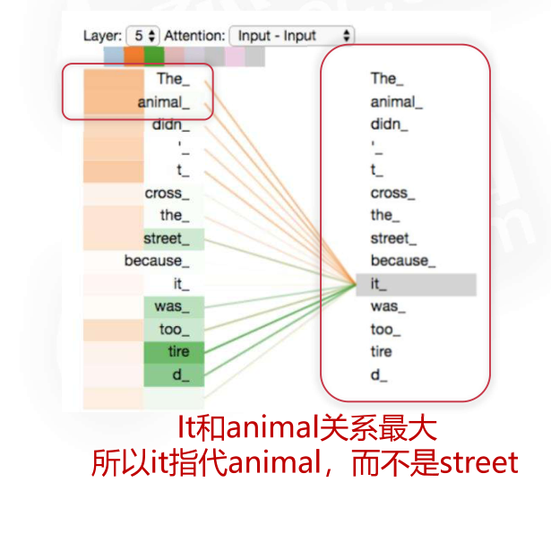

在transformer用self-attention自注意力机制来建立每个token和其他所有token之间的相关性

self-attention自注意力机制：能够很好的捕捉全局特征

<!-- PDF 第 14 页 -->
<a id="page-014"></a>

<a id="topic-014"></a>

### GPT发展历程

- 大语言模型发展史：GPT（Generative Pre-Training）为例

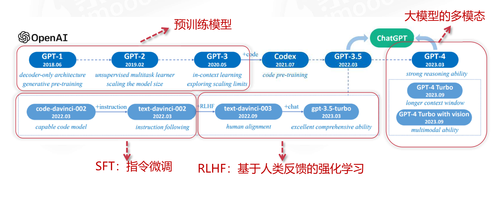

<!-- PDF 第 15 页 -->
<a id="page-015"></a>

<a id="topic-015"></a>

### 预训练、指令微调与人类反馈

- 大语言模型是如何训练的？

- 从小学到大学学习了很多通用的知识
  - 预训练阶段

毕业工作，面对具体业务问题，不知所措

- 岗位培训（增强特定能力）
  - SFT：指令微调

培训只会覆盖常见的工作项，真实业务复杂多变

- 分配一名导师，根据你的工作情况，给出指导反馈，做的好加强，做的不好的改正
  - RLHF：强化学习

<!-- PDF 第 16 页 -->
<a id="page-016"></a>


RW奖励模型：代表人类的意愿判别生成结果的好坏

- 大语言模型是如何训练的？

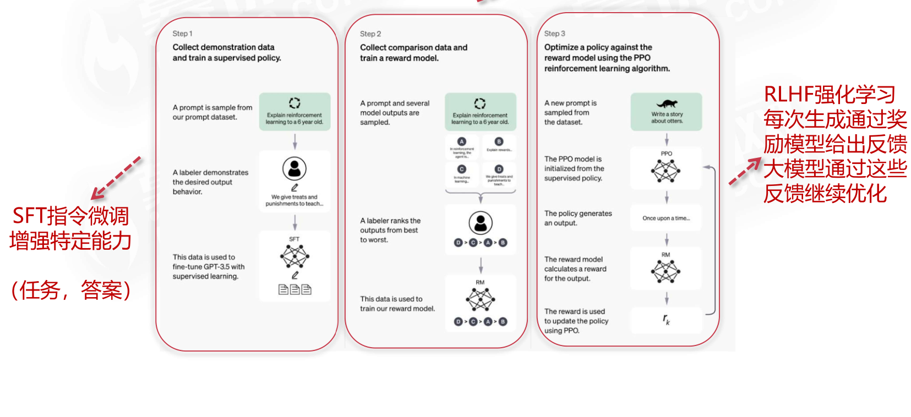

<!-- PDF 第 17 页 -->
<a id="page-017"></a>

<a id="topic-017"></a>

### 大语言模型的能力

- 大语言模型的能力

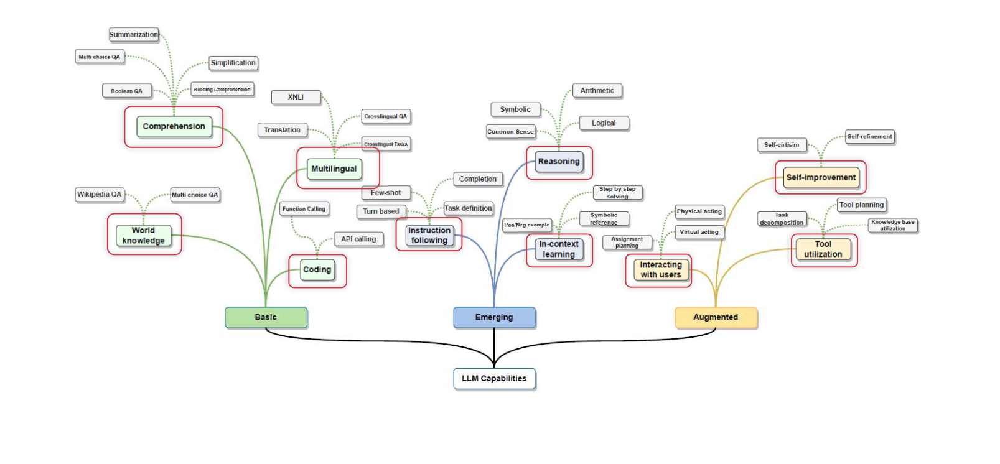

<!-- PDF 第 18 页 -->
<a id="page-018"></a>

## 国内外大模型产品必知必会

<a id="topic-018"></a>

### 产品生态

- 大模型产品生态

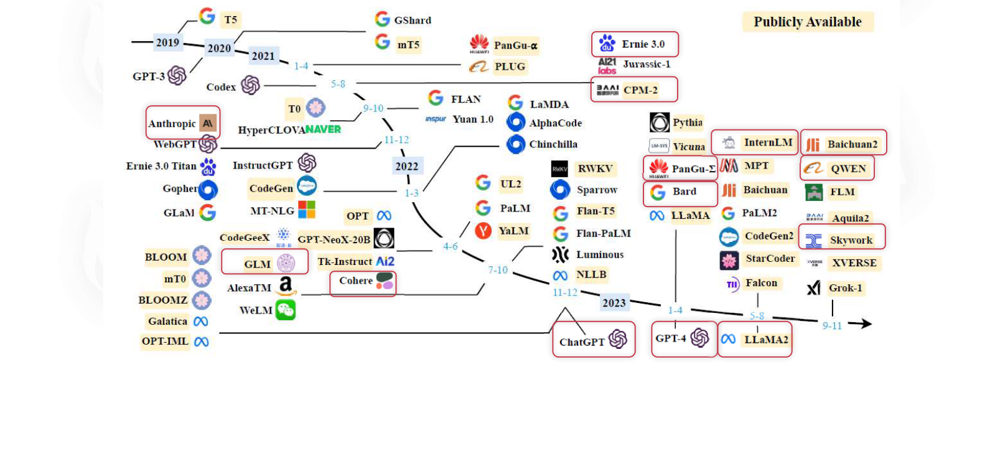

<!-- PDF 第 19 页 -->
<a id="page-019"></a>

<a id="topic-019"></a>

### 开源模型

- 国内外开源模型

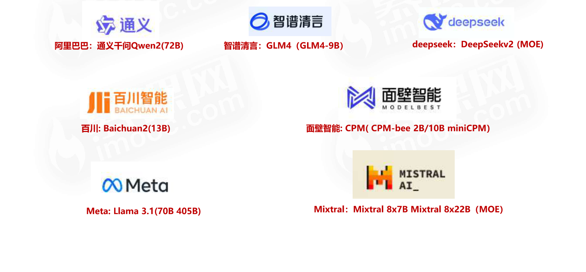

<!-- PDF 第 20 页 -->
<a id="page-020"></a>

<a id="topic-020"></a>

### 闭源模型

ANTHROPIC

Anthropic:Claude 3.5

- 国内外闭源模型

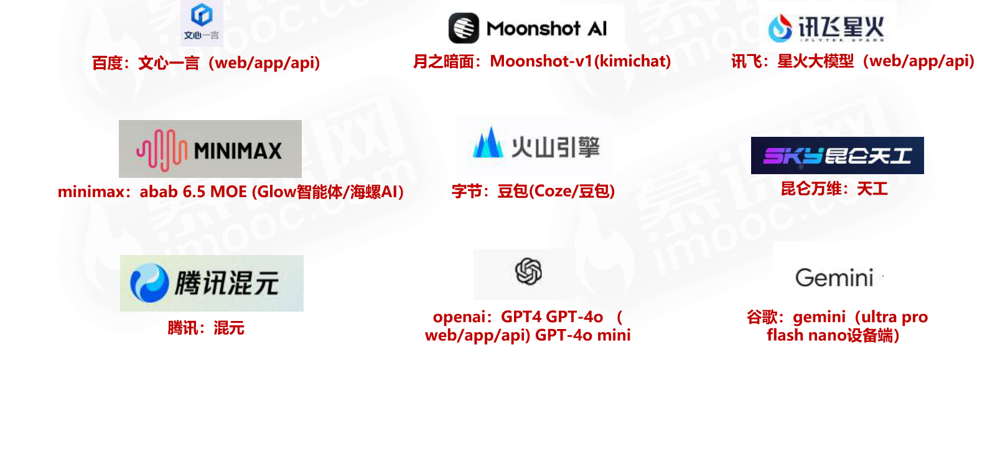

<!-- PDF 第 21 页 -->
<a id="page-021"></a>

## 没有GPU如何调用大模型？

<a id="topic-021"></a>

### 算力需求与计算特点

- AI三大马车：算力优先

- 算法
- 数据
- 算力

<!-- PDF 第 22 页 -->
<a id="page-022"></a>


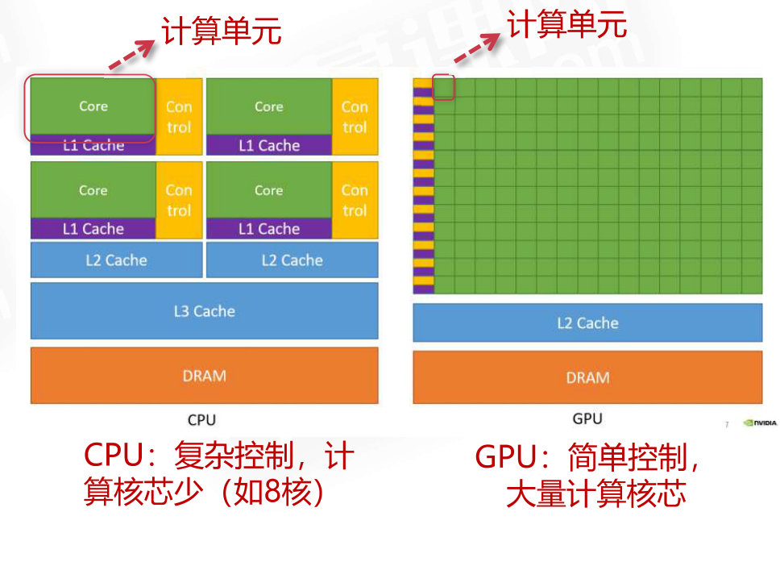

- 大模型计算特点

大模型：大量的简单计算

- 乘法和加法

- 矩阵计算（乘法和加法）

需要GPU并行计算

<!-- PDF 第 23 页 -->
<a id="page-023"></a>

<a id="topic-023"></a>

### 模型文件与推理流程

- 大模型文件

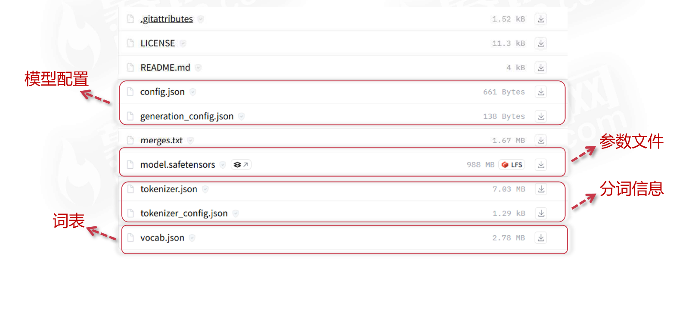

<!-- PDF 第 24 页 -->
<a id="page-024"></a>


- 大模型推理过程

加载分词算法 → 加载模型参数 → 推理生成答案

<!-- PDF 第 25 页 -->
<a id="page-025"></a>

<a id="topic-025"></a>

### GPU本地调用

- 通过GPU调用本地大模型

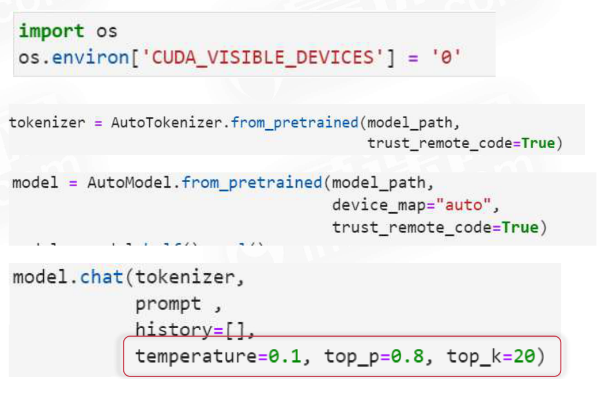

设置使用的GPU

加载分词器tokenizer

加载模型

推理

<!-- PDF 第 26 页 -->
<a id="page-026"></a>

<a id="topic-026"></a>

### CPU调用：Ollama

- 通过CPU调用大模型-ollama工具

- 背后框架：llama.cpp
- 支持linux windows macos
- 支持Qwen LLaMA
- 支持cpu gpu


Get up and running with large language models.

https://ollama.com/

https://ollama.com/library

<!-- PDF 第 27 页 -->
<a id="page-027"></a>


- 通过CPU调用大模型-ollama工具

安装

```sh
curl -fsSL https://ollama.com/install.sh | sh
```

使用

```sh
ollama run qwen2:1.5b
```

openai接口

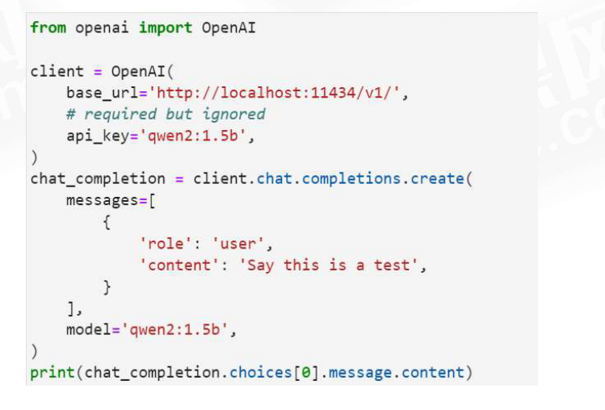

<!-- PDF 第 28 页 -->
<a id="page-028"></a>

<a id="topic-028"></a>

### 厂商API调用

- 通过AI厂商API调用大模型

注册 → AI产商用户注册 https://platform.deepseek.com/

创建应用和key

接口调用

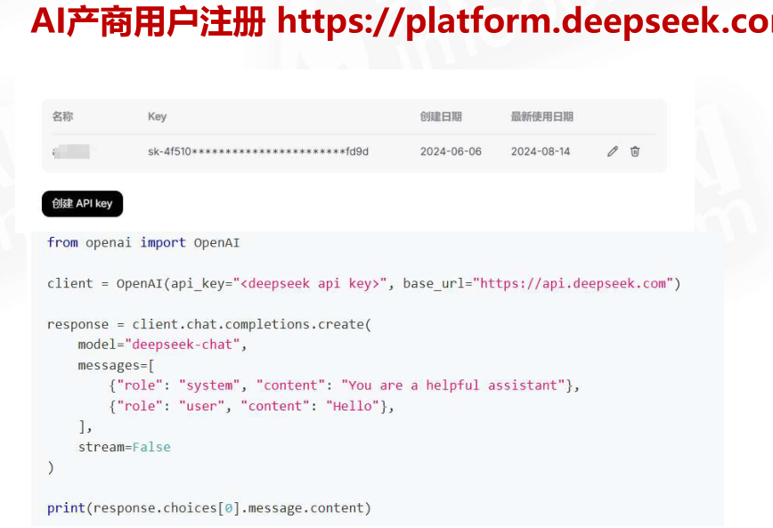

<!-- PDF 第 29 页 -->
<a id="page-029"></a>


- 通过AI厂商API调用大模型

API接口推荐

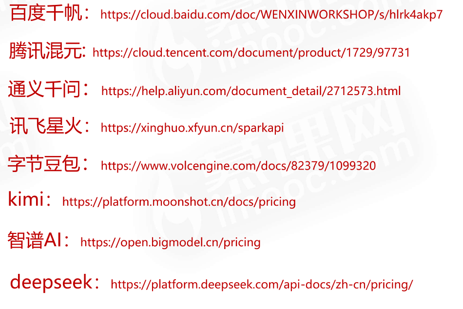

<!-- PDF 第 30 页 -->
<a id="page-030"></a>

## 火眼金星：如何分辨大模型的好坏

<a id="topic-030"></a>

### 模型规模与涌现能力

- 模型大小对模型能力的影响：涌现能力

- 什么是涌现？
  - 在较小的模型中不出现，而在较大的模型中出现的能力
- 涌现的2个表现
  1. 突破规模的临界点后，表现大幅度提升

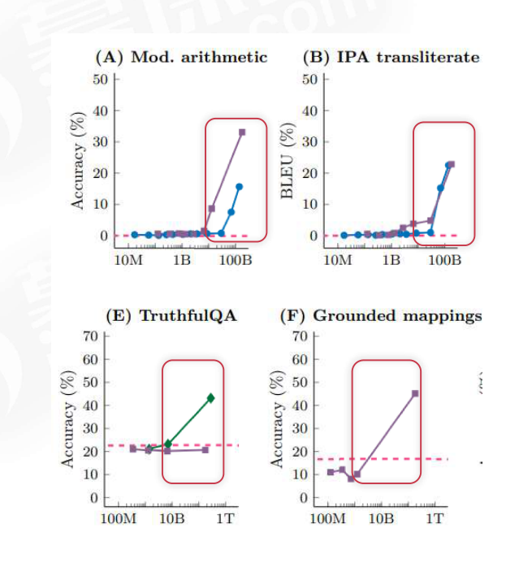

<!-- PDF 第 31 页 -->
<a id="page-031"></a>


- 模型大小对模型能力的影响：涌现能力

- 涌现的2个表现
  2. 某些prompt策略对小模型失效，而对大模型起作用

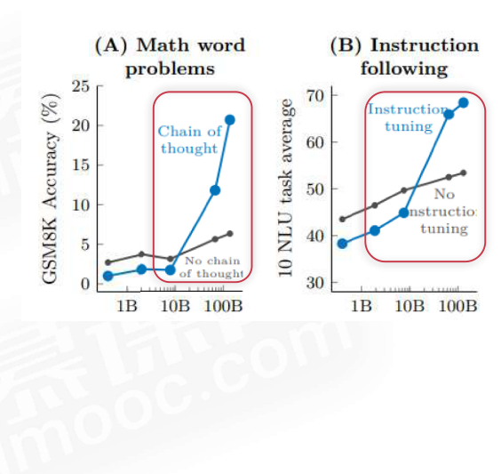

- 涌现的直观启发
  - 模型越大越好
  - 简单的任务10B以下模型够用，复杂任务需要100B模型

<!-- PDF 第 32 页 -->
<a id="page-032"></a>

<a id="topic-032"></a>

### 模型评测的步骤

- 辨别模型好坏的关键：模型评测

- 评测步骤
  1. 维度：评测哪些能力
  2. 数据：在什么数据上评测
  3. 指标：如何判断评测结果好坏

<!-- PDF 第 33 页 -->
<a id="page-033"></a>

<a id="topic-033"></a>

### 常见模型评测机构

- 辨别模型好坏的关键：常见评测机构

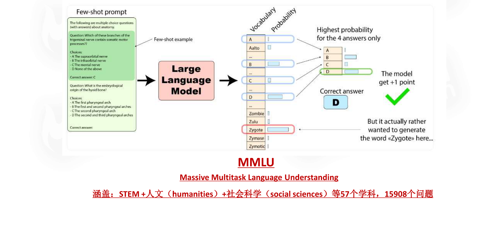

<!-- PDF 第 34 页 -->
<a id="page-034"></a>


- 辨别模型好坏的关键：常见评测机构

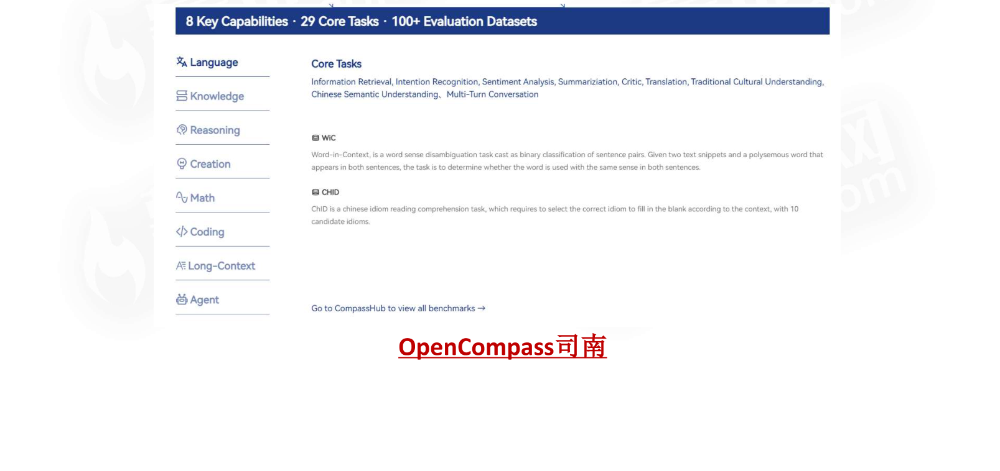

<!-- PDF 第 35 页 -->
<a id="page-035"></a>


- 辨别模型好坏的关键：常见评测机构

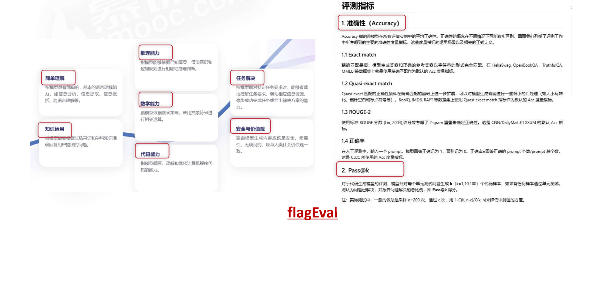

<!-- PDF 第 36 页 -->
<a id="page-036"></a>


- 辨别模型好坏的关键：常见评测机构

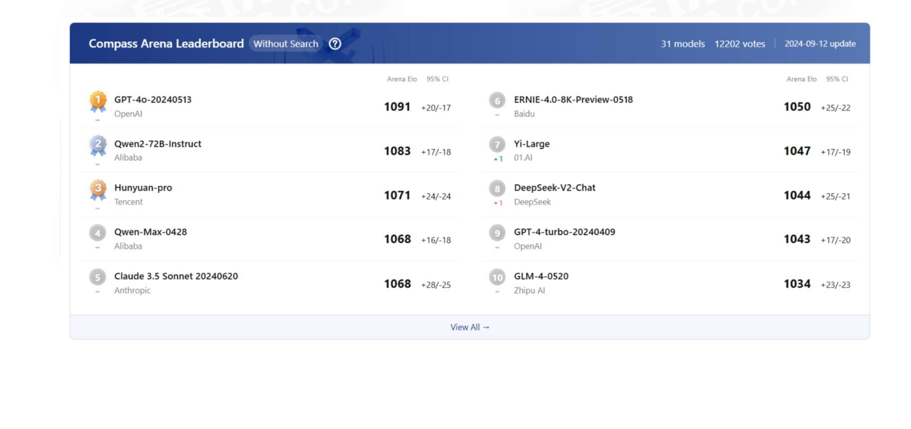

<!-- PDF 第 37 页 -->
<a id="page-037"></a>

## RAG应用：挑选大模型的四大步骤

<a id="topic-037"></a>

### RAG所需的模型能力

- 在RAG应用中需要大模型的能力

- 信息抽取能力
  - 大模型需要从RAG检索出来的上下文中，抽取出和问题最有价值的信息
  - 

- 上下文的阅读理解能力
  - 大模型需要从RAG检索出来的上下文和问题进行语义理解，生成合适的答案

- 工具调用和function call能力
  - RAG应用中可能会调用外部工具和接口

<!-- PDF 第 38 页 -->
<a id="page-038"></a>

<a id="topic-038"></a>

### 模型选型的四个步骤

- 在RAG应用挑选大模型的四大步骤

- 模型大小选择
  - 优先选择最大的模型进行测试是否可行，验证业务可行性
  - 可行的情况下，收集数据可迁移到小模型

- 模型能力测试
  - 构建业务的测试集，测试信息抽取能力、阅读理解能力和工具调用，function call能力

- 成本和设备
  - 大模型的使用是有一定的成本，api调用成本和设备

- 企业数据安全
  - 调用本地模型和外部api，要评估数据的安全

<!-- PDF 第 39 页 -->
<a id="page-039"></a>

## 总结和展望

<a id="topic-039"></a>

### 大语言模型知识回顾

- 总结

- 什么是大语言模型
  - 文字接龙：接龙的每个对象token
  - 关键技术：transformer，自注意力原理
  - 训练步骤：预训练+指令微调+基于人类反馈的强化学习

- 如何使用大语言模型
  - GPU: transformers
  - CPU: ollama
  - API：直接访问产商http服务

<!-- PDF 第 40 页 -->
<a id="page-040"></a>


- 总结

- 如何评价大语言模型
  - 涌现能力：模型越大越好
  - 模型评测：评测能力＋评测数据＋评测指标

- 如何挑选大语言模型
  - 模型大小选择
  - 模型能力测试
  - 成本和设备
  - 数据安全

<!-- PDF 第 41 页 -->
<a id="page-041"></a>

<a id="topic-041"></a>

### 产品经理的能力要求

- 展望：项目角色和大模型的关系

产品经理

职责：做什么（功能，交互设计），为什么做（用户痛点需求，市场前景，成本收益）

大模型能力要求

- 大模型基础知识了解：什么是大模型 / 基本概念如训练 微调 学习等 → 方便和工程师沟通
- 大模型能力的边界了解：有哪些能力 / 可以做什么 / 有什么缺点 → 方便结合公司业务找到切入点
- 大模型基本使用（prompt）：更体会大模型的能力和测试
- 业务数据从哪里来？：评估功能是否有数据来支持实现以及最终验收评估

<!-- PDF 第 42 页 -->
<a id="page-042"></a>

<a id="topic-042"></a>

### 应用开发工程师的能力要求

- 展望：项目角色和大模型的关系

大模型应用开发工程师

职责：怎么做（如何实现）

大模型能力要求

- 大模型基础知识：大模型技术架构（transfromer,embedding）/ 哪些可用的大模型
- 如何调用大模型：gpu知识 / 复杂prompt技术 / python / pytorch / transformers
- 大模型能力评估：是否需要进行微调
- 大模型应用开发中间件：langchain / llamaindex / rag / agent / embedding / 向量数据库等
- 大模型技术选型：根据业务选择什么大模型 / 中间件选型）
- 大模型AI应用开发流程：开发 / 迭代 / 评估
- 功能容错能力分析：是否允许出现错误 / 如何后处理

<!-- PDF 第 43 页 -->
<a id="page-043"></a>

<a id="topic-043"></a>

### 推理部署工程师的能力要求

- 展望：项目角色和大模型的关系

大模型推理部署工程师

职责：大模型部署 稳定/高效

大模型能力要求

- 推理框架：VLLM、Tensorrt-LLM、DeepSpeed 和Text Generation Inference

- 掌握推理优化技术：模型压缩/量化技术、解码方法、底层优化与分布式并行推理

- GPU优化知识：cuda / 并行计算优化/ 访存优化/低比特计算

- 主流大模型架构：包含哪些算子/各部分耗时分析和优化

- 模型推理性能测试：并发性能，资源利用率，吞吐

<!-- PDF 第 44 页 -->
<a id="page-044"></a>

<a id="topic-044"></a>

### 算法工程师的能力要求

- 展望：项目角色和大模型的关系

大模型算法工程师

职责：训练和微调自研的本地垂类大模型

大模型能力要求

- 推理熟悉大模型的训练和微调全过程：数据准备，清理，预训练、指令微调、强化学习，分布式训练，训练策略，模型评测
- 参数高效模型训练技术：LoRA / Prompt Tuning / Prefix Tuning / P-Tuning
- 大模型训练框架：Pytorch、Tensorflow、Megatron、Deepspeed
- 负责跟踪、探索业界前沿的大模型训练及优化方案
- 大模型评测
