# 03RAG项目

## 目录

- [项目简介](#page-001)
  - [RAG 的离线处理与在线问答](#page-002)
  - [服装知识问答的需求与总体架构](#page-003)
  - [项目文件清单与模块职责](#page-004)
  - [服装商品智能客服界面](#page-005)
  - [项目双线处理架构回顾](#page-006)
  - [项目核心模块分工回顾](#page-007)
  - [离线知识库更新的模块调用流程](#page-008)
  - [在线问答的向量检索与生成流程](#page-009)
  - [在线服务的类结构与调用关系](#page-010)

## 项目简介

<!-- PDF 第 1 页 -->

Part : RAG实战项目

高 级 数 字 化 人 才 培 训 专 家

第 1 页原图

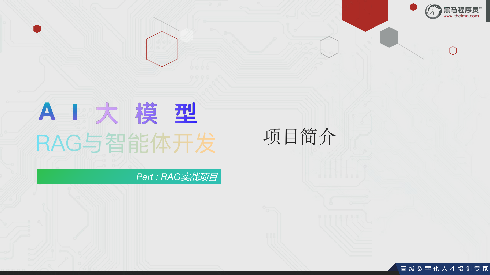

### RAG 的离线处理与在线问答

<!-- PDF 第 2 页 -->

RAG即检索、增强和生成，其主要分为2条线：

- 离线处理：向私有知识库（向量存储）源源不断添加私有知识文档。

    - 向知识库添加来自未来的知识文档（基于模型训练完成时间）
    - 向模型添加私有知识文档
    - 给出模型参考资料，规避模型幻觉（一本正经的胡说八道）

- 在线处理：用户提问会先基于私有知识库做检索，获取参考资料，同步组装新提示词询问大模型获取结果。

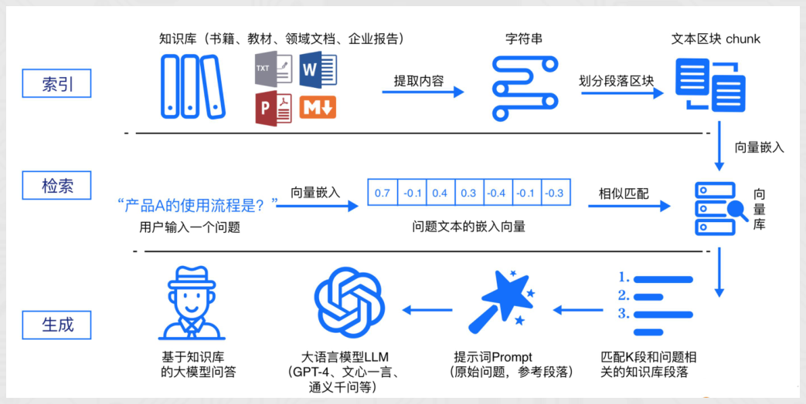

高 级 数 字 化 人 才 培 训 专 家

第 2 页原图

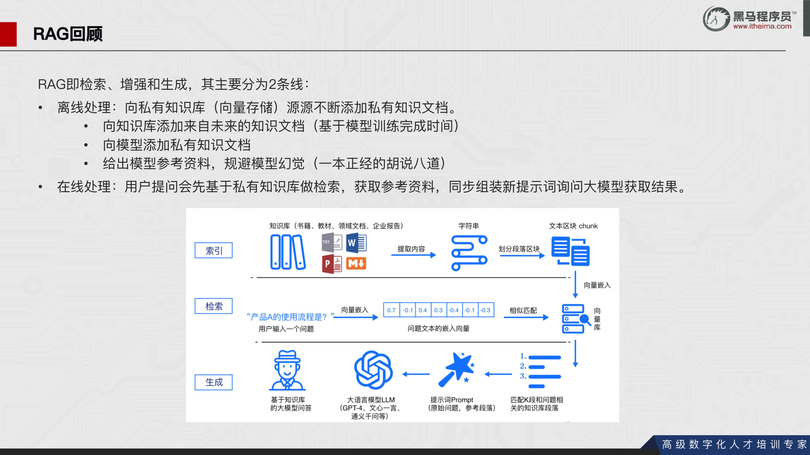

### 服装知识问答的需求与总体架构

<!-- PDF 第 3 页 -->

本次项目以"某东商品衣服"为例，以衣服属性构建本地知识。使用者可以自由更新本地知识，用户问题的答案也是基于本地
知识生成的。

高 级 数 字 化 人 才 培 训 专 家

第 3 页原图

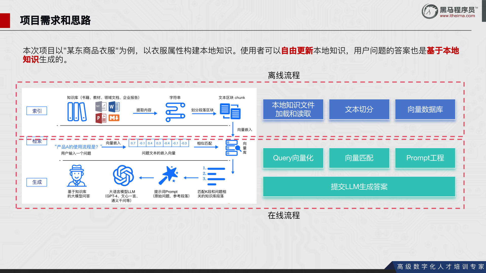

### 项目文件清单与模块职责

<!-- PDF 第 4 页 -->

项目主要会实现如下代码：

高 级 数 字 化 人 才 培 训 专 家

第 4 页原图

### 服装商品智能客服界面

<!-- PDF 第 5 页 -->

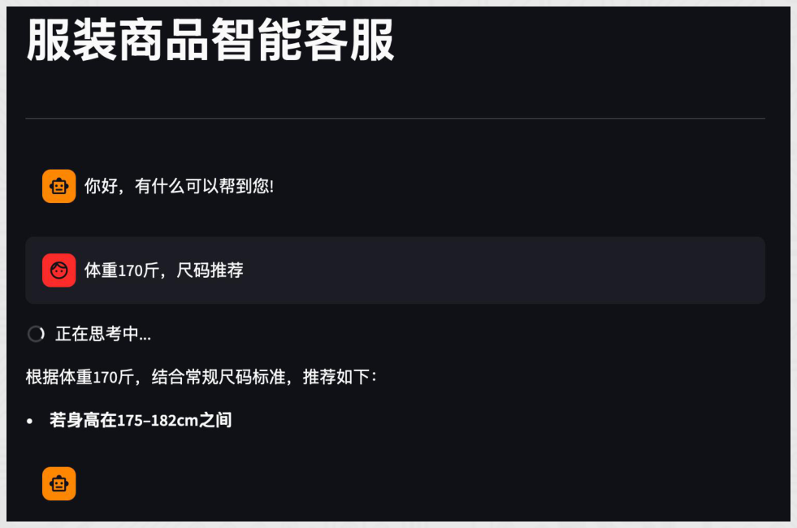

高 级 数 字 化 人 才 培 训 专 家

第 5 页原图

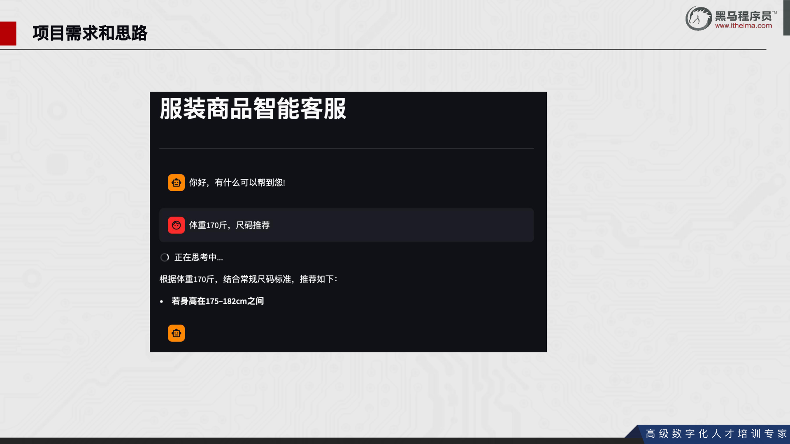

### 项目双线处理架构回顾

<!-- PDF 第 6 页 -->

本次项目以"某东商品衣服"为例，以衣服属性构建本地知识。使用者可以自由更新本地知识，用户问题的答案也是基于本地
知识生成的。

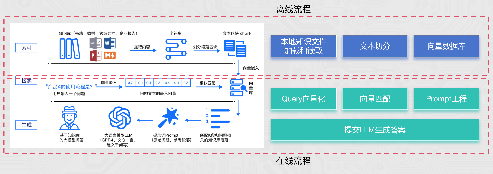

高 级 数 字 化 人 才 培 训 专 家

第 6 页原图

### 项目核心模块分工回顾

<!-- PDF 第 7 页 -->

项目主要会实现如下代码：

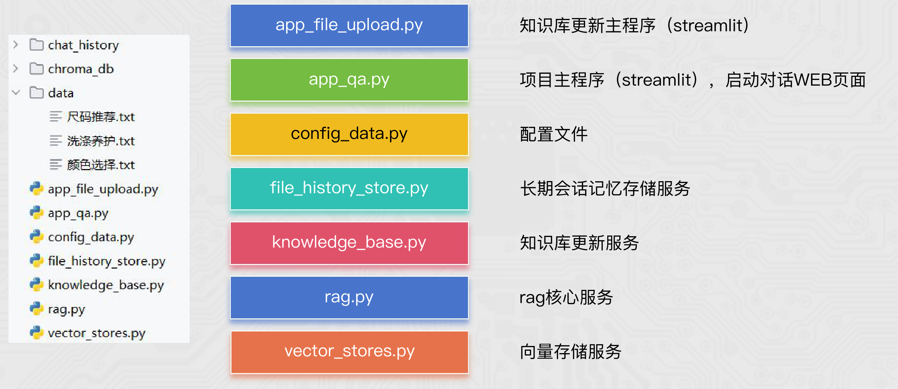

高 级 数 字 化 人 才 培 训 专 家

第 7 页原图

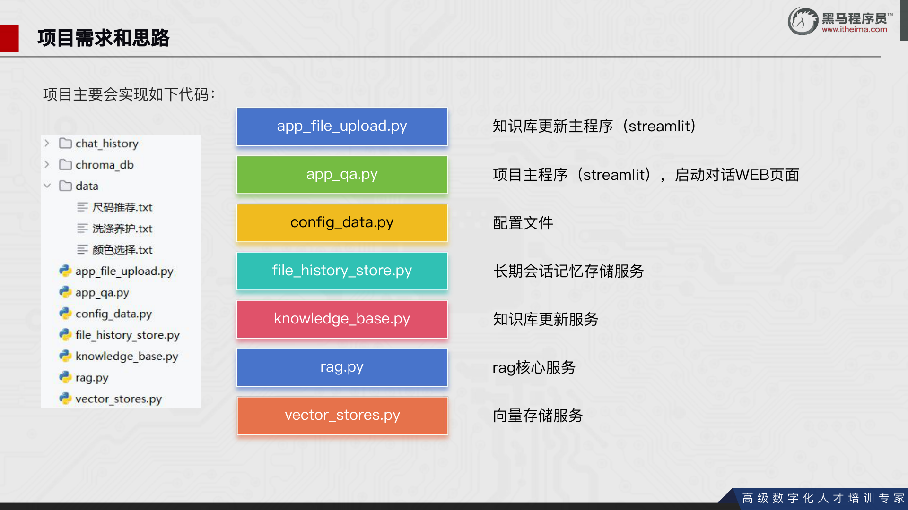

### 离线知识库更新的模块调用流程

<!-- PDF 第 8 页 -->

离线流程：

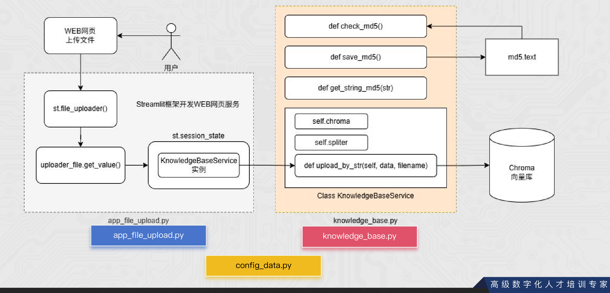

高 级 数 字 化 人 才 培 训 专 家

第 8 页原图

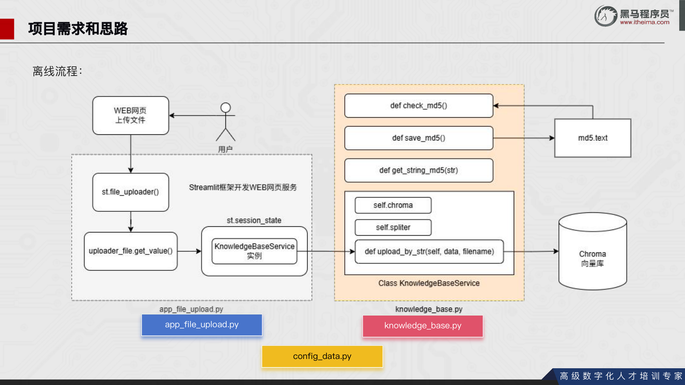

### 在线问答的向量检索与生成流程

<!-- PDF 第 9 页 -->

本次项目以"某东商品衣服"为例，以衣服属性构建本地知识。使用者可以自由更新本地知识，用户问题的答案也是基于本地
知识生成的。

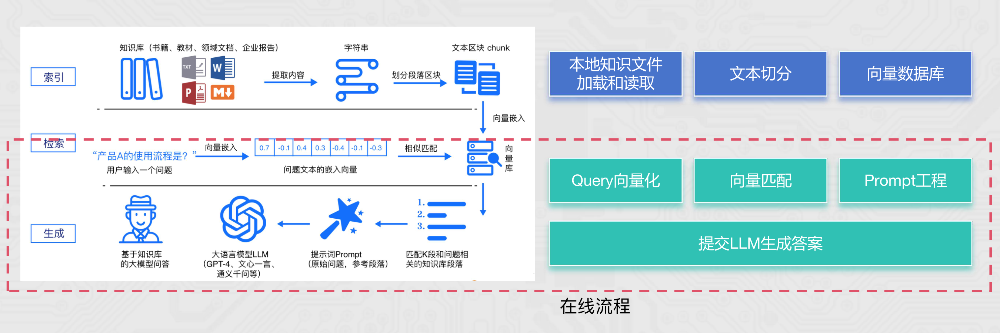

高 级 数 字 化 人 才 培 训 专 家

第 9 页原图

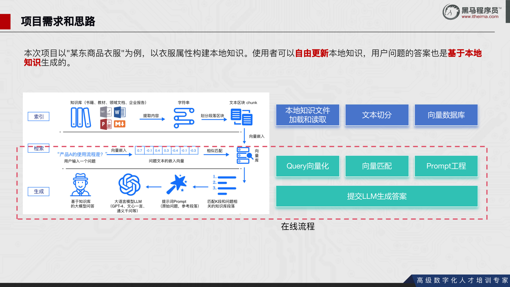

### 在线服务的类结构与调用关系

<!-- PDF 第 10 页 -->

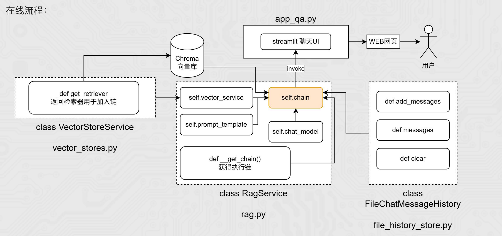

高 级 数 字 化 人 才 培 训 专 家

第 10 页原图

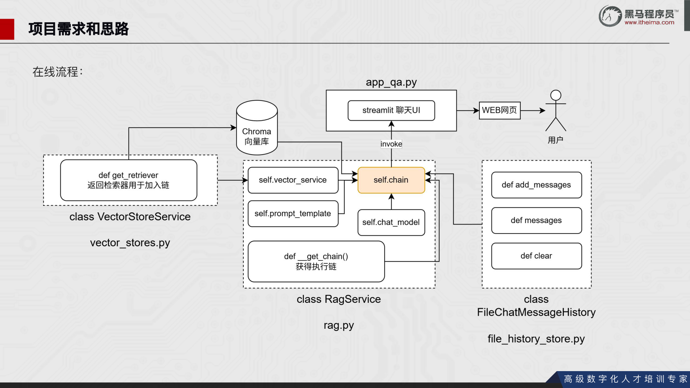

