# RAG核心二 挑选合适RAG的向量Embedding模型

<!-- PDF 第 1 页 -->

## 目录

- [本章简介](#page-002)
- [embedding模型的重要性](#page-004)
  - [向量表示与语义相似性](#topic-004)
  - [Embedding在RAG中的作用](#topic-006)
- [embedding是如何炼成的？](#page-007)
  - [BERT模型架构](#topic-007)
  - [完形填空训练](#topic-008)
  - [下一句预测训练](#topic-009)
- [主流中文embedding模型](#page-010)
  - [MTEB评测榜单](#topic-010)
  - [阿里GTE系列](#topic-011)
  - [BAAI BGE系列](#topic-013)
- [如何挑选embedding模型](#page-015)
  - [基准榜单与初步筛选](#topic-015)
  - [选型关注维度](#topic-016)
  - [模型筛选方法](#topic-017)
- [总结](#page-018)

---

<!-- PDF 第 2 页 -->

## 本章简介

- embedding模型是RAG系统的重要组成，如何为RAG应用挑选合适的embedding模型也是开发RAG应用的关键

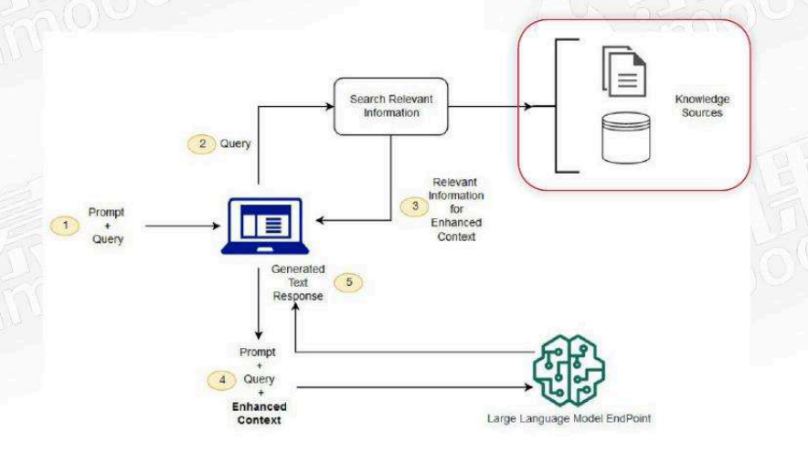

<!-- PDF 第 3 页 -->

- 了解embedding模型的重要性
- embedding是如何炼成的
- 了解主流中文embedding模型
- 如何挑选embedding模型
- 实战

<!-- PDF 第 4 页 -->

## embedding模型的重要性

### 向量表示与语义相似性

- 什么是embedding

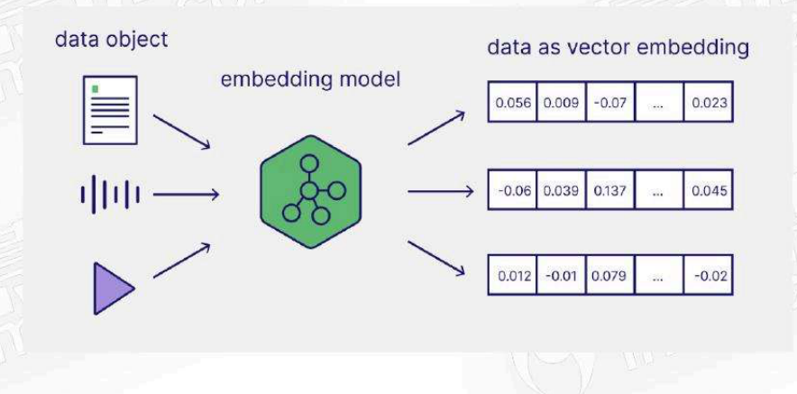

embedding是将数据对象（如文本）映射到固定大小的连续一维数字数组（向量空间）的技术。向量空间通常具有几百到几千的维度，每个维度代表某个语义特征或属性

<!-- PDF 第 5 页 -->

- 什么是embedding

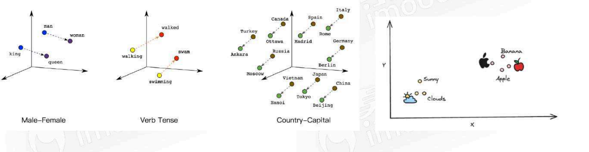

在embedding向量空间中，语义相似的实体在向量空间中映射得更近，而不相似的实体映射得更远，这也是向量模型需要学习的目标

<!-- PDF 第 6 页 -->

### Embedding在RAG中的作用

- embedding在RAG中的作用

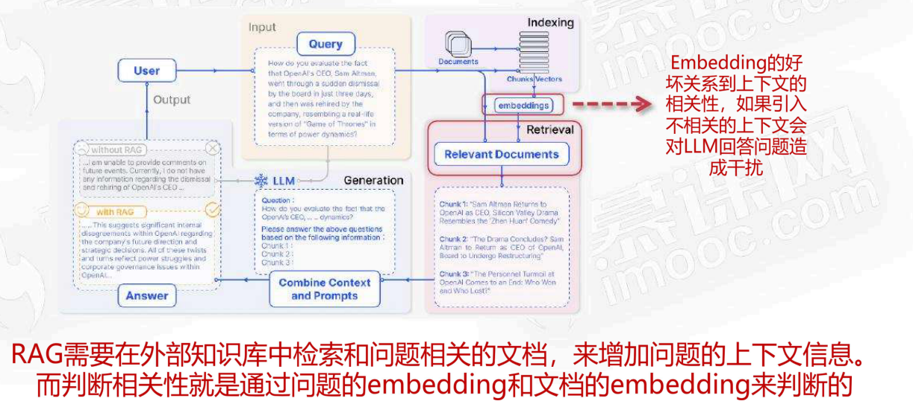

<!-- PDF 第 7 页 -->

## embedding是如何炼成的？

### BERT模型架构

- embedding背后的模型：BERT

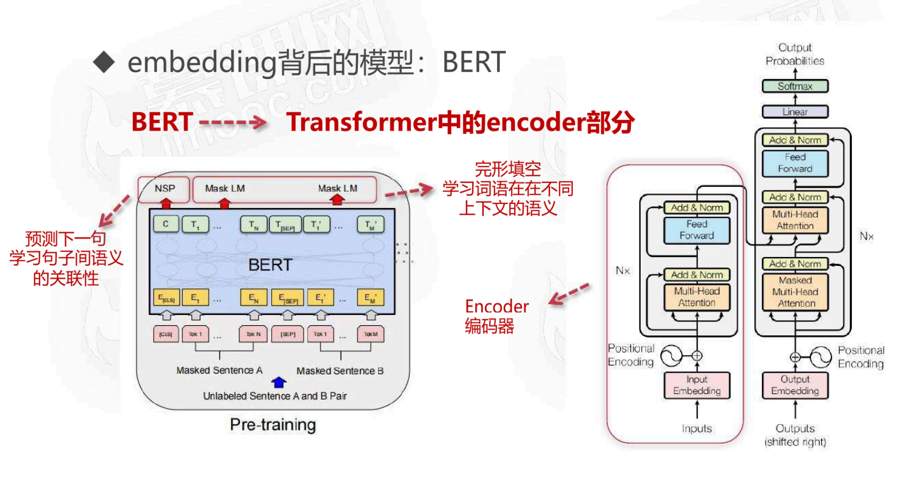

<!-- PDF 第 8 页 -->

### 完形填空训练

- embedding背后的模型：BERT（完形填空）

- 训练文本：机器学习
- 模型输入：[CLS] 机 [MASK] 学习
- 模型预测：器的概率

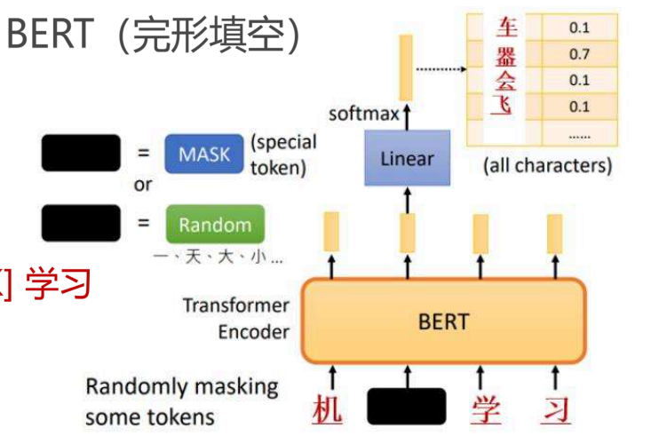

完形填空

学习词语在不同上下文的语义

<!-- PDF 第 9 页 -->

### 下一句预测训练

- embedding背后的模型：BERT（预测下一句）

- 训练文本
  - 今天天气如何？很好
  - 今天天气如何？那辆车不错
- 模型输入：[CLS] 今天天气如何？[SEP] 很好
- 模型预测：YES
- 模型输入：[CLS] 今天天气如何？[SEP] 那辆车不错
- 模型预测：NO

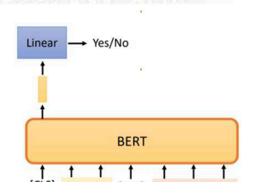

预测下一句

学习句子间语义的关联性

<!-- PDF 第 10 页 -->

## 主流中文embedding模型

### MTEB评测榜单

- MTEB榜单 （Massive Text Embedding Benchmark）

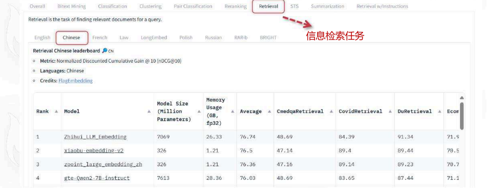

MTEB提供不同embedding任务的多种基准评测数据集

<!-- PDF 第 11 页 -->

### 阿里GTE系列

- BERT架构-阿里的GTE系列

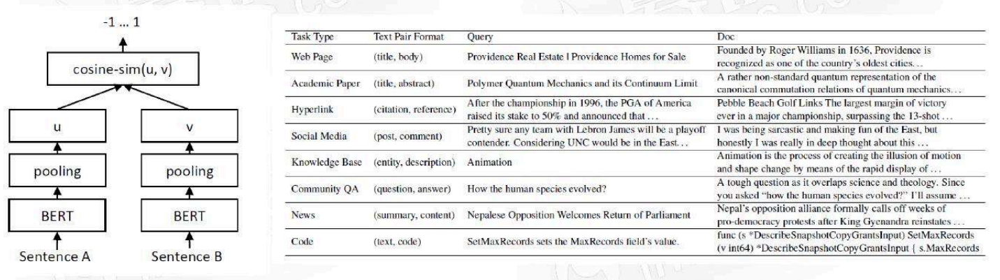

1. 生成相关的句子对A和B，两个句子输入bert
2. 对所有的token对应的向量求均值得到对应句子embedding
3. 对两个embedding计算cos相识度进行学习

<!-- PDF 第 12 页 -->

- BERT架构-阿里的GTE系列

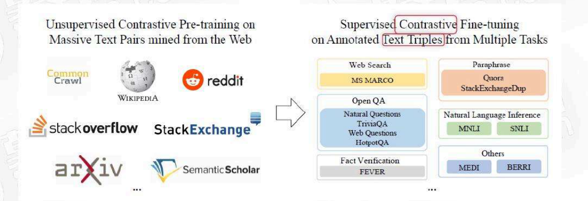

在有标签数据进行微调学习

1. 构造三元组（q,a,i）其中q和a相关，q和i不相关
2. 学习目标：q和a的embedding距离尽可能小，q和i的embedding距离尽可能大

<!-- PDF 第 13 页 -->

### BAAI BGE系列

- BERT架构-BAAI的BGE系列

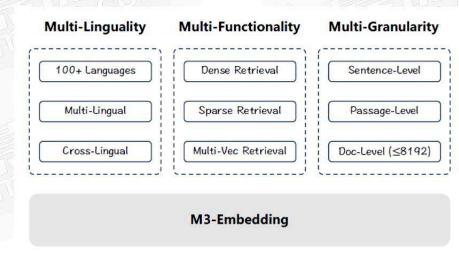

<!-- PDF 第 14 页 -->

- BERT架构-BAAI的BGE系列

多维度计算相似度+对比学习

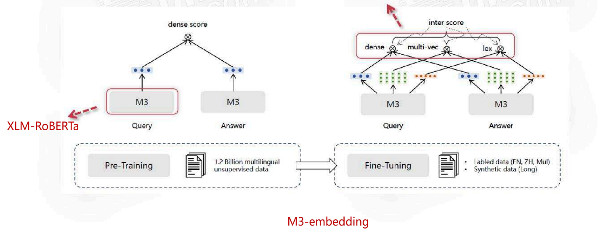

<!-- PDF 第 15 页 -->

## 如何挑选embedding模型

### 基准榜单与初步筛选

- MTEB基准测试榜单是一个好的开始

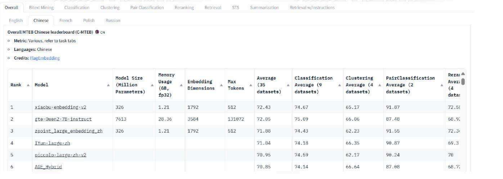

<!-- PDF 第 16 页 -->

### 选型关注维度

- 关注维度

- 任务
  - MTEB提供如classification, clustering, retrieval, summarization等不同任务的评测，RAG重在检索信息，可以选择retrieval
- 语言支持
  - 中文，英文，多语言
- 评测分数
  - 排名和分数
- 模型大小和内存使用
  - 取决于设备资源和执行性能（延迟）
- embedding维度
  - 输出embedding向量的长度，长度长可以捕捉更复杂的语义，长度小执行性能更好，更易于存储，一般不需要太长
- 最大tokens数
  - embedding模型支持输入的token数，注意超过会被截断，影响RAG的文本分割

<!-- PDF 第 17 页 -->

### 模型筛选方法

- 筛选方法论

- MTEB评测并不总是可靠的
  - MTEB的评测集公开的，可能有些水分，参考发布模型机构

关注维度 → 选择模型 → baseline model → 构建自己的数据集 → 评测结果 → 选择模型

迭代

<!-- PDF 第 18 页 -->

## 总结

- 总结

- embedding的重要性
  - 越相同语义的embedding在向量空间中距离越接近

- 
  - embedding模型能为大模型提供问题语义相近的上下文

<!-- PDF 第 19 页 -->

- 总结

- Embedding是如何练成的？
  - 基于BERT架构：完形填空/下一句预测来捕捉词语的语义特征
  - GTE/BGE：在BERT基础上，增加对比学习和度量学习，性能更好
- 挑选embedding模型
  - 重要参考：MTEB
  - 选择基线模型，在自建数据集上迭代评测
