# RAG核心三 企业级的向量数据库选型和高效使用

<!-- PDF 第 1 页 -->

## 目录

- [本章简介](#page-002)
- [了解主流向量数据库](#page-004)
  - [向量数据库的概念与功能](#topic-004)
  - [常用向量数据库概览](#topic-006)
  - [Chroma](#topic-007)
  - [Milvus](#topic-011)
  - [Chroma与Milvus对比](#topic-017)
- [企业级向量数据库的要求](#page-018)
- [向量数据库相似性度量](#page-019)
- [探索向量数据索引优化技术](#page-020)
  - [索引的作用](#topic-020)
  - [IVF：基于划分的索引](#topic-021)
  - [HNSW：分层图索引](#topic-023)
  - [PQ：乘积量化](#topic-025)
  - [根据准确率和数据量选择索引](#topic-028)
- [总结与展望](#page-029)
  - [向量数据库与索引回顾](#topic-029)
  - [企业应用的高可用性设计](#topic-031)

---

<!-- PDF 第 2 页 -->

## 本章简介

- 企业文档在经过embedding模型进行语义向量化之后，如何进行存储和高效的检索这些知识向量是RAG系统的关键技术点

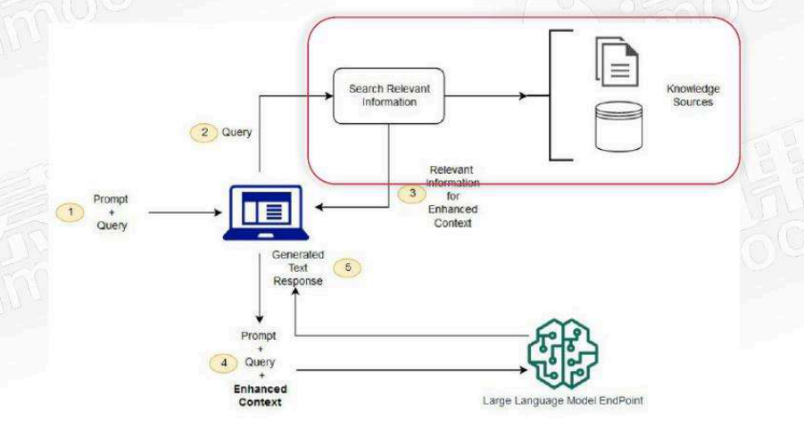

<!-- PDF 第 3 页 -->

- 了解主流向量数据库
- 企业级向量数据库的特点
- 向量数据库相似性度量
- 探索向量数据索引优化技术
- 实战
- 总结展望：企业级应用的高可用性设计

<!-- PDF 第 4 页 -->

## 了解主流向量数据库

### 向量数据库的概念与功能

- 什么是向量数据库

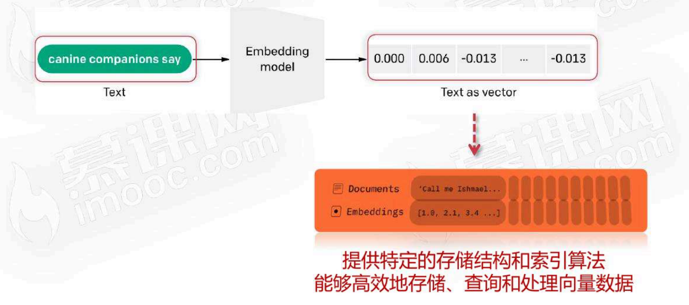

<!-- PDF 第 5 页 -->

- 向量数据库的功能特点

| | 关系型数据库 | 向量数据库 |
| --- | --- | --- |
| 持久化 | 支持本地存储 | 支持本地存储 |
| 增删改查 | 需要 | 需要（侧重在查） |
| 相似度计算 | 无需 | 需要 |
| 数据存储 | 表/字段 | 集合/文档+向量 |
| 索引 | 需要（字段索引，B+数据） | 需要（向量索引，IVF，PQ等） |
| 数据类型 | 多样 | 字符和数值 |

<!-- PDF 第 6 页 -->

### 常用向量数据库概览

- 常用的向量数据库

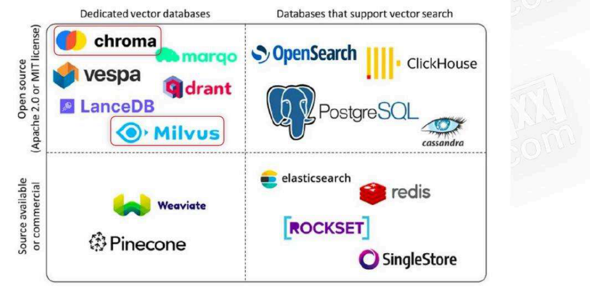

<!-- PDF 第 7 页 -->

### Chroma

- 常用的向量数据库-chroma

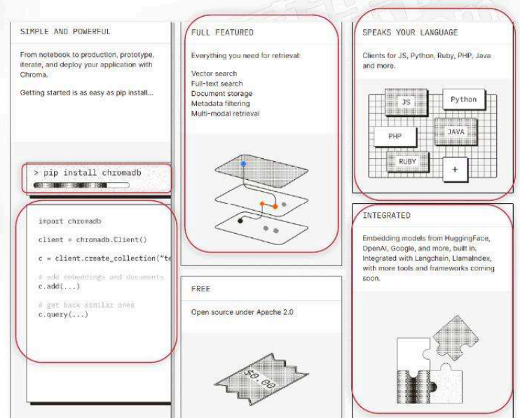

- Chroma 是一个十分易用AI原生的开源向量数据库

- 支持服务端和本地部署

- 支持增删改和各种检索

- 支持python/java/js等多语言调用

- 集成langchain/llamaindex等框架

<!-- PDF 第 8 页 -->

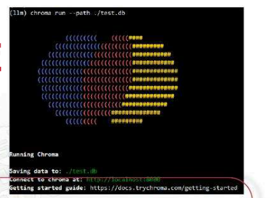

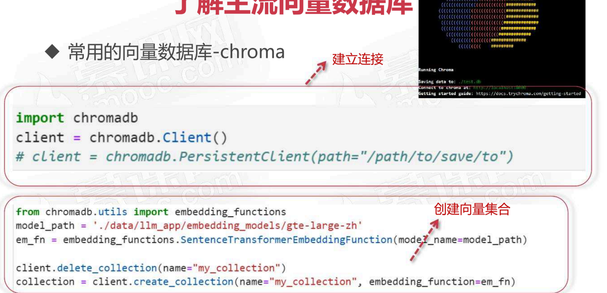

- 常用的向量数据库-chroma

<!-- PDF 第 9 页 -->

- 常用的向量数据库-chroma

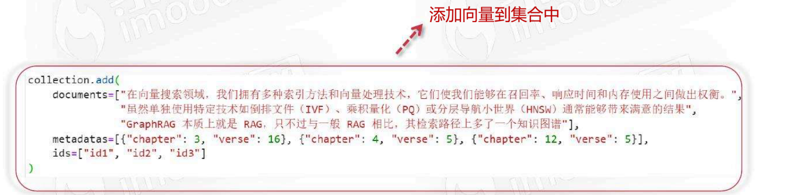

<!-- PDF 第 10 页 -->

- 常用的向量数据库-chroma

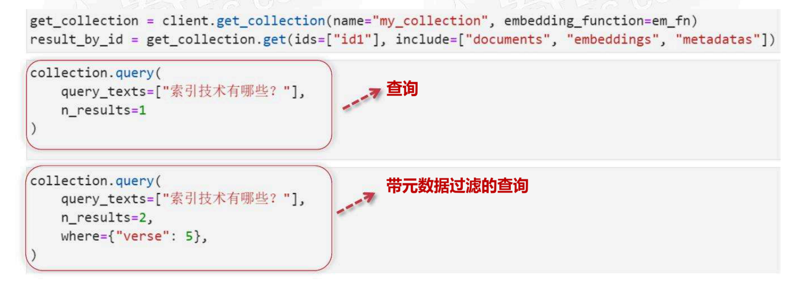

<!-- PDF 第 11 页 -->

### Milvus

- 常用的向量数据库-milvus

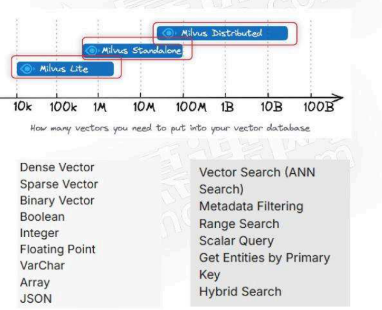

- Milvus 是一个高度灵活、可靠且极速的云原生 开源向量数据库

- 支持：本地/服务端/分布式集群部署，可扩展性强

- 支持增删改和各种检索（支持GPU加速）

- 支持python/java/js等多语言调用

- 集成langchain/llamaindex等框架

- 支持访问权限控制

<!-- PDF 第 12 页 -->

- 常用的向量数据库-milvus

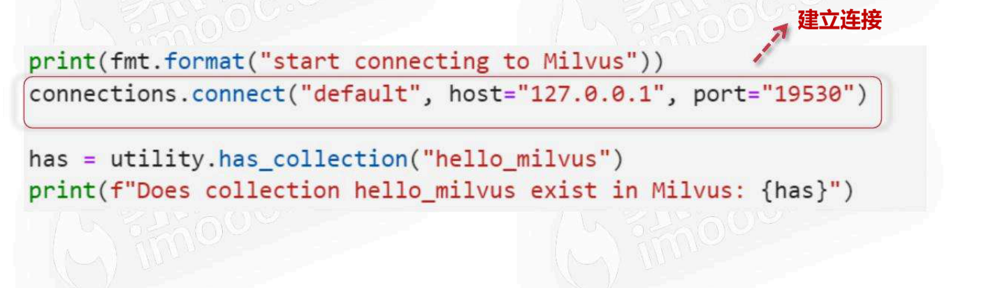

<!-- PDF 第 13 页 -->

- 常用的向量数据库-milvus

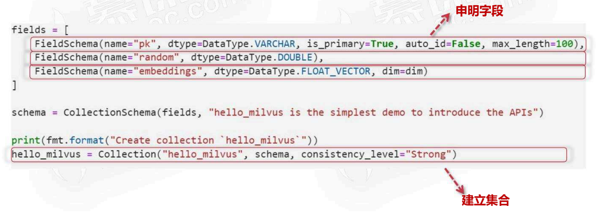

<!-- PDF 第 14 页 -->

- 常用的向量数据库-milvus

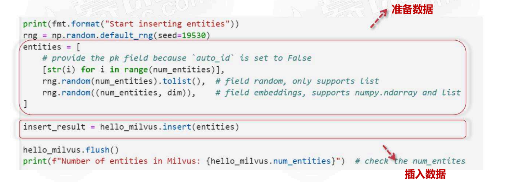

<!-- PDF 第 15 页 -->

- 常用的向量数据库-milvus

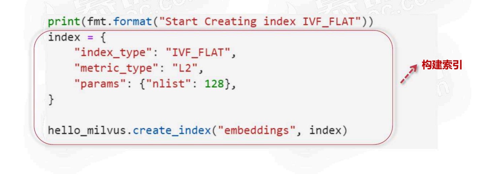

<!-- PDF 第 16 页 -->

- 常用的向量数据库-milvus

混合查询（元数据过滤）

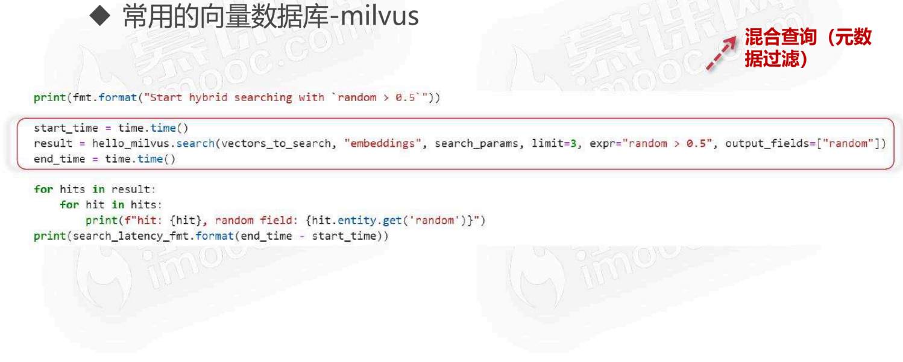

<!-- PDF 第 17 页 -->

### Chroma与Milvus对比

- 常用的向量数据库-chroma vs milvus

简单易用，适合中小型项目

功能完备，适合中大型项目

| | chroma | milvus |
| --- | --- | --- |
| 部署 | 本地/服务端/云部署 | 本地/服务端/云部署（云原生） |
| 扩展性 | 支持分布式 | 支持分布式（K8s） |
| 数据管理 | 增删改查/备份/恢复 | 增删改查/备份/恢复 |
| 向量相似度 | Cosine, Euclidean, Dot Product | Euclidean, Cosine, IP, L2, Hamming, Jaccard, Tanimoto |
| 索引 | HNSW | HNSW, IVF_FLAT, IVF_SQ8, IVF_PQ, RNSG, ANNOY等 |
| 服务管理 | 无 | 支持访问控制、监控和日志 |

<!-- PDF 第 18 页 -->

## 企业级向量数据库的要求

- 向量数据库企业要求

- 可扩展性
  - 当数据量增加时，是否能通过增加节点来扩展系统的容量和计算能力
- 吞吐量
  - 当请求量和数据量增加时，系统能否在短时间内处理更多的请求（QPS）
- 稳定性
  - 当系统故障时，数据是否丢失，是否能备份和恢复，是否有监控和日志

<!-- PDF 第 19 页 -->

## 向量数据库相似性度量

- 相似性度量：如何计算两个向量是否相似

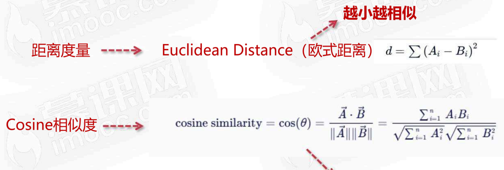

越大越相似，A=B时cosine similarity=1

<!-- PDF 第 20 页 -->

## 探索向量数据索引优化技术

### 索引的作用

- 什么是索引（index）：用于快速检索和定位数据的方法

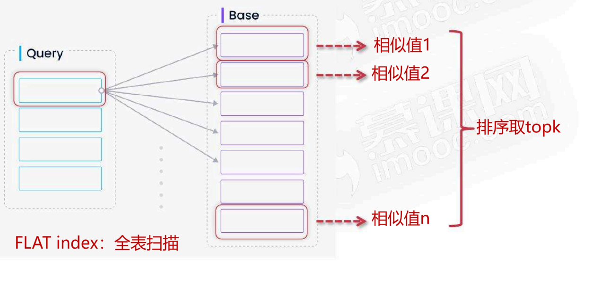

<!-- PDF 第 21 页 -->

### IVF：基于划分的索引

- Inverted file index （IVF）：基于划分的方法

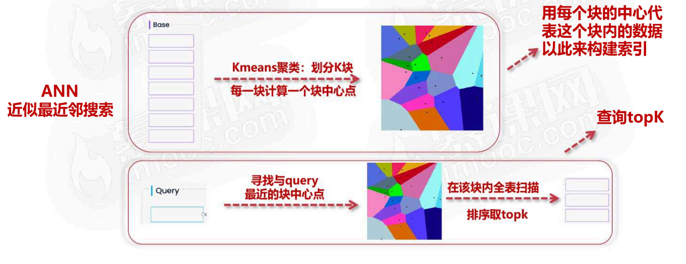

<!-- PDF 第 22 页 -->

- Inverted file index （IVF）：基于划分的方法

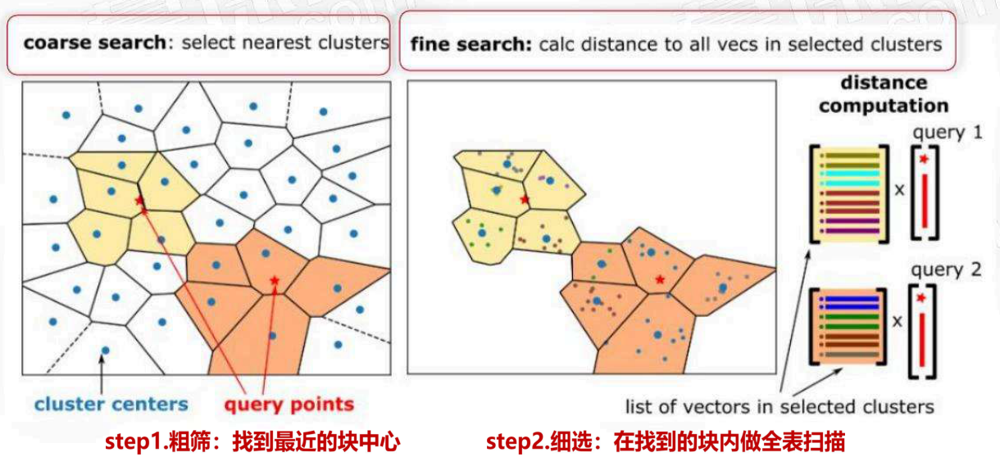

<!-- PDF 第 23 页 -->

### HNSW：分层图索引

- HNSW： 基于分层的图索引

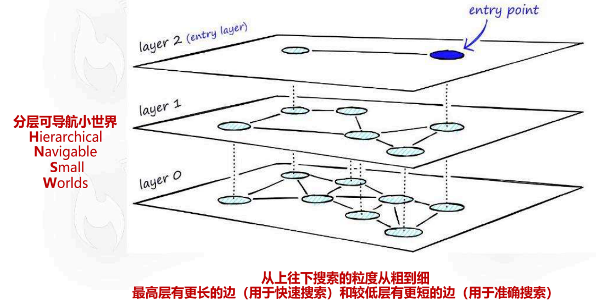

1. 分层：如3层

2. 确定数量：确定每一层的数量（符合指数衰减分布），如10000个向量，第0层有10000个数据元素，第1层有280个元素，第2层只有7个元素

3. 划分数据：layer0是全部数据，从中随机抽取数据到layer1，以此类推，从layer1随机抽取数据到layer2

4. 建立图结构：每一层中每个数据找到最近k个邻居，构建k近邻图

<!-- PDF 第 24 页 -->

- HNSW： 基于分层的图索引

1. 从上往下：搜索开始于最高层

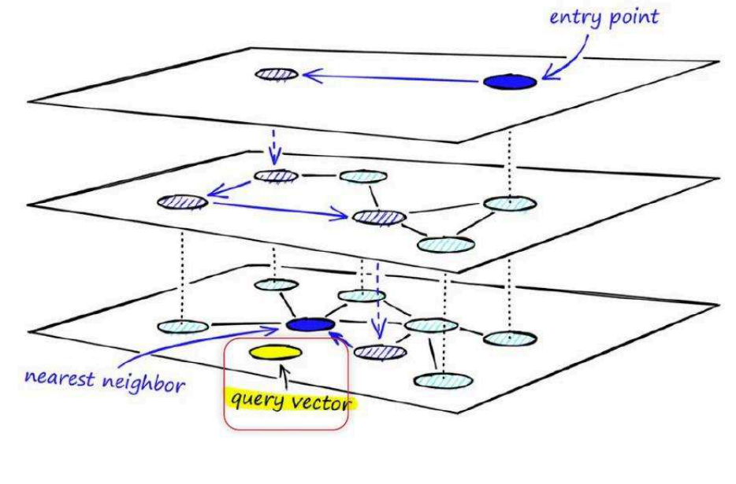

2. 随机切入点：在layer2：随机选择一个数据作为切入点entry point，找到entry point的k个近邻中与查询点最近点，并以此为新的entry point，以此类推，直到entry point不变

3. 上一层的切入点：在下一层layer1中，以上一层的entry point为起点，继续在k邻居里找新的entry point；以此类推直到在layer0找到最近邻

<!-- PDF 第 25 页 -->

### PQ：乘积量化

- 乘积量化（Product Quantization, PQ）：量化压缩

- 
  - 内存占用大（数据和索引）

- 高维向量

- PQ-乘积量化
  - 用整型int8代替float来构建索引，显著压缩高维向量，实现高达97%的内存节省，最近邻搜索的速度提高5.5倍

<!-- PDF 第 26 页 -->

- 乘积量化（Product Quantization, PQ）：量化压缩

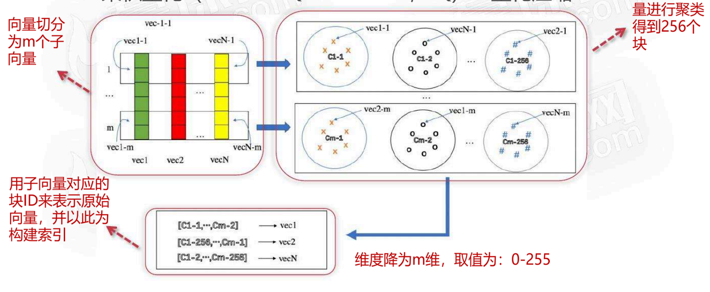

<!-- PDF 第 27 页 -->

- 乘积量化（Product Quantization, PQ）：量化压缩

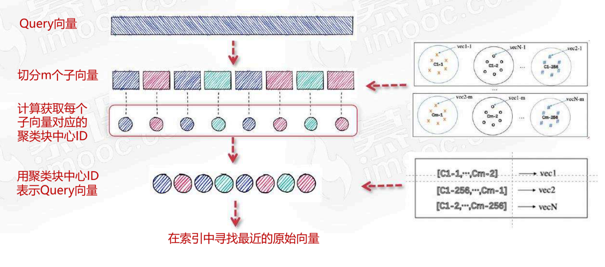

<!-- PDF 第 28 页 -->

### 根据准确率和数据量选择索引

- 选择索引建议：准确率和数据量

- 100%准确率 → FLAT（全表扫描）
  - 其它搜索都属于ANN近似搜索，语义向量在相似性度量如距离度量相差一些影响不是特别大，不一定需要100%准确率
- 向量数据库小于10MB（5000条/512维/FP32） → FLAT（全表扫描）
- 向量数据库(10MB,2GB]（100万条/512维/FP32） → IVF
- 向量数据库(2GB,20GB]（1000万条/512维/FP32） → 考虑量化 IVF PQ，HNSW
- 向量数据库(20GB,200GB]（1亿条/512维/FP32） → 考虑量化 IVF PQ，HNSW_PQ

<!-- PDF 第 29 页 -->

## 总结与展望

### 向量数据库与索引回顾

- 总结

- 向量数据库
  - 作用：存储高维的embedding向量
  - 特点：提供相似度搜索，IVF/PQ/HNSW索引提供高性能近似搜索
  - 工具：常用开源数据库：chroma/milvus

<!-- PDF 第 30 页 -->

- 总结

- 企业向量数据库
  - 要求：可扩展/高吞吐/稳定性
  - chroma：比较适合千万以内数据场景
  - milvus：云原生，分布式，可扩展性好，支持亿级数据毫秒响应，支持权限控制

<!-- PDF 第 31 页 -->

### 企业应用的高可用性设计

- 企业级应用的高可用性设计

- 居安思危，墨菲定律
  - 系统故障了怎么办？
- 高可用目标
  - 可靠性、可用性和可维护性，确保系统在各种情况下都能保持运行
- 设计原则
  - 分布式集群部署：负载均衡（nginx），避免单点故障
  - 容错和冗余设计：主备集群，自动切换
  - 监控和告警：便于即时恢复
