# garbage in garbage out 企业复杂业务数据智能处理

<!-- PDF 第 1 页 -->

## 目录

- [本章简介](#page-002)
- [企业数据复杂多样](#page-004)
  - [文件格式的多样性](#topic-004)
  - [文档内容的复杂性](#topic-005)
- [垃圾进垃圾出-注重文档质量](#page-007)
- [RAG如何读取多样性文档](#page-009)
  - [解析工具概览](#topic-009)
  - [HTML解析](#topic-010)
  - [PDF解析](#topic-015)
  - [其他文档解析工具](#topic-020)
  - [Office文档解析](#topic-021)
  - [RAGFlow文档解析](#topic-023)
- [文档分块chunk](#page-027)
  - [分块的概念与必要性](#topic-027)
  - [理想分块的特征](#topic-029)
  - [递归字符分块](#topic-030)
  - [Markdown格式分块](#topic-033)
  - [Python代码分块](#topic-035)
  - [语义分块概览](#topic-036)
  - [基于Embedding的语义分块](#topic-037)
  - [基于模型的语义分块](#topic-039)
- [总结](#page-041)

---

<!-- PDF 第 2 页 -->

## 本章简介

- 知识库为RAG流程提供最重要的上下文信息，而如何高效准确的处理企业数据是构建知识库的关键

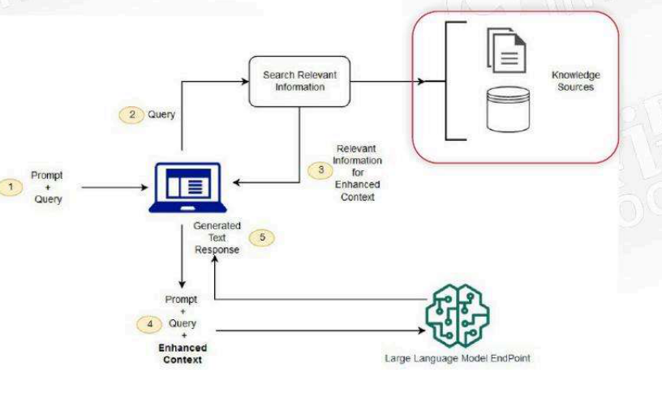

<!-- PDF 第 3 页 -->

- 企业数据复杂多样
- 垃圾进垃圾出原则
- 读取多样性文档
- 文档分块
- 实战

<!-- PDF 第 4 页 -->

## 企业数据复杂多样

### 文件格式的多样性

- 企业数据复杂多样：格式复杂

<!-- PDF 第 5 页 -->

### 文档内容的复杂性

- 企业数据复杂多样：内容复杂

<!-- PDF 第 6 页 -->

- 企业数据复杂多样：内容复杂

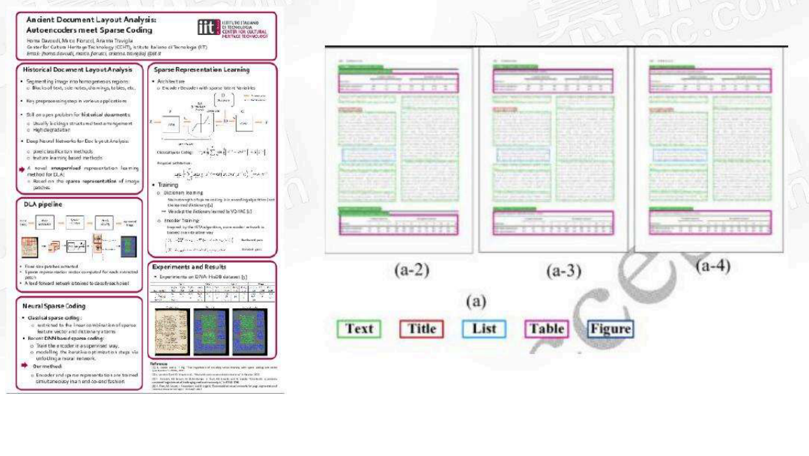

<!-- PDF 第 7 页 -->

## 垃圾进垃圾出-注重文档质量

- 原则：垃圾进垃圾出GIGO

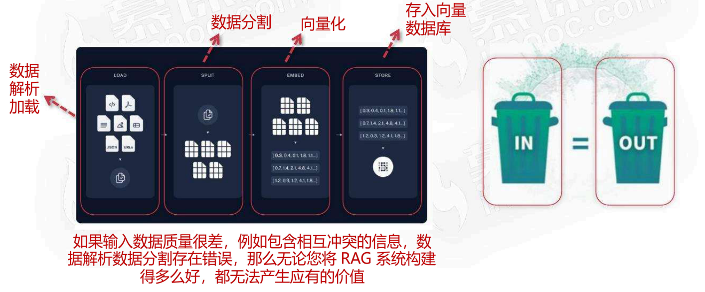

<!-- PDF 第 8 页 -->

- 原则：垃圾进垃圾出GIGO

- 垃圾数据可能得原因
  - 源数据：针对RAG应用选择的数据问题（不相关/存在矛盾/ 不全面）
  - 数据解析：内容识别错误，关键词、句子或段落被误读或遗漏；表格的行列关系混乱等
  - 数据分块：同一个语义的分割成不同块或者不同语义分在同一个块，造成干扰

<!-- PDF 第 9 页 -->

## RAG如何读取多样性文档

### 解析工具概览

- 文档解析工具

- Beautiful Soup
- PyMuPDF
- python-docx
- openpyxl
- python-pptx

<!-- PDF 第 10 页 -->

### HTML解析

- 文档解析工具-HTML

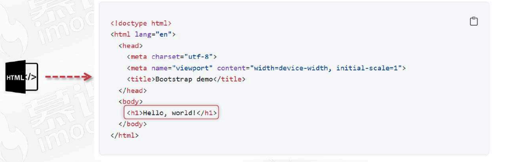

<!-- PDF 第 11 页 -->

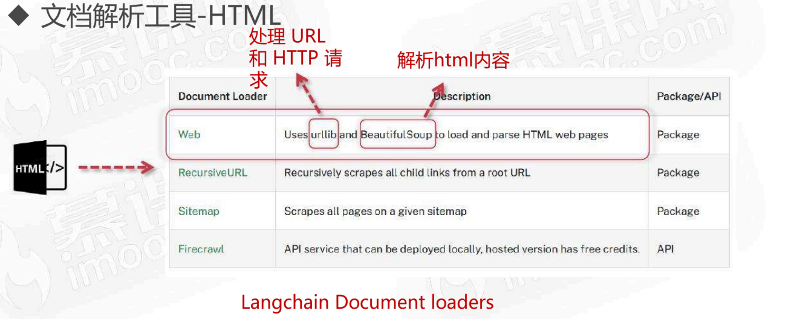

- 文档解析工具-HTML

https://python.langchain.com/v0.2/docs/integrations/document\_loaders/

<!-- PDF 第 12 页 -->

- 文档解析工具-HTML

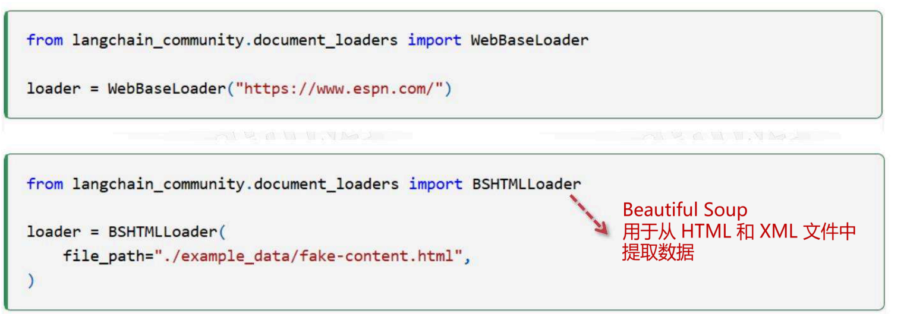

只提取文本信息，没有特殊标记内容如代码模块

<!-- PDF 第 13 页 -->

- 文档解析工具-HTML

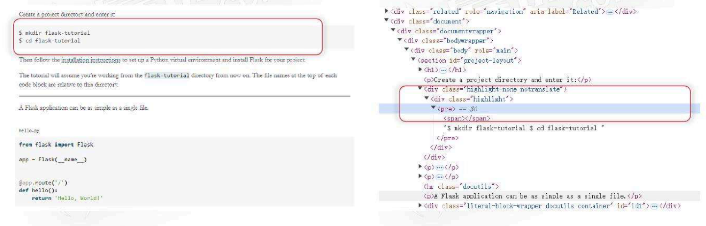

Beautiful Soup

<!-- PDF 第 14 页 -->

- 文档解析工具-HTML

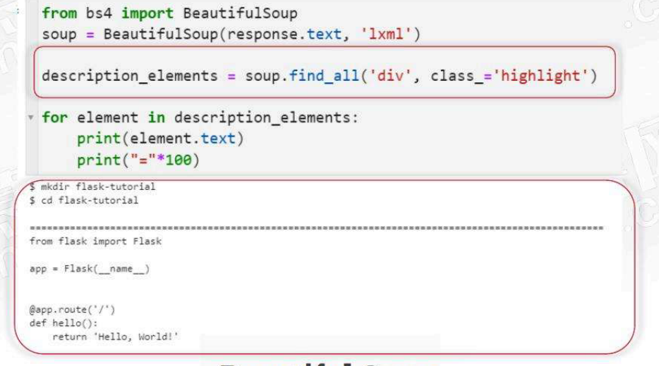

Beautiful Soup

<!-- PDF 第 15 页 -->

### PDF解析

- 文档解析工具-PDF

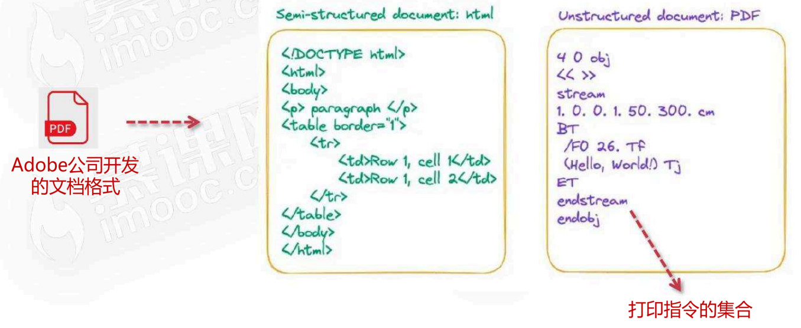

<!-- PDF 第 16 页 -->

- 文档解析工具-PDF

Document Loader

Description

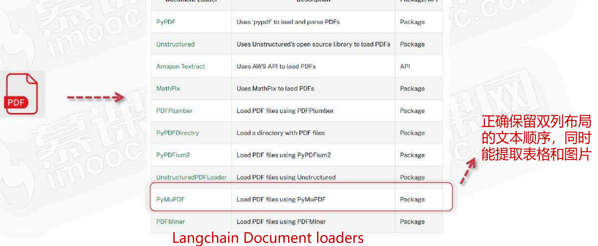

https://python.langchain.com/v0.2/docs/integrations/document\_loaders/

<!-- PDF 第 17 页 -->

- 文档解析工具-PDF

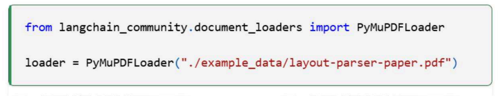

<!-- PDF 第 18 页 -->

- 文档解析工具-PDF

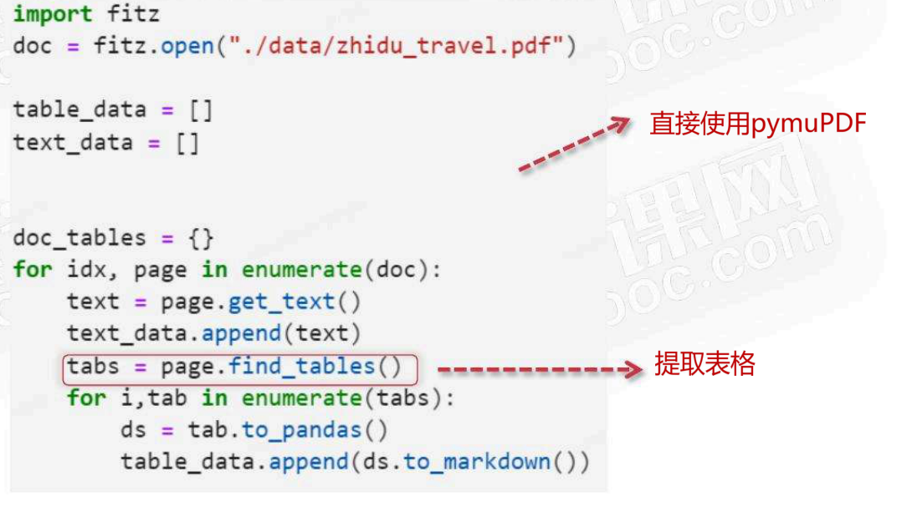

<!-- PDF 第 19 页 -->

- 文档解析工具-PDF

<!-- PDF 第 20 页 -->

### 其他文档解析工具

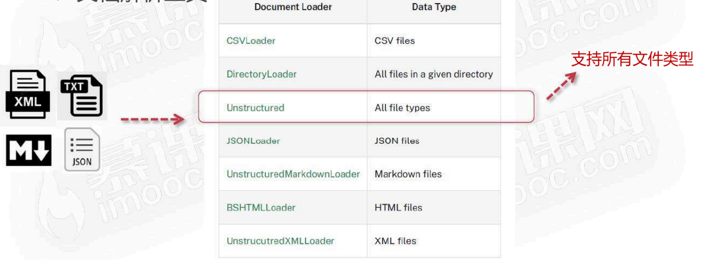

- 文档解析工具

Langchain Document loaders

https://python.langchain.com/v0.2/docs/integrations/document_loaders/

<!-- PDF 第 21 页 -->

### Office文档解析

- 文档解析工具-office

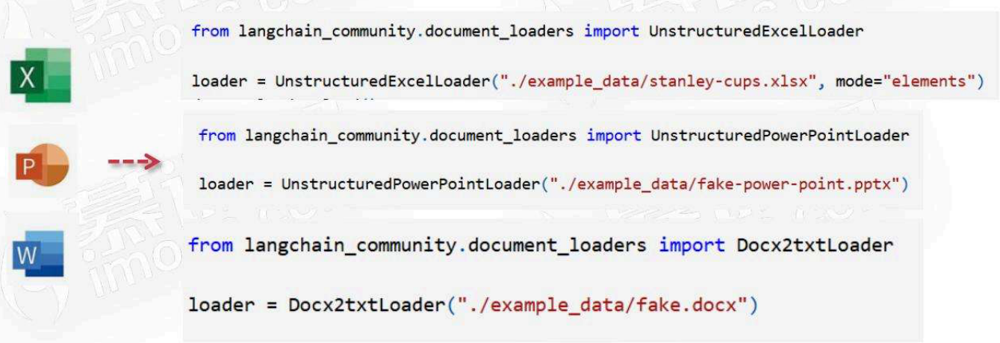

Langchain Document loaders

https://python.langchain.com/v0.2/docs/integrations/document\_loaders/

<!-- PDF 第 22 页 -->

更强的定制化能力

- 文档解析工具-office

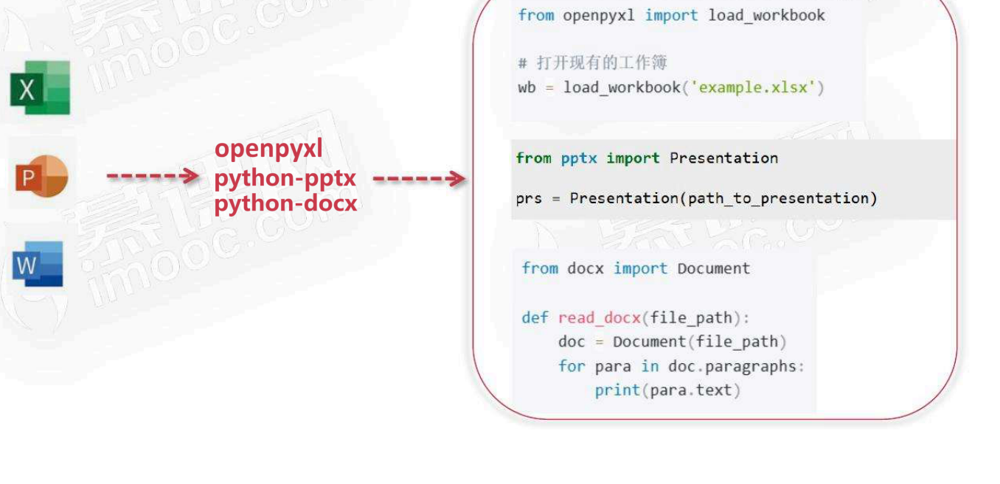

<!-- PDF 第 23 页 -->

### RAGFlow文档解析

- 文档解析工具-ragflow

- deepdoc
  - 视觉模块
    - 利用OCR技术提取文本信息
    - 利用布局识别，识别文档的布局结构，如标题、段落、表格、图像
    - 利用TSR来提取表格结构和文本信息
  - 解析模块
    - 结合视觉模型的信息，支持解析PDF、DOCX、EXCEL、PPT、HTML、txt和markdown等多种文档格式

RAGFlow: deepdoc

https://github.com/infiniflow/ragflow

<!-- PDF 第 24 页 -->

ocr检测和识别文本

- 文档解析工具-ragflow

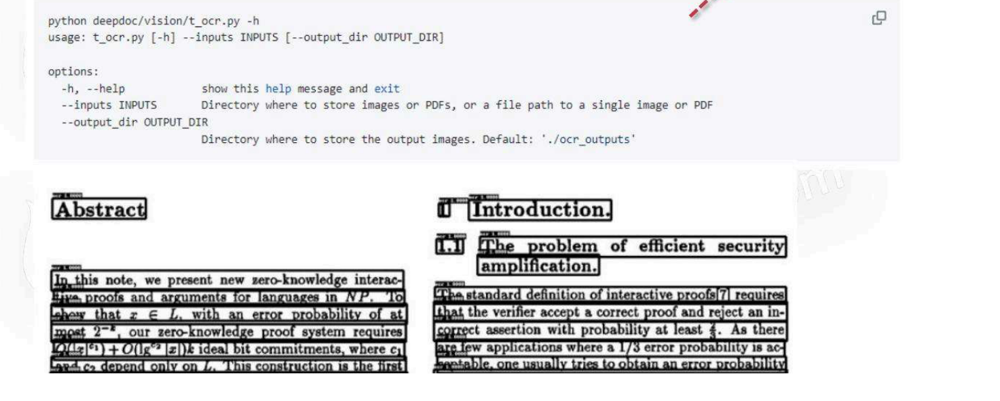

<!-- PDF 第 25 页 -->

布局识别

- 文档解析工具-ragflow

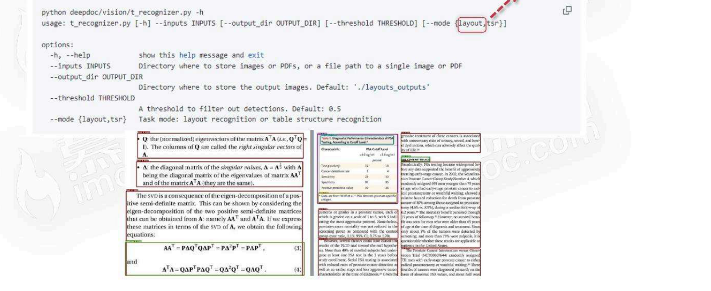

<!-- PDF 第 26 页 -->

表格解析识别

- 文档解析工具-ragflow

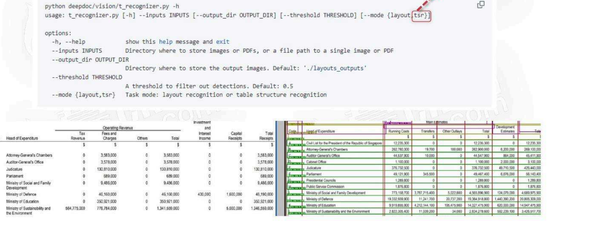

<!-- PDF 第 27 页 -->

## 文档分块chunk

### 分块的概念与必要性

- 文档分块：将长文本拆分成更小块的一个过程

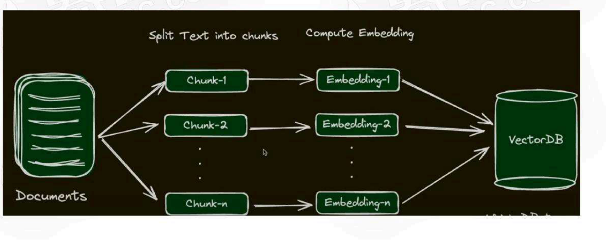

<!-- PDF 第 28 页 -->

- 文档为什么要分块

- 原因1
  - 长文档内容包含多个不同语义的信息，对构建embdding语义向量造成干扰，检索匹配精度下降

- 原因2
  - 检索的长文本信息包含与检索问题不相关的信息，影响LLM生成答案准确性

- 原因3
  - 向量embedding模型的输入长度有限，需要进行分割

<!-- PDF 第 29 页 -->

### 理想分块的特征

- 理想的分块chunk

- 标准
  - 一个chunk表示一个完整且语义相关的上下文信息
- 重要性
  - 确定语料库中文档的最佳块大小对提高搜索结果准确性和相关性是非常重要的；
  - 块太小会将原本完整的语义信息分割成多块，导致上下文信息不完整；
  - 块太大就引入不相关的上下文信息，可能导致搜索结果不准确

<!-- PDF 第 30 页 -->

### 递归字符分块

- 常用分块chunk方法-RecursiveCharacterTextSplitter

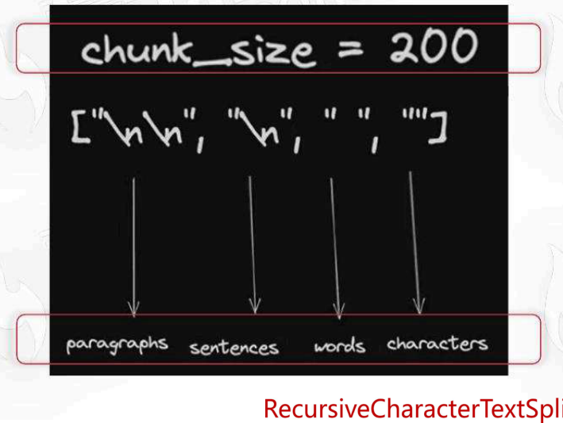

1. 指定块大小chunk_size
2. 指定粗到细的分隔符，从段落/句子/单词/字母
3. 先用粗的分割符拆分文本，如果小于chunk_size则结束；如果大于chunk_size，则依次细的分割符继续拆分，直到满足chunk_size

RecursiveCharacterTextSplitter

https://python.langchain.com/v0.2/docs/how_to/recursive_text_splitter/

<!-- PDF 第 31 页 -->

- 常用分块chunk方法-RecursiveCharacterTextSplitter

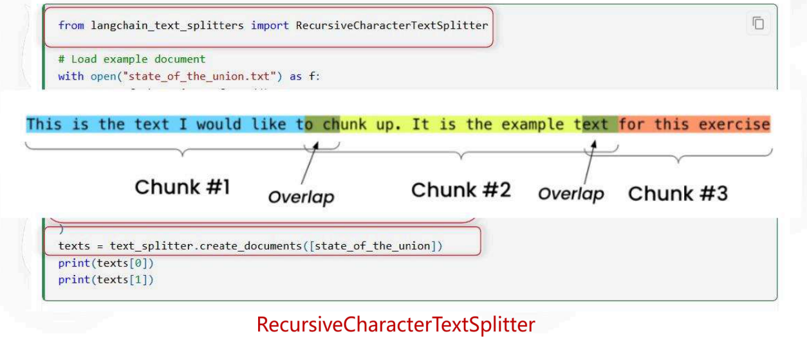

https://python.langchain.com/v0.2/docs/how\_to/recursive\_text\_splitter/

<!-- PDF 第 32 页 -->

- 常用分块chunk方法-RecursiveCharacterTextSplitter

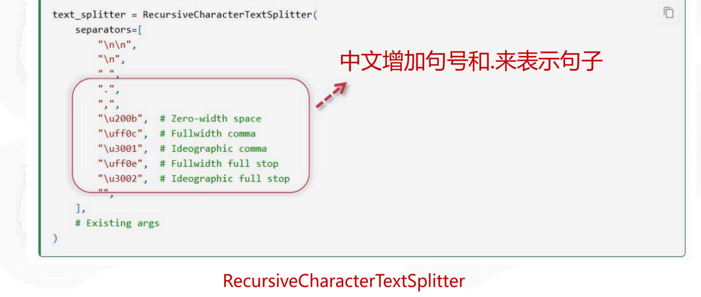

https://python.langchain.com/v0.2/docs/how\_to/recursive\_text\_splitter/

<!-- PDF 第 33 页 -->

### Markdown格式分块

- 特定格式chunk方法-Markdown TextSplitter

<!-- PDF 第 34 页 -->

- 特定格式chunk方法-MarkdownTextSplitter

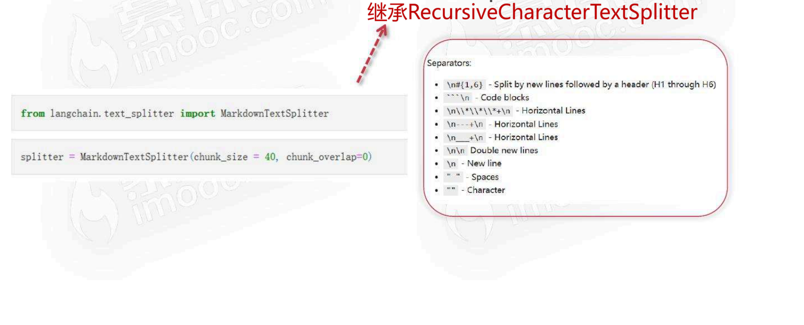

<!-- PDF 第 35 页 -->

### Python代码分块

- 特定格式chunk方法-PythonCodeTextSplitter

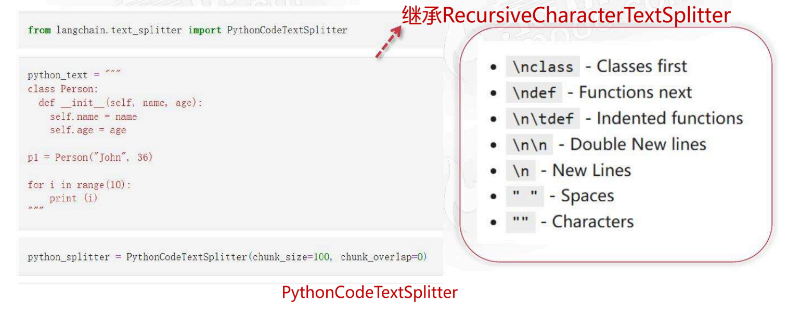

<!-- PDF 第 36 页 -->

### 语义分块概览

- 智能语义分块

- 基于规则的分块
  - RecursiveCharacterTextSplitter / 特定格式chunk方法
- 基于语义的分块
  - 根据文本中的语义信息将文本分成有意义的片段或块的过程，希望每个数据块所包含的信息在语义上相对独立，以便更好地进行检索匹配

<!-- PDF 第 37 页 -->

### 基于Embedding的语义分块

- 智能语义分块-基于embedding语义分块

1. 将文本按照句子粒度进行分割，

2. 设置滑动窗口长度

3. 分别计算前后两个窗口文本的embedding相似度

4. 相邻且符合阈值的句子会被归入一个语义块

基于embedding相似性的语义分块

https://python.langchain.com/v0.2/docs/how\_to/semantic-chunker/

<!-- PDF 第 38 页 -->

- 智能语义分块-基于embedding语义分块

embedding模型

- 分割阈值策略
  - percentile：百分位
  - standard_deviation：标准差
  - Interquartile：四分位

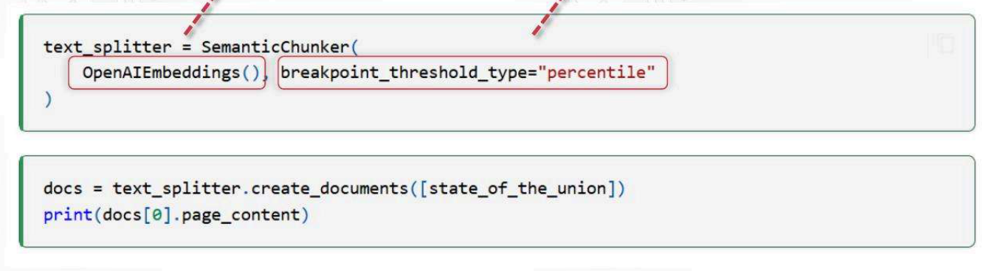

基于embedding相似性的语义分块

https://python.langchain.com/v0.2/docs/how_to/semantic-chunker/

<!-- PDF 第 39 页 -->

### 基于模型的语义分块

- 智能语义分块-基于模型的语义分块

预测是否是分割点

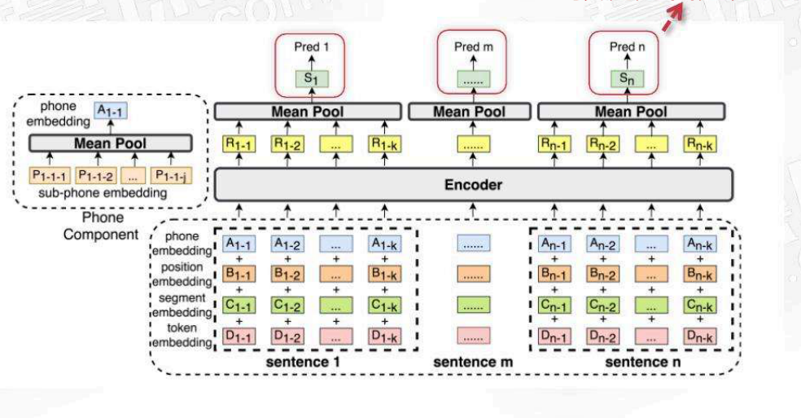

基于模型的语义分块

Sequence Model with Self-Adaptive Sliding Window for Efficient Spoken Document Segmentation

<!-- PDF 第 40 页 -->

- 智能语义分块-基于模型的语义分块

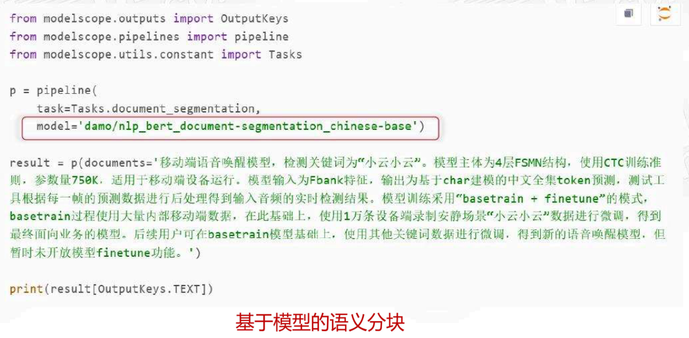

Sequence Model with Self-Adaptive Sliding Window for Efficient Spoken Document Segmentation

<!-- PDF 第 41 页 -->

## 总结

- 总结

- 企业数据的智能处理
  - 挑战：企业数据格式多样和内容多样
  - 原则：GIGO垃圾进垃圾出，数据质量的重要性
  - GIGO应对：严格筛选数据源，清理矛盾和不相关的数据
  - GIGO应对：多种文档解析工具，减少解析内容和样式出错（基于ocr和视觉的解决方案deepdoc+定制开发）
  - GIGO应对：文本分块，相同语义分块在一起，（基于规则的分块和基于语义的分块）
