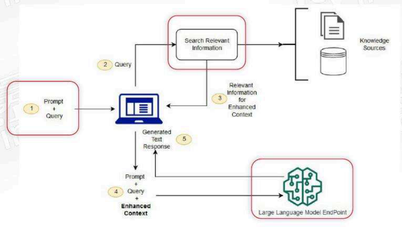
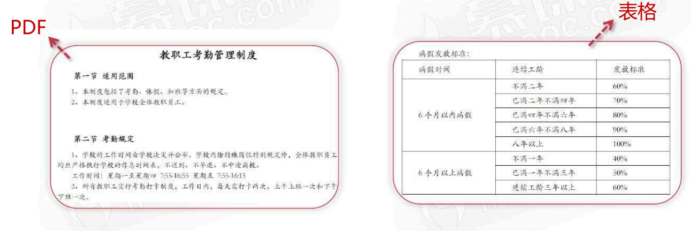
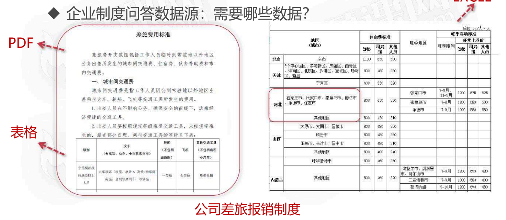
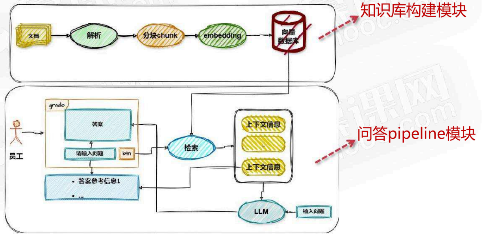

# 搭建制度问答组手 baseline RAG

<!-- PDF 第 1 页 -->

## 目录

- [本章简介](#page-002)
- [【制度问答组手】需求分析](#page-004)
  - [需求痛点](#topic-004)
  - [功能需求](#topic-005)
  - [数据来源](#topic-006)
- [项目技术选型](#page-008)
- [项目架构设计](#page-009)
- [总结和展望](#page-010)
  - [制度问答项目回顾](#topic-010)
  - [AI应用与传统软件开发的区别](#topic-011)

---

<!-- PDF 第 2 页 -->

## 本章简介

- 构建包含知识库构建，查询，检索、生成的完整RAG pipeline

<!-- PDF 第 3 页 -->

- 【企业员工制度问答助手】需求分析
- 项目技术选型
- 项目架构设计
- 实战
- 总结和展望：转变思想，AI应用开发和传统软件开发的区别

<!-- PDF 第 4 页 -->

## 【制度问答组手】需求分析

### 需求痛点

- 制度问答组手需求痛点分析

- 我要请假
  - 公司规章制度往往内容复杂繁多，查询起来可能涉及多个系统或平台的切换，效率低下。需要频繁与HR沟通，增加HR的工作量

- 我要出差
  - 公司差旅报销流程复杂，不同职级、不同地区的员工在差旅报销时可能面临不同的标准，这些标准往往难以准确掌握，容易造成员工误报多报情况

<!-- PDF 第 5 页 -->

### 功能需求

- 企业制度问答：要实现哪些功能？

- 企业制度问答助手
  - 通过整合多平台公司规章制度和差旅报销等资料，帮助员工够快速定位到员工所需的规章制度和差旅报销制度，提高效率，减轻HR工作量

<!-- PDF 第 6 页 -->

### 数据来源

- 企业制度问答数据源：需要哪些数据？

公司员工手册

<!-- PDF 第 7 页 -->

EXCEL

- 企业制度问答数据源：需要哪些数据？

<!-- PDF 第 8 页 -->

## 项目技术选型

- 制度问答组手技术选型

- embedding → BGE M3 embedding
- 向量数据库 → chroma
- 大语言模型 → 本地开源大模型Qwen2-72B / 闭源API
- 文档解析和分割 → ragflow: deepdoc
- 应用开发框架 → langchain
- 前端框架 → gradio

<!-- PDF 第 9 页 -->

## 项目架构设计

- 制度问答组手模块化设计

<!-- PDF 第 10 页 -->

## 总结和展望

### 制度问答项目回顾

- 总结

- 制度问答组手baseline RAG 一
  - 分析了制度问答组手需求痛点、功能和数据源
  - 根据项目特点进行了技术选型
  - 对项目进行总体设计
  - 动手实现了RAG的baseline

<!-- PDF 第 11 页 -->

### AI应用与传统软件开发的区别

- AI应用开发和传统软件开发的区别

软件开发周期

需求 → 设计 → 开发 → 测试 → 发布 → 运维

<!-- PDF 第 12 页 -->

- AI应用开发和传统软件开发的区别

| | 传统软件开发 | AI应用开发 |
| --- | --- | --- |
| 应对确定性 | 针对功能需求，按照设计方案开发有着确定性的结果 | 大模型生成方案存在一定的随机性（可能出错），结果有着不确定性成分，需要处理不确定性 |
| 开发/测试 | 开发-测试，沿着方案设计开发（明确结果导向） | 开发-测试-开发-测试，先从baseline开发，多次迭代，逐步提升性能 |

<!-- PDF 第 13 页 -->

- AI应用开发和传统软件开发的区别

- AI应用开发 → baseline思维，迭代提升
- AI应用开发 → 构建应用的测试集
- AI应用开发 → 注重发布后运维数据收集，迭代提升
