# 有效评估RAG 是提升RAG的关键

<!-- PDF 第 1 页 -->

## 目录

- [本章简介](#page-002)
- [RAG评估标准](#page-004)
  - [RAG流程与评估对象](#topic-004)
  - [评估标准与维度](#topic-005)
- [RAG评估的三大步骤](#page-007)
- [RAG评估框架：ragas](#page-008)
  - [Ragas框架特点](#topic-008)
  - [评估指标概览](#topic-009)
  - [评估数据集格式](#topic-010)
  - [Faithfulness：忠实度](#topic-011)
  - [忠实度评估的拆分与推断提示词](#topic-013)
  - [Answer Relevance：答案相关性](#topic-015)
  - [答案相关性评估的生成问题提示词](#topic-017)
  - [Context Recall：上下文召回率](#topic-018)
  - [上下文召回率评估的推断提示词](#topic-020)
  - [Context Precision：上下文精度](#topic-021)
  - [上下文精度评估的推断提示词](#topic-023)
  - [Ragas评估执行过程](#topic-024)
- [执行RAG评估后](#page-025)
- [总结](#page-026)

---

<!-- PDF 第 2 页 -->

## 本章简介

- RAG系统构建完成之后，如何判断是否达到预期效果？RAG的评估至关重要，不仅是项目好坏的标准，也是指出项目提升的方向

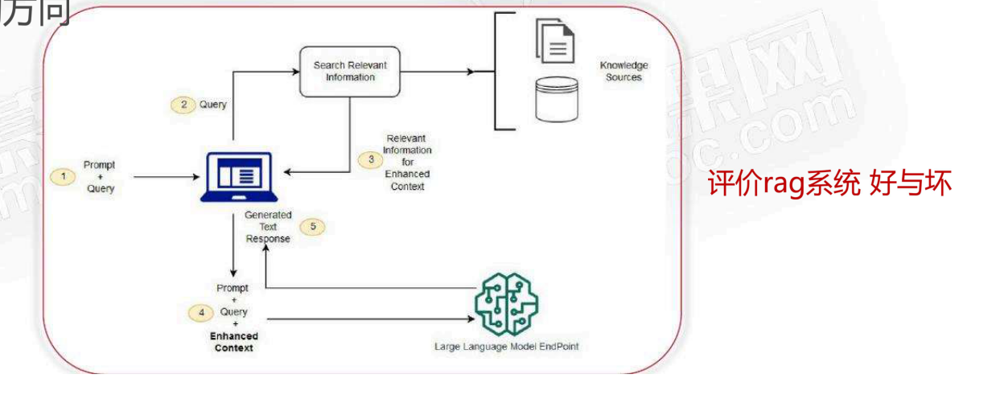

<!-- PDF 第 3 页 -->

- RAG评估标准
- RAG评估的三大步骤
- RAG评估框架：ragas
- 实战

<!-- PDF 第 4 页 -->

## RAG评估标准

### RAG流程与评估对象

- 简化RAG流程

问题 → 检索上下文 → LLM生成答案

通过衡量这三者之间的相关程度来评估RAG的效果的好坏

<!-- PDF 第 5 页 -->

### 评估标准与维度

- RAG评估标准

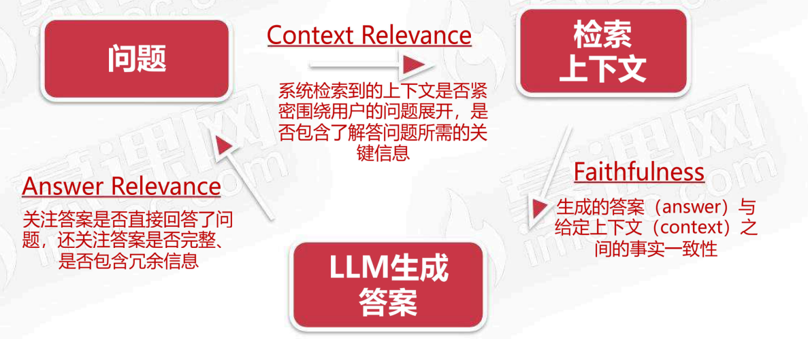

<!-- PDF 第 6 页 -->

- RAG评估标准

- Faithfulness（忠实性）
  - Context：苹果公司由史蒂夫·乔布斯和史蒂夫·沃兹尼亚克于1976年创立
  - Answer：苹果公司成立于1976年
- Answer Relevance（答案相关性）
  - query：苹果公司是什么时候成立的？
  - Answer1：苹果公司成立于1976年
  - Answer2：苹果公司是一家科技公司
- Context Relevance（上下文相关性）
  - query：苹果公司是什么时候成立的？
  - Context1：苹果公司由史蒂夫·乔布斯和史蒂夫·沃兹尼亚克于1976年创立
  - Context2：苹果公司发布了iPhone

<!-- PDF 第 7 页 -->

## RAG评估的三大步骤

- RAG评估三大步骤

构建评估数据集 → 评估指标 → 执行评估

<!-- PDF 第 8 页 -->

## RAG评估框架：ragas

### Ragas框架特点

- ragas特点

最早是无参考的评估框架（RAG评估过程，不必依赖人工标注的标准答案）

利用的是大语言模型的能力来判断生成答案和问题以及上下文的相关性

<!-- PDF 第 9 页 -->

### 评估指标概览

- ragas评估指标

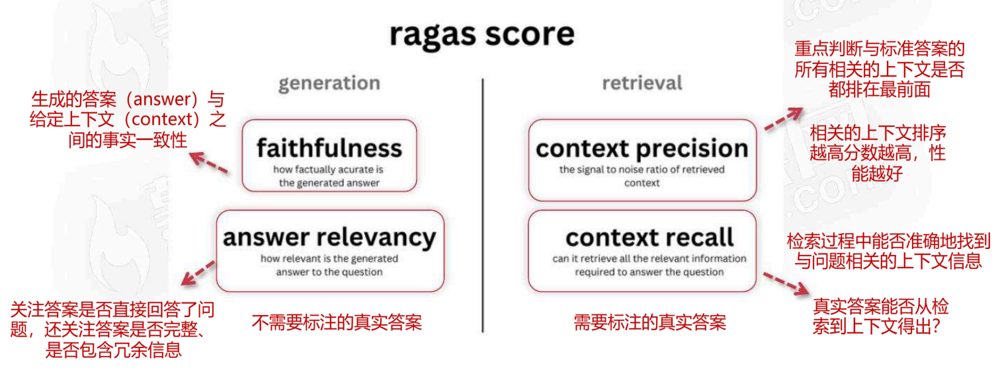

<!-- PDF 第 10 页 -->

### 评估数据集格式

- ragas数据集格式

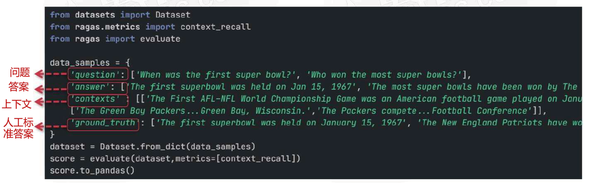

question/answer/contexts/ground\_truth

<!-- PDF 第 11 页 -->

### Faithfulness：忠实度

- ragas评估指标：Faithfulness

question/answer/contexts

1. 生成的答案answer拆分为单独的陈述
2. 对每个陈述，验证是否可以从给定的上下文中推断出它
3. 统计能够从上下文推断出来的陈述的比例

<!-- PDF 第 12 页 -->

- ragas评估指标：Faithfulness

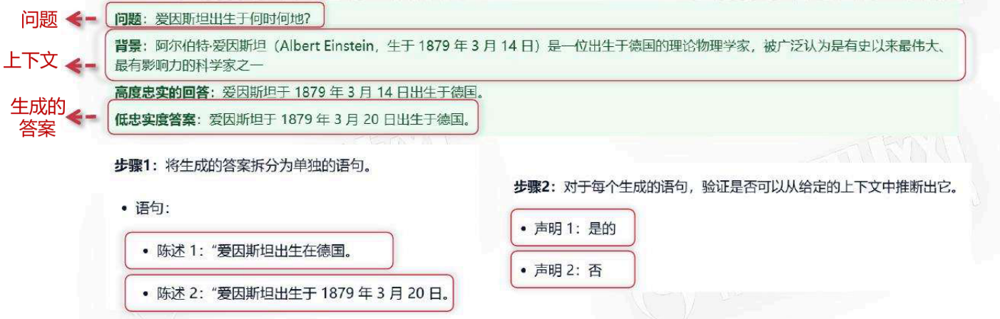

Faithfulness = ½ = 0.5

<!-- PDF 第 13 页 -->

### 忠实度评估的拆分与推断提示词

- ragas评估指标：Faithfulness-拆分提示词写法

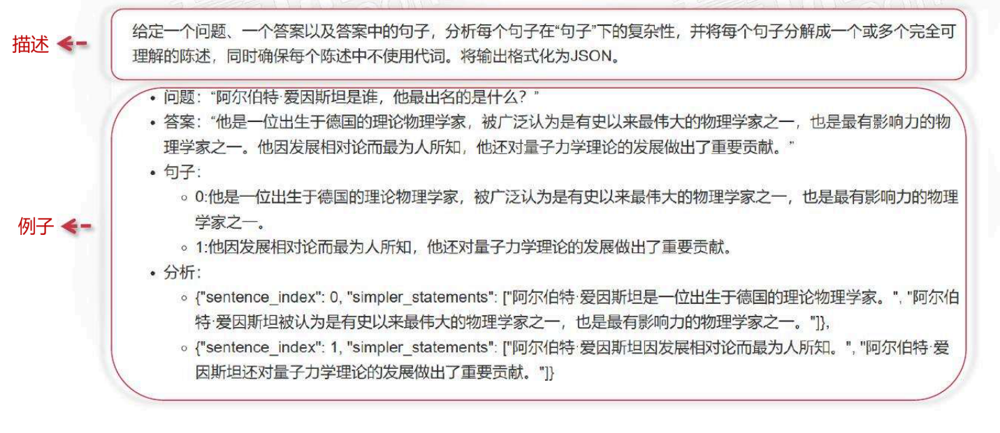

<!-- PDF 第 14 页 -->

- ragas评估指标：Faithfulness-推断提示词写法

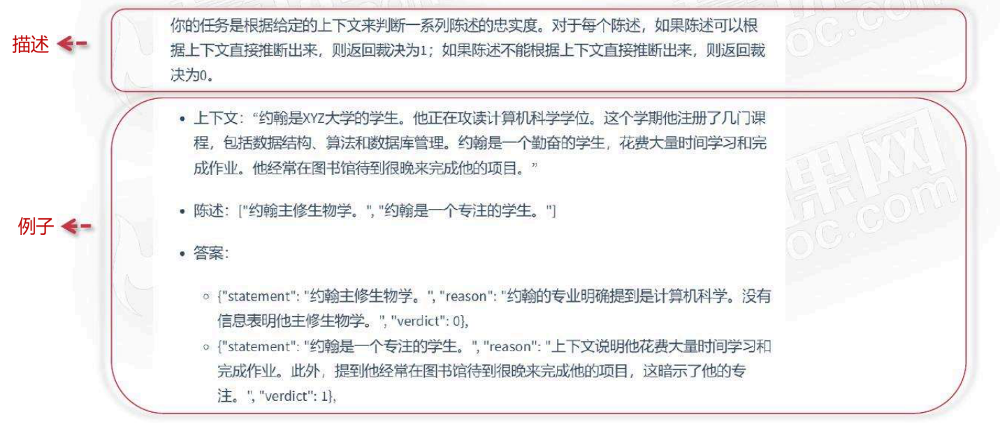

<!-- PDF 第 15 页 -->

### Answer Relevance：答案相关性

- ragas评估指标：Answer Relevance

question/answer

1. 生成的答案answer生成多个潜在的问题
2. 计算每个潜在问题和原始问题的embedding语义相似度
3. 所有相似度的取平均

<!-- PDF 第 16 页 -->

- ragas评估指标：Answer Relevance

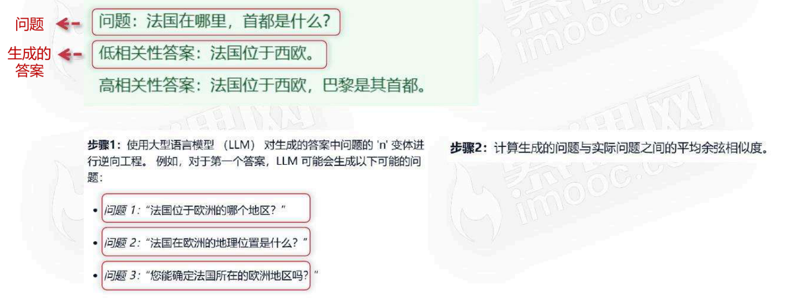

<!-- PDF 第 17 页 -->

### 答案相关性评估的生成问题提示词

- ragas评估指标：Answer Relevance生成问题提示词

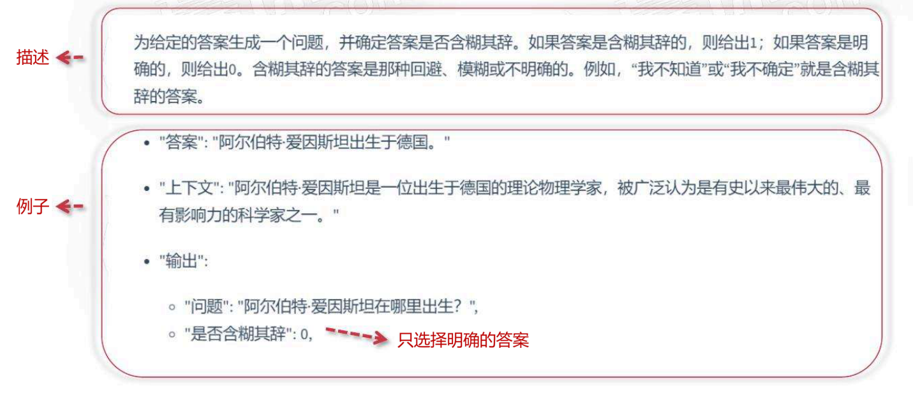

<!-- PDF 第 18 页 -->

### Context Recall：上下文召回率

- ragas评估指标：Context Recall

groud_truth/contexts

1. 人工标准答案groud_truth拆分为单独的陈述
2. 对每个陈述，验证是否可以从给定的上下文中推断出它
3. 统计能够从上下文推断出来的陈述的比例

<!-- PDF 第 19 页 -->

- ragas评估指标-Context Recall

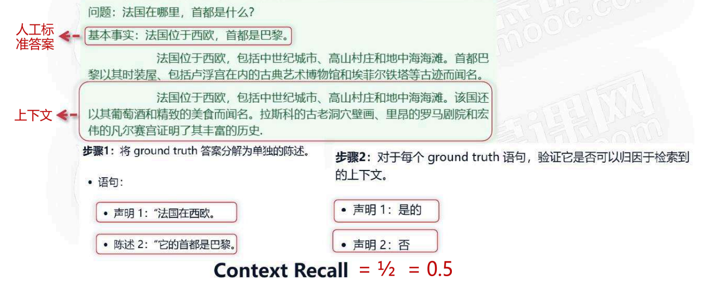

<!-- PDF 第 20 页 -->

### 上下文召回率评估的推断提示词

- ragas评估指标：Context Recall推断提示词

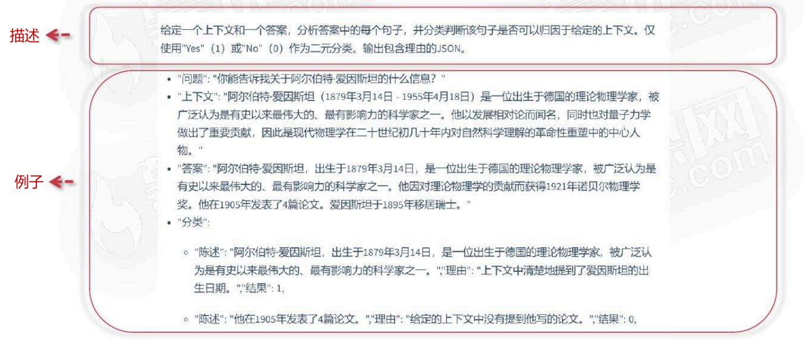

<!-- PDF 第 21 页 -->

### Context Precision：上下文精度

- ragas评估指标：context precision（从排序角度考察检索）

question/groud_truth/contexts

1. 对于topk的每个上下文：给定问题，判断是否可以从上下文中得出标准答案，1为是，0为否
2. 考虑上下文排序权重：前面k个相关的比率
3. 加权平均

<!-- PDF 第 22 页 -->

- ragas评估指标：context precision（从排序角度考察检索）

检索得到Top3：context

判断能否得出标准答案：[0, 1, 1]

Top3 累加权重：[0/1, (0+1)/2, (0+1+1)/3]

加权：`(0*0+1*1/2, 1*2/3) / (0+1+1)`

Context Precision = 1.16/2= 0.58

<!-- PDF 第 23 页 -->

### 上下文精度评估的推断提示词

- ragas评估指标：context precision推断提示词

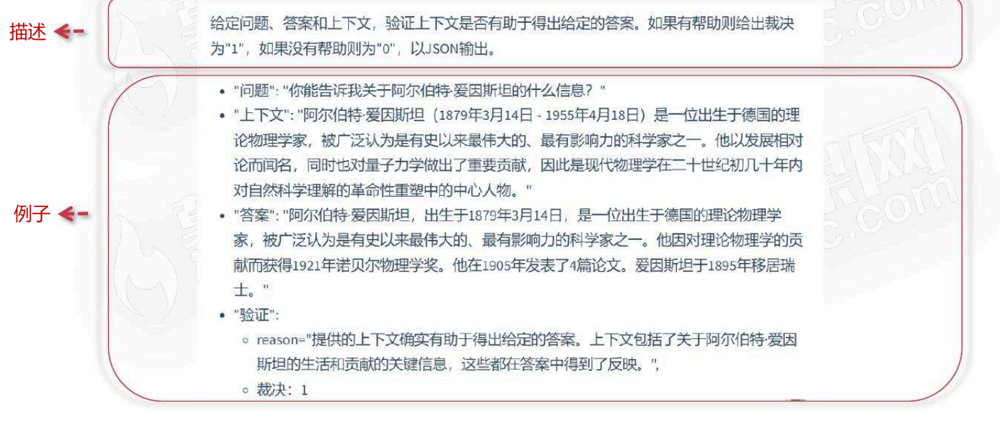

<!-- PDF 第 24 页 -->

### Ragas评估执行过程

- ragas评估过程

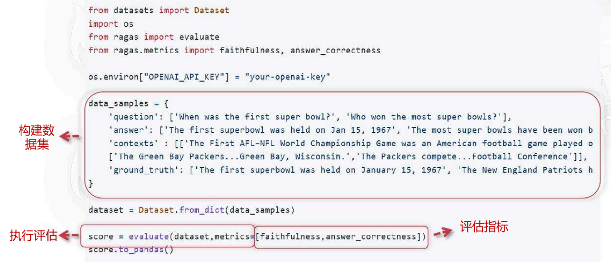

<!-- PDF 第 25 页 -->

## 执行RAG评估后

- 执行评估后要做什么

- RAG评估后行动项
  - 分析评估不好的BAD CASE
  - 提出解决方案：如改进检索方式、替换embedding模型、改写生成答案的提示词等
  - 重新评估验证解决方案是否有效

<!-- PDF 第 26 页 -->

## 总结

- 总结

- RAG评估
  - 目的：问题 / 上下文 / 生成答案之间的相关性
  - 步骤：构建评估数据集、选择评估指标、执行评估
  - 框架：无参考和有参考结合的评估方法ragas（结合llm能力）

<!-- PDF 第 27 页 -->

- 总结

| 评估指标 | 目的 | 计算方法 |
| --- | --- | --- |
| 忠诚度（Faithfulness） | 衡量生成答案与给定上下文事实之间的一致性 | 验证生成答案是否能够从上下文中推断出来 |
| 答案相关性（Answer Relevancy） | 重点衡量生成答案与用户提问的匹配程度 | 做逆向工程，比较从生成答案的潜在问题与原始问题的相似度 |

<!-- PDF 第 28 页 -->

- 总结

| 评估指标 | 目的 | 计算方法 |
| --- | --- | --- |
| 上下文召回率（Context Recall） | 关注于模型在检索过程中能否准确地找到与问题相关的上下文信息 | 分析标准答案中的句子是否可以从检索到的上下文中推断出来 |
| 上下文精度（Context Precision） | 重点判断与标准答案的所有相关的上下文是否都排在最前面 | 从排序角度考察检索到上下文的有效性，越相关的上下如果排序越前面检索性能越好 |
