# 提升RAG的90分的检索增强技能

<!-- PDF 第 1 页 -->

## 目录

- [本章简介](#page-002)
- [剖析RAG进化之路：探索优化点](#page-004)
  - [Naive RAG与Advanced RAG](#topic-004)
  - [Modular RAG](#topic-005)
- [检索的两大形态：稀疏 vs 稠密](#page-006)
  - [稀疏检索](#topic-006)
  - [稠密检索](#topic-010)
- [检索增强技术](#page-011)
  - [用户问题多样性与检索精度](#topic-011)
  - [查询增强概览](#topic-012)
  - [Query2Doc](#topic-013)
  - [HyDE：假设性文档向量](#topic-015)
  - [HyDE的LangChain与LlamaIndex实现](#topic-018)
  - [子问题查询与拆解](#topic-020)
  - [查询改写](#topic-022)
  - [Take a Step Back](#topic-024)
  - [多索引检索概览](#topic-026)
  - [父子文档索引](#topic-027)
  - [总结索引](#topic-029)
  - [文档假设问题索引](#topic-030)
  - [融合检索与融合排序](#topic-031)
  - [重排序与BGE Reranker](#topic-035)
  - [迭代检索增强生成](#topic-038)
  - [Self-RAG](#topic-041)
- [总结和展望](#page-045)
  - [检索增强技术回顾](#topic-045)
  - [企业代码规范与代码管理](#topic-050)

---

<!-- PDF 第 2 页 -->

## 本章简介

- 检索（retrieval）关系到能否获得和用户问题相关的上下文信息，是RAG系统的重要组成，如何增强检索的性能是开发RAG应用的关键

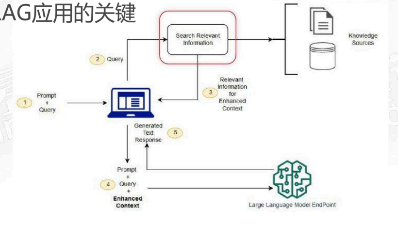

<!-- PDF 第 3 页 -->

- 剖析RAG进化之路：探索优化点
- 检索的两大形态：稀疏 vs 稠密
- 检索增强技术
- 实战
- 总结和展望：关于企业里需要良好的代码规范和代码管理

<!-- PDF 第 4 页 -->

## 剖析RAG进化之路：探索优化点

### Naive RAG与Advanced RAG

- naive vs advanced RAG

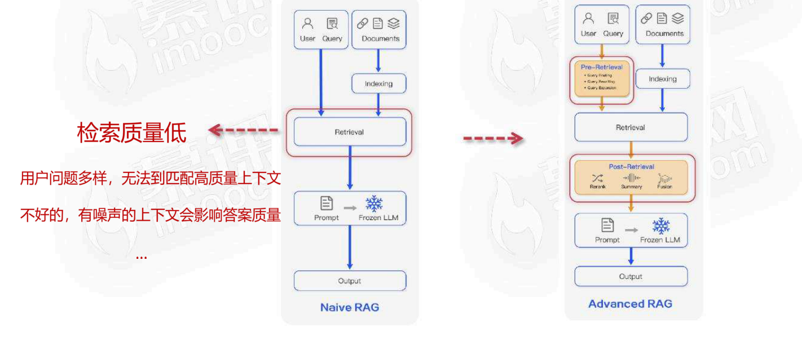

<!-- PDF 第 5 页 -->

### Modular RAG

- Modular RAG

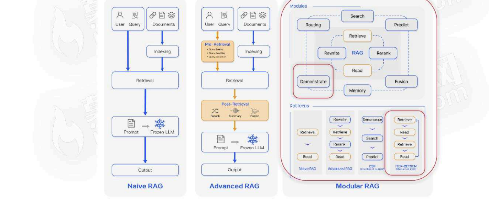

<!-- PDF 第 6 页 -->

## 检索的两大形态：稀疏 vs 稠密

### 稀疏检索

- 稀疏检索（sparse retriever）

- 稀疏检索
  - 关键词匹配的拓展
  - 根据词频等信息，依赖于统计学方法，来评估文档与查询之间的相关性
  - 常用算法：TF-IDF，BM25

<!-- PDF 第 7 页 -->

- 稀疏检索（sparse retriever）

度量词语在文档中的重要性

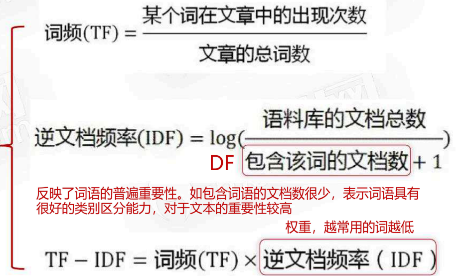

TF-IDF

TF-IDF与一个词在文档中的出现次数成正比，与该词在整个语言中的出现次数成反比

特点：计算简单，只考虑词频，不关注顺序和上下文，词频来衡量文章中的一个词的重要性不够全面

<!-- PDF 第 8 页 -->

- 稀疏检索（sparse retriever）

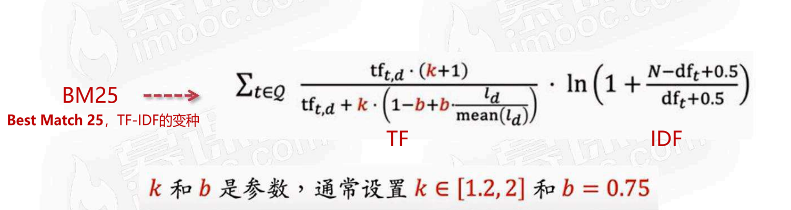

<!-- PDF 第 9 页 -->

- 稀疏检索（sparse retriever）

- 稀疏检索缺点--
  - 考虑词频，不关注顺序和上下文
  - 男朋友/送/的/礼物
  - 送/男朋友/的/礼物
  - 白/衬衫 /灰/裤子
  - 灰/衬衫 /白 / 裤子

<!-- PDF 第 10 页 -->

### 稠密检索

- 稠密检索 （dense retriever ）

- 稠密检索
  - 语义检索：将文本转换为embedding向量
  - 基于BERT架构：GTE/ BGE
  - 信息压缩：将语义信息压缩到固定长度数组里，存在信息丢失的风险

<!-- PDF 第 11 页 -->

## 检索增强技术

### 用户问题多样性与检索精度

- 用户问题多样

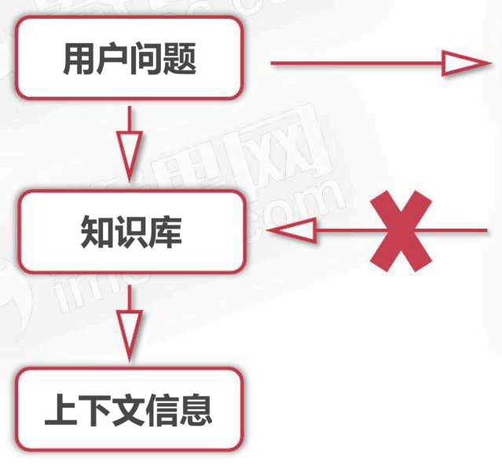

1. 问题存在表达不清、语义模糊，缺少关键信息
2. 问题不准确，缺少上下文
3. 问题本身具有一定歧义
4. 包含多个问题，问题太细节，...

检索上下文精度差

<!-- PDF 第 12 页 -->

### 查询增强概览

- 提高检索精度：查询增强（query rewriting/expansion）

- 查询增强
  - 通过对用户查询进行改造和扩展，使其更加清晰、具体，从而提高检索准确性
  - 使查询与文档语义一致
  - Pre-Retrieval：检索前增强

<!-- PDF 第 13 页 -->

### Query2Doc

- 查询增强：Query2Doc

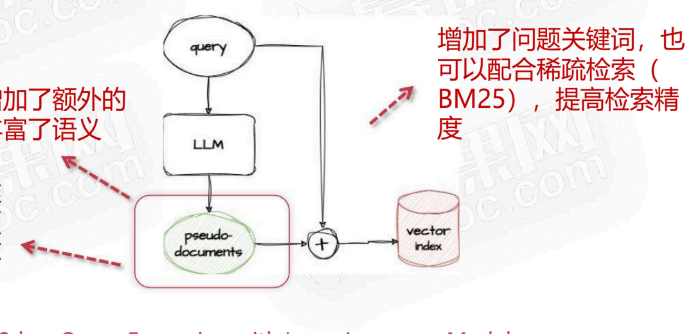

虽然伪文档答案不是准确的，扩展了问题的额外细节，提高与知识库的相关匹配的可能性

Query2doc: Query Expansion with Large Language Models

<!-- PDF 第 14 页 -->

- 查询增强：Query2Doc

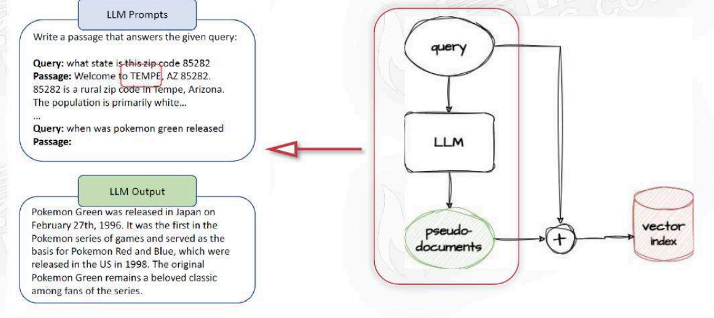

Query2doc: Query Expansion with Large Language Models

<!-- PDF 第 15 页 -->

### HyDE：假设性文档向量

- 查询增强：HyDE（假设性文档向量）

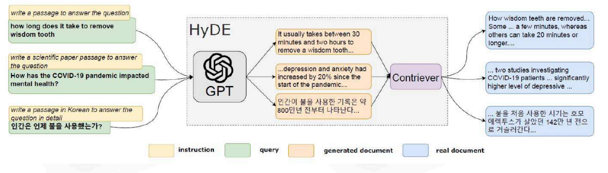

Hypothetical Document Embeddings （HyDE）

<!-- PDF 第 16 页 -->

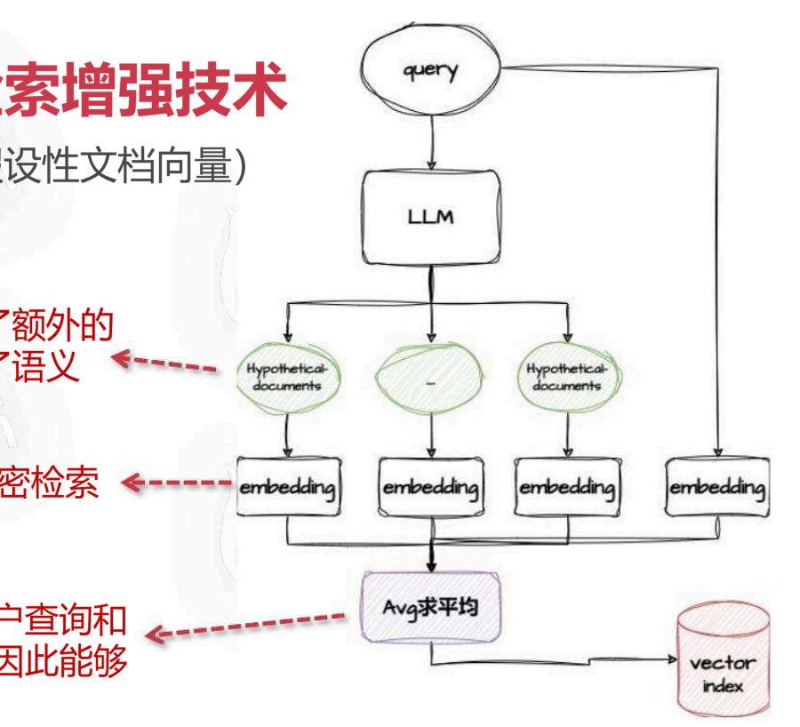

- 查询增强：HyDE（假设性文档向量）

为问题增加了额外的信息，丰富了语义

向量化，适合稠密检索

平均化的向量包含了用户查询和所需答案相关的信息，因此能够提高检索的召回率

<!-- PDF 第 17 页 -->

- 查询增强：HyDE（假设性文档向量）

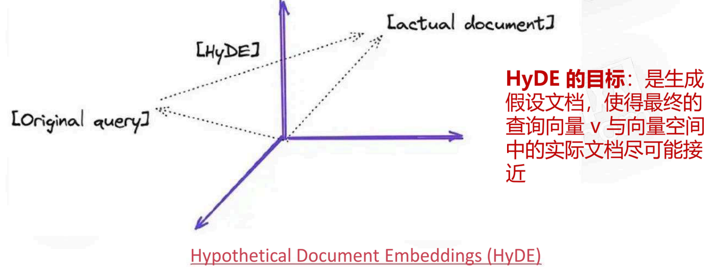

<!-- PDF 第 18 页 -->

### HyDE的LangChain与LlamaIndex实现

- 查询增强：HyDE（假设性文档向量）-Langchain实现

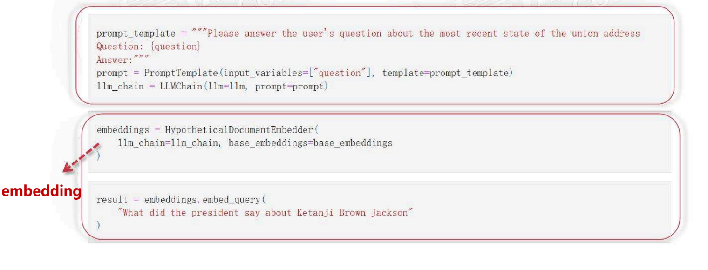

<!-- PDF 第 19 页 -->

- 查询增强：HyDE（假设性文档向量）-llamaindex实现

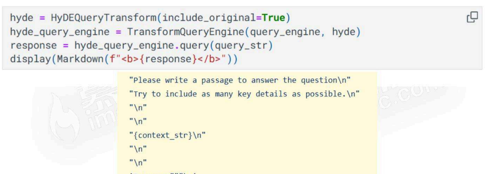

<!-- PDF 第 20 页 -->

### 子问题查询与拆解

- 查询增强：子问题查询

问题复杂：问题描述复杂，包含多个语义的问题，直接用复杂问题进行向量化检索可能会导致部分问题丢失，影响检索的性能

问题拆解：利用大语言模型将问题拆解成子问题，每个子问题都生成检索上下文，可以根据合并后的总的上下文去回答，也可以每个上下文独立去回答

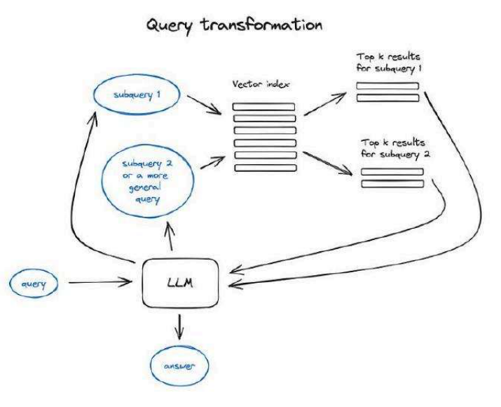

<!-- PDF 第 21 页 -->

- 查询增强：子问题查询-子问题拆解

Your purpose is to help answer a complex user question by generating a list of sub questions that can be answered by the tools.

These are the guidelines you consider when completing your task:

- Be as specific as possible
- The sub questions should be relevant to the user question
- The sub questions should be answerable by the tools provided
- You can generate multiple sub questions for each tool
- Tools must be specified by their name, not their description
- You don't need to use a tool if you don't think it's relevant

<!-- PDF 第 22 页 -->

### 查询改写

- 查询增强：查询改写

问题表达不清：用户提出的问题，语言措辞不好，缺少关键的信息，降低检索性能

问题改写：利用大语言模型的能力，根据用户问题多角度重写问题，增加额外的信息，提高检索性能

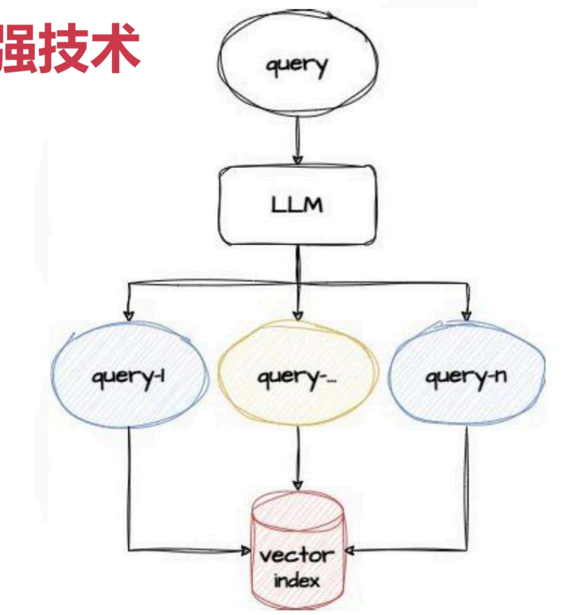

<!-- PDF 第 23 页 -->

- 查询增强：查询改写-实现

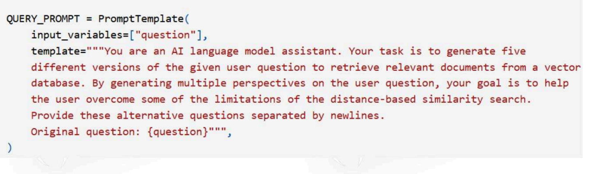

<!-- PDF 第 24 页 -->

### Take a Step Back

- 查询增强：Take a Step Back

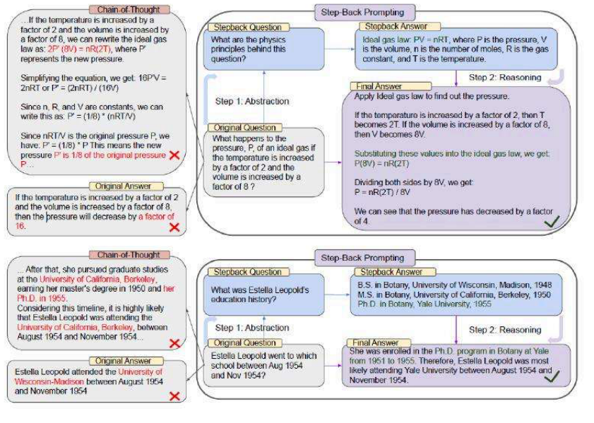

问题太细：用户提出的问题往往包含大量细节，可能导致检索时忽略了关键的信息，降低检索性能

问题抽象化：将用户的具体问题转化为一个更高层次的抽象问题，一个更广泛的问题，关注于高级概念或原则，从而帮助模型更有效地进行信息检索

<!-- PDF 第 25 页 -->

- 查询增强：Take a Step Back-提示词

<!-- PDF 第 26 页 -->

### 多索引检索概览

- 检索增强：多索引检索

- 多索引检索
  - 用户的查询可能涉及不同的方面和层次，如具体事实、抽象概念等
  - 通过对同一个文档提供不同的类型的embedding索引，能从不同的角度去匹配检索，提高检索匹配的性能
  - Pre-Retrieval： 检索前增强

<!-- PDF 第 27 页 -->

### 父子文档索引

- 检索增强：多索引检索-父子文档（small2big）

文档块分成更小的块small_chunk

在small_chunk上做embbedding

相似度查询用small chunk

返回的文档是small chunk 对应的big chunk

经验表明：开源embedding模型对于短文本提取语义效果更好

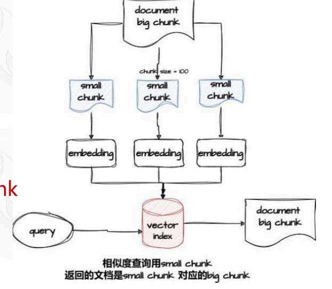

<!-- PDF 第 28 页 -->

- 检索增强：多索引检索-父子文档（small2big）

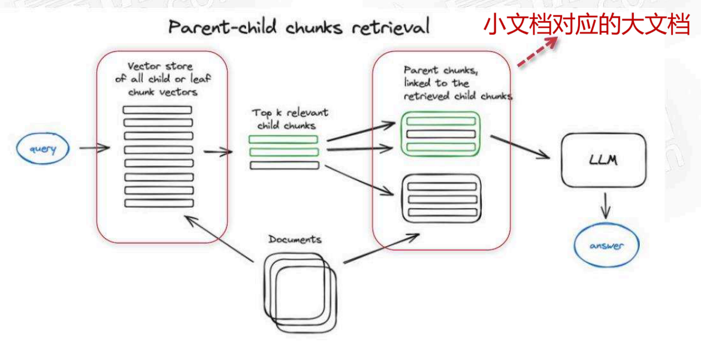

<!-- PDF 第 29 页 -->

### 总结索引

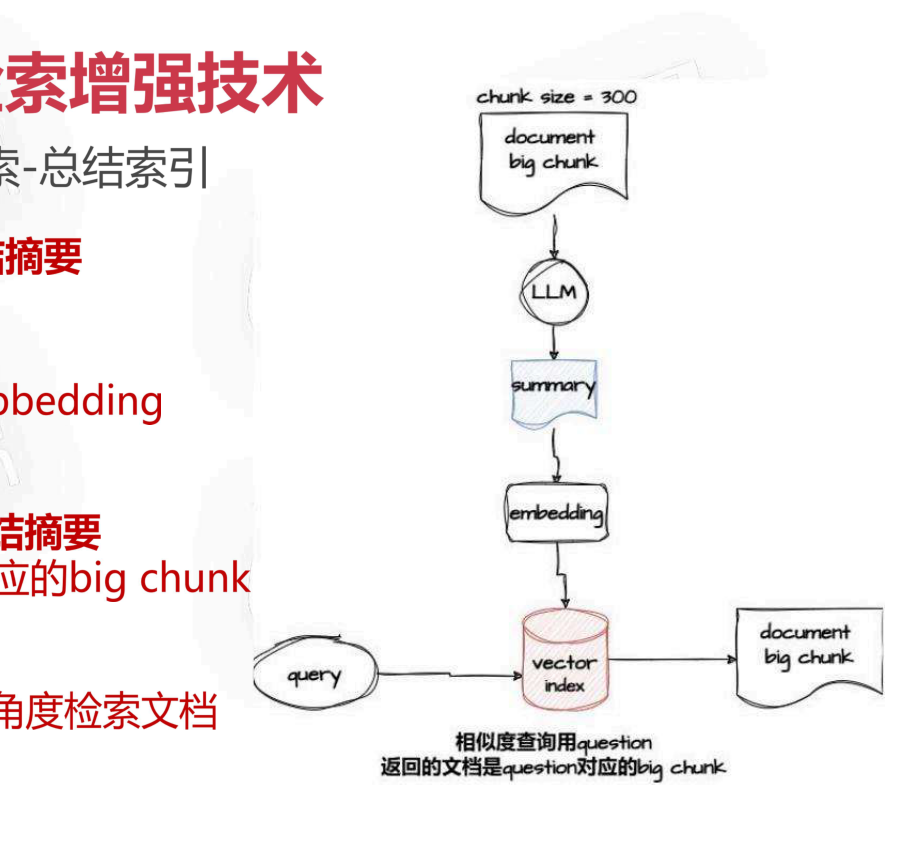

- 检索增强：多索引检索-总结索引

文档块生成总结摘要

在总结摘要上做embbedding

相似度查询用总结摘要

返回的文档是总结摘要对应的big chunk

总结摘要：从信息摘要角度检索文档

<!-- PDF 第 30 页 -->

### 文档假设问题索引

- 检索增强：多索引检索-文档假设问题

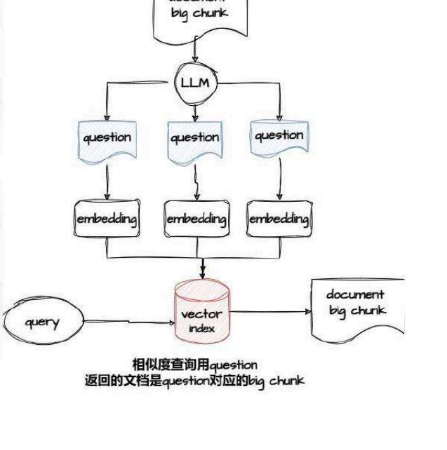

文档块生成假设问题（答案在文档中）

在假设问题上做embbedding

相似度查询用假设问题

返回的文档是假设问题对应的big chunk

假设问题：用户问题和假设问题的同一层面的语义匹配

<!-- PDF 第 31 页 -->

### 融合检索与融合排序

- 检索增强：融合检索（混合检索）

- 融合检索
  - 基于文本匹配的稀疏检索：关注关键词匹配
  - 基于语义的稠密检索：关注语义理解
  - Post-Retrieval： 检索后增强

<!-- PDF 第 32 页 -->

- 检索增强：融合检索-BM25+embedding

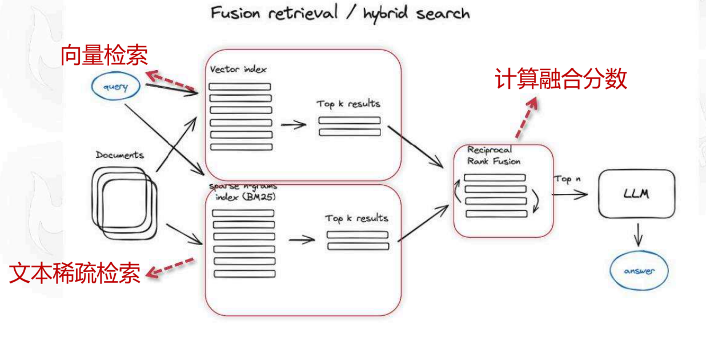

<!-- PDF 第 33 页 -->

- 检索增强：融合检索-融合排序（加权倒数排名）

<!-- PDF 第 34 页 -->

- 检索增强：融合检索-融合排序（加权倒数排名）

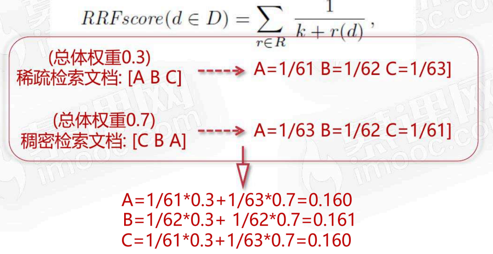

<!-- PDF 第 35 页 -->

### 重排序与BGE Reranker

- 检索增强：重排序rerank

- 重排序
  - 检索增强：生成多个基于相似度查询到的相似文档
  - 需要精简：检索太多文档增加LLM生成准确答案难度，生成速度慢，引入干扰
  - 文档重排序：使与用户输入问题的更相关、更准确的文档分块排名更靠前
  - Post-Retrieval： 检索后增强

<!-- PDF 第 36 页 -->

- 检索增强：重排序rerank

- 重排序
  - 基于深度学习模型的rerank：一般是Cross-encoder rerank（交叉编码器重排序），它直接对输入的两个文档（即查询问题和候选文档）进行相关性打分，而不是生成句子embedding
  - 常用模型：Cohere Rerank模型 /bge-reranker-large模型

<!-- PDF 第 37 页 -->

- 检索增强：重排序rerank-bge-reranker

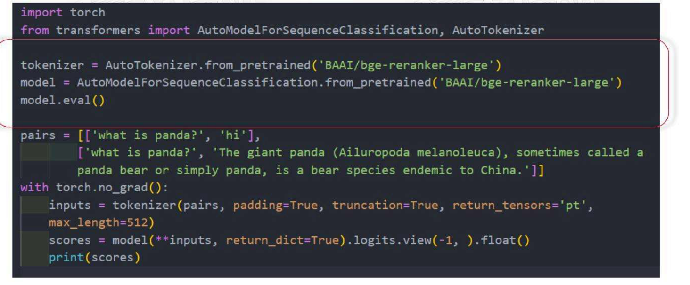

<!-- PDF 第 38 页 -->

### 迭代检索增强生成

- 系统性查询增强：迭代检索增强生成

- 迭代检索增强
  - 单步增强变多次迭代增强，每次迭代都是一次完整的RAG过程，生成答案
  - 每次迭代生成的答案中都可能包含了回答问题的额外信息，这些信息有助于检索更准确的上下文
  - Modular RAG： 系统性增强

<!-- PDF 第 39 页 -->

- 系统性查询增强：迭代检索增强生成

- 迭代1：给定一个问题，检索到上下文信息
- 迭代1：模型针对问题和上下文信息，生成可能正确的答案
- 迭代2：将生成可能正确的答案再合并到问题，做为新的问题，去检索上下文问题
- 迭代2：模型再次针对问题和新的上下文信息，生成答案

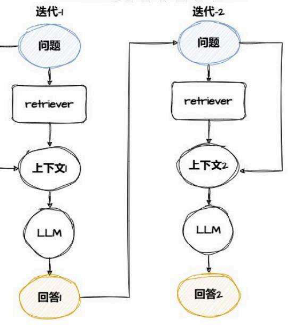

<!-- PDF 第 40 页 -->

- 系统性查询增强：迭代检索增强生成

<!-- PDF 第 41 页 -->

### Self-RAG

- RAG新范式：self-RAG

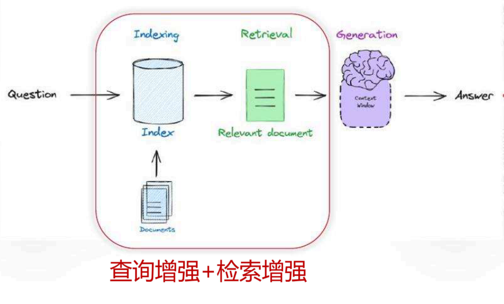

人为/ragas结果评估

线下迭代不断优化：确定完优化步骤，上线以后这些操作都是固定

<!-- PDF 第 42 页 -->

- RAG新范式：self-RAG

问题：RAG流程是否自动加入判别的步骤，可以动态的选择使用哪种策略，自动迭代生成最好的答案

判断检索的文档是否相关：只取相关的，都不相关采用查询增强策略

判断生成答案是否符合上下文：不符合可以多次生成尝试

判断生成答案是否能回答问题：不能回答直接告知或采用新的增强策略

<!-- PDF 第 43 页 -->

- RAG新范式：self-RAG

判断答案对于问题的可用性

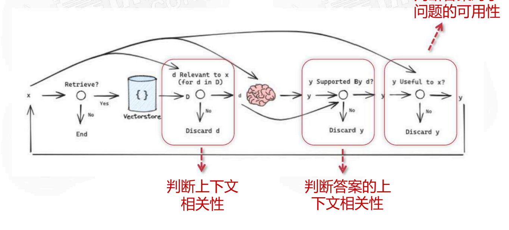

<!-- PDF 第 44 页 -->

- RAG新范式：self-RAG

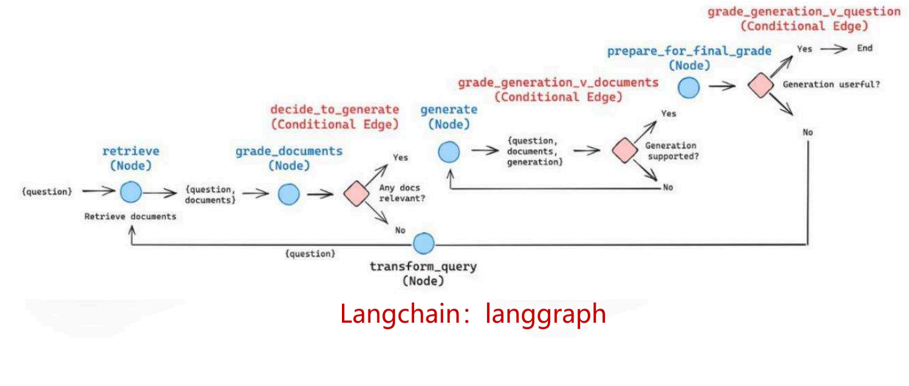

<!-- PDF 第 45 页 -->

## 总结和展望

### 检索增强技术回顾

- 总结

- RAG检索增强
  - RAG设计框架：Navie RAG、Advanced RAG和Modular RAG
  - 检索形态：基于文本匹配统计的稀疏检索（TF-IDF和BM25），基于语义embedding的稠密检索（BGE/GTE）
  - 用户问题的多样性：引出检索增强技术

<!-- PDF 第 46 页 -->

- 总结

- 查询增强
  - 目的：从用户问题出发对查询进行转换，
  - Query2Doc、HyDE：查询生成假设性的文档，来增加额外的信息来增加上下文的匹配
  - 查询改写、子问题查询：对问题进行重写，对复杂问题进行拆解
  - Take step back：对问题进行抽象化处理，去除无畏的细节，增加匹配度

<!-- PDF 第 47 页 -->

- 总结

- 多索引检索
  - 父子检索：从文档的大小颗粒度来建立索引，用小文档来检索，返回大文档用做上下文
  - 总结检索：从文档的信息摘要来建立索引，用大文档的摘要来检索，返回大文档用做上下文
  - 假设性问题检索：从问题这一个颗粒度来建立索引，实现问题和问题的匹配检索，用大文档逆向衍生出来的不同角度的假设性问题来检索，返回大文档用做上下文

<!-- PDF 第 48 页 -->

- 总结

- 检索后增强
  - 融合检索：综合基于关键词匹配的稀疏检索和基于语义的稠密检索的特点，重点是对于两种检索方法得到的文档，根据加权倒数排名来计算融合分数，以此来确定融合后的文档的排序
  - 重排序rerank：对于检索到众多文档，利用模型的能力来评分，评分越高和问题越相关，rerank是在基于相似度检索的基础上，从另外一种维度来对检索文档进行精排

<!-- PDF 第 49 页 -->

- 总结

- 模块化系统增强
  - 迭代检索增强生成：从迭代的角度利用每次迭代的生成的答案来进行增加检索的相关性，以此来提升检索的性能
  - Self-RAG：RAG新范式，将评判步骤添加到RAG的流程中，使得可以根据RAG流程每个步骤的结果的好坏来动态的选择优化策略

<!-- PDF 第 50 页 -->

### 企业代码规范与代码管理

- 关于企业里需要良好的代码规范和代码管理

- 代码规范
  - 项目开始要做的事项：一般项目成立之初，都会对项目的代码开发做一定的规范约定
  - 规范约定：保持项目的一致性风格，促进项目团队协作和代码维护，提高工作效率
  - 个人的专业形象：形成自己好的代码规范是一个优秀开发者的能力的体现

<!-- PDF 第 51 页 -->

- 关于企业里需要良好的代码规范和代码管理

- 代码规范约定
  - 命名约定：规定如何为变量、函数、类、文件等命名，驼峰（camelCase）或下划线（snake_case）
  - 代码格式：包括缩进风格（如使用空格或制表符）、每行字符的最大长度、空行的使用等
  - 注释：指导如何编写注释，以便解释复杂的逻辑或算法。注释应当简明扼要，并为其他开发者提供有用的信息

<!-- PDF 第 52 页 -->

- 关于企业里需要良好的代码规范和代码管理

- 代码规范约定
  - 代码结构：涵盖代码的组织方式，包括文件和目录的布局、模块化设计、类和函数的结构等
  - 错误处理：规定如何进行错误处理和异常捕获，以提高代码的稳健性和可靠性
  - 设计规范原则：开闭原则、单一职责原则、接口隔离原则、迪米特法则、里氏替换原则、依赖倒置原则

<!-- PDF 第 53 页 -->

Google Python的开发规范说明

- 关于企业里需要良好的代码规范和代码管理

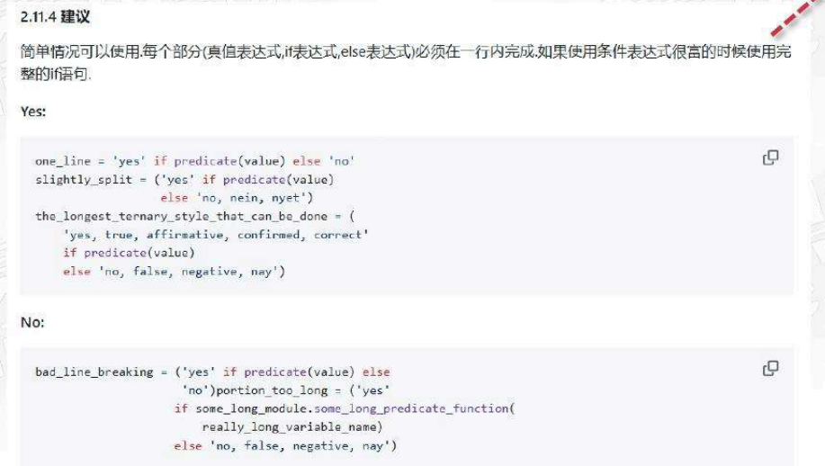

https://github.com/shendeguize/GooglePythonStyleGuideCN

<!-- PDF 第 54 页 -->

Google C++的开发规范说明

- 关于企业里需要良好的代码规范和代码管理

<!-- PDF 第 55 页 -->

- 关于企业里需要良好的代码规范和代码管理

- 代码管理
  - 目的：保存代码开发过程的每次变化（commit），方便组织、跟踪和协作开发
  - 代码管理工具：svn/git（分布式版本控制系统）
  - GIT使用：约定分支策略，来协同开发和上线。包括使用master作生产分支，develop作开发分支，feature特性分支用于新功能开发，hotfix修复分支用于修复问题

<!-- PDF 第 56 页 -->

合并到master分支，完成一次开发

- 关于企业里需要良好的代码规范和代码管理

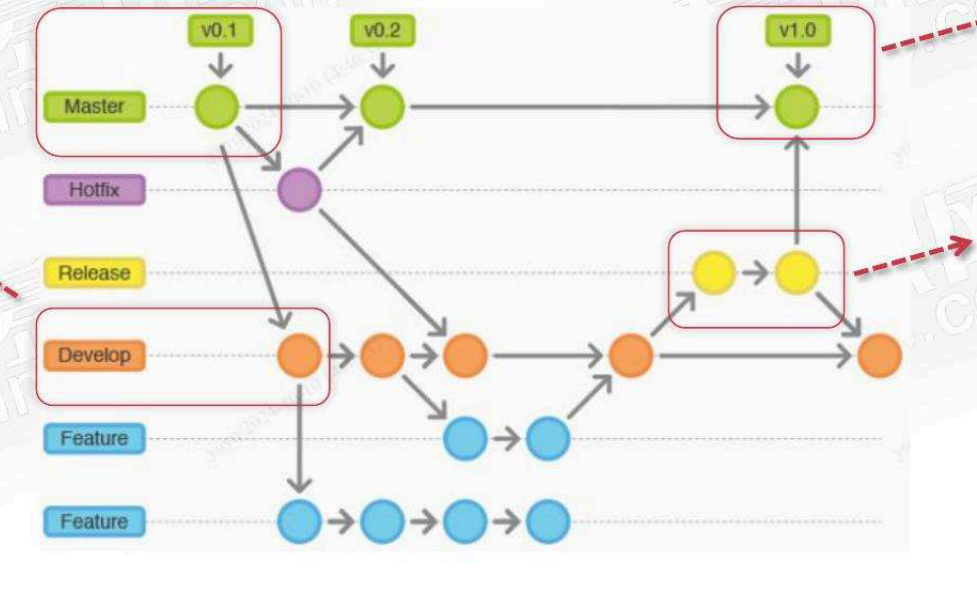

从master创建一个分支作为开发分支

打一个release分支或者tag分支来上线部署

<!-- PDF 第 57 页 -->

- 关于企业里需要良好的代码规范和代码管理

- AI应用开发
  - 变化和不确定性：通过迭代去尝试不同的方案，整个过程中需要跟踪尝试了哪些方案，用了哪个提示词
  - 用GIT来管理过程：不同的方案有不同的参数和提示词，这些过程的数据也需要记录下来以便比较，这些操作也可以作为一个小的版本，在git本地仓库中进行管理，不同的方案通过分支名称区分
