# 从RAG到Graph RAG 让企业知识图谱更智能

<!-- PDF 第 1 页 -->
<a id="page-001"></a>

## 目录

- [本章简介](#page-002)
- [认识知识图谱](#page-005)
  - [知识图谱的定义](#topic-005)
  - [三元组与关系表达](#topic-006)
  - [知识图谱的主要特点](#topic-009)
  - [知识图谱应用案例](#topic-010)
  - [金融知识图谱数据](#topic-013)
- [如何存储和操作知识图谱](#page-018)
  - [Neo4j与NebulaGraph对比](#topic-018)
  - [Neo4j安装与启动](#topic-022)
  - [Neo4j可视化界面](#topic-023)
  - [Cypher查询语法](#topic-024)
- [如何构建Graph RAG](#page-030)
  - [RAG与Graph RAG的差异](#topic-030)
  - [关联查询与推理场景](#topic-034)
  - [Graph RAG构建流程](#topic-038)
  - [关键词提取提示词](#topic-040)
  - [从文本中提取三元组](#topic-041)
- [总结和展望](#page-042)
  - [知识图谱与Graph RAG回顾](#topic-042)
  - [持续学习与跟进前沿技术](#topic-044)

---

<!-- PDF 第 2 页 -->
<a id="page-002"></a>

## 本章简介

- 知识图谱（Knowledge Graph）是一种大规模的图结构数据库，用于存储和表示实体（如人、地点、事物、概念等）、属性（如名称、类型、描述等）以及这些实体之间的关系

- 知识图谱旨在将现实世界中的信息以结构化的方式组织起来，使得机器可以更加高效地理解和处理这些信息

<!-- PDF 第 3 页 -->
<a id="page-003"></a>


- 知识图谱（Knowledge Graph）中存储了丰富的语义相关数据，如何将知识图谱引入RAG系统中提升RAG性能是一个有意义的工作？

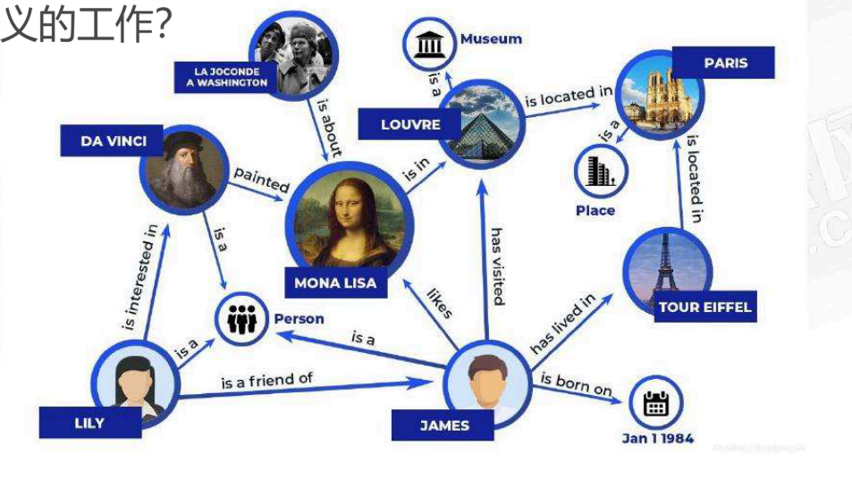

<!-- PDF 第 4 页 -->
<a id="page-004"></a>


- 认识金融智库知识图谱数据：特别的知识三元组
- 如何存储和操作知识图谱：neo4j和nebulagraph
- 动手构建金融智库知识图谱
- RAG和Graph RAG有什么区别？
- 构建金融智库Graph RAG
- 总结和展望：如何自我学习，跟进前沿技术


<!-- PDF 第 5 页 -->
<a id="page-005"></a>

## 认识知识图谱

<a id="topic-005"></a>

### 知识图谱的定义

- 什么是知识图谱

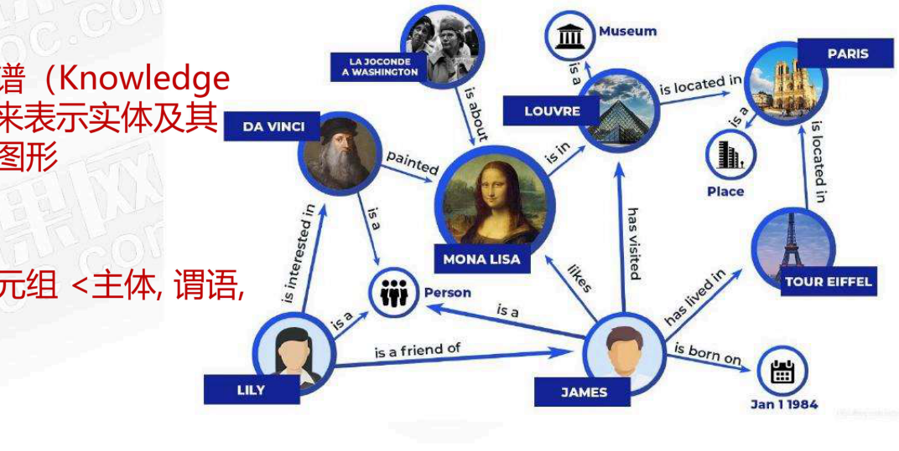

概念：知识图谱（Knowledge Graph）是用来表示实体及其关系的结构化图形

组成部分：三元组 &lt;主体，谓语，客体&gt;

<!-- PDF 第 6 页 -->
<a id="page-006"></a>

<a id="topic-006"></a>

### 三元组与关系表达

- 什么是知识图谱：三元组

- 主体（Subject）：指的是要描述的实体或对象。在知识图谱中，主体通常是某个具体的节点，代表一个实体，比如某个人、地点或事物
- 谓语（Predicate）：指的是主体和客体之间的关系或属性。谓语通常是一个动词或动词短语，描述了主体与客体之间的连接方式
- 客体（Object）：指的是与主体相关联的另一个实体或一个具体的属性值。客体可以是另一个实体（节点）或者是一个字面量（literal），如字符串、数字等

<!-- PDF 第 7 页 -->
<a id="page-007"></a>


- 什么是知识图谱：三元组

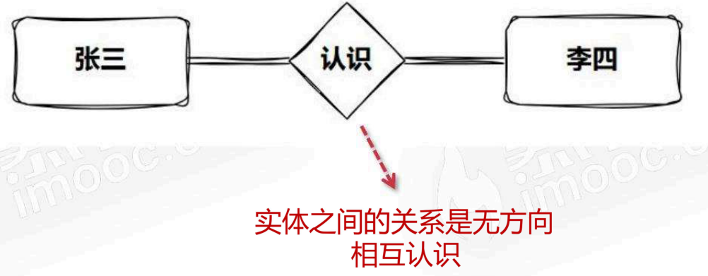

<!-- PDF 第 8 页 -->
<a id="page-008"></a>


- 什么是知识图谱：三元组

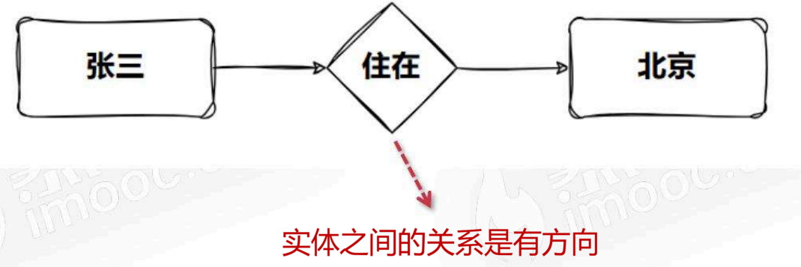

<!-- PDF 第 9 页 -->
<a id="page-009"></a>

<a id="topic-009"></a>

### 知识图谱的主要特点

- 什么是知识图谱：主要特点

- 图形结构化数据表示
  - 节点代表实体，边代表实体之间的关系。这使得信息在语义层面上更具关联性
- 语义丰富性
  - 明确的关系类型和属性来描述不同实体之间的连接。有助于更深层次的理解和推理
- 支持推理和推断
  - 能够从已知信息中推断出新的事实。例如，通过关系链的传递性或对称性来推断新的关联

<!-- PDF 第 10 页 -->
<a id="page-010"></a>

<a id="topic-010"></a>

### 知识图谱应用案例

- 什么是知识图谱：应用案例

- 医疗诊断
  - 应用场景：通过知识图谱整合患者的症状、体征、病史和医学知识库，进行疾病推断和诊断
  - 输入：患者报告的症状，如发烧、咳嗽、呼吸困难
  - 图谱数据：将这些症状与疾病节点连接，图谱中有疾病与症状的关联，例如，图中可能有信息显示“流感”与“发烧”、“咳嗽”相关
  - 推断：通过推理引擎，结合症状与疾病的关联，可能推断出最可能的疾病，如流感或肺炎

<!-- PDF 第 11 页 -->
<a id="page-011"></a>


- 什么是知识图谱：应用案例

- 推荐系统
  - 应用场景：在电商平台上，利用知识图谱进行商品推荐
  - 输入：用户的浏览历史、购买记录
  - 图谱数据：商品之间的关系，用户的兴趣图谱。例如，用户A购买过的商品X与商品Y在图谱中有“经常一起购买”的关系
  - 推断：结合用户的过去行为和商品关系，推断用户可能还对商品Y感兴趣，从而进行推荐

<!-- PDF 第 12 页 -->
<a id="page-012"></a>


- 什么是知识图谱：应用案例

- 问答系统
  - 应用场景：智能问答系统，基于知识图谱回答用户的问题
  - 输入：用户问题，如“爱因斯坦在哪一年出生？”
  - 图谱数据：包含人物、生平事件、时间等节点。例如，爱因斯坦节点与“出生年份”属性的值是1879
  - 推断：通过查询知识图谱，找到爱因斯坦节点，并提取“出生年份”属性，返回答案“1879”

<!-- PDF 第 13 页 -->
<a id="page-013"></a>

<a id="topic-013"></a>

### 金融知识图谱数据

- 什么是知识图谱：金融知识图谱数据

- 金融智库
  - 知识图谱数据：金融实体的风险事件数据、企业投资数据
  - 目的：快速收集企业之间的投资关系和风险事件，辅助金融决策和金融投研业务

<!-- PDF 第 14 页 -->
<a id="page-014"></a>


- 什么是知识图谱：金融知识图谱数据

- 风险事件数据
  - 数据：事件描述了金融实体在市场行为、财报信息、公司运营、信用评估、公司声誉出现的一些问题，比如哪个企业发生了债务危机，裁员了等等，这些都是企业面临危机的信号。这些事件来自各大主流财经类资讯平台、传统媒体、新媒体的报导

<!-- PDF 第 15 页 -->
<a id="page-015"></a>


- 什么是知识图谱：金融知识图谱数据

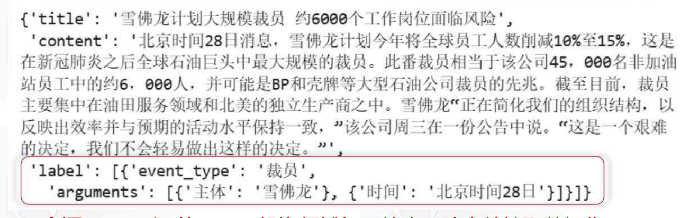

来源：openkg的IREE：投资领域细颗粒度风险事件抽取数据集

数据分布：描述了15个行业、4000家A股上市公司、59个风险事件

<!-- PDF 第 16 页 -->
<a id="page-016"></a>


- 什么是知识图谱：金融知识图谱数据

- 企业投资数据
  - 数据：描述投资机构对企业的投资关系

<!-- PDF 第 17 页 -->
<a id="page-017"></a>


- 什么是知识图谱：金融知识图谱数据

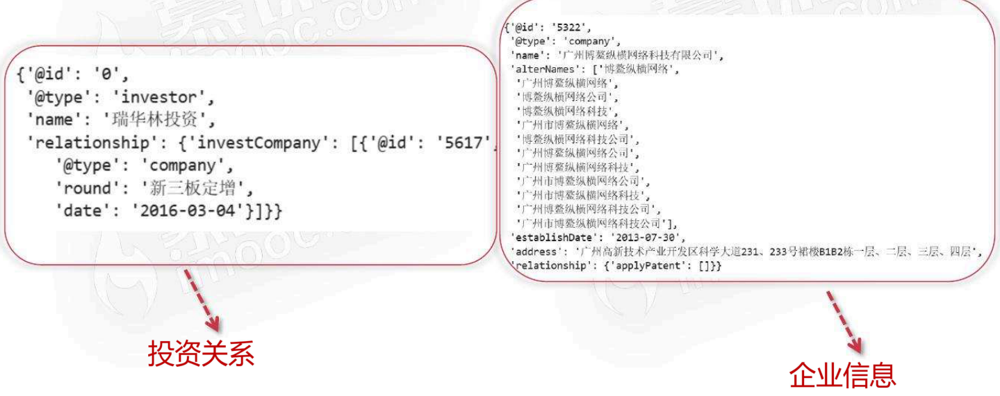

<!-- PDF 第 18 页 -->
<a id="page-018"></a>

## 如何存储和操作知识图谱

<a id="topic-018"></a>

### Neo4j与NebulaGraph对比

- 常用图数据：neo4j和nebulagraph

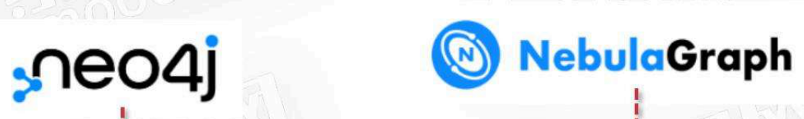

擅长处理千亿节点万亿条边的超大数据集，同时保持毫秒级查询延时的图数据库解决方案

Neo4j是一个高性能的NoSQL图形数据库，支持Cypher查询语言，适合于处理复杂的关系数据

<!-- PDF 第 19 页 -->
<a id="page-019"></a>


- 常用图数据：neo4j和nebulagraph

| 能力 | Nebula Graph | Neo4j |
| --- | --- | --- |
| 数据模型 | 基于图数据模型，使用节点、边和属性表示实体及其关系 | 基于图数据模型，使用节点、关系和属性表示数据 |
| 分布式能力 | 从一开始就设计为分布式系统，可以水平扩展以应对大数据量和高并发访问 | 最初不是分布式设计，但支持集群模式以实现水平扩展 |

<!-- PDF 第 20 页 -->
<a id="page-020"></a>


- 常用图数据：neo4j和nebulagraph

| 能力 | Nebula Graph | Neo4j |
| --- | --- | --- |
| 事务支持 | 支持事务处理，保证数据一致性和可靠性 | 支持完整的ACID规则，保证数据可靠性和一致性 |
| 查询语言 | 使用GQL（Graph Query Language），过程式语言，适用于复杂图查询 | 使用Cypher查询语言，声明式语言，易于学习且功能丰富 |

<!-- PDF 第 21 页 -->
<a id="page-021"></a>


- 常用图数据：neo4j和nebulagraph


在小规模数据集上通常表现出色，提供了丰富的图形界面工具和查询语言，便于数据的可视化和查询。Cypher更易于编写复杂的查询

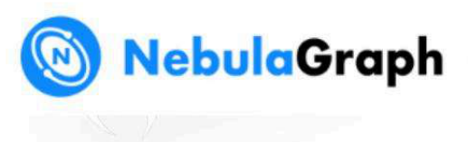

适用于处理大规模数据集和高并发访问的场景，特别是在导入效率和特定类型的图查询方面表现出色；

<!-- PDF 第 22 页 -->
<a id="page-022"></a>

<a id="topic-022"></a>

### Neo4j安装与启动

- neo4j使用-安装

- 安装依赖
  - Neo4j底层是java，需要依赖JDK（OpenJDK / oracle JDK）

- 下载neo4j
  - 社区版本 neo4j 5.23，解压

- 启动服务
  - neo4j start/ neo4j stop /http://localhost:7474

<!-- PDF 第 23 页 -->
<a id="page-023"></a>

<a id="topic-023"></a>

### Neo4j可视化界面

- neo4j使用-可视化界面

执行cypher命令

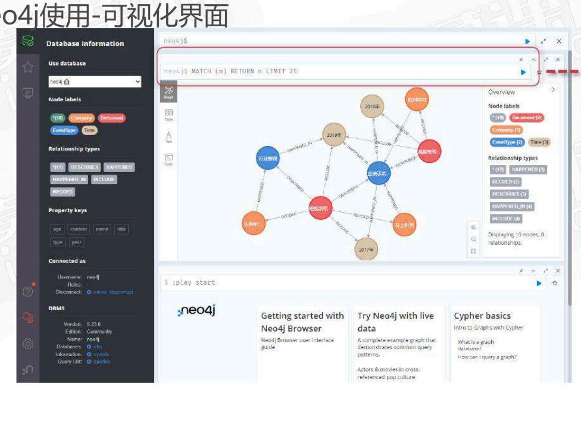

<!-- PDF 第 24 页 -->
<a id="page-024"></a>

<a id="topic-024"></a>

### Cypher查询语法

- neo4j使用-cypher查询语法

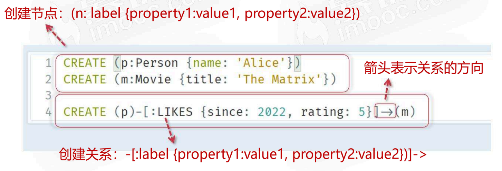

<!-- PDF 第 25 页 -->
<a id="page-025"></a>


- neo4j使用-cypher查询语法

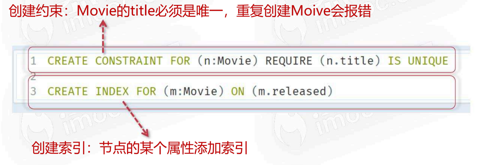

<!-- PDF 第 26 页 -->
<a id="page-026"></a>


- neo4j使用-cypher查询语法

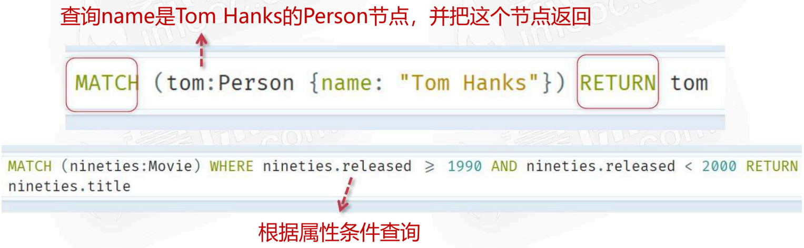

<!-- PDF 第 27 页 -->
<a id="page-027"></a>


查询name是Tom Hanks的 ACTED_IN

- neo4j使用-cypher查询语法

的所有电影

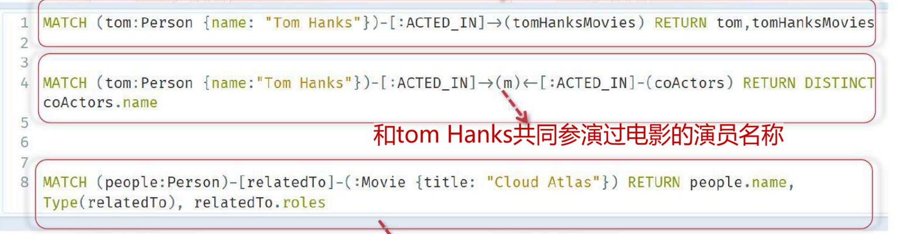

和Cloud Atlas有关系的所有人，返回什么关系

<!-- PDF 第 28 页 -->
<a id="page-028"></a>


- neo4j使用-cypher查询语法

2个跳连接以内所有节点


<!-- PDF 第 29 页 -->
<a id="page-029"></a>


- neo4j使用-cypher查询语法

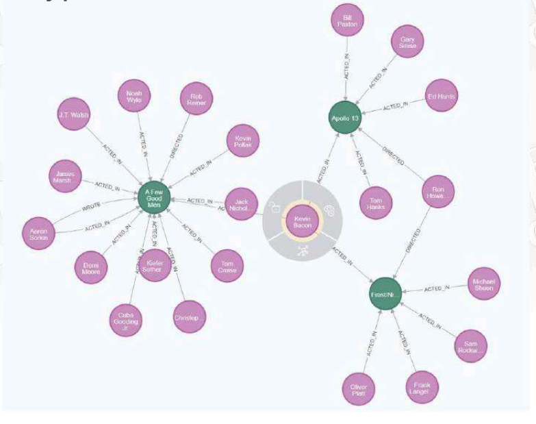

<!-- PDF 第 30 页 -->
<a id="page-030"></a>

## 如何构建Graph RAG

<a id="topic-030"></a>

### RAG与Graph RAG的差异

- RAG和Graph RAG有什么区别？

- 知识的表达
  - RAG：采用平面文档结构来表示知识
  - Graph RAG：使用图结构来表示知识，这种结构能更自然地表示层级和非层级关系，更贴近现实世界的知识组织方式

<!-- PDF 第 31 页 -->
<a id="page-031"></a>


- RAG和Graph RAG有什么区别？

- 检索机制
  - RAG：主要依赖向量相似度搜索来检索信息
  - Graph RAG：采用图遍历算法进行信息检索，能够捕捉和利用信息片段之间的复杂关系，提供更丰富、更具语境的信息检索结果

<!-- PDF 第 32 页 -->
<a id="page-032"></a>


- RAG和Graph RAG有什么区别？

- 上下文理解能力
  - RAG：在理解复杂的多步骤关系方面存在局限
  - Graph RAG：能够捕捉更复杂的多步骤关系，这些关系在RAG中可能被忽略

<!-- PDF 第 33 页 -->
<a id="page-033"></a>


- RAG和Graph RAG有什么区别？

- 推理能力
  - RAG：推理能力相对有限
  - Graph RAG：图结构支持对相互关联信息进行更深入、更复杂的推理

<!-- PDF 第 34 页 -->
<a id="page-034"></a>

<a id="topic-034"></a>

### 关联查询与推理场景

- RAG和Graph RAG有什么区别？

- Graph RAG
  - 多跳关系查询：在xxx的同学的朋友中，谁在阿里巴巴工作？
  - 语义关联查询：哪些公司提供LLM产品，并且已经取得国家认证许可？
  - 知识推理查询：根据患者的症状和病史，推断可能的疾病并提供治疗方案
  - 涉及聚合统计查询：过去两年中大模型增加了多少，哪些公司占主导地位？
  - 时序关联查询：查询过去10年的xxx公司的投资与并购事件？

<!-- PDF 第 35 页 -->
<a id="page-035"></a>


- RAG和Graph RAG有什么区别？

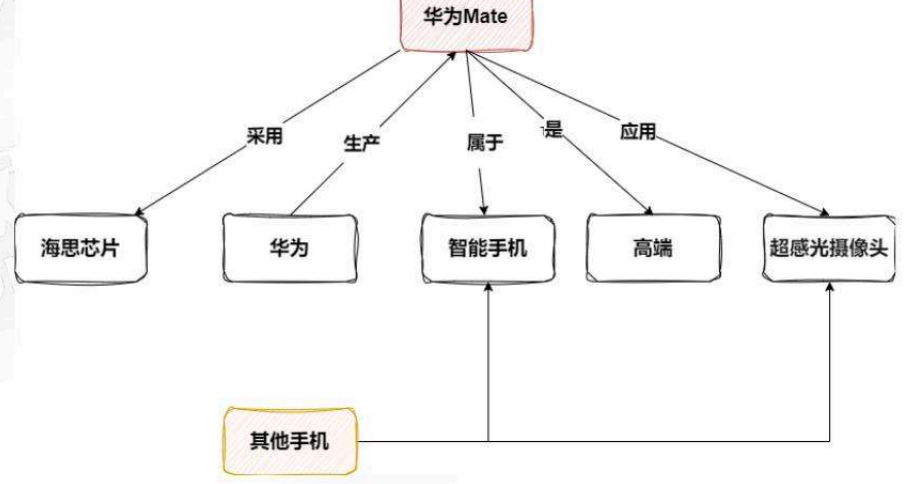

GraphRAG：还有哪些采用超感光摄影的手机？

RAG：如果没有明显的文本块匹配这里的问题，就需要依赖程序对此进行查询分解与规划

<!-- PDF 第 36 页 -->
<a id="page-036"></a>


- RAG和Graph RAG有什么区别？

GraphRAG：有哪些适合拍摄高质量视频的智能手机，并且具有良好的用户口碑？

RAG：通过如“智能手机”、“视频”、“良好口碑”等关键词检索近似文本块，如果存储的文本块中没有同时提到这些关键的评价信息，系统可能会返回一些仅与部分关键词相关的内容，

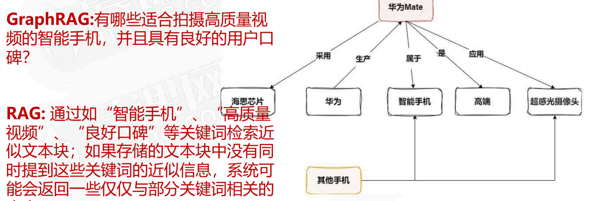

<!-- PDF 第 37 页 -->
<a id="page-037"></a>


- RAG和Graph RAG有什么区别？

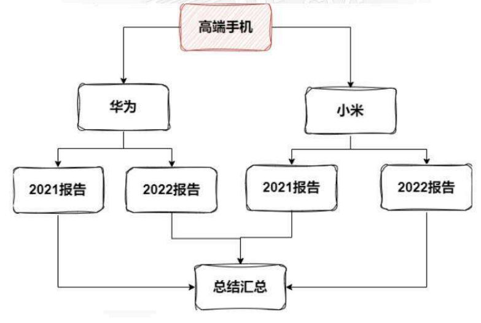

GraphRAG：最近几年高端智能手机的整体发展趋势是怎样的？

RAG：可能会检索到包含“高端智能手机”、“发展”或“最近几年”等关键词的文本块，但难以将这些块串联起来，形成一个连贯的趋势叙事。会导致结果往往是片段化的信息，难以全面地回答查询

<!-- PDF 第 38 页 -->
<a id="page-038"></a>

<a id="topic-038"></a>

### Graph RAG构建流程

- 构建Graph RAG的过程

1. 提取问题中的关键词信息
2. 根据关键词信息检索图数据库
3. 拼接检索得到信息作为上下文，送到大语言模型来生成答案

<!-- PDF 第 39 页 -->
<a id="page-039"></a>


- 构建Graph RAG的过程

总结下哪些公司进行了企业转型

总结、公司、企业转型

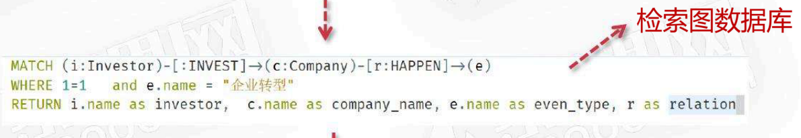

LLM

<!-- PDF 第 40 页 -->
<a id="page-040"></a>

<a id="topic-040"></a>

### 关键词提取提示词

- 构建Graph RAG的过程-提取关键词

提取关键词prompt

给定一些初始查询，提取最多 `{max_keywords}` 个相关关键词，考虑大小写、复数形式、常见表达等。
用 `'^'` 符号分隔所有同义词/关键词：`'关键词1^关键词2^...'`

注意，结果应为一行，用 `'^'` 符号分隔。

---

查询：`{query_str}`

---

关键词：

<!-- PDF 第 41 页 -->
<a id="page-041"></a>

<a id="topic-041"></a>

### 从文本中提取三元组

- 构建Graph RAG的过程-从文本中构建三元组

下面提供了一些文本。根据文本，提取最多 `{max_knowledge_triplets}` 个知识三元组，形式为（实体,关系,实体或属性）。避免使用停用词。仅输出三元组，不要有多余解释和说明。

---

示例：

文本：麦迪是姚明的队友。

三元组：麦迪,队友,姚明

文本：阿里巴巴是马云在1999年创立的公司

三元组：

```text
阿里巴巴,是,公司
阿里巴巴,创立于,马云
阿里巴巴,创立于,1999年
```

---

文本：`{text}`

三元组：

<!-- PDF 第 42 页 -->
<a id="page-042"></a>

## 总结和展望

<a id="topic-042"></a>

### 知识图谱与Graph RAG回顾

- 总结

- Graph RAG
  - 三元组：通过三元组&lt;主体，谓语，客体&gt;了解什么是知识图谱，并了解知识图谱的应用场景
  - 图形化关系结构：可以表达更丰富的关系语义信息，支持深入的逻辑推理
  - Nebulagraph和neo4j：常用的图数据库

<!-- PDF 第 43 页 -->
<a id="page-043"></a>


- 总结

- Graph RAG
  - neo4j：安装部署、通过cypher去使用neo4j
  - RAG和Graph RAG区别：Graph RAG可以很好的支持众多关联查询（多跳关系，语义关联，知识推理等）
  - 给出了构建Graph RAG的过程

<!-- PDF 第 44 页 -->
<a id="page-044"></a>

<a id="topic-044"></a>

### 持续学习与跟进前沿技术

- 展望：如何自我学习，跟进前沿技术

AI技术 → 发展太快了 → 终生学习

<!-- PDF 第 45 页 -->
<a id="page-045"></a>


- 展望：如何自我学习，跟进前沿技术

- 入门一个全新领域
  - 找到领域的关键词：可以从综述出发找到关键词，去了解关键词的含义，从这些关键词就可以知道领域最重要的是什么
  - 阅读3-5经典的专业书籍或论文：搭建基础的理论知识
  - 跟随领域专家：找到这个领域的专家，阅读他们的观点，分析和复述他们的观点

<!-- PDF 第 46 页 -->
<a id="page-046"></a>


- 展望：如何自我学习，跟进前沿技术

- 跟进前沿技术
  - 获取技术的渠道：技术公众号，技术媒体号，B站，youtube、paperwithcode等，可以通过这些获取最新技术的报导，对技术发展趋势有一个大概的认识
  - 深入了解：对于你感兴趣的技术，做深入的阅读（论文/代码），由粗到细（借助AI辅助阅读+公开的视频的讲解+自己精读+代码的实现）
  - 定期看综述性文章

<!-- PDF 第 47 页 -->
<a id="page-047"></a>


- 展望：如何自我学习，跟进前沿技术

- 跟进前沿技术
  - 形成结构化的知识：写专栏，blog和学习笔记，形成对知识的结构化认识和本质的认识
  - 费曼学习法：说出你的知识
