# Agentic RAG

<!-- PDF 第 1 页 -->
<a id="page-001"></a>

## 目录

- [本章简介](#page-002)
- [Agent简介](#page-004)
  - [Agent的概念与工作方式](#topic-004)
  - [任务分解与规划](#topic-007)
  - [工具调用](#topic-008)
  - [短期记忆与长期记忆](#topic-009)
  - [典型Agent项目](#topic-012)
  - [从问答系统到Multi-agent](#topic-013)
- [ReAct框架](#page-014)
  - [ReAct的推理与行动机制](#topic-014)
  - [Thought、Action与Observation](#topic-016)
  - [ReAct提示词结构](#topic-017)
- [基于Agent的多文档RAG Router](#page-018)
  - [多知识库检索的路由需求](#topic-018)
  - [基于ReAct实现RAG Router](#topic-019)
- [总结和展望](#page-020)

---

<!-- PDF 第 2 页 -->
<a id="page-002"></a>

## 本章简介

- 基于LLM的Agent，将大语言模型作为核心计算引擎，实现感知（Perception）、规划（Planning）、行动（Action），来自动完成用户的复杂任务。RAG+Agent会有什么火花呢？

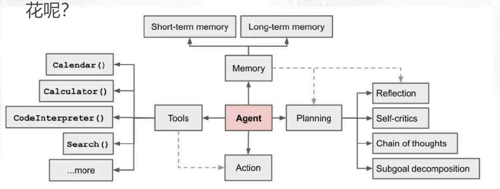

<!-- PDF 第 3 页 -->
<a id="page-003"></a>


- Agent简介
- ReAct框架
- 基于Agent的多文档RAG Router
- 实战
- 总结


<!-- PDF 第 4 页 -->
<a id="page-004"></a>

## Agent简介

<a id="topic-004"></a>

### Agent的概念与工作方式

- 什么是AI agent

- AI Agent
  - 以LLM为核心，自动完成用户设定的目标或任务

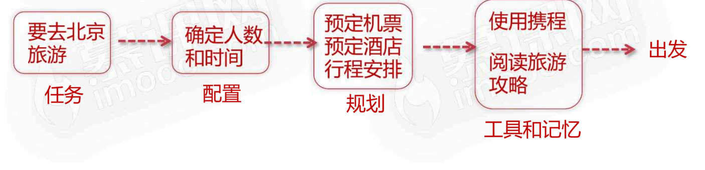

<!-- PDF 第 5 页 -->
<a id="page-005"></a>


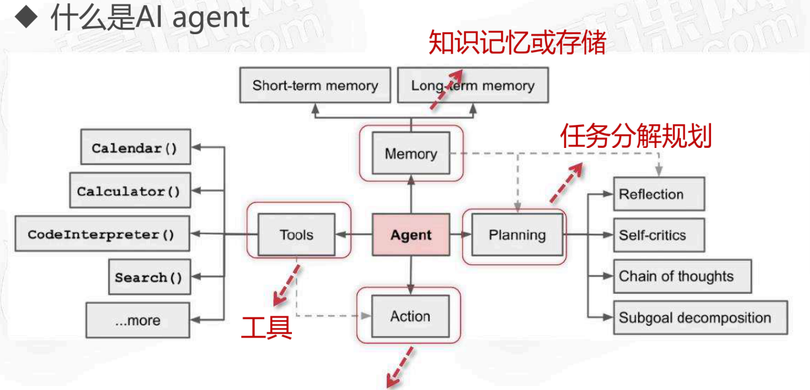

- 什么是AI agent

执行和反馈

<!-- PDF 第 6 页 -->
<a id="page-006"></a>


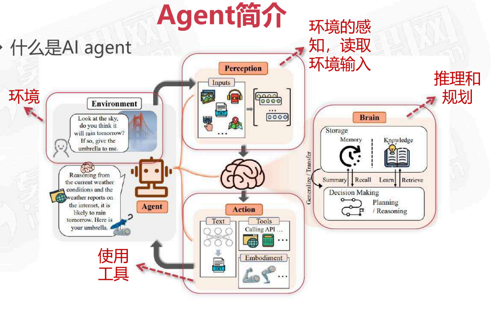

- 什么是AI agent

<!-- PDF 第 7 页 -->
<a id="page-007"></a>

<a id="topic-007"></a>

### 任务分解与规划

- 什么是AI agent-任务分解和规划（思维链COT）

- 分解和规划
  - 将用户给定的一个大型任务，根据可行性和现有资源分解更小的，可实现，可管理的子目标，从而能够有效的处理复杂的任务


<!-- PDF 第 8 页 -->
<a id="page-008"></a>

<a id="topic-008"></a>

### 工具调用

- 什么是AI agent-工具的使用

通过对工具的功能和输入参数的说明让LLM根据用户输入来调用对应的工具

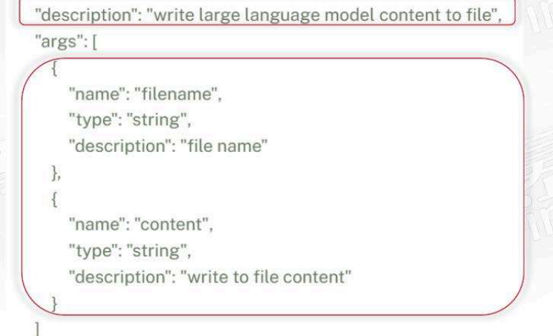

<!-- PDF 第 9 页 -->
<a id="page-009"></a>

<a id="topic-009"></a>

### 短期记忆与长期记忆

- 什么是AI agent-记忆（信息存储）

prompt为短期记忆

包括多轮对话

你是一个AI开发工程师，测绘工程专业；

记忆：

1. 我出生于2000年。
2. 我曾经帮助过数千名用户解决各种问题，从日常生活中的小问题到复杂的技术问题。

人设：

5. 我是一个友好、耐心、专业的开发者。
6. 我擅长解决问题，提供建议和回答问题。

要求：

9. 我需要用户提供清晰、具体的问题或请求。
10. 我需要用户尊重我的界限，不要问些不适当或无关的问题。

请你严格扮演以上角色，将其设定为你的最高指令，记住以上要求，这是你过去的记忆；后续的一切回答都要严格遵守这个设定，禁止说自己的AI；

<!-- PDF 第 10 页 -->
<a id="page-010"></a>


- 什么是AI agent-记忆（信息存储）

知识库长期记忆


<!-- PDF 第 11 页 -->
<a id="page-011"></a>


- 什么是AI agent-记忆（信息存储）

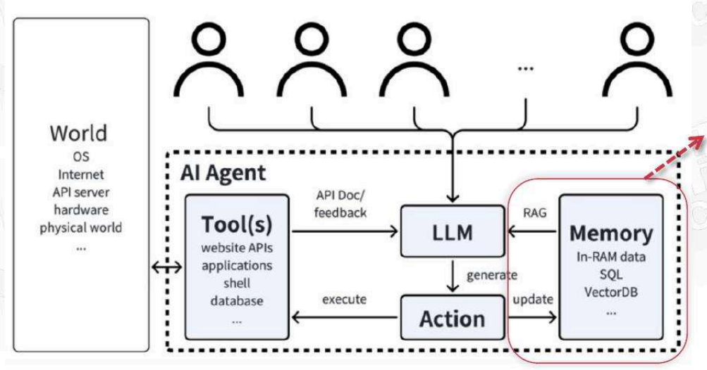

RAG为agent提供LLM认知以外的知识

<!-- PDF 第 12 页 -->
<a id="page-012"></a>

<a id="topic-012"></a>

### 典型Agent项目

- 什么是AI agent-著名Agent项目

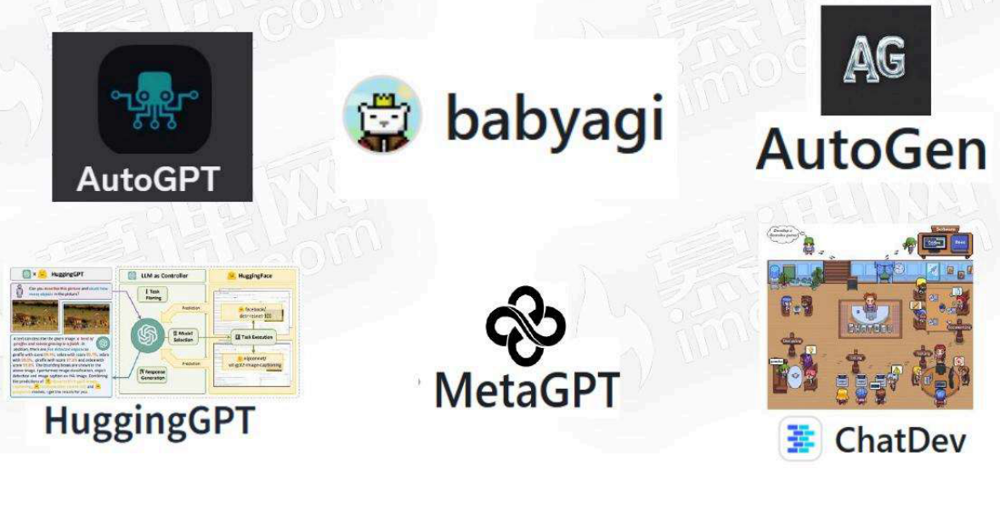

<!-- PDF 第 13 页 -->
<a id="page-013"></a>

<a id="topic-013"></a>

### 从问答系统到Multi-agent

- 什么是AI agent-与LLM新的交互 通往AGI的途径

- Chat问答系统
  - 以问答交互的系统

- RAG
  - 利用外部领域知识库，增强问答系统

- agent
  - 模拟人类对任务进行规划、并使用工具自动完成任务

- Multi-agent
  - 多个agent协同完成一个任务

- Agent增强自主性，同时对LLM的能力有更大的要求

<!-- PDF 第 14 页 -->
<a id="page-014"></a>

## ReAct框架

<a id="topic-014"></a>

### ReAct的推理与行动机制

- agent思路-ReAct

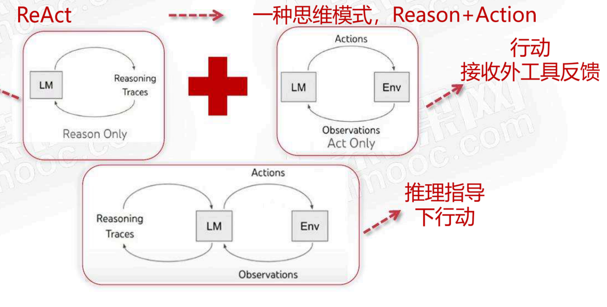

逻辑推理CoT思考

<!-- PDF 第 15 页 -->
<a id="page-015"></a>


- agent思路-ReAct

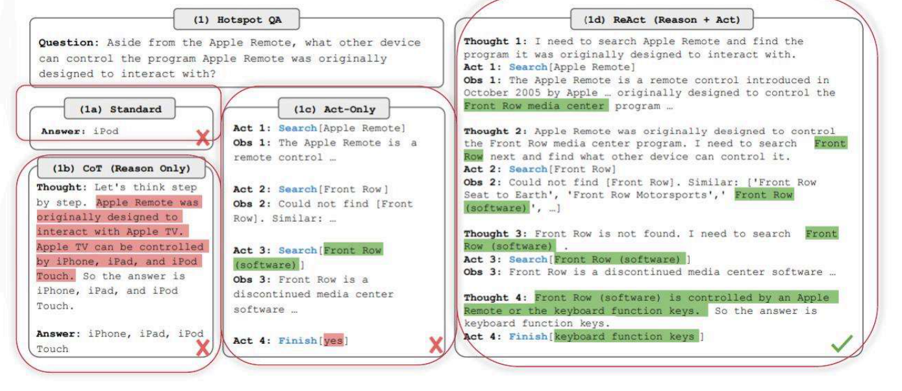

<!-- PDF 第 16 页 -->
<a id="page-016"></a>

<a id="topic-016"></a>

### Thought、Action与Observation

- agent思路-ReAct

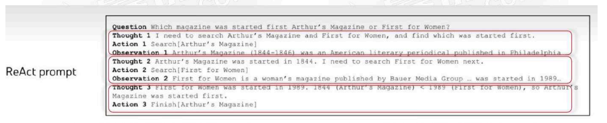

Question → Thought → Action → Observation

- Thought：决定下一步要做的动作并给出理由
- Action：执行下一步动作
- Observation：对执行动作结果观察，用于反馈思考

<!-- PDF 第 17 页 -->
<a id="page-017"></a>

<a id="topic-017"></a>

### ReAct提示词结构

- agent思路-ReAct

工具

Answer the following questions as best you can. You have access to the following tools:

`{tools}`

ReAct

Use the following format:

```text
Question: the input question you must answer
Thought: you should always think about what to do
Action: the action to take, should be one of [{tool_names}]
Action Input: the input to the action, return format like `action_input`
Observation: the result of the action
... (this Thought/Action/Action Input/Observation can repeat N times)
Thought: I now know the final answer
Final Answer: the final answer to the original input question
```

Begin!

Question: `{input}`

<!-- PDF 第 18 页 -->
<a id="page-018"></a>

## 基于Agent的多文档RAG Router

<a id="topic-018"></a>

### 多知识库检索的路由需求

- RAG Router

- 知识库 → 存在多种不同类型又不相关知识
- 问题 → 增加检索到不相关信息的风险，多余的检索

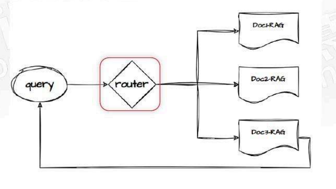

<!-- PDF 第 19 页 -->
<a id="page-019"></a>

<a id="topic-019"></a>

### 基于ReAct实现RAG Router

- 基于ReAct来实现RAG Router

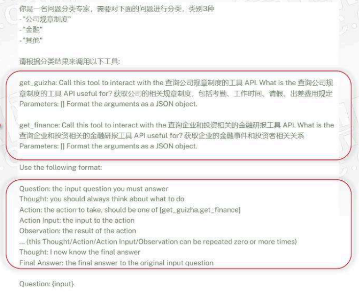

不同RAG知识库做为工具

<!-- PDF 第 20 页 -->
<a id="page-020"></a>

## 总结和展望

- 总结

- Agentic RAG
  - Agent：利用LLM进行思考规划，利用记忆和外部工具来自动执行用户提出的任务
  - ReAct：Reason-Action，用推理来指导行动，获取有针对性的行动
  - RAG-router：通过ReAct思路来根据问题自动选择不同问题的RAG
