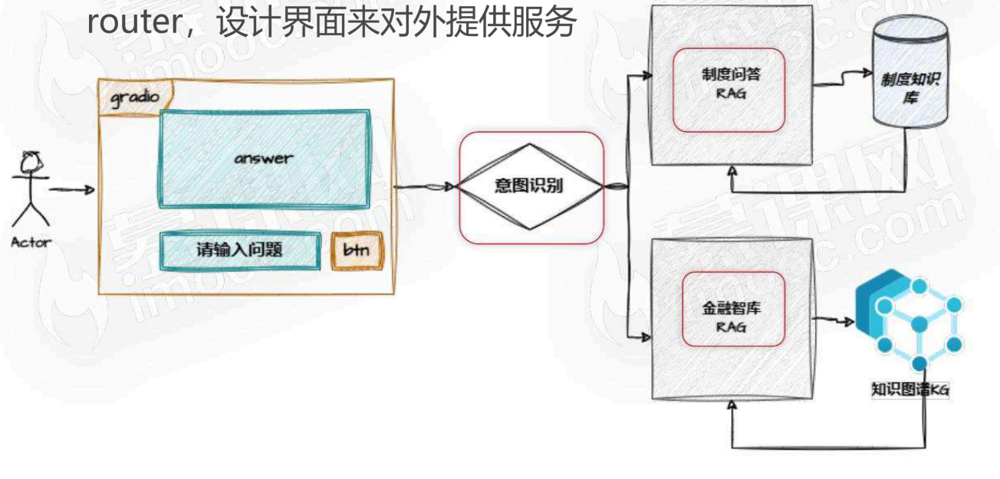
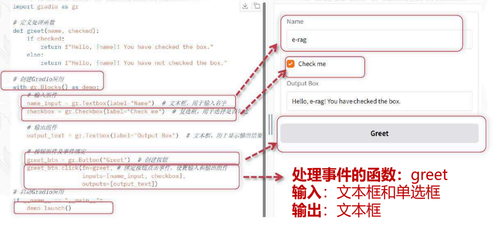
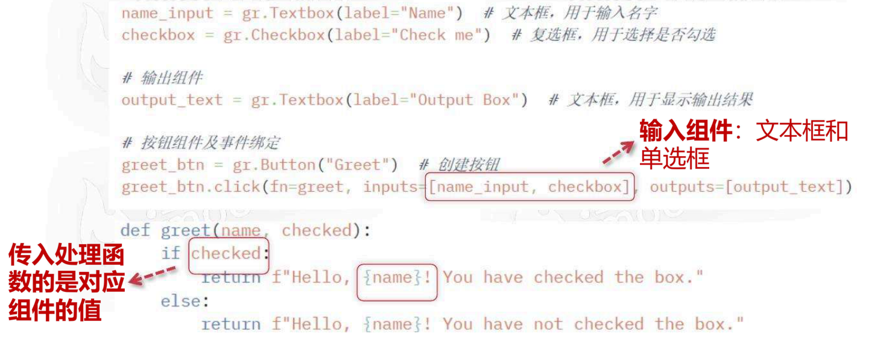
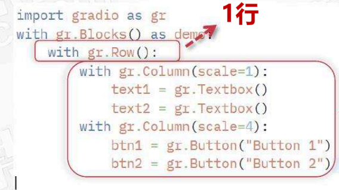
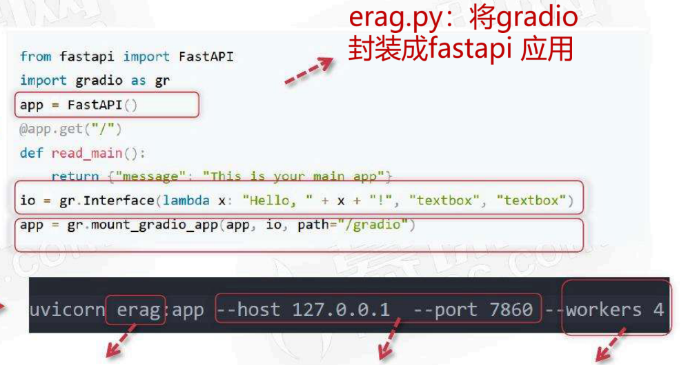

# 企业员工助手 界面开发

<!-- PDF 第 1 页 -->

## 目录

- [本章简介](#page-002)
- [Gradio介绍](#page-004)
  - [Gradio基础](#topic-004)
  - [事件处理](#topic-006)
  - [Row与Column布局](#topic-007)
  - [Chatbot组件](#topic-008)
- [界面设计](#page-009)
- [项目部署](#page-011)
  - [Uvicorn部署服务](#topic-011)
  - [FastAPI封装与启动配置](#topic-012)

---

<!-- PDF 第 2 页 -->

## 本章简介

- 整合制度问答组手和基于知识图谱的金融智库，以及RAG-router，设计界面来对外提供服务

<!-- PDF 第 3 页 -->

- Gradio介绍
- 界面设计
- 部署
- 实战

<!-- PDF 第 4 页 -->

## Gradio介绍

### Gradio基础

- gradio

- gradio
  - 一个强大的Python库，专注于快速创建简单、直观的用户web界面，让用户可以方便地与机器学习模型进行交互

<!-- PDF 第 5 页 -->

- gradio

<!-- PDF 第 6 页 -->

### 事件处理

- Gradio-事件处理

<!-- PDF 第 7 页 -->

### Row与Column布局

- Gradio-布局-Row and Column

1行

2列，2列比例 scale=1:4

<!-- PDF 第 8 页 -->

### Chatbot组件

- Gradio-chatbot组件

<!-- PDF 第 9 页 -->

## 界面设计

- 界面设计

上下文信息

<!-- PDF 第 10 页 -->

- 界面设计

上下文信息

<!-- PDF 第 11 页 -->

## 项目部署

### Uvicorn部署服务

- 部署

- uvicorn
  - 基于asyncio库开发的轻量级且高效的ASGI （Asynchronous Server Gateway Interface，异步服务器网关接口）服务器，用于构建异步Web服务

- uvicorn
  - Uvicorn适用于各种类型的Web应用程序，特别是需要高性能异步请求处理的场景

<!-- PDF 第 12 页 -->

### FastAPI封装与启动配置

- 部署

1. step1
   - erag.py：将gradio封装成fastapi应用
2. step2

- erag.py：文件名
- Ip和端口
- 进程数：并发数

http://127.0.0.1:7680/gradio
