# 项目进阶 RAG微调

<!-- PDF 第 1 页 -->
<a id="page-001"></a>

## 目录

- [本章简介](#page-002)
- [大语言模型高效微调方法LoRA](#page-004)
  - [微调与Prompt的区别](#topic-004)
  - [何时需要微调](#topic-005)
  - [PEFT：参数高效微调](#topic-006)
  - [LoRA原理与参数合并](#topic-008)
- [大语言模型微调框架：SWIFT](#page-011)
  - [MS-SWIFT介绍与安装](#topic-011)
  - [微调流程](#topic-013)
  - [训练数据与灾难性遗忘](#topic-014)
  - [LoRA训练参数](#topic-016)
  - [LoRA训练脚本](#topic-019)
  - [训练过程跟踪](#topic-021)
- [embedding模型微调](#page-023)
  - [Embedding微调的适用场景](#topic-023)
  - [Embedding微调流程](#topic-024)
  - [使用LlamaIndex与Sentence Transformers微调](#topic-025)
- [总结和展望](#page-027)

---

<!-- PDF 第 2 页 -->
<a id="page-002"></a>

## 本章简介

- embedding模型和大语言模型在向量检索和答案生成上起到重要的作用，是RAG的重要组成部分；如何提升它们的性能是一个值得挑战的任务

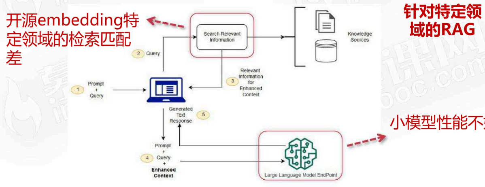

<!-- PDF 第 3 页 -->
<a id="page-003"></a>


- 大语言模型高效微调方法：LoRA
- 大语言模型微调框架swift
- Embedding模型微调
- 总结

<!-- PDF 第 4 页 -->
<a id="page-004"></a>

## 大语言模型高效微调方法LoRA

<a id="topic-004"></a>

### 微调与Prompt的区别

- 什么是微调 （finetune）

- Prompt提示词
  - 未改变大模型参数：没有改变大语言模型的内部的参数，只是通过调整输入来引导大语言模型来完成你的任务；in-context-learning 提供few shot例子

- 微调 （finetune）
  - 改变了大模型的参数：通过给定的训练数据，更新大语言模型内容的参数，来让大模型适配你的任务

<!-- PDF 第 5 页 -->
<a id="page-005"></a>

<a id="topic-005"></a>

### 何时需要微调

- 什么情况下需要微调（finetune）

一个问题？ → LLM

- 问题是不是没问清楚？ → 尝试调整prompt
- 是不是缺少领域知识？ → RAG
- 缺少领域内特定逻辑能力？ → 微调finetune
- 想用小模型来替代大模型提升效率 → 微调finetune

<!-- PDF 第 6 页 -->
<a id="page-006"></a>

<a id="topic-006"></a>

### PEFT：参数高效微调

- 参数高效的微调方法：PEFT

- 大语言模型训练成本高
  - 大模型参数量巨大：GPT3的参数量是1750亿，半精度参数文件大概350G；训练涉及的算力资源成本巨大，成百上千万的投入
- PEFT
  - Parameter Efficient Fine-Tuning
  - 只训练大模型的极少数参数：将大模型的参数固定住，添加少量的需要学习的参数，极大的降低训练的成本；

<!-- PDF 第 7 页 -->
<a id="page-007"></a>


- 参数高效的微调方法：PEFT

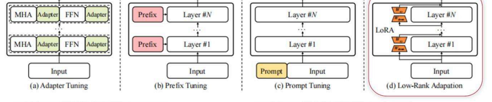

将大模型的参数固定住，只做前向推理，不参与训练，添加少量参数来训练

<!-- PDF 第 8 页 -->
<a id="page-008"></a>

<a id="topic-008"></a>

### LoRA原理与参数合并

- 参数高效的微调方法：LORA

- Low-Rank Adaptation思路
  - 低秩思维：大模型的参数是有冗余的
  - 参数矩阵的秩Rank：代表参数的信息量，是线性无关那部分参数

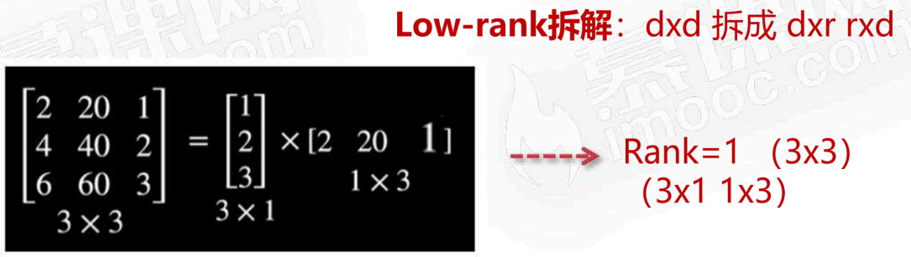

<!-- PDF 第 9 页 -->
<a id="page-009"></a>


- 参数高效的微调方法：LORA

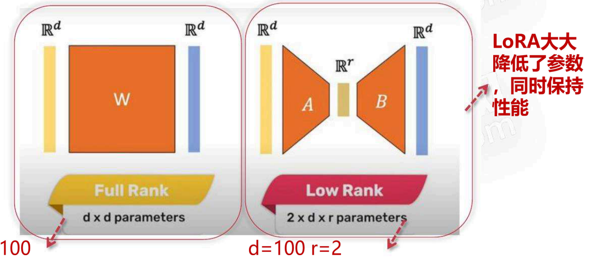

参数：100x2+2×100=400

参数：100x100=10000

<!-- PDF 第 10 页 -->
<a id="page-010"></a>


LoRA推理：可以合并参数，不影响推理性能

- 参数高效的微调方法：LORA

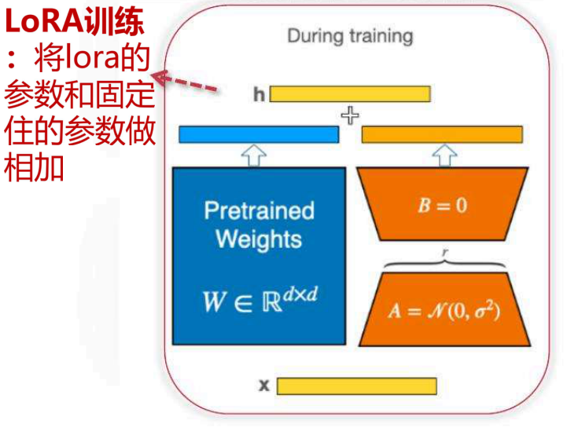

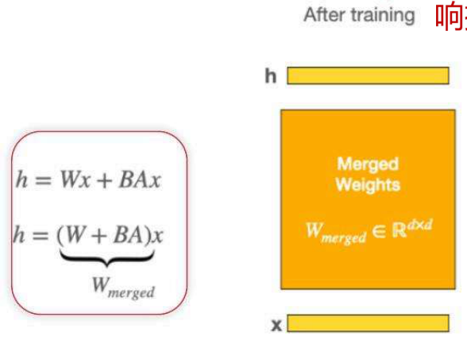

<!-- PDF 第 11 页 -->
<a id="page-011"></a>

## 大语言模型微调框架：SWIFT

<a id="topic-011"></a>

### MS-SWIFT介绍与安装

- 阿里modelscope：ms-swift

ms-swift

SWIFT支持350+ LLM和100+ MLLM（多模态大模型）的训练（预训练、微调、对齐）、推理、评测和部署。实现模型训练评测到应用的完整链路

安装

```sh
pip install 'ms-swift[llm]'
```


<!-- PDF 第 12 页 -->
<a id="page-012"></a>


- 阿里modelscope：ms-swift

- 模型
- 数据集
- 训练方法

swift提供训练和推理的webui

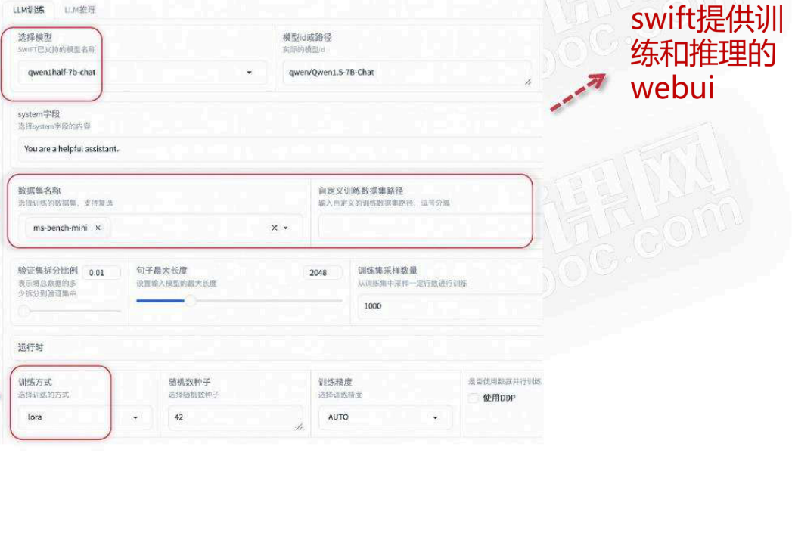

<!-- PDF 第 13 页 -->
<a id="page-013"></a>

<a id="topic-013"></a>

### 微调流程

- 使用ms-swift进行微调：微调的过程

迭代

1. 准备训练集和验证集
2. 选择初始预训练模型（chatglm/qwen/llama等）
3. 微调训练：调参
4. 模型评估

<!-- PDF 第 14 页 -->
<a id="page-014"></a>

<a id="topic-014"></a>

### 训练数据与灾难性遗忘

- 使用ms-swift进行微调：准备训练集和验证集

数据格式

SWIFT支持绝大多数的输入格式

```json
{"query": "", "response": ""}
{"system": "", "query": "", "response": ""}
```

数据从哪里来

针对RAG应用：

1. 构建知识库的文档数据，通过LLM来合成QA数据
2. 线上RAG应用真实QA数据

数据清洗

少量的高质量的数据比大量的低质量的数据效果要好

1. 清洗数据
2. 数据分布的多样性

<!-- PDF 第 15 页 -->
<a id="page-015"></a>


- 使用ms-swift进行微调：准备训练集和验证集

- 考虑灾难性遗忘的问题
  - 灾难性遗忘：微调的本质是修改权重，有可能训练过程中丢掉之前已有的一些能力
  - 适当增加常规数据来微调：除了领域数据以外，增加一下常规任务的数据，来进行多任务学习，避免只学会你的领域数据，而其他能力都丢失了

<!-- PDF 第 16 页 -->
<a id="page-016"></a>

<a id="topic-016"></a>

### LoRA训练参数

- 使用ms-swift进行微调：LoRA训练调参

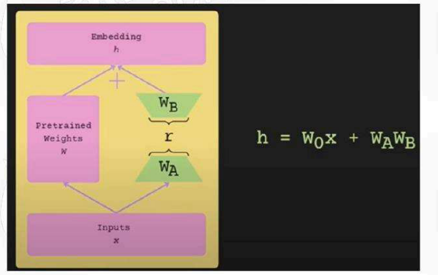

r：确定了学习的参数量，r越大参数越多，学习能力也可能越强。r=16/32

如果你的领域比较接近通用领域可以小一点

alpha :lora+ori 叠加的权重，lora对于模型的影响，alpha=32

<!-- PDF 第 17 页 -->
<a id="page-017"></a>


- 使用ms-swift进行微调：LoRA训练调参

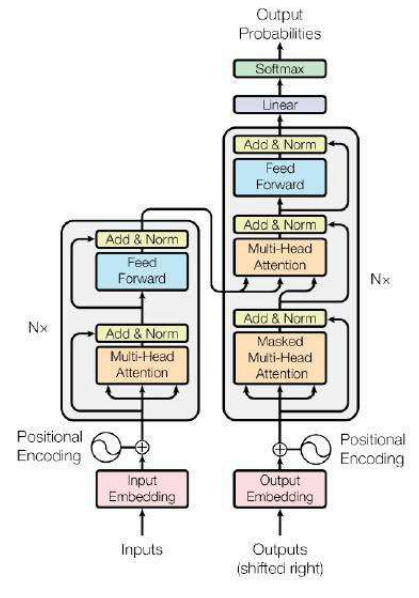

应用的范围：embedding、mult-head attention （q/k/v）、 feed forward、Linear

应用的范围越大，可学习参数就越大、学习能力也可能越强

<!-- PDF 第 18 页 -->
<a id="page-018"></a>


- 使用ms-swift进行微调：LoRA训练调参

学习率 （learning rate）：控制参数更新的幅度，因为是微调，不希望模型有大幅度的变化，学习率一般都设置很小，1e-5


批处理大小（batch size）：控制参数更新的范围，这个受限于你的显卡显存大小

优化器和学习策略：LLM基本是采用adamw的优化器，学习策略是控制学习率的变化

<!-- PDF 第 19 页 -->
<a id="page-019"></a>

<a id="topic-019"></a>

### LoRA训练脚本

- 使用ms-swift进行微调：LoRA训练脚本

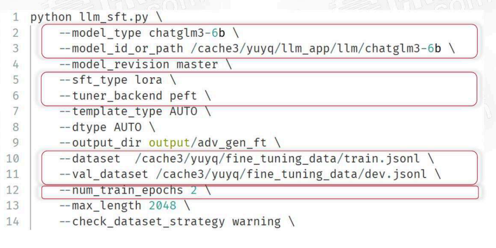

<!-- PDF 第 20 页 -->
<a id="page-020"></a>


- 使用ms-swift进行微调：LoRA训练脚本

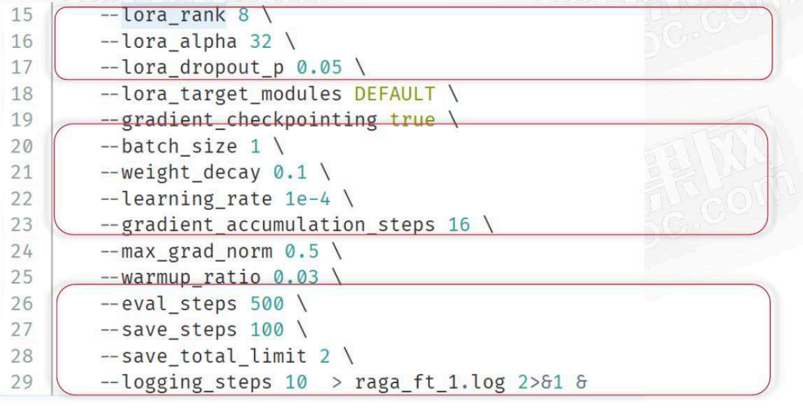

<!-- PDF 第 21 页 -->
<a id="page-021"></a>

<a id="topic-021"></a>

### 训练过程跟踪

- 使用ms-swift进行微调：LoRA训练跟踪

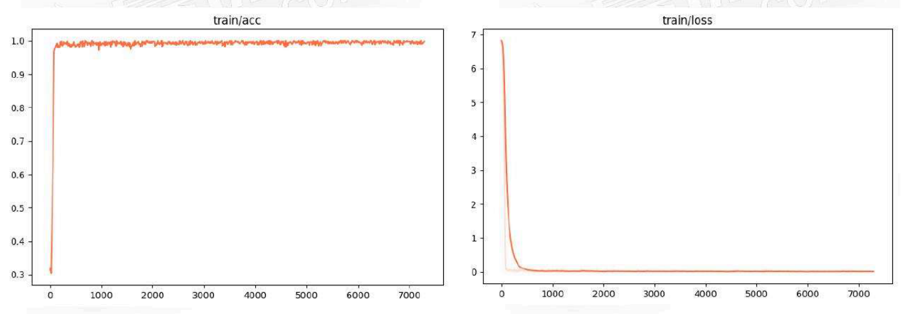

<!-- PDF 第 22 页 -->
<a id="page-022"></a>


- 使用ms-swift进行微调：LoRA训练跟踪

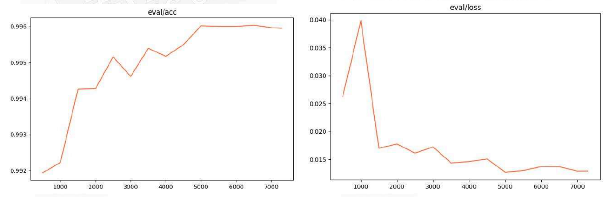

<!-- PDF 第 23 页 -->
<a id="page-023"></a>

## embedding模型微调

<a id="topic-023"></a>

### Embedding微调的适用场景

- embedding模型微调

- embedding模型
  - 基于BERT架构：GTE/BGE

- 开源embedding模型
  - 开源模型效果差：开源模型是在通用数据集训练的，如果你的领域数据比较独特，语义检索匹配的效果比较差
  - 微调：选择对开源模型进行微调，让模型学习你领域的数据，以达到更好检索的目的

<!-- PDF 第 24 页 -->
<a id="page-024"></a>

<a id="topic-024"></a>

### Embedding微调流程

- embedding模型微调过程

迭代

1. 准备训练集和验证集
2. 选择初始预训练模型（gte/bge等）
3. 微调训练：调参
4. 模型评估

<!-- PDF 第 25 页 -->
<a id="page-025"></a>

<a id="topic-025"></a>

### 使用LlamaIndex与Sentence Transformers微调

- 利用llamaindex微调embedding模型

数据从哪里来

针对RAG应用：

1. 构建知识库的文档数据，通过LLM来合成QA数据
2. 线上RAG应用真实QA数据

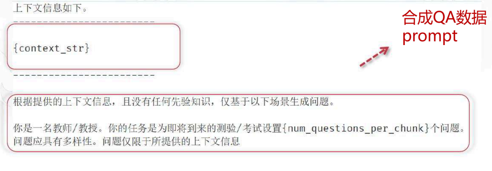

<!-- PDF 第 26 页 -->
<a id="page-026"></a>


- 利用llamaindex微调embedding模型

训练 → 利用sentence\_transformers来微调

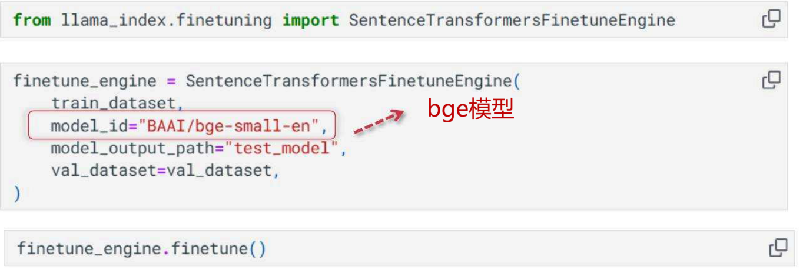

<!-- PDF 第 27 页 -->
<a id="page-027"></a>

## 总结和展望

- 总结

- 模型微调
  - 非必要不微调：微调涉及模型参数的改变，需要高质量的数据进行训练；需要投入一定的成本，设备和数据
  - LoRA：一种参数高效的微调方法，采用low-rank思路，只要极少量的参数就可以进行微调
  - ms-swift：大语言模型微调框架

<!-- PDF 第 28 页 -->
<a id="page-028"></a>


- 总结

- 模型微调
  - 大模型LoRA微调：从数据准备到模型调参，通过ms-swift来微调大语言模型
  - embedding模型sentence_transformers 微调
