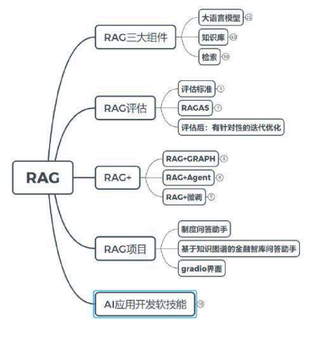

# 课程回顾总结

<!-- PDF 第 1 页 -->

## 目录

- [课程回顾总结](#page-002)
  - [课程知识图谱回顾](#topic-002)
  - [开源项目与技术拓展](#topic-003)
- [AI岗位面试技巧](#page-005)
  - [面试准备](#topic-005)
  - [项目经验与STAR法则](#topic-006)
  - [业务、沟通与学习能力](#topic-007)

---

<!-- PDF 第 2 页 -->

## 课程回顾总结

### 课程知识图谱回顾

- 通过思维导图回顾课程知识点

<!-- PDF 第 3 页 -->

### 开源项目与技术拓展

- 课程扩展

- 学习优秀的开源项目 → RAGFlow、Qanyting fastGPT
- 跟踪最新的RAG技术
  - lightRAG AT-RAG
  - Meta-Chunking Beyond-RAG
  - Reward-RAG TableRAG
  - UncertaintyRAG Open-RAG CoTKR
- 多模态RAG → VisRAG

<!-- PDF 第 4 页 -->

- 课程扩展

- 热门的方向 → GraphRAG RAG+agent
- RAG效率提升 → TurboRAG

<!-- PDF 第 5 页 -->

## AI岗位面试技巧

### 面试准备

- AI岗位面试技巧

- 面试准备
  - 岗位知识点准备：结构化思维，逻辑清晰和层次分明
  - 岗位的匹配度：了解行业公司的招聘要求，进行有针对性的整理
  - 自我介绍准备：不要长篇的背诵简历已有的内容，简要的说明关键点信息

<!-- PDF 第 6 页 -->

### 项目经验与STAR法则

- 项目经验的展示
  - STAR法则：项目的背景，具体的任务，采取的行动，取得了什么结果
  - 结果尽可能量化：尽量用数据和具体例子来说明你的成就
  - 相关性：确保你回答与应聘职位相关，突出你的经验如何能为公司创造价值

<!-- PDF 第 7 页 -->

### 业务、沟通与学习能力

- AI岗位面试技巧

- 公司最看重技能
  - 业务能力：刷下leetcode
  - 软技能：沟通表达能力是一个加分项，清晰有逻辑表达的你思路，这点非常重要
  - 学习能力：可以重点表现你分析问题和解决问题的能力或者学习能力，学习能力不是说你学习了什么，而是体现你如何去学习，这些能力体现的是个人的成长能力
